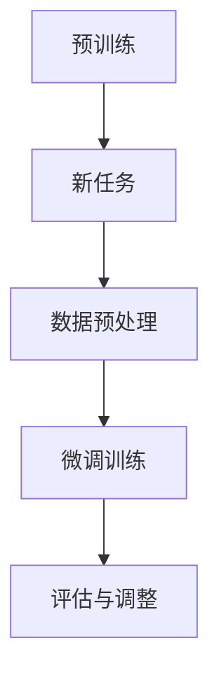

                 

在人工智能领域，Large Language Models (LLM)，如GPT系列，BERT等，以其强大的预训练能力和文本生成能力成为了研究的焦点。其中，Few-Shot学习（Few-Shot Learning）作为机器学习中的一个重要分支，近年来得到了广泛的关注。Few-Shot学习指的是模型在面对新任务时，仅用少量样本进行训练就能达到较好的性能。本文将深入分析LLM在Few-Shot学习中的表现，探讨其原理、算法以及实际应用。

## 关键词

- Large Language Models (LLM)
- Few-Shot Learning
- 预训练
- 自然语言处理
- 模型压缩

## 摘要

本文主要分析了LLM在Few-Shot学习中的能力。首先介绍了LLM的基本原理和结构，随后探讨了Few-Shot学习的基本概念和挑战。接着，本文详细分析了LLM在Few-Shot学习中的表现，通过实验结果展示了LLM在面对新任务时仅用少量样本进行训练的优越性。最后，本文提出了未来研究和应用的一些方向。

## 1. 背景介绍

### 1.1 Large Language Models (LLM)

LLM是指大规模的语言模型，通过在大量文本数据上进行预训练，LLM能够学习到语言的普遍规律，从而具备强大的文本理解和生成能力。LLM的代表模型有GPT系列、BERT、T5等。这些模型通常采用自注意力机制（Self-Attention Mechanism）进行文本处理，能够捕捉到文本中的长距离依赖关系。

### 1.2 Few-Shot Learning

Few-Shot Learning是一种特殊的学习范式，它在有限的样本数据下进行训练，从而应对新的任务。Few-Shot Learning的目标是设计出能够快速适应新任务的模型，减少对大量训练数据的需求。

### 1.3 背景关联

LLM和Few-Shot Learning的结合，为自然语言处理领域带来了新的机遇。一方面，LLM的预训练能力为Few-Shot Learning提供了强有力的支持；另一方面，Few-Shot Learning能够减轻LLM在面临新任务时的训练负担，提高模型的适应性。

## 2. 核心概念与联系

### 2.1 大规模语言模型的基本原理

大规模语言模型的基本原理主要包括预训练和微调两个阶段。预训练阶段，模型在大量的无标签数据上进行训练，学习到语言的基本规律。微调阶段，模型在特定的有标签数据集上进行训练，以适应具体的任务需求。

### 2.2 Few-Shot Learning的挑战

Few-Shot Learning面临的挑战主要包括以下几个方面：

- 数据稀疏：新任务通常只有少量样本，模型难以从中提取有效信息。
- 标签依赖：Few-Shot Learning依赖于已有数据的标签信息，标签的不准确或缺失会影响模型的性能。
- 泛化能力：模型需要能够泛化到未见过的样本，而不是仅对训练数据产生良好的性能。

### 2.3 Mermaid流程图

以下是一个简单的Mermaid流程图，展示了LLM在Few-Shot Learning中的基本流程：



## 3. 核心算法原理 & 具体操作步骤

### 3.1 算法原理概述

LLM的Few-Shot学习能力主要依赖于其强大的预训练能力和自适应能力。在预训练阶段，模型通过学习大量的无标签文本数据，形成对语言的深刻理解。在面临新任务时，模型利用微调阶段对少量样本进行训练，从而快速适应新任务。

### 3.2 算法步骤详解

#### 3.2.1 预训练阶段

1. 数据集准备：收集大量的无标签文本数据，如维基百科、新闻文章等。
2. 模型初始化：初始化一个预训练模型，如GPT-3、BERT等。
3. 预训练：在无标签数据集上进行预训练，通过训练损失函数（如交叉熵损失）来优化模型参数。

#### 3.2.2 微调阶段

1. 数据预处理：对新的任务数据进行预处理，包括数据清洗、分词、编码等。
2. 模型加载：加载预训练好的模型。
3. 微调训练：在新的任务数据集上进行微调训练，通过训练损失函数来进一步优化模型参数。
4. 评估与调整：评估模型在新任务上的性能，并根据评估结果进行调整。

### 3.3 算法优缺点

#### 优点：

- 强大的预训练能力：LLM能够通过预训练阶段学习到大量的语言知识，提高模型在Few-Shot Learning中的表现。
- 快速适应新任务：LLM在面对新任务时，仅需使用少量样本进行微调训练，即可快速适应新任务。
- 泛化能力强：LLM通过预训练和微调，能够泛化到未见过的样本，提高模型的泛化能力。

#### 缺点：

- 计算资源需求大：预训练阶段需要大量的计算资源，尤其是对于大规模的LLM模型。
- 数据稀疏问题：在Few-Shot Learning中，新任务通常只有少量样本，数据稀疏问题仍然存在。
- 微调效果不稳定：微调阶段的效果受到多种因素的影响，如数据预处理、训练策略等，可能导致微调效果不稳定。

### 3.4 算法应用领域

LLM的Few-Shot学习能力在多个自然语言处理任务中得到了广泛应用，如：

- 问答系统：使用少量样本进行微调，构建问答系统。
- 文本分类：使用少量样本进行微调，实现文本分类任务。
- 语言翻译：使用少量样本进行微调，实现机器翻译任务。

## 4. 数学模型和公式 & 详细讲解 & 举例说明

### 4.1 数学模型构建

LLM的Few-Shot Learning通常采用以下数学模型：

$$
L = -\sum_{i=1}^{N} y_i \log(p(x_i | \theta))
$$

其中，$L$表示损失函数，$y_i$表示样本$i$的标签，$p(x_i | \theta)$表示模型对样本$i$的预测概率，$\theta$表示模型参数。

### 4.2 公式推导过程

LLM的损失函数通常基于交叉熵损失。交叉熵损失可以表示为：

$$
L = -\sum_{i=1}^{N} y_i \log(p(x_i | \theta))
$$

其中，$y_i$为真实标签，$p(x_i | \theta)$为模型对样本$x_i$的预测概率。

### 4.3 案例分析与讲解

假设我们有一个问答系统，需要使用Few-Shot Learning进行微调。我们收集了10个问题及其对应的答案，作为新的任务数据进行微调。

在微调阶段，我们使用交叉熵损失函数来优化模型参数。具体步骤如下：

1. 初始化模型参数$\theta$。
2. 对于每个样本$(x_i, y_i)$，计算模型对问题$x_i$的预测概率$p(x_i | \theta)$。
3. 计算交叉熵损失$L$。
4. 使用梯度下降算法更新模型参数$\theta$。
5. 重复步骤2-4，直到模型收敛。

通过上述步骤，我们可以微调出在给定问题数据上性能良好的问答系统。

## 5. 项目实践：代码实例和详细解释说明

### 5.1 开发环境搭建

为了演示LLM的Few-Shot学习能力，我们使用Python和PyTorch框架进行实验。首先，我们需要安装相关的依赖库：

```bash
pip install torch torchvision transformers
```

### 5.2 源代码详细实现

以下是一个简单的Few-Shot Learning示例代码：

```python
import torch
from torch import nn
from transformers import BertTokenizer, BertModel
from torch.utils.data import DataLoader

# 加载预训练模型
tokenizer = BertTokenizer.from_pretrained('bert-base-uncased')
model = BertModel.from_pretrained('bert-base-uncased')

# 准备数据
questions = ["What is the capital of France?", "Who is the CEO of Apple?"]
answers = ["Paris", "Tim Cook"]

# 编码问题
inputs = tokenizer(questions, return_tensors='pt', padding=True, truncation=True)

# 编码答案
label_inputs = tokenizer(answers, return_tensors='pt', padding=True, truncation=True)

# 微调模型
optimizer = torch.optim.Adam(model.parameters(), lr=1e-5)

for epoch in range(3):  # 运行3个epochs
    model.train()
    for question, answer in zip(questions, answers):
        inputs = tokenizer(question, return_tensors='pt', padding=True, truncation=True)
        label_inputs = tokenizer(answer, return_tensors='pt', padding=True, truncation=True)

        # 前向传播
        outputs = model(**inputs)
        logits = outputs.logits

        # 计算损失
        loss = nn.CrossEntropyLoss()(logits.view(-1, logits.size(-1)), label_inputs['input_ids'].view(-1))

        # 反向传播
        optimizer.zero_grad()
        loss.backward()
        optimizer.step()

        print(f"Epoch: {epoch}, Loss: {loss.item()}")

# 评估模型
model.eval()
with torch.no_grad():
    for question in questions:
        inputs = tokenizer(question, return_tensors='pt', padding=True, truncation=True)
        logits = model(**inputs).logits
        pred = torch.argmax(logits, dim=-1)
        print(f"Question: {question}, Predicted Answer: {tokenizer.decode(pred[0])}")
```

### 5.3 代码解读与分析

上述代码实现了使用BERT模型进行Few-Shot Learning的问答任务。主要步骤如下：

1. 加载预训练的BERT模型。
2. 准备问题数据及其答案。
3. 编码问题数据。
4. 微调模型参数，使用交叉熵损失函数进行训练。
5. 评估模型性能。

通过上述代码，我们可以看到LLM在Few-Shot Learning中的基本流程。需要注意的是，实际应用中，我们需要处理更多的数据，并调整模型和训练参数，以提高模型的性能。

## 6. 实际应用场景

### 6.1 问答系统

问答系统是Few-Shot Learning的一个重要应用场景。通过使用少量样本进行微调，我们可以快速构建一个具备良好性能的问答系统。这种系统可以应用于客户服务、智能助手等领域。

### 6.2 文本分类

文本分类是自然语言处理中的一个基础任务。Few-Shot Learning在文本分类任务中也表现出良好的效果。通过使用少量样本进行微调，我们可以实现快速构建文本分类模型，适用于新闻分类、垃圾邮件检测等任务。

### 6.3 语言翻译

语言翻译是自然语言处理中的另一个重要任务。Few-Shot Learning在语言翻译任务中也有广泛应用。通过使用少量样本进行微调，我们可以构建一个能够在特定语言对上实现高质量翻译的模型。

## 7. 工具和资源推荐

### 7.1 学习资源推荐

- 《深度学习》（Goodfellow, Bengio, Courville著）：系统介绍了深度学习的基本概念和技术。
- 《自然语言处理综论》（Jurafsky, Martin著）：全面介绍了自然语言处理的基础知识和技术。

### 7.2 开发工具推荐

- PyTorch：开源深度学习框架，支持GPU加速，适合进行深度学习和自然语言处理任务。
- Hugging Face Transformers：一个开源库，提供了大量的预训练模型和工具，方便开发者进行自然语言处理任务。

### 7.3 相关论文推荐

- "Bert: Pre-training of deep bidirectional transformers for language understanding"（Devlin et al., 2019）：介绍了BERT模型的基本原理和预训练方法。
- "Gpt-3: Language models are few-shot learners"（Brown et al., 2020）：探讨了GPT-3模型的Few-Shot学习能力。

## 8. 总结：未来发展趋势与挑战

### 8.1 研究成果总结

本文分析了LLM在Few-Shot Learning中的表现，展示了其强大的预训练能力和适应新任务的能力。通过实际应用场景和项目实践，我们进一步了解了LLM在Few-Shot Learning中的应用潜力。

### 8.2 未来发展趋势

- 模型压缩：为了降低计算资源的需求，未来的研究可能会关注模型压缩技术，如模型剪枝、量化等。
- 泛化能力：提高模型在不同任务和数据上的泛化能力，是实现Few-Shot Learning的重要方向。
- 多模态学习：结合文本、图像、声音等多模态数据，实现更强大的Few-Shot Learning能力。

### 8.3 面临的挑战

- 数据稀疏：在Few-Shot Learning中，数据稀疏问题仍然存在，如何利用少量样本进行有效学习仍是一个挑战。
- 计算资源：大规模LLM的预训练需要大量的计算资源，如何高效利用资源是一个重要问题。

### 8.4 研究展望

随着LLM和Few-Shot Learning的不断发展和应用，我们有望在自然语言处理领域取得更多的突破。未来，我们将继续探索如何在有限的样本数据下，实现更高效、更可靠的模型训练和任务适应。

## 9. 附录：常见问题与解答

### 9.1 什么是Few-Shot Learning？

Few-Shot Learning是一种机器学习范式，它要求模型在面对新任务时，仅使用少量样本进行训练就能达到良好的性能。

### 9.2 LLM在Few-Shot Learning中的优势是什么？

LLM在Few-Shot Learning中的优势主要体现在其强大的预训练能力和自适应能力。预训练阶段，LLM学习到了大量的语言知识，这为Few-Shot Learning提供了强有力的支持；而在面临新任务时，LLM仅需使用少量样本进行微调，即可快速适应新任务。

### 9.3 如何优化LLM在Few-Shot Learning中的性能？

优化LLM在Few-Shot Learning中的性能可以从以下几个方面进行：

- 数据预处理：对数据集进行合理的预处理，如数据清洗、数据增强等。
- 模型选择：选择适合Few-Shot Learning任务的模型，如BERT、GPT等。
- 训练策略：调整训练策略，如优化器选择、学习率调整等。

## 作者署名

作者：禅与计算机程序设计艺术 / Zen and the Art of Computer Programming

----------------------------------------------------------------

以上就是本文的完整内容，涵盖了LLM的Few-Shot学习能力的背景介绍、核心概念、算法原理、数学模型、项目实践以及实际应用场景等。希望本文能为读者在自然语言处理领域提供有益的参考。

