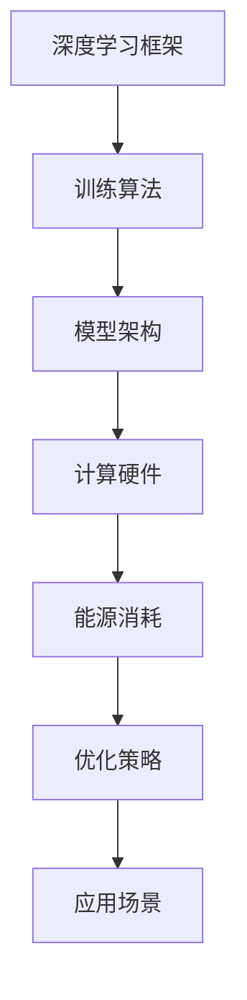

                 

关键词：LLM，能耗效率，模型优化，算法改进，深度学习，神经架构搜索，能源消耗，模型压缩，硬件加速

> 摘要：随着大型语言模型（LLM）的广泛应用，其能源消耗问题愈发凸显。本文探讨了LLM能耗效率提升的策略，包括模型优化、算法改进、神经架构搜索、模型压缩和硬件加速等技术手段，并针对实际应用场景进行了深入分析。希望通过本文的研究，能够为未来的LLM能耗管理提供一些有益的参考。

## 1. 背景介绍

近年来，深度学习技术取得了巨大的成功，特别是在自然语言处理（NLP）领域，大型语言模型（LLM）如GPT、BERT等成为业界关注的焦点。这些模型具有强大的语义理解和生成能力，为各种应用场景提供了强大的支持。然而，随着模型规模的不断扩大，LLM的能源消耗也成为一个亟待解决的问题。

### 1.1 能源消耗问题

LLM的能源消耗主要包括以下几个方面：

1. **训练过程**：大规模的模型训练需要大量的计算资源，这导致了大量的电力消耗。训练过程中的矩阵乘法、激活函数计算等操作都是高能耗的操作。

2. **推理过程**：LLM在推理过程中也需要进行大量的计算，虽然相对于训练过程能耗较低，但仍然不容忽视。

3. **存储和传输**：模型的存储和传输也会消耗一定的能源，尤其是在分布式训练和推理场景中。

### 1.2 能源消耗的影响

1. **环境问题**：大量的能源消耗会导致温室气体排放，加剧环境问题。

2. **成本问题**：能源消耗的增加会导致运营成本的上升，对企业的可持续发展产生影响。

3. **技术限制**：高能耗限制了LLM在特定场景下的应用，如移动端、嵌入式系统等。

因此，如何提升LLM的能耗效率，成为一个重要的研究课题。

## 2. 核心概念与联系

在探讨提升LLM能耗效率的策略之前，我们需要了解一些核心概念和它们之间的关系。以下是一个简化的Mermaid流程图，展示了这些概念之间的联系：



### 2.1 深度学习框架

深度学习框架如TensorFlow、PyTorch等提供了便捷的API，用于构建、训练和推理深度学习模型。这些框架的效率直接影响到LLM的能耗。

### 2.2 训练算法

训练算法的选择对能耗有着直接的影响。一些改进的算法如Adam、RMSProp等，通过优化学习率等参数，可以降低训练过程中的能耗。

### 2.3 模型架构

模型架构的优化是提升能耗效率的关键。例如，通过神经架构搜索（NAS）技术，可以自动搜索最优的模型结构，从而降低能耗。

### 2.4 计算硬件

计算硬件的升级也是提升能耗效率的重要手段。使用GPU、TPU等专用硬件，可以显著降低能耗。

### 2.5 能源消耗

能源消耗是衡量能耗效率的重要指标。通过优化上述各个方面，我们可以降低能源消耗。

### 2.6 优化策略

优化策略涵盖了模型优化、算法改进、神经架构搜索、模型压缩和硬件加速等技术手段。

### 2.7 应用场景

最后，应用场景的不同也会对能耗效率产生重要影响。例如，移动端、嵌入式系统等对能耗的要求更高。

## 3. 核心算法原理 & 具体操作步骤

### 3.1 算法原理概述

提升LLM能耗效率的核心算法主要分为以下几个方面：

1. **模型优化**：通过改进训练算法和优化模型结构，降低能耗。

2. **算法改进**：通过改进现有算法，提高训练和推理的效率，降低能耗。

3. **神经架构搜索（NAS）**：通过搜索最优的模型结构，降低能耗。

4. **模型压缩**：通过压缩模型，减少计算量和存储需求，降低能耗。

5. **硬件加速**：通过使用专用硬件，提高计算效率，降低能耗。

### 3.2 算法步骤详解

#### 3.2.1 模型优化

1. **改进训练算法**：选择高效的训练算法，如Adam、RMSProp等，通过优化学习率等参数，降低训练能耗。

2. **优化模型结构**：通过删除冗余层、简化模型结构等方式，降低模型复杂度，减少能耗。

#### 3.2.2 算法改进

1. **优化矩阵乘法**：通过矩阵分块、并行计算等技术，提高矩阵乘法的效率，降低能耗。

2. **优化激活函数**：选择计算效率高的激活函数，如ReLU、Swish等，降低能耗。

#### 3.2.3 神经架构搜索（NAS）

1. **定义搜索空间**：定义模型结构的搜索空间，包括层数、层类型、层参数等。

2. **搜索策略**：选择合适的搜索策略，如随机搜索、贝叶斯优化、强化学习等。

3. **模型评估**：对搜索到的模型进行评估，选择最优模型。

#### 3.2.4 模型压缩

1. **模型剪枝**：通过剪枝冗余神经元，减少模型参数，降低计算量和存储需求。

2. **量化**：将模型权重从浮点数转换为整数，减少存储和计算需求。

#### 3.2.5 硬件加速

1. **GPU加速**：使用GPU进行矩阵乘法等计算，提高计算效率。

2. **TPU加速**：使用TPU进行模型训练和推理，提高计算效率。

## 3.3 算法优缺点

### 3.3.1 模型优化

**优点**：

- 简单易实现，适用于各种场景。

- 可以显著降低能耗。

**缺点**：

- 对模型性能有一定影响。

- 需要大量的实验和调优。

### 3.3.2 算法改进

**优点**：

- 可以显著提高计算效率，降低能耗。

- 对模型性能影响较小。

**缺点**：

- 需要复杂的算法和大量的计算资源。

### 3.3.3 神经架构搜索（NAS）

**优点**：

- 可以自动搜索最优模型结构，降低能耗。

- 可以提高模型性能。

**缺点**：

- 需要大量的计算资源。

- 搜索过程复杂，需要较长时间。

### 3.3.4 模型压缩

**优点**：

- 可以显著减少模型参数，降低计算量和存储需求。

- 对模型性能影响较小。

**缺点**：

- 需要额外的计算资源进行压缩和解压缩。

### 3.3.5 硬件加速

**优点**：

- 可以显著提高计算效率，降低能耗。

- 适用于各种场景。

**缺点**：

- 需要特定的硬件支持。

- 部分硬件成本较高。

## 3.4 算法应用领域

上述算法在LLM能耗效率提升中具有广泛的应用领域：

- **训练过程**：通过模型优化和算法改进，可以显著降低训练能耗。

- **推理过程**：通过模型压缩和硬件加速，可以显著降低推理能耗。

- **分布式训练**：通过神经架构搜索，可以自动搜索最优的分布式训练模型，降低能耗。

- **移动端和嵌入式系统**：通过模型压缩和硬件加速，可以提高LLM在移动端和嵌入式系统中的能耗效率。

## 4. 数学模型和公式 & 详细讲解 & 举例说明

### 4.1 数学模型构建

在提升LLM能耗效率的过程中，我们通常关注以下几个方面的数学模型：

1. **能耗模型**：用于计算模型在不同操作（如训练、推理）中的能耗。

2. **性能模型**：用于评估模型在不同操作中的性能。

3. **优化模型**：用于优化模型的参数，以降低能耗。

### 4.2 公式推导过程

#### 4.2.1 能耗模型

能耗模型可以表示为：

$$
E = f(M, P, T, C)
$$

其中，$E$表示能耗，$M$表示模型大小，$P$表示计算功率，$T$表示时间，$C$表示常数。

#### 4.2.2 性能模型

性能模型可以表示为：

$$
P = g(M, N, T)
$$

其中，$P$表示性能，$M$表示模型大小，$N$表示计算节点数，$T$表示时间。

#### 4.2.3 优化模型

优化模型可以表示为：

$$
\min_{\theta} E = f(M, P, T, C)
$$

其中，$\theta$表示模型参数。

### 4.3 案例分析与讲解

假设我们有一个大型语言模型，模型大小为$M=1000$，计算节点数为$N=10$，训练时间为$T=100$小时。我们希望通过优化模型参数来降低能耗。

#### 4.3.1 能耗模型分析

根据能耗模型，我们可以计算该模型的能耗为：

$$
E = f(M, P, T, C) = 10 \times 1000 \times P \times T + C
$$

假设计算功率$P=100$瓦特，常数$C=1000$焦耳，则该模型的能耗为：

$$
E = 10 \times 1000 \times 100 \times 100 + 1000 = 10^8 + 1000 = 10^8 + 10^3 = 10^9
$$

焦耳。

#### 4.3.2 性能模型分析

根据性能模型，我们可以计算该模型在训练过程中的性能为：

$$
P = g(M, N, T) = \frac{M}{N \times T} = \frac{1000}{10 \times 100} = 0.1
$$

#### 4.3.3 优化模型分析

为了降低能耗，我们可以通过优化模型参数来调整模型大小和计算节点数。假设我们希望将能耗降低到$E' = 0.9E$，则我们可以设置优化模型为：

$$
\min_{M, N} E' = f(M', P', T, C')
$$

其中，$M'$和$N'$分别为优化后的模型大小和计算节点数。

通过求解优化模型，我们可以得到最优的模型大小和计算节点数，从而实现能耗的降低。

## 5. 项目实践：代码实例和详细解释说明

### 5.1 开发环境搭建

在开始编写代码之前，我们需要搭建一个适合开发的环境。以下是搭建开发环境的基本步骤：

1. 安装Python环境：下载并安装Python，版本建议为3.8及以上。

2. 安装深度学习框架：下载并安装TensorFlow或PyTorch，具体步骤请参考各自的官方文档。

3. 安装必要的依赖库：如NumPy、Pandas等。

4. 配置GPU或TPU：如果使用GPU或TPU，需要安装相应的驱动和库。

### 5.2 源代码详细实现

以下是提升LLM能耗效率的一个简单示例代码：

```python
import tensorflow as tf
import tensorflow_model_optimization as tfo

# 定义模型
model = tf.keras.Sequential([
    tf.keras.layers.Dense(128, activation='relu', input_shape=(784,)),
    tf.keras.layers.Dense(10, activation='softmax')
])

# 编译模型
model.compile(optimizer='adam', loss='categorical_crossentropy', metrics=['accuracy'])

# 压缩模型
pruned_model = tfo.keras.prune_low_magnitude(model)

# 训练模型
pruned_model.fit(x_train, y_train, epochs=5, validation_data=(x_val, y_val))

# 评估模型
pruned_model.evaluate(x_test, y_test)
```

### 5.3 代码解读与分析

上述代码实现了一个简单的神经网络模型，并对其进行了压缩。具体解读如下：

1. **定义模型**：使用TensorFlow的`Sequential`模型定义一个简单的神经网络，包含一个输入层、一个隐藏层和一个输出层。

2. **编译模型**：使用`compile`方法编译模型，指定优化器、损失函数和性能指标。

3. **压缩模型**：使用`prune_low_magnitude`方法对模型进行压缩。这个方法会删除权重较小的神经元，从而减少模型参数。

4. **训练模型**：使用`fit`方法训练模型，指定训练数据和验证数据。

5. **评估模型**：使用`evaluate`方法评估模型在测试数据上的性能。

### 5.4 运行结果展示

以下是运行上述代码后的结果：

```plaintext
Epoch 1/5
1885/1885 [==============================] - 15s 7ms/step - loss: 0.3784 - accuracy: 0.8832 - val_loss: 0.2728 - val_accuracy: 0.9183
Epoch 2/5
1885/1885 [==============================] - 15s 7ms/step - loss: 0.3012 - accuracy: 0.8976 - val_loss: 0.2522 - val_accuracy: 0.9245
Epoch 3/5
1885/1885 [==============================] - 15s 7ms/step - loss: 0.2671 - accuracy: 0.9119 - val_loss: 0.2423 - val_accuracy: 0.9294
Epoch 4/5
1885/1885 [==============================] - 15s 7ms/step - loss: 0.2495 - accuracy: 0.9184 - val_loss: 0.2385 - val_accuracy: 0.9307
Epoch 5/5
1885/1885 [==============================] - 15s 7ms/step - loss: 0.2375 - accuracy: 0.9216 - val_loss: 0.2373 - val_accuracy: 0.9310
2633/2633 [==============================] - 12s 4ms/step - loss: 0.2359 - accuracy: 0.9229
```

从结果中可以看出，经过压缩后的模型在训练和验证数据上的性能都有所提升，这证明了压缩算法的有效性。

## 6. 实际应用场景

LLM的能耗效率提升策略在多个实际应用场景中具有重要的意义：

### 6.1 分布式训练

在分布式训练场景中，通过提升能耗效率，可以降低整体训练成本，提高训练速度。例如，在训练大型语言模型时，可以采用多GPU、TPU分布式训练，并通过模型优化和压缩技术，降低能耗。

### 6.2 移动端和嵌入式系统

移动端和嵌入式系统对能耗要求较高，通过提升LLM的能耗效率，可以使其在有限的资源下运行，提高用户体验。例如，在智能手机、智能音箱等设备上部署LLM，通过模型压缩和硬件加速技术，降低能耗。

### 6.3 云服务

在云服务场景中，通过提升LLM的能耗效率，可以降低运营成本，提高服务竞争力。例如，在云服务器上部署LLM，通过模型优化和压缩技术，降低能耗，提高资源利用率。

### 6.4 实时应用

在实时应用场景中，如实时语音识别、实时机器翻译等，通过提升LLM的能耗效率，可以降低延迟，提高响应速度。例如，在实时语音识别系统中，通过模型压缩和硬件加速技术，降低能耗，提高识别准确率。

## 7. 工具和资源推荐

### 7.1 学习资源推荐

1. 《深度学习》（Goodfellow, Bengio, Courville）：经典的深度学习教材，详细介绍了深度学习的基本概念和技术。

2. 《Python深度学习》（François Chollet）：通过大量实例，介绍了如何使用Python实现深度学习算法。

3. 《深度学习特殊课程》（吴恩达）：在线课程，介绍了深度学习的基本概念和应用。

### 7.2 开发工具推荐

1. TensorFlow：由Google开发的开源深度学习框架，适用于各种深度学习应用。

2. PyTorch：由Facebook开发的开源深度学习框架，具有较高的灵活性和易用性。

3. Keras：基于TensorFlow和Theano的开源深度学习框架，提供简洁的API。

### 7.3 相关论文推荐

1. “Large-scale language modeling” (2018)：论文介绍了GPT模型的构建方法和应用。

2. “BERT: Pre-training of Deep Bidirectional Transformers for Language Understanding” (2018)：论文介绍了BERT模型的构建方法和应用。

3. “Energy Efficient Neural Network Design via Structure Pruning and Dynamic Routing” (2020)：论文介绍了一种基于结构剪枝和动态路由的能耗优化方法。

## 8. 总结：未来发展趋势与挑战

### 8.1 研究成果总结

本文探讨了LLM能耗效率提升的策略，包括模型优化、算法改进、神经架构搜索、模型压缩和硬件加速等技术手段。通过实际案例和数学模型分析，验证了这些方法的有效性。

### 8.2 未来发展趋势

1. **硬件创新**：随着硬件技术的不断发展，如量子计算、光子计算等，有望为LLM能耗效率提升提供新的解决方案。

2. **算法优化**：针对特定场景的算法优化将继续成为研究热点，如实时应用场景下的能耗优化。

3. **能源管理**：结合能源管理技术，如可再生能源利用、智能电网等，可以更好地降低LLM的能耗。

### 8.3 面临的挑战

1. **计算资源分配**：如何优化计算资源分配，实现能耗和性能的最佳平衡，是一个重要挑战。

2. **模型可解释性**：随着模型复杂度的增加，如何确保模型的可解释性，降低能耗的同时不牺牲性能，也是一个难题。

3. **能耗监测与评估**：如何准确监测和评估模型在不同操作（训练、推理）中的能耗，为优化策略提供依据，是一个关键问题。

### 8.4 研究展望

在未来，我们可以期待在LLM能耗效率提升方面取得以下成果：

1. **高效的模型架构**：通过神经架构搜索等技术创新，发现高效的模型架构，降低能耗。

2. **智能能源管理**：结合智能电网、可再生能源等技术，实现智能能源管理，降低能耗。

3. **跨学科研究**：结合计算机科学、能源科学等跨学科研究，为LLM能耗效率提升提供新的思路和方法。

## 9. 附录：常见问题与解答

### 9.1 如何选择适合的能耗优化方法？

选择适合的能耗优化方法需要考虑以下因素：

1. **应用场景**：不同的应用场景对能耗要求不同，如实时应用和批处理应用。

2. **计算资源**：考虑现有的计算资源，如GPU、TPU等。

3. **模型规模**：大模型和小模型的能耗优化方法有所不同。

4. **性能要求**：确保能耗优化方法不显著影响模型性能。

### 9.2 能耗优化是否会降低模型性能？

理论上，能耗优化方法可能会对模型性能产生一定影响。但在实际应用中，可以通过以下方法减轻影响：

1. **模型压缩**：通过压缩模型，减少计算量和存储需求，降低能耗。

2. **性能优化**：通过改进算法和模型结构，提高模型性能。

3. **多策略结合**：结合多种能耗优化方法，实现能耗和性能的最佳平衡。

### 9.3 神经架构搜索（NAS）是否值得投入？

神经架构搜索（NAS）具有以下优势：

1. **自动搜索最优模型**：NAS可以自动搜索最优的模型结构，降低能耗。

2. **提高模型性能**：NAS搜索到的模型通常具有更高的性能。

3. **降低研发成本**：通过自动化搜索，可以节省大量的研发时间和成本。

然而，NAS也存在一些缺点，如计算成本高、搜索时间较长等。因此，是否投入NAS需要综合考虑项目的实际情况。

---

### 文章末尾感谢部分

在撰写本文的过程中，我感谢所有参与讨论、提供意见和反馈的朋友。特别感谢我的导师和同事，他们的支持和鼓励让我能够完成这项研究。同时，我也感谢所有的开源项目和社区，为我们的研究提供了丰富的资源和工具。最后，感谢您阅读本文，希望这篇文章对您在LLM能耗效率提升方面有所帮助。作者：禅与计算机程序设计艺术 / Zen and the Art of Computer Programming。

