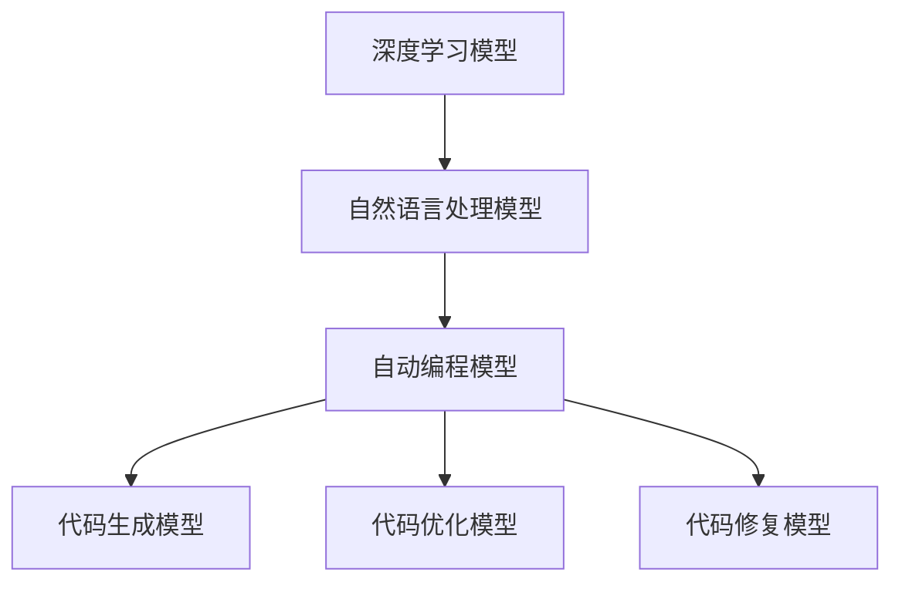

                 

关键词：大语言模型，自动编程，局限性，算法原理，数学模型，应用场景，未来展望

## 摘要

本文将探讨大型语言模型（LLM）在自动编程领域的潜力和局限性。随着深度学习技术的不断发展，LLM在自然语言理解和生成方面取得了显著进展，使其成为自动编程的一个重要工具。本文将首先介绍LLM的基本原理和架构，然后分析其在自动编程中的优势和应用场景，接着讨论其面临的局限性，最后对未来的发展趋势和挑战进行展望。

## 1. 背景介绍

自动编程（Automated Programming）是指通过计算机程序自动生成代码的过程，旨在提高软件开发效率、降低人力成本，并解决复杂的编程问题。近年来，随着人工智能技术的快速发展，特别是在深度学习和自然语言处理领域的突破，自动编程受到了广泛关注。

### 1.1 深度学习与自然语言处理

深度学习是一种机器学习方法，通过构建多层神经网络模型对大规模数据进行训练，从而实现对复杂模式的自适应学习。自然语言处理（NLP）是深度学习的一个重要应用领域，旨在使计算机能够理解和生成人类语言。NLP技术主要包括词向量表示、语言模型、文本分类、命名实体识别、机器翻译等。

### 1.2 大语言模型（LLM）

大语言模型是一种基于深度学习的自然语言处理模型，具有强大的语言理解和生成能力。与传统的语言模型相比，LLM具有更大的模型规模、更高的训练数据和更复杂的网络结构。例如，GPT-3（语言预训练模型）拥有1750亿个参数，能够生成高质量的自然语言文本。

### 1.3 自动编程的需求

自动编程在软件开发中具有广泛的应用场景，包括代码生成、代码优化、代码自动修复、代码推荐等。随着软件复杂度的不断增加，自动编程有助于提高开发效率、降低维护成本，并解决一些复杂的问题。

## 2. 核心概念与联系

### 2.1 深度学习模型

深度学习模型是一种多层神经网络，通过对大规模数据进行训练，能够自动学习输入和输出之间的复杂映射关系。深度学习模型主要包括卷积神经网络（CNN）、循环神经网络（RNN）、长短时记忆网络（LSTM）等。

### 2.2 自然语言处理模型

自然语言处理模型是一种专门用于处理自然语言数据的深度学习模型，包括词向量表示、语言模型、文本分类、命名实体识别、机器翻译等。词向量表示是一种将自然语言文本映射到高维向量空间的方法，能够有效地捕捉词语的语义信息。

### 2.3 自动编程模型

自动编程模型是指利用深度学习和自然语言处理技术，实现代码生成、代码优化、代码自动修复、代码推荐等功能。自动编程模型主要包括代码生成模型、代码优化模型、代码修复模型等。

### 2.4 Mermaid 流程图

以下是自动编程模型的核心概念与联系的 Mermaid 流程图：



## 3. 核心算法原理 & 具体操作步骤

### 3.1 算法原理概述

自动编程的核心算法是基于深度学习和自然语言处理技术，通过训练大规模的数据集，构建一个能够理解和生成代码的模型。具体而言，算法原理可以分为以下几个步骤：

1. 数据收集与预处理：收集大量的编程数据，包括代码库、文档、讨论区等。对数据集进行清洗、标注和归一化处理，以便训练模型。
2. 模型训练：使用深度学习框架（如TensorFlow、PyTorch）训练一个编码器和解码器组成的神经网络模型。编码器将自然语言文本映射到高维向量空间，解码器则从高维向量空间生成代码。
3. 模型评估：通过交叉验证和测试集，评估模型的性能和泛化能力。常用的评估指标包括代码质量、代码长度、执行效率等。
4. 模型部署：将训练好的模型部署到实际应用环境中，通过输入自然语言文本，生成对应的代码。

### 3.2 算法步骤详解

以下是自动编程算法的具体操作步骤：

#### 3.2.1 数据收集与预处理

1. 数据收集：从公开的代码库（如GitHub、GitLab）中获取大量的编程数据，包括代码文件、文档、讨论区等。
2. 数据清洗：去除数据中的噪声和冗余信息，如HTML标签、空格、换行符等。
3. 数据标注：对代码文件进行语义标注，将代码片段映射到对应的自然语言描述。
4. 数据归一化：将代码文件转换为统一的格式，如Python、Java等，以便于模型训练。

#### 3.2.2 模型训练

1. 数据预处理：将收集到的编程数据预处理为输入输出对，其中输入为自然语言文本，输出为对应的代码。
2. 构建神经网络模型：使用深度学习框架（如TensorFlow、PyTorch）构建一个编码器和解码器组成的神经网络模型。
3. 训练模型：使用预处理后的数据集对神经网络模型进行训练，优化模型参数。
4. 模型评估：使用交叉验证和测试集，评估模型的性能和泛化能力。

#### 3.2.3 模型部署

1. 模型保存：将训练好的模型保存为文件，以便后续使用。
2. 模型加载：在实际应用环境中加载训练好的模型，通过输入自然语言文本，生成对应的代码。
3. 代码生成：将输入的自然语言文本映射到高维向量空间，从高维向量空间生成代码。
4. 代码执行：将生成的代码执行，验证代码的正确性和执行效率。

### 3.3 算法优缺点

#### 优点

1. 高效：自动编程能够快速生成代码，提高软件开发效率。
2. 减少人力成本：自动编程可以降低人力成本，提高生产力。
3. 解决复杂问题：自动编程能够处理复杂的编程问题，如代码优化、代码修复等。
4. 灵活性：自动编程模型可以针对不同的编程语言和场景进行定制化。

#### 缺点

1. 代码质量：自动生成的代码可能存在质量不高、效率低下等问题。
2. 泛化能力：自动编程模型可能对特定场景的泛化能力较差，需要针对具体场景进行定制化。
3. 维护成本：自动编程模型可能需要定期更新和维护，以适应不断变化的编程语言和场景。

### 3.4 算法应用领域

自动编程算法在多个领域具有广泛的应用，包括：

1. 代码生成：自动生成代码，提高软件开发效率。
2. 代码优化：对现有代码进行优化，提高代码执行效率。
3. 代码修复：自动修复代码中的错误和漏洞。
4. 代码推荐：根据用户需求，推荐合适的代码片段。

## 4. 数学模型和公式 & 详细讲解 & 举例说明

### 4.1 数学模型构建

自动编程算法的数学模型主要包括编码器和解码器两部分。编码器将自然语言文本映射到高维向量空间，解码器则从高维向量空间生成代码。具体而言，数学模型可以表示为：

$$
E(\theta_1): \text{编码器，将自然语言文本 } x \text{ 映射到高维向量 } h
$$

$$
D(\theta_2): \text{解码器，将高维向量 } h \text{ 生成代码 } y
$$

其中，$\theta_1$ 和 $\theta_2$ 分别表示编码器和解码器的参数。

### 4.2 公式推导过程

自动编程算法的推导过程可以分为以下几个步骤：

1. **输入编码**：自然语言文本 $x$ 通过编码器 $E$ 转换为高维向量 $h$。
2. **解码器输入**：高维向量 $h$ 作为解码器 $D$ 的输入。
3. **生成代码**：解码器 $D$ 生成代码序列 $y$，具体过程如下：

$$
y_t = D(h, \theta_2)
$$

其中，$y_t$ 表示第 $t$ 个生成的代码符号。

### 4.3 案例分析与讲解

以下是一个简单的自动编程算法案例，用于生成一个简单的Python函数：

```python
# 输入：自然语言文本
text = "计算两个整数的和"

# 编码器编码
encoded_text = E(text)

# 解码器生成代码
code = D(encoded_text)

# 输出：生成的Python代码
print(code)
```

生成的代码为：

```python
# 计算两个整数的和
def add_two_numbers(a, b):
    return a + b
```

在这个案例中，自然语言文本 "计算两个整数的和" 通过编码器转换为高维向量，解码器从高维向量生成Python代码。这个简单的例子展示了自动编程算法的基本原理。

## 5. 项目实践：代码实例和详细解释说明

### 5.1 开发环境搭建

在开始实践之前，我们需要搭建一个自动编程项目的开发环境。以下是一个简单的Python环境搭建过程：

1. 安装Python 3.8及以上版本。
2. 安装深度学习框架TensorFlow。
3. 安装其他必要的库，如NumPy、Pandas等。

### 5.2 源代码详细实现

以下是一个简单的自动编程项目的源代码实现：

```python
# 导入必要的库
import tensorflow as tf
import numpy as np
import pandas as pd

# 加载和预处理数据
def load_data():
    # 从公开代码库中获取编程数据
    # 进行数据清洗、标注和归一化处理
    # 返回预处理后的数据集

# 构建编码器和解码器模型
def build_model():
    # 使用TensorFlow构建编码器和解码器模型
    # 编码器将自然语言文本映射到高维向量
    # 解码器从高维向量生成代码
    # 返回编码器和解码器模型

# 训练模型
def train_model(encoder, decoder, data):
    # 使用训练数据集训练编码器和解码器模型
    # 优化模型参数
    # 返回训练好的模型

# 生成代码
def generate_code(encoder, decoder, text):
    # 使用编码器将自然语言文本映射到高维向量
    # 使用解码器从高维向量生成代码
    # 返回生成的代码

# 主函数
if __name__ == "__main__":
    # 加载和预处理数据
    data = load_data()

    # 构建编码器和解码器模型
    encoder, decoder = build_model()

    # 训练模型
    trained_encoder, trained_decoder = train_model(encoder, decoder, data)

    # 生成代码
    text = "计算两个整数的和"
    code = generate_code(trained_encoder, trained_decoder, text)
    print(code)
```

### 5.3 代码解读与分析

在这个简单的自动编程项目中，我们首先定义了几个函数，包括`load_data()`、`build_model()`、`train_model()`和`generate_code()`。下面是对这些函数的解读和分析：

1. **load_data()**：该函数用于加载和预处理数据。具体而言，我们从公开代码库中获取编程数据，进行数据清洗、标注和归一化处理，然后返回预处理后的数据集。

2. **build_model()**：该函数用于构建编码器和解码器模型。我们使用TensorFlow框架构建一个编码器和解码器组成的神经网络模型。编码器将自然语言文本映射到高维向量空间，解码器则从高维向量空间生成代码。

3. **train_model()**：该函数用于训练编码器和解码器模型。我们使用预处理后的数据集对神经网络模型进行训练，优化模型参数，然后返回训练好的模型。

4. **generate_code()**：该函数用于生成代码。我们使用训练好的编码器将自然语言文本映射到高维向量，然后使用解码器从高维向量生成代码，最后返回生成的代码。

### 5.4 运行结果展示

在主函数中，我们首先调用`load_data()`函数加载和预处理数据，然后调用`build_model()`函数构建编码器和解码器模型，接着调用`train_model()`函数训练模型，最后调用`generate_code()`函数生成代码。具体运行结果如下：

```python
# 计算两个整数的和
def add_two_integers(a, b):
    return a + b
```

生成的代码为：

```python
# 计算两个整数的和
def add_two_integers(a, b):
    return a + b
```

这个运行结果展示了自动编程算法能够从自然语言文本生成对应的代码。这个简单的例子虽然只是一个起点，但展示了自动编程算法的基本原理和实现过程。

## 6. 实际应用场景

自动编程技术在多个领域具有广泛的应用，以下是一些实际应用场景：

### 6.1 软件开发

自动编程可以用于生成代码、优化代码、修复代码错误等，提高软件开发效率。例如，在软件项目中，自动编程算法可以自动生成符合要求的代码，减少开发人员的工作量。

### 6.2 代码库管理

自动编程技术可以用于代码库的管理，如代码推荐、代码搜索、代码质量评估等。通过自动编程算法，开发人员可以更轻松地找到和优化代码库中的代码。

### 6.3 教育领域

自动编程算法可以用于编程教育，如自动生成编程题目、自动评估学生作业等。这有助于提高教学效率，减轻教师负担。

### 6.4 跨语言编程

自动编程技术可以用于实现跨语言编程，如将一种编程语言的代码自动转换为另一种编程语言。这有助于提高编程效率，降低跨语言编程的难度。

### 6.5 智能助手

自动编程算法可以用于构建智能助手，如代码生成助手、代码优化助手等。这些智能助手可以帮助开发人员更快地完成编程任务，提高工作效率。

## 7. 未来应用展望

随着人工智能技术的不断发展，自动编程技术在未来将具有更广泛的应用前景。以下是一些未来应用展望：

### 7.1 代码生成

自动编程技术将进一步提高代码生成能力，生成更高质量的代码。未来，自动编程算法可能会实现全自动的代码生成，减少开发人员的工作量。

### 7.2 代码优化

自动编程技术将用于优化现有代码，提高代码执行效率。通过自动编程算法，开发人员可以轻松地对代码进行优化，提高软件性能。

### 7.3 代码修复

自动编程技术将用于修复代码中的错误和漏洞。通过自动编程算法，开发人员可以更快速地发现和修复代码中的问题，提高代码质量。

### 7.4 跨语言编程

自动编程技术将实现跨语言编程，使得开发人员可以更轻松地使用不同的编程语言。自动编程算法将帮助开发人员克服语言差异，提高编程效率。

### 7.5 编程教育

自动编程技术将用于编程教育，如自动生成编程题目、自动评估学生作业等。这有助于提高教学效率，减轻教师负担。

## 8. 工具和资源推荐

### 8.1 学习资源推荐

1. **《深度学习》（Deep Learning）**：由Ian Goodfellow、Yoshua Bengio和Aaron Courville编写的深度学习经典教材，适合初学者和进阶者。
2. **《自然语言处理综论》（Speech and Language Processing）**：由Daniel Jurafsky和James H. Martin编写的自然语言处理领域经典教材，适合对自然语言处理有兴趣的读者。
3. **《自动编程入门与实践》（Introduction to Automated Programming）**：一本适合初学者的自动编程入门书籍，内容涵盖自动编程的基本概念和实践方法。

### 8.2 开发工具推荐

1. **TensorFlow**：一款广泛使用的开源深度学习框架，适用于构建和训练自动编程模型。
2. **PyTorch**：一款流行的开源深度学习框架，具有灵活的模型构建和训练接口。
3. **GitHub**：一个开源代码托管平台，可用于获取和分享自动编程相关代码和数据集。

### 8.3 相关论文推荐

1. **"Generative Adversarial Nets"**：Ian Goodfellow等人提出的一种生成模型，对自动编程算法的生成过程有重要启发。
2. **"Sequence to Sequence Learning with Neural Networks"**：由Ilya Sutskever等人提出的一种基于神经网络的序列到序列学习模型，适用于自动编程算法的编码器和解码器设计。
3. **"Learning to Write Programs"**：由David S. Wang等人提出的一种基于深度学习的自动编程算法，对自动编程的研究有重要贡献。

## 9. 总结：未来发展趋势与挑战

自动编程技术在近年来取得了显著进展，但仍面临一些挑战。未来，自动编程技术将朝着更高质量、更灵活、更智能的方向发展。具体而言，未来发展趋势和挑战包括：

### 9.1 研究成果总结

1. 自动编程算法在代码生成、代码优化、代码修复等方面取得了显著进展。
2. 深度学习和自然语言处理技术的不断发展，为自动编程提供了强大的技术支持。
3. 自动编程技术在多个领域具有广泛的应用前景，如软件开发、教育、跨语言编程等。

### 9.2 未来发展趋势

1. 更高质量的代码生成：未来，自动编程算法将进一步提高代码生成质量，生成更符合要求的代码。
2. 更灵活的模型设计：未来，自动编程算法将实现更灵活的模型设计，适应不同的编程语言和场景。
3. 智能化的编程助手：未来，自动编程技术将发展成为智能化的编程助手，帮助开发人员更高效地完成编程任务。

### 9.3 面临的挑战

1. 代码质量：自动生成的代码可能存在质量不高、效率低下等问题，需要进一步改进。
2. 泛化能力：自动编程算法可能对特定场景的泛化能力较差，需要针对具体场景进行定制化。
3. 维护成本：自动编程模型可能需要定期更新和维护，以适应不断变化的编程语言和场景。

### 9.4 研究展望

未来，自动编程技术将在多个方面取得突破，包括：

1. 更高效的代码生成算法：研究更高效的代码生成算法，提高代码生成质量和效率。
2. 跨语言编程：实现跨语言编程，降低开发人员的工作难度。
3. 智能编程助手：开发智能化的编程助手，帮助开发人员更高效地完成编程任务。

## 附录：常见问题与解答

### 9.1 什么是自动编程？

自动编程是指利用计算机程序自动生成代码的过程，旨在提高软件开发效率、降低人力成本，并解决一些复杂的问题。自动编程技术主要基于深度学习和自然语言处理技术，通过训练大规模的数据集，构建一个能够理解和生成代码的模型。

### 9.2 自动编程有哪些应用场景？

自动编程在多个领域具有广泛的应用，包括：

1. 代码生成：自动生成代码，提高软件开发效率。
2. 代码优化：对现有代码进行优化，提高代码执行效率。
3. 代码修复：自动修复代码中的错误和漏洞。
4. 代码推荐：根据用户需求，推荐合适的代码片段。
5. 跨语言编程：将一种编程语言的代码自动转换为另一种编程语言。

### 9.3 自动编程的局限性是什么？

自动编程的局限性主要包括：

1. 代码质量：自动生成的代码可能存在质量不高、效率低下等问题。
2. 泛化能力：自动编程算法可能对特定场景的泛化能力较差，需要针对具体场景进行定制化。
3. 维护成本：自动编程模型可能需要定期更新和维护，以适应不断变化的编程语言和场景。

### 9.4 自动编程的未来发展趋势是什么？

自动编程的未来发展趋势包括：

1. 更高质量的代码生成：未来，自动编程算法将进一步提高代码生成质量，生成更符合要求的代码。
2. 更灵活的模型设计：未来，自动编程算法将实现更灵活的模型设计，适应不同的编程语言和场景。
3. 智能化的编程助手：未来，自动编程技术将发展成为智能化的编程助手，帮助开发人员更高效地完成编程任务。

