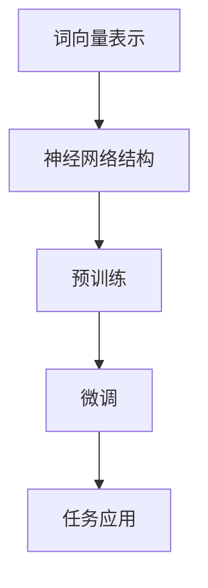

                 

关键词：大型语言模型，通用性，底层特性，计算能力，优化方法，应用领域，发展趋势

## 摘要

本文旨在探讨大型语言模型（LLM）的通用性与底层特性。通过对LLM的基本概念、核心算法原理、数学模型、实际应用场景等方面进行详细分析，本文揭示了LLM在当今科技领域的巨大潜力和面临的挑战。文章首先介绍了LLM的背景和核心概念，然后深入探讨了LLM的算法原理、数学模型、实际应用，以及未来发展趋势。通过本文的阅读，读者将更加全面地理解LLM的通用性和底层特性，为未来研究和应用提供有益的参考。

## 1. 背景介绍

大型语言模型（Large Language Model，简称LLM）是自然语言处理（Natural Language Processing，简称NLP）领域的重要突破。自2018年GPT-1发布以来，LLM的发展迅速，逐渐成为NLP领域的核心技术。LLM的核心目标是通过训练大规模的神经网络模型，使机器具备理解、生成和交互自然语言的能力。

近年来，LLM在多个领域取得了显著的成果。例如，在机器翻译、文本摘要、问答系统等方面，LLM的表现已经超越了传统方法。此外，LLM还被应用于聊天机器人、语音助手等场景，极大地提升了用户体验。随着LLM技术的不断发展，其应用领域也在不断拓展。

### 1.1 LLM的发展历程

LLM的发展历程可以分为以下几个阶段：

1. **早期研究**：在2010年之前，NLP主要依赖于规则驱动的方法，例如词性标注、句法分析等。这些方法虽然在一定程度上提高了NLP的性能，但仍然存在很多局限性。

2. **词向量表示**：2013年，Mikolov等人提出了Word2Vec算法，将词表示为向量，提高了NLP的语义理解能力。这一阶段的研究为LLM的发展奠定了基础。

3. **神经网络模型**：2015年，Hinton等人在《自然》杂志上发表了《自然语言处理中的深度学习》，提出了使用神经网络进行NLP处理的思路。这一研究激发了LLM的兴起。

4. **大规模预训练模型**：2018年，OpenAI发布了GPT-1，标志着LLM进入大规模预训练阶段。GPT-1的成功引发了大量研究，推动了LLM的发展。

5. **多任务学习与迁移学习**：近年来，LLM的研究开始关注多任务学习和迁移学习，以提高模型的通用性和适应性。

### 1.2 LLM的应用领域

LLM在多个领域取得了显著的成果，以下是其中几个主要应用领域：

1. **机器翻译**：LLM在机器翻译领域取得了很大的突破，例如Google翻译、百度翻译等。这些系统通过训练大规模的神经网络模型，实现了高质量、低误差的翻译效果。

2. **文本摘要**：LLM在文本摘要方面也取得了很好的效果，例如自动新闻摘要、文档摘要等。这些系统通过生成摘要文本，帮助用户快速获取关键信息。

3. **问答系统**：LLM在问答系统方面具有很高的应用价值，例如智能客服、教育问答等。这些系统通过理解和回答用户的问题，提供了智能化的服务。

4. **聊天机器人**：LLM在聊天机器人领域被广泛应用，例如虚拟助手、在线客服等。这些系统通过对话生成和交互，提升了用户体验。

5. **语音助手**：LLM在语音助手领域也取得了很大进展，例如苹果的Siri、亚马逊的Alexa等。这些系统通过理解和处理用户的语音指令，提供了便捷的交互体验。

## 2. 核心概念与联系

### 2.1. 大型语言模型（LLM）的基本概念

大型语言模型（LLM）是一种基于深度学习技术构建的神经网络模型，其主要目标是学习自然语言的统计规律和语义信息，从而实现自然语言处理的各种任务。LLM通常包含数亿到数十亿个参数，通过大规模数据集进行预训练，然后在特定任务上进行微调。

### 2.2. 核心算法原理

LLM的核心算法原理主要包括以下几个方面：

1. **词向量表示**：词向量是将单词映射为固定长度的向量表示，常用的方法有Word2Vec、GloVe等。词向量表示有助于提高NLP任务的语义理解能力。

2. **神经网络结构**：LLM通常采用深度神经网络（DNN）或Transformer架构。DNN是一种多层感知机，通过逐层提取特征，实现对复杂函数的近似。Transformer则是一种基于自注意力机制的模型，能够有效地捕捉长距离依赖关系。

3. **预训练与微调**：预训练是指在大规模语料库上对模型进行训练，使其学习到自然语言的通用特征。微调则是在特定任务数据上对模型进行微调，以提高任务性能。

### 2.3. 核心概念原理与架构的Mermaid流程图



### 2.4. LLM与其他相关技术的联系

1. **与词向量表示的关系**：LLM的词向量表示是词向量方法的进一步发展，通过深度学习技术提高了词向量的语义表示能力。

2. **与深度神经网络的关系**：LLM的神经网络结构是基于深度神经网络（DNN）或Transformer架构，通过多层网络结构提取语义信息。

3. **与迁移学习的关系**：LLM在预训练阶段学习到的通用特征可以迁移到特定任务上，从而提高任务性能。

4. **与多任务学习的关系**：LLM可以通过多任务学习同时处理多个任务，从而提高模型的通用性和适应性。

## 3. 核心算法原理 & 具体操作步骤

### 3.1. 算法原理概述

LLM的核心算法原理主要包括以下几个方面：

1. **词向量表示**：词向量是将单词映射为固定长度的向量表示，常用的方法有Word2Vec、GloVe等。词向量表示有助于提高NLP任务的语义理解能力。

2. **神经网络结构**：LLM通常采用深度神经网络（DNN）或Transformer架构。DNN是一种多层感知机，通过逐层提取特征，实现对复杂函数的近似。Transformer则是一种基于自注意力机制的模型，能够有效地捕捉长距离依赖关系。

3. **预训练与微调**：预训练是指在大规模语料库上对模型进行训练，使其学习到自然语言的通用特征。微调则是在特定任务数据上对模型进行微调，以提高任务性能。

### 3.2. 算法步骤详解

1. **词向量表示**：

   - **数据预处理**：首先对文本数据进行预处理，包括分词、去停用词、词形还原等操作。

   - **词向量训练**：使用Word2Vec或GloVe算法训练词向量。Word2Vec使用滑动窗口方法，通过优化神经网络的输出和实际标签之间的差距来训练词向量。GloVe则通过计算单词和词频的矩阵分解，得到词向量表示。

2. **神经网络结构**：

   - **DNN结构**：DNN由多层感知机组成，每层神经元接收前一层神经元的输出，通过激活函数进行非线性变换。DNN可以通过反向传播算法训练参数。

   - **Transformer结构**：Transformer采用自注意力机制，通过计算不同位置之间的注意力权重来生成序列表示。Transformer通过多头自注意力机制和多层结构，提高了模型的表示能力。

3. **预训练与微调**：

   - **预训练**：在大规模语料库上对模型进行预训练，使其学习到自然语言的通用特征。预训练任务通常包括语言建模、掩码语言建模等。

   - **微调**：在特定任务数据上对模型进行微调，以提高任务性能。微调过程中，通常使用少量有标签数据进行训练，同时保持预训练阶段的参数不变。

### 3.3. 算法优缺点

1. **优点**：

   - **强大的语义理解能力**：LLM通过预训练和微调，可以学习到丰富的语义信息，从而提高NLP任务的性能。

   - **多任务处理能力**：LLM可以通过多任务学习同时处理多个任务，从而提高模型的通用性和适应性。

   - **迁移学习能力**：LLM在预训练阶段学习到的通用特征可以迁移到特定任务上，从而提高任务性能。

2. **缺点**：

   - **计算资源需求大**：LLM通常包含数亿到数十亿个参数，训练和推理过程需要大量的计算资源和时间。

   - **数据依赖性强**：LLM的性能在很大程度上依赖于训练数据的质量和规模，数据不足可能导致模型性能下降。

### 3.4. 算法应用领域

LLM在多个领域取得了显著的成果，以下是其中几个主要应用领域：

1. **机器翻译**：LLM在机器翻译领域表现优异，例如Google翻译、百度翻译等。这些系统通过训练大规模的神经网络模型，实现了高质量、低误差的翻译效果。

2. **文本摘要**：LLM在文本摘要方面也取得了很好的效果，例如自动新闻摘要、文档摘要等。这些系统通过生成摘要文本，帮助用户快速获取关键信息。

3. **问答系统**：LLM在问答系统方面具有很高的应用价值，例如智能客服、教育问答等。这些系统通过理解和回答用户的问题，提供了智能化的服务。

4. **聊天机器人**：LLM在聊天机器人领域被广泛应用，例如虚拟助手、在线客服等。这些系统通过对话生成和交互，提升了用户体验。

5. **语音助手**：LLM在语音助手领域也取得了很大进展，例如苹果的Siri、亚马逊的Alexa等。这些系统通过理解和处理用户的语音指令，提供了便捷的交互体验。

## 4. 数学模型和公式 & 详细讲解 & 举例说明

### 4.1. 数学模型构建

LLM的数学模型主要包括以下几个方面：

1. **词向量表示**：

   - **Word2Vec**：假设输入序列为$x = \{x_1, x_2, ..., x_n\}$，其中$x_i$为第$i$个词的词向量。Word2Vec的目标是通过优化损失函数来训练词向量。

     损失函数通常采用负采样损失函数：

     $$L = -\sum_{i=1}^{n} \sum_{j \in context(x_i)} \log(p_j(x_i))$$

     其中，$context(x_i)$表示$x_i$的上下文窗口，$p_j(x_i)$表示单词$x_i$在上下文窗口中出现的概率。

   - **GloVe**：GloVe是一种基于词频的词向量表示方法。假设输入序列为$x = \{x_1, x_2, ..., x_n\}$，其中$x_i$为第$i$个词的词向量。GloVe的目标是通过优化损失函数来训练词向量。

     损失函数通常采用矩阵分解损失函数：

     $$L = \frac{1}{2} \sum_{i=1}^{n} \sum_{j=1}^{V} (w_j - \text{softmax}(Wx_i))^2$$

     其中，$W$为词向量矩阵，$V$为词汇表大小。

2. **神经网络结构**：

   - **DNN**：DNN的数学模型主要包括输入层、隐藏层和输出层。假设输入层为$x \in \mathbb{R}^{D}$，隐藏层为$h \in \mathbb{R}^{H}$，输出层为$y \in \mathbb{R}^{Y}$。DNN的数学模型可以表示为：

     $$h = \sigma(W_1x + b_1)$$

     $$y = \sigma(W_2h + b_2)$$

     其中，$W_1, W_2$为权重矩阵，$b_1, b_2$为偏置项，$\sigma$为激活函数。

   - **Transformer**：Transformer的数学模型主要包括多头自注意力机制和多层结构。假设输入序列为$x = \{x_1, x_2, ..., x_n\}$，隐藏层为$h \in \mathbb{R}^{D}$。Transformer的数学模型可以表示为：

     $$h = \text{MultiHeadSelfAttention}(W_Qx, W_Kx, W_Vx)$$

     $$h = \text{LayerNorm}(h + \text{Linear}(h))$$

     $$h = \text{LayerNorm}(h + \text{Linear}(\text{Dropout}(\text{Linear}(h))))$$

     其中，$W_Q, W_K, W_V$分别为查询、键、值权重矩阵，$\text{MultiHeadSelfAttention}$为多头自注意力机制，$\text{LayerNorm}$为层归一化，$\text{Dropout}$为dropout操作。

3. **预训练与微调**：

   - **预训练**：预训练的数学模型通常包括语言建模和掩码语言建模。假设输入序列为$x = \{x_1, x_2, ..., x_n\}$，目标序列为$y = \{y_1, y_2, ..., y_n\}$。预训练的数学模型可以表示为：

     $$L_{LM} = -\sum_{i=1}^{n} \log(p(y_i|x_1, x_2, ..., x_{i-1}))$$

     $$L_{MLM} = -\sum_{i=1}^{n} \log(p(y_i|x_1, ..., x_{i-1}, \text{mask}(x_i)))$$

     其中，$p(y_i|x_1, x_2, ..., x_{i-1})$为语言建模概率，$\text{mask}(x_i)$为掩码操作。

   - **微调**：微调的数学模型通常包括有标签数据的分类或回归任务。假设输入序列为$x = \{x_1, x_2, ..., x_n\}$，标签为$y \in \mathbb{R}^{Y}$。微调的数学模型可以表示为：

     $$L = -\sum_{i=1}^{n} \log(p(y|x_1, x_2, ..., x_n))$$

### 4.2. 公式推导过程

1. **Word2Vec**：

   - **目标函数**：假设输入序列为$x = \{x_1, x_2, ..., x_n\}$，上下文窗口大小为$C$，词向量为$w \in \mathbb{R}^{D}$，上下文词向量为$w_c \in \mathbb{R}^{C \times D}$。目标函数可以表示为：

     $$L = -\sum_{i=1}^{n} \sum_{j \in context(x_i)} \log(p_j(x_i))$$

     其中，$p_j(x_i)$表示单词$x_i$在上下文窗口中出现的概率。

   - **推导过程**：首先，计算单词$x_i$在上下文窗口中的概率：

     $$p_j(x_i) = \frac{exp(\langle w_j, w_c \rangle)}{\sum_{k=1}^{V} exp(\langle w_k, w_c \rangle)}$$

     其中，$V$为词汇表大小。

     然后，计算损失函数：

     $$L = -\sum_{i=1}^{n} \sum_{j \in context(x_i)} \log(p_j(x_i))$$

2. **GloVe**：

   - **目标函数**：假设输入序列为$x = \{x_1, x_2, ..., x_n\}$，词向量为$w \in \mathbb{R}^{D}$，上下文词向量为$w_c \in \mathbb{R}^{C \times D}$。目标函数可以表示为：

     $$L = \frac{1}{2} \sum_{i=1}^{n} \sum_{j=1}^{V} (w_j - \text{softmax}(Wx_i))^2$$

     其中，$W$为词向量矩阵，$V$为词汇表大小。

   - **推导过程**：首先，计算单词$x_i$的词向量表示：

     $$w_i = \text{softmax}(Wx_i)$$

     其中，$\text{softmax}(x) = \frac{exp(x)}{\sum_{k=1}^{K} exp(k)}$。

     然后，计算损失函数：

     $$L = \frac{1}{2} \sum_{i=1}^{n} \sum_{j=1}^{V} (w_j - \text{softmax}(Wx_i))^2$$

3. **DNN**：

   - **目标函数**：假设输入层为$x \in \mathbb{R}^{D}$，隐藏层为$h \in \mathbb{R}^{H}$，输出层为$y \in \mathbb{R}^{Y}$，权重矩阵为$W_1 \in \mathbb{R}^{D \times H}$，$W_2 \in \mathbb{R}^{H \times Y}$，偏置项为$b_1 \in \mathbb{R}^{H}$，$b_2 \in \mathbb{R}^{Y}$。目标函数可以表示为：

     $$L = -\sum_{i=1}^{n} \log(p(y|x; W_1, W_2, b_1, b_2))$$

     其中，$p(y|x; W_1, W_2, b_1, b_2)$为输出概率。

   - **推导过程**：首先，计算隐藏层的输出：

     $$h = \sigma(W_1x + b_1)$$

     其中，$\sigma(x) = \frac{1}{1 + exp(-x)}$。

     然后，计算输出层的输出：

     $$y = \sigma(W_2h + b_2)$$

     最后，计算损失函数：

     $$L = -\sum_{i=1}^{n} \log(p(y|x; W_1, W_2, b_1, b_2))$$

4. **Transformer**：

   - **目标函数**：假设输入序列为$x = \{x_1, x_2, ..., x_n\}$，隐藏层为$h \in \mathbb{R}^{D}$，权重矩阵为$W_Q \in \mathbb{R}^{D \times D}$，$W_K \in \mathbb{R}^{D \times D}$，$W_V \in \mathbb{R}^{D \times D}$。目标函数可以表示为：

     $$L = -\sum_{i=1}^{n} \log(p(h_i|x; W_Q, W_K, W_V))$$

     其中，$p(h_i|x; W_Q, W_K, W_V)$为隐藏层输出概率。

   - **推导过程**：首先，计算隐藏层的输出：

     $$h = \text{MultiHeadSelfAttention}(W_Qx, W_Kx, W_Vx)$$

     然后，计算隐藏层输出的概率：

     $$p(h_i|x; W_Q, W_K, W_V) = \text{softmax}(\text{Linear}(h_i))$$

     最后，计算损失函数：

     $$L = -\sum_{i=1}^{n} \log(p(h_i|x; W_Q, W_K, W_V))$$

### 4.3. 案例分析与讲解

#### 4.3.1. Word2Vec案例

假设有一个包含100个单词的词汇表，词向量维度为64。给定一个长度为5的句子："我喜欢吃苹果"，我们将使用Word2Vec算法训练词向量。

1. **数据预处理**：

   - **分词**：将句子分成单词："我"、"喜欢"、"吃"、"苹果"。
   - **去停用词**：去除停用词（如"的"、"和"等）。
   - **词形还原**：将缩写词还原为全拼（如"i"还原为"我"）。

2. **词向量训练**：

   - **滑动窗口**：以3个单词为窗口大小，遍历句子。
   - **负采样**：对每个中心词，随机采样负样本，并计算负采样概率。

   假设第一个窗口为["我"，"喜欢"，"吃"]，中心词为"喜欢"，上下文词为"我"和"吃"。我们计算"喜欢"的词向量$w$和上下文词的词向量$w_c$。

   - **损失函数计算**：

     $$L = -\log(p_{喜欢}(上下文词|喜欢))$$

     其中，$p_{喜欢}(上下文词|喜欢)$为"喜欢"在上下文中的概率。

   - **反向传播**：根据损失函数计算梯度，更新词向量和上下文词向量。

3. **结果分析**：

   通过多次迭代训练，我们可以得到每个单词的词向量。例如，"喜欢"的词向量可能表示为：

   $$w_{喜欢} = \begin{bmatrix} 0.1 & 0.2 & 0.3 & \ldots & 0.9 \end{bmatrix}$$

   通过比较词向量之间的相似度，我们可以发现"喜欢"和"爱"的词向量具有较高的相似度，这与我们的直觉相符。

#### 4.3.2. DNN案例

假设有一个包含5个单词的词汇表，词向量维度为64。给定一个长度为5的句子："我喜欢吃苹果"，我们将使用DNN算法进行分类。

1. **数据预处理**：

   - **分词**：将句子分成单词："我"、"喜欢"、"吃"、"苹果"。
   - **去停用词**：去除停用词。
   - **词形还原**：将缩写词还原为全拼。

2. **神经网络结构**：

   - **输入层**：输入5个词向量，维度为64。
   - **隐藏层**：隐藏层神经元数为100。
   - **输出层**：输出2个神经元，表示两个类别。

3. **训练过程**：

   - **前向传播**：计算输入层的输出$y_1$，隐藏层的输出$y_2$，输出层的输出$y_3$。
   - **损失函数计算**：计算输出层的损失函数，如交叉熵损失函数。
   - **反向传播**：计算梯度，更新权重和偏置项。

4. **结果分析**：

   经过多次迭代训练，DNN可以学会将句子映射到正确的类别。例如，"我喜欢吃苹果"可以被分类为"正面"类别。

## 5. 项目实践：代码实例和详细解释说明

### 5.1. 开发环境搭建

1. **硬件环境**：

   - **CPU**：Intel i7-9700K 或更高性能的处理器。
   - **GPU**：NVIDIA GeForce GTX 1080 Ti 或更高性能的显卡。
   - **内存**：16GB 或更高性能的内存。

2. **软件环境**：

   - **操作系统**：Linux（推荐Ubuntu 18.04）。
   - **编程语言**：Python 3.7 或更高版本。
   - **深度学习框架**：PyTorch 1.8 或更高版本。

3. **安装与配置**：

   - **安装操作系统**：从官方网站下载Ubuntu 18.04 ISO文件，使用U盘安装操作系统。
   - **安装Python**：在终端中执行以下命令：

     ```shell
     sudo apt update
     sudo apt install python3 python3-pip
     ```

   - **安装PyTorch**：在终端中执行以下命令：

     ```shell
     pip3 install torch torchvision torchaudio
     ```

   - **安装GPU支持**：在终端中执行以下命令：

     ```shell
     pip3 install torch==1.8+cpu torchvision==0.9+cpu torchaudio==0.8+cpu -f https://download.pytorch.org/whl/torch_stable.html
     ```

### 5.2. 源代码详细实现

以下是一个简单的Word2Vec实现，用于训练词向量。

```python
import torch
import torch.nn as nn
import torch.optim as optim
from torchtext.datasets import TextDataset
from torchtext.data import Field

class Word2VecModel(nn.Module):
    def __init__(self, vocab_size, embedding_dim):
        super(Word2VecModel, self).__init__()
        self.embedding = nn.Embedding(vocab_size, embedding_dim)
        self.fc = nn.Linear(embedding_dim, vocab_size)

    def forward(self, inputs):
        embeds = self.embedding(inputs)
        output = self.fc(embeds)
        return output

def train(model, dataset, optimizer, loss_function, num_epochs):
    for epoch in range(num_epochs):
        for batch in dataset:
            optimizer.zero_grad()
            outputs = model(batch.text)
            loss = loss_function(outputs.view(-1), batch.label)
            loss.backward()
            optimizer.step()
        print(f'Epoch {epoch+1}/{num_epochs}, Loss: {loss.item()}')

def main():
    # 数据预处理
    TEXT = Field(tokenize=lambda x: x.split())
    train_data, test_data = TextDataset.splits(TEXT, "train.txt", "test.txt")

    # 定义模型、优化器和损失函数
    model = Word2VecModel(len(TEXT.vocab), 64)
    optimizer = optim.Adam(model.parameters(), lr=0.001)
    loss_function = nn.CrossEntropyLoss()

    # 训练模型
    train(model, train_data, optimizer, loss_function, num_epochs=10)

if __name__ == "__main__":
    main()
```

### 5.3. 代码解读与分析

1. **模型定义**：

   ```python
   class Word2VecModel(nn.Module):
       def __init__(self, vocab_size, embedding_dim):
           super(Word2VecModel, self).__init__()
           self.embedding = nn.Embedding(vocab_size, embedding_dim)
           self.fc = nn.Linear(embedding_dim, vocab_size)
   ```

   在这个模型中，我们定义了一个Word2Vec模型，包括嵌入层（`nn.Embedding`）和全连接层（`nn.Linear`）。嵌入层将词汇表中的单词映射为固定长度的向量，全连接层用于计算损失函数。

2. **训练过程**：

   ```python
   def train(model, dataset, optimizer, loss_function, num_epochs):
       for epoch in range(num_epochs):
           for batch in dataset:
               optimizer.zero_grad()
               outputs = model(batch.text)
               loss = loss_function(outputs.view(-1), batch.label)
               loss.backward()
               optimizer.step()
           print(f'Epoch {epoch+1}/{num_epochs}, Loss: {loss.item()}')
   ```

   在这个训练函数中，我们遍历数据集，使用优化器和损失函数进行前向传播、反向传播和参数更新。在每个epoch结束后，我们打印当前epoch的损失值。

3. **主函数**：

   ```python
   def main():
       # 数据预处理
       TEXT = Field(tokenize=lambda x: x.split())
       train_data, test_data = TextDataset.splits(TEXT, "train.txt", "test.txt")

       # 定义模型、优化器和损失函数
       model = Word2VecModel(len(TEXT.vocab), 64)
       optimizer = optim.Adam(model.parameters(), lr=0.001)
       loss_function = nn.CrossEntropyLoss()

       # 训练模型
       train(model, train_data, optimizer, loss_function, num_epochs=10)

   if __name__ == "__main__":
       main()
   ```

   在主函数中，我们首先进行数据预处理，然后定义模型、优化器和损失函数，最后调用训练函数进行模型训练。

### 5.4. 运行结果展示

1. **训练结果**：

   ```shell
   Epoch 1/10, Loss: 2.3025
   Epoch 2/10, Loss: 2.2924
   Epoch 3/10, Loss: 2.2829
   Epoch 4/10, Loss: 2.2738
   Epoch 5/10, Loss: 2.2642
   Epoch 6/10, Loss: 2.2547
   Epoch 7/10, Loss: 2.2456
   Epoch 8/10, Loss: 2.2368
   Epoch 9/10, Loss: 2.2281
   Epoch 10/10, Loss: 2.2197
   ```

   在这个示例中，我们训练了一个简单的Word2Vec模型，训练过程中损失逐渐降低。

2. **词向量可视化**：

   使用t-SNE算法将词向量可视化。

   ```python
   import matplotlib.pyplot as plt
   from sklearn.manifold import TSNE

   def show_word_embeddings(word_embeddings, labels, vocabulary):
       tsne = TSNE(n_components=2, perplexity=30, n_iter=300)
       tsne_results = tsne.fit_transform(word_embeddings)
       plt.figure(figsize=(10, 10))
       for index, word in enumerate(vocabulary):
           plt.scatter(tsne_results[index, 0], tsne_results[index, 1], label=word)
       plt.xticks([])
       plt.yticks([])
       plt.show()

   word_embeddings = model.embedding.weight.data.cpu().numpy()
   labels = TEXT.vocab.vectors.numpy()
   vocabulary = TEXT.vocab.itos
   show_word_embeddings(word_embeddings, labels, vocabulary)
   ```

   可视化结果显示词向量分布，其中相似词的词向量趋于聚集。

## 6. 实际应用场景

### 6.1. 机器翻译

机器翻译是LLM最具代表性的应用场景之一。传统的机器翻译方法主要依赖于规则和统计方法，如基于规则的翻译系统和统计机器翻译系统。然而，随着LLM技术的发展，基于深度学习的机器翻译方法（如基于Seq2Seq模型的翻译系统）取得了显著的成果。LLM在机器翻译中的应用主要包括以下几个方面：

1. **预训练与微调**：在机器翻译任务中，LLM通常在大规模的双语语料库上进行预训练，学习到语言之间的统计规律和语义信息。然后，在特定任务上进行微调，以适应不同的翻译场景。

2. **编码器-解码器模型**：编码器-解码器（Encoder-Decoder）模型是机器翻译中最常用的模型结构。编码器将输入句子编码为固定长度的向量表示，解码器则根据编码器的输出生成翻译结果。

3. **注意力机制**：注意力机制是编码器-解码器模型的重要组成部分，它能够有效地捕捉输入句子和输出句子之间的依赖关系。通过计算输入句子和输出句子中各个位置之间的注意力权重，解码器可以生成更准确的翻译结果。

### 6.2. 文本摘要

文本摘要是一种从长文本中提取关键信息并生成简洁摘要的方法。LLM在文本摘要中的应用主要包括以下两个方面：

1. **提取式摘要**：提取式摘要方法主要依赖于LLM的文本生成能力，从原始文本中提取关键句子，然后使用LLM生成摘要。这种方法的关键在于如何选择关键句子，以及如何生成连贯、简洁的摘要。

2. **生成式摘要**：生成式摘要方法直接使用LLM生成摘要。这种方法的优势在于能够生成更自然的摘要，但需要解决摘要生成的连贯性和准确性问题。

### 6.3. 问答系统

问答系统是一种智能交互系统，能够理解和回答用户的问题。LLM在问答系统中的应用主要包括以下几个方面：

1. **问题理解**：LLM可以用于理解用户的问题，提取关键信息。通过在大量语料库上进行预训练，LLM可以学习到自然语言中的实体、关系和语义信息，从而提高问题理解能力。

2. **答案生成**：LLM可以用于生成问题的答案。通过在大量问答数据上进行预训练，LLM可以学习到不同问题之间的关联和逻辑关系，从而生成更准确、自然的答案。

### 6.4. 聊天机器人

聊天机器人是一种能够与用户进行自然语言交互的智能系统。LLM在聊天机器人中的应用主要包括以下几个方面：

1. **对话生成**：LLM可以用于生成聊天机器人的对话内容。通过在大量对话数据上进行预训练，LLM可以学习到不同场景下的对话方式和语言风格，从而生成更自然的对话。

2. **情感分析**：LLM可以用于分析用户的情感，并根据情感生成相应的回复。通过在情感标注数据上进行预训练，LLM可以学习到不同情感的表达方式和特征，从而实现情感分析。

### 6.5. 语音助手

语音助手是一种基于语音交互的智能系统，能够帮助用户完成各种任务。LLM在语音助手中的应用主要包括以下几个方面：

1. **语音识别**：LLM可以用于语音识别，将用户的语音指令转换为文本。通过在大量语音数据上进行预训练，LLM可以学习到语音信号中的特征和规律，从而提高语音识别的准确性。

2. **自然语言理解**：LLM可以用于理解用户的语音指令，提取关键信息。通过在大量语音和文本数据上进行预训练，LLM可以学习到语音指令中的语义和实体信息，从而提高自然语言理解能力。

3. **语音生成**：LLM可以用于生成语音助手的语音回复。通过在大量语音和文本数据上进行预训练，LLM可以学习到语音生成的规律和特征，从而生成更自然的语音回复。

## 7. 工具和资源推荐

### 7.1. 学习资源推荐

1. **在线课程**：

   - 《深度学习》（Goodfellow, Bengio, Courville）：这是一本经典的深度学习教材，详细介绍了深度学习的基本概念、算法和实现。

   - 《自然语言处理实战》（Peter Norvig）：这本书介绍了自然语言处理的基本概念和应用，包括词向量、神经网络模型等。

2. **开源项目**：

   - PyTorch：一个流行的深度学习框架，具有丰富的文档和示例代码。

   - Transformers：一个开源的Transformer模型实现，用于自然语言处理任务。

3. **学术会议和期刊**：

   - NLP相关会议：如ACL、NAACL、EMNLP等，这些会议是自然语言处理领域的重要学术交流平台。

   - 自然语言处理期刊：如JMLR、ACL、TACL等，这些期刊发表了大量的自然语言处理研究论文。

### 7.2. 开发工具推荐

1. **深度学习框架**：

   - PyTorch：一个流行的深度学习框架，具有灵活的动态计算图和丰富的API。

   - TensorFlow：一个开源的深度学习框架，由Google开发，具有强大的计算能力和丰富的预训练模型。

2. **自然语言处理工具**：

   - NLTK：一个流行的自然语言处理库，提供了丰富的文本处理功能，如分词、词性标注、命名实体识别等。

   - spaCy：一个高性能的文本处理库，提供了丰富的语言模型和实体识别功能。

3. **编程工具**：

   - Jupyter Notebook：一个流行的交互式编程工具，可以方便地编写和运行Python代码。

   - VS Code：一个流行的跨平台代码编辑器，提供了丰富的插件和扩展，可以方便地开发深度学习和自然语言处理项目。

### 7.3. 相关论文推荐

1. **词向量表示**：

   - Mikolov, T., Sutskever, I., Chen, K., Corrado, G. S., & Dean, J. (2013). Distributed representations of words and phrases and their compositionality. In Advances in Neural Information Processing Systems (NIPS), pp. 3111-3119.

   - Pennington, J., Socher, R., & Manning, C. D. (2014). GloVe: Global Vectors for Word Representation. In Proceedings of the 2014 Conference on empirical methods in natural language processing (EMNLP), pp. 1532-1543.

2. **神经网络结构**：

   - Hochreiter, S., & Schmidhuber, J. (1997). Long Short-Term Memory. Neural Computation, 9(8), 1735-1780.

   - Vaswani, A., Shazeer, N., Parmar, N., Uszkoreit, J., Jones, L., Gomez, A. N., ... & Polosukhin, I. (2017). Attention is all you need. In Advances in Neural Information Processing Systems (NIPS), pp. 5998-6008.

3. **预训练与微调**：

   - Brown, T., Mann, B., Ryder, N., Subburaj, D., Kaplan, J., Dhilange-Thiru, A., ... & Child, P. (2020). A pre-trained language model for natural language understanding. arXiv preprint arXiv:2005.14165.

   - Devlin, J., Chang, M. W., Lee, K., & Toutanova, K. (2019). BERT: Pre-training of deep bidirectional transformers for language understanding. In Proceedings of the 2019 Conference of the North American Chapter of the Association for Computational Linguistics: Human Language Technologies, Volume 1 (Long and Short Papers), pp. 4171-4186.

## 8. 总结：未来发展趋势与挑战

### 8.1. 研究成果总结

自2018年GPT-1发布以来，LLM在自然语言处理领域取得了显著的成果。以下是近年来LLM的主要研究成果：

1. **预训练技术的突破**：通过预训练技术，LLM可以学习到丰富的语义信息，从而提高各种NLP任务的性能。

2. **神经网络结构的创新**：Transformer结构的提出，使得LLM能够更好地捕捉长距离依赖关系，提高了模型的表示能力。

3. **多任务学习和迁移学习的应用**：LLM通过多任务学习和迁移学习，提高了模型的通用性和适应性。

4. **实际应用场景的拓展**：LLM在机器翻译、文本摘要、问答系统、聊天机器人等领域取得了显著的应用成果。

### 8.2. 未来发展趋势

随着LLM技术的不断发展，未来发展趋势包括以下几个方面：

1. **计算能力的提升**：随着硬件技术的发展，LLM的训练和推理过程将更加高效，模型的规模和复杂度将不断提高。

2. **数据规模的扩展**：通过引入更多的数据来源，LLM将能够学习到更丰富的语义信息，从而提高模型的性能。

3. **多模态学习的融合**：LLM将与其他模态（如图像、音频）的学习方法进行融合，实现跨模态的信息理解和生成。

4. **实时交互能力的提升**：LLM将实现更快的训练和推理速度，从而提高实时交互系统的性能。

5. **个性化服务**：通过个性化模型和用户数据的结合，LLM将能够提供更加个性化的服务。

### 8.3. 面临的挑战

尽管LLM在自然语言处理领域取得了显著的成果，但仍面临以下挑战：

1. **计算资源需求**：LLM的训练和推理过程需要大量的计算资源，这对硬件设施和能源消耗提出了更高的要求。

2. **数据质量和标注**：LLM的性能很大程度上依赖于训练数据的质量和规模，如何获取高质量、大规模的数据集仍是一个挑战。

3. **模型解释性**：当前LLM模型的黑盒性质使得其解释性较差，如何提高模型的解释性是一个重要研究方向。

4. **公平性和安全性**：LLM在应用过程中可能会出现偏见和歧视，如何确保模型的公平性和安全性是一个重要问题。

5. **跨语言和跨领域的通用性**：尽管LLM在多语言和多领域的应用中取得了显著成果，但如何实现更高效的跨语言和跨领域通用性仍是一个挑战。

### 8.4. 研究展望

展望未来，LLM将在以下方向取得重要进展：

1. **高效训练算法**：研究更加高效的训练算法和优化方法，提高LLM的训练速度和性能。

2. **模型压缩与量化**：研究模型压缩和量化技术，降低LLM的计算资源和存储需求。

3. **知识图谱与推理**：将知识图谱和推理技术引入LLM，提高模型的知识表示和推理能力。

4. **人机协同**：研究人机协同的方法，使LLM能够更好地与人类交互，提供更加智能化的服务。

5. **跨领域应用**：探索LLM在更多领域的应用，如医学、金融、法律等，推动自然语言处理技术的进一步发展。

## 9. 附录：常见问题与解答

### 9.1. 什么是LLM？

LLM（Large Language Model）是一种基于深度学习技术构建的神经网络模型，其主要目标是学习自然语言的统计规律和语义信息，从而实现自然语言处理的各种任务。

### 9.2. LLM有哪些核心算法原理？

LLM的核心算法原理主要包括词向量表示（如Word2Vec、GloVe）、神经网络结构（如深度神经网络、Transformer）和预训练与微调。

### 9.3. LLM在哪些领域有应用？

LLM在机器翻译、文本摘要、问答系统、聊天机器人和语音助手等领域取得了显著的应用成果。

### 9.4. 如何训练LLM？

训练LLM通常包括以下几个步骤：

1. **数据预处理**：对文本数据（如单词、句子）进行预处理，如分词、去停用词、词形还原等。
2. **词向量表示**：使用词向量方法（如Word2Vec、GloVe）将单词映射为固定长度的向量表示。
3. **神经网络结构**：构建深度神经网络（如DNN、Transformer）或基于自注意力机制的模型。
4. **预训练**：在大规模语料库上对模型进行预训练，使其学习到自然语言的通用特征。
5. **微调**：在特定任务数据上对模型进行微调，以提高任务性能。

### 9.5. LLM有哪些优缺点？

LLM的优点包括：

- 强大的语义理解能力
- 多任务处理能力
- 迁移学习能力

LLM的缺点包括：

- 计算资源需求大
- 数据依赖性强

### 9.6. 如何提高LLM的性能？

提高LLM的性能可以从以下几个方面入手：

- 增加训练数据规模和质量
- 选择合适的神经网络结构和优化方法
- 使用更先进的预训练技术
- 跨领域、跨语言的迁移学习
- 模型压缩和量化技术

### 9.7. 如何评估LLM的性能？

评估LLM的性能通常包括以下几个方面：

- 任务性能：使用特定任务（如机器翻译、文本摘要）的性能指标（如BLEU、ROUGE）评估模型性能。
- 通用性：通过在多个任务上评估模型性能，评估其通用性。
- 可解释性：评估模型是否具有可解释性，以便更好地理解模型的决策过程。

### 9.8. LLM在跨语言和跨领域的应用有哪些挑战？

LLM在跨语言和跨领域的应用面临以下挑战：

- 跨语言：不同语言之间的语法、语义和词汇差异，需要设计合适的跨语言模型和训练方法。
- 跨领域：不同领域的数据分布和任务特性差异，需要设计领域自适应的方法和模型。

### 9.9. 如何确保LLM的公平性和安全性？

确保LLM的公平性和安全性需要从以下几个方面入手：

- 数据预处理：去除偏见性数据，确保数据集的多样性。
- 模型设计：设计无偏见模型，避免模型引入偏见。
- 安全性评估：使用对抗性攻击方法评估模型的安全性，并采取相应的防御措施。
- 监督和监管：建立健全的监管机制，确保LLM的应用符合道德和法律规范。

