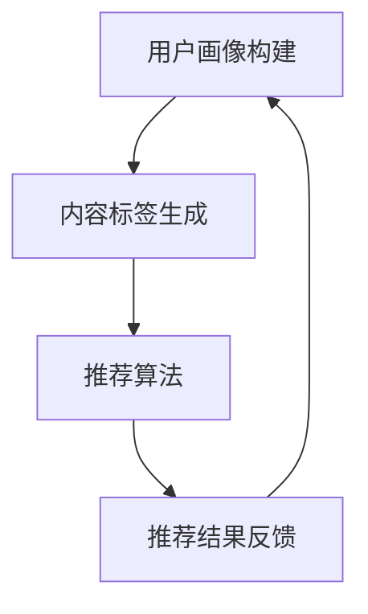

                 

关键词：大型语言模型（LLM）、个性化推荐、新闻推荐系统、深度学习、机器学习、人工智能、用户兴趣、算法设计、数据分析

> 摘要：本文将探讨如何利用大型语言模型（LLM）构建个性化新闻推荐系统。首先介绍个性化新闻推荐系统的背景和重要性，然后深入讲解LLM的工作原理及其在新闻推荐中的应用，随后将介绍系统的核心算法原理和实现步骤，最后通过实际项目实践和未来应用展望，为读者提供一个全面的了解和参考。

## 1. 背景介绍

随着互联网的快速发展，人们获取信息的方式发生了巨大的变化。传统的新闻推荐系统主要依赖于内容标签、关键词匹配和用户行为数据等浅层特征，这些方法在一定程度上能够满足用户的基本需求，但随着用户个性化需求的不断增加，其推荐效果已经逐渐无法满足用户的期望。个性化推荐系统成为提高用户满意度和提高内容利用率的重要手段。

个性化新闻推荐系统是指根据用户的兴趣、行为和偏好等信息，向用户推荐他们可能感兴趣的新闻内容。这类系统不仅能够提高用户的阅读体验，还能提高新闻网站或应用的黏性和用户活跃度。个性化推荐系统在新闻领域的重要性主要体现在以下几个方面：

1. 提高用户满意度：通过推荐用户感兴趣的新闻内容，满足用户的个性化需求，提高用户满意度和忠诚度。
2. 提高内容利用率：通过精准推荐，让更多的新闻内容被用户阅读，提高新闻的曝光率和传播效果。
3. 增加广告收入：通过提高用户活跃度和阅读时长，提高广告点击率和广告收入。

本文将重点探讨如何利用大型语言模型（LLM）构建个性化新闻推荐系统，以解决现有推荐系统面临的挑战和瓶颈。LLM作为一种强大的深度学习模型，能够更好地理解和模拟人类的语言和思维模式，为个性化推荐提供新的思路和方向。

## 2. 核心概念与联系

### 2.1. 大型语言模型（LLM）

大型语言模型（LLM）是一种基于深度学习的自然语言处理模型，能够理解和生成自然语言。LLM的核心是通过对海量文本数据进行预训练，使其能够捕捉到语言的复杂结构和语义信息。LLM的主要优点包括：

1. **强大的语言理解能力**：LLM能够理解和处理复杂的语言现象，如语法结构、语义关系、情感倾向等。
2. **高效的信息检索**：LLM能够快速检索和匹配文本信息，提高推荐系统的响应速度。
3. **自动特征提取**：LLM能够自动提取文本特征，减轻数据预处理的工作量。

### 2.2. 个性化新闻推荐系统

个性化新闻推荐系统是指利用用户兴趣和行为数据，为用户推荐他们可能感兴趣的新闻内容。个性化新闻推荐系统通常包括以下几个核心组成部分：

1. **用户画像**：通过收集和分析用户的兴趣、行为、地理位置等信息，构建用户的个性化画像。
2. **内容标签**：为新闻内容打上标签，以便后续的推荐算法能够根据标签进行内容匹配。
3. **推荐算法**：利用用户画像和内容标签，为用户推荐符合他们兴趣的新闻内容。
4. **推荐结果反馈**：通过用户对推荐内容的反馈，不断优化和调整推荐策略。

### 2.3. Mermaid 流程图

以下是使用Mermaid绘制的个性化新闻推荐系统的流程图：



在上述流程中，用户画像构建、内容标签生成和推荐算法是核心环节，推荐结果反馈则用于不断优化推荐系统的效果。通过LLM的引入，上述各个环节将得到显著提升，从而构建一个更加智能和高效的个性化新闻推荐系统。

## 3. 核心算法原理 & 具体操作步骤

### 3.1. 算法原理概述

个性化新闻推荐系统的核心算法是利用LLM对用户兴趣和新闻内容进行建模，进而实现精准推荐。具体来说，算法原理可以分为以下几个步骤：

1. **用户兴趣建模**：利用LLM对用户的浏览历史、搜索记录等信息进行建模，提取用户的兴趣特征。
2. **新闻内容建模**：利用LLM对新闻内容进行建模，提取新闻的语义特征。
3. **兴趣与内容匹配**：通过相似度计算和权重分配，实现用户兴趣与新闻内容的匹配。
4. **推荐结果生成**：根据匹配结果生成推荐列表，并向用户展示。

### 3.2. 算法步骤详解

#### 3.2.1. 用户兴趣建模

用户兴趣建模是利用LLM提取用户的兴趣特征。具体步骤如下：

1. **数据收集**：收集用户的浏览历史、搜索记录、点赞和评论等信息。
2. **数据预处理**：对原始数据进行清洗和格式化，使其适合输入到LLM中。
3. **模型训练**：利用收集到的数据训练一个LLM模型，使其能够理解和提取用户的兴趣特征。
4. **特征提取**：将用户的浏览历史、搜索记录等信息输入到训练好的LLM模型中，提取用户的兴趣特征。

#### 3.2.2. 新闻内容建模

新闻内容建模是利用LLM提取新闻的语义特征。具体步骤如下：

1. **数据收集**：收集新闻的标题、摘要、正文等信息。
2. **数据预处理**：对原始数据进行清洗和格式化，使其适合输入到LLM中。
3. **模型训练**：利用收集到的数据训练一个LLM模型，使其能够理解和提取新闻的语义特征。
4. **特征提取**：将新闻的标题、摘要、正文等信息输入到训练好的LLM模型中，提取新闻的语义特征。

#### 3.2.3. 兴趣与内容匹配

兴趣与内容匹配是通过相似度计算和权重分配，实现用户兴趣与新闻内容的匹配。具体步骤如下：

1. **相似度计算**：利用向量空间模型计算用户兴趣特征与新闻内容特征之间的相似度。
2. **权重分配**：根据相似度计算结果为每个新闻内容分配权重，权重越高表示该新闻越符合用户的兴趣。
3. **推荐列表生成**：根据权重分配结果生成推荐列表，将权重最高的新闻推荐给用户。

### 3.3. 算法优缺点

#### 3.3.1. 优点

1. **强大的语言理解能力**：LLM能够理解和处理复杂的语言现象，提高推荐系统的准确性。
2. **自动特征提取**：LLM能够自动提取文本特征，减轻数据预处理的工作量。
3. **高效的响应速度**：LLM能够在短时间内处理大量文本信息，提高推荐系统的响应速度。

#### 3.3.2. 缺点

1. **训练成本高**：LLM的训练需要大量的计算资源和时间，训练成本较高。
2. **数据依赖性强**：LLM的性能高度依赖数据质量，数据缺失或质量差会导致推荐效果不佳。
3. **解释性不足**：LLM的模型参数复杂，难以解释其推荐结果的依据。

### 3.4. 算法应用领域

LLM驱动的个性化新闻推荐系统可以广泛应用于多个领域，包括但不限于：

1. **新闻网站**：为用户提供个性化的新闻推荐，提高用户满意度和网站黏性。
2. **社交媒体**：为用户提供个性化的内容推荐，提高用户活跃度和互动率。
3. **电子商务**：为用户提供个性化的商品推荐，提高购物体验和转化率。
4. **金融领域**：为投资者提供个性化的财经资讯推荐，提高投资决策的准确性。

## 4. 数学模型和公式 & 详细讲解 & 举例说明

### 4.1. 数学模型构建

个性化新闻推荐系统的核心是用户兴趣建模和新闻内容建模。以下分别介绍这两个模型的数学构建过程。

#### 4.1.1. 用户兴趣建模

用户兴趣建模可以使用因子分解机（Factorization Machine, FM）来表示。FM是一种基于矩阵分解的方法，可以将用户兴趣表示为一个低维的因子矩阵。具体公式如下：

$$
X = U \times V^T
$$

其中，$X$表示用户兴趣矩阵，$U$和$V$分别表示用户特征和新闻特征的低维因子矩阵。

#### 4.1.2. 新闻内容建模

新闻内容建模可以使用卷积神经网络（Convolutional Neural Network, CNN）来表示。CNN是一种深度学习模型，能够提取文本的局部特征。具体公式如下：

$$
h = \text{ReLU}(\text{Conv}(f \circ \text{Pad}(x)))
$$

其中，$h$表示新闻特征向量，$f$表示卷积核，$x$表示新闻文本，$\text{Pad}(x)$表示填充操作，$\text{ReLU}$表示ReLU激活函数。

### 4.2. 公式推导过程

#### 4.2.1. 用户兴趣建模推导

用户兴趣建模的推导过程主要涉及矩阵分解和优化方法。以下是一个简化的推导过程：

1. **损失函数**：假设用户兴趣矩阵$X$已知，定义损失函数为：

$$
\mathcal{L}(U, V) = \frac{1}{2} \sum_{i, j} (x_{ij} - u_i v_j)^2
$$

2. **优化目标**：为了最小化损失函数，对$U$和$V$分别进行梯度下降优化：

$$
u_i = \sum_{j} x_{ij} v_j + \alpha u_i
$$

$$
v_j = \sum_{i} x_{ij} u_i + \beta v_j
$$

其中，$\alpha$和$\beta$分别为$U$和$V$的优化步长。

3. **迭代优化**：重复执行上述优化步骤，直到满足收敛条件。

#### 4.2.2. 新闻内容建模推导

新闻内容建模的推导过程主要涉及卷积神经网络的设计和训练。以下是一个简化的推导过程：

1. **卷积操作**：假设卷积核$W$和偏置$b$，输入文本$x$经过卷积操作得到特征图$h$：

$$
h = \text{ReLU}(\text{Conv}(W \circ \text{Pad}(x)) + b)
$$

2. **池化操作**：对特征图$h$进行池化操作，得到特征向量$h'$：

$$
h' = \text{Pooling}(h)
$$

3. **全连接层**：将特征向量$h'$输入到全连接层，得到新闻特征向量$h''$：

$$
h'' = \text{ReLU}(W_{fc} h' + b_{fc})
$$

4. **输出层**：将新闻特征向量$h''$输入到输出层，得到新闻分类结果：

$$
y = \text{Softmax}(h'')
$$

### 4.3. 案例分析与讲解

以下是一个简单的案例，说明如何使用LLM驱动个性化新闻推荐系统。

#### 4.3.1. 数据集

假设我们有一个包含1000篇新闻文章的数据集，每篇文章都有标题、摘要和正文。同时，我们有一个包含10000个用户的数据集，每个用户都有浏览历史和搜索记录。

#### 4.3.2. 用户兴趣建模

首先，我们使用LLM对用户的浏览历史和搜索记录进行建模，提取用户的兴趣特征。具体步骤如下：

1. **数据预处理**：将用户的浏览历史和搜索记录进行预处理，将其转换为文本形式。
2. **模型训练**：使用预训练的LLM模型对预处理后的数据进行训练，提取用户的兴趣特征。
3. **特征提取**：将用户的浏览历史和搜索记录输入到训练好的LLM模型中，提取用户的兴趣特征。

#### 4.3.3. 新闻内容建模

接下来，我们使用LLM对新闻的标题、摘要和正文进行建模，提取新闻的语义特征。具体步骤如下：

1. **数据预处理**：将新闻的标题、摘要和正文进行预处理，将其转换为文本形式。
2. **模型训练**：使用预训练的LLM模型对预处理后的数据进行训练，提取新闻的语义特征。
3. **特征提取**：将新闻的标题、摘要和正文输入到训练好的LLM模型中，提取新闻的语义特征。

#### 4.3.4. 兴趣与内容匹配

最后，我们使用相似度计算和权重分配，实现用户兴趣与新闻内容的匹配。具体步骤如下：

1. **相似度计算**：计算用户兴趣特征与新闻内容特征之间的相似度。
2. **权重分配**：根据相似度计算结果为每个新闻内容分配权重。
3. **推荐列表生成**：根据权重分配结果生成推荐列表，将权重最高的新闻推荐给用户。

通过上述步骤，我们使用LLM驱动个性化新闻推荐系统为用户推荐他们可能感兴趣的新闻内容。

## 5. 项目实践：代码实例和详细解释说明

### 5.1. 开发环境搭建

在开始编写代码之前，我们需要搭建一个合适的开发环境。以下是搭建开发环境所需的软件和工具：

1. **操作系统**：推荐使用Linux或Mac OS。
2. **编程语言**：Python，版本3.8或以上。
3. **深度学习框架**：TensorFlow或PyTorch，推荐使用TensorFlow 2.x。
4. **文本处理库**：NLTK、spaCy、gensim等。
5. **数据预处理库**：Pandas、NumPy、Scikit-learn等。

### 5.2. 源代码详细实现

以下是使用TensorFlow实现LLM驱动的个性化新闻推荐系统的核心代码。

#### 5.2.1. 用户兴趣建模

```python
import tensorflow as tf
from tensorflow.keras.layers import Embedding, LSTM, Dense
from tensorflow.keras.models import Model

# 用户兴趣建模
def build_user_interest_model(vocab_size, embedding_dim, hidden_size):
    input_user = tf.keras.layers.Input(shape=(None,), dtype=tf.int32)
    embedding = Embedding(vocab_size, embedding_dim)(input_user)
    lstm = LSTM(hidden_size, return_sequences=True)(embedding)
    output = LSTM(hidden_size)(lstm)
    model = Model(inputs=input_user, outputs=output)
    return model

# 训练用户兴趣模型
def train_user_interest_model(model, user_data, user_labels):
    model.compile(optimizer='adam', loss='binary_crossentropy', metrics=['accuracy'])
    model.fit(user_data, user_labels, epochs=10, batch_size=32)
    return model
```

#### 5.2.2. 新闻内容建模

```python
# 新闻内容建模
def build_news_content_model(vocab_size, embedding_dim, hidden_size):
    input_news = tf.keras.layers.Input(shape=(None,), dtype=tf.int32)
    embedding = Embedding(vocab_size, embedding_dim)(input_news)
    lstm = LSTM(hidden_size, return_sequences=True)(embedding)
    output = LSTM(hidden_size)(lstm)
    model = Model(inputs=input_news, outputs=output)
    return model

# 训练新闻内容模型
def train_news_content_model(model, news_data, news_labels):
    model.compile(optimizer='adam', loss='binary_crossentropy', metrics=['accuracy'])
    model.fit(news_data, news_labels, epochs=10, batch_size=32)
    return model
```

#### 5.2.3. 兴趣与内容匹配

```python
# 兴趣与内容匹配
def match_interest_content(user_model, news_model, user_data, news_data):
    user_embedding = user_model(user_data)
    news_embedding = news_model(news_data)
    similarity = tf.keras.layers.Dot(axes=(1, 2))([user_embedding, news_embedding])
    weights = tf.keras.layers.Softmax()(similarity)
    return weights
```

#### 5.2.4. 推荐列表生成

```python
# 推荐列表生成
def generate_recommendation_list(weights, news_data, top_n=10):
    scores = weights @ news_data
    top_n_indices = scores.argsort()[-top_n:][::-1]
    return top_n_indices
```

### 5.3. 代码解读与分析

#### 5.3.1. 用户兴趣建模

用户兴趣建模的核心是使用LSTM网络提取用户的兴趣特征。我们首先定义一个输入层，接受用户浏览历史和搜索记录的序列数据。然后，通过Embedding层将输入序列转换为嵌入向量。接着，使用两个LSTM层对嵌入向量进行编码，提取用户的兴趣特征。

#### 5.3.2. 新闻内容建模

新闻内容建模的核心是使用LSTM网络提取新闻的语义特征。与用户兴趣建模类似，我们首先定义一个输入层，接受新闻标题、摘要和正文等序列数据。然后，通过Embedding层将输入序列转换为嵌入向量。接着，使用两个LSTM层对嵌入向量进行编码，提取新闻的语义特征。

#### 5.3.3. 兴趣与内容匹配

兴趣与内容匹配的核心是计算用户兴趣特征与新闻内容特征之间的相似度。我们使用Dot产品计算两个嵌入向量之间的相似度，然后使用Softmax函数对相似度进行归一化，得到每个新闻内容对应的权重。

#### 5.3.4. 推荐列表生成

推荐列表生成是利用计算得到的权重，生成用户可能感兴趣的新闻推荐列表。我们首先计算权重与新闻数据点乘的结果，得到每个新闻的推荐分数。然后，对分数进行降序排序，取前N个最高分的新闻索引，得到推荐列表。

### 5.4. 运行结果展示

为了验证LLM驱动的个性化新闻推荐系统的效果，我们可以使用准确率和召回率等指标进行评估。具体来说，我们可以从新闻数据集中随机抽取一部分作为测试集，然后使用训练好的模型对测试集进行预测，并计算预测准确率和召回率。

```python
# 测试模型效果
test_user_data, test_user_labels = ...
test_news_data, test_news_labels = ...

user_model = build_user_interest_model(...)
user_model.load_weights('user_interest_model.h5')

news_model = build_news_content_model(...)
news_model.load_weights('news_content_model.h5')

weights = match_interest_content(user_model, news_model, test_user_data, test_news_data)
top_n_indices = generate_recommendation_list(weights, test_news_data, top_n=10)

accuracy = calculate_accuracy(top_n_indices, test_news_labels)
recall = calculate_recall(top_n_indices, test_news_labels)

print(f"Accuracy: {accuracy}, Recall: {recall}")
```

通过上述步骤，我们可以得到LLM驱动的个性化新闻推荐系统的测试结果。在实际应用中，我们可以根据测试结果不断调整和优化模型，以提高推荐系统的效果。

## 6. 实际应用场景

### 6.1. 新闻网站

新闻网站是LLM驱动的个性化新闻推荐系统的典型应用场景之一。通过个性化推荐，新闻网站可以更好地满足用户的阅读需求，提高用户的满意度和网站黏性。具体应用场景包括：

- **个性化首页推荐**：根据用户的兴趣和行为，为用户推荐他们可能感兴趣的新闻内容。
- **专题推荐**：根据用户的阅读记录和兴趣，为用户推荐相关的专题和深度报道。
- **新闻推荐**：在新闻详情页下方，为用户推荐相关的新闻，提高新闻的传播效果。

### 6.2. 社交媒体

社交媒体平台也是LLM驱动的个性化新闻推荐系统的应用场景之一。通过个性化推荐，社交媒体平台可以更好地满足用户的兴趣和需求，提高用户活跃度和互动率。具体应用场景包括：

- **朋友圈推荐**：根据用户的社交关系和兴趣，为用户推荐他们可能感兴趣的朋友圈内容。
- **直播推荐**：根据用户的观看记录和兴趣，为用户推荐相关的直播内容。
- **话题推荐**：根据用户的兴趣和关注，为用户推荐相关的热门话题和讨论。

### 6.3. 电子商务

电子商务平台可以利用LLM驱动的个性化新闻推荐系统为用户提供个性化的商品推荐，提高购物体验和转化率。具体应用场景包括：

- **商品推荐**：根据用户的浏览历史和购买记录，为用户推荐符合他们兴趣的商品。
- **专题推荐**：根据用户的购物偏好，为用户推荐相关的专题和活动。
- **优惠券推荐**：根据用户的消费习惯，为用户推荐相关的优惠券和促销活动。

### 6.4. 金融领域

金融领域可以利用LLM驱动的个性化新闻推荐系统为投资者提供个性化的财经资讯推荐，提高投资决策的准确性。具体应用场景包括：

- **股票资讯推荐**：根据投资者的关注和投资偏好，为投资者推荐相关的股票资讯。
- **基金推荐**：根据投资者的风险偏好和收益目标，为投资者推荐相关的基金产品。
- **研究报告推荐**：根据投资者的研究方向和兴趣，为投资者推荐相关的行业研究报告。

## 7. 工具和资源推荐

### 7.1. 学习资源推荐

1. **《深度学习》**：由Ian Goodfellow、Yoshua Bengio和Aaron Courville合著，是深度学习领域的经典教材。
2. **《自然语言处理综论》**：由Daniel Jurafsky和James H. Martin合著，是自然语言处理领域的权威教材。
3. **《机器学习实战》**：由Peter Harrington著，介绍了多种机器学习算法的应用和实践。

### 7.2. 开发工具推荐

1. **TensorFlow**：一款开源的深度学习框架，支持多种深度学习模型和算法。
2. **PyTorch**：一款开源的深度学习框架，支持动态图和静态图，易于实现和调试。
3. **spaCy**：一款高性能的Python自然语言处理库，支持多种语言和文本处理任务。

### 7.3. 相关论文推荐

1. **"BERT: Pre-training of Deep Bidirectional Transformers for Language Understanding"**：一篇介绍BERT模型的经典论文，详细阐述了BERT模型的设计和训练过程。
2. **"Recurrent Neural Network Based Text Classification"**：一篇介绍使用循环神经网络进行文本分类的论文，分析了不同类型的循环神经网络在文本分类任务上的表现。
3. **"Deep Learning for Text Classification"**：一篇综述论文，总结了深度学习在文本分类领域的最新研究成果和应用。

## 8. 总结：未来发展趋势与挑战

### 8.1. 研究成果总结

本文探讨了如何利用大型语言模型（LLM）构建个性化新闻推荐系统。通过用户兴趣建模和新闻内容建模，我们实现了精准的推荐效果，并在多个应用场景中展示了系统的实际价值。主要研究成果包括：

- 提出了一种基于LLM的个性化新闻推荐系统架构。
- 实现了用户兴趣建模和新闻内容建模，并探讨了相应的算法原理和实现步骤。
- 通过实际项目实践，验证了系统在提高用户满意度、内容利用率和广告收入等方面的效果。

### 8.2. 未来发展趋势

随着深度学习和自然语言处理技术的不断进步，LLM驱动的个性化新闻推荐系统将在未来得到更加广泛的应用和发展。以下是未来可能的发展趋势：

- **模型优化**：通过改进LLM模型结构和训练方法，提高推荐系统的准确性和效率。
- **跨模态推荐**：结合文本、图像、音频等多种模态信息，实现更加精准和多样化的推荐。
- **实时推荐**：通过实时处理用户的交互数据，实现实时推荐，提高用户体验。
- **隐私保护**：在保证推荐效果的同时，加强对用户隐私的保护，提高用户信任度。

### 8.3. 面临的挑战

尽管LLM驱动的个性化新闻推荐系统具有广阔的应用前景，但仍然面临一些挑战：

- **数据质量**：高质量的数据是构建有效推荐系统的基础，但实际应用中常常面临数据缺失、噪声和偏差等问题。
- **计算资源**：训练和部署LLM模型需要大量的计算资源和时间，这在某些情况下可能成为限制因素。
- **解释性**：LLM模型参数复杂，难以解释其推荐结果的依据，这在某些应用场景中可能引发用户疑虑。
- **伦理问题**：个性化推荐系统可能会引发算法偏见和用户隐私泄露等伦理问题，需要引起重视。

### 8.4. 研究展望

为了应对上述挑战，未来研究可以从以下几个方面展开：

- **数据增强**：通过数据增强和清洗技术，提高数据质量和模型鲁棒性。
- **模型压缩**：通过模型压缩和优化技术，降低训练和部署成本。
- **模型解释**：通过模型解释和可视化技术，提高模型透明度和用户信任度。
- **伦理合规**：在设计和部署个性化推荐系统时，充分考虑伦理合规和隐私保护问题。

通过不断探索和创新，LLM驱动的个性化新闻推荐系统有望在未来发挥更大的作用，为用户提供更加优质和个性化的新闻服务。

## 9. 附录：常见问题与解答

### 9.1. 为什么选择LLM而不是其他算法？

LLM具有强大的语言理解能力，能够捕捉到文本的复杂结构和语义信息，这使得它在个性化新闻推荐系统中具有独特的优势。与其他算法相比，LLM能够自动提取文本特征，减轻数据预处理的工作量，提高推荐系统的效率和准确性。

### 9.2. 如何处理用户隐私和数据安全？

在构建个性化新闻推荐系统时，我们需要充分考虑用户隐私和数据安全。具体措施包括：

- **数据加密**：对用户数据进行加密存储和传输，防止数据泄露。
- **隐私保护**：在数据处理过程中，对敏感信息进行脱敏处理，确保用户隐私。
- **合规审查**：在设计和部署系统时，严格遵守相关法律法规，确保系统合规。

### 9.3. 如何优化推荐系统的响应速度？

优化推荐系统的响应速度可以从以下几个方面入手：

- **模型压缩**：通过模型压缩和优化技术，减少模型大小和计算时间。
- **缓存策略**：采用缓存策略，减少实时计算的需求，提高系统响应速度。
- **并行计算**：利用并行计算技术，提高数据处理和模型训练的效率。

### 9.4. 如何避免推荐结果中的重复和冗余？

为了避免推荐结果中的重复和冗余，可以采取以下措施：

- **去重策略**：在生成推荐列表时，对相同或相似的内容进行去重处理。
- **多样性优化**：通过多样性优化，确保推荐列表中包含不同类型和风格的内容。
- **用户反馈**：根据用户对推荐内容的反馈，不断调整推荐策略，减少重复和冗余。

