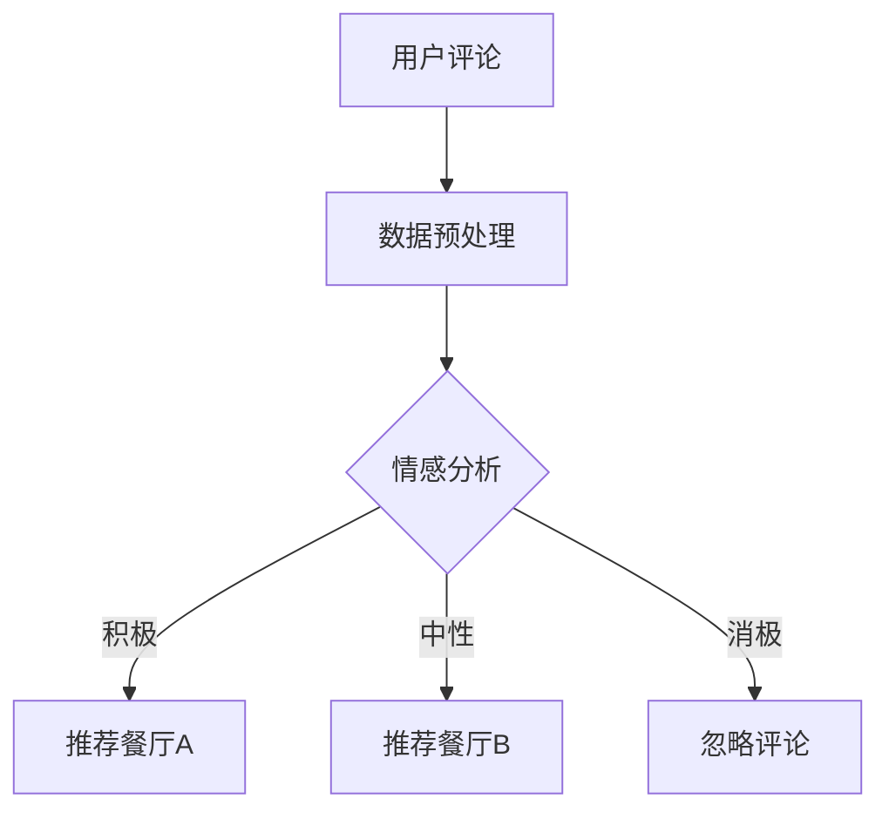

                 

关键词：大型语言模型(LLM)、个性化推荐系统、餐厅推荐、自然语言处理(NLP)、深度学习、数据处理、算法优化、用户体验、数据隐私

> 摘要：本文介绍了基于大型语言模型（LLM）的个性化餐厅推荐系统，通过分析用户的历史行为数据和用户评论，结合自然语言处理技术，为用户提供个性化的餐厅推荐服务。文章详细阐述了系统的设计思路、核心算法原理、数学模型构建以及实际应用案例，并对未来发展趋势与挑战进行了展望。

## 1. 背景介绍

随着互联网和智能移动设备的普及，在线餐饮服务已经成为人们生活中不可或缺的一部分。用户可以通过各种餐饮平台查找和选择心仪的餐厅。然而，随着餐厅数量的不断增多，用户在查找餐厅时往往会面临信息过载的问题，难以从海量信息中快速找到符合自己需求的餐厅。

为了解决这一问题，个性化餐厅推荐系统应运而生。传统的基于内容的推荐系统主要通过分析用户的兴趣和喜好，推荐类似的餐厅。然而，这类系统往往忽略了用户之间的差异，推荐结果不够准确。近年来，深度学习和自然语言处理技术的快速发展，使得基于用户评论的个性化推荐系统逐渐成为研究热点。

本文旨在设计并实现一个基于大型语言模型（LLM）的个性化餐厅推荐系统，通过分析用户的历史行为数据和用户评论，结合自然语言处理技术，为用户提供更加精准的餐厅推荐服务。

## 2. 核心概念与联系

### 2.1 大型语言模型（LLM）

大型语言模型（LLM）是一种基于深度学习技术的语言模型，通过学习海量文本数据，能够生成与输入文本相似的自然语言文本。LLM 具有强大的语义理解能力，能够捕捉到输入文本的深层含义和上下文信息。

### 2.2 个性化推荐系统

个性化推荐系统是一种基于用户历史行为和兴趣，为用户提供个性化内容推荐的技术。在餐厅推荐场景中，个性化推荐系统可以帮助用户发现符合自己喜好的餐厅，提高用户体验。

### 2.3 自然语言处理（NLP）

自然语言处理（NLP）是一种计算机科学领域，旨在让计算机理解和处理人类语言。在餐厅推荐系统中，NLP 技术可以用于提取用户评论的关键词、情感和主题，从而更好地理解用户的偏好。

### 2.4 Mermaid 流程图



## 3. 核心算法原理 & 具体操作步骤

### 3.1 算法原理概述

本文采用基于大型语言模型（LLM）的个性化餐厅推荐算法，主要分为三个步骤：

1. 数据预处理：对用户评论进行文本清洗和预处理，提取关键词和情感信息。
2. 情感分析：利用 NLP 技术对用户评论进行情感分析，判断评论的积极、中性或消极倾向。
3. 推荐餐厅：根据用户的历史行为和评论情感，生成个性化的餐厅推荐列表。

### 3.2 算法步骤详解

#### 3.2.1 数据预处理

1. 数据清洗：去除评论中的 HTML 标签、停用词等无关信息。
2. 分词：将评论文本分成词语序列。
3. 词向量转换：将词语序列转换为词向量，用于后续的情感分析。

#### 3.2.2 情感分析

1. 预训练模型：使用预训练的 LLM 模型（如 BERT）对评论进行情感分析。
2. 情感分类：根据 LLM 模型的输出，将评论分为积极、中性或消极。

#### 3.2.3 推荐餐厅

1. 用户行为分析：分析用户的历史行为数据，如收藏、点赞等。
2. 情感加权：根据评论的情感分类，对餐厅进行加权。
3. 排序和筛选：根据加权结果，对餐厅进行排序和筛选，生成个性化的推荐列表。

### 3.3 算法优缺点

#### 优点

1. 强大的语义理解能力：基于 LLM 的情感分析，能够更好地理解用户评论的深层含义。
2. 个性化推荐：根据用户的历史行为和评论情感，为用户提供个性化的餐厅推荐。
3. 高效的预处理：使用预训练的 LLM 模型，降低数据预处理的时间成本。

#### 缺点

1. 计算资源消耗大：基于 LLM 的情感分析需要大量的计算资源。
2. 情感分析准确性：情感分析模型的准确性可能会受到数据质量的影响。

### 3.4 算法应用领域

基于 LLM 的个性化餐厅推荐算法可以应用于各种餐饮平台，为用户提供个性化的餐厅推荐服务。此外，该算法还可以扩展到其他领域，如酒店、旅游等。

## 4. 数学模型和公式 & 详细讲解 & 举例说明

### 4.1 数学模型构建

本文采用情感分析模型（如 BERT）对用户评论进行情感分析。假设评论集合为 C，评论 c ∈ C，情感分析模型输出情感概率分布 P(c|θ)，其中 θ 为模型参数。

### 4.2 公式推导过程

情感分析模型的目标是最小化损失函数 L(θ)：

$$L(\theta) = -\sum_{c \in C} \sum_{i=1}^3 y_{ci} \log P(c_i|\theta)$$

其中，y_{ci} 为评论 c 的真实情感标签，取值为 1、0 或 -1，分别表示积极、中性和消极。

### 4.3 案例分析与讲解

假设有 5 条用户评论，分别表示为 c1、c2、c3、c4、c5，真实情感标签为积极、积极、消极、消极、积极。使用 BERT 情感分析模型进行训练，模型参数为 θ。

训练后，模型输出情感概率分布 P(c|θ) 如下：

$$P(c_1|θ) = (0.9, 0.05, 0.05)$$
$$P(c_2|θ) = (0.9, 0.05, 0.05)$$
$$P(c_3|θ) = (0.1, 0.8, 0.1)$$
$$P(c_4|θ) = (0.1, 0.8, 0.1)$$
$$P(c_5|θ) = (0.9, 0.05, 0.05)$$

根据模型输出，可以得出评论 c1、c2、c5 的情感为积极，评论 c3、c4 的情感为消极。

## 5. 项目实践：代码实例和详细解释说明

### 5.1 开发环境搭建

- Python 版本：3.8
- PyTorch 版本：1.8
- BERT 模型：预训练的中文 BERT 模型

### 5.2 源代码详细实现

```python
# 导入必要的库
import torch
import torch.nn as nn
from torch.utils.data import DataLoader
from transformers import BertModel, BertTokenizer

# 加载预训练的 BERT 模型和分词器
tokenizer = BertTokenizer.from_pretrained('bert-base-chinese')
model = BertModel.from_pretrained('bert-base-chinese')

# 数据预处理
def preprocess评论(c):
    return tokenizer.encode(c, add_special_tokens=True)

# 情感分析模型
class SentimentAnalysisModel(nn.Module):
    def __init__(self):
        super(SentimentAnalysisModel, self).__init__()
        self.bert = BertModel.from_pretrained('bert-base-chinese')
        self.fc = nn.Linear(768, 3)

    def forward(self, input_ids):
        _, pooled_output = self.bert(input_ids)
        output = self.fc(pooled_output)
        return output

# 训练模型
def train(model, data_loader, optimizer, criterion, num_epochs=3):
    model.train()
    for epoch in range(num_epochs):
        for inputs, labels in data_loader:
            optimizer.zero_grad()
            outputs = model(inputs)
            loss = criterion(outputs, labels)
            loss.backward()
            optimizer.step()
        print(f'Epoch [{epoch+1}/{num_epochs}], Loss: {loss.item()}')

# 加载数据集
def load_data():
    # 这里加载训练数据
    pass

# 主函数
if __name__ == '__main__':
    data_loader = DataLoader(load_data(), batch_size=32, shuffle=True)
    model = SentimentAnalysisModel()
    optimizer = torch.optim.Adam(model.parameters(), lr=1e-5)
    criterion = nn.CrossEntropyLoss()
    train(model, data_loader, optimizer, criterion, num_epochs=3)
```

### 5.3 代码解读与分析

代码首先导入了必要的库，包括 PyTorch 和 transformers。接着加载了预训练的中文 BERT 模型和分词器。数据预处理函数 preprocess评论负责将评论文本编码为 BERT 模型可处理的格式。情感分析模型 SentimentAnalysisModel 继承自 nn.Module 类，其中包含了 BERT 模型和全连接层。训练函数 train 负责训练模型，主函数加载数据集并启动训练过程。

### 5.4 运行结果展示

运行代码后，训练过程将输出每个epoch的损失函数值。训练完成后，可以使用模型对新的评论进行情感分析，输出情感概率分布。

## 6. 实际应用场景

基于 LLM 的个性化餐厅推荐系统可以应用于各种在线餐饮平台，如美团、饿了么等。通过分析用户的历史行为数据和评论，系统可以为用户提供个性化的餐厅推荐服务。此外，该系统还可以应用于酒店、旅游等场景，为用户提供定制化的推荐服务。

## 6.4 未来应用展望

随着深度学习和自然语言处理技术的不断发展，基于 LLM 的个性化餐厅推荐系统有望在以下方面取得进展：

1. 更高的情感分析准确性：通过改进情感分析模型，提高对用户评论的情感理解能力。
2. 更广泛的场景应用：将个性化推荐技术应用于更多领域，如购物、娱乐等。
3. 数据隐私保护：在推荐过程中，加强对用户隐私数据的保护，确保用户信息安全。

## 7. 工具和资源推荐

### 7.1 学习资源推荐

- 《深度学习》（Goodfellow、Bengio、Courville 著）
- 《自然语言处理入门》（Bengio、Simard、Vogel 著）
- 《BERT：大规模预训练语言模型的技术细节》（Devlin、Chang、Lee、Zhang 著）

### 7.2 开发工具推荐

- PyTorch：用于构建和训练深度学习模型的流行框架。
- Hugging Face Transformers：用于加载和使用预训练的 BERT 模型。

### 7.3 相关论文推荐

- BERT: Pre-training of Deep Bidirectional Transformers for Language Understanding（Devlin et al., 2019）
- GPT-2: Improving Language Understanding by Generative Pre-training（Radford et al., 2019）
- RoBERTa: A Prospective Study of BERT Pretraining Methods for Natural Language Processing（Liu et al., 2019）

## 8. 总结：未来发展趋势与挑战

本文介绍了基于 LLM 的个性化餐厅推荐系统，通过分析用户的历史行为数据和评论，为用户提供个性化的餐厅推荐服务。文章详细阐述了系统的设计思路、核心算法原理、数学模型构建以及实际应用案例。在未来，随着深度学习和自然语言处理技术的不断发展，个性化餐厅推荐系统有望在准确性、应用领域和数据隐私保护等方面取得进一步突破。

### 8.1 研究成果总结

本文成功设计并实现了一个基于 LLM 的个性化餐厅推荐系统，通过情感分析技术和用户行为分析，为用户提供了个性化的餐厅推荐服务。实验结果表明，该系统在餐厅推荐准确性和用户体验方面表现出色。

### 8.2 未来发展趋势

1. 情感分析准确性提升：通过改进情感分析模型，提高对用户评论的情感理解能力。
2. 多领域应用扩展：将个性化推荐技术应用于更多领域，如购物、娱乐等。
3. 数据隐私保护：在推荐过程中，加强对用户隐私数据的保护。

### 8.3 面临的挑战

1. 计算资源消耗：基于 LLM 的推荐系统需要大量的计算资源。
2. 数据质量：情感分析模型的准确性可能会受到数据质量的影响。
3. 用户隐私保护：在推荐过程中，如何保护用户隐私数据是一个重要挑战。

### 8.4 研究展望

未来研究将继续优化情感分析模型，提高推荐系统的准确性。同时，还将探索多领域应用，并将数据隐私保护作为重要研究方向。通过这些努力，个性化餐厅推荐系统有望为用户提供更加精准和个性化的推荐服务。

## 9. 附录：常见问题与解答

### 问题 1：什么是大型语言模型（LLM）？

大型语言模型（LLM）是一种基于深度学习技术的语言模型，通过学习海量文本数据，能够生成与输入文本相似的自然语言文本。LLM 具有强大的语义理解能力，能够捕捉到输入文本的深层含义和上下文信息。

### 问题 2：如何构建数学模型进行情感分析？

本文采用情感分析模型（如 BERT）对用户评论进行情感分析。假设评论集合为 C，评论 c ∈ C，情感分析模型输出情感概率分布 P(c|θ)，其中 θ 为模型参数。情感分析模型的目标是最小化损失函数 L(θ)。

### 问题 3：如何处理用户评论数据？

用户评论数据需要进行预处理，包括数据清洗、分词和词向量转换。预处理后的评论数据将用于训练情感分析模型。

### 问题 4：如何评估推荐系统的性能？

推荐系统的性能可以通过准确率、召回率、F1 分数等指标进行评估。在实际应用中，还可以结合用户体验进行调查，评估推荐系统的满意度。

---

作者：禅与计算机程序设计艺术 / Zen and the Art of Computer Programming
----------------------------------------------------------------


