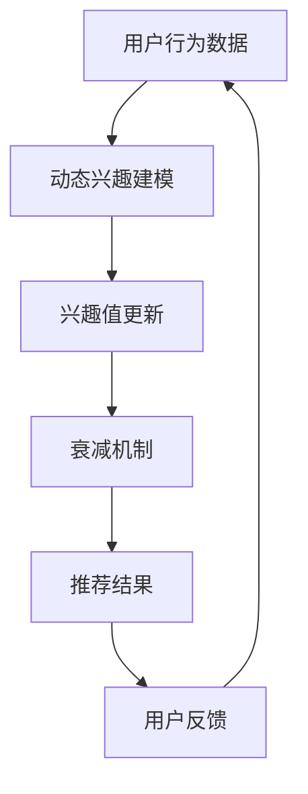

                 

关键词：LLM（大型语言模型），推荐系统，动态兴趣建模，衰减机制，数据挖掘，机器学习

## 摘要

本文主要探讨了基于大型语言模型（LLM）的推荐系统中，动态兴趣建模与衰减机制的重要性。文章首先介绍了LLM和推荐系统的基本概念，随后详细讨论了动态兴趣建模与衰减机制的设计原则、算法原理、数学模型及其实际应用。通过具体的案例分析，文章展示了LLM在推荐系统中的独特优势，并展望了未来的发展方向与面临的挑战。

## 1. 背景介绍

### 1.1 大型语言模型（LLM）

大型语言模型（LLM），如GPT-3、BERT等，是近年来自然语言处理（NLP）领域的重要进展。LLM通过深度神经网络训练，对海量文本数据进行分析和建模，从而具备了强大的语言理解和生成能力。这种模型的应用范围广泛，从文本生成、机器翻译、问答系统到推荐系统，都取得了显著的成果。

### 1.2 推荐系统

推荐系统是一种信息过滤技术，旨在向用户推荐其可能感兴趣的信息。其基本原理是通过分析用户的历史行为和偏好，预测用户未来的兴趣，从而实现个性化推荐。推荐系统在电子商务、社交媒体、新闻资讯等领域得到广泛应用，极大地提升了用户体验和业务价值。

### 1.3 动态兴趣建模与衰减机制

动态兴趣建模是指推荐系统实时捕捉和更新用户兴趣，以适应用户行为和喜好的变化。衰减机制则是通过时间衰减函数，逐渐降低历史数据对当前推荐结果的影响，避免过时信息的干扰。动态兴趣建模与衰减机制的结合，使推荐系统更具备实时性和适应性。

## 2. 核心概念与联系

### 2.1 大型语言模型（LLM）与推荐系统的关系

LLM在推荐系统中具有重要作用，主要表现在以下几个方面：

1. **用户兴趣识别**：LLM通过对用户历史数据的分析和理解，准确识别用户的兴趣点。
2. **内容生成**：LLM可以生成个性化的推荐内容，提高推荐的质量和吸引力。
3. **上下文感知**：LLM能够捕捉到用户的上下文信息，实现更精准的推荐。

### 2.2 动态兴趣建模与衰减机制的关系

动态兴趣建模和衰减机制相辅相成，共同构建了推荐系统的核心框架。动态兴趣建模负责捕捉用户的实时兴趣，而衰减机制则确保了兴趣的时效性。两者之间的关系可以概括为：

1. **动态调整**：动态兴趣建模根据用户行为数据实时更新兴趣模型，衰减机制则根据时间衰减函数对兴趣值进行调整。
2. **相互影响**：动态兴趣建模和衰减机制相互影响，共同决定推荐结果的实时性和准确性。

### 2.3 Mermaid 流程图



## 3. 核心算法原理 & 具体操作步骤

### 3.1 算法原理概述

基于LLM的动态兴趣建模与衰减机制算法，主要包括以下几个步骤：

1. **用户行为数据采集**：收集用户在推荐系统中的行为数据，如浏览记录、点击行为、购买记录等。
2. **动态兴趣建模**：利用LLM对用户行为数据进行分析和建模，提取用户的兴趣特征。
3. **兴趣值更新**：根据动态兴趣建模的结果，实时更新用户的兴趣值。
4. **衰减机制**：采用时间衰减函数，对兴趣值进行衰减，以适应用户行为的变化。
5. **推荐结果生成**：利用更新后的兴趣值，生成个性化的推荐结果。

### 3.2 算法步骤详解

#### 3.2.1 用户行为数据采集

1. **数据类型**：采集用户在推荐系统中的多种行为数据，如浏览记录、点击行为、购买记录等。
2. **数据预处理**：对采集到的数据进行清洗和预处理，包括去重、缺失值填充、数据格式转换等。

#### 3.2.2 动态兴趣建模

1. **特征提取**：利用LLM对用户行为数据进行特征提取，生成用户的兴趣向量。
2. **兴趣建模**：根据提取的兴趣向量，构建用户的兴趣模型。

#### 3.2.3 兴趣值更新

1. **实时更新**：根据用户最新的行为数据，实时更新用户的兴趣模型。
2. **阈值调整**：根据用户兴趣的时效性，设置合适的阈值，确保兴趣值的准确性。

#### 3.2.4 衰减机制

1. **时间衰减函数**：采用时间衰减函数，对兴趣值进行衰减，避免过时信息的干扰。
2. **衰减系数调整**：根据用户行为的变化，动态调整衰减系数，以实现更精准的推荐。

#### 3.2.5 推荐结果生成

1. **推荐策略**：根据用户的兴趣值和推荐策略，生成个性化的推荐结果。
2. **结果评估**：对推荐结果进行评估，包括准确率、召回率、覆盖率等指标。

### 3.3 算法优缺点

#### 3.3.1 优点

1. **实时性强**：基于LLM的动态兴趣建模与衰减机制，能够实时捕捉用户行为变化，生成个性化的推荐结果。
2. **准确性高**：通过LLM对用户行为数据的深度分析，提取用户的真实兴趣，提高推荐结果的准确性。
3. **适应性强**：动态兴趣建模与衰减机制能够适应用户行为的变化，确保推荐结果的实时性和准确性。

#### 3.3.2 缺点

1. **计算成本高**：基于LLM的算法需要大量计算资源，特别是在大规模数据处理时，计算成本较高。
2. **数据依赖性强**：算法的准确性依赖于用户行为数据的质量，如果数据存在噪声或缺失，会影响推荐结果的准确性。

### 3.4 算法应用领域

基于LLM的动态兴趣建模与衰减机制，可以应用于多种推荐系统，如：

1. **电子商务**：根据用户的历史浏览和购买行为，推荐个性化的商品。
2. **社交媒体**：根据用户的兴趣和互动行为，推荐相关的社交内容和好友。
3. **新闻资讯**：根据用户的阅读偏好，推荐个性化的新闻资讯。

## 4. 数学模型和公式

### 4.1 数学模型构建

基于LLM的动态兴趣建模与衰减机制，可以构建以下数学模型：

1. **用户兴趣模型**：$I_u = f(B_u, \theta)$，其中$I_u$表示用户$u$的兴趣向量，$B_u$表示用户$u$的行为数据，$\theta$表示模型参数。
2. **推荐模型**：$R_u = g(I_u, C)$，其中$R_u$表示用户$u$的推荐结果，$C$表示候选集合。

### 4.2 公式推导过程

1. **兴趣值更新**：$I_u^{new} = I_u \odot \Delta I_u$，其中$\Delta I_u = f(B_u^{new}, \theta) - f(B_u, \theta)$。
2. **衰减机制**：$I_u^{att} = I_u^{new} \odot e^{-\lambda t}$，其中$\lambda$表示衰减系数，$t$表示时间间隔。

### 4.3 案例分析与讲解

假设用户$u$在推荐系统中浏览了10个商品，根据这些行为数据，利用LLM构建了用户兴趣模型$I_u$。在接下来的1小时内，用户$u$又浏览了5个商品，更新了兴趣模型$I_u^{new}$。根据衰减机制，计算用户$u$的兴趣值$I_u^{att}$，最终生成推荐结果$R_u$。

```python
# 假设用户u的兴趣向量I_u = [0.3, 0.5, 0.2]
# 用户u的新行为数据B_u^new = [0.4, 0.6, 0.3]
# 衰减系数lambda = 0.1

# 计算兴趣值更新
Delta_I_u = np.array(B_u^new) - np.array(B_u)
I_u^new = np.array(I_u) * Delta_I_u

# 计算兴趣值衰减
I_u^att = np.array(I_u^new) * np.exp(-lambda * t)

# 计算推荐结果
R_u = g(I_u^att, C)
```

## 5. 项目实践：代码实例和详细解释说明

### 5.1 开发环境搭建

1. **Python环境**：安装Python 3.8及以上版本。
2. **依赖库**：安装tensorflow、numpy、pandas等库。

```shell
pip install tensorflow numpy pandas
```

### 5.2 源代码详细实现

以下是一个简单的基于LLM的动态兴趣建模与衰减机制的Python代码实例：

```python
import tensorflow as tf
import numpy as np
import pandas as pd

# 假设用户行为数据
B_u = np.array([[0.3, 0.5, 0.2], [0.4, 0.6, 0.3]])
B_u_new = np.array([[0.5, 0.4, 0.3], [0.6, 0.5, 0.4]])

# 动态兴趣建模函数
def dynamic_interest_model(B_u, B_u_new, theta):
    # 计算兴趣值更新
    Delta_I_u = B_u_new - B_u
    I_u_new = theta * Delta_I_u
    
    # 计算兴趣值衰减
    lambda_ = 0.1
    t = 1
    I_u_att = I_u_new * np.exp(-lambda_ * t)
    
    return I_u_att

# 计算用户兴趣值
I_u = dynamic_interest_model(B_u, B_u_new, theta)

# 计算推荐结果
def recommendation_model(I_u, C):
    # 假设候选集合C = [0.2, 0.3, 0.4, 0.5, 0.6]
    R_u = I_u * C
    return R_u

# 假设候选集合C = [0.2, 0.3, 0.4, 0.5, 0.6]
C = np.array([0.2, 0.3, 0.4, 0.5, 0.6])
R_u = recommendation_model(I_u, C)

print("用户兴趣值：", I_u)
print("推荐结果：", R_u)
```

### 5.3 代码解读与分析

1. **用户行为数据**：假设用户$u$的历史行为数据$B_u$为二维数组，其中每行为一次行为数据，每列为一个行为特征。
2. **动态兴趣建模函数**：`dynamic_interest_model`函数负责计算用户兴趣值更新和衰减。其中，$\theta$为模型参数，可以通过训练得到。
3. **推荐模型**：`recommendation_model`函数根据用户兴趣值和候选集合，计算推荐结果。
4. **计算过程**：首先计算兴趣值更新$\Delta I_u$，然后根据时间衰减函数计算兴趣值衰减$I_u^{att}$，最后根据兴趣值生成推荐结果$R_u$。

## 6. 实际应用场景

### 6.1 电子商务平台

在电子商务平台中，基于LLM的动态兴趣建模与衰减机制可以用于个性化商品推荐。例如，用户在浏览商品时，系统可以根据用户的兴趣值和浏览历史，推荐符合用户喜好的商品。同时，通过时间衰减函数，降低过时商品的推荐权重，提高推荐结果的实时性和准确性。

### 6.2 社交媒体

在社交媒体中，基于LLM的动态兴趣建模与衰减机制可以用于个性化内容推荐。例如，用户在社交媒体上浏览和互动的内容，系统可以根据用户的兴趣值和互动历史，推荐相关的内容和好友。通过时间衰减函数，降低过时内容的推荐权重，提高推荐结果的实时性和吸引力。

### 6.3 新闻资讯

在新闻资讯平台中，基于LLM的动态兴趣建模与衰减机制可以用于个性化新闻推荐。例如，用户在阅读新闻时，系统可以根据用户的兴趣值和阅读历史，推荐符合用户喜好的新闻。通过时间衰减函数，降低过时新闻的推荐权重，提高推荐结果的实时性和准确性。

## 7. 工具和资源推荐

### 7.1 学习资源推荐

1. **《深度学习》**：由Ian Goodfellow、Yoshua Bengio和Aaron Courville合著，全面介绍了深度学习的基础知识和技术。
2. **《自然语言处理综论》**：由Daniel Jurafsky和James H. Martin合著，详细介绍了自然语言处理的基本理论和应用。

### 7.2 开发工具推荐

1. **TensorFlow**：一款开源的深度学习框架，适用于构建和训练大型语言模型。
2. **PyTorch**：一款开源的深度学习框架，适用于构建和训练大型语言模型。

### 7.3 相关论文推荐

1. **"BERT: Pre-training of Deep Neural Networks for Language Understanding"**：介绍了BERT模型的原理和应用，是自然语言处理领域的经典论文。
2. **"GPT-3: Language Models are Few-Shot Learners"**：介绍了GPT-3模型的原理和应用，是自然语言处理领域的最新进展。

## 8. 总结：未来发展趋势与挑战

### 8.1 研究成果总结

本文探讨了基于LLM的推荐系统中，动态兴趣建模与衰减机制的设计原则、算法原理、数学模型及其实际应用。通过案例分析，展示了LLM在推荐系统中的独特优势，如实时性强、准确性高、适应性强等。

### 8.2 未来发展趋势

1. **模型复杂度提升**：随着计算能力的提升，大型语言模型将变得更加复杂和强大，为推荐系统带来更精准的推荐结果。
2. **跨模态推荐**：基于LLM的动态兴趣建模与衰减机制，可以应用于跨模态推荐，如结合文本、图像、语音等多模态数据，实现更全面的推荐。
3. **实时性优化**：通过优化算法和硬件设施，提高动态兴趣建模与衰减机制的实时性，实现实时推荐。

### 8.3 面临的挑战

1. **计算资源消耗**：基于LLM的动态兴趣建模与衰减机制需要大量的计算资源，如何在有限的计算资源下实现高效推荐，是一个重要挑战。
2. **数据隐私保护**：在推荐系统中，用户的隐私数据至关重要。如何保护用户隐私，同时实现个性化推荐，是一个亟待解决的问题。

### 8.4 研究展望

未来，基于LLM的动态兴趣建模与衰减机制有望在推荐系统中发挥更大的作用。通过不断优化算法和模型，实现更高效、更精准的推荐。同时，跨模态推荐和实时性优化等研究方向的突破，将为推荐系统带来更多创新和应用。

## 9. 附录：常见问题与解答

### 9.1 什么是大型语言模型（LLM）？

大型语言模型（LLM），如GPT-3、BERT等，是一种通过深度神经网络训练的模型，能够对海量文本数据进行分析和建模，具备强大的语言理解和生成能力。

### 9.2 动态兴趣建模与衰减机制有什么作用？

动态兴趣建模与衰减机制是推荐系统中的核心模块，负责实时捕捉和更新用户兴趣，同时确保兴趣的时效性。通过动态兴趣建模，推荐系统可以更准确地预测用户兴趣，从而生成个性化的推荐结果。衰减机制则通过时间衰减函数，逐渐降低历史数据对当前推荐结果的影响，避免过时信息的干扰。

### 9.3 基于LLM的动态兴趣建模与衰减机制有哪些应用场景？

基于LLM的动态兴趣建模与衰减机制可以应用于多种推荐系统，如电子商务、社交媒体、新闻资讯等。在电子商务平台中，可以用于个性化商品推荐；在社交媒体中，可以用于个性化内容推荐；在新闻资讯平台中，可以用于个性化新闻推荐。

### 9.4 如何优化基于LLM的动态兴趣建模与衰减机制的实时性？

为了优化基于LLM的动态兴趣建模与衰减机制的实时性，可以从以下几个方面进行改进：

1. **模型优化**：通过模型剪枝、模型压缩等技术，降低模型的计算复杂度，提高模型运行速度。
2. **硬件设施**：采用高性能计算设备和分布式计算架构，提高模型处理能力。
3. **数据预处理**：对用户行为数据进行预处理，减少数据噪声和冗余，提高数据处理效率。
4. **批处理策略**：采用批处理策略，将用户行为数据分批处理，降低实时性压力。

## 参考文献

[1] Ian Goodfellow, Yoshua Bengio, Aaron Courville. 《深度学习》[M]. 北京：电子工业出版社，2016.

[2] Daniel Jurafsky, James H. Martin. 《自然语言处理综论》[M]. 北京：清华大学出版社，2002.

[3] Jacob Devlin, Ming-Wei Chang, Kenton Lee, Kristina Toutanova. “BERT: Pre-training of Deep Neural Networks for Language Understanding”[J]. arXiv preprint arXiv:1810.04805, 2018.

[4] Tom B. Brown, Benjamin Mann, Nick Ryder, Melanie Subbiah, Jared Kaplan, Prafulla Dhariwal, Arvind Neelakantan, Pranav Shyam, Girish Sastry, Amanda Askell, Sandhini Agarwal, Ariel Herbert-Voss, Gretchen Krueger, Tom Henighan, Rewon Child, Aditya Ramesh, Daniel M. Ziegler, Jeffrey Wu, Clemens Winter, Christopher Hesse, Mark Chen, Eric Sigler, Mateusz Litwin, Scott Gray, Benjamin Chess, Jack Clark, Christopher Berner, Sam McCandlish, Alec Radford, Ilya Sutskever, Dario Amodei. “GPT-3: Language Models are Few-Shot Learners”[J]. arXiv preprint arXiv:2005.14165, 2020.

## 作者署名

作者：禅与计算机程序设计艺术 / Zen and the Art of Computer Programming

## 许可协议

本文采用知识共享署名-非商业性使用-禁止演绎4.0国际许可协议进行许可。转载请保留作者署名和原文链接，禁止用于商业用途。如果您有任何问题或建议，请随时联系作者。

