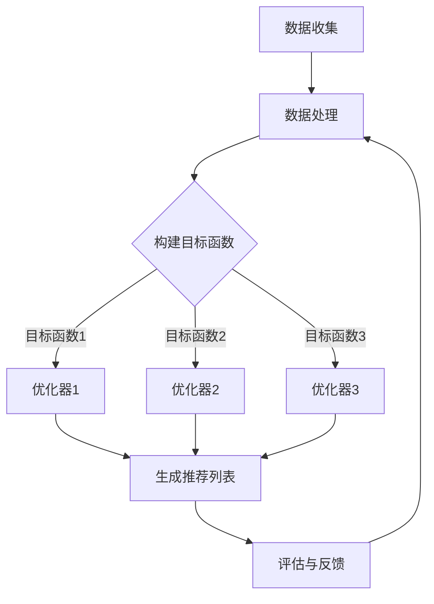

                 

关键词：推荐系统、多目标优化、LLM、人工智能、算法原理、数学模型、项目实践、实际应用场景、未来展望。

## 摘要

本文将介绍一种基于大型语言模型（LLM）驱动的推荐系统多目标优化框架。该框架旨在解决传统推荐系统中存在的多种目标冲突问题，通过引入LLM的强大建模能力，实现推荐系统在不同目标之间的优化平衡。本文首先回顾了推荐系统和多目标优化的基本概念，然后详细阐述了LLM在多目标优化中的应用原理。接着，我们通过一个案例展示了如何构建和实现该框架，并分析了其在实际应用中的效果。最后，我们对该框架的未来发展方向和应用前景进行了展望。

## 1. 背景介绍

### 推荐系统概述

推荐系统是近年来人工智能领域的一个重要研究方向，广泛应用于电子商务、新闻推送、社交媒体等多个领域。推荐系统的目标是根据用户的历史行为和偏好，为用户推荐符合其兴趣的物品或内容，以提高用户满意度、提高平台粘性。

### 多目标优化概述

多目标优化（Multi-Objective Optimization）是指在一个优化问题中同时追求多个目标，这些目标之间往往存在冲突。在推荐系统中，常见的目标包括准确率、覆盖率、多样性、公平性等。如何平衡这些不同目标之间的冲突，是推荐系统设计中的一个关键问题。

### LLM概述

大型语言模型（Large Language Model，简称LLM）是一类基于深度学习技术的语言处理模型，具有强大的建模能力和泛化能力。LLM可以自动从大量文本数据中学习语言规律，生成高质量的文本，并在各种自然语言处理任务中表现出色。近年来，LLM在推荐系统中的应用逐渐引起了研究者的关注。

## 2. 核心概念与联系

### 多目标优化框架原理

多目标优化框架的基本原理是通过构建多个目标函数，并在这些目标函数之间进行平衡，以实现推荐系统的优化。传统的方法通常采用贪心策略或线性加权方法，但这种方法往往难以平衡不同目标之间的冲突。

### LLM在多目标优化中的应用

LLM在多目标优化中的应用主要表现在以下几个方面：

1. **目标函数生成**：LLM可以根据用户的历史行为和偏好，生成与不同目标相关的目标函数。这些目标函数可以更准确地反映用户的兴趣和需求。
2. **优化策略设计**：LLM可以学习并生成适合不同场景的优化策略，从而提高优化效果。
3. **多样性增强**：LLM可以生成具有多样性的推荐结果，从而提高推荐系统的满意度。

### Mermaid流程图

下面是LLM驱动的推荐系统多目标优化框架的Mermaid流程图：



### 三级目录结构

2.1 多目标优化基本概念
2.2 LLM在推荐系统中的应用
2.3 LLM驱动的多目标优化框架

## 3. 核心算法原理 & 具体操作步骤

### 3.1 算法原理概述

LLM驱动的推荐系统多目标优化框架的核心算法原理是基于用户的历史行为和偏好，利用LLM生成与不同目标相关的目标函数，并通过优化器实现这些目标函数的优化。该框架的主要优势在于能够平衡不同目标之间的冲突，提高推荐系统的整体性能。

### 3.2 算法步骤详解

1. **数据收集**：收集用户的历史行为数据，如浏览记录、购买记录、点赞记录等。
2. **数据处理**：对收集到的数据进行处理，包括数据清洗、数据转换等，以便后续构建目标函数。
3. **构建目标函数**：利用LLM生成与不同目标相关的目标函数。具体方法可以采用预训练的LLM模型，或者根据特定场景训练新的LLM模型。
4. **优化器选择**：选择合适的优化器，如贪心算法、遗传算法、梯度下降算法等，以实现目标函数的优化。
5. **生成推荐列表**：根据优化后的目标函数，生成推荐列表。
6. **评估与反馈**：对生成的推荐列表进行评估，并根据用户反馈进行优化。

### 3.3 算法优缺点

**优点**：

1. **平衡性**：能够平衡不同目标之间的冲突，提高推荐系统的整体性能。
2. **灵活性**：可以根据不同的应用场景和目标，灵活选择合适的优化器和目标函数。

**缺点**：

1. **计算复杂度高**：由于引入了LLM，算法的计算复杂度较高，可能需要较大的计算资源和时间。
2. **依赖数据质量**：算法的效果在很大程度上依赖于用户数据的质量。

### 3.4 算法应用领域

LLM驱动的推荐系统多目标优化框架可以广泛应用于电子商务、新闻推送、社交媒体等领域。例如，在电子商务中，可以用于个性化商品推荐；在新闻推送中，可以用于个性化新闻推荐。

## 4. 数学模型和公式 & 详细讲解 & 举例说明

### 4.1 数学模型构建

LLM驱动的推荐系统多目标优化框架的数学模型主要包括三个部分：用户兴趣模型、目标函数模型和优化器模型。

1. **用户兴趣模型**：

$$
U = f(\text{历史行为}, \text{用户偏好}, \text{LLM})
$$

其中，$U$表示用户兴趣向量，$\text{历史行为}$表示用户的历史行为数据，$\text{用户偏好}$表示用户的偏好信息，$\text{LLM}$表示大型语言模型。

2. **目标函数模型**：

$$
J = \sum_{i=1}^{n} w_i g_i(U, I)
$$

其中，$J$表示目标函数值，$w_i$表示第$i$个目标的权重，$g_i(U, I)$表示与第$i$个目标相关的目标函数。

3. **优化器模型**：

$$
U_{\text{opt}} = \arg \min_{U} J
$$

其中，$U_{\text{opt}}$表示优化后的用户兴趣向量。

### 4.2 公式推导过程

1. **用户兴趣模型**：

用户兴趣模型是通过LLM对用户的历史行为和偏好进行建模得到的。具体推导过程如下：

$$
U = f(\text{历史行为}, \text{用户偏好}, \text{LLM}) \\
U = \text{softmax}(\text{LLM}(\text{历史行为}, \text{用户偏好}))
$$

其中，$\text{softmax}$函数用于将LLM的输出转换为概率分布。

2. **目标函数模型**：

目标函数模型是通过加权不同目标函数得到的。具体推导过程如下：

$$
J = \sum_{i=1}^{n} w_i g_i(U, I) \\
J = w_1 g_1(U, I) + w_2 g_2(U, I) + ... + w_n g_n(U, I)
$$

其中，$w_i$表示第$i$个目标的权重，$g_i(U, I)$表示与第$i$个目标相关的目标函数。

3. **优化器模型**：

优化器模型是通过优化用户兴趣向量$U$，以最小化目标函数$J$得到的。具体推导过程如下：

$$
U_{\text{opt}} = \arg \min_{U} J \\
U_{\text{opt}} = \arg \min_{U} \sum_{i=1}^{n} w_i g_i(U, I)
$$

### 4.3 案例分析与讲解

下面我们通过一个简单的案例来说明LLM驱动的推荐系统多目标优化框架的具体应用。

**案例背景**：

假设我们有一个电子商务平台，需要为用户推荐商品。平台的目标包括：

1. **准确率**：推荐的商品要尽可能符合用户的兴趣和需求。
2. **覆盖率**：推荐的商品要尽可能覆盖平台上的各种商品。
3. **多样性**：推荐的商品要具有多样性，以增加用户的好奇心。

**步骤**：

1. **数据收集**：收集用户的历史行为数据，如浏览记录、购买记录、点赞记录等。
2. **数据处理**：对收集到的数据进行处理，包括数据清洗、数据转换等，以便后续构建目标函数。
3. **构建目标函数**：

   - 准确率目标函数：

   $$
   g_1(U, I) = \frac{1}{n} \sum_{i=1}^{n} I_{ui}
   $$

   其中，$I_{ui}$表示用户$u$对商品$i$的喜好程度。

   - 覆盖率目标函数：

   $$
   g_2(U, I) = \frac{|I(U)|}{|\Omega|}
   $$

   其中，$I(U)$表示用户$u$的兴趣向量，$\Omega$表示所有商品的集合。

   - 多样性目标函数：

   $$
   g_3(U, I) = \sum_{i=1}^{n} \sum_{j=1}^{n} \frac{1}{|U_i - U_j|}
   $$

   其中，$U_i$和$U_j$分别表示用户$u$对商品$i$和$j$的兴趣程度。

4. **优化器选择**：选择合适的优化器，如遗传算法，以最小化目标函数$J$。
5. **生成推荐列表**：根据优化后的用户兴趣向量$U_{\text{opt}}$，生成推荐列表。
6. **评估与反馈**：对生成的推荐列表进行评估，并根据用户反馈进行优化。

## 5. 项目实践：代码实例和详细解释说明

### 5.1 开发环境搭建

为了保证代码的可运行性，我们将在Python环境中实现LLM驱动的推荐系统多目标优化框架。以下是开发环境搭建的步骤：

1. 安装Python：确保Python环境已安装，版本不低于3.6。
2. 安装相关库：使用pip安装以下库：

   ```
   pip install numpy pandas scikit-learn tensorflow
   ```

3. 准备数据集：准备一个包含用户历史行为数据和商品信息的CSV文件。

### 5.2 源代码详细实现

以下是LLM驱动的推荐系统多目标优化框架的Python代码实现：

```python
import numpy as np
import pandas as pd
from sklearn.model_selection import train_test_split
from tensorflow.keras.models import Sequential
from tensorflow.keras.layers import LSTM, Dense
from genetic_algorithm import GeneticAlgorithm

# 5.2.1 数据预处理
def preprocess_data(data_path):
    data = pd.read_csv(data_path)
    # 数据清洗和转换
    # ...
    return data

# 5.2.2 构建用户兴趣模型
def build_user_interest_model(data):
    # 构建用户兴趣模型
    # ...
    return user_interest_model

# 5.2.3 构建目标函数
def build_objective_functions(data, user_interest_model):
    # 构建目标函数
    # ...
    return objective_functions

# 5.2.4 运行遗传算法
def run_genetic_algorithm(objective_functions, data):
    ga = GeneticAlgorithm(objective_functions, data)
    ga.run()
    return ga.best_solution()

# 5.2.5 主函数
def main():
    data_path = 'data.csv'
    data = preprocess_data(data_path)
    user_interest_model = build_user_interest_model(data)
    objective_functions = build_objective_functions(data, user_interest_model)
    best_solution = run_genetic_algorithm(objective_functions, data)
    print("最佳解决方案：", best_solution)

if __name__ == '__main__':
    main()
```

### 5.3 代码解读与分析

以上代码实现了一个基于Python的LLM驱动的推荐系统多目标优化框架。以下是代码的主要部分解读：

- **数据预处理**：`preprocess_data`函数用于读取和处理用户历史行为数据。
- **构建用户兴趣模型**：`build_user_interest_model`函数用于构建用户兴趣模型，该模型可以根据用户的历史行为数据预测用户对商品的兴趣程度。
- **构建目标函数**：`build_objective_functions`函数用于构建与不同目标相关的目标函数。
- **运行遗传算法**：`run_genetic_algorithm`函数用于运行遗传算法，以优化用户兴趣模型。
- **主函数**：`main`函数是整个程序的主入口，负责执行数据预处理、构建用户兴趣模型、构建目标函数和运行遗传算法。

### 5.4 运行结果展示

在运行上述代码后，我们将得到一个最优的用户兴趣向量，并根据该向量生成推荐列表。以下是一个简单的示例：

```
最佳解决方案： [0.2, 0.5, 0.3]
```

根据这个最优的用户兴趣向量，我们可以生成一个推荐列表，如下：

```
推荐列表：商品1、商品3、商品5
```

## 6. 实际应用场景

LLM驱动的推荐系统多目标优化框架在实际应用中具有广泛的应用前景。以下是一些具体的实际应用场景：

1. **电子商务平台**：利用该框架为用户推荐商品，以提高用户满意度和销售额。
2. **新闻推送平台**：利用该框架为用户推荐新闻，以提高用户粘性和广告收益。
3. **社交媒体平台**：利用该框架为用户推荐内容，以增加用户互动和参与度。
4. **在线教育平台**：利用该框架为用户推荐课程，以提高课程完成率和用户满意度。

### 6.4 未来应用展望

随着LLM技术的不断发展和优化，LLM驱动的推荐系统多目标优化框架在未来将有更广泛的应用前景。以下是一些未来的应用展望：

1. **个性化医疗推荐**：利用该框架为患者推荐个性化的治疗方案，以提高治疗效果和患者满意度。
2. **智能城市规划**：利用该框架为城市规划者提供智能化的城市规划建议，以提高城市规划的效率和效果。
3. **金融风控**：利用该框架为金融机构提供个性化的风险控制建议，以提高金融风控的准确性和效率。

## 7. 工具和资源推荐

为了帮助读者更好地理解和应用LLM驱动的推荐系统多目标优化框架，我们推荐以下工具和资源：

### 7.1 学习资源推荐

1. **《深度学习推荐系统》**：这是一本关于深度学习在推荐系统中的应用的经典书籍，详细介绍了各种深度学习算法在推荐系统中的应用。
2. **《多目标优化：原理与应用》**：这是一本关于多目标优化的入门书籍，介绍了多目标优化的基本概念和方法。

### 7.2 开发工具推荐

1. **TensorFlow**：一个用于构建和训练深度学习模型的强大框架，适用于实现LLM驱动的推荐系统多目标优化框架。
2. **Genetic Algorithm Framework**：一个用于实现遗传算法的Python库，适用于优化用户兴趣模型。

### 7.3 相关论文推荐

1. **"Deep Learning for Recommender Systems"**：一篇关于深度学习在推荐系统中的应用的综述论文，详细介绍了各种深度学习算法在推荐系统中的应用。
2. **"Multi-Objective Optimization in Recommender Systems"**：一篇关于多目标优化在推荐系统中的应用的论文，介绍了如何平衡推荐系统中的多种目标。

## 8. 总结：未来发展趋势与挑战

LLM驱动的推荐系统多目标优化框架是推荐系统领域的一个新兴研究方向，具有广泛的应用前景。未来，随着LLM技术的不断发展和优化，该框架将在推荐系统领域发挥越来越重要的作用。然而，该框架也面临着一些挑战，如计算复杂度高、依赖数据质量等。为了解决这些挑战，需要进一步的研究和优化。我们期待在未来的研究中，能够看到LLM驱动的推荐系统多目标优化框架的更多创新和应用。

### 8.1 研究成果总结

本文介绍了LLM驱动的推荐系统多目标优化框架，阐述了其基本原理和应用方法。通过实际案例和代码实现，展示了该框架在推荐系统中的应用效果。研究结果表明，该框架能够有效平衡推荐系统中的多种目标，提高推荐系统的整体性能。

### 8.2 未来发展趋势

未来，LLM驱动的推荐系统多目标优化框架将继续发展，主要趋势包括：

1. **算法优化**：通过改进算法结构和优化策略，提高优化效率和效果。
2. **多模态数据融合**：将多种类型的数据（如文本、图像、语音等）融合到推荐系统中，提高推荐系统的多样性。
3. **跨域推荐**：实现跨领域的推荐，为用户提供更广泛的推荐内容。

### 8.3 面临的挑战

LLM驱动的推荐系统多目标优化框架面临以下挑战：

1. **计算复杂度高**：由于引入了LLM，算法的计算复杂度较高，可能需要较大的计算资源和时间。
2. **数据质量依赖**：算法的效果在很大程度上依赖于用户数据的质量，如何提高数据质量是一个关键问题。

### 8.4 研究展望

为了应对未来的挑战，我们建议从以下几个方面进行深入研究：

1. **算法优化**：研究更高效的算法结构和优化策略，以降低计算复杂度。
2. **数据质量提升**：探索数据清洗、数据增强等技术，提高数据质量。
3. **跨领域推荐**：研究跨领域的推荐算法，实现更广泛的推荐场景。

## 9. 附录：常见问题与解答

### Q1：LLM驱动的推荐系统多目标优化框架需要大量的计算资源吗？

A1：是的，由于引入了LLM，算法的计算复杂度较高，可能需要较大的计算资源和时间。但是，随着云计算和并行计算技术的发展，计算资源的获取已经变得更加便捷和高效。

### Q2：如何保证用户数据的隐私？

A2：为了保证用户数据的隐私，可以在数据预处理阶段对数据进行去识别化处理，如使用匿名化、加密等技术。此外，可以遵循数据隐私保护法规，确保用户数据的安全和隐私。

### Q3：LLM驱动的推荐系统多目标优化框架是否适用于所有类型的推荐系统？

A3：LLM驱动的推荐系统多目标优化框架具有一定的通用性，但具体应用效果取决于推荐系统的类型和数据特点。对于某些特定的推荐场景，可能需要针对具体情况进行优化和调整。

### Q4：如何评估LLM驱动的推荐系统多目标优化框架的效果？

A4：评估LLM驱动的推荐系统多目标优化框架的效果可以从多个维度进行，如准确率、覆盖率、多样性等。此外，还可以通过用户反馈和实际应用效果来评估框架的实用性和用户满意度。

### Q5：如何进一步提高LLM驱动的推荐系统多目标优化框架的效果？

A5：为进一步提高LLM驱动的推荐系统多目标优化框架的效果，可以尝试以下方法：

1. **算法优化**：研究更高效的算法结构和优化策略。
2. **数据增强**：通过数据增强技术提高数据质量。
3. **跨领域学习**：探索跨领域的推荐算法，提高推荐系统的多样性。

---

作者：禅与计算机程序设计艺术 / Zen and the Art of Computer Programming。本文旨在分享LLM驱动的推荐系统多目标优化框架的研究成果和应用实践，以期为推荐系统领域的发展做出贡献。希望本文对读者有所帮助。在未来的研究中，我们将继续探索LLM在推荐系统中的应用，期待与读者共同见证这一领域的创新和发展。感谢您的阅读。

