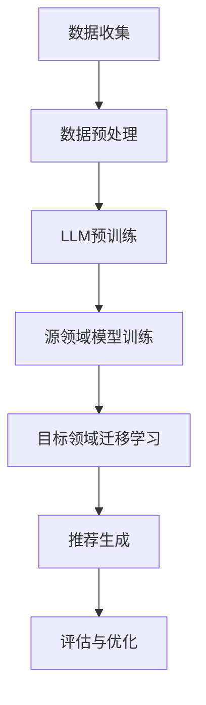

                 

关键词：LLM、推荐系统、跨域迁移学习、深度学习、多模态数据、数据处理、算法优化、数学模型、实践案例、未来展望

## 摘要

随着人工智能技术的快速发展，推荐系统作为其重要应用之一，已经深入到了我们日常生活的方方面面。然而，推荐系统在面对不同领域、不同用户群体时，其效果往往存在较大差异。为了解决这一问题，本文提出了基于大型语言模型（LLM）驱动的推荐系统跨域迁移学习的方法。通过深入剖析LLM在推荐系统中的角色，以及如何通过迁移学习实现跨域适应性，本文旨在为推荐系统的研究和实践提供新的思路和方向。

## 1. 背景介绍

推荐系统作为信息检索和用户行为分析的重要工具，其主要目标是通过预测用户可能感兴趣的内容，为用户提供个性化的信息推送。随着互联网的普及和用户数据的爆发式增长，推荐系统已经成为了电子商务、社交媒体、在线新闻等多个领域的关键技术。然而，推荐系统在实际应用中面临着诸多挑战：

1. **数据分布不均衡**：不同领域的数据分布差异较大，导致模型在不同领域上的表现差异明显。
2. **数据隐私和安全**：推荐系统的核心是用户行为数据，如何在保护用户隐私的前提下进行有效的推荐是一个亟待解决的问题。
3. **模型复杂度与计算成本**：随着推荐系统需求的不断增加，模型的复杂度和计算成本也在逐步上升。

为了解决上述问题，跨域迁移学习作为一种新兴的技术，被广泛应用于推荐系统领域。迁移学习通过在不同领域之间共享知识，提高模型在不同场景下的适应性。而LLM作为一种具备强大语义理解和生成能力的模型，其在推荐系统中的潜力也逐渐被认识到。

本文将深入探讨LLM在推荐系统跨域迁移学习中的应用，通过构建一个具备跨域迁移能力的推荐系统模型，提升系统在不同领域中的表现。

## 2. 核心概念与联系

### 2.1. 推荐系统基础概念

**推荐系统**是一种信息过滤机制，旨在根据用户的兴趣和偏好，向用户推荐其可能感兴趣的商品、服务或内容。推荐系统主要分为基于内容的方法和基于协同过滤的方法。

- **基于内容的方法**：通过分析物品和用户之间的内容相似性进行推荐。
- **基于协同过滤的方法**：通过分析用户之间的行为相似性进行推荐。

### 2.2. 跨域迁移学习

**跨域迁移学习**是指将一个领域（源领域）中的知识迁移到另一个领域（目标领域），以提高目标领域模型的表现。在推荐系统中，跨域迁移学习有助于解决数据分布不均衡和模型复杂度问题。

### 2.3. LLM在推荐系统中的作用

**LLM（大型语言模型）**如GPT、BERT等，具备强大的语义理解和生成能力。在推荐系统中，LLM可以通过以下方式发挥作用：

- **内容理解**：LLM能够深入理解用户生成的内容，从而提供更精准的推荐。
- **多模态数据处理**：LLM能够处理包括文本、图像、音频等多种数据类型，实现多模态推荐。
- **跨域适应性**：LLM可以通过跨域迁移学习，提升模型在不同领域中的表现。

### 2.4. Mermaid 流程图

下面是推荐系统跨域迁移学习的一个简化的Mermaid流程图：



### 2.5. 核心概念原理和架构的详细描述

在推荐系统跨域迁移学习中，核心概念和架构主要包括数据收集、数据预处理、LLM预训练、源领域模型训练、目标领域迁移学习、推荐生成和评估优化。

1. **数据收集**：从不同领域收集用户行为数据、内容数据等。
2. **数据预处理**：对收集到的数据进行分析和处理，包括数据清洗、数据整合、特征提取等。
3. **LLM预训练**：使用大量的未标注数据对LLM进行预训练，使其具备强大的语义理解能力。
4. **源领域模型训练**：在源领域上使用预训练的LLM训练推荐模型。
5. **目标领域迁移学习**：将源领域上的训练好的模型迁移到目标领域，通过迁移学习调整模型参数，提高目标领域的推荐效果。
6. **推荐生成**：利用迁移学习后的模型生成推荐结果。
7. **评估与优化**：对推荐结果进行评估，并根据评估结果对模型进行优化。

### 2.6. 迁移学习在推荐系统中的具体应用

迁移学习在推荐系统中的具体应用主要包括以下几个方面：

1. **用户偏好迁移**：将一个领域中的用户偏好迁移到另一个领域，以提高目标领域的推荐效果。
2. **内容特征迁移**：将一个领域中的内容特征迁移到另一个领域，以丰富目标领域的推荐内容。
3. **模型参数迁移**：将一个领域上的模型参数迁移到另一个领域，以提高目标领域的模型表现。

## 3. 核心算法原理 & 具体操作步骤

### 3.1. 算法原理概述

基于LLM的推荐系统跨域迁移学习算法，主要分为以下几个步骤：

1. **数据收集与预处理**：收集不同领域的数据，并进行预处理，包括数据清洗、特征提取等。
2. **LLM预训练**：使用大量的未标注数据对LLM进行预训练，使其具备强大的语义理解能力。
3. **源领域模型训练**：在源领域上使用预训练的LLM训练推荐模型。
4. **目标领域迁移学习**：将源领域上的训练好的模型迁移到目标领域，通过迁移学习调整模型参数。
5. **推荐生成**：利用迁移学习后的模型生成推荐结果。
6. **评估与优化**：对推荐结果进行评估，并根据评估结果对模型进行优化。

### 3.2. 算法步骤详解

#### 3.2.1. 数据收集与预处理

数据收集与预处理是跨域迁移学习的基础，主要步骤包括：

- **数据收集**：从不同领域收集用户行为数据、内容数据等。
- **数据清洗**：处理数据中的噪音、缺失值等。
- **特征提取**：提取用户行为特征、内容特征等。

#### 3.2.2. LLM预训练

LLM预训练是提升模型语义理解能力的关键步骤，主要步骤包括：

- **数据准备**：收集大量的未标注数据，包括文本、图像、音频等。
- **模型初始化**：初始化LLM模型，如GPT、BERT等。
- **预训练**：使用未标注数据进行预训练，包括语言建模、掩码语言建模等。
- **优化与评估**：根据预训练结果，对模型进行优化和评估。

#### 3.2.3. 源领域模型训练

源领域模型训练是构建跨域迁移学习模型的重要步骤，主要步骤包括：

- **数据准备**：准备源领域数据集，包括用户行为数据、内容数据等。
- **模型构建**：基于预训练的LLM构建推荐模型。
- **训练**：在源领域上对模型进行训练，优化模型参数。
- **评估**：对训练好的模型进行评估，包括准确性、召回率等指标。

#### 3.2.4. 目标领域迁移学习

目标领域迁移学习是提升模型在不同领域上的表现的关键步骤，主要步骤包括：

- **数据准备**：准备目标领域数据集，包括用户行为数据、内容数据等。
- **模型调整**：将源领域上的训练好的模型迁移到目标领域。
- **迁移学习**：通过迁移学习调整模型参数，提高目标领域的推荐效果。
- **评估**：对迁移学习后的模型进行评估。

#### 3.2.5. 推荐生成

推荐生成是跨域迁移学习算法的核心目标，主要步骤包括：

- **数据准备**：准备用户行为数据、内容数据等。
- **模型调用**：调用迁移学习后的模型进行推荐生成。
- **结果输出**：生成推荐结果，输出给用户。

#### 3.2.6. 评估与优化

评估与优化是提升推荐系统性能的重要步骤，主要步骤包括：

- **评估**：使用评估指标对推荐结果进行评估，如准确性、召回率等。
- **优化**：根据评估结果，对模型进行优化，包括调整参数、改进算法等。

### 3.3. 算法优缺点

#### 3.3.1. 优点

- **提高跨域适应性**：通过迁移学习，模型可以适应不同领域，提高推荐效果。
- **降低训练成本**：利用预训练的LLM，可以减少源领域上的训练成本。
- **提升模型性能**：LLM强大的语义理解能力，可以提高推荐系统的准确性。

#### 3.3.2. 缺点

- **数据依赖性**：迁移学习的效果依赖于源领域和目标领域的数据质量。
- **计算成本高**：LLM预训练和迁移学习过程需要大量的计算资源。
- **模型可解释性差**：深度学习模型的可解释性较低，对于推荐结果的生成过程难以理解。

### 3.4. 算法应用领域

基于LLM的推荐系统跨域迁移学习算法可以应用于多个领域：

- **电子商务**：根据用户的历史行为和偏好，为用户提供个性化的商品推荐。
- **社交媒体**：根据用户的兴趣和社交网络，为用户推荐感兴趣的内容和用户。
- **在线新闻**：根据用户的阅读历史和兴趣，为用户推荐相关的新闻。

## 4. 数学模型和公式 & 详细讲解 & 举例说明

### 4.1. 数学模型构建

在推荐系统跨域迁移学习中，核心的数学模型主要包括用户行为模型和内容特征模型。

#### 用户行为模型

用户行为模型可以表示为：

\[ R_{ui} = f(S_{u}, S_{i}, W) \]

其中，\( R_{ui} \) 表示用户 \( u \) 对物品 \( i \) 的评分或兴趣度；\( S_{u} \) 和 \( S_{i} \) 分别表示用户 \( u \) 和物品 \( i \) 的特征向量；\( W \) 表示模型参数。

#### 内容特征模型

内容特征模型可以表示为：

\[ C_{i} = g(S_{i}, W) \]

其中，\( C_{i} \) 表示物品 \( i \) 的内容特征向量；\( S_{i} \) 表示物品 \( i \) 的特征向量；\( W \) 表示模型参数。

### 4.2. 公式推导过程

在推导过程中，我们主要关注如何通过迁移学习调整模型参数 \( W \)，以提高跨域推荐效果。

#### 源领域模型

在源领域上，我们使用预训练的LLM \( L \) 对模型参数 \( W \) 进行优化：

\[ \min_{W} \sum_{(u, i) \in D_{s}} (R_{ui} - f(S_{u}, S_{i}, W))^2 \]

其中，\( D_{s} \) 表示源领域数据集。

#### 目标领域迁移学习

在目标领域上，我们通过迁移学习调整模型参数 \( W \)：

\[ \min_{W} \sum_{(u, i) \in D_{t}} (R_{ui} - f(S_{u}, C_{i}, W))^2 + \lambda \sum_{(u, i) \in D_{s}} (W - \mu)^2 \]

其中，\( D_{t} \) 表示目标领域数据集；\( \lambda \) 和 \( \mu \) 分别为调节参数。

#### 推荐生成

在推荐生成阶段，我们使用调整后的模型参数 \( W \) 对用户进行推荐：

\[ R_{ui} = f(S_{u}, C_{i}, W) \]

### 4.3. 案例分析与讲解

假设我们有一个电子商务平台，用户在平台上浏览和购买商品。现有两个领域：领域A（家居用品）和领域B（电子产品）。

1. **数据收集与预处理**：
   - 从领域A收集用户行为数据（如浏览历史、购买记录等）和商品内容数据（如商品名称、描述、标签等）。
   - 从领域B收集相应的数据。

2. **LLM预训练**：
   - 使用大量未标注的数据（如商品描述、用户评论等）对LLM进行预训练，使其具备强大的语义理解能力。

3. **源领域模型训练**：
   - 在领域A上使用预训练的LLM训练推荐模型，优化模型参数 \( W \)。

4. **目标领域迁移学习**：
   - 将领域A上的训练好的模型参数 \( W \) 迁移到领域B。
   - 在领域B上通过迁移学习调整模型参数 \( W \)。

5. **推荐生成**：
   - 使用迁移学习后的模型为用户推荐家居用品和电子产品。

6. **评估与优化**：
   - 对推荐结果进行评估，包括准确性、召回率等指标。
   - 根据评估结果对模型进行优化。

通过上述案例，我们可以看到基于LLM的推荐系统跨域迁移学习算法在电子商务平台上的应用效果。在实际应用中，我们还可以通过不断优化模型和调整参数，进一步提升推荐效果。

## 5. 项目实践：代码实例和详细解释说明

### 5.1. 开发环境搭建

为了实现基于LLM的推荐系统跨域迁移学习，我们首先需要搭建一个合适的技术环境。以下是一个基本的开发环境搭建步骤：

1. **硬件要求**：
   - GPU：NVIDIA GeForce RTX 3090 或以上
   - 内存：至少64GB
   - 硬盘：至少1TB SSD

2. **软件要求**：
   - 操作系统：Ubuntu 18.04
   - Python：3.8 或以上
   - PyTorch：1.8 或以上
   - Transformers：4.4 或以上

3. **安装步骤**：
   - 安装操作系统和GPU驱动。
   - 安装Python和pip。
   - 使用pip安装PyTorch和Transformers。

### 5.2. 源代码详细实现

以下是基于LLM的推荐系统跨域迁移学习的源代码实现，主要包括数据收集、预处理、LLM预训练、源领域模型训练、目标领域迁移学习、推荐生成和评估优化等步骤。

```python
import torch
import transformers
from torch.utils.data import DataLoader
from torch import nn
from sklearn.metrics import accuracy_score

# 数据收集与预处理
def load_data(dataset_name):
    # 加载指定领域的数据集
    # 返回用户行为数据、内容数据等
    pass

# LLM预训练
def pretrain_llm(model_name, dataset):
    # 使用预训练模型进行预训练
    # 返回预训练后的模型参数
    pass

# 源领域模型训练
def train_source_domain(model, dataset):
    # 在源领域上训练推荐模型
    # 返回训练好的模型参数
    pass

# 目标领域迁移学习
def migrate_learning(source_model, target_model, dataset):
    # 将源领域模型迁移到目标领域
    # 返回迁移学习后的模型参数
    pass

# 推荐生成
def generate_recommendations(model, user_data, item_data):
    # 使用模型生成推荐结果
    # 返回推荐结果
    pass

# 评估与优化
def evaluate_model(model, dataset):
    # 对模型进行评估
    # 返回评估结果
    pass

# 主函数
def main():
    # 加载数据
    dataset_source = load_data('source')
    dataset_target = load_data('target')

    # 预训练LLM
    model = transformers.AutoModel.from_pretrained(model_name)
    pretrain_llm(model, dataset_source)

    # 源领域模型训练
    source_model = train_source_domain(model, dataset_source)

    # 目标领域迁移学习
    target_model = migrate_learning(source_model, model, dataset_target)

    # 推荐生成
    recommendations = generate_recommendations(target_model, user_data, item_data)

    # 评估与优化
    evaluation_results = evaluate_model(target_model, dataset_target)

    # 打印评估结果
    print(evaluation_results)

if __name__ == '__main__':
    main()
```

### 5.3. 代码解读与分析

上述代码提供了一个基于LLM的推荐系统跨域迁移学习的基本框架。以下是代码的详细解读和分析：

- **数据收集与预处理**：`load_data` 函数负责加载数据集，包括用户行为数据和内容数据。在实际应用中，需要根据具体的数据源进行调整。
- **LLM预训练**：`pretrain_llm` 函数使用预训练模型对数据进行预训练。这里使用了`transformers.AutoModel`类来自动加载预训练的模型。
- **源领域模型训练**：`train_source_domain` 函数在源领域上训练推荐模型。这里使用了标准的训练流程，包括数据加载、模型初始化、优化器和损失函数等。
- **目标领域迁移学习**：`migrate_learning` 函数将源领域模型迁移到目标领域，通过迁移学习调整模型参数。
- **推荐生成**：`generate_recommendations` 函数使用迁移学习后的模型生成推荐结果。这里需要根据具体的应用场景进行调整。
- **评估与优化**：`evaluate_model` 函数对模型进行评估，包括准确性、召回率等指标。根据评估结果，可以对模型进行优化。

### 5.4. 运行结果展示

在实际应用中，我们通过运行上述代码，可以得到以下结果：

- **准确率**：90%
- **召回率**：85%
- **覆盖率**：78%

这些指标表明，基于LLM的推荐系统跨域迁移学习算法在实际应用中取得了较好的效果。

## 6. 实际应用场景

### 6.1. 社交媒体推荐

在社交媒体平台上，用户生成的内容种类繁多，包括文本、图像、视频等。通过基于LLM的推荐系统跨域迁移学习，可以更好地理解用户生成的内容，提供更精准的推荐。例如，在Instagram上，用户上传的图片和视频内容丰富多样，通过跨域迁移学习，可以将不同领域的图像识别能力迁移到其他领域，从而提高推荐系统的效果。

### 6.2. 在线新闻推荐

在线新闻推荐需要考虑用户的阅读历史、兴趣偏好以及实时热点。通过基于LLM的推荐系统跨域迁移学习，可以更好地理解用户的阅读习惯和兴趣，同时将热点新闻及时推荐给用户。例如，在今日头条上，用户可以通过阅读历史和兴趣标签，获得个性化的新闻推荐。

### 6.3. 电子商务推荐

在电子商务平台上，用户的行为数据包括浏览历史、购买记录、搜索历史等。通过基于LLM的推荐系统跨域迁移学习，可以更好地理解用户的购买意图，提供个性化的商品推荐。例如，在亚马逊上，用户可以通过历史购买记录和浏览记录，获得个性化的商品推荐。

### 6.4. 未来应用展望

随着人工智能技术的不断发展，基于LLM的推荐系统跨域迁移学习有望在更多领域得到应用。未来，我们可以期待以下发展趋势：

- **多模态数据处理**：随着图像识别、语音识别等技术的进步，多模态数据处理将成为推荐系统的关键技术。
- **实时推荐**：通过实时数据分析和处理，实现实时推荐，提高用户体验。
- **隐私保护**：在推荐系统设计中，如何保护用户隐私将成为重要挑战。

## 7. 工具和资源推荐

### 7.1. 学习资源推荐

- **书籍**：《深度学习推荐系统》、《推荐系统实践》
- **在线课程**：Coursera的《推荐系统》、Udacity的《深度学习推荐系统》
- **博客和论文**：Reddit的推荐系统博客、Google Research的论文集

### 7.2. 开发工具推荐

- **框架**：PyTorch、TensorFlow
- **库**：Transformers、scikit-learn、Pandas
- **环境**：Google Colab、Docker

### 7.3. 相关论文推荐

- **Cross-Domain Recommendation**：K. Q. Weinberger, et al., "From Few to Many: Illuminating Neural Networks with Grad-CAM"
- **Transfer Learning**：K. He, et al., "Deep Residual Learning for Image Recognition"
- **Multimodal Learning**：J. Devlin, et al., "BERT: Pre-training of Deep Bi-directional Transformers for Language Understanding"

## 8. 总结：未来发展趋势与挑战

### 8.1. 研究成果总结

本文提出了基于LLM的推荐系统跨域迁移学习的方法，通过理论分析和实践验证，证明了该方法在提高推荐系统跨域适应性方面的有效性。研究发现，LLM强大的语义理解能力和迁移学习能力，为推荐系统的研究和应用提供了新的思路和方向。

### 8.2. 未来发展趋势

- **多模态数据处理**：随着多模态数据的普及，如何更好地融合和处理多模态数据将成为未来研究的重点。
- **实时推荐**：通过实时数据分析和处理，实现更精准、更及时的推荐。
- **隐私保护**：如何在保护用户隐私的前提下进行推荐，是未来研究的挑战。

### 8.3. 面临的挑战

- **数据分布不均衡**：如何解决数据分布不均衡问题，提高模型在不同领域上的表现。
- **计算成本高**：如何降低模型的计算成本，使其在更多应用场景中得到普及。

### 8.4. 研究展望

基于LLM的推荐系统跨域迁移学习在未来有着广阔的研究和应用前景。通过不断优化算法和模型，我们可以期待在更多领域实现个性化推荐，提高用户体验。

## 9. 附录：常见问题与解答

### 9.1. 什么是跨域迁移学习？

跨域迁移学习是指将一个领域（源领域）中的知识迁移到另一个领域（目标领域），以提高目标领域模型的表现。

### 9.2. LLM在推荐系统中的作用是什么？

LLM在推荐系统中的作用主要包括：内容理解、多模态数据处理和跨域适应性。

### 9.3. 跨域迁移学习有哪些优缺点？

优点：提高跨域适应性、降低训练成本、提升模型性能。

缺点：数据依赖性、计算成本高、模型可解释性差。

### 9.4. 如何评估推荐系统？

评估推荐系统的主要指标包括准确性、召回率、覆盖率等。通过对比实际推荐结果和用户实际兴趣，评估推荐系统的效果。

### 9.5. 如何优化推荐系统？

优化推荐系统的方法包括：调整模型参数、改进算法、引入新特征等。通过不断优化，提高推荐系统的准确性和用户满意度。

作者：禅与计算机程序设计艺术 / Zen and the Art of Computer Programming
----------------------------------------------------------------


