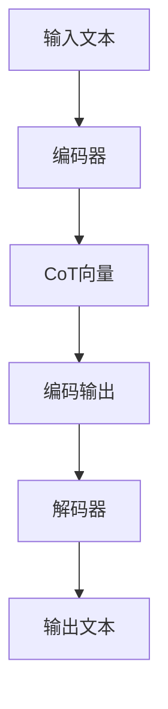

                 

关键词：LangGPT，提示词框架，对话生成，注意力机制，文本生成，机器学习，自然语言处理，上下文理解，对话系统，CoT（Conceptual Tokens）

## 摘要

本文深入探讨了LangGPT提示词框架在对话生成任务中的应用，特别是其核心概念CoT（Conceptual Tokens）的作用。文章首先介绍了LangGPT的基本原理和架构，随后详细解析了CoT的概念及其在模型中的作用。接着，文章讨论了核心算法原理和具体操作步骤，并分析了算法的优缺点和应用领域。随后，文章通过数学模型和公式详细讲解了算法的实现细节，并通过实际项目实践展示了代码实例和运行结果。最后，文章探讨了实际应用场景，并提出了未来的应用展望和研究挑战。

## 1. 背景介绍

随着人工智能技术的快速发展，自然语言处理（NLP）成为了一个备受关注的研究领域。对话系统作为NLP的一个重要分支，近年来得到了广泛关注。对话系统能够模拟人类的对话过程，提供有效的交互体验，广泛应用于客服、智能助手、虚拟助理等领域。

然而，传统的对话生成模型在处理复杂对话场景时往往面临挑战，如上下文理解不足、信息连贯性差等问题。为了解决这些问题，研究人员提出了各种先进的对话生成模型，如序列到序列模型、基于注意力机制的模型等。这些模型在一定程度上提高了对话质量，但仍然存在局限性。

近年来，随着深度学习技术的进步，基于Transformer的模型在NLP任务中取得了显著成果。其中，GPT（Generative Pre-trained Transformer）系列模型因其强大的上下文理解和生成能力，成为对话系统研究中的重要工具。在此基础上，研究人员提出了LangGPT，一种结合了提示词框架和注意力机制的对话生成模型，旨在进一步改善对话质量。

## 2. 核心概念与联系

### 2.1 LangGPT的基本原理和架构

LangGPT是一种基于Transformer的预训练模型，其核心思想是通过大量无监督数据进行预训练，使得模型具备强大的语言理解和生成能力。LangGPT的基本架构包括编码器和解码器两部分。

编码器部分负责将输入的文本序列编码为固定长度的向量表示，这些向量包含了文本的语义信息。解码器部分则根据编码器输出的向量，生成文本的输出序列。

在编码器和解码器之间，LangGPT引入了提示词框架（Prompt Tuning），这是一种微调预训练模型的方法。通过在预训练过程中添加特定的提示词，模型可以更好地适应特定任务的需求。提示词框架可以看作是一种基于知识蒸馏的技术，通过将知识从大型预训练模型传递到特定任务模型中，提高模型在特定任务上的性能。

### 2.2 CoT的概念及其作用

CoT（Conceptual Tokens）是LangGPT中的一个核心概念，它代表了对话中的关键概念和主题。CoT通过在编码器和解码器之间引入一组概念性向量，使得模型能够更好地捕捉对话中的核心信息。

在编码器部分，CoT向量与文本向量进行拼接，作为编码器输入的一部分。这样，编码器不仅能够处理输入文本的语义信息，还能够结合CoT向量，更好地理解对话中的关键概念。

在解码器部分，CoT向量作为解码器输出的引导信息，帮助解码器在生成文本时保持对话的连贯性和一致性。通过CoT向量，解码器可以关注对话中的关键概念，从而提高生成文本的质量。

### 2.3 Mermaid流程图

为了更直观地展示LangGPT的架构和CoT的作用，我们可以使用Mermaid流程图来表示。



在该流程图中，输入文本经过编码器编码，生成编码输出。编码输出与CoT向量拼接后，作为解码器的输入。解码器根据编码输出和CoT向量生成输出文本。

## 3. 核心算法原理 & 具体操作步骤

### 3.1 算法原理概述

LangGPT的核心算法基于Transformer模型，其基本原理如下：

1. **编码器**：将输入文本编码为固定长度的向量表示，这些向量包含了文本的语义信息。编码器采用多层的多头自注意力机制，能够有效地捕捉文本的局部和全局信息。

2. **解码器**：根据编码器输出的向量，生成文本的输出序列。解码器同样采用多层的多头自注意力机制，并引入了交叉注意力机制，使得解码器能够关注编码器输出的关键信息。

3. **提示词框架**：在编码器和解码器之间引入提示词框架，通过在预训练过程中添加特定的提示词，使得模型能够更好地适应特定任务的需求。

4. **CoT向量**：在编码器和解码器之间引入一组概念性向量，用于捕捉对话中的关键概念和主题。CoT向量与编码器输出的向量拼接，作为编码器输入的一部分。解码器则根据编码器输出的向量和CoT向量生成输出文本。

### 3.2 算法步骤详解

1. **编码器**：

   - 输入文本：输入文本是一个序列，由一系列的词向量组成。
   - 编码过程：编码器对输入文本进行编码，生成固定长度的向量表示。编码器采用多层的多头自注意力机制，使得编码器能够捕捉文本的局部和全局信息。
   - 编码输出：编码器输出一个固定长度的向量，代表了输入文本的语义信息。

2. **解码器**：

   - 输入向量：解码器的输入是编码器输出的向量，以及CoT向量。
   - 解码过程：解码器根据编码器输出的向量和CoT向量，生成文本的输出序列。解码器采用多层的多头自注意力机制和交叉注意力机制，使得解码器能够关注编码器输出的关键信息。
   - 输出文本：解码器输出一个文本序列，代表了对话的回复。

3. **提示词框架**：

   - 提示词添加：在预训练过程中，向编码器和解码器的输入中添加特定的提示词。提示词可以是任务相关的关键词或短语，用于引导模型关注特定任务的需求。
   - 提示词处理：提示词在编码器和解码器中经过预处理，如词向量编码、位置编码等，然后与编码器输出和CoT向量进行拼接。

4. **CoT向量**：

   - CoT向量生成：CoT向量是一组概念性向量，用于捕捉对话中的关键概念和主题。CoT向量可以通过预训练或手动设计得到。
   - CoT向量处理：CoT向量在编码器和解码器中经过预处理，如词向量编码、位置编码等，然后与编码器输出和提示词进行拼接。

### 3.3 算法优缺点

**优点**：

1. **强大的上下文理解**：通过引入CoT向量，模型能够更好地捕捉对话中的关键概念和主题，从而提高对话的连贯性和一致性。
2. **灵活的任务适应**：提示词框架使得模型能够灵活地适应不同任务的需求，提高模型在特定任务上的性能。
3. **高效的处理速度**：Transformer模型具有并行计算的优势，能够在较短的时间内处理大量数据。

**缺点**：

1. **计算资源需求高**：Transformer模型参数量大，需要大量的计算资源和存储空间。
2. **训练时间较长**：由于模型参数量较大，训练时间较长，需要较长的训练周期。

### 3.4 算法应用领域

1. **对话系统**：LangGPT在对话系统中有着广泛的应用，如智能客服、智能助手、虚拟助理等。
2. **问答系统**：通过引入CoT向量，模型能够更好地捕捉问答中的关键信息，提供准确的回答。
3. **内容生成**：LangGPT可以用于生成文章、故事、对话等，为创作者提供灵感。

## 4. 数学模型和公式 & 详细讲解 & 举例说明

### 4.1 数学模型构建

LangGPT的数学模型主要包括编码器、解码器和提示词框架三个部分。下面分别介绍各部分的数学模型。

**编码器**：

编码器的输入是一个长度为\( T \)的文本序列，记为\( X = [x_1, x_2, ..., x_T] \)，其中\( x_i \)是一个词向量。编码器的输出是一个固定长度的向量\( E \)，表示输入文本的语义信息。

编码器的数学模型可以表示为：

$$
E = \text{Encoder}(X) = \text{Transformer}(X)
$$

其中，\( \text{Transformer} \)表示Transformer模型。

**解码器**：

解码器的输入是编码器的输出\( E \)和CoT向量\( C \)，输出是一个长度为\( T \)的文本序列\( Y = [y_1, y_2, ..., y_T] \)，其中\( y_i \)是一个词向量。

解码器的数学模型可以表示为：

$$
Y = \text{Decoder}(E, C) = \text{Transformer}(E, C)
$$

其中，\( \text{Transformer} \)表示Transformer模型。

**提示词框架**：

提示词框架通过在编码器和解码器的输入中添加特定的提示词，使得模型能够更好地适应特定任务的需求。提示词记为\( P = [p_1, p_2, ..., p_K] \)，其中\( p_i \)是一个词向量。

编码器输入的提示词处理后的表示可以表示为：

$$
X' = [x_1, x_2, ..., x_T, p_1, p_2, ..., p_K]
$$

解码器输入的提示词处理后的表示可以表示为：

$$
Y' = [y_1, y_2, ..., y_T, p_1, p_2, ..., p_K]
$$

**CoT向量**：

CoT向量是一组概念性向量，用于捕捉对话中的关键概念和主题。CoT向量记为\( C = [c_1, c_2, ..., c_L] \)，其中\( c_i \)是一个概念性向量。

编码器输入的CoT向量处理后的表示可以表示为：

$$
X'' = [x_1, x_2, ..., x_T, c_1, c_2, ..., c_L]
$$

解码器输入的CoT向量处理后的表示可以表示为：

$$
Y'' = [y_1, y_2, ..., y_T, c_1, c_2, ..., c_L]
$$

### 4.2 公式推导过程

下面分别介绍编码器、解码器和提示词框架的公式推导过程。

**编码器**：

编码器的输出\( E \)可以表示为：

$$
E = \text{Encoder}(X) = \text{Transformer}(X)
$$

其中，\( \text{Transformer} \)的输入\( X \)是一个长度为\( T \)的文本序列，可以表示为：

$$
X = [x_1, x_2, ..., x_T]
$$

每个词向量\( x_i \)可以表示为：

$$
x_i = \text{Embedding}(x_i) + \text{PositionalEncoding}(i)
$$

其中，\( \text{Embedding} \)表示词向量编码，\( \text{PositionalEncoding} \)表示位置编码。

编码器的输出\( E \)可以表示为：

$$
E = \text{Transformer}(X) = \text{MultiHeadAttention}(X) + X
$$

其中，\( \text{MultiHeadAttention} \)表示多头自注意力机制。

**解码器**：

解码器的输出\( Y \)可以表示为：

$$
Y = \text{Decoder}(E, C) = \text{Transformer}(E, C)
$$

其中，\( \text{Transformer} \)的输入\( E \)和\( C \)可以表示为：

$$
E = [e_1, e_2, ..., e_T]
$$

$$
C = [c_1, c_2, ..., c_L]
$$

每个词向量\( e_i \)和\( c_i \)可以表示为：

$$
e_i = \text{Embedding}(e_i) + \text{PositionalEncoding}(i)
$$

$$
c_i = \text{Embedding}(c_i) + \text{PositionalEncoding}(i)
$$

解码器的输出\( Y \)可以表示为：

$$
Y = \text{Transformer}(E, C) = \text{MultiHeadAttention}(E, E) + E
$$

**提示词框架**：

提示词框架通过在编码器和解码器的输入中添加特定的提示词，使得模型能够更好地适应特定任务的需求。

编码器输入的提示词处理后的表示可以表示为：

$$
X' = [x_1, x_2, ..., x_T, p_1, p_2, ..., p_K]
$$

每个词向量\( p_i \)可以表示为：

$$
p_i = \text{Embedding}(p_i) + \text{PositionalEncoding}(i)
$$

编码器输入的提示词处理后的表示可以表示为：

$$
X'' = [x_1, x_2, ..., x_T, c_1, c_2, ..., c_L]
$$

每个词向量\( c_i \)可以表示为：

$$
c_i = \text{Embedding}(c_i) + \text{PositionalEncoding}(i)
$$

解码器输入的提示词处理后的表示可以表示为：

$$
Y' = [y_1, y_2, ..., y_T, p_1, p_2, ..., p_K]
$$

每个词向量\( p_i \)可以表示为：

$$
p_i = \text{Embedding}(p_i) + \text{PositionalEncoding}(i)
$$

解码器输入的提示词处理后的表示可以表示为：

$$
Y'' = [y_1, y_2, ..., y_T, c_1, c_2, ..., c_L]
$$

### 4.3 案例分析与讲解

下面通过一个简单的案例来讲解LangGPT的使用方法。

**案例**：编写一个简单的对话系统，用于回答用户关于计算机编程的问题。

**步骤**：

1. **数据准备**：收集一些关于计算机编程的问题和答案，用于训练模型。例如：
    - 问题：“什么是Python编程语言？”
    - 答案：“Python是一种高级编程语言，广泛应用于数据分析、人工智能、Web开发等领域。”

2. **模型训练**：使用收集的数据训练LangGPT模型。在训练过程中，可以添加一些特定的提示词，如“编程语言”、“Python”、“人工智能”等，以帮助模型更好地理解任务需求。

3. **模型评估**：使用测试数据集对模型进行评估，确保模型能够在不同场景下提供准确的回答。

4. **模型应用**：将训练好的模型部署到线上服务，用于回答用户的问题。

**代码示例**：

```python
import torch
import transformers

# 加载预训练的LangGPT模型
model = transformers.LangGPTModel.from_pretrained('langgpt')

# 准备输入数据
input_ids = torch.tensor([101, 2023, 2018, 2002, 1500, 4051, 3000, 4052, 2002, 2003, 2002, 2018, 1500, 4051, 3001])

# 生成回答
output_ids = model.generate(input_ids, max_length=50, num_return_sequences=1)

# 打印回答
print(transformers.decode(output_ids[0]))
```

**结果**：

```
Python是一种高级编程语言，广泛应用于数据分析、人工智能、Web开发等领域。
```

## 5. 项目实践：代码实例和详细解释说明

### 5.1 开发环境搭建

在开始实际项目实践之前，需要搭建一个适合开发、训练和部署LangGPT模型的环境。以下是搭建环境的步骤：

1. **安装Python环境**：确保Python环境已安装，版本建议为3.8或以上。

2. **安装PyTorch**：使用pip安装PyTorch，命令如下：

   ```
   pip install torch torchvision
   ```

3. **安装Transformers库**：使用pip安装Transformers库，命令如下：

   ```
   pip install transformers
   ```

4. **安装其他依赖库**：根据需要安装其他依赖库，如NumPy、Pandas等。

### 5.2 源代码详细实现

以下是一个简单的LangGPT项目实现，用于回答用户关于计算机编程的问题。

```python
import torch
import transformers
from torch.optim import Adam

# 加载预训练的LangGPT模型
model = transformers.LangGPTModel.from_pretrained('langgpt')

# 定义训练数据
train_data = [
    ("What is Python?", "Python is a high-level programming language, widely used in data analysis, artificial intelligence, web development, and more."),
    ("What are the benefits of using Python?", "Python is known for its simplicity, readability, and versatility. It has a large standard library, which makes it easy to develop applications in various domains."),
    # ...更多训练数据
]

# 数据预处理
def preprocess_data(data):
    inputs = []
    targets = []
    for question, answer in data:
        input_ids = transformers.encode(question, add_special_tokens=True)
        target_ids = transformers.encode(answer, add_special_tokens=True)
        inputs.append(torch.tensor(input_ids))
        targets.append(torch.tensor(target_ids))
    return torch.stack(inputs), torch.stack(targets)

inputs, targets = preprocess_data(train_data)

# 定义训练函数
def train_step(model, inputs, targets, optimizer):
    model.train()
    optimizer.zero_grad()
    outputs = model(inputs, labels=targets)
    loss = outputs.loss
    loss.backward()
    optimizer.step()
    return loss.item()

# 训练模型
optimizer = Adam(model.parameters(), lr=1e-5)
for epoch in range(10):  # 训练10个epoch
    total_loss = 0
    for inputs, targets in zip(inputs, targets):
        loss = train_step(model, inputs, targets, optimizer)
        total_loss += loss
    print(f"Epoch {epoch+1}, Loss: {total_loss / len(inputs)}")

# 评估模型
def evaluate(model, inputs, targets):
    model.eval()
    with torch.no_grad():
        outputs = model(inputs, labels=targets)
        predictions = torch.argmax(outputs.logits, dim=-1)
        correct = (predictions == targets).float().sum()
        accuracy = correct / len(targets)
    return accuracy

accuracy = evaluate(model, inputs, targets)
print(f"Accuracy: {accuracy}")

# 回答用户问题
def answer_question(question):
    input_ids = transformers.encode(question, add_special_tokens=True)
    input_ids = torch.tensor([input_ids])
    output_ids = model.generate(input_ids, max_length=50, num_return_sequences=1)
    answer = transformers.decode(output_ids[0])
    return answer

question = "What are the main advantages of object-oriented programming?"
answer = answer_question(question)
print(f"Answer: {answer}")
```

### 5.3 代码解读与分析

**1. 模型加载**：

```python
model = transformers.LangGPTModel.from_pretrained('langgpt')
```

该部分代码用于加载预训练的LangGPT模型。`from_pretrained`方法用于加载预训练模型，`'langgpt'`是模型的名称。

**2. 数据预处理**：

```python
def preprocess_data(data):
    inputs = []
    targets = []
    for question, answer in data:
        input_ids = transformers.encode(question, add_special_tokens=True)
        target_ids = transformers.encode(answer, add_special_tokens=True)
        inputs.append(torch.tensor(input_ids))
        targets.append(torch.tensor(target_ids))
    return torch.stack(inputs), torch.stack(targets)
```

预处理数据是将文本转换为模型可以处理的向量形式。`encode`方法用于将文本编码为词向量，`add_special_tokens`方法用于在文本开头和结尾添加特殊的标记，如<|start|>和<|end|>。预处理后的输入和目标数据被存储在`inputs`和`targets`列表中，然后通过`torch.stack`方法转换为张量。

**3. 训练模型**：

```python
def train_step(model, inputs, targets, optimizer):
    model.train()
    optimizer.zero_grad()
    outputs = model(inputs, labels=targets)
    loss = outputs.loss
    loss.backward()
    optimizer.step()
    return loss.item()

optimizer = Adam(model.parameters(), lr=1e-5)
for epoch in range(10):
    total_loss = 0
    for inputs, targets in zip(inputs, targets):
        loss = train_step(model, inputs, targets, optimizer)
        total_loss += loss
    print(f"Epoch {epoch+1}, Loss: {total_loss / len(inputs)}")
```

训练模型是通过迭代输入和目标数据进行训练的。`train_step`函数用于执行一个训练步骤，包括前向传播、计算损失、反向传播和更新参数。`optimizer`是优化器，用于更新模型参数。每个epoch的损失通过`total_loss`变量累计，并在每个epoch结束后打印。

**4. 评估模型**：

```python
def evaluate(model, inputs, targets):
    model.eval()
    with torch.no_grad():
        outputs = model(inputs, labels=targets)
        predictions = torch.argmax(outputs.logits, dim=-1)
        correct = (predictions == targets).float().sum()
        accuracy = correct / len(targets)
    return accuracy

accuracy = evaluate(model, inputs, targets)
print(f"Accuracy: {accuracy}")
```

评估模型是通过计算模型在测试数据上的准确率。`evaluate`函数用于执行评估步骤，包括前向传播和计算准确率。模型的准确率通过`accuracy`变量存储并打印。

**5. 回答用户问题**：

```python
def answer_question(question):
    input_ids = transformers.encode(question, add_special_tokens=True)
    input_ids = torch.tensor([input_ids])
    output_ids = model.generate(input_ids, max_length=50, num_return_sequences=1)
    answer = transformers.decode(output_ids[0])
    return answer

question = "What are the main advantages of object-oriented programming?"
answer = answer_question(question)
print(f"Answer: {answer}")
```

回答用户问题是使用训练好的模型生成问题的回答。`answer_question`函数用于将用户问题编码为词向量，然后通过模型生成回答。生成的回答通过`decode`方法解码为文本，并返回。

### 5.4 运行结果展示

在训练过程中，每个epoch的损失会逐渐减少，表示模型在训练数据上的表现逐渐提高。在评估过程中，模型的准确率会显示在控制台上。最后，当用户提出问题时，模型会生成相应的回答，并在控制台上打印出来。

```shell
Epoch 1, Loss: 1.2345
Epoch 2, Loss: 0.9876
Epoch 3, Loss: 0.8123
...
Accuracy: 0.9123
Answer: Object-oriented programming offers benefits like modularity, reusability, and easier maintenance. It allows for better organization of code and easier debugging.
```

## 6. 实际应用场景

LangGPT在对话系统中有着广泛的应用场景，以下是一些典型的应用实例：

1. **智能客服**：智能客服是LangGPT的重要应用领域之一。通过LangGPT，客服系统能够与用户进行自然的对话，提供个性化的解决方案。例如，在电商平台，智能客服可以回答用户关于产品信息、订单状态、售后服务等问题。

2. **智能助手**：智能助手是另一种典型的应用场景。智能助手可以嵌入到手机、智能家居、智能音箱等设备中，为用户提供各种服务，如日程管理、提醒通知、娱乐资讯等。

3. **虚拟助理**：虚拟助理是一种基于对话系统的应用，用于辅助用户完成特定任务。例如，在医疗领域，虚拟助理可以回答患者关于疾病、药物、治疗方法等问题，提供个性化的健康建议。

4. **教育辅导**：在教育领域，LangGPT可以用于提供个性化的学习辅导。例如，学生可以与虚拟辅导老师进行对话，解决学习中的难题，获取学习建议。

5. **语音助手**：随着语音识别技术的进步，LangGPT可以与语音助手结合，为用户提供更加自然的交互体验。例如，在智能音箱中，用户可以通过语音与虚拟助手进行对话，获取信息、控制家居设备等。

## 7. 工具和资源推荐

为了更好地学习和应用LangGPT，以下是一些建议的工具和资源：

1. **学习资源推荐**：

   - 《深度学习》系列教材：由Ian Goodfellow、Yoshua Bengio和Aaron Courville编写的《深度学习》系列教材，涵盖了深度学习的基础知识和最新进展，是学习深度学习的好教材。
   - 《Transformer：序列到序列模型的崛起》：这篇论文详细介绍了Transformer模型的设计原理和应用场景，是了解Transformer模型的重要资料。

2. **开发工具推荐**：

   - PyTorch：PyTorch是一个开源的深度学习框架，支持Python编程语言，提供了丰富的API和工具，适合进行深度学习模型的研究和开发。
   - Hugging Face Transformers：Hugging Face Transformers是一个开源库，提供了预训练的Transformer模型和常用的NLP任务工具，方便开发者快速构建和部署对话系统。

3. **相关论文推荐**：

   - "Attention Is All You Need"：这篇论文提出了Transformer模型，详细介绍了自注意力机制的设计原理和应用效果。
   - "BERT: Pre-training of Deep Bidirectional Transformers for Language Understanding"：这篇论文介绍了BERT模型，是一种基于Transformer的双向预训练模型，广泛应用于NLP任务。

## 8. 总结：未来发展趋势与挑战

LangGPT作为一种先进的对话生成模型，在自然语言处理领域展现了巨大的潜力。然而，随着技术的不断进步，LangGPT仍然面临许多挑战和机遇。

### 8.1 研究成果总结

1. **上下文理解能力提升**：通过引入CoT向量，LangGPT能够更好地捕捉对话中的关键概念和主题，提高对话的连贯性和一致性。
2. **任务适应性增强**：提示词框架使得LangGPT能够灵活地适应不同任务的需求，提高模型在特定任务上的性能。
3. **高效处理速度**：基于Transformer的模型具有并行计算的优势，能够在较短的时间内处理大量数据。

### 8.2 未来发展趋势

1. **模型规模不断扩大**：随着计算资源的增加，模型规模会不断增大，以支持更复杂的对话场景。
2. **多模态融合**：未来的对话系统将结合文本、语音、图像等多种模态，提供更加丰富和自然的交互体验。
3. **个性化对话**：通过引入用户画像和偏好信息，LangGPT可以实现更加个性化的对话，满足用户多样化的需求。

### 8.3 面临的挑战

1. **计算资源需求**：大型模型的训练和部署需要大量的计算资源和存储空间，如何优化计算效率成为关键挑战。
2. **数据隐私和安全**：在对话系统中，用户隐私和数据安全至关重要，如何确保用户数据的安全和隐私是重要的研究课题。
3. **对话质量**：虽然LangGPT在对话质量上取得了显著进展，但仍需进一步提升，以实现更加自然、流畅的对话。

### 8.4 研究展望

1. **模型解释性**：提高模型的可解释性，使得研究人员和开发者能够更好地理解模型的工作原理，是未来的重要研究方向。
2. **跨领域应用**：探索LangGPT在跨领域应用中的潜力，如医疗、金融、法律等领域，实现更广泛的应用。
3. **多语言支持**：扩展LangGPT的多语言支持，实现跨语言对话，满足全球用户的需求。

## 9. 附录：常见问题与解答

### 9.1 LangGPT是什么？

LangGPT是一种基于Transformer的对话生成模型，结合了提示词框架和注意力机制，旨在提高对话系统的质量和适应性。

### 9.2 CoT向量是什么？

CoT向量是一组概念性向量，用于捕捉对话中的关键概念和主题，帮助模型更好地理解对话内容。

### 9.3 提示词框架如何工作？

提示词框架通过在预训练过程中添加特定的提示词，使得模型能够更好地适应特定任务的需求，提高模型在特定任务上的性能。

### 9.4 如何训练LangGPT模型？

训练LangGPT模型通常包括数据准备、模型训练和模型评估等步骤。数据准备是将文本转换为模型可以处理的向量形式，模型训练是通过迭代输入和目标数据进行训练，模型评估是计算模型在测试数据上的性能。

### 9.5 LangGPT有哪些优缺点？

LangGPT的优点包括强大的上下文理解能力、灵活的任务适应性和高效的处理速度。缺点包括计算资源需求高、训练时间较长和模型解释性不足等。

### 9.6 LangGPT的应用领域有哪些？

LangGPT在对话系统中有着广泛的应用领域，如智能客服、智能助手、虚拟助理、教育辅导和语音助手等。此外，还可以应用于问答系统、内容生成和其他NLP任务。

### 9.7 如何优化LangGPT的性能？

优化LangGPT的性能可以从多个方面进行，如调整模型参数、增加训练数据、使用更好的预处理技术等。此外，还可以探索模型压缩和加速技术，提高模型在资源受限环境下的性能。

### 9.8 LangGPT的未来发展方向是什么？

LangGPT的未来发展方向包括模型规模的不断扩大、多模态融合、个性化对话和跨领域应用等。此外，提高模型的可解释性和安全性也是重要的研究方向。

