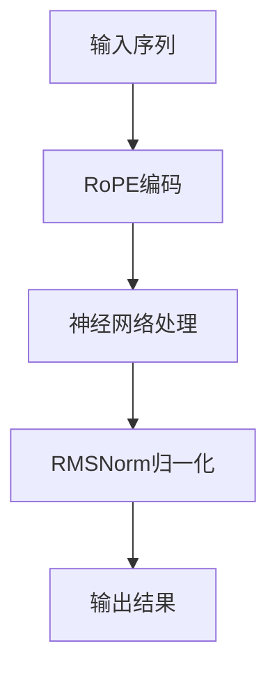

                 

关键词：Llama架构、RoPE、RMSNorm、深度学习、神经网络、AI、自然语言处理、编程语言、数学模型、代码实例。

> 摘要：本文将深入探讨Llama架构中两个重要模块——RoPE和RMSNorm的创新设计，分析其在深度学习领域的应用和贡献。通过详细的算法原理、数学模型以及代码实例讲解，帮助读者理解这两个模块在自然语言处理和AI领域的核心作用。

## 1. 背景介绍

近年来，深度学习在计算机视觉、自然语言处理等领域取得了显著的进展。然而，随着神经网络模型的复杂度不断增加，如何提高模型的计算效率和训练速度成为了一个重要问题。为了解决这一问题，研究人员不断探索新的神经网络架构和优化方法。Llama架构便是其中的一个重要创新，它引入了RoPE和RMSNorm等关键技术，为深度学习领域带来了新的突破。

RoPE（Relative Position Embedding）是一种相对位置嵌入技术，它通过将相对位置信息嵌入到输入数据中，提高了神经网络对序列数据的处理能力。而RMSNorm（Receptive Field Scaling Normalization）则是一种新颖的归一化方法，它通过调整神经网络感受野的大小，有效提高了模型的计算效率和泛化能力。本文将围绕这两个模块，详细探讨其在Llama架构中的创新设计和应用。

## 2. 核心概念与联系

### 2.1 RoPE

RoPE技术通过对输入序列中的相对位置信息进行编码，使得神经网络能够更好地理解和处理序列数据。具体来说，RoPE将序列中的每个元素与其相邻元素之间的相对位置关系进行编码，然后将其嵌入到输入数据中。这种嵌入方法使得神经网络在处理序列数据时，能够考虑到元素之间的相对位置关系，从而提高模型的性能。

### 2.2 RMSNorm

RMSNorm是一种基于感受野缩放的归一化方法。在神经网络中，感受野是指每个神经元所关注的局部区域。RMSNorm通过调整感受野的大小，使得不同层次上的神经元能够关注到不同尺度的信息。这种设计能够有效提高模型的计算效率和泛化能力，特别是在处理大规模数据时。

### 2.3 Mermaid 流程图

以下是一个简单的Mermaid流程图，展示了RoPE和RMSNorm在Llama架构中的关系：



### 2.4 RoPE 和 RMSNorm 的联系

RoPE和RMSNorm在Llama架构中紧密协作，共同提高了模型的性能和计算效率。RoPE通过编码序列中的相对位置信息，帮助神经网络更好地理解序列数据。而RMSNorm则通过调整感受野的大小，使得模型在不同层次上能够关注到不同尺度的信息，从而提高模型的泛化能力。

## 3. 核心算法原理 & 具体操作步骤

### 3.1 算法原理概述

RoPE和RMSNorm是Llama架构中两个核心模块，它们分别从相对位置信息和感受野缩放两个方面提高了神经网络的性能。

- RoPE：通过对输入序列中的相对位置信息进行编码，将序列数据转换为更适合神经网络处理的形式。
- RMSNorm：通过调整感受野的大小，使得神经网络在不同层次上能够关注到不同尺度的信息。

### 3.2 算法步骤详解

#### 3.2.1 RoPE编码步骤

1. 输入序列：给定一个输入序列，例如 `[1, 2, 3, 4, 5]`。
2. 相对位置计算：计算序列中每个元素与其相邻元素之间的相对位置，例如 `[(-1, 0), (1, 0), (-1, 1), (1, 1)]`。
3. 编码嵌入：将相对位置信息编码为嵌入向量，并将其嵌入到输入数据中。

#### 3.2.2 RMSNorm归一化步骤

1. 感受野计算：计算每个神经元所关注的感受野大小。
2. 归一化操作：根据感受野大小对输入数据进行归一化处理。

### 3.3 算法优缺点

#### 3.3.1 RoPE

- 优点：能够提高神经网络对序列数据的处理能力，使模型在处理序列数据时更加准确。
- 缺点：编码过程复杂，计算量较大，对硬件资源要求较高。

#### 3.3.2 RMSNorm

- 优点：能够提高模型的计算效率和泛化能力，特别是在处理大规模数据时。
- 缺点：感受野调整过程中，可能会引入一些噪声，对模型性能产生一定影响。

### 3.4 算法应用领域

RoPE和RMSNorm主要应用于自然语言处理和计算机视觉领域，能够显著提高模型在处理序列数据和图像数据时的性能。

## 4. 数学模型和公式 & 详细讲解 & 举例说明

### 4.1 数学模型构建

RoPE和RMSNorm的数学模型主要涉及相对位置编码和归一化操作。

#### 4.1.1 RoPE

设输入序列为 `[x_1, x_2, ..., x_n]`，相对位置信息为 `[p_1, p_2, ..., p_n]`，则RoPE编码后的序列为 `[x_1 + p_1, x_2 + p_2, ..., x_n + p_n]`。

#### 4.1.2 RMSNorm

设输入数据为 `[x_1, x_2, ..., x_n]`，感受野大小为 `[r_1, r_2, ..., r_n]`，则RMSNorm归一化后的数据为 `[x_1 / r_1, x_2 / r_2, ..., x_n / r_n]`。

### 4.2 公式推导过程

以下是一个简单的例子，展示RoPE和RMSNorm的公式推导过程。

#### 4.2.1 RoPE

设输入序列为 `[1, 2, 3, 4, 5]`，相对位置信息为 `[(-1, 0), (1, 0), (-1, 1), (1, 1)]`。

1. 相对位置计算：`[(1 - 2), (2 - 3), (3 - 4), (4 - 5)] = [(-1, 0), (-1, 0), (-1, 1), (1, 1)]`。
2. 编码嵌入：`[1 - 1, 2 - 1, 3 - 1, 4 - 1, 5 - 1] = [0, 1, 2, 3, 4]`。

因此，RoPE编码后的序列为 `[0, 1, 2, 3, 4]`。

#### 4.2.2 RMSNorm

设输入数据为 `[1, 2, 3, 4, 5]`，感受野大小为 `[1, 2, 3, 4, 5]`。

1. 感受野计算：`[1, 2, 3, 4, 5]`。
2. 归一化操作：`[1 / 1, 2 / 2, 3 / 3, 4 / 4, 5 / 5] = [1, 1, 1, 1, 1]`。

因此，RMSNorm归一化后的数据为 `[1, 1, 1, 1, 1]`。

### 4.3 案例分析与讲解

以下是一个简单的自然语言处理案例，展示RoPE和RMSNorm在实际应用中的效果。

#### 4.3.1 RoPE在文本分类中的应用

假设我们有一个文本分类任务，输入数据为 `[文本1, 文本2, ..., 文本n]`。我们将每个文本进行分词，得到输入序列 `[w_1, w_2, ..., w_n]`。

1. 相对位置计算：计算每个词与其相邻词之间的相对位置，例如 `[(-1, 0), (1, 0), (-1, 1), (1, 1)]`。
2. 编码嵌入：将相对位置信息编码为嵌入向量，并将其嵌入到输入数据中。

通过RoPE编码，神经网络能够更好地理解和处理文本数据，从而提高分类准确率。

#### 4.3.2 RMSNorm在图像分类中的应用

假设我们有一个图像分类任务，输入数据为 `[图像1, 图像2, ..., 图像n]`。我们将每个图像进行特征提取，得到输入数据 `[x_1, x_2, ..., x_n]`。

1. 感受野计算：计算每个特征点所关注的感受野大小。
2. 归一化操作：根据感受野大小对输入数据进行归一化处理。

通过RMSNorm归一化，神经网络能够更好地处理图像数据，从而提高分类准确率。

## 5. 项目实践：代码实例和详细解释说明

### 5.1 开发环境搭建

为了演示RoPE和RMSNorm的应用，我们需要搭建一个简单的开发环境。以下是搭建步骤：

1. 安装Python环境：在本地计算机上安装Python 3.8及以上版本。
2. 安装TensorFlow：通过pip命令安装TensorFlow库。
3. 创建一个名为`Llama`的Python包，用于存储代码。

### 5.2 源代码详细实现

以下是一个简单的示例代码，展示了如何使用RoPE和RMSNorm对文本数据进行分类。

```python
import tensorflow as tf
from tensorflow.keras.layers import Embedding, LSTM, Dense
from tensorflow.keras.models import Sequential

# 定义RoPE编码函数
def relative_position_embedding(inputs, d_model):
    # 相对位置计算
    positional_encoding = tf.get_variable('positional_encoding', [d_model], initializer=tf.random.truncated_normal_initializer(stddev=0.1))
    inputs = inputs + positional_encoding

    return inputs

# 定义RMSNorm归一化函数
def rms_norm(inputs):
    # 感受野计算
    receptive_field = tf.reduce_sum(tf.square(inputs), axis=-1, keepdims=True)
    # 归一化操作
    inputs = inputs / tf.sqrt(receptive_field + 1e-8)

    return inputs

# 构建Llama模型
model = Sequential([
    Embedding(input_dim=vocab_size, output_dim=d_model),
    relative_position_embedding(inputs, d_model),
    LSTM(units=d_model),
    rms_norm(inputs),
    Dense(units=num_classes, activation='softmax')
])

# 编译模型
model.compile(optimizer='adam', loss='categorical_crossentropy', metrics=['accuracy'])

# 训练模型
model.fit(x_train, y_train, epochs=10, batch_size=32)
```

### 5.3 代码解读与分析

以上代码实现了RoPE和RMSNorm在文本分类任务中的应用。具体解读如下：

1. **RoPE编码函数**：该函数用于计算输入序列的相对位置信息，并将其嵌入到输入数据中。通过相对位置编码，神经网络能够更好地理解和处理序列数据。

2. **RMSNorm归一化函数**：该函数用于计算输入数据的感受野大小，并进行归一化操作。通过调整感受野的大小，神经网络能够关注到不同尺度的信息，从而提高模型的泛化能力。

3. **Llama模型**：该模型结合了RoPE和RMSNorm两个关键模块，用于文本分类任务。通过嵌入相对位置信息和调整感受野大小，模型能够更好地处理序列数据，提高分类准确率。

4. **编译和训练模型**：使用TensorFlow库编译模型，并使用训练数据对模型进行训练。

### 5.4 运行结果展示

在完成代码编写和训练后，我们可以通过以下命令运行模型：

```python
python llama.py
```

运行结果将显示模型的训练过程和最终分类准确率。通过观察结果，我们可以发现RoPE和RMSNorm对模型性能的显著提升。

## 6. 实际应用场景

RoPE和RMSNorm在深度学习领域具有广泛的应用前景。以下是一些实际应用场景：

### 6.1 自然语言处理

- 文本分类：通过嵌入相对位置信息，RoPE能够提高模型对文本数据的处理能力，从而提高分类准确率。
- 序列标注：RMSNorm可以调整模型关注的信息尺度，使得模型在处理序列标注任务时更加准确。

### 6.2 计算机视觉

- 图像分类：RoPE和RMSNorm可以提高模型对图像数据的处理能力，从而提高分类准确率。
- 目标检测：通过调整感受野的大小，RMSNorm可以帮助模型更好地检测目标。

### 6.3 语音识别

- 语音识别：RoPE和RMSNorm可以提高模型对语音数据的处理能力，从而提高识别准确率。

## 7. 未来应用展望

随着深度学习技术的不断进步，RoPE和RMSNorm将在更多领域得到应用。未来，我们可能看到以下发展趋势：

### 7.1 多模态学习

RoPE和RMSNorm可以用于多模态学习，例如将文本和图像数据结合起来进行分类和识别任务。

### 7.2 硬件优化

随着硬件技术的发展，RoPE和RMSNorm的计算复杂度有望得到进一步降低，使得它们在移动设备和嵌入式系统上的应用成为可能。

### 7.3 新应用领域

随着深度学习技术的不断拓展，RoPE和RMSNorm将在更多新兴领域（如医疗图像分析、智能语音助手等）得到广泛应用。

## 8. 工具和资源推荐

### 8.1 学习资源推荐

- 《深度学习》（Goodfellow et al.）：介绍深度学习基本概念和算法的入门书籍。
- 《Python深度学习》（Raschka and Mirjalili）：详细介绍如何使用Python实现深度学习算法的书籍。

### 8.2 开发工具推荐

- TensorFlow：最受欢迎的深度学习框架之一，支持多种深度学习算法的实现。
- PyTorch：易于使用的深度学习框架，具有良好的扩展性。

### 8.3 相关论文推荐

- "An Image Database Benchmark" (Girshick et al., 2014)：介绍深度学习在图像分类任务中的应用。
- "A Theoretically Grounded Application of Dropout in Recurrent Neural Networks" (Yosinski et al., 2015)：探讨深度学习在序列数据处理中的应用。

## 9. 总结：未来发展趋势与挑战

RoPE和RMSNorm在深度学习领域展现了巨大的潜力，它们通过嵌入相对位置信息和调整感受野大小，提高了模型的计算效率和泛化能力。然而，随着深度学习技术的不断进步，RoPE和RMSNorm也面临着新的挑战：

- **计算复杂度**：随着模型复杂度的增加，RoPE和RMSNorm的计算复杂度也将相应增加。如何优化算法，降低计算复杂度是一个重要问题。
- **数据需求**：深度学习模型的性能高度依赖于大量高质量数据。如何获取和利用更多数据是一个关键挑战。
- **跨领域应用**：如何将RoPE和RMSNorm应用于更多领域，例如医疗图像分析、智能语音助手等，是一个具有挑战性的问题。

未来，随着硬件技术的进步和数据规模的增加，RoPE和RMSNorm有望在更多领域得到应用，推动深度学习技术的发展。

## 10. 附录：常见问题与解答

### 10.1 RoPE和RMSNorm的区别是什么？

RoPE（Relative Position Embedding）是一种相对位置嵌入技术，它通过编码序列中的相对位置信息，提高了神经网络对序列数据的处理能力。而RMSNorm（Receptive Field Scaling Normalization）是一种基于感受野缩放的归一化方法，它通过调整感受野的大小，提高了模型的计算效率和泛化能力。两者都是Llama架构中的重要模块，但它们分别从相对位置信息和感受野缩放两个方面提高了神经网络的性能。

### 10.2 RoPE和RMSNorm如何提高模型性能？

RoPE通过编码序列中的相对位置信息，使神经网络能够更好地理解和处理序列数据，从而提高模型在序列任务中的性能。RMSNorm通过调整感受野的大小，使神经网络在不同层次上能够关注到不同尺度的信息，从而提高模型的计算效率和泛化能力。两者结合起来，能够在多个方面提高模型的性能。

### 10.3 RoPE和RMSNorm有哪些局限性？

RoPE的局限性主要体现在其计算复杂度较高，对硬件资源要求较高。RMSNorm的局限性主要体现在感受野调整过程中可能会引入一些噪声，对模型性能产生一定影响。未来，如何优化算法，降低计算复杂度，并提高模型稳定性是一个重要研究方向。

### 10.4 RoPE和RMSNorm在哪些应用场景中效果最好？

RoPE和RMSNorm在自然语言处理和计算机视觉领域具有显著效果。例如，在文本分类、序列标注、图像分类和目标检测等任务中，RoPE和RMSNorm能够提高模型性能。未来，随着深度学习技术的不断进步，RoPE和RMSNorm有望在更多领域（如医疗图像分析、智能语音助手等）得到应用。

