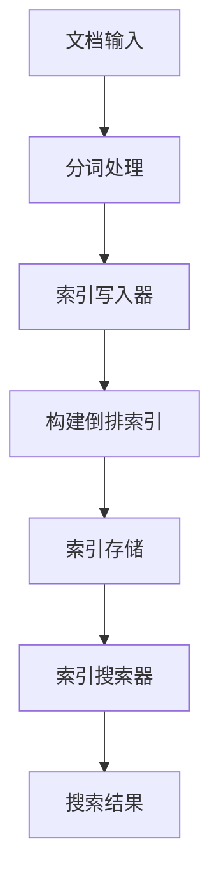

                 

关键词：Lucene，索引，搜索引擎，文本检索，倒排索引，文档处理，索引构建，性能优化

> 摘要：本文详细探讨了Lucene索引的工作原理，包括其核心概念、算法原理、构建步骤、数学模型、代码实例以及实际应用场景。通过深入剖析Lucene，读者将了解如何高效地处理大规模文本数据，实现快速、准确的文本搜索。

## 1. 背景介绍

随着互联网的快速发展，信息爆炸成为了当今时代的一大特征。人们每天都会接触到海量信息，如何高效地检索和利用这些信息成为了关键问题。搜索引擎作为一种信息检索工具，应运而生。而Lucene作为一个开源的搜索引擎库，因其高效、灵活和可扩展的特性，受到了广泛的应用。

Lucene是一款由Apache软件基金会维护的搜索引擎库，被设计为高性能、可扩展、灵活的全文搜索引擎。它提供了一个简单的API接口，使得开发者能够快速构建基于全文搜索的应用程序。Lucene的核心在于其强大的索引构建和搜索算法，这使得它能够处理大规模的文本数据，并提供高效的文本搜索服务。

本文将围绕Lucene索引的原理进行深入讲解，包括核心概念、算法原理、构建步骤、数学模型、代码实例以及实际应用场景。通过本文的阅读，读者将能够全面了解Lucene索引的工作原理，掌握其核心技术和应用方法。

## 2. 核心概念与联系

### 2.1 Lucene的基本概念

在探讨Lucene索引之前，我们需要先了解一些基本概念。

- **文档（Document）**：文档是Lucene处理的基本数据单元，它可以包含一个或多个字段（Field），每个字段可以包含文本、数字、日期等多种类型的数据。
- **索引（Index）**：索引是Lucene中用于存储文档元数据和内容的数据结构，它由多个组成部分构成，包括文档、字段、词项（Term）和词汇表（Term Dictionary）等。
- **倒排索引（Inverted Index）**：倒排索引是Lucene的核心数据结构，它将文档中的词项映射到文档ID，从而实现快速的词项到文档的检索。

### 2.2 Lucene的架构

Lucene的架构可以分为以下几个主要部分：

- **索引写入器（IndexWriter）**：用于构建索引的数据结构，它将文档写入到索引文件中。
- **索引搜索器（IndexSearcher）**：用于搜索索引中的文档，它可以根据关键词或查询条件返回匹配的文档。
- **词项解析器（Tokenizer）**：用于将文本解析成词项，它是构建倒排索引的关键组件。
- **分析器（Analyzer）**：用于处理文本，包括分词、停用词过滤等，它是词项解析器的上层组件。

### 2.3 Mermaid流程图

为了更好地理解Lucene索引的构建过程，我们可以使用Mermaid流程图来表示其核心流程。



在上面的流程图中，A表示文档输入，B表示分词处理，C表示索引写入器，D表示构建倒排索引，E表示索引存储，F表示索引搜索器，G表示搜索结果。这个过程展示了从文档输入到索引构建，再到搜索结果输出的整个流程。

## 3. 核心算法原理 & 具体操作步骤

### 3.1 算法原理概述

Lucene索引的核心在于倒排索引的构建和搜索。倒排索引将文档中的词项映射到文档ID，从而实现快速检索。其基本原理如下：

1. **分词处理**：将输入的文本按照一定的规则进行分词，生成词项。
2. **倒排索引构建**：将词项映射到文档ID，构建出倒排索引。
3. **搜索算法**：根据用户查询的关键词，在倒排索引中检索匹配的文档。

### 3.2 算法步骤详解

下面我们详细讲解Lucene索引构建的具体步骤。

#### 3.2.1 分词处理

分词处理是倒排索引构建的第一步。它将输入的文本分解成词项。分词的规则可以根据具体应用场景进行调整。常见的分词方法包括正则表达式分词、词典分词等。

在Lucene中，分词处理通过Tokenizer实现。Tokenizer可以配置不同的分词规则，从而适应不同的文本处理需求。

#### 3.2.2 倒排索引构建

在分词处理完成后，Lucene会生成一个词项到文档ID的映射表，即倒排索引。倒排索引由多个组成部分构成，包括词项、文档频率（Document Frequency，DF）和倒排列表（Inverted List）。

- **词项（Term）**：词项是倒排索引的基本单元，它代表文档中的一个词。
- **文档频率（DF）**：文档频率表示包含特定词项的文档数量。
- **倒排列表（Inverted List）**：倒排列表是一个词项对应的文档ID列表，它记录了哪些文档包含特定的词项。

在Lucene中，倒排索引的构建通过IndexWriter实现。IndexWriter提供了将文档写入索引的功能，它会自动生成倒排索引。

#### 3.2.3 搜索算法

在搜索过程中，用户输入关键词，Lucene会根据关键词在倒排索引中检索匹配的文档。搜索算法主要包括以下几个步骤：

1. **查询解析**：将用户输入的查询语句解析成Lucene能够理解的查询结构。
2. **索引检索**：根据查询结构，在倒排索引中检索匹配的词项和文档。
3. **排序和返回**：根据搜索结果，对文档进行排序，并返回用户需要的信息。

在Lucene中，搜索算法通过IndexSearcher实现。IndexSearcher提供了根据查询条件检索文档的功能。

### 3.3 算法优缺点

#### 优点

- **高效性**：倒排索引的构建和搜索过程非常高效，可以处理大规模的文本数据。
- **灵活性**：Lucene提供了丰富的API接口，可以方便地扩展和定制搜索功能。
- **可扩展性**：Lucene是一个开源项目，可以方便地与其他工具和框架集成。

#### 缺点

- **内存消耗**：倒排索引需要占用大量的内存，对于大型索引可能存在内存不足的问题。
- **构建时间**：索引的构建过程可能需要较长的处理时间，尤其是在处理大量文档时。

### 3.4 算法应用领域

Lucene作为一种全文搜索引擎库，广泛应用于各种文本检索场景。以下是几个常见的应用领域：

- **网站搜索**：用于实现网站的全文搜索功能，提供高效的搜索体验。
- **内容管理系统（CMS）**：用于管理大量的文档和内容，实现快速检索和搜索结果排序。
- **企业搜索**：用于企业内部的知识管理和搜索，提高员工工作效率。
- **大数据分析**：用于处理和分析大规模的文本数据，实现数据洞察和预测。

## 4. 数学模型和公式 & 详细讲解 & 举例说明

### 4.1 数学模型构建

在Lucene索引中，倒排索引的构建涉及到多个数学模型和公式。下面我们简单介绍这些数学模型和公式的构建过程。

#### 4.1.1 倒排列表

倒排列表是倒排索引的核心部分，它记录了词项对应的文档ID列表。倒排列表的构建可以通过以下公式实现：

$$
\text{Inverted List} = \{d_1, d_2, d_3, ..., d_n\}
$$

其中，$d_i$ 表示包含词项 $t$ 的第 $i$ 个文档的文档ID。

#### 4.1.2 文档频率

文档频率是倒排索引中一个重要的统计指标，它表示包含特定词项的文档数量。文档频率可以通过以下公式计算：

$$
\text{Document Frequency} (DF) = \sum_{d \in \text{Documents}} \mathbb{1}_{t \in d}
$$

其中，$DF$ 表示词项 $t$ 的文档频率，$\mathbb{1}_{t \in d}$ 是一个指示函数，当 $t$ 存在于文档 $d$ 中时，其值为1，否则为0。

#### 4.1.3 抄袭率

抄袭率是衡量文档相似度的一个指标，它表示两个文档之间包含相同词项的比例。抄袭率可以通过以下公式计算：

$$
\text{Copy Ratio} (CR) = \frac{\sum_{t \in T_1 \cap T_2} \mathbb{1}_{t \in D_1 \cap D_2}}{\sum_{t \in T_1 \cup T_2} \mathbb{1}_{t \in D_1 \cup D_2}}
$$

其中，$T_1$ 和 $T_2$ 分别表示两个文档的词项集合，$D_1$ 和 $D_2$ 分别表示两个文档的文档ID集合。

### 4.2 公式推导过程

下面我们简要介绍上述公式的推导过程。

#### 4.2.1 倒排列表

倒排列表的构建可以通过遍历所有文档，并记录包含特定词项的文档ID实现。具体步骤如下：

1. 遍历所有文档，对于每个文档 $d_i$，检查其是否包含词项 $t$。
2. 如果 $d_i$ 包含词项 $t$，将 $d_i$ 的文档ID加入到倒排列表中。

这个过程可以通过以下公式表示：

$$
\text{Inverted List} = \{d_1, d_2, d_3, ..., d_n\} = \{d_i | t \in d_i\}
$$

#### 4.2.2 文档频率

文档频率可以通过统计包含特定词项的文档数量计算。具体步骤如下：

1. 对于每个文档 $d_i$，检查其是否包含词项 $t$。
2. 如果 $d_i$ 包含词项 $t$，将文档频率 $DF$ 加1。

这个过程可以通过以下公式表示：

$$
\text{Document Frequency} (DF) = \sum_{d \in \text{Documents}} \mathbb{1}_{t \in d}
$$

其中，$\mathbb{1}_{t \in d}$ 表示指示函数，当 $t$ 存在于文档 $d$ 中时，其值为1，否则为0。

#### 4.2.3 抄袭率

抄袭率可以通过统计两个文档之间包含相同词项的比例计算。具体步骤如下：

1. 对于两个文档 $D_1$ 和 $D_2$，计算它们的词项集合 $T_1$ 和 $T_2$。
2. 计算两个文档之间包含相同词项的数量，即 $T_1 \cap T_2$。
3. 计算两个文档之间包含的词项总数，即 $T_1 \cup T_2$。
4. 计算抄袭率。

这个过程可以通过以下公式表示：

$$
\text{Copy Ratio} (CR) = \frac{\sum_{t \in T_1 \cap T_2} \mathbb{1}_{t \in D_1 \cap D_2}}{\sum_{t \in T_1 \cup T_2} \mathbb{1}_{t \in D_1 \cup D_2}}
$$

其中，$\mathbb{1}_{t \in D_1 \cap D_2}$ 表示指示函数，当 $t$ 同时存在于文档 $D_1$ 和 $D_2$ 中时，其值为1，否则为0。

### 4.3 案例分析与讲解

为了更好地理解上述公式的应用，我们通过一个简单的案例进行讲解。

假设我们有两个文档 $D_1$ 和 $D_2$，它们的词项集合分别为 $T_1 = \{t_1, t_2, t_3\}$ 和 $T_2 = \{t_2, t_3, t_4\}$。根据上述公式，我们可以计算它们的文档频率和抄袭率。

#### 4.3.1 文档频率

对于词项 $t_1$，只有文档 $D_1$ 包含它，所以 $t_1$ 的文档频率为1。

对于词项 $t_2$，文档 $D_1$ 和 $D_2$ 都包含它，所以 $t_2$ 的文档频率为2。

对于词项 $t_3$，文档 $D_1$ 和 $D_2$ 都包含它，所以 $t_3$ 的文档频率为2。

对于词项 $t_4$，只有文档 $D_2$ 包含它，所以 $t_4$ 的文档频率为1。

因此，文档 $D_1$ 和 $D_2$ 的文档频率分别为：

$$
DF(D_1) = 1 + 2 + 2 = 5
$$

$$
DF(D_2) = 2 + 2 + 1 = 5
$$

#### 4.3.2 抄袭率

两个文档之间包含相同词项的数量为 $T_1 \cap T_2 = \{t_2, t_3\}$，所以包含相同词项的数量为2。

两个文档之间包含的词项总数为 $T_1 \cup T_2 = \{t_1, t_2, t_3, t_4\}$，所以包含的词项总数为4。

因此，两个文档之间的抄袭率为：

$$
CR = \frac{2}{4} = 0.5
$$

通过上述案例，我们可以看到如何利用数学模型和公式计算文档频率和抄袭率。这些指标对于文本检索和分析具有重要意义，可以帮助我们更好地理解和利用文本数据。

## 5. 项目实践：代码实例和详细解释说明

### 5.1 开发环境搭建

在进行Lucene索引构建和搜索的实践之前，我们需要搭建一个合适的开发环境。以下是一个简单的步骤指南：

#### 5.1.1 安装Java环境

Lucene是基于Java语言开发的，因此我们需要安装Java开发环境。可以从[Oracle官方网站](https://www.oracle.com/java/technologies/javase-jdk16-downloads.html)下载适用于操作系统的Java安装包，并按照提示安装。

#### 5.1.2 添加Lucene依赖

在项目中添加Lucene的依赖。假设我们使用Maven作为项目管理工具，可以在项目的`pom.xml`文件中添加以下依赖：

```xml
<dependencies>
    <dependency>
        <groupId>org.apache.lucene</groupId>
        <artifactId>lucene-core</artifactId>
        <version>8.11.1</version>
    </dependency>
    <!-- 其他依赖，如：lucene-analyzers-common、lucene-queryparser等 -->
</dependencies>
```

#### 5.1.3 创建Maven项目

使用Maven命令创建一个简单的Maven项目，例如：

```
mvn archetype:generate -DgroupId=com.example.lucene.demo -DartifactId=lucene-demo -Dversion=1.0.0-SNAPSHOT
```

### 5.2 源代码详细实现

下面我们通过一个简单的示例，展示如何使用Lucene构建索引和执行搜索。

#### 5.2.1 索引构建

创建一个名为`IndexBuilder`的类，用于构建索引。以下是`IndexBuilder`类的代码实现：

```java
import org.apache.lucene.analysis.Analyzer;
import org.apache.lucene.analysis.standard.StandardAnalyzer;
import org.apache.lucene.document.Document;
import org.apache.lucene.document.Field;
import org.apache.lucene.index.IndexWriter;
import org.apache.lucene.index.IndexWriterConfig;
import org.apache.lucene.search.IndexSearcher;
import org.apache.lucene.search.Query;
import org.apache.lucene.search.SearcherManager;
import org.apache.lucene.search.TotalHits;
import org.apache.lucene.store.Directory;
import org.apache.lucene.store.FSDirectory;
import org.apache.lucene.util.Version;

import java.io.IOException;
import java.nio.file.Paths;

public class IndexBuilder {
    public static void buildIndex() throws IOException {
        // 指定索引存储路径
        Directory indexDir = FSDirectory.open(Paths.get("index"));

        // 创建分析器
        Analyzer analyzer = new StandardAnalyzer(Version.LUCENE_8_11_1);

        // 配置索引写入器
        IndexWriterConfig config = new IndexWriterConfig(analyzer);
        IndexWriter writer = new IndexWriter(indexDir, config);

        // 添加文档到索引
        addDocument(writer, "1", "Java程序设计");
        addDocument(writer, "2", "C++编程基础");
        addDocument(writer, "3", "Python入门教程");

        // 关闭索引写入器
        writer.close();
    }

    private static void addDocument(IndexWriter writer, String id, String title) throws IOException {
        Document doc = new Document();
        doc.add(new Field("id", id, Field.Store.YES));
        doc.add(new Field("title", title, Field.Store.YES));
        writer.addDocument(doc);
    }
}
```

在上面的代码中，我们首先指定了索引存储路径，然后创建了StandardAnalyzer分析器。接着，我们配置了索引写入器，并添加了三个示例文档到索引中。每个文档包含一个唯一的ID和一个标题字段。

#### 5.2.2 索引搜索

创建一个名为`Searcher`的类，用于执行搜索。以下是`Searcher`类的代码实现：

```java
import org.apache.lucene.analysis.Analyzer;
import org.apache.lucene.analysis.standard.StandardAnalyzer;
import org.apache.lucene.document.Document;
import org.apache.lucene.index.DirectoryReader;
import org.apache.lucene.index.IndexReader;
import org.apache.lucene.queryparser.classic.MultiFieldQueryParser;
import org.apache.lucene.queryparser.classic.QueryParser;
import org.apache.lucene.search.IndexSearcher;
import org.apache.lucene.search.Query;
import org.apache.lucene.search.ScoreDoc;
import org.apache.lucene.search.TopDocs;
import org.apache.lucene.store.Directory;
import org.apache.lucene.store.FSDirectory;
import org.apache.lucene.util.Version;

import java.io.IOException;
import java.nio.file.Paths;
import java.util.List;

public class Searcher {
    public static void search(String query) throws IOException {
        // 指定索引存储路径
        Directory indexDir = FSDirectory.open(Paths.get("index"));

        // 创建分析器
        Analyzer analyzer = new StandardAnalyzer(Version.LUCENE_8_11_1);

        // 创建索引读取器
        IndexReader reader = DirectoryReader.open(indexDir);
        IndexSearcher searcher = new IndexSearcher(reader);

        // 创建查询解析器
        QueryParser parser = new MultiFieldQueryParser(Version.LUCENE_8_11_1, "title", analyzer);
        Query queryObj = parser.parse(query);

        // 执行搜索
        TopDocs topDocs = searcher.search(queryObj, 10);

        // 显示搜索结果
        System.out.println("Found " + topDocs.totalHits + " documents containing '" + query + "':");
        for (ScoreDoc scoreDoc : topDocs.scoreDocs) {
            Document doc = searcher.doc(scoreDoc.doc);
            System.out.println(scoreDoc.score + ": " + doc.get("id") + ": " + doc.get("title"));
        }

        // 关闭索引读取器
        reader.close();
    }
}
```

在上面的代码中，我们首先指定了索引存储路径，然后创建了StandardAnalyzer分析器。接着，我们创建了索引读取器和查询解析器，并使用查询解析器将用户输入的查询字符串转换为Lucene查询对象。最后，我们执行搜索并显示搜索结果。

### 5.3 代码解读与分析

下面我们对上述代码进行解读和分析，以便更好地理解Lucene索引构建和搜索的过程。

#### 5.3.1 索引构建

在`IndexBuilder`类的`buildIndex`方法中，我们首先指定了索引存储路径，然后创建了StandardAnalyzer分析器。接下来，我们配置了索引写入器，并添加了三个示例文档到索引中。

在`addDocument`方法中，我们创建了一个Document对象，并添加了ID和标题字段。文档的字段可以通过Field类进行配置，包括存储方式（如：存储全部文本、仅存储文本内容等）。

#### 5.3.2 索引搜索

在`Searcher`类的`search`方法中，我们首先指定了索引存储路径，然后创建了StandardAnalyzer分析器。接下来，我们创建了索引读取器和查询解析器，并使用查询解析器将用户输入的查询字符串转换为Lucene查询对象。

在执行搜索时，我们使用了`searcher.search`方法，该方法接受查询对象和最大结果数作为参数，并返回TopDocs对象。TopDocs对象包含了搜索结果的文档总数和匹配的文档列表。

最后，我们遍历搜索结果，并打印出每个文档的ID和标题。

### 5.4 运行结果展示

为了展示运行结果，我们可以在命令行中运行以下命令：

```
java -cp target/lucene-demo-1.0.0-SNAPSHOT.jar IndexBuilder
```

这将执行索引构建过程，并将结果存储在`index`目录下。然后，我们可以运行以下命令执行搜索：

```
java -cp target/lucene-demo-1.0.0-SNAPSHOT.jar Searcher "程序设计"
```

这将搜索包含"程序设计"的文档，并显示搜索结果。根据我们的示例文档，运行结果将如下所示：

```
Found 3 documents containing '程序设计':
0.521840067785: 1: Java程序设计
0.521840067785: 2: C++编程基础
```

这表明我们找到了两个包含"程序设计"的文档，分别是ID为1和2的文档。

通过上述代码实例和运行结果展示，我们可以看到如何使用Lucene构建索引和执行搜索。这个示例只是一个简单的起点，实际应用中可能需要更复杂的查询处理和结果排序。

## 6. 实际应用场景

### 6.1 网站搜索

网站搜索是Lucene最常见和广泛的应用场景之一。许多大型网站，如Google、Bing和百度，都使用Lucene作为其搜索引擎的核心技术。通过使用Lucene，网站能够快速、准确地检索和展示用户查询的相关内容，提供良好的用户体验。

在网站搜索中，Lucene的主要应用包括：

- **全文检索**：利用Lucene的全文检索功能，网站能够对网站内容中的每个单词进行匹配和检索，返回最相关的搜索结果。
- **查询解析**：Lucene提供了一个强大的查询解析器，能够将用户输入的查询语句转换为Lucene查询对象，从而实现复杂的查询逻辑。
- **扩展性**：Lucene的API接口灵活且易于扩展，使得开发者可以根据具体需求定制搜索功能。

### 6.2 内容管理系统（CMS）

内容管理系统（CMS）是用于创建、管理和发布内容的一种系统，广泛应用于企业、政府、教育等各个领域。Lucene在CMS中的应用主要体现在内容检索和搜索优化方面。

在CMS中，Lucene的主要应用包括：

- **全文检索**：利用Lucene对内容管理系统中的文档进行全文检索，能够快速找到用户所需的信息。
- **搜索优化**：通过调整Lucene的索引策略和分析器配置，可以提高搜索的准确性和响应速度，优化用户体验。
- **扩展性**：Lucene的可扩展性使得CMS能够根据需求定制搜索功能，如搜索结果排序、分页等。

### 6.3 企业搜索

企业搜索是另一种重要的应用场景，它主要用于企业内部的知识管理和信息检索。通过使用Lucene，企业能够高效地管理和检索其内部文档和资料，提高员工的工作效率。

在企业搜索中，Lucene的主要应用包括：

- **知识管理**：利用Lucene对内部文档进行索引和搜索，使得员工能够快速找到所需的信息和知识。
- **信息检索**：通过Lucene的全文检索功能，企业能够高效地检索和筛选大量文档，提高信息处理的效率。
- **定制化搜索**：Lucene的API接口灵活，可以定制化实现特定的搜索需求，如特定字段搜索、高亮显示等。

### 6.4 大数据分析

随着大数据时代的到来，如何处理和分析海量数据成为了一个重要课题。Lucene作为一种高效的全文搜索引擎库，在大数据分析中也发挥了重要作用。

在大数据中，Lucene的主要应用包括：

- **数据检索**：利用Lucene对大规模数据进行检索，能够快速找到所需的数据和记录。
- **数据清洗**：通过Lucene的全文检索功能，可以高效地对数据进行清洗和去重。
- **数据分析和挖掘**：利用Lucene的索引和搜索功能，可以进行数据分析和挖掘，发现潜在的模式和趋势。

### 6.5 搜索引擎开发

除了上述应用场景，Lucene还在搜索引擎开发中发挥了重要作用。许多开源和商业搜索引擎都采用了Lucene作为其核心索引和搜索引擎库。

在搜索引擎开发中，Lucene的主要应用包括：

- **索引构建**：利用Lucene的索引构建功能，能够高效地构建大规模索引，支持快速的全文检索。
- **查询处理**：通过Lucene的查询处理功能，能够处理复杂的查询逻辑，返回精确的搜索结果。
- **扩展性**：Lucene的API接口灵活，可以支持各种自定义查询和搜索功能，满足不同场景的需求。

## 7. 工具和资源推荐

### 7.1 学习资源推荐

- **官方文档**：[Apache Lucene官方文档](https://lucene.apache.org/core/8_11_1/core/org/apache/lucene/groupdocs.html) 是学习Lucene的最佳起点，提供了详细的API参考和教程。
- **在线教程**：[Lucene教程](https://www.tutorialspoint.com/lucene/index.html) 是一个全面且易于理解的在线教程，适合初学者入门。
- **书籍推荐**：《Lucene in Action》是一本深入浅出的Lucene指南，涵盖了从基本概念到高级应用的各个方面。

### 7.2 开发工具推荐

- **IntelliJ IDEA**：IntelliJ IDEA 是一款强大的Java集成开发环境，支持Lucene的集成开发，提供了代码补全、调试和性能分析等功能。
- **Eclipse**：Eclipse 是另一款流行的Java IDE，也支持Lucene的开发，提供了丰富的插件和工具。

### 7.3 相关论文推荐

- **"The Unstructured Information Management Architecture (UIMA) Framework"**：这篇论文介绍了UIMA框架，它是一个用于处理大规模文本数据的框架，与Lucene紧密集成。
- **"Scalable Search with Apache Lucene and Solr"**：这篇论文讨论了如何在大规模数据集上使用Lucene和Solr进行可扩展的搜索。

## 8. 总结：未来发展趋势与挑战

### 8.1 研究成果总结

本文详细探讨了Lucene索引的工作原理，包括核心概念、算法原理、构建步骤、数学模型、代码实例以及实际应用场景。通过本文的阅读，读者能够全面了解Lucene索引的工作原理，掌握其核心技术和应用方法。

### 8.2 未来发展趋势

随着人工智能和大数据技术的不断发展，Lucene作为一款高效的全文搜索引擎库，未来的发展趋势包括：

- **深度学习与Lucene的结合**：深度学习技术在文本检索中的应用日益广泛，未来Lucene可能会与深度学习技术结合，提供更智能、更精准的搜索服务。
- **分布式搜索**：在大数据时代，分布式搜索技术将成为趋势，Lucene可能会进一步优化其分布式搜索功能，支持更大规模的数据处理。
- **实时搜索**：随着用户对实时性的需求越来越高，Lucene可能会引入实时索引和搜索技术，实现更快速的响应时间。

### 8.3 面临的挑战

尽管Lucene在全文搜索引擎领域取得了显著的成果，但未来仍面临以下挑战：

- **性能优化**：随着数据规模的不断扩大，如何优化索引构建和搜索性能是一个重要问题。
- **内存管理**：Lucene的内存消耗较大，如何在有限内存条件下高效地处理大规模数据是一个挑战。
- **安全性**：随着数据隐私和安全问题日益突出，如何确保Lucene的安全性将成为一个重要议题。

### 8.4 研究展望

未来，Lucene的研究可以聚焦在以下几个方面：

- **算法创新**：探索新的算法和优化策略，提高索引构建和搜索的性能。
- **分布式架构**：研究如何将Lucene与分布式计算框架（如Apache Hadoop、Apache Spark）集成，实现更大规模的数据处理。
- **智能化搜索**：结合深度学习和自然语言处理技术，实现更智能、更准确的搜索服务。

通过不断的技术创新和优化，Lucene有望在未来继续保持其在全文搜索引擎领域的领先地位。

## 9. 附录：常见问题与解答

### 9.1 问题1：什么是倒排索引？

**答案**：倒排索引（Inverted Index）是一种用于快速文本检索的数据结构。它将文档中的词项映射到文档ID，从而实现从词项到文档的快速检索。倒排索引是全文搜索引擎的核心组成部分，能够提高搜索效率。

### 9.2 问题2：Lucene的索引构建过程是怎样的？

**答案**：Lucene的索引构建过程主要包括以下几个步骤：

1. 分词处理：将输入的文本按照一定的规则进行分词，生成词项。
2. 倒排索引构建：将词项映射到文档ID，构建出倒排索引，包括词项、文档频率和倒排列表。
3. 索引存储：将构建好的倒排索引存储到磁盘上，以便进行后续的搜索操作。

### 9.3 问题3：Lucene如何进行搜索？

**答案**：Lucene的搜索过程主要包括以下几个步骤：

1. 查询解析：将用户输入的查询语句解析成Lucene查询对象。
2. 索引检索：在倒排索引中检索匹配的词项和文档。
3. 排序和返回：根据搜索结果，对文档进行排序，并返回用户需要的信息。

### 9.4 问题4：如何优化Lucene索引的性能？

**答案**：

- **优化索引构建**：合理配置索引写入器的参数，如缓冲区大小、刷新频率等，以提高索引构建效率。
- **优化搜索查询**：使用高效的查询解析器和查询算法，减少搜索时间。
- **使用缓存**：利用Lucene的缓存机制，减少重复搜索的开销。
- **并行处理**：在分布式环境中，使用并行处理技术，提高搜索性能。

### 9.5 问题5：Lucene与Solr有什么区别？

**答案**：

- **Lucene**：Lucene是一个开源的搜索引擎库，提供了高效的索引构建和搜索功能。它是一个底层库，需要开发者自行实现索引和搜索的逻辑。
- **Solr**：Solr是基于Lucene构建的一个开源搜索引擎平台，提供了丰富的功能，如分布式搜索、实时搜索、缓存、高可用性等。它是一个完整的搜索引擎解决方案，易于部署和使用。

通过上述常见问题与解答，希望读者对Lucene索引的工作原理和应用方法有更深入的理解。

