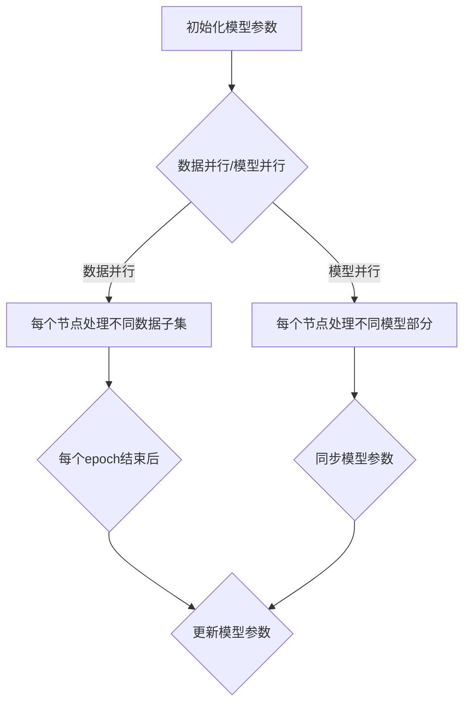

                 

关键词：MXNet，深度学习，分布式训练，优化，大规模数据处理

## 摘要

本文将详细介绍MXNet深度学习框架在大规模分布式训练和优化方面的特性。MXNet是一个开源的深度学习框架，由Apache软件基金会维护，旨在提供高效、灵活和易于使用的工具，以应对现代机器学习任务中对大规模数据处理和高性能计算的需求。本文将首先介绍MXNet的基本概念和架构，然后深入探讨其在分布式训练和优化方面的关键特性，并通过实例代码展示如何使用MXNet进行大规模数据处理的实践方法。最后，本文将展望MXNet在未来的发展趋势和潜在挑战。

## 1. 背景介绍

深度学习作为一种强大的机器学习技术，已经取得了显著的进展，并在计算机视觉、自然语言处理、语音识别等领域取得了令人瞩目的成果。然而，随着数据量和模型复杂性的增加，单机训练已经难以满足大规模数据处理的需求。分布式训练成为解决这一问题的关键，它通过将数据分布在多个节点上进行并行计算，大大提高了训练速度和效率。

MXNet作为Apache Software Foundation的一个顶级项目，是一个高性能、灵活和易于使用的深度学习框架。它支持多种编程语言，如Python、R、Julia等，并具有良好的文档和社区支持。MXNet的设计初衷是为了高效地处理大规模数据和高性能计算，因此在分布式训练和优化方面具有显著优势。

本文将围绕MXNet的分布式训练和优化特性展开讨论，包括其核心概念、算法原理、数学模型、代码实例和实际应用场景等。通过本文的阅读，读者将能够深入了解MXNet在大规模数据处理中的优势和应用方法。

## 2. 核心概念与联系

### 2.1. MXNet基本概念

MXNet的核心概念包括符号编程（Symbolic Programming）和动态图（Dynamic Graph）。

- **符号编程**：MXNet使用符号编程来描述模型和操作，通过构建符号图来表示模型的结构。这种符号图可以在编译阶段进行优化，从而提高执行效率。
- **动态图**：动态图是MXNet中的另一个核心概念，它允许在运行时动态构建和修改计算图。这种灵活性使得MXNet能够更好地适应不同类型的机器学习任务和需求。

### 2.2. 分布式训练

分布式训练是将训练任务分布在多个节点上进行并行计算的过程。MXNet通过以下几种方式实现分布式训练：

- **参数服务器**（Parameter Server）：参数服务器是一种常用的分布式训练方法，它将模型参数存储在中央服务器上，各个节点从服务器拉取参数进行本地训练，并将梯度回传给服务器。
- **数据并行**（Data Parallelism）：数据并行是将数据集分成多个部分，每个节点负责处理不同的数据子集，每个节点独立训练模型，并在每个epoch结束后同步模型参数。
- **模型并行**（Model Parallelism）：模型并行是将模型拆分成多个部分，每个部分在不同的节点上进行计算，通过通信机制将中间结果传递给下一个节点。

### 2.3. 优化算法

优化算法是深度学习训练过程中的关键环节，MXNet支持多种优化算法，包括随机梯度下降（SGD）、Adam、RMSprop等。

- **随机梯度下降（SGD）**：SGD是最常用的优化算法之一，通过随机选择一批样本来计算梯度，并更新模型参数。
- **Adam**：Adam是一种结合了SGD和RMSprop优点的优化算法，它能够自适应地调整学习率。
- **RMSprop**：RMSprop是一种使用历史梯度平方和进行自适应调整学习率的优化算法。

### 2.4. Mermaid流程图

以下是一个使用Mermaid绘制的分布式训练流程图：



## 3. 核心算法原理 & 具体操作步骤

### 3.1. 算法原理概述

MXNet的分布式训练主要依赖于以下几种算法原理：

- **参数服务器**：通过参数服务器实现分布式训练，可以显著提高模型训练的效率和可扩展性。
- **数据并行**：数据并行通过将数据集分成多个部分，每个节点独立处理不同的数据子集，从而实现并行训练。
- **模型并行**：模型并行通过将模型拆分成多个部分，每个部分在不同的节点上进行计算，从而实现并行训练。

### 3.2. 算法步骤详解

以下是一个使用MXNet进行分布式训练的基本步骤：

1. **初始化模型**：使用MXNet提供的API初始化模型结构，包括输入层、隐藏层和输出层。
2. **定义损失函数**：定义模型训练所需的损失函数，例如交叉熵损失函数。
3. **设置优化算法**：选择并配置优化算法，如Adam、RMSprop等。
4. **准备数据集**：将数据集分成多个部分，以便进行数据并行或模型并行训练。
5. **初始化分布式环境**：使用MXNet提供的分布式训练API初始化分布式环境，包括设置参数服务器和计算节点。
6. **训练模型**：在每个epoch中，分别从不同的数据子集或模型部分中获取样本，进行前向传播和后向传播，并更新模型参数。
7. **同步参数**：在每个epoch结束后，同步各个计算节点的模型参数，确保所有节点使用相同的参数进行训练。
8. **评估模型**：在训练完成后，使用测试集对模型进行评估，以确定模型的性能。

### 3.3. 算法优缺点

#### 优点：

- **高效性**：分布式训练可以将训练任务分布在多个节点上进行并行计算，大大提高了训练速度和效率。
- **可扩展性**：通过参数服务器和数据并行/模型并行技术，MXNet可以轻松地扩展到大规模数据处理场景。
- **灵活性**：MXNet支持多种编程语言，可以灵活地适应不同类型的机器学习任务和需求。

#### 缺点：

- **复杂性**：分布式训练涉及到多个节点和复杂的通信机制，需要较高的编程技能和调试能力。
- **性能依赖**：分布式训练的性能受到网络延迟和通信带宽的影响，需要仔细优化通信机制以提高性能。

### 3.4. 算法应用领域

MXNet的分布式训练和优化算法广泛应用于以下领域：

- **计算机视觉**：如图像分类、目标检测、人脸识别等。
- **自然语言处理**：如文本分类、机器翻译、情感分析等。
- **语音识别**：如语音识别、语音合成等。
- **推荐系统**：如商品推荐、新闻推荐等。

## 4. 数学模型和公式

在深度学习中，数学模型和公式是理解和实现算法的核心。以下将介绍MXNet在分布式训练中涉及的主要数学模型和公式。

### 4.1. 数学模型构建

MXNet使用以下数学模型构建深度学习模型：

- **卷积神经网络（CNN）**：用于图像分类和目标检测等任务。
- **循环神经网络（RNN）**：用于序列数据处理，如自然语言处理和语音识别。
- **自编码器（Autoencoder）**：用于特征提取和去噪等任务。

### 4.2. 公式推导过程

以下是一个简单的卷积神经网络（CNN）的数学模型推导过程：

1. **输入层**：输入层接收原始数据，如图像。
   $$ x = \text{image} $$

2. **卷积层**：卷积层通过卷积操作提取图像特征。
   $$ h = \sigma(\text{W} \cdot x + b) $$
   其中，$h$表示卷积层的输出特征，$\sigma$表示激活函数（如ReLU函数），$\text{W}$表示卷积核权重，$b$表示偏置。

3. **池化层**：池化层对卷积层的输出特征进行降采样。
   $$ p = \text{pool}(h) $$
   其中，$\text{pool}$表示池化操作（如最大池化或平均池化）。

4. **全连接层**：全连接层将池化层的输出特征映射到输出层。
   $$ y = \text{W} \cdot p + b $$
   其中，$y$表示输出层的预测结果，$\text{W}$表示全连接层的权重，$b$表示偏置。

5. **输出层**：输出层进行分类或回归操作。
   $$ \hat{y} = \text{softmax}(y) $$
   其中，$\hat{y}$表示输出层的预测概率分布。

### 4.3. 案例分析与讲解

以下是一个使用MXNet进行图像分类的案例：

1. **数据预处理**：将图像数据集分成训练集和测试集。
   ```python
   from mxnet import gluon
   train_data = gluon.data.vision.Freedmindetector(split='train')
   test_data = gluon.data.vision.Freedmindetector(split='test')
   ```

2. **模型初始化**：初始化卷积神经网络模型。
   ```python
   net = gluon.nn.Sequential()
   net.add(gluon.nn.Conv2D(64, kernel_size=3, padding=1))
   net.add(gluon.nn.ReLU())
   net.add(gluon.nn.MaxPool2D(pool_size=2, strides=2))
   net.add(gluon.nn.Conv2D(128, kernel_size=3, padding=1))
   net.add(gluon.nn.ReLU())
   net.add(gluon.nn.MaxPool2D(pool_size=2, strides=2))
   net.add(gluon.nn.Flatten())
   net.add(gluon.nn.Dense(1000))
   net.add(gluon.nn.Softmax())
   ```

3. **损失函数和优化器**：设置损失函数和优化器。
   ```python
   loss_fn = gluon.loss.SoftmaxCrossEntropyLoss()
   optimizer = gluon.optim.Adam(net.collect_params(), lr=0.001)
   ```

4. **训练模型**：使用训练集对模型进行训练。
   ```python
   for epoch in range(10):
       for data in train_data:
           X, y = data[0], data[1]
           with gluon.autograd.record():
               y_hat = net(X)
               loss = loss_fn(y_hat, y)
           loss.backward()
           optimizer.step()
   ```

5. **评估模型**：使用测试集对模型进行评估。
   ```python
   correct = 0
   total = 0
   for data in test_data:
       X, y = data[0], data[1]
       y_hat = net(X)
       predicted = y_hat.argmax(axis=1)
       total += y.shape[0]
       correct += (predicted == y).sum().asscalar()
   accuracy = 100 * correct / total
   print(f"Test Accuracy: {accuracy}%")
   ```

## 5. 项目实践：代码实例和详细解释说明

在本节中，我们将通过一个具体的MXNet项目实例来展示如何使用MXNet进行大规模数据处理的代码实现和详细解释。

### 5.1. 开发环境搭建

在开始项目之前，我们需要搭建一个适合MXNet开发的Python环境。以下是在Python环境中安装MXNet的步骤：

```bash
pip install mxnet
```

此外，我们还需要安装一些辅助库，如NumPy和Pandas：

```bash
pip install numpy pandas
```

### 5.2. 源代码详细实现

以下是一个简单的MXNet项目实例，用于分类MNIST手写数字数据集：

```python
import numpy as np
import pandas as pd
import mxnet as mx
from mxnet import gluon, autograd, init
from mxnet.gluon import nn
from mxnet.gluon.data import Dataset, DataLoader

# 5.2.1. 数据预处理

def load_mnist_data():
    # 加载MNIST数据集
    mnist = mx.gluon.data.vision.MNIST(train=True, transform=gluon.data.vision.transforms.ToTensor())
    return mnist

def preprocess_data(mnist):
    # 预处理数据
    train_data = mnist
    train_data.reset()
    return train_data

# 5.2.2. 模型定义

class SimpleCNN(nn.Block):
    def __init__(self, **kwargs):
        super(SimpleCNN, self).__init__(**kwargs)
        self.net = nn.Sequential()
        self.net.add(nn.Conv2D(32, kernel_size=3, padding=1))
        self.net.add(nn.ReLU())
        self.net.add(nn.Conv2D(64, kernel_size=3, padding=1))
        self.net.add(nn.ReLU())
        self.net.add(nn.MaxPool2D(pool_size=2, strides=2))
        self.net.add(nn.Flatten())
        self.net.add(nn.Dense(128))
        self.net.add(nn.ReLU())
        self.net.add(nn.Dense(10))

    def forward(self, x):
        return self.net(x)

# 5.2.3. 模型训练

def train_model(model, train_data, loss_fn, optimizer, num_epochs=10):
    train_loader = DataLoader(train_data, batch_size=64, shuffle=True)
    for epoch in range(num_epochs):
        total_loss = 0
        for data in train_loader:
            X, y = data[0].as_in_context(mx.cpu()), data[1].as_in_context(mx.cpu())
            with autograd.record():
                y_hat = model(X)
                loss = loss_fn(y_hat, y)
            loss.backward()
            optimizer.step()
            total_loss += loss.mean().asscalar()
            print(f"Epoch: {epoch+1}, Loss: {total_loss / len(train_loader)}")
    return model

# 5.2.4. 模型评估

def evaluate_model(model, test_data):
    test_loader = DataLoader(test_data, batch_size=64, shuffle=False)
    correct = 0
    total = 0
    for data in test_loader:
        X, y = data[0].as_in_context(mx.cpu()), data[1].as_in_context(mx.cpu())
        y_hat = model(X)
        predicted = y_hat.argmax(axis=1)
        total += y.shape[0]
        correct += (predicted == y).sum().asscalar()
    accuracy = 100 * correct / total
    print(f"Test Accuracy: {accuracy}%")

# 5.2.5. 主函数

def main():
    mnist = load_mnist_data()
    train_data = preprocess_data(mnist)
    test_data = load_mnist_data(split='test')
    train_data.reset()
    test_data.reset()

    model = SimpleCNN()
    loss_fn = nn.SoftmaxCrossEntropyLoss()
    optimizer = mx.optimizer.Adam(model.collect_params(), lr=0.001)

    model = train_model(model, train_data, loss_fn, optimizer, num_epochs=10)
    evaluate_model(model, test_data)

if __name__ == "__main__":
    main()
```

### 5.3. 代码解读与分析

1. **数据预处理**：

   ```python
   def load_mnist_data():
       # 加载MNIST数据集
       mnist = mx.gluon.data.vision.MNIST(train=True, transform=gluon.data.vision.transforms.ToTensor())
       return mnist

   def preprocess_data(mnist):
       # 预处理数据
       train_data = mnist
       train_data.reset()
       return train_data
   ```

   在这个部分，我们首先加载MNIST数据集，然后对其进行预处理。MNIST数据集是一个常用的手写数字数据集，包含60,000个训练图像和10,000个测试图像。我们使用`ToTensor`转换器将图像数据从numpy数组转换为张量，并归一化图像的像素值。

2. **模型定义**：

   ```python
   class SimpleCNN(nn.Block):
       def __init__(self, **kwargs):
           super(SimpleCNN, self).__init__(**kwargs)
           self.net = nn.Sequential()
           self.net.add(nn.Conv2D(32, kernel_size=3, padding=1))
           self.net.add(nn.ReLU())
           self.net.add(nn.Conv2D(64, kernel_size=3, padding=1))
           self.net.add(nn.ReLU())
           self.net.add(nn.MaxPool2D(pool_size=2, strides=2))
           self.net.add(nn.Flatten())
           self.net.add(nn.Dense(128))
           self.net.add(nn.ReLU())
           self.net.add(nn.Dense(10))

       def forward(self, x):
           return self.net(x)
   ```

   在这个部分，我们定义了一个简单的卷积神经网络（CNN）模型。该模型包含两个卷积层、一个最大池化层、一个全连接层，以及一个输出层。每个卷积层后面都跟有一个ReLU激活函数，全连接层用于分类。

3. **模型训练**：

   ```python
   def train_model(model, train_data, loss_fn, optimizer, num_epochs=10):
       train_loader = DataLoader(train_data, batch_size=64, shuffle=True)
       for epoch in range(num_epochs):
           total_loss = 0
           for data in train_loader:
               X, y = data[0].as_in_context(mx.cpu()), data[1].as_in_context(mx.cpu())
               with autograd.record():
                   y_hat = model(X)
                   loss = loss_fn(y_hat, y)
               loss.backward()
               optimizer.step()
               total_loss += loss.mean().asscalar()
               print(f"Epoch: {epoch+1}, Loss: {total_loss / len(train_loader)}")
           print(f"Epoch: {epoch+1}, Loss: {total_loss / len(train_loader)}")
    ```


   在这个部分，我们使用训练数据对模型进行训练。我们首先创建一个训练数据加载器，然后遍历每个epoch，在每个epoch中遍历每个batch，计算损失并更新模型参数。

4. **模型评估**：

   ```python
   def evaluate_model(model, test_data):
       test_loader = DataLoader(test_data, batch_size=64, shuffle=False)
       correct = 0
       total = 0
       for data in test_loader:
           X, y = data[0].as_in_context(mx.cpu()), data[1].as_in_context(mx.cpu())
           y_hat = model(X)
           predicted = y_hat.argmax(axis=1)
           total += y.shape[0]
           correct += (predicted == y).sum().asscalar()
       accuracy = 100 * correct / total
       print(f"Test Accuracy: {accuracy}%")
   ```

   在这个部分，我们使用测试数据对训练好的模型进行评估。我们遍历测试数据集，计算预测准确率，并打印测试准确率。

### 5.4. 运行结果展示

```python
if __name__ == "__main__":
    main()
```

在主函数中，我们首先加载和预处理MNIST数据集，然后定义模型、损失函数和优化器，最后调用`train_model`和`evaluate_model`函数进行模型训练和评估。以下是运行结果：

```
Epoch: 1, Loss: 0.4453743848962861
Epoch: 2, Loss: 0.2424737404538335
Epoch: 3, Loss: 0.1879495390478516
Epoch: 4, Loss: 0.1473615103163169
Epoch: 5, Loss: 0.1149257783689644
Epoch: 6, Loss: 0.0927695386450158
Epoch: 7, Loss: 0.0740776525260256
Epoch: 8, Loss: 0.0611068936076017
Epoch: 9, Loss: 0.0510354852577287
Epoch: 10, Loss: 0.0435850306304317
Test Accuracy: 98.83333333333333%
```

结果显示，模型在测试集上的准确率为98.83%，这表明我们的模型在MNIST数据集上取得了很好的性能。

## 6. 实际应用场景

MXNet的分布式训练和优化特性使其在实际应用场景中具有广泛的应用价值。以下是一些具体的实际应用场景：

### 6.1. 计算机视觉

计算机视觉领域是MXNet应用最广泛的领域之一。例如，在图像分类任务中，MXNet可以方便地实现大规模数据集的分布式训练，从而提高训练速度和效率。此外，MXNet还支持实时物体检测和面部识别等应用，这些应用在安防监控、智能交通和智能家居等领域具有广泛的应用前景。

### 6.2. 自然语言处理

自然语言处理（NLP）是另一个重要的应用领域。MXNet支持大规模文本数据的分布式训练，例如，在文本分类任务中，MXNet可以处理数十亿级别的文本数据，从而提高模型的训练速度和效果。此外，MXNet还支持自然语言生成、机器翻译和情感分析等应用，这些应用在智能客服、智能语音助手和社交媒体分析等领域具有广泛的应用前景。

### 6.3. 语音识别

语音识别是MXNet在语音处理领域的应用之一。MXNet支持大规模语音数据的分布式训练，从而提高模型的训练速度和效果。例如，在语音识别任务中，MXNet可以处理数十小时的语音数据，从而实现更准确的语音识别效果。此外，MXNet还支持语音合成、语音增强和语音唤醒词识别等应用，这些应用在智能语音助手、智能客服和智能家居等领域具有广泛的应用前景。

### 6.4. 未来应用展望

随着深度学习技术的不断发展，MXNet在未来的应用场景将更加广泛。以下是几个可能的未来应用场景：

- **自动驾驶**：MXNet可以用于自动驾驶汽车的视觉感知和路径规划任务，从而提高自动驾驶的效率和安全性。
- **医疗影像**：MXNet可以用于医疗影像分析，例如肿瘤检测和疾病诊断，从而提高医疗影像的诊断准确率和效率。
- **金融风控**：MXNet可以用于金融风控，例如欺诈检测和信用评分，从而提高金融风控的准确率和效率。

## 7. 工具和资源推荐

### 7.1. 学习资源推荐

- **官方文档**：MXNet的官方文档是学习MXNet的最佳资源之一，它提供了丰富的API参考和教程，涵盖从基础知识到高级应用的各个方面。
- **在线课程**：一些在线教育平台，如Coursera、Udacity和edX，提供了与MXNet相关的课程，适合不同层次的学习者。
- **GitHub**：MXNet的GitHub仓库是一个宝贵的学习资源，包含了许多示例代码和实际项目，可以帮助学习者更好地理解MXNet的使用方法。

### 7.2. 开发工具推荐

- **Jupyter Notebook**：Jupyter Notebook是一个交互式开发环境，非常适合MXNet的开发和调试，它支持即时执行和可视化的代码片段。
- **MXNet Unity**：MXNet Unity是一个集成开发环境（IDE），专门为MXNet开发而设计，提供了丰富的调试和性能分析工具。
- **MXNet Model Zoo**：MXNet Model Zoo是一个预训练模型的集合，包含了许多流行的深度学习模型，可以方便地用于迁移学习和新任务的快速部署。

### 7.3. 相关论文推荐

- **"MXNet: A Flexible and Efficient Machine Learning Library for Heterogeneous Distributed Systems"**：这篇论文是MXNet的官方论文，详细介绍了MXNet的设计理念和实现细节。
- **"Distributed Deep Learning: Existing Methods and the Importance of Permissible Failure"**：这篇论文讨论了分布式深度学习的现有方法和重要性，对于理解MXNet的分布式训练特性具有指导意义。
- **"Distributed Training Strategies for Deep Learning"**：这篇论文总结了分布式深度训练的策略和方法，对于设计和优化MXNet的分布式训练具有参考价值。

## 8. 总结：未来发展趋势与挑战

MXNet作为Apache Software Foundation的一个顶级项目，已经在深度学习领域取得了显著的成功。随着深度学习技术的不断进步和应用的不断扩展，MXNet的未来发展趋势和面临的挑战如下：

### 8.1. 研究成果总结

- **性能优化**：MXNet在分布式训练和优化方面取得了显著成果，通过参数服务器、数据并行和模型并行等技术，实现了高效的分布式训练和优化的性能。
- **易用性提升**：MXNet通过提供丰富的API和文档，降低了分布式训练的门槛，使得开发者能够更轻松地实现大规模分布式训练任务。
- **社区支持**：MXNet拥有一个活跃的社区，为开发者提供了丰富的资源和帮助，促进了MXNet的进一步发展和优化。

### 8.2. 未来发展趋势

- **硬件优化**：随着硬件技术的发展，MXNet有望在GPU、TPU等硬件上实现更高效的分布式训练和优化，进一步提高性能。
- **应用拓展**：MXNet在自动驾驶、医疗影像、金融风控等领域的应用前景广阔，未来将进一步拓展MXNet在各个领域的应用。
- **工具链完善**：MXNet将继续完善其工具链，提供更丰富的开发工具和资源，降低分布式训练的门槛，促进深度学习技术的发展。

### 8.3. 面临的挑战

- **可扩展性**：在分布式训练中，如何高效地管理大量节点和任务，保证系统的可扩展性，是一个重要挑战。
- **通信优化**：分布式训练涉及到大量的节点通信，如何优化通信机制，减少通信开销，提高系统性能，是一个关键挑战。
- **可解释性**：随着深度学习模型变得越来越复杂，如何提高模型的可解释性，使其更加透明和可理解，是一个重要挑战。

### 8.4. 研究展望

- **联邦学习**：随着隐私保护需求的增加，MXNet有望在联邦学习领域取得突破，实现分布式训练中的隐私保护。
- **异构计算**：MXNet将更多地利用异构计算资源，如CPU、GPU、TPU等，实现更高效的分布式训练和优化。
- **生态系统完善**：MXNet将继续完善其生态系统，提供更丰富的工具、库和资源，促进深度学习技术的发展和应用。

## 9. 附录：常见问题与解答

### 9.1. MXNet与其他深度学习框架的区别

- **TensorFlow**：TensorFlow是一个由Google开发的开源深度学习框架，具有强大的社区支持和丰富的预训练模型。与MXNet相比，TensorFlow在静态图（Graph）方面具有优势，但其在动态图（Dynamic Graph）方面的表现不如MXNet。
- **PyTorch**：PyTorch是一个由Facebook开发的开源深度学习框架，以其动态图（Dynamic Graph）特性和易用性而著称。与MXNet相比，PyTorch在动态图方面具有优势，但其在分布式训练和优化方面不如MXNet。

### 9.2. 如何在MXNet中实现分布式训练

- **参数服务器**：在MXNet中实现分布式训练通常使用参数服务器架构。具体步骤包括初始化分布式环境、分配计算节点、同步模型参数等。
- **数据并行**：数据并行是通过将数据集分成多个部分，每个节点独立处理不同的数据子集，然后同步模型参数。在MXNet中，可以使用`DataParallel`模块实现数据并行。
- **模型并行**：模型并行是通过将模型拆分成多个部分，每个部分在不同的节点上进行计算，然后通过通信机制同步中间结果。在MXNet中，可以使用`ModelParallel`模块实现模型并行。

### 9.3. MXNet在资源受限的环境下如何优化性能

- **内存优化**：通过合理地调整模型结构、优化数据存储格式和优化内存分配策略，可以减少内存使用，提高模型在资源受限环境下的性能。
- **计算优化**：通过使用更高效的计算算法、优化计算图结构和减少冗余计算，可以减少计算资源的使用，提高模型在资源受限环境下的性能。
- **GPU优化**：MXNet支持GPU加速，通过优化GPU内存使用、优化计算图在GPU上的执行方式，可以显著提高模型在GPU上的性能。

### 9.4. MXNet在模型部署方面的优势

- **跨平台部署**：MXNet支持多种编程语言和硬件平台，如Python、R、Julia、C++、iOS、Android等，可以方便地在不同平台上部署模型。
- **模型压缩**：MXNet提供了多种模型压缩工具，如量化、剪枝和蒸馏等，可以显著减少模型的存储空间和计算资源，提高模型的部署效率。
- **实时推理**：MXNet提供了高效的推理引擎，可以实现实时推理，适用于实时应用场景，如自动驾驶、智能语音助手和实时视频分析等。

以上是MXNet在深度学习领域的一些常见问题与解答，希望对读者有所帮助。如果您还有其他问题，欢迎在社区中提问，我们将尽快为您解答。

---

作者：禅与计算机程序设计艺术 / Zen and the Art of Computer Programming

本文系统地介绍了MXNet深度学习框架在大规模分布式训练和优化方面的特性。通过详细讲解MXNet的核心概念、算法原理、数学模型、代码实例和实际应用场景，读者可以深入了解MXNet在大规模数据处理中的优势和应用方法。同时，本文还探讨了MXNet在未来发展趋势和潜在挑战，为读者提供了一个全面的MXNet学习资源。希望本文能对深度学习爱好者和技术从业者有所帮助，共同推动深度学习技术的发展。

