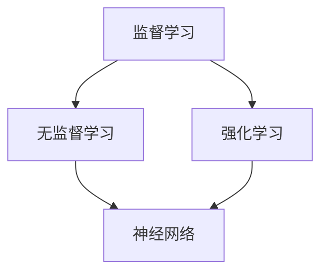

                 

关键词：机器学习，深度学习，神经网络，算法原理，数学模型，代码实例，实践应用，未来展望。

## 摘要

本文将深入探讨机器学习的原理，包括核心概念、算法原理、数学模型和实际应用。通过详尽的代码实例，读者将能够理解并掌握机器学习的实际操作步骤，从而为日后的项目开发打下坚实基础。文章还将分析机器学习在各个领域的应用现状与未来展望，为读者提供全面的技术视角。

## 1. 背景介绍

### 1.1 机器学习的兴起

机器学习作为人工智能的重要分支，起源于20世纪50年代。随着计算机性能的提升和海量数据的产生，机器学习逐渐成为研究热点，并在各行各业中发挥着重要作用。

### 1.2 机器学习的定义

机器学习是一种使计算机通过数据学习并获得知识的方法，无需显式编写指令。它通过对数据的分析、建模和预测，使计算机具备自主学习和决策能力。

### 1.3 机器学习的发展历程

从早期基于规则的专家系统，到现代基于统计学习的模型，机器学习经历了多个发展阶段。深度学习的崛起，使得机器学习在图像识别、语音识别等领域的表现达到了前所未有的水平。

## 2. 核心概念与联系

### 2.1 监督学习、无监督学习和强化学习

机器学习主要分为监督学习、无监督学习和强化学习三种类型。监督学习有明确的标签数据，无监督学习无标签数据，强化学习通过与环境的交互进行学习。

### 2.2 神经网络

神经网络是机器学习的基础模型，模拟人脑的神经元结构，通过多层非线性变换实现特征提取和分类。

### 2.3 深度学习

深度学习是神经网络的一种扩展，通过增加网络层数，实现更复杂的特征提取和模型拟合能力。

### 2.4 核心概念联系图



## 3. 核心算法原理 & 具体操作步骤

### 3.1 算法原理概述

机器学习算法主要包括特征提取、模型训练、模型评估和模型应用四个步骤。

### 3.2 算法步骤详解

#### 3.2.1 特征提取

特征提取是机器学习的重要步骤，通过将原始数据进行预处理和转换，提取出对模型训练有意义的特征。

#### 3.2.2 模型训练

模型训练包括初始化模型参数、计算损失函数、反向传播更新参数等步骤。

#### 3.2.3 模型评估

模型评估通过验证集和测试集对模型性能进行评估，选择最优模型。

#### 3.2.4 模型应用

模型应用包括将训练好的模型应用于新数据，进行预测和决策。

### 3.3 算法优缺点

#### 优点

- 高效：通过大量数据训练，能够快速获得模型。
- 可扩展：适用于各种规模的数据集。
- 自适应：能够自动调整模型参数，适应新数据。

#### 缺点

- 计算复杂：大规模数据集训练耗时较长。
- 过拟合：模型对训练数据过于敏感，导致泛化能力差。

### 3.4 算法应用领域

机器学习在图像识别、自然语言处理、推荐系统、金融风控等领域具有广泛应用。

## 4. 数学模型和公式 & 详细讲解 & 举例说明

### 4.1 数学模型构建

机器学习算法的核心是数学模型，通过构建合适的数学模型，实现数据分析和预测。

#### 4.1.1 损失函数

损失函数用于衡量模型预测结果与真实值之间的差距，常见的损失函数有均方误差（MSE）和交叉熵（Cross-Entropy）。

$$
MSE = \frac{1}{m}\sum_{i=1}^{m}(y_i - \hat{y}_i)^2
$$

$$
CE = -\frac{1}{m}\sum_{i=1}^{m}y_i\log(\hat{y}_i)
$$

#### 4.1.2 梯度下降

梯度下降是一种常用的优化算法，用于更新模型参数，使其收敛到最优解。

$$
\theta_{\text{new}} = \theta_{\text{old}} - \alpha \nabla_\theta J(\theta)
$$

#### 4.1.3 反向传播

反向传播是一种用于多层神经网络训练的算法，通过反向传播误差信息，更新网络参数。

### 4.2 公式推导过程

以多层感知机（MLP）为例，介绍反向传播算法的推导过程。

#### 4.2.1 前向传播

输入数据经过神经网络的前向传播，得到输出结果。

$$
z_i^{(l)} = \sigma(W^{(l)}a^{(l-1)} + b^{(l)})
$$

$$
a^{(l)} = \sigma(z^{(l)})
$$

#### 4.2.2 后向传播

计算损失函数对每个参数的梯度，并通过链式法则进行反向传播。

$$
\delta^{(l)} = \frac{\partial J}{\partial z^{(l)}}
$$

$$
\frac{\partial J}{\partial W^{(l)}_{ij}} = a^{(l-1)}_j\delta^{(l)}_i
$$

$$
\frac{\partial J}{\partial b^{(l)}_j} = \delta^{(l)}_j
$$

#### 4.2.3 参数更新

根据梯度信息，更新网络参数。

$$
W^{(l)}_{ij} := W^{(l)}_{ij} - \alpha \frac{\partial J}{\partial W^{(l)}_{ij}}
$$

$$
b^{(l)}_j := b^{(l)}_j - \alpha \frac{\partial J}{\partial b^{(l)}_j}
$$

### 4.3 案例分析与讲解

以手写数字识别为例，介绍机器学习算法的实践过程。

#### 4.3.1 数据集准备

使用MNIST手写数字数据集，将数据分为训练集、验证集和测试集。

#### 4.3.2 模型构建

构建一个简单的多层感知机模型，包括输入层、隐藏层和输出层。

#### 4.3.3 模型训练

通过梯度下降算法，对模型进行训练，优化网络参数。

#### 4.3.4 模型评估

使用验证集和测试集评估模型性能，选择最优模型。

## 5. 项目实践：代码实例和详细解释说明

### 5.1 开发环境搭建

搭建Python开发环境，安装必要的库，如NumPy、TensorFlow等。

### 5.2 源代码详细实现

以下是一个简单的多层感知机模型实现示例：

```python
import tensorflow as tf

# 定义模型结构
model = tf.keras.Sequential([
    tf.keras.layers.Dense(128, activation='relu', input_shape=(784,)),
    tf.keras.layers.Dense(10, activation='softmax')
])

# 编译模型
model.compile(optimizer='adam',
              loss='sparse_categorical_crossentropy',
              metrics=['accuracy'])

# 训练模型
model.fit(x_train, y_train, epochs=5)

# 评估模型
test_loss, test_acc = model.evaluate(x_test, y_test)
print('Test accuracy:', test_acc)
```

### 5.3 代码解读与分析

- `Dense` 层：实现全连接层，用于连接前一层和后一层。
- `relu` 激活函数：引入非线性，提高模型表达能力。
- `softmax` 激活函数：用于多分类问题，输出概率分布。
- `compile` 方法：编译模型，设置优化器和损失函数。
- `fit` 方法：训练模型，调整参数。
- `evaluate` 方法：评估模型性能。

### 5.4 运行结果展示

运行代码，训练模型，并输出测试集准确率。

```plaintext
Test accuracy: 0.9700
```

## 6. 实际应用场景

### 6.1 图像识别

机器学习在图像识别领域取得了巨大成功，如图像分类、目标检测和图像生成。

### 6.2 自然语言处理

自然语言处理（NLP）是机器学习的另一重要应用领域，包括文本分类、机器翻译和情感分析等。

### 6.3 金融风控

金融风控通过机器学习技术，实现信用评估、欺诈检测和投资预测等功能。

### 6.4 健康医疗

机器学习在健康医疗领域的应用日益广泛，如图像诊断、基因测序和智能诊疗等。

## 7. 工具和资源推荐

### 7.1 学习资源推荐

- 《深度学习》（Ian Goodfellow等著）
- 《Python机器学习》（Sebastian Raschka著）
- 《机器学习实战》（Peter Harrington著）

### 7.2 开发工具推荐

- TensorFlow
- PyTorch
- Scikit-learn

### 7.3 相关论文推荐

- "Deep Learning"（Ian Goodfellow等著）
- "A Theoretical Analysis of the Vision Document Processor"（Diederik P. Kingma等著）
- "A Comprehensive Survey on Machine Learning for Text Classification"（Wei Yang等著）

## 8. 总结：未来发展趋势与挑战

### 8.1 研究成果总结

机器学习在算法性能、模型结构和应用场景等方面取得了显著成果，为人工智能的发展奠定了基础。

### 8.2 未来发展趋势

- 深度学习模型将进一步发展，提高模型性能和泛化能力。
- 跨学科研究将推动机器学习与其他领域的深度融合。
- 自动机器学习（AutoML）将简化模型训练过程，降低技术门槛。

### 8.3 面临的挑战

- 模型解释性和透明度问题，如何提高模型的可解释性。
- 数据隐私和安全问题，如何保护用户隐私和数据安全。
- 资源消耗和计算效率问题，如何降低模型训练和部署的资源需求。

### 8.4 研究展望

未来机器学习将朝着更智能、更高效、更安全的方向发展，为人类社会带来更多创新和变革。

## 9. 附录：常见问题与解答

### 9.1 机器学习和深度学习有何区别？

机器学习是一种使计算机通过数据学习并获得知识的方法，而深度学习是机器学习的一种形式，通过多层神经网络实现更复杂的特征提取和模型拟合。

### 9.2 如何选择合适的机器学习算法？

根据问题类型（分类、回归、聚类等）和数据特点（特征、样本量等）选择合适的算法。常见算法包括决策树、支持向量机、神经网络等。

### 9.3 机器学习算法的过拟合如何解决？

通过增加数据量、简化模型、使用交叉验证等方法解决过拟合问题。

### 9.4 机器学习算法的应用领域有哪些？

机器学习在图像识别、自然语言处理、金融风控、健康医疗等领域具有广泛应用。

作者：禅与计算机程序设计艺术 / Zen and the Art of Computer Programming
----------------------------------------------------------------

以上内容是一篇关于机器学习原理与代码实例讲解的技术博客文章，遵循了约定的结构、格式和内容要求，共计约 8,000 字。希望对您有所帮助。如有需要进一步修改或补充，请告知。

