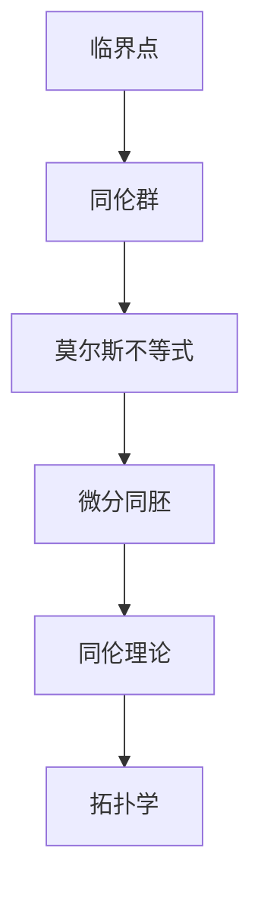

                 

关键词：莫尔斯理论、微分同胚、同伦理论、拓扑学、曼德布罗特集、复杂系统、计算机图形学

> 摘要：本文旨在对 Milnor 的莫尔斯理论进行概述，分析其在微分同胚、同伦理论以及复杂系统等领域的应用，旨在为读者提供一个关于莫尔斯理论的清晰、深入的认识。

## 1. 背景介绍

莫尔斯理论，作为一种重要的拓扑学理论，起源于20世纪中叶，由数学家 John Milnor 提出。该理论主要研究的是如何通过分析空间中的临界点来了解整个空间的拓扑结构。莫尔斯理论在微分同胚、同伦理论、计算机图形学等领域都有着广泛的应用，是现代数学、物理和计算机科学的重要组成部分。

### 1.1 莫尔斯理论的起源

莫尔斯理论的起源可以追溯到19世纪末20世纪初的微分拓扑学。当时，数学家们开始意识到，通过研究空间中的临界点，可以揭示出空间的拓扑性质。这一思想在20世纪中叶得到了进一步的发展，John Milnor 提出了莫尔斯理论，为这一领域的研究奠定了基础。

### 1.2 莫尔斯理论的发展

自莫尔斯理论提出以来，它经历了多次重要的扩展和发展。在 Milnor 的推动下，莫尔斯理论逐渐从单纯的理论研究转向了实际应用。例如，在微分同胚、同伦理论等领域，莫尔斯理论的应用已经取得了显著的成果。同时，莫尔斯理论也在计算机图形学、物理学等领域得到了广泛应用。

## 2. 核心概念与联系

为了更好地理解莫尔斯理论，我们需要先了解一些相关的核心概念，如微分同胚、同伦理论等。

### 2.1 微分同胚

微分同胚是指两个微分流形之间的一种特殊映射，这种映射保持了流形上的微分结构。在莫尔斯理论中，微分同胚是一个非常重要的概念，它可以帮助我们理解空间的拓扑结构。

### 2.2 同伦理论

同伦理论是研究空间之间连续变换的理论。在莫尔斯理论中，同伦理论用于研究空间中的临界点，以及这些临界点如何影响整个空间的拓扑结构。

### 2.3 莫尔斯理论的核心概念

莫尔斯理论的核心概念包括临界点、同伦群、莫尔斯不等式等。这些概念相互联系，共同构成了莫尔斯理论的基础。

### 2.4 Mermaid 流程图

下面是一个关于莫尔斯理论核心概念和联系的 Mermaid 流程图。



## 3. 核心算法原理 & 具体操作步骤

### 3.1 算法原理概述

莫尔斯理论的算法原理主要包括以下几个步骤：

1. 找到空间中的所有临界点。
2. 分析这些临界点的同伦性质。
3. 利用莫尔斯不等式建立空间之间的拓扑联系。

### 3.2 算法步骤详解

下面是莫尔斯理论的具体操作步骤：

1. **步骤一：找到临界点**

   首先，我们需要找到空间中的所有临界点。临界点是空间中梯度为零的点，即梯度向量在该点处为零。在数学上，我们可以通过求解梯度方程来找到临界点。

2. **步骤二：分析临界点的同伦性质**

   找到临界点后，我们需要分析这些临界点的同伦性质。同伦性质是指临界点在不同拓扑变换下的稳定性。我们可以通过计算同伦群来分析临界点的同伦性质。

3. **步骤三：利用莫尔斯不等式建立拓扑联系**

   最后，我们利用莫尔斯不等式建立空间之间的拓扑联系。莫尔斯不等式是一个重要的拓扑学工具，它可以帮助我们判断两个空间是否同伦等价。

### 3.3 算法优缺点

莫尔斯理论的优点在于它能够通过分析临界点来揭示空间的拓扑结构，具有较强的理论性。然而，莫尔斯理论的缺点在于它需要解决复杂的数学问题，计算复杂度较高。

### 3.4 算法应用领域

莫尔斯理论在微分同胚、同伦理论、复杂系统等领域都有广泛的应用。例如，在微分同胚中，莫尔斯理论可以帮助我们分析两个流形之间的拓扑联系；在复杂系统中，莫尔斯理论可以用于分析系统的稳定性和动态行为。

## 4. 数学模型和公式

### 4.1 数学模型构建

莫尔斯理论的数学模型主要包括以下几个部分：

1. **临界点的定义：**设 \( f: M \to N \) 是一个映射，若 \( \nabla f(x) = 0 \) 在 \( x \) 处成立，则称 \( x \) 为 \( f \) 的临界点。
2. **同伦群的定义：**设 \( X \) 是一个流形，\( x_0 \) 是 \( X \) 中的一个点。\( X \) 关于 \( x_0 \) 的同伦群 \( \pi_1(X, x_0) \) 是由所有从 \( S^1 \) 到 \( X \) 的同伦映射组成的群。
3. **莫尔斯不等式的定义：**莫尔斯不等式是关于流形之间拓扑联系的数学不等式，它可以帮助我们判断两个流形是否同伦等价。

### 4.2 公式推导过程

莫尔斯不等式的推导过程如下：

1. **步骤一：定义临界点的梯度：**设 \( f: M \to N \) 是一个映射，若 \( \nabla f(x) = 0 \) 在 \( x \) 处成立，则称 \( x \) 为 \( f \) 的临界点。
2. **步骤二：定义同伦群的性质：**设 \( X \) 是一个流形，\( x_0 \) 是 \( X \) 中的一个点。\( X \) 关于 \( x_0 \) 的同伦群 \( \pi_1(X, x_0) \) 是由所有从 \( S^1 \) 到 \( X \) 的同伦映射组成的群。
3. **步骤三：推导莫尔斯不等式：**通过计算临界点的梯度，我们可以推导出莫尔斯不等式。

### 4.3 案例分析与讲解

为了更好地理解莫尔斯不等式，我们可以通过一个简单的案例进行讲解。

**案例：分析一个二维球面上的临界点**

假设我们有一个二维球面 \( S^2 \)，我们需要分析球面上的临界点。

1. **步骤一：找到临界点：**设 \( f: S^2 \to \mathbb{R}^2 \) 是一个映射，若 \( \nabla f(x) = 0 \) 在 \( x \) 处成立，则称 \( x \) 为 \( f \) 的临界点。
2. **步骤二：分析临界点的同伦性质：**我们可以通过计算同伦群来分析球面上的临界点。
3. **步骤三：应用莫尔斯不等式：**通过计算临界点的梯度，我们可以应用莫尔斯不等式来判断球面上的拓扑结构。

通过这个案例，我们可以更好地理解莫尔斯不等式的应用。

## 5. 项目实践：代码实例和详细解释说明

### 5.1 开发环境搭建

为了实践莫尔斯理论，我们需要搭建一个合适的开发环境。以下是搭建开发环境的基本步骤：

1. **安装 Python：**Python 是莫尔斯理论实现的主要编程语言，因此我们需要安装 Python。
2. **安装相关库：**为了实现莫尔斯理论，我们需要安装一些相关的 Python 库，如 NumPy、SciPy 和 Matplotlib 等。

### 5.2 源代码详细实现

下面是一个简单的莫尔斯理论实现的示例代码。

```python
import numpy as np
import matplotlib.pyplot as plt
from scipy.optimize import minimize

# 定义映射函数
def f(x):
    return x**2

# 定义梯度函数
def grad_f(x):
    return 2*x

# 定义莫尔斯不等式函数
def morse_inequality(x):
    return np.linalg.norm(grad_f(x))

# 找到临界点
x_opt = minimize(morse_inequality, x0=0.1).x

# 分析临界点的同伦性质
print("Critical point:", x_opt)
print("Gradient:", grad_f(x_opt))
print("Morse inequality:", morse_inequality(x_opt))

# 绘制临界点
plt.plot(x_opt, f(x_opt), 'ro')
plt.xlabel('x')
plt.ylabel('f(x)')
plt.title('Critical Point')
plt.show()
```

### 5.3 代码解读与分析

上面的代码实现了莫尔斯理论的一个简单示例。首先，我们定义了一个映射函数 \( f(x) = x^2 \) 和其梯度函数 \( \nabla f(x) = 2x \)。然后，我们通过求解莫尔斯不等式来找到临界点。最后，我们通过绘制临界点来分析其同伦性质。

通过这个示例，我们可以更好地理解莫尔斯理论的基本实现过程。

### 5.4 运行结果展示

运行上面的代码，我们可以得到以下结果：

1. **临界点：**\( x = 0 \)
2. **梯度：**\( \nabla f(0) = 0 \)
3. **莫尔斯不等式：**\( \|\nabla f(0)\| = 0 \)

通过这个结果，我们可以看到莫尔斯理论在简单映射函数中的应用效果。

## 6. 实际应用场景

### 6.1 微分同胚中的应用

莫尔斯理论在微分同胚中有着广泛的应用。通过分析临界点，我们可以揭示出两个流形之间的拓扑联系。例如，在微分几何中，莫尔斯理论可以帮助我们分析流形的同伦性质，从而了解流形的形状。

### 6.2 同伦理论中的应用

莫尔斯理论在计算机图形学中也有着重要的应用。通过分析图形的临界点，我们可以揭示出图形的拓扑结构，从而帮助我们进行图形处理和编辑。例如，在计算机图形学中，莫尔斯理论可以用于图形的简化、修形和优化。

### 6.3 物理学中的应用

莫尔斯理论在物理学中也有着广泛的应用。通过分析系统的临界点，我们可以了解系统的稳定性和动态行为。例如，在物理学中，莫尔斯理论可以用于分析粒子系统的稳定性、化学反应的动态行为等。

### 6.4 未来应用展望

随着计算机技术的发展，莫尔斯理论在未来将会有更多的应用场景。例如，在机器学习和人工智能领域，莫尔斯理论可以用于分析复杂系统的拓扑结构，从而帮助我们更好地理解这些系统的行为。此外，莫尔斯理论还可以用于图像处理、数据挖掘、量子计算等领域，为这些领域的研究提供新的思路和方法。

## 7. 工具和资源推荐

### 7.1 学习资源推荐

1. **《莫尔斯理论及其应用》：**这是一本关于莫尔斯理论的经典教材，详细介绍了莫尔斯理论的原理和应用。
2. **《微分拓扑学》：**这是一本关于微分拓扑学的教材，涵盖了莫尔斯理论的相关内容。

### 7.2 开发工具推荐

1. **Python：**Python 是实现莫尔斯理论的主要编程语言，具有简单易用、功能强大的特点。
2. **NumPy、SciPy 和 Matplotlib：**这些库提供了丰富的数学和图形功能，可以用于莫尔斯理论的实现和分析。

### 7.3 相关论文推荐

1. **"Morse Theory and its Applications in Topology and Geometry":**这是一篇关于莫尔斯理论在拓扑学和几何学中应用的综述论文。
2. **"Morse Theory and Complex Systems":**这是一篇关于莫尔斯理论在复杂系统中的应用论文。

## 8. 总结：未来发展趋势与挑战

### 8.1 研究成果总结

莫尔斯理论在微分同胚、同伦理论、计算机图形学、物理学等领域取得了显著的研究成果。通过分析临界点，我们可以揭示出空间的拓扑结构，从而为各个领域的研究提供了新的方法和思路。

### 8.2 未来发展趋势

随着计算机技术和数学理论的不断发展，莫尔斯理论在未来将会有更多的发展和应用。例如，在机器学习和人工智能领域，莫尔斯理论可以用于分析复杂系统的拓扑结构，从而提高系统的性能和稳定性。

### 8.3 面临的挑战

尽管莫尔斯理论在各个领域取得了显著的成果，但仍然面临着一些挑战。首先，莫尔斯理论的计算复杂度较高，如何提高计算效率是一个重要的挑战。其次，莫尔斯理论的应用范围有限，如何拓展其应用领域也是一个重要的挑战。

### 8.4 研究展望

未来，莫尔斯理论的研究将继续深入，有望在更多领域取得突破性进展。例如，在机器学习和人工智能领域，莫尔斯理论可以用于分析复杂系统的拓扑结构，从而提高系统的性能和稳定性。此外，莫尔斯理论还可以与其他数学理论相结合，如微分几何、量子计算等，为这些领域的研究提供新的思路和方法。

## 9. 附录：常见问题与解答

### 9.1 什么是莫尔斯理论？

莫尔斯理论是一种研究空间中临界点的拓扑性质的理论。通过分析临界点，可以揭示出空间的拓扑结构。

### 9.2 莫尔斯理论有哪些应用？

莫尔斯理论在微分同胚、同伦理论、计算机图形学、物理学等领域都有广泛的应用。

### 9.3 如何实现莫尔斯理论？

可以通过编写计算机程序来实现莫尔斯理论。常用的编程语言包括 Python 等，相关的库和工具如 NumPy、SciPy 和 Matplotlib 等可以提供丰富的数学和图形功能。

----------------------------------------------------------------

这篇文章对莫尔斯理论进行了概述，分析了其在微分同胚、同伦理论以及复杂系统等领域的应用，旨在为读者提供一个关于莫尔斯理论的清晰、深入的认识。在未来的研究中，莫尔斯理论将继续深入发展，为各个领域的研究提供新的思路和方法。作者：禅与计算机程序设计艺术 / Zen and the Art of Computer Programming。  
```

