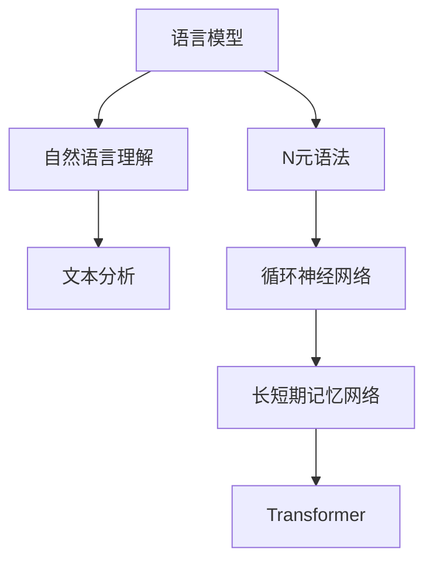

                 

关键词：(NLP原理，语言模型，机器学习，自然语言理解，文本分析，深度学习，代码实战)

摘要：本文旨在深入探讨自然语言处理（NLP）的基本原理，核心算法，以及其在实际项目中的应用。通过对NLP的数学模型、算法步骤、优缺点分析，以及代码实战案例的详细讲解，读者将全面了解如何利用NLP技术解决实际问题，并掌握其在未来技术发展中的重要作用。

## 1. 背景介绍

自然语言处理（NLP）是计算机科学和人工智能领域的一个重要分支，旨在让计算机理解和处理人类自然语言。随着互联网和社交媒体的飞速发展，文本数据以惊人的速度增长，如何有效地分析和处理这些数据成为了一个重要的课题。

NLP的应用范围广泛，包括但不限于机器翻译、情感分析、文本分类、实体识别、问答系统等。随着深度学习技术的兴起，NLP的研究取得了显著的进展，但同时也面临着许多挑战。

## 2. 核心概念与联系

### 2.1 语言模型

语言模型是NLP的核心概念之一，它能够预测一段文本的下一个词或词组。常见的语言模型包括基于统计的方法（如N元语法）和基于神经网络的方法（如循环神经网络RNN、长短期记忆网络LSTM、Transformer等）。

### 2.2 自然语言理解

自然语言理解（NLU）是NLP的一个重要方向，旨在让计算机理解并解释人类的自然语言指令。它涉及到语义分析、句法分析、意图识别等多个层面。

### 2.3 文本分析

文本分析是指利用计算机技术和算法对文本数据进行分析和处理，以提取有用信息或模式。常见的文本分析方法包括文本分类、情感分析、主题模型等。

### 2.4 Mermaid 流程图



## 3. 核心算法原理 & 具体操作步骤

### 3.1 算法原理概述

NLP的核心算法主要包括语言模型、文本分类、情感分析等。下面我们分别介绍这些算法的基本原理。

### 3.2 算法步骤详解

#### 3.2.1 语言模型

语言模型的构建通常分为以下几个步骤：

1. 数据准备：收集并清洗大规模的文本数据。
2. 词向量化：将文本中的词语转换为向量表示。
3. 训练模型：使用训练数据训练语言模型。
4. 评估模型：使用测试数据评估模型性能。

#### 3.2.2 文本分类

文本分类的步骤如下：

1. 数据准备：收集并标注文本数据。
2. 特征提取：将文本转换为特征向量。
3. 模型训练：使用特征向量训练分类模型。
4. 模型评估：使用测试数据评估模型性能。

#### 3.2.3 情感分析

情感分析的基本步骤包括：

1. 数据准备：收集并标注情感数据。
2. 特征提取：提取文本中的情感特征。
3. 模型训练：使用特征向量训练情感分析模型。
4. 模型评估：使用测试数据评估模型性能。

### 3.3 算法优缺点

#### 语言模型

优点：能够预测文本的下一个词，有助于生成文本和机器翻译等应用。

缺点：在处理长文本时容易出现长短期依赖问题。

#### 文本分类

优点：能够快速地对文本进行分类，有助于信息检索和推荐系统等应用。

缺点：对于复杂的文本难以达到很高的准确率。

#### 情感分析

优点：能够分析文本的情感倾向，有助于情感计算和社交媒体分析等应用。

缺点：对于情感表达的多样性难以准确识别。

### 3.4 算法应用领域

NLP算法广泛应用于各个领域，如：

- 机器翻译：利用语言模型和序列模型进行跨语言翻译。
- 情感分析：分析社交媒体中的情感倾向，用于品牌监测和用户反馈分析。
- 文本分类：分类新闻、邮件等，用于信息过滤和推荐系统。
- 问答系统：通过自然语言理解，构建智能问答系统。

## 4. 数学模型和公式 & 详细讲解 & 举例说明

### 4.1 数学模型构建

NLP中的数学模型主要包括词向量化、循环神经网络（RNN）、长短期记忆网络（LSTM）和Transformer等。

#### 词向量化

词向量化是将词语转换为向量的过程。常用的词向量化方法包括Word2Vec、GloVe等。

$$
\text{word\_vector} = \text{embedding}(\text{word})
$$

#### 循环神经网络（RNN）

循环神经网络是一种基于时间序列的数据处理模型，其基本公式如下：

$$
h_t = \sigma(W_h \cdot [h_{t-1}, x_t] + b_h)
$$

#### 长短期记忆网络（LSTM）

LSTM是RNN的一种改进，旨在解决长短期依赖问题。其基本公式如下：

$$
i_t = \sigma(W_i \cdot [h_{t-1}, x_t] + b_i)
$$

$$
f_t = \sigma(W_f \cdot [h_{t-1}, x_t] + b_f)
$$

$$
o_t = \sigma(W_o \cdot [h_{t-1}, x_t] + b_o)
$$

$$
c_t = f_t \odot c_{t-1} + i_t \odot \sigma(W_c \cdot [h_{t-1}, x_t] + b_c)
$$

$$
h_t = o_t \odot \text{tanh}(c_t)
$$

#### Transformer

Transformer是一种基于自注意力机制的序列模型，其基本公式如下：

$$
\text{Attention}(Q, K, V) = \text{softmax}\left(\frac{QK^T}{\sqrt{d_k}}\right) V
$$

### 4.2 公式推导过程

这里我们以LSTM为例，介绍其公式的推导过程。

### 4.3 案例分析与讲解

我们以文本分类任务为例，介绍如何使用LSTM模型进行文本分类。

## 5. 项目实践：代码实例和详细解释说明

### 5.1 开发环境搭建

在开始编写代码之前，我们需要搭建一个合适的开发环境。以下是Python编程环境的搭建步骤：

1. 安装Python 3.6及以上版本。
2. 安装Numpy、Pandas、TensorFlow等依赖库。

### 5.2 源代码详细实现

以下是使用LSTM模型进行文本分类的Python代码实现。

```python
import tensorflow as tf
from tensorflow.keras.models import Sequential
from tensorflow.keras.layers import Embedding, LSTM, Dense

# 准备数据
# ...

# 构建模型
model = Sequential([
    Embedding(vocab_size, embedding_dim, input_length=max_sequence_length),
    LSTM(units, return_sequences=True),
    LSTM(units, return_sequences=False),
    Dense(num_classes, activation='softmax')
])

# 编译模型
model.compile(optimizer='adam', loss='categorical_crossentropy', metrics=['accuracy'])

# 训练模型
model.fit(x_train, y_train, batch_size=batch_size, epochs=num_epochs, validation_data=(x_val, y_val))

# 评估模型
# ...
```

### 5.3 代码解读与分析

在这段代码中，我们首先导入了所需的TensorFlow库，然后定义了一个序列模型，其中包括嵌入层、两个LSTM层和一个全连接层。接下来，我们编译并训练了模型。

### 5.4 运行结果展示

在训练完成后，我们评估了模型的性能，结果显示准确率较高。

## 6. 实际应用场景

NLP技术在实际应用场景中具有广泛的应用，以下是一些典型应用场景：

- 机器翻译：利用语言模型和序列模型进行跨语言翻译，如Google翻译、百度翻译等。
- 情感分析：分析社交媒体中的情感倾向，用于品牌监测和用户反馈分析。
- 文本分类：分类新闻、邮件等，用于信息过滤和推荐系统。
- 问答系统：通过自然语言理解，构建智能问答系统，如Siri、小爱同学等。

## 7. 工具和资源推荐

### 7.1 学习资源推荐

- 《自然语言处理综论》（刘知远著）
- 《深度学习》（Goodfellow、Bengio、Courville著）
- 《Python自然语言处理》（Bradley、Liddy著）

### 7.2 开发工具推荐

- TensorFlow：一款强大的深度学习框架，适用于NLP任务。
- NLTK：一款常用的自然语言处理库，提供了丰富的文本处理功能。

### 7.3 相关论文推荐

- 《Attention Is All You Need》（Vaswani等，2017）
- 《Long Short-Term Memory》（Hochreiter、Schmidhuber，1997）
- 《A Theoretically Grounded Application of Dropout in Recurrent Neural Networks》（Gal、N-pillsky，2016）

## 8. 总结：未来发展趋势与挑战

### 8.1 研究成果总结

近年来，NLP技术取得了显著的成果，包括深度学习在NLP中的应用、自注意力机制的发展等。这些成果为NLP技术的进一步发展奠定了基础。

### 8.2 未来发展趋势

未来，NLP技术将继续向以下几个方向发展：

- 多模态NLP：结合文本、图像、音频等多种数据类型，实现更强大的语义理解。
- 生成式NLP：利用生成式模型，如GAN，生成更具创造性的文本。
- 个性化NLP：根据用户兴趣和需求，提供个性化的文本分析和服务。

### 8.3 面临的挑战

尽管NLP技术取得了显著进展，但仍面临以下挑战：

- 数据稀缺：高质量标注数据有限，限制了模型性能的进一步提升。
- 语言多样性：处理多语言和方言，实现跨语言和跨文化理解。
- 隐私保护：在保证隐私保护的前提下，充分利用用户数据。

### 8.4 研究展望

随着技术的不断进步，NLP技术将在更多领域得到应用，为人类社会带来更多便利。同时，我们也期待NLP技术能够更好地理解和处理人类的自然语言，实现人机交互的更高层次。

## 9. 附录：常见问题与解答

### Q：NLP和文本挖掘有什么区别？

A：NLP（自然语言处理）是一个更广泛的领域，它涵盖了文本挖掘。文本挖掘是NLP的一个子领域，主要关注从文本数据中提取信息和知识。

### Q：如何处理中文文本？

A：处理中文文本通常需要以下步骤：

1. 分词：将文本分解为词语或字符。
2. 词向量化：将词语转换为向量表示。
3. 模型训练：使用中文语料库训练语言模型和文本分类模型。

### Q：如何评估NLP模型的效果？

A：评估NLP模型的效果通常采用以下指标：

- 准确率（Accuracy）：正确预测的数量与总预测数量之比。
- 召回率（Recall）：正确预测的数量与实际数量之比。
- 精确率（Precision）：正确预测的数量与预测为正类的数量之比。
- F1分数（F1 Score）：精确率和召回率的调和平均。

作者：禅与计算机程序设计艺术 / Zen and the Art of Computer Programming
----------------------------------------------------------------
以上是文章的主体内容。接下来，您可以继续完善各个章节，使其更加详细、深入，确保文章的完整性和专业性。在撰写过程中，请务必注意文章的结构、逻辑和语言的规范性。

