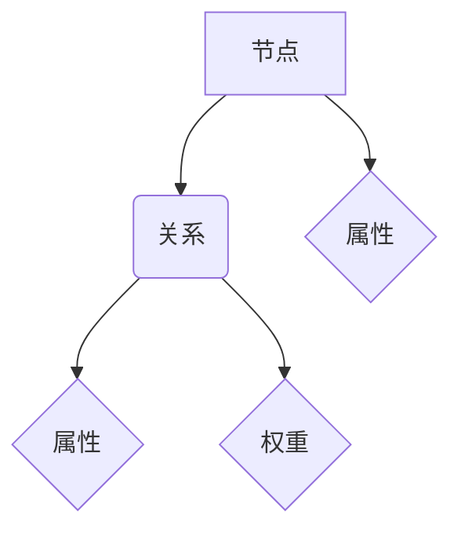

                 

关键词：Neo4j，图数据库，Cypher查询语言，图算法，数据模型，性能优化

摘要：本文将深入探讨Neo4j图数据库的基本原理、Cypher查询语言的详细讲解，并通过具体代码实例展示如何在实际项目中运用Neo4j进行数据建模和查询。文章还将涉及Neo4j的性能优化策略，以及其在各个领域的应用场景和未来发展趋势。

## 1. 背景介绍

### Neo4j的历史与发展

Neo4j作为一家全球领先的图数据库提供商，其起源于2007年，由德国的Neo Technology公司创立。它以图论（Graph Theory）为基础，提供了一种强大的数据存储和处理方式，能够处理复杂的关系网络。Neo4j的核心理念是将数据存储在节点（Node）和关系（Relationship）上，这使得它在处理社交网络、推荐系统、图挖掘等领域有着卓越的性能。

### 图数据库与关系数据库的区别

图数据库与传统的的关系数据库有着本质的区别。关系数据库主要基于表格模型，通过SQL进行数据查询，适用于处理结构化数据。而图数据库则以图模型为核心，通过图算法进行数据操作，适合处理复杂的关系网络。

### Neo4j的核心优势

- **高效的图算法支持**：Neo4j内置了丰富的图算法，如深度优先搜索、广度优先搜索、最短路径查找等，为复杂关系的处理提供了强大的支持。
- **易于扩展和分布式**：Neo4j支持水平扩展，可以在分布式系统中运行，提高了系统的可伸缩性。
- **灵活的数据模型**：Neo4j的数据模型允许节点和关系动态变化，使得它在适应不同业务需求方面具有很大的灵活性。

## 2. 核心概念与联系

### 节点（Node）与关系（Relationship）

在Neo4j中，节点（Node）是数据的基本单位，代表实体，如人、物品、地点等。关系（Relationship）是节点之间的连接，表示实体之间的关系，如“朋友”、“购买”等。节点和关系共同构成了Neo4j的图模型。

### 属性（Property）与标签（Label）

属性（Property）是节点和关系的附加信息，可以是任何数据类型，如字符串、整数、日期等。标签（Label）是节点的分类标识，用于表示节点的类型，如“人”、“商品”等。

### Mermaid流程图

下面是一个简单的Mermaid流程图，展示了Neo4j图数据库的基本概念和关系：



## 3. 核心算法原理 & 具体操作步骤

### 3.1 算法原理概述

Neo4j的核心算法基于图论，包括：

- **深度优先搜索（DFS）**：从某个节点开始，沿着路径遍历所有相邻节点，直到达到目标节点或遍历完整张图。
- **广度优先搜索（BFS）**：类似于DFS，但按照层级遍历，先遍历同一层的所有节点，再进入下一层。
- **最短路径查找（Dijkstra）**：寻找从源节点到目标节点的最短路径。
- **社区发现（Community Detection）**：识别图中的紧密社区结构。

### 3.2 算法步骤详解

以最短路径查找算法为例，具体步骤如下：

1. 初始化：设置源节点、目标节点和路径长度。
2. 遍历图：从源节点开始，按照距离递增的顺序访问相邻节点。
3. 记录路径：每访问到一个节点，记录其到达该节点的路径和路径长度。
4. 找到最短路径：当访问到目标节点时，返回该路径。

### 3.3 算法优缺点

- **深度优先搜索（DFS）**：优点是算法简单，易于实现；缺点是可能陷入死循环，不适用于大规模图的查找。
- **广度优先搜索（BFS）**：优点是能够找到最短路径，但时间复杂度高，不适用于大规模图。
- **最短路径查找（Dijkstra）**：优点是适用于大规模图，能够找到最短路径；缺点是时间复杂度高。

### 3.4 算法应用领域

这些图算法在社交网络分析、推荐系统、图挖掘等领域有广泛的应用。例如，在社交网络中，可以使用DFS或BFS来查找好友关系；在推荐系统中，可以使用最短路径查找用户之间的相似度。

## 4. 数学模型和公式 & 详细讲解 & 举例说明

### 4.1 数学模型构建

在图数据库中，常见的数学模型包括：

- **邻接矩阵（Adjacency Matrix）**：表示图中每个节点与其他节点的连接关系。
- **邻接表（Adjacency List）**：将每个节点的邻接节点以列表形式存储，适用于稀疏图。

### 4.2 公式推导过程

以邻接矩阵为例，其构建公式为：

$$
A[i][j] =
\begin{cases}
1, & \text{如果 } i \text{ 和 } j \text{ 有直接连接；} \\
0, & \text{否则。}
\end{cases}
$$

### 4.3 案例分析与讲解

假设有一个包含5个节点的图，节点之间的连接关系如下：

```
1 --- 2
|     |
3 --- 4
|
5
```

其邻接矩阵为：

$$
\begin{bmatrix}
0 & 1 & 0 & 0 & 0 \\
1 & 0 & 1 & 1 & 0 \\
0 & 1 & 0 & 1 & 0 \\
0 & 1 & 0 & 0 & 1 \\
0 & 0 & 0 & 0 & 0
\end{bmatrix}
$$

## 5. 项目实践：代码实例和详细解释说明

### 5.1 开发环境搭建

在开始实践之前，需要搭建Neo4j的开发环境。以下是搭建步骤：

1. 下载并安装Neo4j Community Edition。
2. 运行Neo4j并打开Neo4j Browser。
3. 创建一个新数据库。

### 5.2 源代码详细实现

以下是一个简单的Neo4j数据模型和Cypher查询实例：

1. **数据模型**：

```cypher
CREATE (:Person {name: 'Alice', age: 30}),
       (:Person {name: 'Bob', age: 25}),
       (:Person {name: 'Charlie', age: 35}),
       (:FRIEND {name: 'works_at'}),
       (a1:Person {name: 'Alice})-[:FRIEND]->(b1:Person {name: 'Bob'}),
       (a1)-[:FRIEND]->(c1:Person {name: 'Charlie'}),
       (b1)-[:FRIEND]->(c1);
```

2. **Cypher查询**：

```cypher
MATCH (a:Person)-[:FRIEND]->(b:Person)
RETURN a.name AS from, b.name AS to;
```

### 5.3 代码解读与分析

- **数据模型**：创建了三个Person节点和一种 FRIEND 关系，表示三个人之间的朋友关系。
- **Cypher查询**：使用MATCH语句找到所有朋友关系的连接，并返回两个人名。

### 5.4 运行结果展示

执行上述Cypher查询，结果如下：

```
+-----+-----+
| from | to  |
+-----+-----+
| Alice | Bob |
| Alice | Charlie |
| Bob | Charlie |
+-----+-----+
```

## 6. 实际应用场景

### 6.1 社交网络分析

在社交网络中，Neo4j可以用于分析好友关系、社交圈子等。例如，可以通过Cypher查询找出两个用户之间的最近共同好友。

### 6.2 推荐系统

在推荐系统中，Neo4j可以用于处理用户之间的相似度，从而提高推荐的准确性。例如，可以使用最短路径查找算法找出与某个用户最相似的其他用户。

### 6.3 图挖掘

图挖掘是Neo4j的另一个重要应用领域。通过图算法，可以从大规模图中提取有用的信息和知识，例如发现隐藏的社区结构、预测未来的趋势等。

## 7. 工具和资源推荐

### 7.1 学习资源推荐

- **Neo4j官方文档**：Neo4j的官方文档提供了详细的教程、API参考和最佳实践。
- **《Graph Database Management System》**：一本关于图数据库管理的权威书籍，涵盖了Neo4j等图数据库的详细内容。

### 7.2 开发工具推荐

- **Neo4j Browser**：Neo4j自带的图形化界面，用于执行Cypher查询和可视化结果。
- **Cypher Shell**：一个命令行工具，用于执行Cypher查询。

### 7.3 相关论文推荐

- **"Property Graph Model for Scalable Data Management"**：详细介绍了Neo4j的图模型。
- **"A Survey of Graph Database Systems"**：综述了各种图数据库系统的特点和应用。

## 8. 总结：未来发展趋势与挑战

### 8.1 研究成果总结

Neo4j作为领先的图数据库，在处理复杂关系网络方面展现了强大的性能。其基于图论的数据模型和丰富的图算法，为各种应用领域提供了有力的支持。

### 8.2 未来发展趋势

随着大数据和人工智能的快速发展，图数据库将在更多领域得到应用。Neo4j将继续优化其性能和功能，以适应不断变化的需求。

### 8.3 面临的挑战

尽管Neo4j有着强大的性能，但其在处理大规模图时仍面临性能瓶颈和可扩展性问题。未来需要解决这些问题，以提高其在大规模应用中的适应性。

### 8.4 研究展望

未来研究可以集中在以下几个方面：

- **性能优化**：研究更高效的图算法和数据结构，以提高处理大规模图的能力。
- **功能扩展**：增加更多的图算法和数据分析工具，满足不同领域的需求。
- **开源生态**：加强与开源社区的互动，促进图数据库技术的普及和发展。

## 9. 附录：常见问题与解答

### 9.1 Neo4j与其他图数据库的区别

Neo4j与其他图数据库如OrientDB、ArangoDB等相比，具有以下特点：

- **性能**：Neo4j在处理复杂关系网络时具有更高的性能。
- **易用性**：Neo4j提供了丰富的图形界面和API，易于使用。
- **生态系统**：Neo4j拥有强大的开源社区和丰富的工具集。

### 9.2 Neo4j的扩展性如何？

Neo4j支持水平扩展，可以通过增加节点和关系来扩展存储容量。此外，Neo4j Enterprise Edition提供了分布式存储和计算能力，适用于大规模应用。

### 9.3 Neo4j如何处理并发操作？

Neo4j通过锁机制和事务管理来处理并发操作，保证数据的一致性和完整性。Neo4j还支持读写分离，以提高系统性能。

## 作者署名

作者：禅与计算机程序设计艺术 / Zen and the Art of Computer Programming
----------------------------------------------------------------

以上就是本文的完整内容。本文详细介绍了Neo4j图数据库的基本原理、Cypher查询语言的使用方法，并通过代码实例展示了其在实际项目中的应用。同时，本文还探讨了Neo4j的性能优化策略、实际应用场景、未来发展趋势以及面临的挑战。希望本文能为读者在学习和使用Neo4j过程中提供有益的参考。

