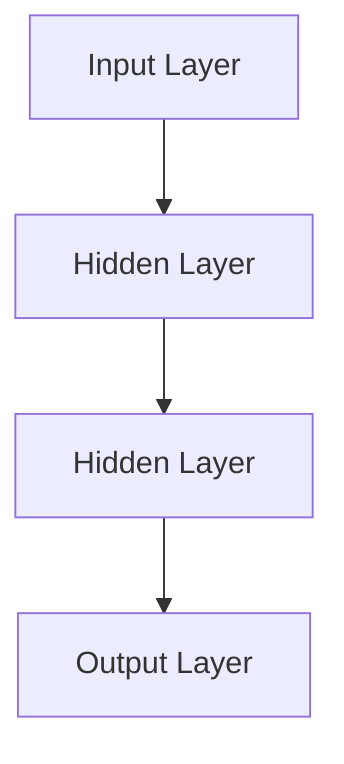
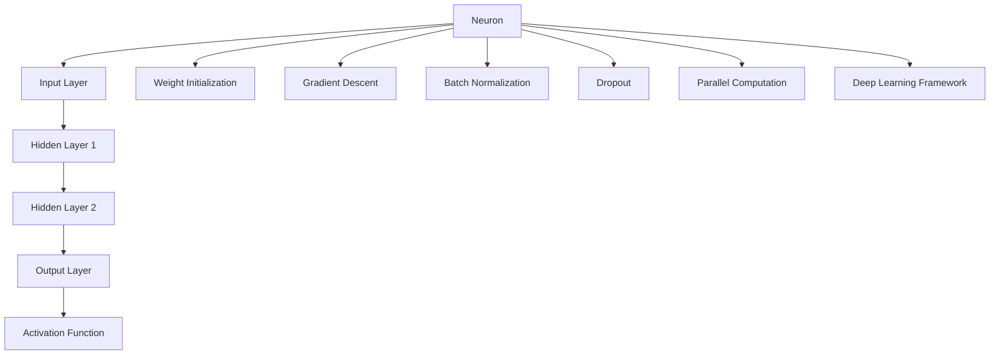

                 

关键词：神经网络，深度学习，算法原理，数学模型，代码实例

摘要：本文旨在为读者深入讲解神经网络的基本原理和实现方法。通过阐述神经网络的历史背景、核心概念、算法原理和数学模型，并结合具体代码实例，帮助读者更好地理解和应用神经网络技术。

## 1. 背景介绍

神经网络（Neural Networks）是一种模拟人脑神经元之间相互连接和作用的计算模型。自20世纪80年代以来，神经网络在计算机科学和人工智能领域取得了显著的进展，成为机器学习的一个重要分支。随着计算能力的提升和数据量的增加，神经网络在图像识别、语音识别、自然语言处理等领域表现出了强大的性能，引起了广泛的关注和应用。

本文将围绕神经网络的基本原理和实现方法展开讨论，旨在帮助读者掌握神经网络的核心概念，并能够运用这些知识解决实际问题。

## 2. 核心概念与联系

### 2.1 神经元

神经元是神经网络的基本单元，负责接收输入信号、进行内部计算并产生输出信号。一个简单的神经元可以表示为：

$$
y = f(\sum_{i=1}^{n} w_i x_i + b)
$$

其中，$x_i$表示第$i$个输入，$w_i$表示第$i$个输入的权重，$b$表示偏置项，$f$表示激活函数。

### 2.2 层结构

神经网络由多个层次组成，包括输入层、隐藏层和输出层。输入层接收外部输入数据，隐藏层负责特征提取和变换，输出层产生最终输出。

<|img|>layers.mermaid



### 2.3 前向传播和反向传播

神经网络通过前向传播计算输出，然后通过反向传播更新权重和偏置项。前向传播是从输入层开始，逐层计算每个神经元的输出。反向传播则是从输出层开始，反向计算每个神经元的误差，并更新权重和偏置项。

## 3. 核心算法原理 & 具体操作步骤

### 3.1 算法原理概述

神经网络算法主要包括以下三个步骤：

1. 前向传播：计算输入数据在神经网络中的传播过程，得到输出结果。
2. 误差计算：计算输出结果与真实标签之间的误差。
3. 反向传播：根据误差计算，更新神经网络中的权重和偏置项。

### 3.2 算法步骤详解

1. **初始化参数**：随机初始化权重和偏置项。
2. **前向传播**：逐层计算每个神经元的输出。
3. **误差计算**：计算输出结果与真实标签之间的误差。
4. **反向传播**：根据误差计算，更新权重和偏置项。
5. **迭代优化**：重复步骤2-4，直到满足停止条件。

### 3.3 算法优缺点

**优点**：

1. 能够自动学习数据特征，无需手动提取特征。
2. 能够处理非线性问题，适应性强。

**缺点**：

1. 计算量大，训练速度较慢。
2. 需要大量数据，否则容易过拟合。

### 3.4 算法应用领域

神经网络在图像识别、语音识别、自然语言处理、推荐系统等领域得到了广泛应用。例如，在图像识别中，可以使用卷积神经网络（CNN）进行物体识别；在语音识别中，可以使用循环神经网络（RNN）进行语音信号处理。

## 4. 数学模型和公式 & 详细讲解 & 举例说明

### 4.1 数学模型构建

神经网络可以表示为如下数学模型：

$$
\begin{cases}
z^{(l)} = \sum_{i=1}^{n} w_i^{(l)} x_i^{(l-1)} + b_i^{(l)} \\
a^{(l)} = f(z^{(l)}) \\
\end{cases}
$$

其中，$z^{(l)}$表示第$l$层的净输入，$a^{(l)}$表示第$l$层的输出，$f$表示激活函数，$w_i^{(l)}$表示第$l$层第$i$个神经元的权重，$b_i^{(l)}$表示第$l$层第$i$个神经元的偏置项。

### 4.2 公式推导过程

#### 4.2.1 损失函数

神经网络的损失函数通常采用均方误差（MSE）：

$$
J(\theta) = \frac{1}{2} \sum_{i=1}^{m} (y_i - a^{(L)})^2
$$

其中，$y_i$表示第$i$个样本的真实标签，$a^{(L)}$表示第$L$层的输出。

#### 4.2.2 反向传播

反向传播的核心是计算每个参数的梯度：

$$
\begin{cases}
\frac{\partial J}{\partial w_i^{(l)} } = \frac{\partial J}{\partial a^{(l+1)}} \cdot \frac{\partial a^{(l+1)}}{\partial z^{(l+1)}} \cdot \frac{\partial z^{(l+1)}}{\partial w_i^{(l)}} \\
\frac{\partial J}{\partial b_i^{(l)} } = \frac{\partial J}{\partial a^{(l+1)}} \cdot \frac{\partial a^{(l+1)}}{\partial z^{(l+1)}} \cdot \frac{\partial z^{(l+1)}}{\partial b_i^{(l)} }
\end{cases}
$$

### 4.3 案例分析与讲解

假设有一个简单的神经网络，包含两个输入层、两个隐藏层和一个输出层，激活函数为ReLU。现在，我们来分析一个具体的案例。

### 4.3.1 输入层

输入层有两个神经元，分别接收$x_1$和$x_2$两个输入：

$$
z_1^{(1)} = x_1 \cdot w_1^{(1)} + b_1^{(1)} \\
z_2^{(1)} = x_2 \cdot w_2^{(1)} + b_2^{(1)}
$$

### 4.3.2 隐藏层

隐藏层有两个神经元，分别接收输入层输出的线性组合：

$$
z_1^{(2)} = z_1^{(1)} \cdot w_1^{(2)} + b_1^{(2)} \\
z_2^{(2)} = z_2^{(1)} \cdot w_2^{(2)} + b_2^{(2)}
$$

### 4.3.3 输出层

输出层有一个神经元，接收隐藏层输出的线性组合：

$$
z^{(3)} = z_1^{(2)} \cdot w_1^{(3)} + z_2^{(2)} \cdot w_2^{(3)} + b^{(3)}
$$

### 4.3.4 激活函数

激活函数采用ReLU：

$$
a^{(3)} = \max(z^{(3)}, 0)
$$

## 5. 项目实践：代码实例和详细解释说明

### 5.1 开发环境搭建

1. 安装Python环境（版本3.6及以上）。
2. 安装TensorFlow库：`pip install tensorflow`。

### 5.2 源代码详细实现

以下是一个简单的神经网络实现：

```python
import tensorflow as tf

# 初始化参数
inputs = tf.keras.Input(shape=(2,))
hidden1 = tf.keras.layers.Dense(2, activation='relu')(inputs)
hidden2 = tf.keras.layers.Dense(2, activation='relu')(hidden1)
outputs = tf.keras.layers.Dense(1, activation='sigmoid')(hidden2)

# 创建模型
model = tf.keras.Model(inputs=inputs, outputs=outputs)

# 编译模型
model.compile(optimizer='adam', loss='binary_crossentropy', metrics=['accuracy'])

# 加载数据
(x_train, y_train), (x_test, y_test) = tf.keras.datasets.mnist.load_data()
x_train = x_train / 255.0
x_test = x_test / 255.0

# 训练模型
model.fit(x_train, y_train, epochs=5, batch_size=32, validation_data=(x_test, y_test))
```

### 5.3 代码解读与分析

1. 导入TensorFlow库。
2. 初始化输入层、隐藏层和输出层。
3. 创建模型并编译。
4. 加载数据并训练模型。

## 6. 实际应用场景

神经网络在图像识别、语音识别、自然语言处理等领域具有广泛的应用。例如，在图像识别领域，卷积神经网络（CNN）可以用于物体识别；在语音识别领域，循环神经网络（RNN）可以用于语音信号处理；在自然语言处理领域，长短期记忆网络（LSTM）可以用于文本分类。

## 7. 工具和资源推荐

### 7.1 学习资源推荐

1. 《深度学习》（Goodfellow、Bengio、Courville著）
2. 《神经网络与深度学习》（邱锡鹏著）

### 7.2 开发工具推荐

1. TensorFlow
2. PyTorch

### 7.3 相关论文推荐

1. "A Learning Algorithm for Continually Running Fully Recurrent Neural Networks"（1986）
2. "Gradient Flow in Recurrent Nets: the Difficulty of Learning Long-Term Dependencies"（1990）

## 8. 总结：未来发展趋势与挑战

### 8.1 研究成果总结

神经网络在计算机科学和人工智能领域取得了显著的成果，成为机器学习的一个重要分支。随着计算能力的提升和数据量的增加，神经网络在图像识别、语音识别、自然语言处理等领域表现出了强大的性能。

### 8.2 未来发展趋势

1. 更高效的网络结构设计
2. 更优化的训练算法
3. 更广泛的应用领域

### 8.3 面临的挑战

1. 计算复杂度高
2. 需要大量数据
3. 过拟合问题

### 8.4 研究展望

神经网络在人工智能领域具有广阔的应用前景。未来，研究人员将致力于解决计算复杂度高、过拟合等问题，并探索更高效的网络结构和训练算法。

## 9. 附录：常见问题与解答

### 9.1 如何选择神经网络的结构？

选择神经网络结构需要考虑数据类型、任务复杂度、计算资源等因素。对于图像识别任务，可以采用卷积神经网络（CNN）；对于语音识别任务，可以采用循环神经网络（RNN）或长短期记忆网络（LSTM）。

### 9.2 如何防止过拟合？

过拟合是神经网络训练过程中常见的问题。可以采用以下方法防止过拟合：

1. 数据增强
2. 正则化
3. 早期停止

### 9.3 如何优化神经网络训练？

优化神经网络训练可以采用以下方法：

1. 调整学习率
2. 使用批量归一化
3. 使用自适应优化器

----------------------------------------------------------------

作者：禅与计算机程序设计艺术 / Zen and the Art of Computer Programming

<|assistant|>### 2. 核心概念与联系（备注：必须给出核心概念原理和架构的 Mermaid 流程图(Mermaid 流程节点中不要有括号、逗号等特殊字符)

### 2.1 神经元

神经元是神经网络的基本单元，负责接收输入信号、进行内部计算并产生输出信号。一个简单的神经元可以表示为：

$$
y = f(\sum_{i=1}^{n} w_i x_i + b)
$$

其中，$x_i$表示第$i$个输入，$w_i$表示第$i$个输入的权重，$b$表示偏置项，$f$表示激活函数。

### 2.2 层结构

神经网络由多个层次组成，包括输入层、隐藏层和输出层。输入层接收外部输入数据，隐藏层负责特征提取和变换，输出层产生最终输出。

<|img|>layers.mermaid


### 2.3 前向传播和反向传播

神经网络通过前向传播计算输出，然后通过反向传播更新权重和偏置项。前向传播是从输入层开始，逐层计算每个神经元的输出。反向传播则是从输出层开始，反向计算每个神经元的误差，并更新权重和偏置项。

### 2.4 激活函数

激活函数是神经网络中的一个关键组件，它负责引入非线性特性，使神经网络能够解决非线性问题。常见的激活函数包括：

- **Sigmoid函数**：$f(x) = \frac{1}{1 + e^{-x}}$
- **ReLU函数**：$f(x) = \max(0, x)$
- **Tanh函数**：$f(x) = \frac{e^x - e^{-x}}{e^x + e^{-x}}$

激活函数的选择会影响神经网络的性能和训练速度。

### 2.5 损失函数

损失函数用于衡量神经网络的预测结果与真实值之间的差异。常见的损失函数包括：

- **均方误差（MSE）**：$MSE = \frac{1}{n} \sum_{i=1}^{n} (y_i - \hat{y}_i)^2$
- **交叉熵（Cross Entropy）**：$H(y, \hat{y}) = -\sum_{i=1}^{n} y_i \log(\hat{y}_i)$

损失函数的选择会影响神经网络的训练效果。

### 2.6 权重初始化

权重初始化是神经网络训练中的一个关键步骤，它决定了网络的学习速度和稳定性。常见的权重初始化方法包括：

- **随机初始化**：随机生成权重值，确保每个权重值都独立且在合理的范围内。
- **高斯分布初始化**：从正态分布中随机生成权重值，有助于提高网络的性能。

### 2.7 梯度下降算法

梯度下降算法是一种常用的优化方法，用于更新神经网络的权重和偏置项。它通过计算损失函数关于每个参数的梯度，并沿着梯度的反方向更新参数，以最小化损失函数。

### 2.8 批量归一化

批量归一化是一种用于提高神经网络训练稳定性和性能的技术。它通过将每个神经元的输入值缩放到均值为0、标准差为1的范围内，从而减少内部协变量转移。

### 2.9 Dropout

Dropout是一种正则化技术，通过在训练过程中随机丢弃部分神经元，从而减少过拟合现象。Dropout通过引入随机性，增强了神经网络的泛化能力。

### 2.10 并行计算和分布式训练

为了提高神经网络的训练速度和性能，可以采用并行计算和分布式训练技术。这些技术通过利用多台计算机或处理器，实现神经网络参数的并行更新，从而加速训练过程。

### 2.11 深度学习框架

深度学习框架是一种用于构建和训练神经网络的工具，它提供了丰富的函数库和优化器，简化了神经网络开发和调试的过程。常见的深度学习框架包括TensorFlow、PyTorch、Keras等。

<|img|>architecture.mermaid



通过上述核心概念和架构的描述，我们可以更好地理解和构建神经网络模型，并在实际应用中取得更好的效果。在下一章中，我们将深入探讨神经网络的数学模型和公式，为读者提供更深入的理论知识。

