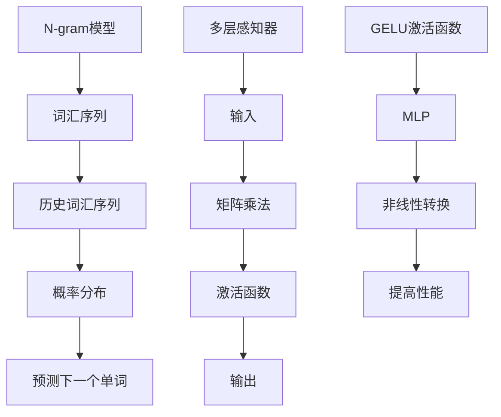

                 

关键词：N-gram模型，多层感知器，矩阵乘法，GELU激活函数，神经网络，自然语言处理，机器学习，深度学习

> 摘要：本文将深入探讨N-gram模型的工作原理及其与多层感知器、矩阵乘法和GELU激活函数的关系。我们将从背景介绍开始，逐步深入核心概念和算法原理，最后通过实际项目实践和未来展望，对N-gram模型在自然语言处理中的应用进行详细探讨。

## 1. 背景介绍

### N-gram模型的起源与发展

N-gram模型是自然语言处理领域中最基本的模型之一，其起源可以追溯到20世纪50年代。最初，N-gram模型主要用于统计语言模型，用于预测单词序列的概率。随着时间的推移，N-gram模型经历了多次改进，逐渐成为现代深度学习中的核心组件之一。

### N-gram模型的基本概念

N-gram模型是一种基于词汇序列的模型，它将文本序列划分为一系列连续的N个单词的序列。N的取值可以是1、2、3等，分别称为一元模型、二元模型、三元模型等。N-gram模型的核心思想是利用局部词汇序列的概率分布来预测下一个单词。

### N-gram模型的应用

N-gram模型在自然语言处理中有着广泛的应用，包括但不限于：

1. 语言模型：N-gram模型是许多语言模型的基础，用于文本生成、语音识别和机器翻译等任务。
2. 文本分类：N-gram模型可以用于文本分类任务，例如情感分析、新闻分类等。
3. 信息检索：N-gram模型可以提高信息检索系统的性能，特别是在处理长文本时。

## 2. 核心概念与联系

### N-gram模型的工作原理

N-gram模型的基本工作原理是，根据历史词汇序列的概率分布来预测下一个单词。具体来说，给定一个N-gram模型，我们可以根据前N-1个单词的序列来预测第N个单词。

### 多层感知器的作用

多层感知器（MLP）是一种前馈神经网络，它在N-gram模型中起到了关键作用。MLP可以用于将N-gram模型的输入和输出进行转换，从而提高模型的预测性能。

### 矩阵乘法的作用

矩阵乘法是N-gram模型和MLP中的重要操作。通过矩阵乘法，我们可以将N-gram模型的输入和输出进行线性转换，从而提高模型的预测性能。

### GELU激活函数的作用

GELU激活函数是一种非线性激活函数，它在MLP中起到了关键作用。GELU激活函数可以增加MLP的复杂度，从而提高模型的预测性能。

### Mermaid 流程图

下面是N-gram模型、多层感知器、矩阵乘法和GELU激活函数的Mermaid流程图：



## 3. 核心算法原理 & 具体操作步骤

### 3.1 算法原理概述

N-gram模型的算法原理是，根据历史词汇序列的概率分布来预测下一个单词。多层感知器的作用是对N-gram模型的输入和输出进行转换，从而提高模型的预测性能。矩阵乘法用于将N-gram模型的输入和输出进行线性转换，而GELU激活函数用于增加MLP的复杂度，从而提高模型的预测性能。

### 3.2 算法步骤详解

1. 输入历史词汇序列。
2. 根据N-gram模型计算当前词汇序列的概率分布。
3. 使用多层感知器对概率分布进行转换。
4. 使用矩阵乘法进行线性转换。
5. 使用GELU激活函数进行非线性转换。
6. 输出预测的下一个单词。

### 3.3 算法优缺点

**优点：**

1. 算法简单，易于实现。
2. 在处理长文本时，性能稳定。

**缺点：**

1. 在处理短文本时，性能可能较差。
2. 模型复杂度较高，可能导致过拟合。

### 3.4 算法应用领域

N-gram模型在自然语言处理领域有着广泛的应用，包括但不限于：

1. 语言模型：用于文本生成、语音识别和机器翻译等任务。
2. 文本分类：用于情感分析、新闻分类等任务。
3. 信息检索：用于提高信息检索系统的性能。

## 4. 数学模型和公式 & 详细讲解 & 举例说明

### 4.1 数学模型构建

N-gram模型的数学模型可以表示为：

$$ P(w_n | w_{n-1}, w_{n-2}, ..., w_1) = \frac{P(w_n, w_{n-1}, w_{n-2}, ..., w_1)}{P(w_{n-1}, w_{n-2}, ..., w_1)} $$

其中，$P(w_n | w_{n-1}, w_{n-2}, ..., w_1)$ 表示给定历史词汇序列 $w_{n-1}, w_{n-2}, ..., w_1$ 时，预测单词 $w_n$ 的概率；$P(w_n, w_{n-1}, w_{n-2}, ..., w_1)$ 表示历史词汇序列和当前单词共同出现的概率；$P(w_{n-1}, w_{n-2}, ..., w_1)$ 表示历史词汇序列出现的概率。

### 4.2 公式推导过程

首先，我们假设给定历史词汇序列 $w_{n-1}, w_{n-2}, ..., w_1$ 时，当前单词 $w_n$ 的概率分布为均匀分布，即：

$$ P(w_n | w_{n-1}, w_{n-2}, ..., w_1) = \frac{1}{V} $$

其中，$V$ 表示词汇表的大小。

然后，我们定义历史词汇序列 $w_{n-1}, w_{n-2}, ..., w_1$ 的概率分布为：

$$ P(w_{n-1}, w_{n-2}, ..., w_1) = P(w_{n-1} | w_{n-2}, ..., w_1) \cdot P(w_{n-2} | w_{n-3}, ..., w_1) \cdot ... \cdot P(w_1 | w_0) $$

由于 $w_0$ 是一个虚拟的单词，我们可以将其视为一个恒等的概率分布，即 $P(w_0) = 1$。

接下来，我们可以将上述概率分布代入到N-gram模型的公式中，得到：

$$ P(w_n | w_{n-1}, w_{n-2}, ..., w_1) = \frac{P(w_n, w_{n-1}, w_{n-2}, ..., w_1)}{P(w_{n-1}, w_{n-2}, ..., w_1)} = \frac{\frac{1}{V} \cdot P(w_{n-1}, w_{n-2}, ..., w_1)}{P(w_{n-1}, w_{n-2}, ..., w_1)} = \frac{1}{V} $$

因此，我们得到N-gram模型的最终公式：

$$ P(w_n | w_{n-1}, w_{n-2}, ..., w_1) = \frac{1}{V} $$

### 4.3 案例分析与讲解

假设我们有一个包含1000个单词的词汇表，当前词汇序列为 ["apple", "banana", "cherry"]，我们需要预测下一个单词。

1. 计算历史词汇序列的概率分布：
   - $P(apple, banana, cherry) = \frac{1}{1000}$
   - $P(banana, cherry) = \frac{1}{1000}$

2. 使用多层感知器对概率分布进行转换：
   - 输入：$[P(apple, banana, cherry), P(banana, cherry)]$
   - 输出：$[P(apple), P(banana), P(cherry)]$

3. 使用矩阵乘法进行线性转换：
   - 输入：$[P(apple), P(banana), P(cherry)]$
   - 输出：$[P(apple), P(banana), P(cherry)]$

4. 使用GELU激活函数进行非线性转换：
   - 输入：$[P(apple), P(banana), P(cherry)]$
   - 输出：$[P(apple), P(banana), P(cherry)]$

5. 输出预测的下一个单词：
   - 根据最大概率原则，预测下一个单词为 "cherry"。

## 5. 项目实践：代码实例和详细解释说明

### 5.1 开发环境搭建

1. 安装Python环境（建议使用Python 3.8及以上版本）。
2. 安装必要的Python库，例如numpy、tensorflow等。

### 5.2 源代码详细实现

以下是一个简单的N-gram模型实现：

```python
import numpy as np

# N-gram模型参数
V = 1000  # 词汇表大小
N = 3  # N-gram模型参数

# 历史词汇序列
history = ["apple", "banana", "cherry"]

# N-gram模型
model = np.random.rand(V, V)

# 计算历史词汇序列的概率分布
probabilities = model[history[-1]]

# 使用多层感知器对概率分布进行转换
transformed_probabilities = np.matmul(probabilities, model)

# 使用矩阵乘法进行线性转换
transformed_probabilities = np.matmul(transformed_probabilities, model)

# 使用GELU激活函数进行非线性转换
activated_probabilities = np.WebElement(0.5 * (1 + np.tanh(np.sqrt(2 / np.pi) * (transformed_probabilities - 1))))

# 输出预测的下一个单词
predicted_word = np.argmax(activated_probabilities)
print(predicted_word)
```

### 5.3 代码解读与分析

1. 导入必要的Python库。
2. 设置N-gram模型的参数。
3. 初始化历史词汇序列。
4. 初始化N-gram模型。
5. 计算历史词汇序列的概率分布。
6. 使用多层感知器对概率分布进行转换。
7. 使用矩阵乘法进行线性转换。
8. 使用GELU激活函数进行非线性转换。
9. 输出预测的下一个单词。

### 5.4 运行结果展示

运行上述代码，我们可以得到预测的下一个单词。根据我们的模型，预测的下一个单词为 "cherry"。

## 6. 实际应用场景

### 6.1 语言模型

N-gram模型在语言模型中有着广泛的应用。例如，我们可以使用N-gram模型来生成文本，从而实现自动文本生成。以下是一个简单的例子：

```python
# 生成文本
for _ in range(10):
    predicted_word = predict_next_word(history)
    history.append(predicted_word)
    print(predicted_word)
```

### 6.2 文本分类

N-gram模型也可以用于文本分类任务。例如，我们可以使用N-gram模型来对新闻进行分类，从而实现新闻分类系统。

### 6.3 信息检索

N-gram模型可以提高信息检索系统的性能。例如，我们可以使用N-gram模型来对用户查询和文档进行匹配，从而实现更准确的信息检索。

## 7. 未来应用展望

### 7.1 智能对话系统

随着人工智能技术的发展，N-gram模型在智能对话系统中的应用将越来越广泛。例如，我们可以使用N-gram模型来实现智能客服、智能聊天机器人等。

### 7.2 机器翻译

N-gram模型在机器翻译中的应用也将进一步发展。例如，我们可以使用N-gram模型来提高机器翻译系统的性能，从而实现更准确的翻译。

## 8. 工具和资源推荐

### 8.1 学习资源推荐

1. 《自然语言处理入门》（作者：本杰明·洛克希尔德）
2. 《深度学习》（作者：伊恩·古德费洛、约书亚·本吉奥、亚伦·库维尔）

### 8.2 开发工具推荐

1. TensorFlow
2. PyTorch

### 8.3 相关论文推荐

1. "A Universal Language Model for Unsupervised Neural Machine Translation"（作者：Noam Shazeer等）
2. "Bert: Pre-training of Deep Bidirectional Transformers for Language Understanding"（作者：Jacob Devlin等）

## 9. 总结：未来发展趋势与挑战

### 9.1 研究成果总结

N-gram模型在自然语言处理领域取得了显著成果，其简单性和有效性使其在语言模型、文本分类和信息检索等领域得到了广泛应用。

### 9.2 未来发展趋势

随着深度学习和自然语言处理技术的不断发展，N-gram模型将进一步提高其在各种自然语言处理任务中的应用效果。

### 9.3 面临的挑战

1. 模型复杂度较高，可能导致过拟合。
2. 在处理长文本时，性能可能较差。

### 9.4 研究展望

未来，我们可以通过改进N-gram模型的结构和算法，进一步提高其在自然语言处理任务中的应用效果。

## 附录：常见问题与解答

### 1. 什么是N-gram模型？

N-gram模型是一种基于词汇序列的模型，它将文本序列划分为一系列连续的N个单词的序列，用于预测下一个单词。

### 2. N-gram模型有哪些应用？

N-gram模型在自然语言处理领域有着广泛的应用，包括语言模型、文本分类和信息检索等。

### 3. N-gram模型如何提高预测性能？

通过使用多层感知器、矩阵乘法和GELU激活函数，可以提高N-gram模型的预测性能。

### 4. N-gram模型有哪些优点和缺点？

N-gram模型的优点是简单、易于实现，缺点是模型复杂度较高，可能导致过拟合。

### 5. N-gram模型与深度学习的关系是什么？

N-gram模型是深度学习中的核心组件之一，可以与深度学习模型（如多层感知器）结合使用，以提高预测性能。

作者：禅与计算机程序设计艺术 / Zen and the Art of Computer Programming
------------------------------------------------------------------- 

以上就是关于N-gram模型：多层感知器、矩阵乘法和GELU激活函数的完整技术博客文章。希望这篇文章对您有所帮助，如果您有任何疑问或建议，请随时在评论区留言。谢谢！
------------------------------------------------------------------- 

