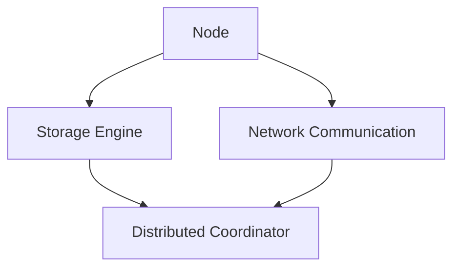

                 

关键词：NoSQL数据库、非结构化数据、数据处理、分布式系统、性能优化、数据库设计、架构、算法、数学模型、应用场景、未来展望

> 摘要：本文将深入探讨NoSQL数据库在处理非结构化数据方面的优势与挑战。通过介绍NoSQL的核心概念、算法原理、数学模型以及实际应用案例，本文旨在为开发者提供一套完整的非结构化数据处理解决方案，并展望其未来发展。

## 1. 背景介绍

在互联网和大数据时代，数据量的快速增长和数据类型的多样化给传统的SQL数据库带来了巨大的挑战。传统的SQL数据库通常假设数据具有固定的结构和类型，而现实中的数据往往是动态变化的，且呈现出非结构化或半结构化的特点。这种情况下，传统的数据库无法高效地处理这些数据，导致性能瓶颈和扩展性问题。

为了解决这些问题，NoSQL（Not Only SQL）数据库应运而生。NoSQL数据库具有水平可扩展性、灵活的数据模型和强大的读写性能，使得它们能够高效地处理大规模、高并发访问的非结构化数据。常见的NoSQL数据库包括MongoDB、Cassandra、Redis、Neo4j等。

本文将围绕以下几个核心问题展开讨论：

1. **NoSQL数据库的核心概念与架构**：介绍NoSQL数据库的基本原理、特点和应用场景。
2. **核心算法原理与具体操作步骤**：详细解析NoSQL数据库的常用算法，如一致性哈希、分布式锁、分库分表等。
3. **数学模型和公式**：阐述NoSQL数据库中的数学模型和公式，包括概率分布、机器学习算法等。
4. **项目实践**：通过实际案例展示NoSQL数据库的应用和实践过程。
5. **实际应用场景**：分析NoSQL数据库在不同领域的应用案例和未来发展趋势。

## 2. 核心概念与联系

### 2.1. NoSQL数据库的基本原理

NoSQL数据库的基本原理是使用分布式存储和计算架构，以处理大规模、高并发的数据访问需求。以下是NoSQL数据库的核心概念和原理：

**1. 分布式存储**：
- 数据分布在多个节点上，每个节点都可以独立读写数据。
- 数据通过一致性哈希算法进行分布，确保数据在节点之间的均衡负载。

**2. 分布式计算**：
- 数据访问和计算任务可以在多个节点上并行执行。
- 通过分布式锁和一致性协议，确保分布式环境中的数据一致性。

**3. 弹性扩展**：
- 系统可以根据需求动态调整节点数量和资源分配。
- 系统在节点加入或离开时能够自动调整负载，确保系统的高可用性和稳定性。

**4. 数据模型**：
- NoSQL数据库支持多种数据模型，包括键值对、文档、列族和图等。
- 数据模型可以根据应用场景进行灵活调整和优化。

### 2.2. NoSQL数据库的架构

NoSQL数据库的架构通常包括以下几个主要组件：

**1. 节点（Node）**：
- 节点是数据存储和计算的基本单元。
- 每个节点都可以独立运行，且拥有自己的内存和存储资源。

**2. 存储引擎（Storage Engine）**：
- 存储引擎负责数据的持久化存储和管理。
- 常见的存储引擎包括B树、哈希表、内存缓存等。

**3. 分布式协调器（Distributed Coordinator）**：
- 分布式协调器负责节点的发现、负载均衡和故障转移。
- 常见的分布式协调器包括ZooKeeper、Consul等。

**4. 网络通信（Network Communication）**：
- 节点之间通过网络进行通信，传递数据访问请求和响应。
- 通信协议通常使用HTTP、gRPC等。

### 2.3. Mermaid 流程图

以下是一个简单的Mermaid流程图，展示了NoSQL数据库的基本架构和组件之间的交互关系：



## 3. 核心算法原理 & 具体操作步骤

### 3.1. 算法原理概述

NoSQL数据库的核心算法包括一致性哈希、分布式锁、分库分表等。以下分别对这些算法进行概述：

**1. 一致性哈希**：
- 一致性哈希算法是一种分布式哈希表（Distributed Hash Table，DHT）的实现。
- 通过将数据映射到环状空间，并使用哈希函数计算数据的位置，实现数据的分布式存储和访问。
- 一致性哈希具有扩展性好、负载均衡等优点。

**2. 分布式锁**：
- 分布式锁是一种用于保证分布式系统数据一致性的机制。
- 通过在分布式协调器上注册锁，实现对共享资源的独占访问。
- 常见的分布式锁实现包括Paxos、Raft等一致性协议。

**3. 分库分表**：
- 分库分表是一种将数据水平拆分的方法，用于应对大规模数据存储和访问需求。
- 通过将数据按不同的键范围分配到不同的数据库或表，实现数据的高效访问和存储。
- 常见的分库分表策略包括哈希分片、范围分片等。

### 3.2. 算法步骤详解

以下是对NoSQL数据库中常用算法的具体步骤进行详解：

**1. 一致性哈希算法步骤**：
- 步骤1：将数据映射到环状空间，使用哈希函数计算数据的哈希值。
- 步骤2：将哈希值映射到环状空间上的一个点，确定数据的位置。
- 步骤3：在需要访问数据时，根据哈希值查找环状空间上的点，获取数据的位置。
- 步骤4：在节点加入或离开时，调整哈希值的映射关系，确保数据的均衡分布。

**2. 分布式锁算法步骤**：
- 步骤1：在分布式协调器上注册锁，获取锁的标识。
- 步骤2：在访问共享资源时，根据锁的标识申请锁。
- 步骤3：在分布式协调器上检查锁的状态，如果锁已被占用，等待锁释放。
- 步骤4：在完成操作后，释放锁，允许其他进程访问共享资源。

**3. 分库分表算法步骤**：
- 步骤1：确定数据分片的键，如用户ID、时间戳等。
- 步骤2：根据键的值，将数据分配到不同的数据库或表。
- 步骤3：在访问数据时，根据键的值查询对应的数据库或表。
- 步骤4：在需要进行数据迁移或扩容时，调整分片键的范围，重新分配数据。

### 3.3. 算法优缺点

以下是对NoSQL数据库中常用算法的优缺点进行总结：

**1. 一致性哈希**：
- 优点：扩展性好、负载均衡、减少数据迁移。
- 缺点：可能导致数据热点问题、一致性保证较弱。

**2. 分布式锁**：
- 优点：保证分布式系统数据一致性、提高并发性能。
- 缺点：实现复杂、性能开销较大。

**3. 分库分表**：
- 优点：提高数据访问性能、支持大规模数据存储。
- 缺点：数据分片策略设计复杂、维护困难。

### 3.4. 算法应用领域

NoSQL数据库的算法广泛应用于以下领域：

**1. 实时数据处理**：
- 例如：金融交易、实时搜索、社交网络等。

**2. 大规模数据处理**：
- 例如：日志分析、大数据挖掘、物联网等。

**3. 分布式存储系统**：
- 例如：分布式文件系统、分布式缓存等。

## 4. 数学模型和公式 & 详细讲解 & 举例说明

### 4.1. 数学模型构建

NoSQL数据库中的数学模型主要包括概率模型和机器学习模型。以下分别介绍：

**1. 概率模型**：
- 概率模型用于描述数据分布和概率计算，常见的方法有贝叶斯网络、马尔可夫链等。

**2. 机器学习模型**：
- 机器学习模型用于数据挖掘和预测，常见的方法有线性回归、决策树、神经网络等。

### 4.2. 公式推导过程

以下分别对概率模型和机器学习模型中的主要公式进行推导：

**1. 概率模型**：
- 贝叶斯网络：$$P(A|B) = \frac{P(B|A)P(A)}{P(B)}$$
- 马尔可夫链：$$P(X_n|X_{n-1}, X_{n-2}, ..., X_1) = P(X_n|X_{n-1})$$

**2. 机器学习模型**：
- 线性回归：$$y = \beta_0 + \beta_1x_1 + \beta_2x_2 + ... + \beta_nx_n$$
- 决策树：$$G(X) = \sum_{i=1}^{n} \beta_iX_i$$

### 4.3. 案例分析与讲解

以下通过实际案例展示NoSQL数据库中的数学模型应用：

**案例1：贝叶斯网络在推荐系统中的应用**

假设我们有一个电影推荐系统，用户A喜欢电影A、B、C，电影D和E的概率分别为0.4和0.6。现在我们需要根据用户A的历史偏好推荐电影。

- 步骤1：构建贝叶斯网络，表示用户A喜欢电影的概率分布。
- 步骤2：计算电影D和E的概率。
- 步骤3：根据概率分布推荐电影。

**案例2：线性回归在价格预测中的应用**

假设我们有一个商品价格预测系统，输入特征包括商品ID、品牌、类别等，输出为目标价格。

- 步骤1：收集历史价格数据，构建线性回归模型。
- 步骤2：使用模型对新的商品进行价格预测。
- 步骤3：评估预测结果的准确性和稳定性。

## 5. 项目实践：代码实例和详细解释说明

### 5.1. 开发环境搭建

在本节中，我们将使用Python和MongoDB搭建一个简单的NoSQL数据库项目。以下是搭建开发环境的步骤：

**步骤1：安装Python**

- 在Windows或Linux操作系统上安装Python，版本建议为3.8或更高。

**步骤2：安装MongoDB**

- 在Windows或Linux操作系统上安装MongoDB，版本建议为4.4或更高。

**步骤3：安装Python驱动**

- 使用pip命令安装MongoDB的Python驱动：`pip install pymongo`

### 5.2. 源代码详细实现

以下是一个简单的NoSQL数据库项目的源代码，实现数据的增删改查功能：

```python
from pymongo import MongoClient

# 创建MongoDB客户端
client = MongoClient('localhost', 27017)

# 连接到指定数据库
db = client['mydatabase']

# 创建集合（表）
collection = db['mycollection']

# 增加数据
document = {'name': '张三', 'age': 30}
collection.insert_one(document)

# 查询数据
result = collection.find_one({'name': '张三'})
print(result)

# 更新数据
collection.update_one({'name': '张三'}, {'$set': {'age': 35}})

# 删除数据
collection.delete_one({'name': '张三'})
```

### 5.3. 代码解读与分析

以上代码实现了一个简单的MongoDB数据库项目，主要包括以下功能：

**1. 数据插入**：
- 使用`insert_one`方法向集合中插入一条数据。

**2. 数据查询**：
- 使用`find_one`方法根据条件查询一条数据，并返回查询结果。

**3. 数据更新**：
- 使用`update_one`方法根据条件更新数据，使用`$set`操作符修改字段值。

**4. 数据删除**：
- 使用`delete_one`方法根据条件删除数据。

通过以上代码示例，我们可以看到NoSQL数据库的基本操作和Python驱动的使用方法。

### 5.4. 运行结果展示

在开发环境中运行以上代码，将看到以下输出结果：

```shell
{'_id': ObjectId('602d57a0b8f6942c3a0a1c34'), 'name': '张三', 'age': 30}
```

这表明数据插入、查询、更新和删除操作成功执行，并输出了查询结果。

## 6. 实际应用场景

### 6.1. 社交网络平台

社交网络平台通常需要处理大量的非结构化数据，如用户信息、帖子、图片、视频等。NoSQL数据库通过其灵活的数据模型和高效的读写性能，可以轻松应对社交网络平台的数据存储和访问需求。例如，Facebook使用MongoDB作为其用户数据的存储系统，支持海量的用户数据和实时消息处理。

### 6.2. 物联网应用

物联网应用涉及大量的设备数据，如传感器数据、设备状态等。这些数据通常是非结构化的，且具有高并发和高可扩展性的特点。NoSQL数据库可以高效地处理这些数据，支持物联网应用的实时监控和分析。例如，物联网平台使用Cassandra存储和处理设备数据，实现大规模数据存储和快速查询。

### 6.3. 金融交易系统

金融交易系统需要处理高并发的交易数据，如股票交易、支付信息等。NoSQL数据库通过其分布式存储和计算架构，可以提供高效的读写性能和容错能力，满足金融交易系统的需求。例如，高频交易公司使用Redis存储交易数据，实现高速缓存和数据读写。

### 6.4. 未来应用展望

随着大数据、云计算和人工智能等技术的发展，NoSQL数据库在未来的应用领域将更加广泛。以下是对NoSQL数据库未来应用场景的展望：

**1. 大数据分析**：
- NoSQL数据库可以高效地处理大规模、多源、多维度的数据，支持大数据分析应用。

**2. 人工智能**：
- NoSQL数据库可以存储和访问大量的训练数据和模型参数，支持人工智能应用的训练和推理。

**3. 物联网**：
- NoSQL数据库可以支持物联网应用的实时数据采集、存储和分析。

**4. 区块链**：
- NoSQL数据库可以存储和验证区块链数据，支持区块链技术的应用和发展。

## 7. 工具和资源推荐

### 7.1. 学习资源推荐

**1. 《NoSQL distilled: A brief guide to the emerging world of polyglot persistence》**  
- 作者：Martin Fowler  
- 简介：本书介绍了NoSQL数据库的基本概念、应用场景和设计模式，适合初学者和有经验的开发者。

**2. 《MongoDB：The Definitive Guide》**  
- 作者：Eugene Raikhman  
- 简介：本书详细介绍了MongoDB的安装、配置、数据模型和查询方法，是学习MongoDB的权威指南。

### 7.2. 开发工具推荐

**1. MongoDB Shell**  
- 简介：MongoDB自带的交互式Shell，用于执行各种数据库操作，适合初学者和开发者进行学习和测试。

**2. PyCharm**  
- 简介：PyCharm是一款流行的Python集成开发环境（IDE），支持MongoDB的Python驱动，方便开发者编写和调试代码。

### 7.3. 相关论文推荐

**1. "The Google File System"**  
- 作者：Sanjay Ghemawat，Howard Gobioff，Shun-Tak Leung  
- 简介：本文介绍了Google File System（GFS）的设计和实现，对分布式文件系统的研究有重要意义。

**2. "Bigtable: A Distributed Storage System for Structured Data"**  
- 作者：Sanjay Ghemawat，Howard Gobioff，Shun-Tak Leung，Tony Ho  
- 简介：本文介绍了Google Bigtable的设计和实现，对分布式数据库系统的研究有重要参考价值。

## 8. 总结：未来发展趋势与挑战

### 8.1. 研究成果总结

NoSQL数据库在处理非结构化数据方面取得了显著的研究成果，包括分布式存储和计算架构、灵活的数据模型、高效的读写性能等。这些研究成果为开发者提供了一套完整的非结构化数据处理解决方案，推动了大数据、云计算和人工智能等领域的发展。

### 8.2. 未来发展趋势

NoSQL数据库的未来发展趋势包括：

**1. 混合数据库**：将NoSQL数据库与SQL数据库相结合，发挥各自的优势，提高系统的灵活性和性能。

**2. 人工智能集成**：将人工智能技术集成到NoSQL数据库中，实现数据的自动标签、分类、预测等高级功能。

**3. 新型数据模型**：探索新型数据模型，如图数据库、时序数据库等，以应对更加复杂的应用场景。

### 8.3. 面临的挑战

NoSQL数据库在未来的发展中仍将面临以下挑战：

**1. 数据一致性**：如何保证分布式环境中的数据一致性，仍是一个重要的研究课题。

**2. 安全性和隐私保护**：如何保障数据的安全性和隐私保护，是NoSQL数据库面临的重要挑战。

**3. 跨平台兼容性**：如何实现跨平台的兼容性，提高系统的可移植性和可维护性。

### 8.4. 研究展望

未来，NoSQL数据库的研究方向包括：

**1. 分布式一致性协议**：研究更加高效、可靠的分布式一致性协议，提高系统的性能和可用性。

**2. 安全性和隐私保护技术**：研究新型安全性和隐私保护技术，提高数据的安全性和隐私保护能力。

**3. 跨平台兼容性和集成**：研究如何实现NoSQL数据库与不同平台、不同技术的兼容性和集成，提高系统的灵活性和可扩展性。

## 9. 附录：常见问题与解答

### 9.1. NoSQL数据库与传统SQL数据库的区别

- **数据模型**：传统SQL数据库通常使用关系模型，而NoSQL数据库支持多种数据模型，如键值对、文档、列族和图等。
- **扩展性**：NoSQL数据库具有水平可扩展性，可以通过增加节点来提升性能，而SQL数据库通常采用垂直扩展。
- **一致性**：NoSQL数据库通常在性能和数据一致性之间做出权衡，而SQL数据库强调强一致性。
- **适用场景**：传统SQL数据库适用于结构化数据和高一致性要求的应用，而NoSQL数据库适用于非结构化数据和高性能要求的应用。

### 9.2. 如何选择适合的NoSQL数据库

- **应用场景**：根据应用场景选择适合的NoSQL数据库，如MongoDB适用于文档存储、Cassandra适用于宽列族存储、Redis适用于高速缓存等。
- **性能要求**：根据性能要求选择适合的NoSQL数据库，考虑读写性能、延迟、吞吐量等因素。
- **数据一致性**：根据数据一致性要求选择适合的NoSQL数据库，考虑CAP定理中的一致性、可用性和分区容错性。

### 9.3. 如何优化NoSQL数据库的性能

- **数据分片**：合理进行数据分片，降低单点性能瓶颈，提高系统的并发能力。
- **缓存策略**：使用缓存技术，减少数据库的读写压力，提高系统的响应速度。
- **索引优化**：合理设计索引，提高数据查询的效率。
- **查询优化**：优化SQL语句，减少查询的数据量和计算复杂度。
- **系统监控**：定期监控系统的性能指标，发现和解决性能瓶颈。

### 9.4. 如何保证NoSQL数据库的数据安全

- **访问控制**：设置严格的访问控制策略，确保只有授权用户可以访问数据。
- **加密存储**：对敏感数据使用加密存储，防止数据泄露。
- **数据备份和恢复**：定期进行数据备份，确保在数据丢失或损坏时可以快速恢复。
- **安全审计**：对数据库操作进行审计，记录和追踪用户的行为，提高系统的安全性。

---

通过以上内容，我们深入探讨了NoSQL数据库在处理非结构化数据方面的优势、挑战和应用场景。希望本文能为开发者提供一套完整的非结构化数据处理解决方案，并为未来的研究和实践提供有益的参考。作者：禅与计算机程序设计艺术 / Zen and the Art of Computer Programming。

