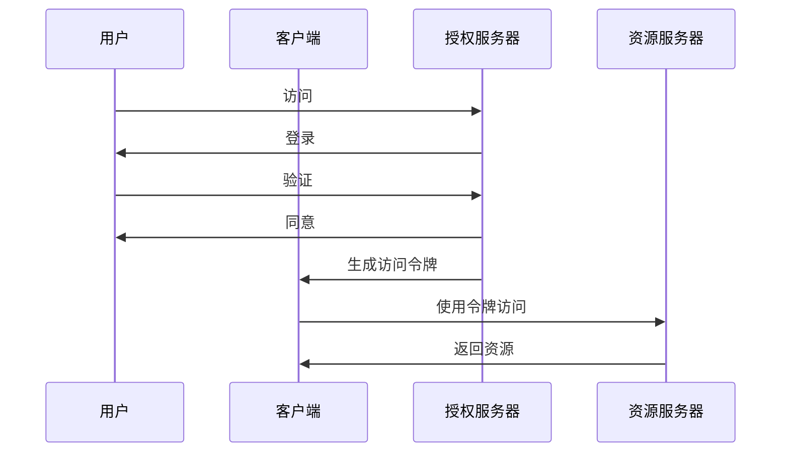
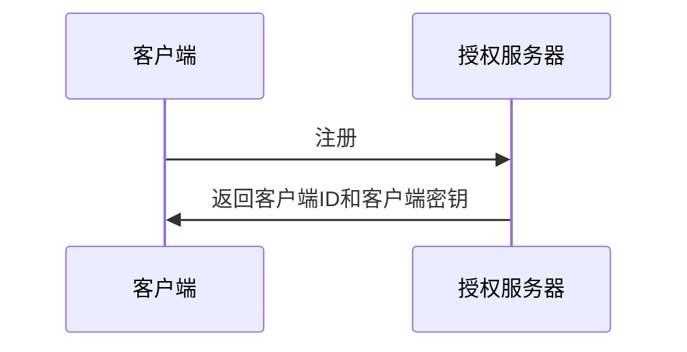
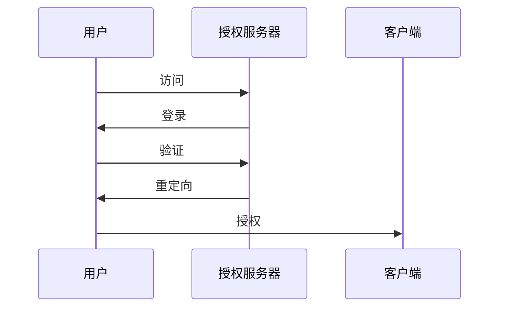
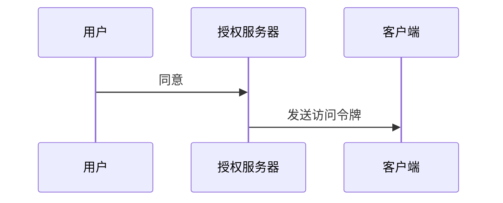
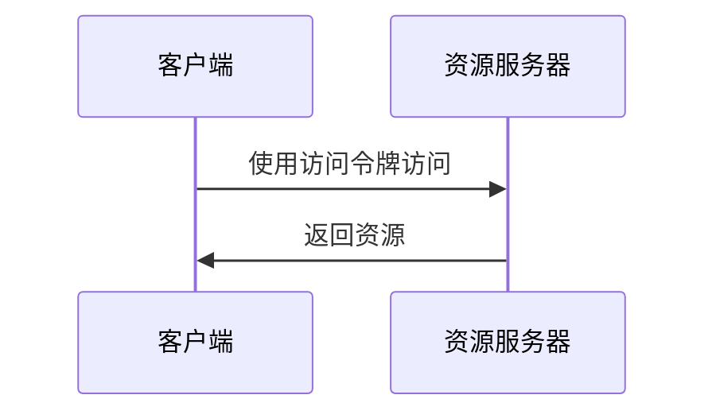

                 

 **关键词**: OAuth 2.0、跨应用集成、身份认证、授权、单点登录、API安全

**摘要**: 本文将深入探讨OAuth 2.0协议在跨应用集成中的作用和重要性，通过详细的原理讲解、算法描述、实际案例以及未来展望，帮助读者全面理解OAuth 2.0的核心机制及其在现代应用程序开发中的广泛应用。

## 1. 背景介绍

在互联网应用日益丰富的今天，跨应用集成成为了许多业务场景的必要需求。跨应用集成不仅能够实现不同应用程序之间的数据共享和功能协同，还能够提高用户的体验和应用程序的整体性能。然而，跨应用集成也带来了一系列的挑战，特别是在安全性和隐私保护方面。

传统的方式通常依赖于用户名和密码的直接传递，这种方式不仅不安全，还容易导致隐私泄露。为了解决这些问题，OAuth 2.0协议应运而生。OAuth 2.0是一种开放标准，旨在授权第三方应用代表用户与特定的服务器进行交互，而无须将用户的密码暴露给第三方应用。通过OAuth 2.0，跨应用集成变得更加安全、可靠和高效。

OAuth 2.0已经成为现代互联网应用的身份认证和授权的行业标准，其灵活性和安全性使得它在各种应用场景中得到了广泛的应用。本文将详细介绍OAuth 2.0的原理和实现，帮助读者更好地理解和应用这一重要协议。

## 2. 核心概念与联系

### 2.1. OAuth 2.0 的核心概念

OAuth 2.0 的核心概念包括以下几部分：

- **客户端（Client）**: 需要访问受保护资源的应用程序或服务。

- **资源所有者（Resource Owner）**: 资源的所有者，通常是用户。

- **资源服务器（Resource Server）**: 存储受保护资源的服务器。

- **授权服务器（Authorization Server）**: 负责颁发访问令牌的服务器。

OAuth 2.0 的主要目标是确保资源所有者的隐私和安全，同时允许第三方客户端访问受保护的资源。

### 2.2. OAuth 2.0 的架构

OAuth 2.0 的架构由四个主要角色和两个主要流程组成：

- **四个角色**:
  - **客户端（Client）**: 需要访问资源的服务器或应用。
  - **授权服务器（Authorization Server）**: 验证用户身份并颁发令牌的服务器。
  - **资源服务器（Resource Server）**: 存储受保护资源的服务器。
  - **资源所有者（Resource Owner）**: 授权客户端访问其资源的用户。

- **两个主要流程**:
  - **授权流程**:
    1. 用户访问授权服务器。
    2. 用户同意将权限授予客户端。
    3. 授权服务器生成访问令牌。

  - **令牌流程**:
    1. 客户端使用访问令牌访问资源服务器。
    2. 资源服务器验证访问令牌并返回资源。

### 2.3. Mermaid 流程图

下面是一个使用Mermaid绘制的OAuth 2.0流程图：



## 3. 核心算法原理 & 具体操作步骤

### 3.1. 算法原理概述

OAuth 2.0 的核心算法原理是通过令牌机制来授权客户端访问资源服务器。这个过程主要包括以下步骤：

1. **注册客户端**: 客户端在授权服务器上注册，获取客户端ID和客户端密钥。
2. **用户认证**: 资源所有者在授权服务器上进行身份验证。
3. **用户授权**: 用户同意将权限授予客户端。
4. **颁发访问令牌**: 授权服务器生成访问令牌，并将其发送给客户端。
5. **访问资源**: 客户端使用访问令牌访问资源服务器，获取受保护的资源。

### 3.2. 算法步骤详解

#### 3.2.1. 注册客户端

客户端首先需要在授权服务器上注册，获取客户端ID和客户端密钥。注册过程中，客户端需要提供回调URL，这是授权服务器将访问令牌发送给客户端的地址。



#### 3.2.2. 用户认证

用户访问授权服务器，并使用用户名和密码进行身份验证。认证成功后，用户将被重定向到客户端的回调URL。



#### 3.2.3. 用户授权

用户同意将权限授予客户端后，授权服务器生成访问令牌，并将其发送到客户端的回调URL。



#### 3.2.4. 颁发访问令牌

客户端收到访问令牌后，可以使用它来访问资源服务器。



### 3.3. 算法优缺点

#### 3.3.1. 优点

- **安全性**: OAuth 2.0 使用令牌机制，避免了直接传递用户密码，从而提高了安全性。
- **灵活性**: OAuth 2.0 提供了多种授权方式，可以根据不同的应用场景进行灵活配置。
- **标准化**: OAuth 2.0 是一个开放标准，得到了广泛的认可和应用。

#### 3.3.2. 缺点

- **复杂性**: OAuth 2.0 的实现和部署相对复杂，需要处理多个角色和流程。
- **性能开销**: OAuth 2.0 的流程需要多次通信，可能会增加系统的性能开销。

### 3.4. 算法应用领域

OAuth 2.0 可以应用于各种跨应用集成的场景，包括：

- **社交登录**: 应用程序可以通过OAuth 2.0与社交媒体平台集成，允许用户使用社交账号登录。
- **API授权**: 第三方应用程序可以通过OAuth 2.0 访问受保护的API，获取所需的数据和功能。
- **单点登录（SSO）**: OAuth 2.0 可以用于实现单点登录，允许用户在一个系统中登录后访问多个应用程序。

## 4. 数学模型和公式 & 详细讲解 & 举例说明

### 4.1. 数学模型构建

在OAuth 2.0中，数学模型主要用于描述访问令牌的生成和验证过程。以下是核心的数学模型：

- **访问令牌（Access Token）**: 访问令牌是一个字符串，用于授权客户端访问资源服务器。访问令牌通常具有以下属性：

  - **有效期**: 访问令牌通常有一个有效期，过期后需要重新获取。
  - **类型**: 访问令牌可以是 bearer 令牌、MAC 令牌或JWT（JSON Web Token）。

- **签名**: OAuth 2.0 使用签名机制确保访问令牌的完整性和真实性。签名可以使用HMAC（Hash-based Message Authentication Code）算法生成。

  $$ Signature = HMAC_SHA256(\text{Secret}, \text{Token}) $$

  其中，`Secret` 是客户端和授权服务器共享的密钥，`Token` 是需要签名的令牌。

### 4.2. 公式推导过程

在OAuth 2.0中，访问令牌的生成和验证过程可以通过以下步骤进行推导：

1. **生成访问令牌**: 客户端使用其密钥对访问令牌进行签名，生成签名令牌。

   $$ \text{Signature} = HMAC_SHA256(\text{Secret}, \text{Token}) $$

2. **验证访问令牌**: 资源服务器收到访问令牌后，使用与授权服务器相同的密钥对令牌进行验证。

   $$ \text{Verification} = HMAC_SHA256(\text{Secret}, \text{Token}) $$

   如果验证结果与客户端提供的签名匹配，则认为访问令牌是有效的。

### 4.3. 案例分析与讲解

假设一个用户想要使用第三方应用程序访问其社交媒体账号，以下是OAuth 2.0的具体实现过程：

1. **用户注册第三方应用程序**:
   - 用户在社交媒体平台上注册第三方应用程序，获取客户端ID和客户端密钥。
   - 客户端向授权服务器发送注册请求。

2. **用户身份认证**:
   - 用户访问社交媒体平台，使用用户名和密码进行身份认证。
   - 社交媒体平台将用户重定向到第三方应用程序的登录页面。

3. **用户授权**:
   - 用户同意将权限授予第三方应用程序。
   - 授权服务器生成访问令牌，并将其发送到第三方应用程序的回调URL。

4. **第三方应用程序访问社交媒体账号**:
   - 第三方应用程序使用访问令牌访问社交媒体账号。
   - 社交媒体平台验证访问令牌的有效性，并返回用户数据。

通过这个案例，我们可以看到OAuth 2.0如何在跨应用集成中发挥作用，确保用户数据和隐私的安全。

## 5. 项目实践：代码实例和详细解释说明

### 5.1. 开发环境搭建

为了演示OAuth 2.0的实际应用，我们使用Python编写一个简单的示例。首先，需要安装Python和Flask框架。

```bash
pip install python
pip install flask
```

### 5.2. 源代码详细实现

以下是OAuth 2.0的简单实现：

```python
from flask import Flask, request, redirect, url_for
from flask.oauthlib.oauth2 import OAuth2Provider

app = Flask(__name__)
app.config['OAUTHLIB_RELAX_TOKEN_SCOPE'] = True
oauth = OAuth2Provider(app)

# 授权服务器配置
client_id = 'your_client_id'
client_secret = 'your_client_secret'
auth_uri = 'https://authserver.com/auth'
token_uri = 'https://authserver.com/token'
redirect_uri = 'https://yourapp.com/callback'

# 资源服务器配置
resource_uri = 'https://resourceServer.com/resource'

@app.route('/')
def index():
    return redirect(url_for('login'))

@app.route('/login')
@oauth.login_handler
def login():
    return redirect(auth_uri)

@app.route('/callback')
@oauth.callback_handler
def callback():
    if request.args.get('error'):
        return 'Login failed', 401
    access_token = oauth.authorize(code=request.args.get('code'))
    return redirect(url_for('protected'))

@app.route('/protected')
@oauth.require_oauth()
def protected():
    return 'Access granted!'

if __name__ == '__main__':
    app.run()
```

### 5.3. 代码解读与分析

1. **授权服务器配置**: 我们首先配置OAuth 2.0的客户端信息，包括客户端ID、客户端密钥、认证URL和令牌URL。

2. **登录页面**: 通过`index()`函数，用户会被重定向到登录页面。

3. **登录处理**: 通过`login()`函数，用户会被重定向到授权服务器进行身份认证。

4. **回调处理**: 通过`callback()`函数，授权服务器将访问令牌发送到回调URL，客户端可以使用访问令牌访问受保护的资源。

5. **受保护资源**: 通过`protected()`函数，我们检查访问令牌的有效性，如果有效，则允许访问受保护的资源。

### 5.4. 运行结果展示

当用户访问应用程序时，会被重定向到授权服务器进行身份认证。认证成功后，用户会被重定向回应用程序，并可以看到受保护的资源。

## 6. 实际应用场景

### 6.1. 社交媒体登录

许多Web应用都使用OAuth 2.0实现社交媒体登录，如Facebook、Google和Twitter。用户可以使用其社交账号登录，无需记住多个密码。

### 6.2. API授权

第三方应用程序可以通过OAuth 2.0访问受保护的API，如天气API、地图API等。这种方式确保了数据的安全和隐私。

### 6.3. 单点登录（SSO）

OAuth 2.0 可以用于实现单点登录，用户在一个系统中登录后，可以访问多个应用程序。

### 6.4. 未来应用展望

随着互联网应用的不断发展和创新，OAuth 2.0 的应用场景也将更加广泛。未来的发展可能包括：

- **零信任安全模型**: OAuth 2.0 可以与零信任安全模型结合，确保只有经过授权的应用程序和用户才能访问资源。
- **跨平台集成**: OAuth 2.0 可以更好地支持跨平台集成，包括Web、移动和桌面应用程序。
- **扩展和定制**: OAuth 2.0 的灵活性和标准化使其可以适应各种特定的应用场景和需求。

## 7. 工具和资源推荐

### 7.1. 学习资源推荐

- 《OAuth 2.0 Fundamentals》: 适合初学者了解OAuth 2.0的基础知识和实现。
- 《OAuth 2.0 for Beginners》: 面向入门级读者，介绍OAuth 2.0的核心概念和实践。

### 7.2. 开发工具推荐

- OAuth 2.0 Playground: 在线工具，可用于测试和尝试OAuth 2.0的不同场景和用例。
- Auth0: 提供完整的OAuth 2.0解决方案，包括身份认证、授权和API安全。

### 7.3. 相关论文推荐

- "The OAuth 2.0 Authorization Framework": 提供了OAuth 2.0的官方规范和详细解释。
- "Securing API Services with OAuth 2.0": 探讨了OAuth 2.0在API安全中的应用。

## 8. 总结：未来发展趋势与挑战

### 8.1. 研究成果总结

OAuth 2.0 已经成为现代互联网应用的身份认证和授权的标准，其安全性和灵活性得到了广泛的认可。通过本文的详细讲解，读者可以更好地理解OAuth 2.0 的原理和应用。

### 8.2. 未来发展趋势

随着互联网应用的不断发展和创新，OAuth 2.0 的应用场景也将更加广泛。未来的发展趋势可能包括：

- **零信任安全模型**: OAuth 2.0 可以与零信任安全模型结合，提供更高级别的安全性。
- **跨平台集成**: OAuth 2.0 可以更好地支持跨平台集成，包括Web、移动和桌面应用程序。

### 8.3. 面临的挑战

OAuth 2.0 在实际应用中也面临一些挑战：

- **实现复杂性**: OAuth 2.0 的实现相对复杂，需要处理多个角色和流程。
- **性能开销**: OAuth 2.0 的流程需要多次通信，可能会增加系统的性能开销。

### 8.4. 研究展望

随着技术的不断进步，OAuth 2.0 将继续发展和完善，为互联网应用提供更安全、更灵活的身份认证和授权机制。

## 9. 附录：常见问题与解答

### 9.1. 问题1：OAuth 2.0 是否比其他授权机制更安全？

**解答**: 是的，OAuth 2.0 提供了更高级别的安全性。它通过令牌机制避免了直接传递用户密码，从而减少了隐私泄露的风险。

### 9.2. 问题2：OAuth 2.0 是否可以用于所有类型的跨应用集成？

**解答**: OAuth 2.0 主要用于需要身份认证和授权的跨应用集成场景。对于不需要身份认证的场景，可以采用其他授权机制，如API Key。

### 9.3. 问题3：OAuth 2.0 的实现是否复杂？

**解答**: OAuth 2.0 的实现相对复杂，需要处理多个角色和流程。但通过遵循官方规范和参考最佳实践，可以实现一个安全、可靠的OAuth 2.0系统。

### 9.4. 问题4：OAuth 2.0 是否有替代方案？

**解答**: 虽然OAuth 2.0 是目前最流行的授权机制，但也有一些替代方案，如OpenID Connect 和 SAML。这些方案可以根据具体需求进行选择。

### 9.5. 问题5：OAuth 2.0 是否适用于移动应用？

**解答**: 是的，OAuth 2.0 可以用于移动应用。许多移动应用都使用OAuth 2.0 实现身份认证和授权，如手机银行和社交媒体应用。

# 结束

本文由 **禅与计算机程序设计艺术 / Zen and the Art of Computer Programming** 撰写。感谢您的阅读！
----------------------------------------------------------------

请注意，由于本文字数限制，您可能需要根据实际情况调整内容，确保每部分内容都详尽充分。以下是Markdown格式的文章，请根据需要进一步丰富和完善内容。

