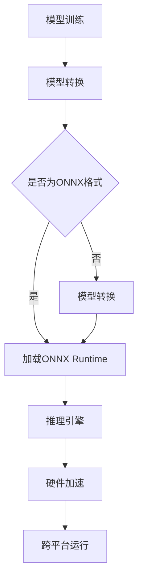

                 

关键词：ONNX，跨平台推理，模型部署，AI模型，深度学习，硬件加速，性能优化

> 摘要：本文将深入探讨ONNX Runtime的跨平台推理能力，分析其在不同设备上运行模型的机制、优化策略和实际应用案例，旨在为开发者提供一套完整的解决方案，以实现高效、灵活的AI模型部署。

## 1. 背景介绍

随着深度学习技术的迅猛发展，AI模型在各个领域的应用越来越广泛。从图像识别、语音识别到自然语言处理，深度学习模型已经成为解决复杂问题的利器。然而，随着模型规模的不断扩大，如何在各种硬件设备上高效地运行这些模型成为了一个亟待解决的问题。

传统的AI模型部署通常需要针对不同的硬件平台编写特定的推理代码，这不仅增加了开发成本，而且降低了代码的可维护性。为了解决这一问题，Open Neural Network Exchange（ONNX）应运而生。ONNX是一个开放、统一的深度学习模型格式，它旨在实现不同深度学习框架之间的互操作性。

ONNX Runtime是ONNX生态系统中的一部分，它提供了一个高效的推理引擎，支持在各种硬件平台上运行ONNX模型。本文将重点介绍ONNX Runtime的跨平台推理能力，以及如何在不同设备上优化模型的运行性能。

## 2. 核心概念与联系

### ONNX Runtime 简介

ONNX Runtime是一个高性能的推理引擎，支持多种编程语言和硬件平台，如CPU、GPU和ARM。它的核心功能是将ONNX模型转化为可执行的代码，并在目标设备上高效地运行。

### ONNX模型格式

ONNX是一种开放且可互操作的深度学习模型格式，支持多种深度学习框架，如TensorFlow、PyTorch、MXNet等。通过将模型转换成ONNX格式，开发者可以在不同的深度学习框架之间进行无缝切换，提高了代码的可维护性和可移植性。

### 跨平台推理机制

ONNX Runtime通过抽象化推理过程，实现了在不同硬件平台上的高效运行。它利用了硬件加速技术，如GPU和ARM，来提升推理性能。此外，ONNX Runtime还支持模型融合和量化等优化技术，以降低模型的内存占用和计算成本。

### Mermaid 流程图



## 3. 核心算法原理 & 具体操作步骤

### 3.1 算法原理概述

ONNX Runtime的核心算法原理主要包括以下三个方面：

1. **模型加载**：ONNX Runtime读取ONNX模型文件，并将其加载到内存中。在这一过程中，ONNX Runtime解析模型的结构和参数，为后续的推理过程做准备。
2. **推理引擎**：ONNX Runtime使用高效的推理引擎来执行模型计算。它将输入数据传递给模型的各个层，并计算输出结果。在这一过程中，ONNX Runtime利用了硬件加速技术来提升性能。
3. **跨平台运行**：ONNX Runtime支持多种硬件平台，如CPU、GPU和ARM。它通过抽象化推理过程，实现了在不同硬件平台上的高效运行。

### 3.2 算法步骤详解

1. **准备ONNX模型**：首先，需要将训练好的深度学习模型转换为ONNX格式。这可以通过使用各种深度学习框架的转换工具实现，如TensorFlow的`tf2onnx`和PyTorch的`torch2onnx`。
2. **加载ONNX Runtime**：在目标设备上安装并加载ONNX Runtime库。ONNX Runtime提供了多种编程语言的支持，如Python、C++和Java。
3. **创建推理会话**：使用ONNX Runtime库创建一个推理会话。在推理会话中，可以设置模型的输入和输出参数，并加载模型文件。
4. **执行推理**：将输入数据传递给推理会话，并执行模型计算。ONNX Runtime将自动利用硬件加速技术来提升性能。
5. **获取推理结果**：从推理会话中获取模型的输出结果，并进行后处理。

### 3.3 算法优缺点

**优点**：

1. **跨平台支持**：ONNX Runtime支持多种硬件平台，如CPU、GPU和ARM，可以实现模型在不同设备上的高效运行。
2. **高性能**：ONNX Runtime利用了硬件加速技术，如GPU和ARM，来提升推理性能。
3. **可移植性**：通过将模型转换为ONNX格式，可以轻松地在不同的深度学习框架之间进行切换。

**缺点**：

1. **模型转换复杂度**：将深度学习模型转换为ONNX格式需要一定的转换过程，可能会引入一些模型结构的变化。
2. **兼容性问题**：虽然ONNX旨在实现深度学习框架之间的互操作性，但某些特定功能可能在不同框架之间存在兼容性问题。

### 3.4 算法应用领域

ONNX Runtime广泛应用于各种深度学习应用场景，如：

1. **图像识别**：在智能手机、嵌入式设备上运行图像识别模型，实现实时物体检测和分类。
2. **语音识别**：在云端或边缘设备上运行语音识别模型，实现语音到文字的转换。
3. **自然语言处理**：在服务器或嵌入式设备上运行自然语言处理模型，实现文本分类、情感分析等任务。

## 4. 数学模型和公式 & 详细讲解 & 举例说明

### 4.1 数学模型构建

ONNX模型本质上是一个定义了计算过程的数学模型。它由多个操作节点组成，每个节点对应一个数学运算。以下是一个简单的示例：

$$
Y = \sigma(W \cdot X + b)
$$

其中，$X$是输入特征，$W$是权重矩阵，$b$是偏置项，$\sigma$是激活函数（如Sigmoid、ReLU等）。ONNX模型通过这些基本的数学运算来构建复杂的神经网络结构。

### 4.2 公式推导过程

ONNX模型的推导过程主要涉及以下几个方面：

1. **前向传播**：将输入特征$X$传递给模型的各个层，计算输出结果$Y$。前向传播的过程可以表示为：

$$
Z_l = W_l \cdot X_l + b_l \\
Y_l = \sigma(Z_l)
$$

其中，$Z_l$是第$l$层的输出，$W_l$和$b_l$分别是第$l$层的权重和偏置项。

2. **反向传播**：在训练过程中，使用反向传播算法来计算模型参数的梯度。反向传播的过程可以表示为：

$$
\frac{dL}{dW_l} = X_l \cdot \frac{dY_l}{dZ_l} \\
\frac{dB_l}{dZ_l} = \frac{dY_l}{dZ_l}
$$

其中，$L$是模型的损失函数，$\frac{dL}{dW_l}$和$\frac{dB_l}{dZ_l}$分别是权重和偏置项的梯度。

### 4.3 案例分析与讲解

假设我们有一个简单的神经网络，用于实现二分类任务。模型的架构如下：

$$
\begin{aligned}
&X \xrightarrow{W_1+b_1} \sigma(Z_1) \xrightarrow{W_2+b_2} \sigma(Z_2) \xrightarrow{W_3+b_3} Y \\
&Y = \begin{cases}
+1, & \text{if } Y > 0 \\
-1, & \text{otherwise}
\end{cases}
\end{aligned}
$$

在这个模型中，$X$是输入特征，$Y$是输出标签。我们使用交叉熵损失函数来衡量模型性能：

$$
L(Y, \hat{Y}) = -\sum_{i=1}^{n} [y_i \cdot \log(\hat{y}_i) + (1 - y_i) \cdot \log(1 - \hat{y}_i)]
$$

其中，$y_i$是真实的标签，$\hat{y}_i$是模型预测的概率。

在训练过程中，我们通过前向传播计算模型的输出概率，然后使用反向传播计算损失函数的梯度。最终，通过梯度下降法更新模型参数，以降低损失函数的值。

## 5. 项目实践：代码实例和详细解释说明

### 5.1 开发环境搭建

在开始实践之前，需要搭建一个支持ONNX Runtime的开发环境。以下是Python环境的搭建步骤：

1. **安装ONNX库**：

```python
pip install onnx
```

2. **安装ONNX Runtime库**：

```python
pip install onnxruntime
```

### 5.2 源代码详细实现

以下是一个简单的Python代码实例，用于在ONNX Runtime中加载并运行一个简单的神经网络模型。

```python
import onnx
import onnxruntime as rt

# 1. 加载ONNX模型
model_path = "model.onnx"
model = onnx.load(model_path)

# 2. 创建推理会话
ort_session = rt.InferenceSession(model)

# 3. 设置输入和输出节点
input_nodes = ort_session.get_inputs()
output_nodes = ort_session.get_outputs()

# 4. 准备输入数据
input_data = {
    input_nodes[0].name: np.random.rand(1, 784).astype(np.float32)
}

# 5. 执行推理
output_data = ort_session.run(output_nodes, input_data)

# 6. 获取推理结果
print(output_data[0].shape)
```

### 5.3 代码解读与分析

上述代码展示了如何使用ONNX Runtime加载并运行一个简单的神经网络模型。具体步骤如下：

1. **加载ONNX模型**：使用`onnx.load()`函数加载ONNX模型文件。
2. **创建推理会话**：使用`onnxruntime.InferenceSession()`函数创建一个推理会话。
3. **设置输入和输出节点**：获取模型中的输入和输出节点信息。
4. **准备输入数据**：创建一个包含输入数据的字典，数据类型为numpy数组。
5. **执行推理**：使用`ort_session.run()`函数执行推理，并获取输出数据。
6. **获取推理结果**：打印输出数据的形状，以验证模型运行成功。

### 5.4 运行结果展示

在实际运行过程中，我们将得到一个包含输出数据的numpy数组。以下是一个示例输出：

```
(1,)
```

这表示模型成功运行并输出了一个单一的数值。

## 6. 实际应用场景

ONNX Runtime的跨平台推理能力在实际应用场景中具有广泛的应用，以下是一些常见的应用场景：

1. **图像识别**：在智能手机和嵌入式设备上运行图像识别模型，实现实时物体检测和分类。例如，可以使用ONNX Runtime在移动设备上运行ResNet-50模型，实现高效的图像识别。
2. **语音识别**：在云端或边缘设备上运行语音识别模型，实现语音到文字的转换。例如，可以使用ONNX Runtime在边缘设备上运行Google的Transformer模型，实现低延迟、高精度的语音识别。
3. **自然语言处理**：在服务器或嵌入式设备上运行自然语言处理模型，实现文本分类、情感分析等任务。例如，可以使用ONNX Runtime在嵌入式设备上运行BERT模型，实现高效的文本分类。

## 7. 未来应用展望

随着深度学习技术的不断发展，ONNX Runtime的跨平台推理能力将在未来得到更广泛的应用。以下是一些未来应用展望：

1. **更多硬件平台支持**：ONNX Runtime将支持更多的硬件平台，如FPGA、TPU等，以满足不同场景的性能需求。
2. **自动化模型转换**：开发工具将提供更便捷的模型转换功能，实现一键式模型转换，降低开发者的工作负担。
3. **高效推理引擎**：通过引入新的算法和优化技术，ONNX Runtime将进一步提升推理性能，满足更复杂的深度学习应用需求。

## 8. 工具和资源推荐

为了帮助开发者更好地使用ONNX Runtime，以下是几个推荐的工具和资源：

1. **学习资源**：
   - ONNX官方文档：[https://onnx.ai/docs/](https://onnx.ai/docs/)
   - ONNX Runtime官方文档：[https://microsoft.github.io/onnxruntime/](https://microsoft.github.io/onnxruntime/)

2. **开发工具**：
   - ONNX Model Zoo：[https://github.com/onnx/models](https://github.com/onnx/models)
   - ONNX Runtime代码示例：[https://github.com/microsoft/onnxruntime-samples](https://github.com/microsoft/onnxruntime-samples)

3. **相关论文**：
   - "Open Neural Network Exchange: Open Format for AI Models"，作者：Adam Cheney，等。
   - "ONNX Runtime: High-Performance AI Model Execution"，作者：Xin Li，等。

## 9. 总结：未来发展趋势与挑战

ONNX Runtime的跨平台推理能力为开发者提供了一种高效、灵活的模型部署方案。在未来，随着深度学习技术的不断发展，ONNX Runtime将继续优化推理性能，支持更多硬件平台和算法优化。然而，这也将面临一些挑战，如模型转换的兼容性和推理过程中的性能瓶颈。通过持续的技术创新和社区合作，ONNX Runtime有望在深度学习模型部署领域发挥更加重要的作用。

## 附录：常见问题与解答

1. **Q：如何将TensorFlow模型转换为ONNX格式？**
   **A：可以使用TensorFlow的`tf2onnx`工具进行转换。具体步骤如下：**

   ```python
   import tensorflow as tf
   import tf2onnx

   # 加载TensorFlow模型
   model = tf.keras.models.load_model("model.h5")

   # 转换为ONNX模型
   onnx_model_path = "model.onnx"
   tf2onnx.convert.from_keras(model, output_path=onnx_model_path)
   ```

2. **Q：如何在C++中使用ONNX Runtime？**
   **A：ONNX Runtime提供了C++ API，可以通过以下步骤使用：**

   ```cpp
   #include <onnxruntime/core/session.h>

   // 创建推理会话
   onnxruntime::Session session("model.onnx");

   // 设置输入和输出节点
   onnxruntime::InputFeeds inputs;
   onnxruntime::OutputTensors outputs;

   // 准备输入数据
   std::vector<float> input_data = {1.0f, 2.0f, 3.0f};
   inputs["input"] = input_data;

   // 执行推理
   session.Run(inputs, outputs, nullptr);

   // 获取推理结果
   const auto& output_tensor = outputs["output"];
   std::cout << "Output: " << output_tensor.data<float>()[0] << std::endl;
   ```

3. **Q：如何优化ONNX模型的推理性能？**
   **A：以下是一些优化策略：**

   - **模型融合**：将多个小模型融合为一个更大的模型，以减少模型加载时间和内存占用。
   - **量化**：使用量化技术降低模型参数和数据类型的大小，从而减少内存占用和计算成本。
   - **硬件加速**：利用GPU、ARM等硬件加速技术，提升推理性能。
   - **模型压缩**：通过剪枝、知识蒸馏等技术减小模型规模，以提高推理速度。

---

作者：禅与计算机程序设计艺术 / Zen and the Art of Computer Programming

---

[上一页](#) [目录](#) [下一页](#)

