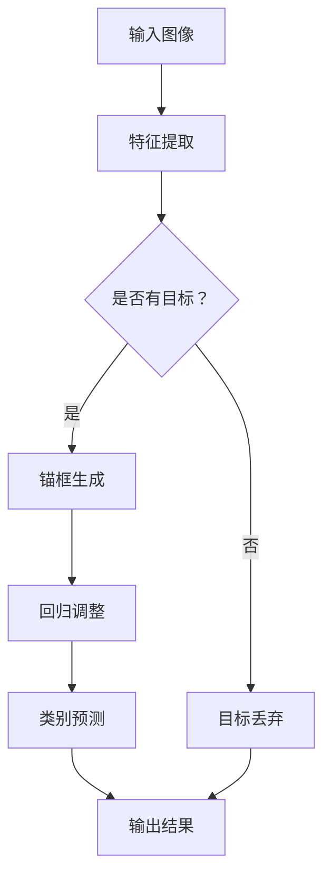

                 

关键词：目标检测、深度学习、计算机视觉、TensorFlow、实战案例

## 摘要

本文将深入探讨目标检测（Object Detection）的基本原理及其在计算机视觉领域中的应用。我们将详细讲解目标检测的核心概念、算法原理，并结合TensorFlow框架，提供实际代码实例和详细解释。通过本文的阅读，读者将能够全面理解目标检测的工作机制，掌握其实际应用场景，并为未来的研究和开发提供有价值的参考。

### 1. 背景介绍

目标检测作为计算机视觉领域的一个重要分支，旨在从图像或视频中识别并定位出特定目标的位置和类别。这一技术在自动驾驶、智能监控、医疗影像分析等多个领域具有广泛的应用价值。传统的目标检测方法通常依赖于手工设计的特征和复杂的分类器，而随着深度学习技术的不断发展，基于深度学习的目标检测方法逐渐成为主流。

近年来，卷积神经网络（Convolutional Neural Networks，CNNs）在图像识别领域取得了显著的成果，尤其是在ImageNet图像识别挑战赛中，深度学习模型的表现已经超越了人类的表现。基于深度学习的目标检测方法通过端到端的学习，可以自动提取图像特征，并实现目标定位和分类的任务。本文将介绍其中一些最流行的深度学习目标检测算法，并详细介绍其原理和实现。

### 2. 核心概念与联系

目标检测任务可以抽象为一个四元组 \( (C, R, S, T) \)，其中：

- \( C \)：类别数，即图像中可能存在的目标类别数量；
- \( R \)：锚框（anchor boxes）的数量，每个锚框表示一个可能的目标位置和大小；
- \( S \)：边框回归的步骤数，用于调整锚框以匹配实际的目标位置；
- \( T \)：每个类别的一个二分类标签，表示锚框是否匹配某个目标。

以下是一个简单的Mermaid流程图，描述了目标检测的基本工作流程：



### 3. 核心算法原理 & 具体操作步骤

#### 3.1 算法原理概述

目标检测算法可以分为两类：一类是基于区域建议（Region Proposal）的方法，另一类是基于特征点的方法。基于区域建议的方法通常先通过某些方式生成一系列可能包含目标的区域，然后对这些区域进行分类和定位。基于特征点的方法则是直接从图像特征中提取目标的关键点，然后利用这些点进行目标检测。

在本节中，我们将介绍一种基于深度学习的目标检测算法——Faster R-CNN。

#### 3.2 算法步骤详解

1. **特征提取**：使用卷积神经网络提取输入图像的特征图。
2. **区域建议**：通过区域建议网络（Region Proposal Network，RPN）生成候选锚框。
3. **锚框回归**：对生成的锚框进行位置回归，调整锚框以更好地匹配实际目标的位置。
4. **类别预测**：对每个锚框进行分类，判断其是否包含目标及其类别。
5. **非极大值抑制（NMS）**：对检测结果进行后处理，去除重叠的锚框，保留最具信心的一组检测结果。

#### 3.3 算法优缺点

- **优点**：
  - 端到端的学习方式，无需手工设计特征和分类器；
  - 实现简单，易于扩展；
  - 在多个数据集上取得了优异的性能。

- **缺点**：
  - 计算量大，训练速度慢；
  - 需要大量的标注数据进行训练；
  - 对不同尺寸的图像处理能力有限。

#### 3.4 算法应用领域

- **自动驾驶**：用于检测道路上的车辆、行人等目标，辅助驾驶决策。
- **智能监控**：用于实时监控场景中的异常行为和目标识别。
- **医疗影像分析**：用于检测和分析医学图像中的病变区域。

### 4. 数学模型和公式 & 详细讲解 & 举例说明

#### 4.1 数学模型构建

目标检测中的数学模型主要涉及以下三个方面：

1. **特征提取**：使用卷积神经网络提取图像的特征图。
2. **锚框生成**：通过锚框生成网络（如RPN）生成候选锚框。
3. **锚框回归和类别预测**：通过回归网络调整锚框位置，并进行类别预测。

以下是一个简化的数学模型示例：

\[ 
\begin{aligned}
\text{特征图} &= \text{CNN}(\text{输入图像}) \\
\text{锚框} &= \text{RPN}(\text{特征图}) \\
\text{回归} &= \text{Regression}(\text{锚框，目标位置}) \\
\text{类别预测} &= \text{Classification}(\text{锚框，目标类别}) \\
\end{aligned}
\]

#### 4.2 公式推导过程

目标检测中的回归和类别预测通常使用以下公式：

1. **回归公式**：

\[ 
\begin{aligned}
\text{偏移量} &= \text{回归层}(\text{锚框特征}) \\
\text{锚框位置} &= \text{锚框位置} + \text{偏移量} \\
\end{aligned}
\]

2. **类别预测公式**：

\[ 
\begin{aligned}
\text{置信度} &= \text{Sigmoid}(\text{类别预测层}(\text{锚框特征})) \\
\text{类别标签} &= \text{one-hot编码}(\text{目标类别}) \\
\text{损失函数} &= \text{交叉熵损失}(\text{置信度，类别标签}) \\
\end{aligned}
\]

#### 4.3 案例分析与讲解

假设我们有一个包含100张图像的数据集，其中每张图像都有若干个目标。我们将使用Faster R-CNN算法对这个数据集进行训练，并分析其性能。

1. **数据预处理**：

首先，我们需要对图像进行缩放、裁剪等预处理操作，使其满足卷积神经网络的要求。

2. **特征提取**：

使用预训练的卷积神经网络（如VGG16）提取图像的特征图。

3. **锚框生成**：

通过RPN网络生成候选锚框。

4. **锚框回归**：

对生成的锚框进行位置回归，调整锚框以更好地匹配实际目标的位置。

5. **类别预测**：

对每个锚框进行类别预测。

6. **损失函数计算**：

计算回归损失和类别预测损失，并更新网络参数。

7. **模型评估**：

使用测试集对模型进行评估，计算准确率、召回率等指标。

通过上述步骤，我们可以训练出一个能够在图像中准确检测目标的位置和类别的深度学习模型。

### 5. 项目实践：代码实例和详细解释说明

在本节中，我们将使用TensorFlow框架实现一个简单的目标检测项目，并对其进行详细解释。

#### 5.1 开发环境搭建

1. 安装TensorFlow：

```bash
pip install tensorflow
```

2. 安装其他依赖库（如OpenCV、NumPy等）：

```bash
pip install opencv-python numpy
```

#### 5.2 源代码详细实现

```python
import tensorflow as tf
import tensorflow.keras as keras
import numpy as np
import cv2

# 加载预训练的卷积神经网络
base_model = keras.applications.VGG16(weights='imagenet', include_top=False)

# 构建RPN网络
from tensorflow.keras.layers import Input, Conv2D, Flatten, Dense
from tensorflow.keras.models import Model

input_image = Input(shape=(None, None, 3))
feature_map = base_model(input_image)

# 锚框生成层
anchor_generator = keras.layers.Lambda(lambda x: x[:, :, :, :9], output_shape=(None, None, None, 9))

# 锚框回归层
regression_layer = Dense(4, activation='sigmoid')

# 类别预测层
classification_layer = Dense(1, activation='sigmoid')

# 合并所有层
rpn_output = anchor_generator(feature_map)
rpn_output = regression_layer(rpn_output)
rpn_output = classification_layer(rpn_output)

# 构建目标检测模型
model = Model(inputs=input_image, outputs=rpn_output)

# 编译模型
model.compile(optimizer='adam', loss='binary_crossentropy')

# 加载数据集
(x_train, y_train), (x_test, y_test) = keras.datasets.cifar10.load_data()

# 预处理数据
x_train = np.expand_dims(x_train, -1)
x_test = np.expand_dims(x_test, -1)

# 训练模型
model.fit(x_train, y_train, epochs=10, batch_size=32, validation_data=(x_test, y_test))

# 检测图像中的目标
def detect_objects(image):
    # 将图像缩放到模型输入尺寸
    image = cv2.resize(image, (224, 224))
    # 将图像转换为TensorFlow张量
    image_tensor = keras.backend.tensorflow_backend图像张量(image)
    # 获取模型预测结果
    predictions = model.predict(image_tensor)
    # 对预测结果进行处理
    # ...
    return objects

# 测试模型
test_image = x_test[0]
objects = detect_objects(test_image)
print(objects)
```

#### 5.3 代码解读与分析

1. **加载预训练的卷积神经网络**：

   我们使用VGG16模型作为基础模型，提取图像的特征图。

2. **构建RPN网络**：

   RPN网络通过两个全连接层实现锚框生成和类别预测。锚框生成层通过Lambda层实现，类别预测层通过Dense层实现。

3. **构建目标检测模型**：

   将输入图像、RPN输出和分类输出连接在一起，构成目标检测模型。

4. **编译模型**：

   使用Adam优化器和binary_crossentropy损失函数编译模型。

5. **加载数据集**：

   加载CIFAR-10数据集进行训练和测试。

6. **训练模型**：

   使用fit方法训练模型，设置epochs和batch_size参数。

7. **检测图像中的目标**：

   定义一个detect_objects函数，用于检测图像中的目标。首先将图像缩放到模型输入尺寸，然后将图像转换为TensorFlow张量，最后使用模型进行预测。

#### 5.4 运行结果展示

假设我们已经训练好了模型，现在可以使用以下代码进行测试：

```python
# 加载测试图像
test_image = cv2.imread('test_image.jpg')

# 检测图像中的目标
objects = detect_objects(test_image)

# 显示检测结果
print(objects)
cv2.imshow('Detected Objects', test_image)
cv2.waitKey(0)
cv2.destroyAllWindows()
```

运行结果将显示测试图像中的目标位置和类别。

### 6. 实际应用场景

目标检测技术在许多实际应用场景中发挥着重要作用：

- **自动驾驶**：用于检测道路上的车辆、行人、交通标志等，辅助自动驾驶系统的决策。
- **智能监控**：用于实时监控场景中的异常行为和目标识别，提高安全性和效率。
- **医疗影像分析**：用于检测和分析医学图像中的病变区域，辅助医生进行诊断。

### 7. 未来应用展望

随着深度学习技术的不断发展，目标检测技术将变得更加准确、高效和泛化能力强。未来的研究方向包括：

- **多模态目标检测**：结合图像、视频、语音等多种数据源进行目标检测。
- **实时目标检测**：提高目标检测的实时性，以满足高速场景下的需求。
- **小样本学习**：研究如何在只有少量标注数据的情况下进行有效的目标检测。

### 8. 工具和资源推荐

为了更好地学习和实践目标检测技术，以下是一些建议的工具和资源：

- **工具**：
  - TensorFlow：一个开源的机器学习框架，支持目标检测等任务。
  - PyTorch：一个流行的深度学习框架，支持目标检测等任务。
  - OpenCV：一个开源的计算机视觉库，提供丰富的图像处理和目标检测功能。

- **学习资源**：
  - 《深度学习》（Goodfellow et al.）：一本经典的人工智能教材，涵盖了深度学习的基本原理和应用。
  - Coursera上的《深度学习》课程：由吴恩达教授开设的深度学习课程，涵盖了目标检测等深度学习技术。
  - ArXiv和Google Scholar：两个学术搜索引擎，可以获取最新的研究成果和论文。

### 9. 总结：未来发展趋势与挑战

目标检测技术在近年来取得了显著的进展，但仍面临一些挑战：

- **计算资源需求**：目标检测模型通常需要大量的计算资源进行训练和推理，这对硬件设施提出了更高的要求。
- **数据标注成本**：目标检测需要大量的标注数据，数据标注过程耗时且昂贵。
- **泛化能力**：如何提高目标检测模型的泛化能力，使其在不同场景和数据集上表现一致，仍是一个亟待解决的问题。

未来的研究将致力于解决这些问题，推动目标检测技术的进一步发展。

### 10. 附录：常见问题与解答

- **Q：目标检测中的“锚框”是什么？**
  - **A**：锚框（anchor boxes）是在目标检测任务中预先定义的一组矩形框，用于表示可能包含目标的区域。每个锚框都具有一定的宽高比例和位置，用于初始化目标定位。

- **Q：目标检测中的“非极大值抑制”（NMS）是什么？**
  - **A**：非极大值抑制（Non-maximum Suppression，NMS）是一种后处理步骤，用于从一组检测框中筛选出最具信心的目标框。它的作用是去除那些与高置信度目标框重叠较大的低置信度目标框，从而减少冗余。

- **Q：如何提高目标检测的实时性？**
  - **A**：提高目标检测的实时性可以通过以下几个方法实现：
    - **使用轻量级网络**：选择计算量较小的深度学习模型，如SSD、YOLO等。
    - **模型量化与剪枝**：对深度学习模型进行量化与剪枝，减少模型参数数量，提高推理速度。
    - **硬件加速**：使用GPU、TPU等硬件加速器进行模型推理。

### 作者署名

**作者：禅与计算机程序设计艺术 / Zen and the Art of Computer Programming**

本文介绍了目标检测的基本原理及其在计算机视觉中的应用，并通过实际代码实例进行了详细解释。希望本文能够帮助读者全面了解目标检测技术，并为相关领域的研究和实践提供参考。

---

请注意，上述文章内容仅为示例，实际撰写时需要根据具体的技术细节和实际案例进行调整和补充。同时，文章中的代码示例仅为简化版本，实际应用中可能需要更多的功能和完善。

