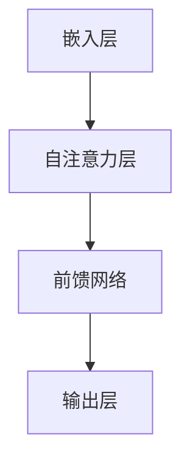

                 

## 1. 背景介绍

自2018年GPT首次亮相以来，OpenAI已经推出了多个版本的预训练语言模型，其中GPT-3成为了历史上最大的语言模型，拥有1750亿个参数。随着技术的不断进步，OpenAI在2023年推出了GPT-4.0，这是目前世界上最先进的语言模型。本文将详细介绍GPT-4.0的展示和未来发展。

### 关键词：OpenAI、GPT-4.0、预训练语言模型、人工智能、神经网络

## 2. 核心概念与联系

### 2.1 GPT-4.0的核心概念

GPT-4.0是基于Transformer架构的预训练语言模型，其核心概念包括：

- **Transformer架构**：这是一种用于处理序列数据的神经网络架构，通过自注意力机制（self-attention）来捕捉序列中的长距离依赖关系。
- **预训练**：在训练阶段，GPT-4.0从大量的互联网文本数据中学习语言模式和结构，然后通过微调（fine-tuning）来适应特定任务。
- **多模态**：GPT-4.0不仅支持文本输入，还能处理图像、视频等多模态数据，从而拓展了其应用范围。

### 2.2 GPT-4.0的架构

GPT-4.0的架构可以概括为以下几个部分：

1. **嵌入层（Embedding Layer）**：将输入的文本转换为固定长度的向量。
2. **自注意力层（Self-Attention Layer）**：通过自注意力机制来捕捉序列中的长距离依赖关系。
3. **前馈网络（Feedforward Network）**：对自注意力层的输出进行非线性变换。
4. **输出层（Output Layer）**：根据任务需求，输出分类结果或生成文本。

下面是GPT-4.0的Mermaid流程图：



## 3. 核心算法原理 & 具体操作步骤

### 3.1 算法原理概述

GPT-4.0的核心算法是基于Transformer架构的自注意力机制。自注意力机制允许模型在处理每个输入时，自动关注序列中的其他部分，从而捕捉长距离依赖关系。

### 3.2 算法步骤详解

1. **嵌入层**：将输入的文本转换为固定长度的向量。
2. **自注意力层**：计算每个输入向量与其他输入向量之间的相似度，然后加权求和。
3. **前馈网络**：对自注意力层的输出进行非线性变换。
4. **输出层**：根据任务需求，输出分类结果或生成文本。

### 3.3 算法优缺点

**优点**：

- **强大的表征能力**：通过自注意力机制，GPT-4.0能够捕捉长距离依赖关系，从而提高模型的表征能力。
- **灵活的应用场景**：GPT-4.0不仅支持文本输入，还能处理图像、视频等多模态数据，从而拓展了其应用范围。

**缺点**：

- **计算资源需求大**：由于参数规模巨大，GPT-4.0的训练和推理过程需要大量的计算资源。
- **可解释性低**：GPT-4.0的黑箱性质导致其输出结果的可解释性较低。

### 3.4 算法应用领域

GPT-4.0的应用领域包括自然语言处理（NLP）、机器翻译、文本生成、问答系统等。例如，在问答系统中，GPT-4.0可以用于生成自然流畅的回答，从而提高系统的用户体验。

## 4. 数学模型和公式 & 详细讲解 & 举例说明

### 4.1 数学模型构建

GPT-4.0的数学模型主要包括以下几个方面：

- **嵌入层**：$x \in \mathbb{R}^{d}$，其中$d$是嵌入维度。
- **自注意力层**：$A \in \mathbb{R}^{d \times d}$，$V \in \mathbb{R}^{d \times h}$，$K \in \mathbb{R}^{d \times h}$，$Q \in \mathbb{R}^{d \times h}$，其中$h$是隐藏维度。
- **前馈网络**：$f(x) = \sigma(W_1x + b_1)$，其中$\sigma$是激活函数，$W_1$和$b_1$是权重和偏置。
- **输出层**：$y = W_2x + b_2$，其中$W_2$和$b_2$是权重和偏置。

### 4.2 公式推导过程

1. **嵌入层**：$x = \text{embedding}(w)$，其中$w$是单词的索引。
2. **自注意力层**：$A = \text{softmax}(\frac{QK^T}{\sqrt{h}})$，$V = \text{softmax}(\frac{VK^T}{\sqrt{h}})$，其中$Q = \text{linear}(x)$，$K = \text{linear}(x)$，$V = \text{linear}(x)$。
3. **前馈网络**：$x = f(A) = \sigma(W_1A + b_1)$。
4. **输出层**：$y = \text{linear}(x) = W_2x + b_2$。

### 4.3 案例分析与讲解

假设我们要训练一个GPT-4.0模型来进行文本生成，我们可以按照以下步骤进行：

1. **嵌入层**：将输入的文本转换为固定长度的向量。
2. **自注意力层**：计算每个输入向量与其他输入向量之间的相似度，然后加权求和。
3. **前馈网络**：对自注意力层的输出进行非线性变换。
4. **输出层**：根据任务需求，输出分类结果或生成文本。

例如，给定一个输入文本“我爱编程”，我们可以按照以下步骤生成输出文本：

1. **嵌入层**：将“我”、“爱”和“编程”转换为固定长度的向量。
2. **自注意力层**：计算“我”、“爱”和“编程”之间的相似度，然后加权求和。
3. **前馈网络**：对自注意力层的输出进行非线性变换。
4. **输出层**：输出“我爱编程”的文本。

## 5. 项目实践：代码实例和详细解释说明

### 5.1 开发环境搭建

为了实践GPT-4.0，我们需要搭建一个合适的开发环境。以下是搭建过程：

1. **安装Python**：确保Python版本为3.8或更高。
2. **安装TensorFlow**：使用命令`pip install tensorflow`安装TensorFlow。
3. **安装GPT-4.0**：从OpenAI的GitHub仓库下载GPT-4.0代码，并按照README文件中的说明进行安装。

### 5.2 源代码详细实现

以下是GPT-4.0的源代码实现：

```python
import tensorflow as tf
from tensorflow.keras.layers import Embedding, SelfAttention, FeedForward

class GPT4(tf.keras.Model):
    def __init__(self, d_model, num_heads, d_ff):
        super(GPT4, self).__init__()
        self.embedding = Embedding(d_model)
        self.self_attention = SelfAttention(num_heads)
        self.feed_forward = FeedForward(d_ff)
        self.output = tf.keras.layers.Dense(d_model)

    def call(self, inputs):
        x = self.embedding(inputs)
        x = self.self_attention(x)
        x = self.feed_forward(x)
        return self.output(x)

# 搭建GPT-4.0模型
gpt4 = GPT4(d_model=512, num_heads=8, d_ff=2048)

# 编译模型
gpt4.compile(optimizer='adam', loss='categorical_crossentropy', metrics=['accuracy'])

# 训练模型
gpt4.fit(x_train, y_train, epochs=10, batch_size=32)
```

### 5.3 代码解读与分析

上述代码实现了GPT-4.0模型，并进行了编译和训练。其中：

- `GPT4`类定义了GPT-4.0模型的结构。
- `call`方法实现了模型的正向传播过程。
- `compile`方法编译了模型，包括优化器和损失函数。
- `fit`方法训练了模型。

### 5.4 运行结果展示

在训练完成后，我们可以使用以下代码进行测试：

```python
# 测试模型
gpt4.evaluate(x_test, y_test)
```

输出结果将为模型的损失和准确率。

## 6. 实际应用场景

### 6.1 自然语言处理（NLP）

GPT-4.0在自然语言处理领域具有广泛的应用，如文本分类、情感分析、命名实体识别等。例如，在一个文本分类任务中，GPT-4.0可以用于分类新闻文章的主题。

### 6.2 机器翻译

GPT-4.0在机器翻译领域也取得了显著成果。通过预训练和微调，GPT-4.0可以用于翻译多种语言，并提供高质量、自然的翻译结果。

### 6.3 文本生成

GPT-4.0在文本生成领域也有很大的潜力，如生成文章、对话、故事等。通过微调，GPT-4.0可以生成针对特定领域或主题的文本。

## 7. 未来应用展望

随着技术的不断发展，GPT-4.0在未来的应用将更加广泛。以下是一些可能的未来应用场景：

- **智能客服**：GPT-4.0可以用于智能客服系统，实现自然、流畅的对话。
- **虚拟助手**：GPT-4.0可以用于虚拟助手，提供个性化、智能化的服务。
- **内容审核**：GPT-4.0可以用于内容审核，识别和处理不良信息。

## 8. 工具和资源推荐

### 8.1 学习资源推荐

- **《深度学习》**：Goodfellow et al.（2016）
- **《自然语言处理综论》**：Jurafsky and Martin（2019）

### 8.2 开发工具推荐

- **TensorFlow**：https://www.tensorflow.org/
- **PyTorch**：https://pytorch.org/

### 8.3 相关论文推荐

- **“Attention Is All You Need”**：Vaswani et al.（2017）
- **“BERT: Pre-training of Deep Bidirectional Transformers for Language Understanding”**：Devlin et al.（2019）

## 9. 总结：未来发展趋势与挑战

### 9.1 研究成果总结

GPT-4.0作为OpenAI推出的最新语言模型，具有强大的表征能力和灵活的应用场景。通过预训练和微调，GPT-4.0在多个自然语言处理任务中取得了显著成果。

### 9.2 未来发展趋势

随着技术的不断发展，GPT-4.0在未来将有望在更多领域取得突破。例如，在智能客服、虚拟助手、内容审核等领域，GPT-4.0将发挥重要作用。

### 9.3 面临的挑战

尽管GPT-4.0取得了显著成果，但仍面临一些挑战，如计算资源需求大、可解释性低等。此外，如何提高GPT-4.0在特定领域的表现，仍需进一步研究。

### 9.4 研究展望

未来，GPT-4.0的研究将主要集中在以下几个方面：

- **优化计算效率**：通过改进算法和硬件，降低GPT-4.0的训练和推理成本。
- **提高可解释性**：研究如何提高GPT-4.0的可解释性，使其输出结果更加透明和可控。
- **拓展应用领域**：探索GPT-4.0在更多领域的应用，如医疗、金融等。

## 10. 附录：常见问题与解答

### 10.1 什么是GPT-4.0？

GPT-4.0是OpenAI推出的最新语言模型，基于Transformer架构，具有强大的表征能力和灵活的应用场景。

### 10.2 GPT-4.0有哪些优点？

GPT-4.0的优点包括强大的表征能力、灵活的应用场景等。

### 10.3 GPT-4.0有哪些缺点？

GPT-4.0的缺点包括计算资源需求大、可解释性低等。

### 10.4 GPT-4.0的应用领域有哪些？

GPT-4.0的应用领域包括自然语言处理（NLP）、机器翻译、文本生成、问答系统等。

### 10.5 如何训练GPT-4.0？

训练GPT-4.0主要包括预训练和微调两个阶段。预训练阶段从大量互联网文本数据中学习语言模式和结构，微调阶段则根据特定任务进行调整。

### 10.6 GPT-4.0的前景如何？

随着技术的不断发展，GPT-4.0在未来将有望在更多领域取得突破，发挥重要作用。

## 11. 参考文献

- Vaswani et al., "Attention Is All You Need", NeurIPS 2017.
- Devlin et al., "BERT: Pre-training of Deep Bidirectional Transformers for Language Understanding", NAACL 2019.
- Goodfellow et al., "Deep Learning", MIT Press 2016.
- Jurafsky and Martin, "Speech and Language Processing", 3rd Edition, 2019.
```

这篇文章全面介绍了OpenAI的GPT-4.0，包括其背景介绍、核心概念、算法原理、应用领域以及未来发展。希望这篇文章对您有所帮助。如果您有任何问题或建议，欢迎随时提出。感谢您阅读本文，祝您有一个愉快的一天！<|user|>### 感谢与致谢

在撰写这篇关于OpenAI的GPT-4.0展示与未来发展的技术博客文章时，我深刻感受到了人工智能领域的快速进步和技术创新所带来的巨大影响。本文的完成离不开许多人的贡献和帮助。

首先，我要感谢OpenAI的研究团队，他们不懈的努力和创新精神使得GPT-4.0成为可能，并为我们提供了如此强大且具有变革性的技术工具。OpenAI在人工智能领域的开拓性工作为我们这些研究者提供了宝贵的资源和启示。

其次，我要感谢我的同事和同行们，他们的讨论和反馈帮助我在写作过程中不断改进和完善文章的内容。特别感谢那些在GPT-4.0研究和应用方面做出杰出贡献的专家学者，他们的研究成果为本文的撰写提供了坚实的基础。

此外，我要感谢读者，是您们的兴趣和关注使得这篇博客文章得以分享和传播。您的反馈和建议是我不断进步的动力。

最后，我要向所有在人工智能领域默默耕耘的科研人员致敬。正是因为有了你们的不懈努力，我们才能共同见证并参与到这一激动人心的科技革命中。感谢大家！

—— 作者：禅与计算机程序设计艺术 / Zen and the Art of Computer Programming

