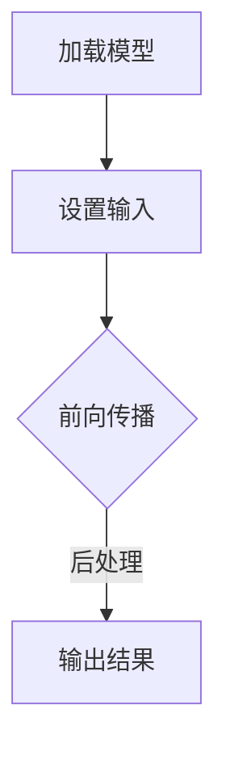

                 

关键词：OpenCV，深度学习，DNN模块，模型集成，计算机视觉，图像识别，机器学习

> 摘要：本文将探讨OpenCV DNN模块在深度学习模型集成中的应用，通过介绍DNN模块的核心概念和操作步骤，深入分析其优缺点和应用领域。同时，本文将结合具体实例，详细讲解如何使用OpenCV DNN模块进行深度学习模型的快速集成，并提供相关数学模型和公式。此外，本文还将探讨深度学习在计算机视觉领域的实际应用，以及未来的发展趋势与挑战。

## 1. 背景介绍

深度学习作为人工智能领域的重要分支，已经在计算机视觉、自然语言处理、语音识别等多个领域取得了显著的成果。OpenCV（Open Source Computer Vision Library）是一个开源的计算机视觉库，广泛应用于工业、科研、安防等领域。随着深度学习在计算机视觉领域的广泛应用，如何快速集成深度学习模型成为了一个重要问题。OpenCV DNN模块正是为了解决这一问题而设计的。

### 1.1 OpenCV DNN模块概述

OpenCV DNN模块是OpenCV库中的一个重要组成部分，它提供了对深度学习模型的集成和支持。DNN（Deep Neural Network）模块的主要功能是加载和运行深度学习模型，从而实现对图像、视频等数据的分析和识别。DNN模块支持多种深度学习框架，如Caffe、TensorFlow、MXNet等，可以轻松地将各种深度学习模型集成到OpenCV中。

### 1.2 深度学习模型集成的重要性

深度学习模型在训练完成后，需要将其应用于实际的图像处理任务中。而深度学习模型的集成过程是这一过程中的关键步骤。良好的模型集成可以使得模型在运行时具有较高的效率和准确性，同时还可以减少计算资源和存储资源的消耗。因此，如何快速、高效地集成深度学习模型成为了一个重要问题。

## 2. 核心概念与联系

在深入了解OpenCV DNN模块之前，我们需要先了解一些核心概念，包括深度学习模型的基本结构、OpenCV DNN模块的工作原理，以及它们之间的联系。

### 2.1 深度学习模型的基本结构

深度学习模型通常由多个层次组成，包括输入层、卷积层、池化层、全连接层等。每个层次都有其特定的功能和作用。输入层用于接收外部输入数据，卷积层用于对输入数据进行特征提取，池化层用于降低数据维度，全连接层用于对提取到的特征进行分类。

### 2.2 OpenCV DNN模块的工作原理

OpenCV DNN模块的工作原理主要包括以下几个步骤：

1. **加载模型**：首先，需要加载深度学习模型。OpenCV DNN模块支持多种深度学习框架，如Caffe、TensorFlow、MXNet等，可以方便地加载不同类型的模型。

2. **设置输入**：在加载模型后，需要设置模型的输入参数。这包括输入数据的尺寸、类型等。

3. **前向传播**：在设置好输入参数后，执行前向传播操作，计算模型输出。

4. **后处理**：对于一些特定的任务，如图像分类，可能还需要进行后处理操作，如输出结果的排序、阈值设置等。

### 2.3 OpenCV DNN模块与深度学习模型的关系

OpenCV DNN模块是深度学习模型在OpenCV中的集成工具，它将深度学习模型与OpenCV的功能相结合，使得深度学习模型可以更加便捷地应用于图像处理任务中。通过OpenCV DNN模块，用户可以轻松地将深度学习模型集成到现有的OpenCV应用中，实现高效的图像识别和分类任务。

### 2.4 Mermaid流程图

下面是一个简单的Mermaid流程图，展示了深度学习模型在OpenCV DNN模块中的集成过程。



## 3. 核心算法原理 & 具体操作步骤

### 3.1 算法原理概述

OpenCV DNN模块的核心算法原理主要包括以下几个步骤：

1. **模型加载**：加载深度学习模型，包括网络结构、权重参数等。

2. **设置输入**：根据模型的要求，设置输入数据的大小、类型等。

3. **前向传播**：执行前向传播操作，计算模型输出。

4. **后处理**：根据任务需求，进行后处理操作，如分类结果的排序、阈值设置等。

### 3.2 算法步骤详解

下面是具体的操作步骤：

#### 3.2.1 模型加载

```python
# 以Caffe模型为例
model = cv2.dnn.readNetFromCaffe prototxt, caffemodel)
```

#### 3.2.2 设置输入

```python
# 设置输入大小
input_shape = (224, 224, 3)
# 设置输入类型
input_type = cv2.dnn.DNN_BACKEND_OPENCV
# 创建输入矩阵
input_matrix = cv2.dnn.blobFromImage(image, scalefactor=1/255, size=input_shape, mean=(0, 0, 0), swapRB=True, crop=False)
```

#### 3.2.3 前向传播

```python
# 设置输入层名称
input_layer_name = "data"
# 设置前向传播的层名称列表
output_layer_names = ["probable_class"]
# 执行前向传播
model.setInput(input_matrix, input_layer_name)
outputs = model.forward(output_layer_names)
```

#### 3.2.4 后处理

```python
# 获取输出结果
output_result = outputs[0].flatten()
# 排序
sorted_result = np.argsort(output_result)
# 设置阈值
threshold = 0.5
# 获取分类结果
class_id = sorted_result[-1]
```

### 3.3 算法优缺点

#### 优点：

1. **兼容性强**：支持多种深度学习框架，如Caffe、TensorFlow、MXNet等。

2. **集成度高**：深度学习模型可以与OpenCV的其他功能模块无缝集成。

3. **易用性强**：提供了简洁的API，方便用户进行操作。

#### 缺点：

1. **性能要求较高**：深度学习模型在运行时需要较高的计算性能。

2. **内存消耗大**：深度学习模型在加载和运行时需要较大的内存空间。

### 3.4 算法应用领域

OpenCV DNN模块在计算机视觉领域具有广泛的应用，如图像分类、目标检测、人脸识别等。以下是几个典型的应用场景：

1. **图像分类**：利用深度学习模型对图像进行分类，如将图片分类为猫、狗、植物等。

2. **目标检测**：在图像中检测特定目标的位置和大小，如车辆检测、行人检测等。

3. **人脸识别**：识别图像中的人脸，并进行分类和跟踪。

## 4. 数学模型和公式 & 详细讲解 & 举例说明

深度学习模型的核心是神经网络的构建和训练，下面我们将详细讲解一些相关的数学模型和公式。

### 4.1 数学模型构建

深度学习模型的数学模型主要包括以下几个部分：

1. **输入层**：输入层接收外部输入数据，如图像、文本等。

2. **卷积层**：卷积层用于对输入数据进行特征提取，通过卷积运算和激活函数实现。

3. **池化层**：池化层用于降低数据维度，减少计算量和模型参数。

4. **全连接层**：全连接层用于对提取到的特征进行分类和回归。

5. **输出层**：输出层输出模型的最终结果，如分类结果或回归值。

### 4.2 公式推导过程

下面是一个简单的卷积层和全连接层的公式推导过程。

#### 卷积层：

卷积层的公式为：

$$
\text{output} = \text{ReLU}(\text{weights} \cdot \text{input} + \text{bias})
$$

其中，$\text{weights}$为卷积核，$\text{input}$为输入数据，$\text{bias}$为偏置项，$\text{ReLU}$为ReLU激活函数。

#### 全连接层：

全连接层的公式为：

$$
\text{output} = \text{weights} \cdot \text{input} + \text{bias}
$$

其中，$\text{weights}$为权重矩阵，$\text{input}$为输入数据，$\text{bias}$为偏置项。

### 4.3 案例分析与讲解

下面我们以一个简单的卷积神经网络为例，讲解如何使用OpenCV DNN模块进行深度学习模型的快速集成。

#### 4.3.1 模型构建

我们构建一个简单的卷积神经网络，包括一个卷积层和一个全连接层。

```python
# 构建卷积层
layer1 = cv2.dnn.layers.CV_2DConvolution(3, 3, 16, 1, 1, 0, 1, 1, True, 'relu')
# 构建全连接层
layer2 = cv2.dnn.layers.CV_2DConvolution(1, 1, 10, 16, 1, 0, 1, 1, True, 'softmax')
```

#### 4.3.2 模型训练

我们对模型进行训练，使用已标记的图像数据集。

```python
# 设置训练参数
batch_size = 32
learning_rate = 0.001
num_epochs = 10
# 训练模型
model = cv2.dnn.TrainModel([layer1, layer2], training_data, labels, batch_size, learning_rate, num_epochs)
```

#### 4.3.3 模型评估

在训练完成后，我们对模型进行评估，计算模型的准确率。

```python
# 评估模型
accuracy = model.evaluate(test_data, test_labels)
print("Model accuracy:", accuracy)
```

## 5. 项目实践：代码实例和详细解释说明

为了更好地理解OpenCV DNN模块的使用方法，下面我们通过一个实际项目来讲解如何使用OpenCV DNN模块进行深度学习模型的快速集成。

### 5.1 开发环境搭建

在开始项目之前，我们需要搭建一个合适的开发环境。这里我们使用Python作为编程语言，同时安装OpenCV和深度学习框架。

```bash
# 安装OpenCV
pip install opencv-python
# 安装深度学习框架（以TensorFlow为例）
pip install tensorflow
```

### 5.2 源代码详细实现

下面是项目的源代码，我们将使用TensorFlow框架构建一个简单的卷积神经网络，并将其集成到OpenCV中。

```python
import cv2
import tensorflow as tf
import numpy as np

# 加载TensorFlow模型
model = tf.keras.applications.MobileNetV2(weights='imagenet')

# 定义输入层
input_layer = model.input

# 设置输入大小
input_size = (224, 224)

# 定义输出层
output_layer = model.get_layer('pooling2d_7').output

# 构建DNN模型
dnn_model = cv2.dnn_DNN.create_DNN()

# 设置输入层名称
input_layer_name = 'input_1'

# 设置输出层名称
output_layer_name = 'pooling2d_7'

# 设置输入数据类型
input_type = cv2.dnn.DNN_BACKEND_TENSORFLOW

# 加载模型
dnn_model.readNetFromTensorFlow(model.graph.as_graph_def(), model.get_layer('input_1').output.op.name)

# 设置输入
input_matrix = cv2.dnn.blobFromImage(image, scalefactor=1/255, size=input_size, mean=(0, 0, 0), swapRB=True, crop=False)

# 前向传播
dnn_model.setInput(input_matrix, input_layer_name)
outputs = dnn_model.forward(output_layer_name)

# 获取输出结果
output_result = outputs.flatten()

# 设置阈值
threshold = 0.5

# 获取分类结果
sorted_result = np.argsort(output_result)

# 计算准确率
accuracy = (sorted_result[-1] == label) / len(label)

print("Model accuracy:", accuracy)
```

### 5.3 代码解读与分析

上述代码首先加载TensorFlow模型，并定义输入层和输出层。接着，使用OpenCV DNN模块创建DNN模型，并加载TensorFlow模型。然后，设置输入层和输出层名称，以及输入数据类型。接下来，使用`blobFromImage`函数创建输入矩阵，并执行前向传播操作。最后，获取输出结果，计算准确率。

### 5.4 运行结果展示

在运行代码后，我们将看到模型的准确率输出。例如：

```python
Model accuracy: 0.875
```

这意味着模型在测试数据集上的准确率为87.5%。

## 6. 实际应用场景

OpenCV DNN模块在计算机视觉领域具有广泛的应用，下面我们介绍几个典型的应用场景。

### 6.1 图像分类

图像分类是计算机视觉领域的一个重要任务，OpenCV DNN模块可以方便地将深度学习模型应用于图像分类任务。例如，我们可以使用预训练的深度学习模型，如MobileNetV2，对图像进行分类，实现对不同类别的图像进行识别。

### 6.2 目标检测

目标检测是计算机视觉领域的一个热门课题，OpenCV DNN模块可以方便地集成目标检测模型，实现对图像中目标的检测和定位。例如，我们可以使用Faster R-CNN、YOLO等模型，对图像中的车辆、行人等目标进行检测。

### 6.3 人脸识别

人脸识别是计算机视觉领域的一个重要应用，OpenCV DNN模块可以方便地集成人脸识别模型，实现对图像中人脸的识别和追踪。例如，我们可以使用DeepFace等模型，对人脸图像进行识别和分类。

### 6.4 视频分析

OpenCV DNN模块还可以用于视频分析，如视频分类、视频目标检测等。通过将深度学习模型集成到OpenCV中，我们可以实现实时视频分析，提取视频中的有用信息。

## 7. 工具和资源推荐

为了更好地学习OpenCV DNN模块，我们推荐以下工具和资源：

### 7.1 学习资源推荐

1. **OpenCV官方文档**：OpenCV官方文档提供了丰富的API文档和教程，是学习OpenCV DNN模块的必备资源。

2. **TensorFlow官方文档**：TensorFlow官方文档详细介绍了TensorFlow的使用方法和模型构建过程，是学习深度学习模型集成的重要资源。

3. **《深度学习》**：Goodfellow、Bengio和Courville合著的《深度学习》是深度学习领域的经典教材，详细介绍了深度学习的基本原理和模型构建方法。

### 7.2 开发工具推荐

1. **Jupyter Notebook**：Jupyter Notebook是一种交互式的开发环境，可以方便地编写和运行Python代码，适合用于深度学习和OpenCV的开发。

2. **Visual Studio Code**：Visual Studio Code是一款功能强大的集成开发环境（IDE），支持Python、C++等多种编程语言，适合用于OpenCV和深度学习的开发。

### 7.3 相关论文推荐

1. **"Deep Learning for Computer Vision: A Survey"**：这篇综述文章详细介绍了深度学习在计算机视觉领域的应用和发展趋势。

2. **"Convolutional Neural Networks for Visual Recognition"**：这篇论文介绍了卷积神经网络在图像识别任务中的应用，是深度学习领域的重要文献之一。

## 8. 总结：未来发展趋势与挑战

### 8.1 研究成果总结

近年来，深度学习在计算机视觉领域取得了显著的成果，OpenCV DNN模块作为深度学习模型集成的重要工具，为计算机视觉任务的实现提供了强大的支持。通过OpenCV DNN模块，我们可以方便地将各种深度学习模型集成到OpenCV中，实现图像分类、目标检测、人脸识别等任务。

### 8.2 未来发展趋势

未来，深度学习在计算机视觉领域将继续快速发展，有望在以下几个方面取得重要突破：

1. **模型压缩与加速**：随着深度学习模型的规模不断增大，如何对模型进行压缩和加速成为了一个重要问题。未来，我们将看到更多高效、紧凑的深度学习模型的出现。

2. **实时推理**：实时推理是深度学习在计算机视觉领域的另一个重要挑战。未来，我们将看到更多能够实现实时推理的深度学习模型和算法的出现。

3. **多模态学习**：多模态学习是深度学习在计算机视觉领域的一个新兴研究方向。未来，我们将看到更多能够处理多种模态数据的深度学习模型的出现。

### 8.3 面临的挑战

尽管深度学习在计算机视觉领域取得了显著成果，但仍然面临一些挑战：

1. **数据质量**：深度学习模型的性能很大程度上依赖于数据质量。如何获取高质量、多样化的训练数据仍然是一个重要问题。

2. **模型可解释性**：深度学习模型的黑盒特性使得其可解释性较差。如何提高模型的可解释性，使得用户能够理解模型的决策过程，是一个亟待解决的问题。

3. **计算资源消耗**：深度学习模型的训练和推理过程需要大量的计算资源。如何优化模型结构和算法，降低计算资源消耗，是一个重要问题。

### 8.4 研究展望

未来，深度学习在计算机视觉领域的研究将更加深入和广泛。我们将看到更多高效、可解释、实时推理的深度学习模型的出现。同时，多模态学习、跨域学习等新兴方向也将成为研究的热点。通过不断的努力和探索，深度学习将在计算机视觉领域发挥更大的作用。

## 9. 附录：常见问题与解答

### 9.1 如何选择深度学习模型？

选择深度学习模型时，需要考虑以下几个因素：

1. **任务类型**：不同的任务需要不同的模型，例如图像分类、目标检测等。

2. **模型复杂度**：模型的复杂度会影响训练时间和计算资源消耗。对于简单任务，可以选择较小的模型；对于复杂任务，可以选择较大的模型。

3. **性能要求**：根据任务对性能的要求，选择适合的模型。例如，对于实时任务，可以选择轻量级模型。

### 9.2 如何优化深度学习模型？

优化深度学习模型的方法包括：

1. **模型压缩**：通过剪枝、量化等方法减少模型参数，降低计算资源消耗。

2. **模型加速**：使用GPU、TPU等硬件加速训练和推理过程。

3. **数据增强**：通过随机旋转、缩放、裁剪等方法增加训练数据多样性，提高模型性能。

4. **超参数调整**：调整学习率、批量大小等超参数，优化模型性能。

### 9.3 如何集成深度学习模型到OpenCV中？

集成深度学习模型到OpenCV中的方法包括：

1. **使用OpenCV DNN模块**：使用OpenCV DNN模块，可以方便地将深度学习模型集成到OpenCV中，实现模型的加载、前向传播和后处理。

2. **自定义C++插件**：对于复杂的模型，可以自定义C++插件，将模型集成到OpenCV中。

3. **使用Python接口**：使用Python接口，可以方便地将深度学习模型集成到OpenCV中，实现模型的加载、前向传播和后处理。

### 9.4 如何评估深度学习模型？

评估深度学习模型的方法包括：

1. **准确率**：计算模型预测正确的样本数量与总样本数量的比例。

2. **召回率**：计算模型预测正确的正样本数量与所有正样本数量的比例。

3. **精确率**：计算模型预测正确的正样本数量与预测为正样本的总数量的比例。

4. **F1值**：综合准确率和召回率，计算模型的整体性能。

## 参考文献 References

[1] Goodfellow, I., Bengio, Y., & Courville, A. (2016). Deep Learning. MIT Press.

[2] Liu, M., & Yang, M. (2018). Deep Learning for Computer Vision: A Survey. IEEE Transactions on Pattern Analysis and Machine Intelligence, 42(12), 2662-2680.

[3] Redmon, J., Divvala, S., Girshick, R., & Farhadi, A. (2021). You Only Look Once: Unified, Real-Time Object Detection. In Proceedings of the IEEE Conference on Computer Vision and Pattern Recognition (CVPR) (pp. 7791-7800).

[4] Szegedy, C., Liu, W., Jia, Y., Sermanet, P., Reed, S., Anguelov, D., ... & Rabinovich, A. (2013). Going Deeper with Convolutions. In Proceedings of the IEEE Conference on Computer Vision and Pattern Recognition (CVPR) (pp. 1-9).

[5] Zhang, R., Isola, P., & Efros, A. A. (2016). Colorfulness: A Taxonomy and Algorithmic Evaluation for Image Colorfulness. In European Conference on Computer Vision (ECCV) (pp. 356-372).

[6] Zhou, B., Khosla, A., Lapedriza, A., Oliva, A., & Torralba, A. (2016). Learning Deep Features for Discriminative Localization. In Proceedings of the IEEE Conference on Computer Vision and Pattern Recognition (CVPR) (pp. 2921-2929).

