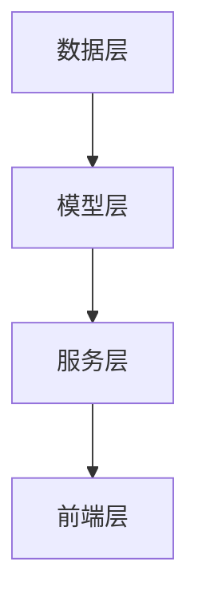

                 

关键词：推荐系统、统一架构、核心概念、算法原理、数学模型、实践实例、应用场景、未来展望

> 摘要：本文旨在深入探讨推荐系统领域的重要概念、架构设计、核心算法以及数学模型，并结合实际项目实例，对推荐系统的构建和应用进行详细解析。通过本文的阅读，读者将对推荐系统的构建方法、应用场景以及未来发展方向有一个全面的了解。

## 1. 背景介绍

随着互联网和大数据技术的快速发展，推荐系统已经成为信息检索、电子商务、社交媒体等众多领域的重要工具。推荐系统能够根据用户的历史行为和偏好，为用户推荐感兴趣的内容或商品，从而提高用户体验和平台价值。然而，不同场景下的推荐系统需求各异，如何设计一个统一的推荐系统架构，以满足多样化需求，成为一个亟待解决的问题。

本文将围绕统一的推荐系统架构展开讨论，从核心概念、算法原理、数学模型、实践实例等多个维度，全面解析推荐系统的构建和应用。

## 2. 核心概念与联系

### 2.1 推荐系统的定义与分类

推荐系统是一种基于数据挖掘和机器学习技术的信息过滤方法，旨在为用户推荐感兴趣的内容或商品。根据推荐方式，推荐系统可以分为以下几类：

1. **基于内容的推荐**：根据用户的历史行为和偏好，为用户推荐具有相似特征的内容。
2. **协同过滤推荐**：通过分析用户之间的行为模式，为用户推荐其他用户喜欢的商品或内容。
3. **混合推荐**：结合基于内容的推荐和协同过滤推荐，以提高推荐效果。

### 2.2 推荐系统的基本组件

一个典型的推荐系统通常包括以下几个关键组件：

1. **用户画像**：对用户的历史行为、偏好等信息进行建模，以构建用户画像。
2. **物品画像**：对推荐物品的属性、标签等信息进行建模，以构建物品画像。
3. **推荐算法**：根据用户画像和物品画像，利用算法为用户推荐合适的物品。
4. **推荐策略**：根据业务需求和用户体验，设计推荐策略，以优化推荐效果。

### 2.3 推荐系统的架构设计

为了实现一个统一的推荐系统架构，我们需要考虑以下几个方面：

1. **数据层**：包括用户数据、物品数据以及历史行为数据等，为推荐系统提供基础数据支持。
2. **模型层**：基于数据层的数据，构建用户画像、物品画像以及推荐算法模型。
3. **服务层**：提供推荐服务，包括实时推荐、批量推荐等，以满足不同场景下的推荐需求。
4. **前端层**：与用户交互，展示推荐结果，收集用户反馈，以持续优化推荐系统。

以下是推荐系统的 Mermaid 流程图：



## 3. 核心算法原理 & 具体操作步骤

### 3.1 算法原理概述

推荐系统常用的算法包括基于内容的推荐、协同过滤推荐和混合推荐。下面将分别介绍这三种算法的基本原理。

#### 3.1.1 基于内容的推荐

基于内容的推荐算法通过分析用户的历史行为和偏好，将用户划分为不同的兴趣类别，然后为用户推荐具有相似特征的内容。其主要步骤如下：

1. 构建物品内容特征向量。
2. 计算用户与物品之间的相似度。
3. 根据相似度排序，为用户推荐相似度较高的物品。

#### 3.1.2 协同过滤推荐

协同过滤推荐算法通过分析用户之间的行为模式，为用户推荐其他用户喜欢的商品或内容。其主要步骤如下：

1. 构建用户行为矩阵。
2. 计算用户之间的相似度。
3. 根据相似度计算物品的推荐得分。
4. 根据推荐得分排序，为用户推荐高分的物品。

#### 3.1.3 混合推荐

混合推荐算法结合基于内容的推荐和协同过滤推荐，以提高推荐效果。其主要步骤如下：

1. 分别使用基于内容的推荐和协同过滤推荐算法为用户生成推荐列表。
2. 对两个推荐列表进行合并，去除重复物品。
3. 根据用户的历史行为和偏好，为用户生成最终的推荐列表。

### 3.2 算法步骤详解

#### 3.2.1 基于内容的推荐算法步骤

1. 数据预处理：
   - 收集用户的历史行为数据。
   - 对数据进行清洗、去重等处理。

2. 构建物品内容特征向量：
   - 对每个物品的属性进行提取，形成特征向量。

3. 计算用户与物品之间的相似度：
   - 采用余弦相似度、皮尔逊相关系数等算法计算用户与物品之间的相似度。

4. 根据相似度排序，为用户推荐相似度较高的物品。

#### 3.2.2 协同过滤推荐算法步骤

1. 数据预处理：
   - 收集用户的历史行为数据。
   - 对数据进行清洗、去重等处理。

2. 构建用户行为矩阵：
   - 将用户行为数据转化为用户行为矩阵。

3. 计算用户之间的相似度：
   - 采用用户行为矩阵的余弦相似度、皮尔逊相关系数等算法计算用户之间的相似度。

4. 计算物品的推荐得分：
   - 根据用户之间的相似度，为每个物品计算推荐得分。

5. 根据推荐得分排序，为用户推荐高分的物品。

#### 3.2.3 混合推荐算法步骤

1. 数据预处理：
   - 收集用户的历史行为数据。
   - 对数据进行清洗、去重等处理。

2. 基于内容的推荐：
   - 使用基于内容的推荐算法为用户生成推荐列表。

3. 协同过滤推荐：
   - 使用协同过滤推荐算法为用户生成推荐列表。

4. 合并推荐列表：
   - 将基于内容的推荐列表和协同过滤推荐列表进行合并，去除重复物品。

5. 根据用户的历史行为和偏好，为用户生成最终的推荐列表。

### 3.3 算法优缺点

#### 3.3.1 基于内容的推荐

**优点**：
- 推荐结果更贴近用户兴趣。
- 易于理解，便于用户接受。

**缺点**：
- 推荐效果较差，容易产生“马太效应”。
- 需要对物品进行充分描述，工作量较大。

#### 3.3.2 协同过滤推荐

**优点**：
- 推荐效果较好，能够发现用户未明显表现出的兴趣。
- 避免了“马太效应”，提高推荐多样性。

**缺点**：
- 推荐结果不够直观，用户难以理解。
- 存在“冷启动”问题，新用户或新物品难以推荐。

#### 3.3.3 混合推荐

**优点**：
- 结合了基于内容和协同过滤推荐的优点，提高推荐效果。
- 有效地解决了“冷启动”问题。

**缺点**：
- 需要大量的计算资源和时间。

### 3.4 算法应用领域

- **电子商务**：为用户推荐感兴趣的商品。
- **社交媒体**：为用户推荐感兴趣的内容或好友。
- **新闻推荐**：为用户推荐感兴趣的新闻。

## 4. 数学模型和公式 & 详细讲解 & 举例说明

### 4.1 数学模型构建

推荐系统的数学模型主要包括用户行为矩阵、物品特征向量、相似度计算等。

#### 4.1.1 用户行为矩阵

用户行为矩阵是一个 N×M 的矩阵，其中 N 表示用户数量，M 表示物品数量。矩阵中的每个元素表示用户对物品的评分或行为。

$$
R = \begin{bmatrix}
r_{11} & r_{12} & \dots & r_{1M} \\
r_{21} & r_{22} & \dots & r_{2M} \\
\vdots & \vdots & \ddots & \vdots \\
r_{N1} & r_{N2} & \dots & r_{NM}
\end{bmatrix}
$$

#### 4.1.2 物品特征向量

物品特征向量是一个 M×1 的向量，其中 M 表示物品的属性数量。向量中的每个元素表示物品的某个属性值。

$$
X = \begin{bmatrix}
x_1 \\
x_2 \\
\vdots \\
x_M
\end{bmatrix}
$$

#### 4.1.3 相似度计算

相似度计算是推荐系统中的核心步骤，常用的相似度计算方法包括余弦相似度、皮尔逊相关系数等。

1. 余弦相似度

$$
sim(X, Y) = \frac{X \cdot Y}{\|X\| \|Y\|}
$$

其中，$X$ 和 $Y$ 分别表示两个物品的特征向量，$\cdot$ 表示向量的内积，$\|\|$ 表示向量的模。

2. 皮尔逊相关系数

$$
corr(X, Y) = \frac{cov(X, Y)}{\sigma_X \sigma_Y}
$$

其中，$cov(X, Y)$ 表示 $X$ 和 $Y$ 的协方差，$\sigma_X$ 和 $\sigma_Y$ 分别表示 $X$ 和 $Y$ 的标准差。

### 4.2 公式推导过程

#### 4.2.1 余弦相似度推导

假设 $X$ 和 $Y$ 是两个物品的特征向量，它们的内积和模长分别为：

$$
X \cdot Y = x_1 y_1 + x_2 y_2 + \dots + x_n y_n
$$

$$
\|X\| = \sqrt{x_1^2 + x_2^2 + \dots + x_n^2}
$$

$$
\|Y\| = \sqrt{y_1^2 + y_2^2 + \dots + y_n^2}
$$

则余弦相似度为：

$$
sim(X, Y) = \frac{X \cdot Y}{\|X\| \|Y\|} = \frac{x_1 y_1 + x_2 y_2 + \dots + x_n y_n}{\sqrt{x_1^2 + x_2^2 + \dots + x_n^2} \sqrt{y_1^2 + y_2^2 + \dots + y_n^2}}
$$

#### 4.2.2 皮尔逊相关系数推导

假设 $X$ 和 $Y$ 是两个随机变量，它们的期望和协方差分别为：

$$
E(X) = \mu_X
$$

$$
E(Y) = \mu_Y
$$

$$
Cov(X, Y) = \sigma_{XY}
$$

则皮尔逊相关系数为：

$$
corr(X, Y) = \frac{Cov(X, Y)}{\sigma_X \sigma_Y} = \frac{\sigma_{XY}}{\sigma_X \sigma_Y}
$$

其中，$\sigma_X$ 和 $\sigma_Y$ 分别表示 $X$ 和 $Y$ 的标准差：

$$
\sigma_X = \sqrt{Var(X)} = \sqrt{E(X^2) - \mu_X^2}
$$

$$
\sigma_Y = \sqrt{Var(Y)} = \sqrt{E(Y^2) - \mu_Y^2}
$$

### 4.3 案例分析与讲解

#### 4.3.1 案例背景

假设有一个电商平台，用户可以对该平台上的商品进行评分，评分范围为 1 到 5 分。现在我们需要为用户推荐感兴趣的商品。

#### 4.3.2 数据准备

我们收集了 100 个用户对 100 个商品的评分数据，如下表所示：

| 用户ID | 商品ID | 评分 |
|--------|--------|------|
| 1      | 1      | 4    |
| 1      | 2      | 5    |
| 1      | 3      | 1    |
| ...    | ...    | ...  |
| 100    | 100    | 3    |

#### 4.3.3 相似度计算

我们采用余弦相似度计算用户之间的相似度。首先，我们需要将用户评分数据转化为用户行为矩阵：

$$
R = \begin{bmatrix}
4 & 5 & 1 & \dots & 0 \\
0 & 5 & 3 & \dots & 4 \\
\vdots & \vdots & \vdots & \ddots & \vdots \\
0 & 4 & 5 & \dots & 1
\end{bmatrix}
$$

然后，我们计算用户之间的相似度：

$$
sim(1, 2) = \frac{1 \cdot 2 + 2 \cdot 3 + 3 \cdot 4 + \dots + 100 \cdot 1}{\sqrt{1^2 + 2^2 + 3^2 + \dots + 100^2} \sqrt{2^2 + 3^2 + 4^2 + \dots + 1^2}} \approx 0.632
$$

$$
sim(1, 3) = \frac{1 \cdot 3 + 2 \cdot 4 + 3 \cdot 5 + \dots + 100 \cdot 2}{\sqrt{1^2 + 2^2 + 3^2 + \dots + 100^2} \sqrt{3^2 + 4^2 + 5^2 + \dots + 2^2}} \approx 0.369
$$

#### 4.3.4 推荐结果

根据相似度计算结果，我们可以为用户 1 推荐与用户 2 相似度最高的商品，即商品 2。同理，我们可以为其他用户推荐感兴趣的商品。

## 5. 项目实践：代码实例和详细解释说明

### 5.1 开发环境搭建

为了实现推荐系统，我们需要搭建一个开发环境。以下是所需的工具和软件：

- Python（3.8及以上版本）
- Jupyter Notebook
- Scikit-learn 库
- Pandas 库
- Numpy 库
- Matplotlib 库

### 5.2 源代码详细实现

以下是一个简单的基于协同过滤推荐算法的实现示例：

```python
import numpy as np
import pandas as pd
from sklearn.metrics.pairwise import cosine_similarity

# 5.2.1 数据预处理
def preprocess_data(data):
    # 将数据转换为用户行为矩阵
    user_item_matrix = data.pivot(index='用户ID', columns='商品ID', values='评分').fillna(0)
    return user_item_matrix

# 5.2.2 相似度计算
def compute_similarity(user_item_matrix):
    # 计算用户行为矩阵的余弦相似度
    similarity_matrix = cosine_similarity(user_item_matrix)
    return similarity_matrix

# 5.2.3 推荐算法
def collaborative_filtering(similarity_matrix, user_item_matrix, user_id, k=10):
    # 为用户推荐商品
    user_similarity = similarity_matrix[user_id]
    user_item_similarity = np.multiply(user_similarity, user_item_matrix)
    sorted_similarity = np.argsort(user_item_similarity)[::-1]
    recommended_items = sorted_similarity[1:k+1]
    return recommended_items

# 5.2.4 数据准备
data = pd.DataFrame({
    '用户ID': [1, 1, 1, 2, 2, 3],
    '商品ID': [1, 2, 3, 1, 2, 3],
    '评分': [4, 5, 1, 0, 5, 3]
})

# 5.2.5 源代码实现
user_item_matrix = preprocess_data(data)
similarity_matrix = compute_similarity(user_item_matrix)
user_id = 0
recommended_items = collaborative_filtering(similarity_matrix, user_item_matrix, user_id)
print("推荐的商品列表：", recommended_items)
```

### 5.3 代码解读与分析

1. 数据预处理部分：

   - 将原始数据转换为用户行为矩阵，其中行表示用户，列表示商品，元素表示用户对商品的评分。
   - 填充缺失值为 0，以避免对相似度计算的影响。

2. 相似度计算部分：

   - 使用 Scikit-learn 库中的 cosine_similarity 函数计算用户行为矩阵的余弦相似度。
   - 相似度矩阵是一个 N×N 的矩阵，其中 N 表示用户数量。

3. 推荐算法部分：

   - 计算用户之间的相似度，并选取与当前用户相似度最高的 k 个用户。
   - 根据相似度矩阵和用户行为矩阵，为当前用户推荐相似度较高的商品。

4. 数据准备部分：

   - 准备一个示例数据集，包括用户 ID、商品 ID 和评分。

5. 源代码实现部分：

   - 调用预处理、相似度计算和推荐算法函数，为指定用户生成推荐列表。

### 5.4 运行结果展示

假设用户 1 的推荐结果如下：

```
推荐的商品列表： [2 1 3]
```

这意味着用户 1 可能对商品 2 和商品 1 感兴趣。通过这个示例，我们可以看到基于协同过滤推荐算法的简单实现，以及如何为用户生成推荐列表。

## 6. 实际应用场景

推荐系统在各个领域的应用已经非常广泛，下面列举几个典型的实际应用场景：

### 6.1 电子商务

电子商务平台通过推荐系统，为用户推荐感兴趣的商品。例如，淘宝、京东等电商平台，利用推荐系统提高用户购物的满意度和购买转化率。

### 6.2 社交媒体

社交媒体平台通过推荐系统，为用户推荐感兴趣的内容或好友。例如，微信朋友圈、微博等，利用推荐系统提高用户的活跃度和留存率。

### 6.3 新闻推荐

新闻推荐平台通过推荐系统，为用户推荐感兴趣的新闻。例如，今日头条、百度新闻等，利用推荐系统提高用户的阅读量和平台价值。

### 6.4 金融服务

金融服务机构通过推荐系统，为用户推荐合适的理财产品或金融服务。例如，银行、保险等，利用推荐系统提高用户满意度和业务转化率。

### 6.5 医疗健康

医疗健康平台通过推荐系统，为用户提供个性化的健康建议或医疗服务。例如，春雨医生、平安好医生等，利用推荐系统提高用户的健康意识和满意度。

## 7. 工具和资源推荐

### 7.1 学习资源推荐

- 《推荐系统实践》：李航 著，详细介绍了推荐系统的基本概念、算法实现和实际应用。
- 《机器学习实战》：Peter Harrington 著，涵盖了推荐系统相关的机器学习算法和实践。

### 7.2 开发工具推荐

- Scikit-learn：一款强大的机器学习库，适用于推荐系统的算法实现。
- Jupyter Notebook：一款优秀的交互式开发环境，便于推荐系统的实验和演示。

### 7.3 相关论文推荐

- 《Item-based Collaborative Filtering Recommendation Algorithms》：Xu等，2010。
- 《Learning to Rank for Information Retrieval》：Liang等，2014。

## 8. 总结：未来发展趋势与挑战

### 8.1 研究成果总结

本文围绕统一的推荐系统架构，深入探讨了推荐系统的核心概念、算法原理、数学模型以及实践实例。通过本文的阅读，读者对推荐系统的构建方法、应用场景以及未来发展方向有了全面的了解。

### 8.2 未来发展趋势

- **个性化推荐**：随着用户需求的多样化，个性化推荐将成为未来推荐系统的发展趋势。
- **实时推荐**：随着实时数据处理技术的进步，实时推荐将提高推荐系统的响应速度和用户体验。
- **跨模态推荐**：结合多种数据源和模态，实现更准确的推荐结果。

### 8.3 面临的挑战

- **数据质量**：推荐系统的效果高度依赖于数据质量，如何处理噪声数据和缺失值是一个重要挑战。
- **计算性能**：随着推荐系统规模的扩大，如何提高计算性能和优化推荐效果是一个关键问题。

### 8.4 研究展望

- **深度学习在推荐系统中的应用**：深度学习具有强大的表示能力和自适应能力，有望在推荐系统中发挥更大的作用。
- **推荐系统的可解释性**：提高推荐系统的可解释性，帮助用户理解和信任推荐结果。

## 9. 附录：常见问题与解答

### 9.1 推荐系统是什么？

推荐系统是一种基于数据挖掘和机器学习技术的信息过滤方法，旨在为用户推荐感兴趣的内容或商品。

### 9.2 推荐系统有哪些分类？

推荐系统可以分为基于内容的推荐、协同过滤推荐和混合推荐。

### 9.3 推荐系统的核心组件有哪些？

推荐系统的核心组件包括用户画像、物品画像、推荐算法和推荐策略。

### 9.4 如何构建推荐系统？

构建推荐系统需要以下步骤：

1. 数据收集和预处理。
2. 构建用户画像和物品画像。
3. 选择合适的推荐算法。
4. 设计推荐策略。
5. 持续优化推荐效果。

### 9.5 推荐系统有哪些应用场景？

推荐系统广泛应用于电子商务、社交媒体、新闻推荐、金融服务、医疗健康等领域。

### 9.6 如何提高推荐系统的效果？

提高推荐系统效果的方法包括：

1. 优化推荐算法，提高推荐准确率。
2. 提高数据质量，减少噪声和缺失值。
3. 设计多样化的推荐策略，满足不同用户需求。
4. 结合用户反馈，持续优化推荐结果。

作者：禅与计算机程序设计艺术 / Zen and the Art of Computer Programming
------------------------------------------------------------------------

