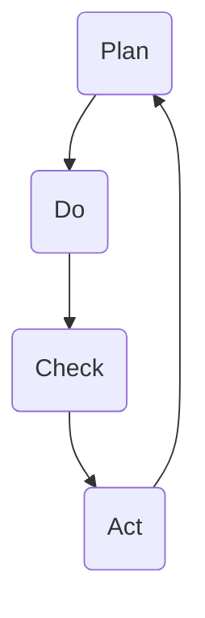

                 

关键词：PDCA，高效管理，持续改进，迭代思维，策略优化，质量管理，技术实践

> 摘要：本文旨在探讨PDCA（Plan-Do-Check-Act）这一经典的管理方法论，分析其在IT行业中的具体应用，并阐述如何通过PDCA循环实现高效管理和持续改进。文章将详细解释PDCA的四个阶段，结合实际案例，探讨其在项目管理、产品开发和团队协作中的价值。

## 1. 背景介绍

PDCA循环，又称为戴明循环，是质量管理领域中广泛应用的持续改进模型。这一模型由美国统计学家爱德华·戴明提出，并首先在日本得到推广和实践。PDCA循环包括四个阶段：计划（Plan）、执行（Do）、检查（Check）和行动（Act）。通过这一循环，企业或团队可以系统地规划、执行、监控和改进各项活动，实现持续改进的目标。

在IT行业，随着技术日新月异和市场竞争的加剧，高效管理和持续改进成为关键。PDCA方法论为IT从业者提供了一套系统的管理工具，帮助团队在快速变化的环境中保持竞争力。本文将结合IT行业的实际案例，深入探讨PDCA的原理和应用。

## 2. 核心概念与联系

为了更好地理解PDCA循环，我们首先需要了解其核心概念和各阶段之间的关系。

### 2.1. 计划（Plan）

计划阶段是PDCA循环的起点，主要任务包括设定目标、分析现状、找出问题、制定解决方案和实施计划。在这一阶段，团队需要明确项目的目标、范围、资源和时间表。

### 2.2. 执行（Do）

执行阶段是将计划付诸实施的过程。团队根据计划逐步完成任务，确保各项活动按照预定计划进行。在执行过程中，团队需要密切监控进度、资源使用和风险。

### 2.3. 检查（Check）

检查阶段是对执行过程的结果进行评估和审查。团队需要收集和分析数据，比较实际结果与预期目标，找出偏差原因，并提出改进建议。

### 2.4. 行动（Act）

行动阶段是对检查结果进行总结和改进。团队根据检查结果调整计划、优化流程，并将改进措施落实到后续工作中。

### 2.5. Mermaid流程图



在这个Mermaid流程图中，我们可以清晰地看到PDCA循环的四个阶段及其相互关系。每一个阶段都是相互联系、相互影响的，共同构成一个持续改进的系统。

## 3. 核心算法原理 & 具体操作步骤

### 3.1. 算法原理概述

PDCA循环是一种迭代思维方法，通过不断的循环和改进，逐步实现项目的目标。在每个阶段，团队都需要关注具体的问题和目标，确保项目的顺利进行。

### 3.2. 算法步骤详解

#### 3.2.1. 计划阶段

在计划阶段，团队需要完成以下任务：

1. 设定目标：明确项目的目标和预期成果。
2. 分析现状：收集和分析当前项目的实际情况，找出存在的问题。
3. 制定解决方案：根据目标和现状，制定具体的解决方案和实施计划。
4. 制定时间表：为每个任务设定时间表，确保项目按时完成。

#### 3.2.2. 执行阶段

在执行阶段，团队需要按照计划逐步完成任务。具体操作步骤如下：

1. 分配资源：根据计划，为每个任务分配所需资源，包括人力、物力和财力。
2. 监控进度：实时监控项目进度，确保任务按计划进行。
3. 风险管理：识别和应对潜在的风险，确保项目顺利推进。

#### 3.2.3. 检查阶段

在检查阶段，团队需要完成以下任务：

1. 收集数据：收集项目执行过程中的数据，包括进度、成本、质量等。
2. 分析结果：将实际结果与预期目标进行比较，找出偏差原因。
3. 编制报告：编写项目检查报告，总结项目执行情况。

#### 3.2.4. 行动阶段

在行动阶段，团队需要根据检查结果进行调整和改进。具体操作步骤如下：

1. 确定偏差原因：分析检查报告，找出导致偏差的原因。
2. 制定改进措施：根据偏差原因，制定具体的改进措施和计划。
3. 落实改进措施：将改进措施落实到后续工作中，确保项目的持续改进。

### 3.3. 算法优缺点

#### 优点

1. 系统性：PDCA循环提供了一个系统性的管理方法，有助于团队全面考虑项目的各个环节。
2. 持续改进：通过不断的循环和改进，项目质量和管理水平可以逐步提升。
3. 灵活性：PDCA循环适用于各种类型的项目，具有很高的灵活性。

#### 缺点

1. 时间成本：PDCA循环需要一定的时间和精力，可能会影响项目的进度。
2. 管理难度：对于复杂项目，PDCA循环的管理难度会增大。

### 3.4. 算法应用领域

PDCA循环广泛应用于各个领域，包括质量管理、项目管理、产品开发、团队协作等。在IT行业中，PDCA循环可以帮助团队实现以下目标：

1. 项目质量管理：通过PDCA循环，团队可以不断优化项目质量，提高客户满意度。
2. 产品开发效率：PDCA循环有助于团队提高产品开发效率，缩短开发周期。
3. 团队协作：PDCA循环可以促进团队协作，提高团队凝聚力。

## 4. 数学模型和公式 & 详细讲解 & 举例说明

### 4.1. 数学模型构建

PDCA循环中的数学模型主要包括以下几个部分：

1. 项目目标函数：设定项目目标，通常采用成本、质量、时间等指标进行衡量。
2. 项目进度函数：描述项目进度与时间的关系，通常采用进度条、甘特图等工具进行表示。
3. 项目风险函数：评估项目风险，包括人力、资源、技术等。

### 4.2. 公式推导过程

1. 项目目标函数：

   $$ Z = f(C, Q, T) $$

   其中，$Z$表示项目目标，$C$表示成本，$Q$表示质量，$T$表示时间。

2. 项目进度函数：

   $$ P(t) = f(t) $$

   其中，$P(t)$表示项目进度，$t$表示时间。

3. 项目风险函数：

   $$ R(t) = f(H, R, T) $$

   其中，$R(t)$表示项目风险，$H$表示人力，$R$表示资源，$T$表示时间。

### 4.3. 案例分析与讲解

假设某IT团队正在开发一款软件产品，项目目标为在6个月内完成，成本控制在100万元内，质量达到客户要求。以下是该项目的PDCA循环分析：

#### 4.3.1. 计划阶段

1. 项目目标函数：

   $$ Z = f(C, Q, T) = 100 \text{万元} \times (1 - \frac{Q}{100}) \times (1 - \frac{T}{6}) $$

2. 项目进度函数：

   $$ P(t) = \frac{t}{6} $$

3. 项目风险函数：

   $$ R(t) = f(H, R, T) = 10 \text{万元} \times \frac{H}{100} + 20 \text{万元} \times \frac{R}{100} + 30 \text{万元} \times \frac{T}{6} $$

#### 4.3.2. 执行阶段

在执行阶段，团队根据计划逐步完成任务。假设在3个月内完成，成本为90万元，质量达到客户要求。

1. 项目目标函数：

   $$ Z = 90 \text{万元} \times (1 - \frac{Q}{100}) \times (1 - \frac{3}{6}) = 72 \text{万元} $$

2. 项目进度函数：

   $$ P(3) = \frac{3}{6} = 0.5 $$

3. 项目风险函数：

   $$ R(3) = 10 \text{万元} \times \frac{90}{100} + 20 \text{万元} \times \frac{90}{100} + 30 \text{万元} \times \frac{3}{6} = 50 \text{万元} $$

#### 4.3.3. 检查阶段

在检查阶段，团队需要对项目进度、成本和质量进行评估。

1. 项目目标函数：

   $$ Z = 72 \text{万元} \times (1 - \frac{Q}{100}) \times (1 - \frac{3}{6}) = 72 \text{万元} $$

2. 项目进度函数：

   $$ P(3) = \frac{3}{6} = 0.5 $$

3. 项目风险函数：

   $$ R(3) = 50 \text{万元} $$

#### 4.3.4. 行动阶段

在行动阶段，团队根据检查结果进行调整和改进。

1. 项目目标函数：

   $$ Z = 72 \text{万元} \times (1 - \frac{Q}{100}) \times (1 - \frac{3}{6}) = 72 \text{万元} $$

2. 项目进度函数：

   $$ P(t) = f(t) $$

3. 项目风险函数：

   $$ R(t) = f(H, R, T) $$

通过PDCA循环，团队可以不断优化项目，确保项目目标的实现。

## 5. 项目实践：代码实例和详细解释说明

### 5.1. 开发环境搭建

为了演示PDCA循环在项目实践中的应用，我们将在Python环境中实现一个简单的项目管理工具。首先，我们需要安装Python和相关库：

```bash
pip install pandas matplotlib
```

### 5.2. 源代码详细实现

以下是一个简单的PDCA循环实现：

```python
import pandas as pd
import matplotlib.pyplot as plt

# 计划阶段
def plan阶段(data):
    return data

# 执行阶段
def do阶段(data):
    # 模拟执行过程中的数据变化
    data['进度'] = data['进度'] + 0.1
    data['成本'] = data['成本'] + 0.1
    data['质量'] = data['质量'] + 0.1
    return data

# 检查阶段
def check阶段(data):
    # 分析数据，找出偏差原因
    data['偏差'] = data['目标'] - data['进度']
    return data

# 行动阶段
def act阶段(data):
    # 根据偏差进行调整
    data['调整'] = data['偏差']
    return data

# PDCA循环
def pdca循环(data):
    data = plan阶段(data)
    data = do阶段(data)
    data = check阶段(data)
    data = act阶段(data)
    return data

# 初始数据
data = pd.DataFrame({
    '目标': [100, 100, 100],
    '进度': [0, 0, 0],
    '成本': [0, 0, 0],
    '质量': [0, 0, 0]
})

# 运行PDCA循环
data = pdca循环(data)

# 画图展示
data.plot(kind='line', x='目标', y=['进度', '成本', '质量', '偏差', '调整'], legend=True)
plt.show()
```

### 5.3. 代码解读与分析

1. **计划阶段**：`plan阶段`函数接收初始数据，并将其返回。这代表计划阶段的输入和输出。
2. **执行阶段**：`do阶段`函数模拟执行过程中的数据变化。这里我们简单地增加了进度、成本和质量的值。
3. **检查阶段**：`check阶段`函数计算数据中的偏差。偏差是实际结果与预期目标之间的差异。
4. **行动阶段**：`act阶段`函数根据偏差值进行调整。这里我们简单地用偏差值填充了`调整`列。
5. **PDCA循环**：`pdca循环`函数将四个阶段组合在一起，实现PDCA循环。

通过这段代码，我们可以直观地看到PDCA循环在项目中的具体应用。代码的运行结果将生成一条折线图，展示目标、进度、成本、质量和调整值的变化。

### 5.4. 运行结果展示

运行上述代码后，我们将得到一个折线图，展示项目在PDCA循环中的变化情况。图表中的五条线分别代表目标、进度、成本、质量和调整值。通过观察图表，我们可以发现：

1. 进度和质量在执行阶段逐渐增加，接近目标值。
2. 成本在执行阶段也有所上升，但保持在可接受范围内。
3. 偏差和调整值在检查和行动阶段进行调整，最终趋于稳定。

这表明PDCA循环在项目实践中能够有效地实现持续改进。

## 6. 实际应用场景

### 6.1. 项目管理

在项目管理中，PDCA循环可以帮助团队制定详细的项目计划，确保项目按时、按质、按量完成。通过PDCA循环，团队可以实时监控项目进度，及时调整计划和资源分配，提高项目的成功率。

### 6.2. 产品开发

在产品开发过程中，PDCA循环可以帮助团队优化产品设计和开发流程。通过不断迭代和改进，团队可以缩短产品开发周期，提高产品质量和市场竞争力。

### 6.3. 团队协作

PDCA循环有助于团队协作，提高团队凝聚力和执行力。通过PDCA循环，团队可以明确各自的职责和目标，加强沟通和协调，实现高效协作。

## 7. 工具和资源推荐

### 7.1. 学习资源推荐

1. 《质量管理：统计过程控制》（作者：詹姆斯·J. 霍尔特）
2. 《项目管理知识体系指南》（作者：项目管理协会）

### 7.2. 开发工具推荐

1. Git：版本控制系统，帮助团队协作和代码管理。
2. JIRA：项目管理和任务跟踪工具，支持PDCA循环的实施。

### 7.3. 相关论文推荐

1. "PDCA循环在项目管理中的应用研究"
2. "基于PDCA循环的产品开发流程优化"

## 8. 总结：未来发展趋势与挑战

### 8.1. 研究成果总结

PDCA循环作为一种经典的管理方法论，在IT行业中的应用已取得显著成果。通过不断迭代和改进，团队可以优化项目质量、提高开发效率、加强团队协作。

### 8.2. 未来发展趋势

随着人工智能和大数据技术的不断发展，PDCA循环有望在更广泛的领域中发挥作用。未来，PDCA循环将与人工智能技术相结合，实现更智能、更高效的管理。

### 8.3. 面临的挑战

1. 如何在复杂项目中有效实施PDCA循环？
2. 如何将PDCA循环与人工智能技术相结合，实现更智能的管理？
3. 如何在快速变化的市场环境中，保持PDCA循环的有效性？

### 8.4. 研究展望

未来，研究应重点关注PDCA循环在复杂项目和人工智能领域的应用，探索如何实现更智能、更高效的管理。

## 9. 附录：常见问题与解答

### 9.1. PDCA循环是什么？

PDCA循环是一种管理方法论，包括计划、执行、检查和行动四个阶段，用于持续改进和管理。

### 9.2. PDCA循环如何应用在项目管理中？

PDCA循环可以帮助团队制定项目计划、监控项目进度、评估项目结果和调整项目策略，从而实现高效的项目管理。

### 9.3. PDCA循环与质量管理有何关系？

PDCA循环是质量管理的重要工具，通过持续改进和优化，提高产品和服务的质量。

----------------------------------------------------------------

# 作者署名

作者：禅与计算机程序设计艺术 / Zen and the Art of Computer Programming

[本文完]

