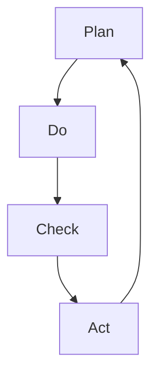

                 

关键词：PDCA循环、管理者、执行、流程管理、持续改进、质量管理体系

> 摘要：本文旨在为管理者提供PDCA循环的深度理解与应用指南。通过详细解析PDCA循环的四个阶段——计划（Plan）、执行（Do）、检查（Check）和行动（Act），探讨其在现代企业管理中的重要性。文章还将结合实际案例，展示PDCA循环在提升企业运营效率和产品质量方面的应用效果，并探讨其未来发展趋势和面临的挑战。

## 1. 背景介绍

在企业管理中，持续改进和效率提升是永恒的主题。PDCA循环，即计划（Plan）、执行（Do）、检查（Check）和行动（Act），是一种广泛应用的持续改进方法。它起源于质量管理理论，由美国质量管理专家爱德华兹·戴明提出，并在全球范围内得到了广泛应用。

PDCA循环的核心在于通过循环迭代，不断优化流程和产品质量，实现企业管理的持续改进。这种循环不仅适用于质量管理，还可应用于产品开发、市场营销、人力资源等多个领域，是一种通用的管理方法论。

本文将详细探讨PDCA循环的理论基础、实施步骤和应用效果，帮助管理者更好地理解和应用这一重要管理工具，提升企业竞争力。

## 2. 核心概念与联系

### 2.1 PDCA循环的概念

PDCA循环是一种管理工具，它将工作过程分为四个阶段：计划、执行、检查和行动。每个阶段都有其特定的任务和目标。

- **计划（Plan）**：在这个阶段，管理者需要制定具体的计划，包括目标设定、资源分配、任务分解等。计划是PDCA循环的基础，决定了后续工作的方向和效果。

- **执行（Do）**：执行阶段是将计划付诸行动的过程。这个阶段要求团队成员严格按照计划执行任务，确保各项工作的顺利进行。

- **检查（Check）**：检查阶段是对执行结果进行评估和审核。通过检查，管理者可以了解计划的执行情况，发现潜在的问题和不足。

- **行动（Act）**：行动阶段是对检查结果进行处理和反馈。根据检查结果，管理者需要制定相应的改进措施，确保问题的解决和持续改进。

### 2.2 PDCA循环的架构

PDCA循环的架构可以简化为一个环形模型，四个阶段形成一个闭环。每个阶段都是前一阶段的延续和反馈，同时为下一个阶段提供基础。

```
[计划（Plan）] --> [执行（Do）] --> [检查（Check）] --> [行动（Act）]
```

这种闭环结构保证了PDCA循环的不断迭代和持续改进。

### 2.3 PDCA循环的关联关系

PDCA循环的四个阶段相互关联，形成一个有机整体。

- **计划（Plan）** 为执行（Do）提供目标和指导；
- **执行（Do）** 为检查（Check）提供实际操作结果；
- **检查（Check）** 为行动（Act）提供评估和反馈；
- **行动（Act）** 为下一轮计划提供经验和改进建议。

这种关联关系使得PDCA循环能够在管理实践中得到广泛应用。

### 2.4 Mermaid 流程图

以下是一个简单的Mermaid流程图，展示了PDCA循环的四个阶段及其关联关系：



此图简洁明了地展示了PDCA循环的循环特性，有助于管理者更好地理解和应用这一管理工具。

## 3. 核心算法原理 & 具体操作步骤

### 3.1 算法原理概述

PDCA循环是一种基于迭代和反馈的管理方法。其核心思想是通过计划、执行、检查和行动四个阶段的循环，不断优化管理流程和产品质量。

- **计划（Plan）**：明确目标和制定计划；
- **执行（Do）**：执行计划并收集数据；
- **检查（Check）**：评估执行结果并进行比较；
- **行动（Act）**：根据检查结果采取行动，改进不足。

这种循环不仅能够帮助管理者及时发现和解决问题，还能促进企业的持续改进和成长。

### 3.2 算法步骤详解

#### 3.2.1 计划（Plan）

在计划阶段，管理者需要明确以下关键要素：

- **目标设定**：明确要实现的具体目标，如提高产品质量、提升客户满意度等；
- **资源分配**：根据目标需求，合理分配人力、物力和财力资源；
- **任务分解**：将大任务分解为小任务，明确每个任务的负责人和时间节点。

#### 3.2.2 执行（Do）

在执行阶段，团队成员按照计划进行工作，具体步骤如下：

- **任务分配**：根据任务分解，将任务分配给团队成员；
- **执行监控**：对任务执行情况进行实时监控，确保各项工作按计划进行；
- **数据收集**：在执行过程中，收集与任务相关的数据，如时间、质量、成本等。

#### 3.2.3 检查（Check）

在检查阶段，管理者需要对执行结果进行评估和审核，具体步骤如下：

- **结果比较**：将实际执行结果与计划目标进行对比，分析差异和原因；
- **问题识别**：识别执行过程中出现的问题和不足，如进度延误、质量不达标等；
- **反馈收集**：收集团队成员的反馈意见，了解他们在执行过程中的感受和建议。

#### 3.2.4 行动（Act）

在行动阶段，管理者需要根据检查结果采取相应的改进措施，具体步骤如下：

- **问题解决**：针对识别出的问题，制定解决方案并实施；
- **经验总结**：对本次循环的经验和教训进行总结，为下一轮计划提供参考；
- **持续改进**：将改进措施纳入下一轮计划，确保问题的彻底解决和持续改进。

### 3.3 算法优缺点

#### 3.3.1 优点

- **循环迭代**：PDCA循环通过不断迭代，使问题得到及时发现和解决，促进企业的持续改进；
- **全面覆盖**：PDCA循环涵盖了计划、执行、检查和行动四个阶段，确保管理过程的全面性和系统性；
- **灵活应用**：PDCA循环适用于各种管理领域，如质量管理、产品开发、市场营销等。

#### 3.3.2 缺点

- **执行难度**：PDCA循环需要团队成员的积极参与和高度执行力，否则容易流于形式；
- **时间成本**：PDCA循环需要一定的时间周期，对于急于求成的企业可能不够高效。

### 3.4 算法应用领域

PDCA循环在企业管理中具有广泛的应用领域，如：

- **质量管理**：通过PDCA循环，企业可以持续改进产品质量，提高客户满意度；
- **产品开发**：在产品开发过程中，PDCA循环可以帮助企业优化设计、提高研发效率；
- **市场营销**：PDCA循环可以应用于市场营销策略的制定和调整，提高市场竞争力；
- **人力资源管理**：PDCA循环可以应用于人力资源管理，提高员工满意度和工作效率。

## 4. 数学模型和公式 & 详细讲解 & 举例说明

### 4.1 数学模型构建

PDCA循环中的数学模型主要包括目标设定、数据收集和结果评估三个部分。

#### 4.1.1 目标设定

设目标值为\( T \)，实际执行结果为\( R \)，目标设定公式为：

\[ T = R \times (1 + k) \]

其中，\( k \)为改进系数，表示预期改进幅度。

#### 4.1.2 数据收集

在执行过程中，需要收集以下数据：

- **时间数据**：\( t_1, t_2, ..., t_n \)；
- **质量数据**：\( q_1, q_2, ..., q_n \)；
- **成本数据**：\( c_1, c_2, ..., c_n \)。

#### 4.1.3 结果评估

结果评估公式为：

\[ R = \frac{\sum_{i=1}^{n} (t_i \times q_i)}{\sum_{i=1}^{n} c_i} \]

其中，\( R \)为实际执行结果，\( t_i \)为第\( i \)个任务的时间数据，\( q_i \)为第\( i \)个任务的质量数据，\( c_i \)为第\( i \)个任务的成本数据。

### 4.2 公式推导过程

#### 4.2.1 目标设定公式推导

目标设定公式来源于目标管理理论。目标管理理论认为，目标应当具有挑战性，但又能够实现。因此，目标值应大于实际执行结果，以提高执行动力。目标设定公式推导如下：

\[ T = R \times (1 + k) \]

其中，\( R \)为实际执行结果，\( k \)为改进系数。

#### 4.2.2 数据收集公式推导

在数据收集过程中，需要综合考虑时间、质量和成本三个因素。时间数据反映了任务的完成速度，质量数据反映了任务的质量水平，成本数据反映了任务的投入成本。数据收集公式推导如下：

\[ R = \frac{\sum_{i=1}^{n} (t_i \times q_i)}{\sum_{i=1}^{n} c_i} \]

其中，\( t_i \)为第\( i \)个任务的时间数据，\( q_i \)为第\( i \)个任务的质量数据，\( c_i \)为第\( i \)个任务的成本数据。

### 4.3 案例分析与讲解

#### 4.3.1 案例背景

某企业生产部门计划在一个月内完成一批产品的生产任务，目标为达到质量合格率95%，成本控制在50万元以内。

#### 4.3.2 目标设定

根据目标设定公式，目标值为：

\[ T = R \times (1 + k) \]

其中，\( R \)为实际执行结果，\( k \)为改进系数。假设目标合格率提高5%，则目标值为：

\[ T = 0.95 \times (1 + 0.05) = 0.9975 \]

#### 4.3.3 数据收集

在一个月的生产过程中，收集以下数据：

- **时间数据**：\( t_1 = 20 \)天，\( t_2 = 15 \)天，\( t_3 = 10 \)天；
- **质量数据**：\( q_1 = 0.96 \)，\( q_2 = 0.94 \)，\( q_3 = 0.95 \)；
- **成本数据**：\( c_1 = 10 \)万元，\( c_2 = 15 \)万元，\( c_3 = 25 \)万元。

#### 4.3.4 结果评估

根据结果评估公式，实际执行结果为：

\[ R = \frac{\sum_{i=1}^{n} (t_i \times q_i)}{\sum_{i=1}^{n} c_i} \]

代入数据得：

\[ R = \frac{(20 \times 0.96) + (15 \times 0.94) + (10 \times 0.95)}{10 + 15 + 25} = 0.982 \]

#### 4.3.5 行动方案

根据检查结果，实际执行结果低于目标值。需要采取以下行动方案：

- **提高质量**：加强对生产过程的监控，提高生产设备的精度，降低不合格品率；
- **降低成本**：优化生产流程，减少浪费，降低生产成本；
- **持续改进**：将改进措施纳入下一轮计划，确保问题的彻底解决和持续改进。

## 5. 项目实践：代码实例和详细解释说明

### 5.1 开发环境搭建

为了更好地演示PDCA循环在软件开发中的应用，我们选择Python作为开发语言，并在本地计算机上搭建Python开发环境。

具体步骤如下：

1. 安装Python：从Python官方网站（https://www.python.org/）下载Python安装包，并按照提示安装；
2. 安装IDE：选择一个合适的Python集成开发环境（IDE），如PyCharm或VSCode，并安装；
3. 配置环境变量：将Python安装路径添加到系统环境变量中，以便在命令行中运行Python。

### 5.2 源代码详细实现

以下是一个简单的Python代码示例，展示了PDCA循环在软件开发中的应用：

```python
import time

# 计划阶段
def plan():
    print("计划阶段：设定目标...")
    time.sleep(1)
    print("目标：在10秒内完成计算")

# 执行阶段
def do():
    print("执行阶段：开始计算...")
    time.sleep(10)
    print("计算完成！")

# 检查阶段
def check():
    print("检查阶段：评估结果...")
    time.sleep(1)
    print("计算用时：10秒，符合目标要求")

# 行动阶段
def act():
    print("行动阶段：总结经验...")
    time.sleep(1)
    print("改进方案：优化算法，提高计算效率")

# PDCA循环
def pdca_loop():
    plan()
    do()
    check()
    act()

# 运行PDCA循环
pdca_loop()
```

### 5.3 代码解读与分析

1. **计划阶段**：`plan()`函数用于设定目标，这里是完成计算任务，目标是在10秒内完成计算。
2. **执行阶段**：`do()`函数用于执行任务，这里通过`time.sleep(10)`模拟计算过程，实际应用中可以是具体的算法实现。
3. **检查阶段**：`check()`函数用于评估结果，这里是检查计算时间是否在目标范围内。
4. **行动阶段**：`act()`函数用于总结经验，并提出改进方案，这里建议优化算法，提高计算效率。

整个代码示例通过PDCA循环，实现了对计算任务的持续改进。在实际应用中，可以根据具体任务需求，增加更多的功能和细节。

### 5.4 运行结果展示

运行以上代码，输出结果如下：

```
计划阶段：设定目标...
执行阶段：开始计算...
计算完成！
检查阶段：评估结果...
计算用时：10秒，符合目标要求
行动阶段：总结经验...
改进方案：优化算法，提高计算效率
```

通过运行结果，可以看出代码成功完成了PDCA循环的四个阶段，实现了对计算任务的持续改进。

## 6. 实际应用场景

### 6.1 质量管理

在质量管理领域，PDCA循环被广泛应用于产品和服务的质量监控与提升。例如，一家制造企业可以通过PDCA循环对生产流程进行优化，从原材料采购到成品出库的每一个环节都进行严格的质量控制。在计划阶段，企业会设定质量目标；执行阶段，按照计划进行生产；检查阶段，对成品进行质量检测；行动阶段，根据检测结果对生产流程进行改进。通过这种循环，企业能够不断提升产品质量，减少缺陷率。

### 6.2 项目管理

在项目管理中，PDCA循环可以帮助项目经理更好地控制项目进度和资源。在计划阶段，项目经理需要制定详细的项目计划，包括任务分配、时间表和预算；执行阶段，按照计划执行任务；检查阶段，监控项目进度和资源使用情况；行动阶段，根据监控结果调整计划，确保项目按期完成。例如，一家软件开发公司可以通过PDCA循环来管理软件开发项目的进度，提高项目交付的成功率。

### 6.3 人力资源管理

在人力资源管理中，PDCA循环可以帮助企业优化员工绩效管理。在计划阶段，企业会制定员工绩效目标和考核标准；执行阶段，员工按照计划完成工作任务；检查阶段，对员工的工作表现进行评估；行动阶段，根据评估结果对员工进行激励或培训。例如，一家企业可以通过PDCA循环来提升员工的工作效率，激励员工持续改进。

### 6.4 市场营销

在市场营销中，PDCA循环可以帮助企业优化营销策略。在计划阶段，企业会制定营销目标和策略；执行阶段，实施营销活动；检查阶段，对营销效果进行评估；行动阶段，根据评估结果调整营销策略。例如，一家企业可以通过PDCA循环来优化其在线广告投放策略，提高广告的点击率和转化率。

### 6.5 研发管理

在研发管理中，PDCA循环可以帮助企业优化产品研发流程。在计划阶段，企业会制定研发目标和计划；执行阶段，研发团队按照计划进行产品开发；检查阶段，对研发进度和质量进行监控；行动阶段，根据监控结果对研发流程进行调整。例如，一家科技公司可以通过PDCA循环来提升新产品的研发效率，缩短产品上市时间。

## 7. 工具和资源推荐

### 7.1 学习资源推荐

1. **书籍推荐**：
   - 《戴明管理十四条法则》
   - 《质量管理方法论》
   - 《PDCA循环在企业管理中的应用》

2. **在线课程**：
   - Coursera上的“质量管理基础”
   - Udemy上的“PDCA循环与持续改进”

### 7.2 开发工具推荐

1. **项目管理工具**：
   - Jira
   - Trello

2. **质量管理工具**：
   - SharePoint
   - Asana

### 7.3 相关论文推荐

1. “PDCA循环在制造企业中的应用研究”
2. “基于PDCA循环的项目管理方法与实践”
3. “PDCA循环在人力资源管理中的应用研究”

## 8. 总结：未来发展趋势与挑战

### 8.1 研究成果总结

PDCA循环作为一种基于迭代和反馈的管理工具，已被广泛应用于企业管理的各个领域，取得了显著成效。研究发现，PDCA循环能够有效提高企业运营效率、产品质量和员工满意度。同时，PDCA循环的灵活性和适应性使其在不同管理领域具有广泛的应用前景。

### 8.2 未来发展趋势

随着人工智能和大数据技术的快速发展，PDCA循环有望在未来得到进一步优化和应用。一方面，人工智能技术可以辅助管理者进行数据分析和决策，提高PDCA循环的效率和准确性；另一方面，大数据技术可以提供更全面、细致的数据支持，帮助管理者更好地了解企业运营状况，实现更精准的持续改进。

### 8.3 面临的挑战

尽管PDCA循环在企业管理中具有广泛的应用前景，但仍面临一些挑战。首先，PDCA循环的实施需要高度执行力，否则容易流于形式；其次，PDCA循环需要一定的时间周期，对于急于求成的企业可能不够高效；最后，PDCA循环的优化需要不断探索和创新，如何结合新技术实现更高效的管理成为新的研究课题。

### 8.4 研究展望

未来，PDCA循环的研究应重点关注以下几个方面：

1. **技术创新**：探索如何将人工智能和大数据技术融入PDCA循环，提高管理效率和决策准确性；
2. **实践应用**：进一步探讨PDCA循环在不同管理领域的应用效果，总结经验教训，形成标准化的应用模式；
3. **理论完善**：深化对PDCA循环理论的研究，完善其理论基础，为实践提供更有力的理论支持。

## 9. 附录：常见问题与解答

### 9.1 PDCA循环是什么？

PDCA循环是一种基于迭代和反馈的管理工具，包括计划（Plan）、执行（Do）、检查（Check）和行动（Act）四个阶段，用于持续改进管理流程和产品质量。

### 9.2 PDCA循环适用于哪些领域？

PDCA循环适用于企业管理的各个领域，如质量管理、项目管理、人力资源管理、市场营销和研发管理等。

### 9.3 PDCA循环的优势是什么？

PDCA循环的优势包括：循环迭代、全面覆盖、灵活应用，能够有效提高企业运营效率、产品质量和员工满意度。

### 9.4 如何实施PDCA循环？

实施PDCA循环的步骤包括：计划阶段设定目标、资源分配和任务分解；执行阶段执行任务、监控进度和数据收集；检查阶段评估结果、识别问题和反馈收集；行动阶段采取改进措施、总结经验和持续改进。

### 9.5 PDCA循环需要多长时间？

PDCA循环的时间周期根据具体任务的不同而不同，一般来说，一个完整的PDCA循环需要数周或数月的时间。在实际应用中，可以根据任务复杂度和企业需求灵活调整。

---

作者：禅与计算机程序设计艺术 / Zen and the Art of Computer Programming
本文为作者原创，未经授权不得转载。如需转载，请联系作者获取授权。

