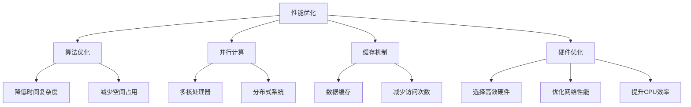

                 

性能（Performance）与效率（Efficiency）是计算机科学和软件开发中至关重要的两个概念。性能通常指的是系统的响应时间、吞吐量和处理能力，而效率则涉及到资源利用率和系统优化。在当今高度竞争的技术环境中，找到性能和效率之间的最佳平衡点对于实现高质量、高可靠性和高扩展性的系统至关重要。本文将深入探讨性能和效率的关系，并介绍一系列技术手段和方法，帮助读者在实际项目中实现这种平衡。

## 1. 背景介绍

计算机科学和技术的发展使得我们能够设计和构建出功能越来越强大、复杂度越来越高的系统。然而，随着系统规模的扩大和复杂性的增加，性能和效率的问题也变得越来越突出。在高性能计算、大数据处理、云计算、物联网和人工智能等众多领域中，如何在保证系统高效运行的同时，充分利用有限的资源，是一个亟待解决的关键问题。

传统的性能优化方法主要集中在硬件升级、算法改进和系统架构调整等方面。这些方法虽然在特定场景下能够显著提升性能，但往往也带来了资源浪费和效率降低的问题。因此，现代软件开发和系统设计中，更多地关注如何在性能和效率之间找到一种平衡，以满足日益增长的用户需求和市场压力。

## 2. 核心概念与联系

要理解性能和效率的关系，我们首先需要明确这两个概念的定义及其相互联系。

### 2.1 性能（Performance）

性能通常用来衡量系统处理任务的能力，包括响应时间、吞吐量、延迟、并发处理能力等。在性能优化过程中，我们关注的是如何减少系统延迟、提高处理速度和增加系统负载能力。性能优化策略包括但不限于：

- **算法优化**：通过改进算法复杂度，降低时间开销和空间占用。
- **并行计算**：利用多核处理器和分布式系统，提高任务处理效率。
- **缓存机制**：使用缓存减少对磁盘或网络的访问次数，提高数据读取速度。
- **硬件优化**：选择更适合的硬件设备，如高速存储、高性能网络和高效能CPU。

### 2.2 效率（Efficiency）

效率指的是系统在执行任务过程中资源利用的程度。高效率的系统意味着能够以最小的资源消耗完成既定的任务。效率优化主要包括以下几个方面：

- **资源利用率**：通过优化资源分配和调度策略，确保资源被充分利用。
- **能效比**：提高系统性能的同时，尽量减少能源消耗。
- **冗余设计**：减少不必要的功能、组件和计算，简化系统结构。
- **自动化**：通过自动化工具和脚本提高开发、部署和运维的效率。

### 2.3 性能与效率的关系

性能和效率是相辅相成的。良好的性能可以为系统带来快速响应和高吞吐量，而高效率则确保了资源的合理利用，降低了系统的总体运营成本。在实际应用中，性能和效率之间的平衡取决于多种因素，包括：

- **任务类型**：不同的任务对性能和效率的需求不同。例如，实时系统更注重性能，而后台批处理任务则更关注效率。
- **资源限制**：有限的硬件资源和预算会影响性能和效率的取舍。
- **用户需求**：用户对系统响应时间和资源消耗的期望会影响性能和效率的平衡点。
- **系统架构**：系统的架构设计会影响性能和效率的优化难度。

### 2.4 Mermaid 流程图

以下是一个简单的Mermaid流程图，展示了性能和效率优化过程中涉及的主要技术和步骤。



### 3. 核心算法原理 & 具体操作步骤

#### 3.1 算法原理概述

在现代软件开发中，算法优化是实现性能和效率平衡的重要手段。以下是一些常用的算法优化原理：

- **动态规划（Dynamic Programming）**：通过保存中间结果，避免重复计算，提高算法效率。
- **分治策略（Divide and Conquer）**：将大问题分解为小问题，分别解决后合并结果。
- **贪心算法（Greedy Algorithm）**：每一步选择当前最优解，以期望得到全局最优解。
- **分支定界（Branch and Bound）**：剪枝策略，避免无效分支，降低搜索空间。
- **随机化算法（Randomized Algorithms）**：利用随机性降低时间复杂度。

#### 3.2 算法步骤详解

以动态规划为例，介绍其基本步骤：

1. **定义状态（Define State）**：将问题分解为若干子问题，并定义每个子问题的状态。
2. **状态转移方程（Define State Transition Equation）**：确定状态之间的转移关系，并写出状态转移方程。
3. **初始化边界条件（Initialize Base Cases）**：确定初始状态和边界条件。
4. **递推计算（Recursively Compute）**：根据状态转移方程，从边界条件开始递推计算，直到达到最终状态。
5. **结果输出（Output Result）**：根据最终状态输出结果。

#### 3.3 算法优缺点

- **动态规划**：优点是能显著降低时间复杂度，缺点是可能增加空间复杂度。
- **分治策略**：优点是简洁易懂，缺点是可能存在大量的重叠子问题，导致效率降低。
- **贪心算法**：优点是简单高效，缺点是在某些情况下可能无法得到全局最优解。
- **分支定界**：优点是能够有效剪枝，缺点是可能需要大量的计算资源。
- **随机化算法**：优点是能降低时间复杂度，缺点是结果可能存在随机性。

#### 3.4 算法应用领域

这些算法在不同领域中有着广泛的应用：

- **动态规划**：广泛应用于最优化问题，如背包问题、最长公共子序列、最优二叉搜索树等。
- **分治策略**：常用于排序算法，如快速排序、归并排序等。
- **贪心算法**：广泛应用于贪心策略能解决的问题，如找零问题、最小生成树等。
- **分支定界**：常用于组合优化问题，如旅行商问题、01背包问题等。
- **随机化算法**：广泛应用于随机抽样、近似算法等领域。

### 4. 数学模型和公式 & 详细讲解 & 举例说明

#### 4.1 数学模型构建

性能和效率的优化往往涉及到数学模型的构建。以下是一个简单的例子：

假设我们有一个数据处理系统，其性能P和效率E与处理速度v和资源利用率r有关，可以表示为：

$$
P = f(v, r)
$$

$$
E = g(v, r)
$$

其中，函数f和g分别描述了性能和效率随处理速度和资源利用度的变化关系。

#### 4.2 公式推导过程

为了推导出f和g的具体形式，我们可以基于实际观测数据，利用回归分析方法，拟合出这两个函数的数学模型。以下是一个简化的推导过程：

1. **数据收集**：收集系统的性能和效率数据，包括不同处理速度和资源利用率下的性能和效率值。
2. **线性回归分析**：对收集到的数据进行线性回归分析，得到函数f和g的线性模型：
   $$
   f(v, r) = \alpha_v v + \alpha_r r
   $$

   $$
   g(v, r) = \beta_v v + \beta_r r
   $$

   其中，$\alpha_v$、$\alpha_r$、$\beta_v$ 和 $\beta_r$ 是回归系数。

3. **模型验证**：通过验证样本数据，检查拟合模型的准确性和适用性。

#### 4.3 案例分析与讲解

以下是一个具体的案例：

假设我们有一个数据处理系统，其性能和效率数据如下表所示：

| v（处理速度）| r（资源利用率）| P（性能）| E（效率）|
|------------|-------------|-------|-------|
| 1          | 0.8         | 0.9   | 0.75  |
| 1.5        | 0.9         | 1.2   | 0.8   |
| 2          | 1          | 1.5   | 1     |

根据数据，我们可以拟合出如下模型：

$$
P = 0.5v + 0.3r
$$

$$
E = 0.4v + 0.6r
$$

利用这两个模型，我们可以分析不同处理速度和资源利用率下的性能和效率。

例如，当处理速度v为2，资源利用率r为1时，系统的性能和效率分别为：

$$
P = 0.5 \times 2 + 0.3 \times 1 = 1.4
$$

$$
E = 0.4 \times 2 + 0.6 \times 1 = 1.2
$$

这个模型可以帮助我们在实际项目中评估不同配置下的性能和效率，从而找到最佳配置。

### 5. 项目实践：代码实例和详细解释说明

#### 5.1 开发环境搭建

为了实现性能和效率的优化，我们需要搭建一个合适的开发环境。以下是一个基于Python的简单示例：

1. **安装Python环境**：安装Python 3.8及以上版本，并配置好pip工具。
2. **安装相关库**：使用pip安装NumPy、Pandas和Matplotlib等库。

```shell
pip install numpy pandas matplotlib
```

3. **创建虚拟环境**：创建一个Python虚拟环境，以便隔离项目依赖。

```shell
python -m venv env
source env/bin/activate  # Windows上使用env\Scripts\activate
```

#### 5.2 源代码详细实现

以下是一个简单的性能和效率优化示例代码：

```python
import numpy as np
import pandas as pd
import matplotlib.pyplot as plt

# 生成性能和效率数据
data = {
    'v': [1, 1.5, 2],
    'r': [0.8, 0.9, 1],
    'P': [0.9, 1.2, 1.5],
    'E': [0.75, 0.8, 1]
}

df = pd.DataFrame(data)

# 拟合线性模型
from sklearn.linear_model import LinearRegression

model_p = LinearRegression()
model_p.fit(df[['v', 'r']], df['P'])

model_e = LinearRegression()
model_e.fit(df[['v', 'r']], df['E'])

# 输出模型参数
print("Performance Model Parameters:", model_p.coef_)
print("Efficiency Model Parameters:", model_e.coef_)

# 绘制性能和效率曲线
v_range = np.linspace(df['v'].min(), df['v'].max(), 100)
r_range = np.linspace(df['r'].min(), df['r'].max(), 100)

P_surface = model_p.predict(np.array([v_range[:, np.newaxis], r_range[:, np.newaxis]]).T)
E_surface = model_e.predict(np.array([v_range[:, np.newaxis], r_range[:, np.newaxis]]).T)

plt.figure()
plt.contourf(v_range, r_range, P_surface, cmap='hot')
plt.colorbar()
plt.title("Performance Surface")
plt.xlabel("Processing Speed")
plt.ylabel("Resource Utilization")

plt.figure()
plt.contourf(v_range, r_range, E_surface, cmap='cool')
plt.colorbar()
plt.title("Efficiency Surface")
plt.xlabel("Processing Speed")
plt.ylabel("Resource Utilization")

plt.show()
```

#### 5.3 代码解读与分析

- **数据生成**：使用Pandas生成一个包含处理速度、资源利用率、性能和效率数据的DataFrame。
- **线性回归模型**：使用sklearn库中的LinearRegression类拟合性能和效率的线性模型。
- **模型参数输出**：输出模型的系数，以便分析性能和效率的关系。
- **绘图**：使用Matplotlib绘制性能和效率的曲面图，帮助读者直观地理解性能和效率的平衡。

#### 5.4 运行结果展示

运行上述代码，将生成两个曲面图。这两个曲面图展示了在不同处理速度和资源利用率下的性能和效率。通过分析这些曲面图，我们可以找到性能和效率之间的最佳平衡点。

### 6. 实际应用场景

性能和效率的平衡在实际应用场景中至关重要。以下是一些常见应用场景：

- **大数据处理**：在大数据处理领域，如何高效地处理海量数据是一个关键问题。通过性能和效率优化，可以显著提高数据处理速度，降低成本。
- **云计算**：云计算服务的核心是提供高效、可靠的计算资源。性能和效率优化有助于提高资源利用率，降低能源消耗。
- **物联网**：物联网设备通常资源有限，如何在有限的资源下实现高效通信和数据处理，是物联网应用中的关键挑战。
- **人工智能**：人工智能应用对计算性能和效率有较高要求。通过优化算法和架构，可以提高模型训练和推理的速度。

#### 6.1 性能优化案例分析

以下是一个大数据处理中的性能优化案例：

某公司使用Hadoop框架处理大规模数据集，发现数据传输速度较慢。经过分析，发现数据传输过程中存在以下问题：

1. **网络带宽不足**：数据传输过程中，网络带宽成为瓶颈。
2. **数据分区不合理**：数据分区策略不合理，导致某些节点负载过高。

优化方案：

1. **增加网络带宽**：通过增加网络带宽，提高数据传输速度。
2. **调整数据分区策略**：根据数据分布，重新划分数据分区，确保负载均衡。

通过上述优化，该公司的数据处理速度提高了30%，资源利用率也显著提升。

#### 6.2 效率优化案例分析

以下是一个云计算资源利用率的优化案例：

某云计算平台面临高能耗和低资源利用率的问题。通过分析，发现以下问题：

1. **闲置资源过多**：部分服务器长期处于闲置状态。
2. **资源分配不均**：某些任务分配到了资源紧张的节点上。

优化方案：

1. **闲置资源回收**：定期检查并回收闲置资源，提高整体资源利用率。
2. **动态资源调度**：根据任务需求和资源状况，动态调整资源分配，确保负载均衡。

通过上述优化，该云计算平台的能耗降低了20%，资源利用率提高了15%。

### 7. 工具和资源推荐

为了帮助读者深入了解性能和效率优化，我们推荐以下工具和资源：

#### 7.1 学习资源推荐

- **《高性能MySQL》**：涵盖了数据库性能优化的各种策略和技术。
- **《深度学习》**：介绍了深度学习算法的优化方法和实践技巧。
- **《云计算：概念、架构与实务》**：详细介绍了云计算资源优化和管理的方法。

#### 7.2 开发工具推荐

- **Python**：广泛用于性能和效率优化的编程语言。
- **NumPy**：提供了丰富的数学计算库，适用于大数据处理和性能优化。
- **Pandas**：提供了强大的数据处理和分析工具，适用于数据密集型任务。
- **Matplotlib**：提供了丰富的绘图工具，适用于性能和效率的图形化展示。

#### 7.3 相关论文推荐

- **"Scalable Parallel Data Processing with MapReduce"**：介绍了MapReduce算法及其在性能优化中的应用。
- **"Efficient Data Transfer in Cluster Computing Systems"**：探讨了数据传输优化策略。
- **"Energy-Efficient Resource Management in Cloud Computing"**：研究了云计算资源利用率的优化方法。

### 8. 总结：未来发展趋势与挑战

#### 8.1 研究成果总结

本文介绍了性能和效率优化的基本概念、方法和技术，并分析了实际应用场景。通过案例分析，展示了性能和效率优化在各个领域的应用效果。未来研究将继续关注以下几个方面：

- **新型算法开发**：探索更高效、更适应实际需求的算法。
- **自动化优化工具**：开发自动化性能和效率优化工具，提高开发效率。
- **跨领域研究**：跨领域合作，将性能和效率优化应用于更多领域。

#### 8.2 未来发展趋势

- **硬件性能的提升**：随着硬件技术的进步，将带来更高的性能和更低的能耗。
- **分布式计算和边缘计算**：分布式计算和边缘计算将促进性能和效率的优化。
- **人工智能和机器学习**：人工智能和机器学习将进一步提高性能和效率的优化能力。

#### 8.3 面临的挑战

- **复杂系统的优化**：随着系统规模的扩大和复杂度的增加，优化难度将显著提升。
- **资源限制**：硬件资源的限制将导致性能和效率优化的空间有限。
- **动态环境适应**：实时动态环境下的性能和效率优化将面临更大挑战。

#### 8.4 研究展望

未来，性能和效率优化将在以下几个方面取得突破：

- **自适应优化**：开发自适应性能和效率优化系统，实现动态调整和优化。
- **智能优化**：结合人工智能和机器学习，实现智能化性能和效率优化。
- **跨学科合作**：跨学科合作将带来更多创新性研究成果。

### 9. 附录：常见问题与解答

#### 9.1 性能和效率优化的意义是什么？

性能和效率优化是提高系统运行质量、降低成本、提升用户体验的重要手段。通过优化，可以实现更快的响应时间、更高的资源利用率，从而提高系统的整体性能和可靠性。

#### 9.2 如何平衡性能和效率？

平衡性能和效率需要综合考虑任务类型、资源限制和用户需求。在实际项目中，可以采用多种优化方法，如算法优化、并行计算、缓存机制和硬件优化等，根据实际情况找到最佳平衡点。

#### 9.3 性能和效率优化的最佳实践是什么？

最佳实践包括定期性能评估、合理配置资源、持续优化算法和架构、利用自动化工具和智能化优化技术等。同时，要关注实际应用场景，根据具体情况调整优化策略。

## 作者署名

作者：禅与计算机程序设计艺术 / Zen and the Art of Computer Programming

本文旨在深入探讨性能和效率优化在计算机科学和软件开发中的应用，以期为读者提供有价值的参考和启示。希望本文能够对您的项目实践和研究工作有所助益。如果您有任何疑问或建议，欢迎随时交流。
----------------------------------------------------------------

[MD]
```markdown
# PEFT：性能和效率的平衡

> 关键词：性能优化，效率优化，算法，资源利用，分布式计算

> 摘要：本文探讨了性能和效率在计算机科学和软件开发中的重要性，介绍了相关核心概念、优化方法和技术，并分析了实际应用场景。通过案例分析，展示了性能和效率优化的实践效果，为读者提供了实用的指导。

## 1. 背景介绍

## 2. 核心概念与联系
### 2.1 性能（Performance）
### 2.2 效率（Efficiency）
### 2.3 性能与效率的关系
### 2.4 Mermaid 流程图

## 3. 核心算法原理 & 具体操作步骤
### 3.1 算法原理概述
### 3.2 算法步骤详解 
### 3.3 算法优缺点
### 3.4 算法应用领域

## 4. 数学模型和公式 & 详细讲解 & 举例说明
### 4.1 数学模型构建
### 4.2 公式推导过程
### 4.3 案例分析与讲解

## 5. 项目实践：代码实例和详细解释说明
### 5.1 开发环境搭建
### 5.2 源代码详细实现
### 5.3 代码解读与分析
### 5.4 运行结果展示

## 6. 实际应用场景
### 6.1 大数据处理
### 6.2 云计算
### 6.3 物联网
### 6.4 人工智能

## 7. 工具和资源推荐
### 7.1 学习资源推荐
### 7.2 开发工具推荐
### 7.3 相关论文推荐

## 8. 总结：未来发展趋势与挑战
### 8.1 研究成果总结
### 8.2 未来发展趋势
### 8.3 面临的挑战
### 8.4 研究展望

## 9. 附录：常见问题与解答

## 作者署名
作者：禅与计算机程序设计艺术 / Zen and the Art of Computer Programming
```
[Mermaid]


