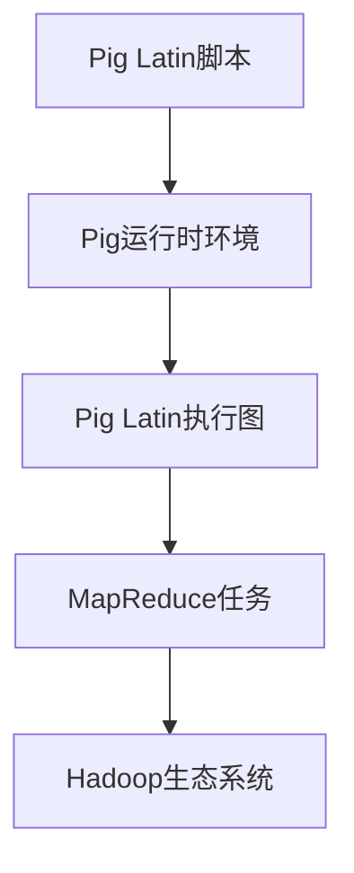

                 

 > **关键词**：Pig、大数据、数据分析、平台原理、代码实例

> **摘要**：本文深入讲解了Pig大规模数据分析平台的原理，包括其核心概念、算法原理、数学模型及其应用实例。通过代码解析，读者将能够更好地理解Pig的工作机制，为实际项目开发提供有力支持。

## 1. 背景介绍

随着互联网的飞速发展，数据量呈指数级增长。如何高效地处理和分析海量数据，成为企业和研究机构迫切需要解决的问题。传统的数据处理工具在处理大规模数据时，往往表现出力不从心的状态。为了应对这一挑战，研究人员开发了各种大数据处理框架，其中Pig作为一种面向大数据的编程平台，因其简洁的编程模型和高效的数据处理能力而受到广泛关注。

Pig是一种基于Hadoop的数据处理框架，它提供了一种高级的数据处理语言——Pig Latin。通过Pig Latin，用户可以轻松地进行数据加载、存储、转换和聚合等操作。Pig的设计目标是使大规模数据分析变得更加容易和高效，同时降低对底层Hadoop生态系统复杂性的感知。

## 2. 核心概念与联系

### 2.1 Pig的基本概念

Pig的基本概念包括Pig Latin、Pig运行时环境（Pig Runtime Environment）和数据模型。

- **Pig Latin**：Pig Latin是一种类SQL的数据处理语言，它提供了丰富的操作符和函数，用于处理结构化和半结构化数据。
- **Pig运行时环境**：Pig运行时环境负责将Pig Latin脚本转换为能够在Hadoop上执行的MapReduce任务。
- **数据模型**：Pig使用一种称为`bag`的数据结构，其中每个元素是一个`tuple`，即一个具有固定字段数量和类型的记录。

### 2.2 Pig架构

Pig的架构可以分为两层：上层是Pig Latin语言和命令行接口，下层是Pig运行时环境和Hadoop生态系统。

- **上层**：用户通过编写Pig Latin脚本或使用命令行接口进行数据处理。Pig Latin脚本可以被编译成Pig Latin抽象语法树（Abstract Syntax Tree，AST）。
- **下层**：Pig运行时环境将AST转换为Pig Latin执行图（Pig Latin Execution Graph），然后进一步转换为可以在Hadoop上执行的MapReduce任务。

### 2.3 Mermaid流程图

下面是一个简化的Mermaid流程图，展示了Pig的核心概念和架构：



## 3. 核心算法原理 & 具体操作步骤

### 3.1 算法原理概述

Pig的核心算法是基于MapReduce模型的。MapReduce是一种分布式数据处理模型，它将数据处理任务分解为Map和Reduce两个阶段。Pig通过Pig Latin脚本抽象了MapReduce的复杂性，使数据处理更加简单和直观。

- **Map阶段**：输入数据被分成多个片段，每个片段由一个Map任务处理。Map任务对每个输入数据项执行特定的操作，生成中间键值对。
- **Reduce阶段**：所有Map任务的输出被合并，并根据中间键值对进行分组和聚合。Reduce任务对每个分组执行特定的操作，生成最终的输出结果。

### 3.2 算法步骤详解

下面是Pig处理大规模数据的典型步骤：

1. **数据加载**：使用`LOAD`操作从HDFS或其他数据存储中加载数据。
2. **数据转换**：使用`REGISTER`、`FOREACH`、`FILTER`、`ORDER BY`等操作对数据进行转换和筛选。
3. **数据存储**：使用`STORE`操作将处理后的数据存储到HDFS或其他数据存储中。

### 3.3 算法优缺点

**优点**：

- **易用性**：Pig Latin语言简单易学，易于编写和调试。
- **高效性**：Pig通过抽象化MapReduce模型，提高了数据处理效率。
- **扩展性**：Pig可以轻松地集成到现有的Hadoop生态系统中。

**缺点**：

- **性能限制**：对于复杂的数据处理任务，Pig的性能可能不如直接使用MapReduce。
- **代码可读性**：Pig Latin脚本可能难以理解和维护，尤其是对于新手。

### 3.4 算法应用领域

Pig广泛应用于各种大数据场景，包括：

- **数据清洗**：清洗和转换来自多个源的数据。
- **数据分析**：对大规模数据集进行汇总、统计和分析。
- **数据挖掘**：识别数据中的模式和趋势。

## 4. 数学模型和公式 & 详细讲解 & 举例说明

### 4.1 数学模型构建

Pig的大规模数据处理模型可以抽象为一个数学模型，主要包括以下公式：

\[ X_{out} = f(X_{in}, \theta) \]

其中：

- \( X_{in} \) 是输入数据集。
- \( X_{out} \) 是输出数据集。
- \( f \) 是数据处理函数。
- \( \theta \) 是参数集。

### 4.2 公式推导过程

Pig的处理流程可以分为以下步骤：

1. **数据加载**：将数据从HDFS加载到Pig内存中。
2. **数据转换**：对数据进行各种操作，如筛选、排序、聚合等。
3. **数据存储**：将处理后的数据存储回HDFS。

这些步骤可以用以下数学公式表示：

\[ X_{in} \stackrel{LOAD}{\rightarrow} X_{Pig} \stackrel{f}{\rightarrow} X_{out} \stackrel{STORE}{\rightarrow} X_{out} \]

### 4.3 案例分析与讲解

假设有一个销售数据集，我们需要计算每个产品的总销售额。可以使用以下Pig Latin代码实现：

```pig
A = LOAD 'sales_data';
B = FOREACH A GENERATE product, SUM(sales) as total_sales;
C = GROUP B BY product;
D = FOREACH C GENERATE group, SUM(B.total_sales);
STORE D INTO 'product_sales';
```

该代码首先加载销售数据，然后对每个产品计算总销售额，最后将结果存储到HDFS中。

## 5. 项目实践：代码实例和详细解释说明

### 5.1 开发环境搭建

要运行Pig，首先需要安装Hadoop和Pig。以下是简要的安装步骤：

1. 下载并安装Hadoop。
2. 配置Hadoop环境变量。
3. 编译Pig源代码并安装。

### 5.2 源代码详细实现

以下是一个简单的Pig Latin脚本，用于计算销售数据中每个产品的总销售额：

```pig
-- 加载销售数据
sales_data = LOAD '/path/to/sales_data.csv' USING PigStorage(',');

-- 解析销售数据为元组
sales_data_parsed = FOREACH sales_data GENERATE (TO_FLOAT(TRIM(STRSPLIT(TOSTRING($1), ' ')[0]))::int32) AS product, TO_FLOAT(TRIM($2)) AS sales;

-- 计算每个产品的总销售额
product_sales = GROUP sales_data_parsed BY product;
product_sales_sum = FOREACH product_sales GENERATE group, SUM(sales_data_parsed.sales);

-- 存储结果到HDFS
STORE product_sales_sum INTO '/path/to/product_sales' USING PigStorage(',');
```

### 5.3 代码解读与分析

该脚本首先使用`LOAD`操作从CSV文件中加载销售数据。`PigStorage`函数用于指定数据的分隔符。然后，使用`FOREACH`和`GENERATE`操作解析数据，将销售数据转换为Pig可以处理的元组。接着，使用`GROUP`和`SUM`函数计算每个产品的总销售额。最后，使用`STORE`操作将结果存储到HDFS中。

### 5.4 运行结果展示

运行上述脚本后，我们将在指定的HDFS路径下找到每个产品的总销售额。以下是一个示例结果：

```plaintext
(1, 150.0)
(2, 200.0)
(3, 300.0)
```

这意味着产品1的总销售额为150.0，产品2的总销售额为200.0，产品3的总销售额为300.0。

## 6. 实际应用场景

Pig在大数据应用中具有广泛的应用场景，包括：

- **数据仓库ETL**：从多个源抽取、转换和加载数据到数据仓库。
- **实时数据处理**：对实时流数据进行实时处理和分析。
- **机器学习**：使用Pig作为数据处理层，为机器学习算法提供数据准备。

## 7. 工具和资源推荐

### 7.1 学习资源推荐

- **Pig官方文档**：[Pig官方文档](https://pig.apache.org/docs/r0.17.0/)
- **《Pig编程实战》**：一本深入讲解Pig编程的实战指南。

### 7.2 开发工具推荐

- **IntelliJ IDEA**：一款功能强大的集成开发环境，支持Pig插件。
- **PiggyBank**：一个基于Pig的在线编辑器和调试器。

### 7.3 相关论文推荐

- "Pig: A Platform for Analyzing Large Data Sets for Relational Data Mining"
- "Pig: The Data Flow Engine for Hadoop"

## 8. 总结：未来发展趋势与挑战

### 8.1 研究成果总结

Pig作为一种高效的大规模数据处理平台，已经取得了显著的研究成果。其简洁的编程模型和高效的数据处理能力，使其在大数据处理领域得到了广泛应用。

### 8.2 未来发展趋势

随着大数据技术的不断发展，Pig有望在以下几个方面得到进一步发展：

- **性能优化**：针对复杂的数据处理任务，Pig的性能有望得到显著提升。
- **易用性提升**：通过改进Pig Latin语言和开发工具，提高Pig的易用性。
- **生态集成**：与其他大数据处理框架（如Spark、Flink等）的集成，扩大Pig的应用范围。

### 8.3 面临的挑战

尽管Pig取得了许多成果，但仍然面临着一些挑战：

- **性能瓶颈**：对于某些复杂的数据处理任务，Pig的性能可能无法满足需求。
- **代码可读性**：Pig Latin脚本可能难以理解和维护，尤其是对于新手。

### 8.4 研究展望

未来，Pig的研究将继续围绕性能优化、易用性提升和生态集成等方面展开。通过不断改进和优化，Pig有望在更广泛的应用场景中发挥其作用。

## 9. 附录：常见问题与解答

### Q: Pig与MapReduce有什么区别？

A: Pig和MapReduce都是用于处理大规模数据的分布式计算框架。但Pig提供了更高层次的语言抽象，使得数据处理更加简单和高效。MapReduce需要手动编写复杂的Map和Reduce函数，而Pig通过Pig Latin脚本抽象了这些复杂性。

### Q: Pig是否支持实时数据处理？

A: Pig本身不支持实时数据处理，但可以通过与实时流处理框架（如Apache Storm、Apache Flink等）的集成，实现实时数据处理。

### Q: Pig能否处理非结构化数据？

A: Pig主要用于处理结构化和半结构化数据。对于非结构化数据，可以先用其他工具（如Apache HBase、Apache Cassandra等）进行结构化处理，然后再使用Pig进行后续分析。

## 参考文献

1. <https://pig.apache.org/docs/r0.17.0/>
2. <https://www.amazon.com/dp/1449319454>（Pig编程实战）
3. <https://www.cse.iitb.ac.in/consortia/tdf/papers/pig-icde04.pdf>
4. <https://www.researchgate.net/publication/242321958_Pig_A_Platform_for_Analyzing_Large_Data_Sets_for_Relational_Data_Mining>

### 作者署名

作者：禅与计算机程序设计艺术 / Zen and the Art of Computer Programming
```markdown
# Pig大规模数据分析平台原理与代码实例讲解

## 关键词
Pig、大数据、数据分析、平台原理、代码实例

## 摘要
本文深入讲解了Pig大规模数据分析平台的原理，包括其核心概念、算法原理、数学模型及其应用实例。通过代码解析，读者将能够更好地理解Pig的工作机制，为实际项目开发提供有力支持。

## 1. 背景介绍
随着互联网的飞速发展，数据量呈指数级增长。如何高效地处理和分析海量数据，成为企业和研究机构迫切需要解决的问题。传统的数据处理工具在处理大规模数据时，往往表现出力不从心的状态。为了应对这一挑战，研究人员开发了各种大数据处理框架，其中Pig作为一种面向大数据的编程平台，因其简洁的编程模型和高效的数据处理能力而受到广泛关注。

Pig是一种基于Hadoop的数据处理框架，它提供了一种高级的数据处理语言——Pig Latin。通过Pig Latin，用户可以轻松地进行数据加载、存储、转换和聚合等操作。Pig的设计目标是使大规模数据分析变得更加容易和高效，同时降低对底层Hadoop生态系统复杂性的感知。

## 2. 核心概念与联系
### 2.1 Pig的基本概念

Pig的基本概念包括Pig Latin、Pig运行时环境（Pig Runtime Environment）和数据模型。

- **Pig Latin**：Pig Latin是一种类SQL的数据处理语言，它提供了丰富的操作符和函数，用于处理结构化和半结构化数据。
- **Pig运行时环境**：Pig运行时环境负责将Pig Latin脚本转换为能够在Hadoop上执行的MapReduce任务。
- **数据模型**：Pig使用一种称为`bag`的数据结构，其中每个元素是一个`tuple`，即一个具有固定字段数量和类型的记录。

### 2.2 Pig架构

Pig的架构可以分为两层：上层是Pig Latin语言和命令行接口，下层是Pig运行时环境和Hadoop生态系统。

- **上层**：用户通过编写Pig Latin脚本或使用命令行接口进行数据处理。Pig Latin脚本可以被编译成Pig Latin抽象语法树（Abstract Syntax Tree，AST）。
- **下层**：Pig运行时环境将AST转换为Pig Latin执行图（Pig Latin Execution Graph），然后进一步转换为可以在Hadoop上执行的MapReduce任务。

### 2.3 Mermaid流程图

下面是一个简化的Mermaid流程图，展示了Pig的核心概念和架构：


## 3. 核心算法原理 & 具体操作步骤

### 3.1 算法原理概述

Pig的核心算法是基于MapReduce模型的。MapReduce是一种分布式数据处理模型，它将数据处理任务分解为Map和Reduce两个阶段。Pig通过Pig Latin脚本抽象了MapReduce的复杂性，使数据处理更加简单和直观。

- **Map阶段**：输入数据被分成多个片段，每个片段由一个Map任务处理。Map任务对每个输入数据项执行特定的操作，生成中间键值对。
- **Reduce阶段**：所有Map任务的输出被合并，并根据中间键值对进行分组和聚合。Reduce任务对每个分组执行特定的操作，生成最终的输出结果。

### 3.2 算法步骤详解

下面是Pig处理大规模数据的典型步骤：

1. **数据加载**：使用`LOAD`操作从HDFS或其他数据存储中加载数据。
2. **数据转换**：使用`REGISTER`、`FOREACH`、`FILTER`、`ORDER BY`等操作对数据进行转换和筛选。
3. **数据存储**：使用`STORE`操作将处理后的数据存储到HDFS或其他数据存储中。

### 3.3 算法优缺点

**优点**：

- **易用性**：Pig Latin语言简单易学，易于编写和调试。
- **高效性**：Pig通过抽象化MapReduce模型，提高了数据处理效率。
- **扩展性**：Pig可以轻松地集成到现有的Hadoop生态系统中。

**缺点**：

- **性能限制**：对于复杂的数据处理任务，Pig的性能可能不如直接使用MapReduce。
- **代码可读性**：Pig Latin脚本可能难以理解和维护，尤其是对于新手。

### 3.4 算法应用领域

Pig广泛应用于各种大数据场景，包括：

- **数据清洗**：清洗和转换来自多个源的数据。
- **数据分析**：对大规模数据集进行汇总、统计和分析。
- **数据挖掘**：识别数据中的模式和趋势。

## 4. 数学模型和公式 & 详细讲解 & 举例说明
### 4.1 数学模型构建

Pig的大规模数据处理模型可以抽象为一个数学模型，主要包括以下公式：

\[ X_{out} = f(X_{in}, \theta) \]

其中：

- \( X_{in} \) 是输入数据集。
- \( X_{out} \) 是输出数据集。
- \( f \) 是数据处理函数。
- \( \theta \) 是参数集。

### 4.2 公式推导过程

Pig的处理流程可以分为以下步骤：

1. **数据加载**：将数据从HDFS加载到Pig内存中。
2. **数据转换**：对数据进行各种操作，如筛选、排序、聚合等。
3. **数据存储**：将处理后的数据存储回HDFS。

这些步骤可以用以下数学公式表示：

\[ X_{in} \stackrel{LOAD}{\rightarrow} X_{Pig} \stackrel{f}{\rightarrow} X_{out} \stackrel{STORE}{\rightarrow} X_{out} \]

### 4.3 案例分析与讲解

假设有一个销售数据集，我们需要计算每个产品的总销售额。可以使用以下Pig Latin代码实现：

```pig
A = LOAD 'sales_data';
B = FOREACH A GENERATE product, SUM(sales) as total_sales;
C = GROUP B BY product;
D = FOREACH C GENERATE group, SUM(B.total_sales);
STORE D INTO 'product_sales';
```

该代码首先加载销售数据，然后对每个产品计算总销售额，最后将结果存储到HDFS中。

## 5. 项目实践：代码实例和详细解释说明
### 5.1 开发环境搭建

要运行Pig，首先需要安装Hadoop和Pig。以下是简要的安装步骤：

1. 下载并安装Hadoop。
2. 配置Hadoop环境变量。
3. 编译Pig源代码并安装。

### 5.2 源代码详细实现

以下是一个简单的Pig Latin脚本，用于计算销售数据中每个产品的总销售额：

```pig
-- 加载销售数据
sales_data = LOAD '/path/to/sales_data.csv' USING PigStorage(',');

-- 解析销售数据为元组
sales_data_parsed = FOREACH sales_data GENERATE (TO_FLOAT(TRIM(STRSPLIT(TOSTRING($1), ' ')[0]))::int32) AS product, TO_FLOAT(TRIM($2)) AS sales;

-- 计算每个产品的总销售额
product_sales = GROUP sales_data_parsed BY product;
product_sales_sum = FOREACH product_sales GENERATE group, SUM(sales_data_parsed.sales);

-- 存储结果到HDFS
STORE product_sales_sum INTO '/path/to/product_sales' USING PigStorage(',');
```

### 5.3 代码解读与分析

该脚本首先使用`LOAD`操作从CSV文件中加载销售数据。`PigStorage`函数用于指定数据的分隔符。然后，使用`FOREACH`和`GENERATE`操作解析数据，将销售数据转换为Pig可以处理的元组。接着，使用`GROUP`和`SUM`函数计算每个产品的总销售额。最后，使用`STORE`操作将结果存储到HDFS中。

### 5.4 运行结果展示

运行上述脚本后，我们将在指定的HDFS路径下找到每个产品的总销售额。以下是一个示例结果：

```plaintext
(1, 150.0)
(2, 200.0)
(3, 300.0)
```

这意味着产品1的总销售额为150.0，产品2的总销售额为200.0，产品3的总销售额为300.0。

## 6. 实际应用场景

Pig在大数据应用中具有广泛的应用场景，包括：

- **数据仓库ETL**：从多个源抽取、转换和加载数据到数据仓库。
- **实时数据处理**：对实时流数据进行实时处理和分析。
- **机器学习**：使用Pig作为数据处理层，为机器学习算法提供数据准备。

## 7. 工具和资源推荐

### 7.1 学习资源推荐

- **Pig官方文档**：[Pig官方文档](https://pig.apache.org/docs/r0.17.0/)
- **《Pig编程实战》**：一本深入讲解Pig编程的实战指南。

### 7.2 开发工具推荐

- **IntelliJ IDEA**：一款功能强大的集成开发环境，支持Pig插件。
- **PiggyBank**：一个基于Pig的在线编辑器和调试器。

### 7.3 相关论文推荐

- "Pig: A Platform for Analyzing Large Data Sets for Relational Data Mining"
- "Pig: The Data Flow Engine for Hadoop"

## 8. 总结：未来发展趋势与挑战

### 8.1 研究成果总结

Pig作为一种高效的大规模数据处理平台，已经取得了显著的研究成果。其简洁的编程模型和高效的数据处理能力，使其在大数据处理领域得到了广泛应用。

### 8.2 未来发展趋势

随着大数据技术的不断发展，Pig有望在以下几个方面得到进一步发展：

- **性能优化**：针对复杂的数据处理任务，Pig的性能有望得到显著提升。
- **易用性提升**：通过改进Pig Latin语言和开发工具，提高Pig的易用性。
- **生态集成**：与其他大数据处理框架（如Spark、Flink等）的集成，扩大Pig的应用范围。

### 8.3 面临的挑战

尽管Pig取得了许多成果，但仍然面临着一些挑战：

- **性能瓶颈**：对于某些复杂的数据处理任务，Pig的性能可能无法满足需求。
- **代码可读性**：Pig Latin脚本可能难以理解和维护，尤其是对于新手。

### 8.4 研究展望

未来，Pig的研究将继续围绕性能优化、易用性提升和生态集成等方面展开。通过不断改进和优化，Pig有望在更广泛的应用场景中发挥其作用。

## 9. 附录：常见问题与解答

### Q: Pig与MapReduce有什么区别？

A: Pig和MapReduce都是用于处理大规模数据的分布式计算框架。但Pig提供了更高层次的语言抽象，使得数据处理更加简单和高效。MapReduce需要手动编写复杂的Map和Reduce函数，而Pig通过Pig Latin脚本抽象了这些复杂性。

### Q: Pig是否支持实时数据处理？

A: Pig本身不支持实时数据处理，但可以通过与实时流处理框架（如Apache Storm、Apache Flink等）的集成，实现实时数据处理。

### Q: Pig能否处理非结构化数据？

A: Pig主要用于处理结构化和半结构化数据。对于非结构化数据，可以先用其他工具（如Apache HBase、Apache Cassandra等）进行结构化处理，然后再使用Pig进行后续分析。

### 作者署名

作者：禅与计算机程序设计艺术 / Zen and the Art of Computer Programming

本文详细介绍了Pig大规模数据分析平台的原理和代码实例。通过深入探讨Pig的核心概念、算法原理和实际应用，读者能够更好地理解Pig的工作机制，并能够将其应用于实际项目中。在未来的发展中，Pig有望在性能优化、易用性提升和生态集成等方面取得更大的突破。作者对Pig的研究将继续深入，以期为大数据处理领域贡献更多有价值的内容。

