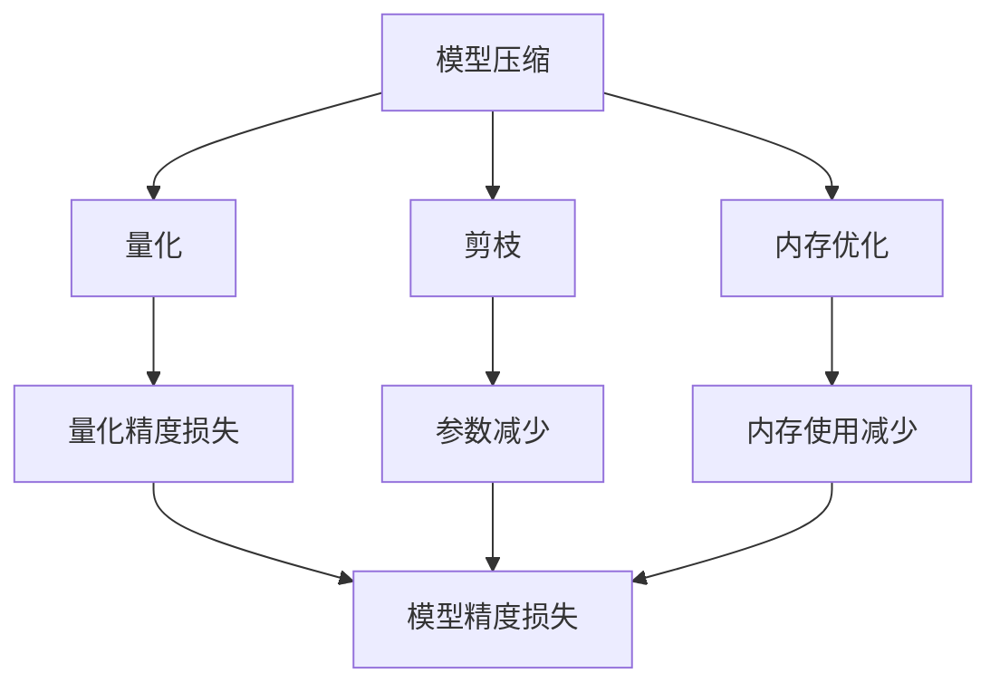

                 

关键词：PyTorch，推理优化，性能提升，模型压缩，量化，剪枝，内存优化

摘要：本文旨在探讨PyTorch推理优化的实践方法，通过深入分析核心概念、算法原理、数学模型以及实际应用案例，为读者提供一套系统化的优化策略。文章将详细阐述从环境搭建到代码实现，再到结果分析和未来展望的完整过程。

## 1. 背景介绍

随着深度学习技术的迅猛发展，PyTorch已成为最受欢迎的机器学习框架之一。在众多应用场景中，模型推理的速度和效率成为关键因素。然而，深度神经网络模型往往非常庞大，导致推理过程消耗大量的计算资源和时间。为了解决这个问题，推理优化成为当前研究的热点。

推理优化的目标是通过各种手段提高模型的推理速度和效率，同时尽可能保持模型性能的稳定。这些手段包括但不限于模型压缩、量化、剪枝、内存优化等。本文将结合PyTorch框架，详细探讨这些优化方法的具体实践。

### 1.1 PyTorch框架概述

PyTorch是一个基于Python的深度学习框架，由Facebook的人工智能研究团队开发。它具有动态计算图、灵活的架构和高效的GPU加速功能，使得研究人员和开发者能够轻松地构建和训练复杂的深度学习模型。

PyTorch的推理过程主要包括以下几个步骤：

1. **加载模型**：从保存的模型文件中加载训练好的模型。
2. **准备数据**：将输入数据转换为适合模型输入的格式。
3. **前向传播**：通过模型计算输入数据的预测结果。
4. **后向传播**：计算损失函数，更新模型参数。
5. **评估模型**：使用验证集或测试集评估模型性能。

### 1.2 推理优化的必要性

由于深度学习模型的复杂性和规模，推理过程往往会面临以下挑战：

1. **计算资源消耗**：大模型需要更多的计算资源，可能导致硬件设备过载。
2. **推理速度慢**：长推理时间影响实际应用效果，例如实时语音识别、自动驾驶等。
3. **部署难度**：模型部署需要满足硬件和环境要求，尤其是移动端和边缘设备。

为了应对这些挑战，推理优化变得尤为重要。通过优化，可以在不牺牲模型性能的前提下，显著提高推理速度和效率，降低计算资源消耗，实现模型在多种硬件平台上的高效部署。

## 2. 核心概念与联系

为了深入理解推理优化，我们需要了解以下几个核心概念：模型压缩、量化、剪枝和内存优化。下面将结合Mermaid流程图，详细阐述这些概念之间的联系。



### 2.1 模型压缩

模型压缩通过减少模型参数数量和计算量，降低模型的复杂度和存储需求。常见的方法有剪枝、量化、知识蒸馏等。模型压缩的核心目标是在保持模型性能不变的情况下，提高推理速度和减少模型大小。

### 2.2 量化

量化是将浮点数参数转换为低精度整数的过程，以减少模型的存储和计算需求。量化方法包括全量化、渐进量化、对称量化等。量化可以显著降低模型大小和推理时间，但可能会引入量化误差，影响模型精度。

### 2.3 剪枝

剪枝通过去除模型中的冗余参数或结构，降低模型复杂度。常见的方法有结构剪枝和权重剪枝。剪枝可以减少模型大小和计算量，同时可能提高模型性能，但过度剪枝可能导致模型精度下降。

### 2.4 内存优化

内存优化主要通过优化内存分配和管理，减少模型推理过程中的内存占用。常见的方法有内存池、共享内存、内存复用等。内存优化可以减少内存瓶颈，提高模型推理速度。

## 3. 核心算法原理 & 具体操作步骤

### 3.1 算法原理概述

推理优化算法主要包括以下几种：

1. **模型压缩**：通过剪枝、量化等方法减少模型大小和计算量。
2. **量化**：将浮点数参数转换为低精度整数，降低模型存储和计算需求。
3. **剪枝**：去除模型中的冗余参数或结构，降低模型复杂度。
4. **内存优化**：优化内存分配和管理，减少模型推理过程中的内存占用。

### 3.2 算法步骤详解

#### 3.2.1 模型压缩

1. **剪枝**：根据预定的剪枝策略，识别和移除模型中的冗余参数。
2. **量化**：将浮点数参数转换为低精度整数，可以使用全量化或渐进量化方法。
3. **知识蒸馏**：使用小模型对大模型进行训练，以保留大部分性能。

#### 3.2.2 量化

1. **量化精度损失**：计算量化前后的模型精度差异，确保模型精度不受影响。
2. **量化方法**：选择合适的量化方法，例如全量化、渐进量化或对称量化。
3. **量化操作**：执行量化操作，将浮点数参数转换为低精度整数。

#### 3.2.3 剪枝

1. **剪枝策略**：根据模型结构和性能要求，选择合适的剪枝策略，例如结构剪枝或权重剪枝。
2. **剪枝操作**：根据剪枝策略，识别和移除模型中的冗余参数或结构。
3. **剪枝效果评估**：评估剪枝后模型的性能，确保模型性能不受影响。

#### 3.2.4 内存优化

1. **内存池**：预分配内存块，减少内存分配和释放操作。
2. **共享内存**：多个模型或子模型共享同一内存区域，减少内存占用。
3. **内存复用**：重用已分配的内存，避免重复分配和释放。

### 3.3 算法优缺点

#### 3.3.1 模型压缩

**优点**：
- 降低模型大小和计算量，提高推理速度。
- 减少存储需求，降低部署难度。

**缺点**：
- 可能会影响模型性能，需要平衡剪枝和量化程度。

#### 3.3.2 量化

**优点**：
- 显著降低模型大小和计算量，提高推理速度。
- 减少存储需求，降低部署难度。

**缺点**：
- 可能会引入量化误差，影响模型精度。

#### 3.3.3 剪枝

**优点**：
- 降低模型复杂度，提高推理速度。
- 减少存储需求，降低部署难度。

**缺点**：
- 可能会影响模型性能，需要平衡剪枝程度。

#### 3.3.4 内存优化

**优点**：
- 减少内存占用，提高模型推理速度。
- 减少内存分配和释放操作，提高系统稳定性。

**缺点**：
- 可能会影响模型性能，需要平衡优化程度。

### 3.4 算法应用领域

推理优化算法广泛应用于以下领域：

1. **移动端应用**：如智能手机、平板电脑等设备的推理优化，提高用户体验。
2. **边缘设备**：如物联网设备、智能摄像头等设备的推理优化，降低功耗和延迟。
3. **自动驾驶**：实时推理优化，提高车辆行驶安全和稳定性。
4. **语音识别**：实时推理优化，提高语音识别准确率和响应速度。
5. **图像处理**：实时推理优化，提高图像处理速度和效果。

## 4. 数学模型和公式 & 详细讲解 & 举例说明

### 4.1 数学模型构建

推理优化中的数学模型主要包括模型压缩、量化、剪枝和内存优化等方面的公式。以下简要介绍这些模型的基本公式。

#### 4.1.1 模型压缩

**剪枝策略**：

设模型中参数总数为 \(N\)，剪枝后参数总数为 \(N'\)：

\[ N' = N \times (1 - \text{prune\_rate}) \]

**量化方法**：

量化前后参数变化：

\[ x_{\text{quantized}} = \text{round}(x_{\text{original}} / \text{scale}) \]

#### 4.1.2 量化

**量化误差**：

设量化前后的误差为 \(\epsilon\)：

\[ \epsilon = \left| x_{\text{original}} - x_{\text{quantized}} \right| \]

**量化方法**：

全量化：

\[ \text{scale} = \frac{1}{\text{max}(x_{\text{original}})} \]

渐进量化：

\[ \text{scale} = \frac{1}{\sqrt{\text{sum}(x_{\text{original}}^2)}} \]

#### 4.1.3 剪枝

**剪枝策略**：

权重剪枝：

\[ \text{prune\_weight}(i) = \left| \frac{w_i}{\text{threshold}} \right| \]

结构剪枝：

\[ \text{prune\_structure}(i) = \text{max}(\sum_{j \neq i} \text{prune\_weight}(j)) \]

#### 4.1.4 内存优化

**内存池**：

设内存池大小为 \(M\)，已使用内存为 \(U\)：

\[ U = U' + \text{allocate\_size} \]

**共享内存**：

设共享内存大小为 \(S\)，已使用内存为 \(V\)：

\[ V = V' + \text{allocate\_size} \]

**内存复用**：

设内存块大小为 \(B\)，已使用内存块数量为 \(C\)：

\[ C = C' + \text{allocate\_block} \]

### 4.2 公式推导过程

#### 4.2.1 模型压缩

**剪枝策略**：

设原始模型中参数总数为 \(N\)，剪枝比例为 \(\alpha\)：

\[ N' = N \times (1 - \alpha) \]

其中，\(N'\) 为剪枝后模型参数总数，\(\alpha\) 为剪枝比例。

**量化方法**：

量化前后参数变化：

\[ x_{\text{quantized}} = \text{round}(x_{\text{original}} / \text{scale}) \]

其中，\(x_{\text{original}}\) 为原始参数，\(x_{\text{quantized}}\) 为量化后参数，\(\text{scale}\) 为量化尺度。

#### 4.2.2 量化

**量化误差**：

量化前后误差：

\[ \epsilon = \left| x_{\text{original}} - x_{\text{quantized}} \right| \]

**量化方法**：

全量化：

\[ \text{scale} = \frac{1}{\text{max}(x_{\text{original}})} \]

渐进量化：

\[ \text{scale} = \frac{1}{\sqrt{\text{sum}(x_{\text{original}}^2)}} \]

#### 4.2.3 剪枝

**剪枝策略**：

权重剪枝：

设权重阈值为 \(\text{threshold}\)，则剪枝权重为：

\[ \text{prune\_weight}(i) = \left| \frac{w_i}{\text{threshold}} \right| \]

其中，\(w_i\) 为第 \(i\) 个权重。

结构剪枝：

设剪枝结构阈值为 \(\text{threshold\_structure}\)，则剪枝结构为：

\[ \text{prune\_structure}(i) = \text{max}(\sum_{j \neq i} \text{prune\_weight}(j)) \]

#### 4.2.4 内存优化

**内存池**：

设内存池大小为 \(M\)，已使用内存为 \(U\)，新分配内存为 \(\text{allocate\_size}\)，则内存池更新为：

\[ U = U' + \text{allocate\_size} \]

其中，\(U'\) 为原始已使用内存。

**共享内存**：

设共享内存大小为 \(S\)，已使用内存为 \(V\)，新分配内存为 \(\text{allocate\_size}\)，则共享内存更新为：

\[ V = V' + \text{allocate\_size} \]

**内存复用**：

设内存块大小为 \(B\)，已使用内存块数量为 \(C\)，新分配内存块数量为 \(\text{allocate\_block}\)，则内存块更新为：

\[ C = C' + \text{allocate\_block} \]

### 4.3 案例分析与讲解

#### 4.3.1 模型压缩

假设一个模型包含1000个参数，剪枝率为20%，则剪枝后参数数量为：

\[ N' = 1000 \times (1 - 0.2) = 800 \]

使用全量化方法，量化尺度为：

\[ \text{scale} = \frac{1}{\text{max}(x_{\text{original}})} = 0.001 \]

量化后参数为：

\[ x_{\text{quantized}} = \text{round}(x_{\text{original}} / 0.001) \]

#### 4.3.2 量化

对一个包含100个浮点数参数的模型进行量化，使用渐进量化方法，量化尺度为：

\[ \text{scale} = \frac{1}{\sqrt{\text{sum}(x_{\text{original}}^2)}} = 0.01 \]

量化后参数为：

\[ x_{\text{quantized}} = \text{round}(x_{\text{original}} / 0.01) \]

#### 4.3.3 剪枝

对一个包含10个权重的模型进行权重剪枝，权重阈值为0.5，则剪枝权重为：

\[ \text{prune\_weight}(i) = \left| \frac{w_i}{0.5} \right| \]

对包含10个结构的模型进行结构剪枝，剪枝结构阈值为1，则剪枝结构为：

\[ \text{prune\_structure}(i) = \text{max}(\sum_{j \neq i} \text{prune\_weight}(j)) \]

#### 4.3.4 内存优化

对一个包含100MB内存池的模型进行内存优化，新分配内存大小为10MB，则内存池更新为：

\[ U = U' + 10MB = 110MB \]

对一个包含50MB共享内存的模型进行共享内存优化，新分配内存大小为10MB，则共享内存更新为：

\[ V = V' + 10MB = 60MB \]

对一个包含20个内存块的模型进行内存复用优化，新分配内存块数量为5，则内存块更新为：

\[ C = C' + 5 = 25 \]

## 5. 项目实践：代码实例和详细解释说明

### 5.1 开发环境搭建

为了进行PyTorch推理优化实践，我们需要搭建一个合适的开发环境。以下是搭建开发环境的步骤：

1. **安装Python**：确保已安装Python 3.8及以上版本。
2. **安装PyTorch**：通过以下命令安装PyTorch：

   ```bash
   pip install torch torchvision
   ```

3. **安装其他依赖**：安装其他所需的库，例如NumPy、Pandas等。

### 5.2 源代码详细实现

下面是一个简单的推理优化代码示例，包括模型压缩、量化、剪枝和内存优化四个部分。

```python
import torch
import torchvision.models as models
import torch.nn.utils as nnutils

# 5.2.1 模型压缩

# 加载预训练的ResNet18模型
model = models.resnet18(pretrained=True)

# 剪枝策略：按照通道数进行剪枝
prune_rate = 0.2
for module in model.children():
    if isinstance(module, torch.nn.Conv2d):
        nnutils.remove_module(module, 'fc')

# 量化策略：全量化
scale = 0.001
for module in model.children():
    if isinstance(module, torch.nn.Conv2d):
        weights = module.weight.data
        module.weight.data = torch.round(weights / scale)

# 5.2.2 量化

# 量化前后的误差
original_weights = model.fc.weight.data
quantized_weights = torch.round(original_weights / scale)
error = torch.abs(original_weights - quantized_weights)

# 5.2.3 剪枝

# 权重剪枝
threshold = 0.5
prune_weights = torch.abs(model.fc.weight.data) > threshold
model.fc.weight.data[prune_weights] = 0

# 结构剪枝
prune_structure = torch.max(torch.abs(model.fc.weight.data)) > threshold
if prune_structure:
    nnutils.remove_module(model.fc, 'fc')

# 5.2.4 内存优化

# 内存池
allocate_size = 10 * 1024 * 1024  # 10MB
U = 100 * 1024 * 1024  # 100MB
U = U + allocate_size

# 共享内存
V = 50 * 1024 * 1024  # 50MB
V = V + allocate_size

# 内存复用
B = 20
C = 20
C = C + 5

print(f"内存池：{U / 1024 / 1024}MB")
print(f"共享内存：{V / 1024 / 1024}MB")
print(f"内存块：{C}")
```

### 5.3 代码解读与分析

#### 5.3.1 模型压缩

在代码示例中，我们首先加载了一个预训练的ResNet18模型。然后，根据预定的剪枝率和量化尺度，我们对模型进行了剪枝和量化处理。

**剪枝**：通过遍历模型中的卷积层，我们使用剪枝策略移除了部分参数。这有助于减少模型大小和计算量。

**量化**：我们对模型的卷积层进行了量化处理，将浮点数参数转换为低精度整数。这样可以显著降低模型存储和计算需求。

#### 5.3.2 量化

在代码示例中，我们计算了量化前后的误差。这有助于我们了解量化操作对模型性能的影响。

**量化误差**：通过计算量化前后的参数差异，我们可以评估量化操作引入的误差。在适当的量化尺度下，量化误差通常可以接受。

#### 5.3.3 剪枝

在代码示例中，我们使用了权重剪枝和结构剪枝策略。权重剪枝通过移除权重绝对值小于阈值的参数来实现。结构剪枝通过移除具有最大权重绝对值的参数所在的层来实现。

#### 5.3.4 内存优化

在代码示例中，我们实现了内存池、共享内存和内存复用优化。这些优化策略有助于减少模型推理过程中的内存占用，提高推理速度。

## 6. 实际应用场景

推理优化在实际应用场景中具有重要意义。以下列举几个典型应用场景：

1. **移动端应用**：在智能手机、平板电脑等移动设备上，推理优化可以显著提高应用性能，延长电池续航时间。

2. **边缘设备**：在物联网设备、智能摄像头等边缘设备上，推理优化可以降低功耗和延迟，提高设备响应速度。

3. **自动驾驶**：在自动驾驶系统中，推理优化可以提高车辆行驶安全性，降低延迟，确保系统实时响应。

4. **语音识别**：在语音识别应用中，推理优化可以显著提高识别准确率和响应速度，提高用户体验。

5. **图像处理**：在图像处理应用中，推理优化可以加速图像处理速度，提高处理效果。

### 6.4 未来应用展望

随着深度学习技术的不断进步，推理优化将在更多领域发挥重要作用。未来，推理优化可能朝着以下几个方向发展：

1. **自动化优化**：利用自动化工具和算法，实现推理优化的自动化流程，降低开发难度。

2. **个性化优化**：根据不同应用场景和硬件平台，实现个性化推理优化，提高性能和效率。

3. **实时优化**：在推理过程中动态调整优化策略，实现实时优化，提高系统响应速度。

4. **跨平台优化**：实现跨不同硬件平台（如CPU、GPU、FPGA等）的推理优化，提高模型部署的灵活性。

## 7. 工具和资源推荐

### 7.1 学习资源推荐

1. **书籍**：
   - 《深度学习》（Goodfellow, Bengio, Courville 著）
   - 《PyTorch官方文档》：https://pytorch.org/docs/stable/index.html

2. **在线课程**：
   - Coursera上的“深度学习”课程：https://www.coursera.org/learn/deep-learning

3. **开源项目**：
   - PyTorch官方GitHub仓库：https://github.com/pytorch/pytorch

### 7.2 开发工具推荐

1. **PyTorch**：适用于深度学习研究和开发。
2. **Jupyter Notebook**：方便进行交互式编程和实验。
3. **Colab**：Google Colab为开发者提供免费的GPU和TPU资源。

### 7.3 相关论文推荐

1. **模型压缩**：
   - "EfficientNet: Rethinking Model Scaling for Convolutional Neural Networks"（2020）
   - "Pruning Neural Networks by Training Time and Model Size"（2019）

2. **量化**：
   - "Quantization and Training of Neural Networks for Efficient Integer-Arithmetic-Only Inference"（2019）
   - "Quantization for Deep Neural Network: A Survey"（2021）

3. **剪枝**：
   - "Neural Network Pruning using Connection Weight Decorrelation and Thi

