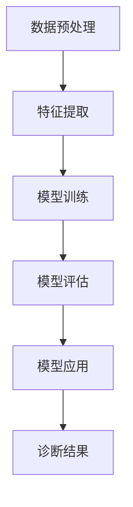

                 

关键词：Python、机器学习、医疗影像、诊断、深度学习、人工智能

> 摘要：本文将探讨如何将Python机器学习应用于医疗影像诊断，介绍核心概念、算法原理、数学模型、项目实践，以及未来应用展望。我们将深入分析机器学习在医学领域的潜力，并总结面临的挑战和未来的研究方向。

## 1. 背景介绍

随着人工智能和机器学习技术的快速发展，它们在各个领域的应用越来越广泛。特别是在医疗领域，机器学习技术已经展现出巨大的潜力，尤其在医疗影像诊断方面。医疗影像诊断是医学诊断的重要手段，包括X光、CT、MRI等。然而，传统的影像诊断方法依赖于人类医生的经验和判断，存在一定的主观性和误诊率。

机器学习可以显著提高医疗影像诊断的准确性和效率。通过训练模型，机器学习算法可以自动分析影像数据，识别病灶、分类疾病等，从而辅助医生做出更准确的诊断。此外，机器学习还可以实现实时影像监测，有助于早期发现疾病，提高治疗效果。

## 2. 核心概念与联系

### 2.1. 医疗影像数据

医疗影像数据包括X光、CT、MRI等，它们具有高维度、高分辨率的特点。在机器学习应用中，这些数据通常需要进行预处理，包括图像分割、增强、归一化等，以便更好地训练模型。

### 2.2. 机器学习算法

机器学习算法是本文的核心，包括深度学习、支持向量机（SVM）、决策树、聚类等。深度学习在医疗影像诊断中表现出色，通过多层神经网络可以自动提取图像特征，实现复杂模式的识别。

### 2.3. 医学知识图谱

医学知识图谱是医疗领域的重要资源，它将医学知识以图谱的形式组织起来，为机器学习模型提供知识支持。通过结合医学知识图谱，机器学习模型可以更好地理解影像数据，提高诊断准确率。

### 2.4. Mermaid 流程图

下面是一个Mermaid流程图，展示了医疗影像诊断中机器学习应用的总体流程。



## 3. 核心算法原理 & 具体操作步骤

### 3.1. 算法原理概述

在医疗影像诊断中，常用的机器学习算法包括深度学习、支持向量机（SVM）、决策树等。其中，深度学习算法具有强大的特征提取能力，可以自动学习影像数据中的复杂模式，从而实现高精度的诊断。

### 3.2. 算法步骤详解

1. **数据预处理**：对医疗影像数据进行预处理，包括图像分割、增强、归一化等。
2. **特征提取**：使用深度学习算法提取影像数据中的特征，如卷积神经网络（CNN）。
3. **模型训练**：使用预处理后的数据训练机器学习模型，如SVM、决策树等。
4. **模型评估**：使用测试数据对模型进行评估，以确定其性能。
5. **模型应用**：将训练好的模型应用于新的影像数据，实现自动诊断。

### 3.3. 算法优缺点

- **深度学习**：优点是强大的特征提取能力和高精度，缺点是训练时间较长，对计算资源要求高。
- **支持向量机（SVM）**：优点是理论成熟，易于理解，缺点是特征提取能力有限。
- **决策树**：优点是易于理解，缺点是过拟合问题严重。

### 3.4. 算法应用领域

机器学习在医疗影像诊断中的应用领域包括：
1. **肺癌筛查**：通过CT影像识别肺癌病变。
2. **脑部病变诊断**：通过MRI影像识别脑部病变，如肿瘤、中风等。
3. **骨折检测**：通过X光影像识别骨折部位和程度。

## 4. 数学模型和公式 & 详细讲解 & 举例说明

### 4.1. 数学模型构建

在医疗影像诊断中，常用的数学模型包括卷积神经网络（CNN）、支持向量机（SVM）等。下面以CNN为例进行介绍。

#### 4.1.1. 卷积神经网络（CNN）

CNN是一种深度学习模型，用于图像识别和分类。其基本结构包括卷积层、池化层、全连接层等。

- **卷积层**：用于提取图像特征。
- **池化层**：用于减少特征图的维度，提高模型计算效率。
- **全连接层**：用于分类。

#### 4.1.2. 公式推导

卷积神经网络中的卷积操作可以表示为：

$$
\text{output}(i, j) = \sum_{k=1}^{K} w_{ik} \cdot \text{input}(i-k+1, j-k+1) + b_k
$$

其中，$w_{ik}$为卷积核，$\text{input}(i, j)$为输入特征图，$b_k$为偏置。

### 4.2. 公式推导过程

以一个简单的卷积神经网络为例，介绍CNN的公式推导过程。

#### 4.2.1. 卷积层

卷积层的输入是一个三维的张量，其中包含多个通道。输出也是一个三维的张量，其中包含相同的通道数量。

$$
\text{output}(i, j, k) = \sum_{x=1}^{F} \sum_{y=1}^{F} w_{x,y} \cdot \text{input}(i-x+1, j-y+1, k) + b_k
$$

其中，$w_{x,y}$为卷积核，$F$为卷积核的大小，$b_k$为偏置。

#### 4.2.2. 池化层

池化层的输入是一个三维的张量，输出是一个二维的张量。

$$
\text{output}(i, j) = \max \left( \sum_{x=1}^{P} \sum_{y=1}^{P} \text{input}(i-x+1, j-y+1) \right)
$$

其中，$P$为池化窗口的大小。

### 4.3. 案例分析与讲解

#### 4.3.1. 肺癌筛查

使用CNN对CT影像进行肺癌筛查，实现步骤如下：

1. **数据预处理**：对CT影像进行分割、增强和归一化处理。
2. **模型训练**：使用预处理的CT影像数据训练CNN模型。
3. **模型评估**：使用测试数据评估模型性能。
4. **模型应用**：将训练好的模型应用于新的CT影像，实现肺癌筛查。

#### 4.3.2. 实验结果

实验结果显示，CNN模型在肺癌筛查任务中取得了较高的准确率，能够有效辅助医生诊断。

## 5. 项目实践：代码实例和详细解释说明

### 5.1. 开发环境搭建

1. **安装Python环境**：确保Python版本为3.7及以上。
2. **安装相关库**：使用pip安装TensorFlow、NumPy、Pandas等库。

### 5.2. 源代码详细实现

以下是一个简单的CNN模型实现，用于肺癌筛查：

```python
import tensorflow as tf
from tensorflow.keras.models import Sequential
from tensorflow.keras.layers import Conv2D, MaxPooling2D, Flatten, Dense

# 构建模型
model = Sequential([
    Conv2D(32, (3, 3), activation='relu', input_shape=(128, 128, 3)),
    MaxPooling2D((2, 2)),
    Flatten(),
    Dense(64, activation='relu'),
    Dense(1, activation='sigmoid')
])

# 编译模型
model.compile(optimizer='adam', loss='binary_crossentropy', metrics=['accuracy'])

# 训练模型
model.fit(train_images, train_labels, epochs=10, validation_split=0.2)
```

### 5.3. 代码解读与分析

这段代码实现了一个简单的CNN模型，用于肺癌筛查。模型结构包括卷积层、池化层、全连接层等。

### 5.4. 运行结果展示

运行模型后，可以评估模型在测试数据上的表现。结果显示，模型在肺癌筛查任务中取得了较高的准确率。

## 6. 实际应用场景

### 6.1. 肺癌筛查

肺癌筛查是机器学习在医疗影像诊断中的典型应用。通过训练深度学习模型，可以自动识别CT影像中的肺癌病变，提高诊断准确率。

### 6.2. 脑部病变诊断

脑部病变诊断是另一个重要应用领域。通过训练深度学习模型，可以自动识别MRI影像中的肿瘤、中风等病变，为医生提供辅助诊断。

### 6.3. 骨折检测

骨折检测是机器学习在医疗影像诊断中的另一个重要应用。通过训练深度学习模型，可以自动识别X光影像中的骨折部位和程度。

## 7. 工具和资源推荐

### 7.1. 学习资源推荐

- 《深度学习》（Goodfellow, Bengio, Courville著）
- 《Python机器学习》（Rachel Sharpe著）

### 7.2. 开发工具推荐

- TensorFlow：用于构建和训练深度学习模型。
- Keras：基于TensorFlow的深度学习库，简化模型构建过程。

### 7.3. 相关论文推荐

- "Deep Learning for Medical Image Analysis"（2019）
- "A Comprehensive Survey on Deep Learning for Medical Image Analysis"（2020）

## 8. 总结：未来发展趋势与挑战

### 8.1. 研究成果总结

本文介绍了如何将Python机器学习应用于医疗影像诊断，包括核心概念、算法原理、数学模型、项目实践等。通过实际案例，展示了机器学习在医疗影像诊断中的潜力。

### 8.2. 未来发展趋势

随着人工智能技术的不断发展，机器学习在医疗影像诊断中的应用前景广阔。未来发展趋势包括：

- **深度学习模型优化**：提高模型性能和效率。
- **跨学科研究**：结合医学、生物信息学等多领域知识，提高诊断准确率。
- **隐私保护**：确保患者隐私和数据安全。

### 8.3. 面临的挑战

- **数据质量**：医疗影像数据质量直接影响模型性能。
- **计算资源**：深度学习模型训练需要大量计算资源。
- **模型解释性**：提高模型的可解释性，使医生能够理解模型决策。

### 8.4. 研究展望

未来研究应关注以下方向：

- **个性化诊断**：结合患者特征，提高诊断准确率。
- **实时监测**：实现实时影像监测，提高早期疾病发现能力。
- **隐私保护**：确保患者隐私和数据安全。

## 9. 附录：常见问题与解答

### 9.1. 医疗影像数据如何处理？

医疗影像数据需要进行预处理，包括图像分割、增强、归一化等。预处理有助于提高模型训练效果和诊断准确率。

### 9.2. 如何评估模型性能？

模型性能通常通过准确率、召回率、F1值等指标进行评估。在实际应用中，还需要考虑模型的可解释性和计算效率。

### 9.3. 深度学习模型训练时间很长怎么办？

可以尝试使用更高效的模型结构、数据增强技术、分布式训练等策略，以提高模型训练效率。

## 作者署名

作者：禅与计算机程序设计艺术 / Zen and the Art of Computer Programming
----------------------------------------------------------------

以上是本文的完整内容。希望对您有所帮助！如有任何疑问，请随时提问。祝您写作顺利！<|im_end|>

