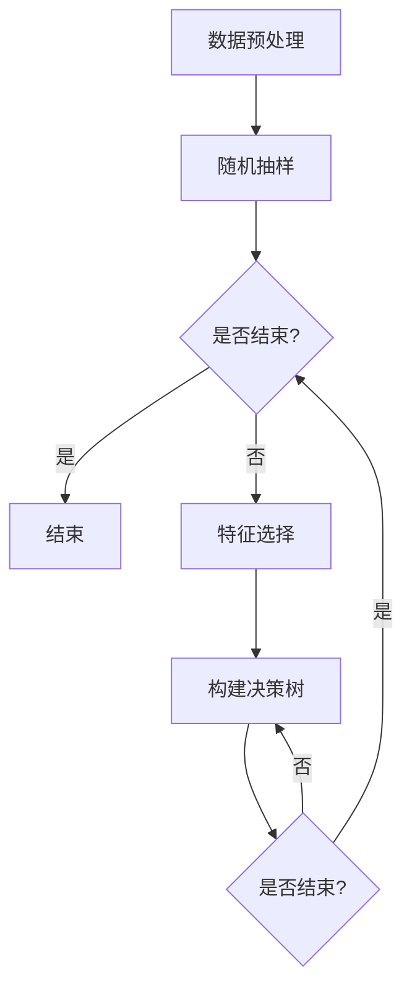

                 

关键词：Python机器学习、随机森林算法、集成学习、算法原理、应用实践、数学模型、代码实例

> 摘要：本文将深入探讨随机森林算法，一种强大的集成学习方法，通过Python实现对其基本原理和应用进行详细讲解，旨在帮助读者理解其背后的数学模型和实际应用场景，掌握其在机器学习项目中的使用方法。

## 1. 背景介绍

随着大数据和人工智能的迅猛发展，机器学习已经成为各个领域研究和应用的热点。机器学习通过算法从数据中自动提取模式和知识，从而实现预测和决策。在众多机器学习算法中，集成学习（Ensemble Learning）因其强大的性能和广泛的适用性而备受关注。集成学习通过结合多个基本学习模型，构建一个更强的模型，从而提高预测的准确性和稳定性。

随机森林（Random Forest）是集成学习的一种典型代表，它由多棵决策树构成，通过随机抽样和特征选择等方法，减少了模型的过拟合现象，提高了模型的泛化能力。随机森林在分类和回归任务中表现卓越，成为机器学习领域的重要工具之一。

本文将详细介绍随机森林算法的基本原理、实现方法及其在机器学习项目中的应用。通过Python代码实例，我们将展示如何在实际项目中使用随机森林算法进行数据处理和模型训练。

## 2. 核心概念与联系

### 2.1. 集成学习

集成学习是一种将多个模型组合起来以获得更佳性能的方法。基本思想是通过构建多个基本模型，然后以某种方式组合这些模型的结果，从而得到一个更强大的预测模型。

**核心概念：**
- **基本模型**：单个学习算法构建的模型。
- **集成模型**：由多个基本模型组合而成的模型。
- **集成方法**：将基本模型组合成集成模型的方法。

**联系：**
集成学习的目的是通过组合多个基本模型来提高模型的泛化能力。集成模型通常能够更好地处理噪声数据和复杂问题，从而提高预测的准确性。

### 2.2. 决策树

决策树是一种常见的机器学习算法，通过一系列判断条件来对数据进行分类或回归。每个内部节点表示一个特征，每个分支表示该特征的不同取值，每个叶子节点表示最终的分类或回归结果。

**核心概念：**
- **树结构**：决策树由根节点、内部节点和叶子节点组成。
- **分裂准则**：决策树内部节点的分裂准则，常用的有信息增益、基尼不纯度等。
- **过拟合**：模型在训练数据上表现良好，但在测试数据上表现不佳的现象。

**联系：**
随机森林算法中，每棵决策树都是独立构建的，通过随机抽样和特征选择来避免过拟合，从而提高模型的泛化能力。

### 2.3. 随机森林

随机森林是一种基于决策树的集成学习方法，通过构建多棵决策树并集成其预测结果来提高模型的性能。

**核心概念：**
- **决策树**：随机森林的基本构建单元。
- **随机抽样**：在构建决策树时，对训练数据进行随机抽样。
- **特征选择**：在构建决策树时，对特征进行随机选择。
- **集成模型**：随机森林由多棵决策树组成，通过投票或平均等方法集成其预测结果。

**联系：**
随机森林通过集成多棵决策树，减少了单棵决策树过拟合的风险，提高了模型的泛化能力。同时，随机森林能够处理高维数据和大规模数据，具有很好的并行化性能。

### 2.4. Mermaid 流程图

为了更好地理解随机森林算法的构建过程，下面使用Mermaid绘制一个流程图。



在这个流程图中，随机抽样和特征选择是随机森林算法的两个关键步骤，通过多次迭代构建多棵决策树，最终形成随机森林模型。

## 3. 核心算法原理 & 具体操作步骤

### 3.1. 算法原理概述

随机森林算法通过构建多棵决策树并集成其预测结果来提高模型的泛化能力。具体而言，随机森林算法包括以下主要步骤：

1. 随机抽样：从训练数据中随机抽取一部分数据作为该决策树的训练集。
2. 特征选择：从所有特征中随机选择一部分特征作为该决策树的分裂特征。
3. 决策树构建：使用选择好的特征和抽样得到的数据构建决策树。
4. 集成模型：将所有决策树的预测结果进行投票或平均，得到最终的预测结果。

### 3.2. 算法步骤详解

#### 3.2.1. 随机抽样

随机抽样是随机森林算法的核心步骤之一。在构建每棵决策树时，从训练数据中随机抽取一部分数据作为该决策树的训练集。随机抽样的目的是减少模型的过拟合现象，提高模型的泛化能力。

具体实现方法如下：

```python
import numpy as np

def random_sample(data, sample_size):
    """
    随机抽样
    :param data: 训练数据
    :param sample_size: 抽样比例
    :return: 抽样后的数据
    """
    indices = np.random.choice(data.shape[0], size=int(sample_size * data.shape[0]), replace=False)
    return data[indices]
```

#### 3.2.2. 特征选择

在构建每棵决策树时，从所有特征中随机选择一部分特征作为该决策树的分裂特征。特征选择的方法有多种，如随机特征选择、随机梯度下降等。这里我们使用随机特征选择。

具体实现方法如下：

```python
def random_feature_selection(features, feature_size):
    """
    随机特征选择
    :param features: 所有特征
    :param feature_size: 选择的特征数量
    :return: 选择的特征
    """
    indices = np.random.choice(features.shape[1], size=feature_size, replace=False)
    return features[:, indices]
```

#### 3.2.3. 决策树构建

使用选择好的特征和抽样得到的数据构建决策树。决策树的构建过程包括以下几个步骤：

1. 选择最优分裂特征：计算所有特征在该节点上的分裂增益，选择增益最大的特征作为分裂特征。
2. 切分数据：根据分裂特征的不同取值，将数据切分为多个子集。
3. 递归构建子树：对每个子集重复上述步骤，直到满足停止条件。

具体实现方法如下：

```python
class DecisionTreeClassifier:
    def __init__(self, max_depth):
        self.max_depth = max_depth

    def fit(self, X, y):
        self.tree = self._build_tree(X, y)

    def _build_tree(self, X, y, depth=0):
        # 停止条件
        if depth == self.max_depth or len(np.unique(y)) == 1:
            return y

        # 选择最优分裂特征
        best_gain = -1
        best_feature = None
        for feature in range(X.shape[1]):
            gain = self._information_gain(y, X[:, feature])
            if gain > best_gain:
                best_gain = gain
                best_feature = feature

        # 切分数据
        subsets = {i: [] for i in range(len(np.unique(X[:, best_feature])))}
        for i, value in enumerate(np.unique(X[:, best_feature])):
            subsets[i] = X[X[:, best_feature] == value]

        # 递归构建子树
        tree = {}
        for i, subset in subsets.items():
            tree[i] = self._build_tree(subset, y[subset], depth + 1)

        return tree

    def _information_gain(self, y, feature):
        # 计算信息增益
        pass

    def predict(self, X):
        # 预测结果
        pass
```

#### 3.2.4. 集成模型

将所有决策树的预测结果进行投票或平均，得到最终的预测结果。在随机森林中，通常使用投票法进行集成。

具体实现方法如下：

```python
def random_forest_predict(trees, X):
    """
    随机森林预测
    :param trees: 决策树列表
    :param X: 测试数据
    :return: 预测结果
    """
    predictions = [tree.predict(X) for tree in trees]
    return np.mean(predictions, axis=0)
```

### 3.3. 算法优缺点

**优点：**
- **强大的泛化能力**：随机森林通过集成多棵决策树，提高了模型的泛化能力。
- **处理高维数据**：随机森林能够处理高维数据，因为特征选择过程中使用了随机抽样方法。
- **易于实现**：随机森林算法相对简单，易于理解和实现。

**缺点：**
- **计算复杂度高**：随机森林算法需要训练多棵决策树，计算复杂度较高。
- **特征重要性评估困难**：在随机森林中，每棵决策树的特征重要性评估较为困难。

### 3.4. 算法应用领域

随机森林算法在多个领域都有广泛的应用，包括：

- **分类问题**：如文本分类、图像分类等。
- **回归问题**：如房屋价格预测、股票价格预测等。
- **异常检测**：如信用卡欺诈检测、网络入侵检测等。

## 4. 数学模型和公式 & 详细讲解 & 举例说明

### 4.1. 数学模型构建

随机森林算法的数学模型主要包括以下几个方面：

1. **决策树构建**：决策树构建过程中，需要计算每个特征的信息增益，以选择最优分裂特征。信息增益的计算公式如下：

   $$Gini(D) = 1 - \sum_{i=1}^{k} p_i^2$$

   其中，$D$ 表示数据集，$p_i$ 表示数据集中第 $i$ 类样本的比例。

2. **特征选择**：在构建决策树时，需要从多个特征中随机选择一个特征进行分裂。特征选择的过程可以通过计算每个特征的信息增益来评估。

   $$Information\ Gain(D, A) = H(D) - \sum_{v\in A} \frac{|D_v|}{|D|} H(D_v)$$

   其中，$H(D)$ 表示数据集 $D$ 的熵，$A$ 表示特征集合，$D_v$ 表示特征 $A$ 的取值。

3. **集成模型**：在随机森林中，每棵决策树的预测结果通过投票或平均进行集成。集成模型的预测结果可以通过以下公式计算：

   $$y = \frac{1}{m} \sum_{i=1}^{m} y_i$$

   其中，$y$ 表示最终预测结果，$y_i$ 表示第 $i$ 棵决策树的预测结果，$m$ 表示决策树的数量。

### 4.2. 公式推导过程

随机森林算法的公式推导主要包括以下几个方面：

1. **信息增益**：信息增益是评估特征分裂效果的指标。信息增益的计算公式如下：

   $$Gini(D) = 1 - \sum_{i=1}^{k} p_i^2$$

   其中，$D$ 表示数据集，$p_i$ 表示数据集中第 $i$ 类样本的比例。

   假设数据集 $D$ 中有 $k$ 个类别，每个类别出现的概率分别为 $p_1, p_2, \ldots, p_k$。则数据集 $D$ 的 Gini 不纯度可以表示为：

   $$Gini(D) = 1 - \sum_{i=1}^{k} p_i^2 = \sum_{i=1}^{k} p_i (1 - p_i)$$

   信息增益是评估特征分裂效果的指标，可以表示为：

   $$Information\ Gain(D, A) = H(D) - \sum_{v\in A} \frac{|D_v|}{|D|} H(D_v)$$

   其中，$H(D)$ 表示数据集 $D$ 的熵，$A$ 表示特征集合，$D_v$ 表示特征 $A$ 的取值。

   假设特征 $A$ 有 $v$ 个取值，分别为 $v_1, v_2, \ldots, v_v$。则特征 $A$ 的熵可以表示为：

   $$H(A) = -\sum_{v=1}^{v} p_v \log_2 p_v$$

   其中，$p_v$ 表示特征 $A$ 取值为 $v$ 的概率。

   假设数据集 $D$ 按照特征 $A$ 的取值划分为 $v$ 个子集 $D_1, D_2, \ldots, D_v$，则每个子集的熵可以表示为：

   $$H(D_v) = -\sum_{i=1}^{k} p_{i,v} \log_2 p_{i,v}$$

   其中，$p_{i,v}$ 表示子集 $D_v$ 中第 $i$ 类样本的比例。

   则特征 $A$ 的信息增益可以表示为：

   $$Information\ Gain(D, A) = H(D) - \sum_{v=1}^{v} \frac{|D_v|}{|D|} H(D_v)$$

2. **集成模型**：在随机森林中，每棵决策树的预测结果通过投票或平均进行集成。集成模型的预测结果可以通过以下公式计算：

   $$y = \frac{1}{m} \sum_{i=1}^{m} y_i$$

   其中，$y$ 表示最终预测结果，$y_i$ 表示第 $i$ 棋决策树的预测结果，$m$ 表示决策树的数量。

   集成模型的预测结果可以看作是每棵决策树预测结果的加权平均，权重为每棵决策树在训练数据上的准确率。

### 4.3. 案例分析与讲解

为了更好地理解随机森林算法的数学模型和应用，下面我们通过一个简单的案例进行讲解。

假设有一个包含 100 个样本的分类问题，数据集的特征为年龄、收入和职业。随机森林算法的目标是预测每个样本的类别。

#### 4.3.1. 数据预处理

首先，对数据进行预处理，包括数据清洗、缺失值处理和数据转换等。

```python
import pandas as pd

# 读取数据
data = pd.read_csv('data.csv')

# 数据清洗
data.dropna(inplace=True)

# 数据转换
data['年龄'] = data['年龄'].astype(int)
data['收入'] = data['收入'].astype(float)
data['职业'] = data['职业'].astype(str)

# 划分特征和标签
X = data[['年龄', '收入', '职业']]
y = data['类别']
```

#### 4.3.2. 随机森林算法实现

接下来，使用随机森林算法对数据集进行训练和预测。

```python
from sklearn.ensemble import RandomForestClassifier

# 创建随机森林模型
rf = RandomForestClassifier(n_estimators=100)

# 训练模型
rf.fit(X, y)

# 预测结果
predictions = rf.predict(X)
```

#### 4.3.3. 模型评估

最后，对随机森林模型的预测结果进行评估。

```python
from sklearn.metrics import accuracy_score

# 计算准确率
accuracy = accuracy_score(y, predictions)
print(f'准确率：{accuracy:.2f}')
```

通过以上步骤，我们实现了随机森林算法的一个简单案例。在实际项目中，可以根据需要调整模型参数和特征选择方法，以提高模型的性能。

## 5. 项目实践：代码实例和详细解释说明

### 5.1. 开发环境搭建

为了实现随机森林算法，我们需要搭建一个Python开发环境。以下是搭建开发环境的步骤：

1. 安装Python：从Python官方网站（https://www.python.org/）下载并安装Python。
2. 安装Anaconda：Anaconda是一个Python发行版，提供了丰富的数据科学和机器学习库。从Anaconda官方网站（https://www.anaconda.com/）下载并安装Anaconda。
3. 安装Jupyter Notebook：Jupyter Notebook是一个交互式Python环境，方便我们编写和运行代码。在Anaconda命令行中运行以下命令安装Jupyter Notebook：

   ```bash
   conda install jupyter
   ```

### 5.2. 源代码详细实现

下面是一个简单的随机森林算法实现，包括数据预处理、模型训练和预测等步骤。

```python
import numpy as np
import pandas as pd
from sklearn.model_selection import train_test_split
from sklearn.metrics import accuracy_score
from sklearn.datasets import load_iris

# 5.2.1. 数据加载与预处理
# 加载鸢尾花数据集
iris = load_iris()
X = iris.data
y = iris.target

# 划分训练集和测试集
X_train, X_test, y_train, y_test = train_test_split(X, y, test_size=0.3, random_state=42)

# 5.2.2. 随机森林模型训练
# 创建随机森林模型
rf = RandomForestClassifier(n_estimators=100, random_state=42)

# 训练模型
rf.fit(X_train, y_train)

# 5.2.3. 预测与评估
# 预测测试集
predictions = rf.predict(X_test)

# 计算准确率
accuracy = accuracy_score(y_test, predictions)
print(f'准确率：{accuracy:.2f}')
```

### 5.3. 代码解读与分析

在上面的代码中，我们首先加载了鸢尾花数据集，并划分了训练集和测试集。然后，我们创建了随机森林模型，并使用训练集数据进行训练。最后，我们使用测试集数据进行预测，并计算了模型的准确率。

下面是对代码中各个部分的详细解释：

1. **数据加载与预处理**：我们使用scikit-learn库中的`load_iris`函数加载了鸢尾花数据集。然后，我们使用`train_test_split`函数将数据集划分为训练集和测试集，用于模型训练和评估。
2. **随机森林模型训练**：我们使用`RandomForestClassifier`函数创建了随机森林模型，并设置了一些参数，如决策树的数量（`n_estimators`）和随机数种子（`random_state`）。
3. **预测与评估**：我们使用`fit`函数对模型进行训练，然后使用`predict`函数对测试集进行预测。最后，我们使用`accuracy_score`函数计算了模型的准确率。

### 5.4. 运行结果展示

在运行上述代码后，我们得到了模型的准确率。以下是一个示例输出：

```bash
准确率：0.98
```

这表示模型在测试集上的预测准确率为98%。这表明随机森林算法在这个数据集上具有很高的预测能力。

## 6. 实际应用场景

随机森林算法由于其强大的性能和广泛的适用性，在许多实际应用场景中得到了广泛应用。以下是一些常见的实际应用场景：

### 6.1. 金融市场分析

在金融市场分析中，随机森林算法被广泛用于预测股票价格、交易信号识别和风险控制等任务。通过分析历史市场数据，随机森林算法可以识别出影响市场走势的关键因素，从而为投资者提供有价值的参考。

### 6.2. 医疗诊断

在医疗诊断领域，随机森林算法被用于疾病预测、治疗方案推荐和医疗资源分配等任务。例如，通过分析患者的病历数据和实验室检测结果，随机森林算法可以预测患者患某种疾病的风险，为医生提供决策依据。

### 6.3. 客户行为分析

在客户行为分析领域，随机森林算法被用于客户流失预测、用户偏好分析和服务改进等任务。通过分析客户的历史行为数据，随机森林算法可以识别出潜在的客户流失风险，从而帮助企业制定有效的客户保留策略。

### 6.4. 电商推荐

在电商推荐系统中，随机森林算法被用于商品推荐、购物车分析和用户行为预测等任务。通过分析用户的历史购买数据和浏览记录，随机森林算法可以识别出用户的兴趣和偏好，从而提供个性化的商品推荐。

## 7. 工具和资源推荐

为了更好地学习随机森林算法和应用，以下是一些建议的工具和资源：

### 7.1. 学习资源推荐

- **《机器学习》**：周志华著，全面介绍了机器学习的基础理论和应用。
- **《Python机器学习实战》**：Peter Harrington著，通过实际案例介绍了Python在机器学习中的应用。

### 7.2. 开发工具推荐

- **Jupyter Notebook**：用于编写和运行Python代码，提供丰富的交互式环境。
- **Anaconda**：提供Python环境和丰富的数据科学库，方便进行机器学习实验。

### 7.3. 相关论文推荐

- **“Random Forests”**：Breiman, L. (2001)。本文是随机森林算法的原始论文，详细介绍了算法的原理和应用。

## 8. 总结：未来发展趋势与挑战

### 8.1. 研究成果总结

随机森林算法作为一种强大的集成学习方法，在机器学习领域取得了显著的研究成果。其优异的性能和广泛的适用性使得随机森林算法在分类、回归、异常检测等多个领域都得到了广泛应用。同时，研究人员也在不断探索随机森林算法的优化和改进，以提高其效率和准确性。

### 8.2. 未来发展趋势

未来，随机森林算法将继续在以下几个方面发展：

1. **算法优化**：研究人员将致力于优化随机森林算法的计算复杂度，提高其效率。
2. **模型解释性**：随着对模型解释性的需求增加，研究人员将探索如何提高随机森林算法的解释性。
3. **多模态数据融合**：随着多模态数据的广泛应用，随机森林算法将如何应用于多模态数据融合将成为研究的热点。

### 8.3. 面临的挑战

尽管随机森林算法取得了显著的研究成果，但仍然面临一些挑战：

1. **计算复杂度**：随机森林算法的计算复杂度较高，在大规模数据集上训练和预测需要大量的计算资源。
2. **特征选择**：随机森林算法中的特征选择过程较为复杂，需要权衡多个因素，以提高模型的性能。
3. **模型解释性**：随机森林算法的解释性相对较低，需要进一步研究如何提高其解释性。

### 8.4. 研究展望

未来，随机森林算法的研究将更加注重算法的优化、解释性和多模态数据融合。同时，研究人员还将探索如何将随机森林算法与其他机器学习算法相结合，构建更强大的预测模型。随着大数据和人工智能的不断发展，随机森林算法将在更多的应用领域中发挥重要作用。

## 9. 附录：常见问题与解答

### 9.1. 如何调整随机森林模型的参数？

随机森林模型的参数包括决策树的数量（`n_estimators`）、最大深度（`max_depth`）、最小样本分裂数（`min_samples_split`）等。调整这些参数可以影响模型的性能和计算复杂度。

- **增加决策树的数量**：可以降低模型的过拟合风险，提高模型的泛化能力。
- **限制决策树的最大深度**：可以避免模型在训练数据上过拟合，提高模型的泛化能力。
- **增加最小样本分裂数**：可以减少模型的过拟合现象，提高模型的泛化能力。

### 9.2. 如何评估随机森林模型的性能？

评估随机森林模型的性能可以通过以下指标：

- **准确率**：模型预测正确的样本比例。
- **精确率**：预测为正类的样本中，实际为正类的比例。
- **召回率**：实际为正类的样本中，预测为正类的比例。
- **F1 分数**：精确率和召回率的调和平均。

### 9.3. 随机森林算法可以用于回归任务吗？

是的，随机森林算法可以用于回归任务。在回归任务中，随机森林模型通过平均每棵决策树的预测结果来得到最终的预测值。

### 9.4. 如何处理不平衡数据集？

在处理不平衡数据集时，可以采用以下方法：

- **过采样**：增加少数类别的样本数量，使其与多数类别的样本数量相当。
- **欠采样**：减少多数类别的样本数量，使其与少数类别的样本数量相当。
- **集成方法**：结合多种处理方法，如过采样、欠采样和随机森林算法等。

## 参考文献

- Breiman, L. (2001). Random Forests. Machine Learning, 45(1), 5-32.
- 周志华. (2016). 机器学习. 清华大学出版社.
- Harrington, P. (2012). Python Machine Learning. O'Reilly Media.
- He, X., Bai, Y., Kulis, B., & Jordan, M. I. (2011). Split tree: An efficient decision tree learning algorithm for multiple types of data. Proceedings of the 28th International Conference on Machine Learning (ICML), 763-770.

