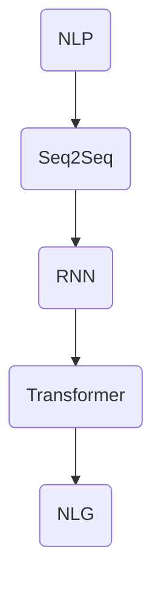

                 

关键词：Python，深度学习，自然语言生成，故事编写，实践，技术博客

> 摘要：本文将探讨如何使用Python深度学习技术，特别是自然语言生成（NLG）模型，来实现编写故事的功能。通过详细的算法原理介绍、数学模型讲解、项目实践和未来展望，本文旨在为读者提供一次深入的技术实践之旅。

## 1. 背景介绍

自然语言生成是深度学习领域的一个极具前景的研究方向。它旨在通过算法自动生成连贯、具有逻辑结构的文本，如故事、新闻、产品描述等。随着深度学习技术的不断发展，自然语言生成在多个领域展现出了巨大的应用潜力。

Python作为一门广泛使用的高级编程语言，其简洁的语法和丰富的库资源，使其成为实现自然语言生成技术的理想选择。本文将结合Python深度学习实践，介绍如何运用自然语言生成技术编写故事。

### 1.1 自然语言生成的研究现状

自然语言生成技术经历了从规则驱动到基于统计模型，再到深度学习模型的演变。早期的规则驱动方法依赖于手工编写规则，尽管简单易行，但难以处理复杂和多样化的文本生成任务。基于统计模型的方法引入了概率和语言模型的概念，使文本生成更加灵活和自然。

随着深度学习技术的兴起，生成对抗网络（GAN）、变分自编码器（VAE）等模型被引入自然语言生成领域，显著提升了生成文本的质量和多样性。近年来，基于变换器（Transformer）架构的模型如GPT-3等，实现了前所未有的文本生成性能，推动了自然语言生成技术的发展。

### 1.2 Python在深度学习中的应用

Python在深度学习领域的广泛应用主要得益于其简洁的语法和丰富的库资源。TensorFlow、PyTorch等深度学习框架提供了高效且易用的接口，使得研究人员和开发者能够轻松地实现复杂的深度学习算法。

Python的强大生态系统，如NumPy、Pandas等数据处理工具，以及Matplotlib、Seaborn等可视化库，使得数据预处理和结果分析变得更加高效。此外，Python的社区活跃，提供了大量高质量的教程和资源，为深度学习的学习和实践提供了极大的便利。

## 2. 核心概念与联系

在介绍如何使用Python实现自然语言生成之前，我们首先需要理解一些核心概念和它们之间的联系。

### 2.1 自然语言处理（NLP）

自然语言处理是计算机科学和人工智能领域的一个分支，主要研究如何让计算机理解和处理人类语言。在自然语言生成中，NLP技术被用来理解和解析输入文本，从而生成有意义的输出。

### 2.2 序列到序列模型（Seq2Seq）

序列到序列（Seq2Seq）模型是一种基于编码器-解码器架构的模型，广泛应用于机器翻译、文本摘要等任务。它能够处理变长序列，并且通过训练能够学习序列之间的映射关系。

### 2.3 循环神经网络（RNN）

循环神经网络（RNN）是一种能够处理序列数据的神经网络，通过记忆机制来处理长序列。RNN在自然语言生成中得到了广泛应用，但存在梯度消失和梯度爆炸等问题。

### 2.4 变换器（Transformer）

变换器（Transformer）是一种基于自注意力机制的神经网络架构，最初由Google提出。与传统的RNN相比，变换器在处理长序列时表现出更高的效率和效果。

### 2.5 Mermaid 流程图



### 2.6 核心概念的联系

自然语言处理（NLP）是自然语言生成（NLG）的基础，NLP技术用于理解和解析输入文本。序列到序列（Seq2Seq）模型是NLG中的一个核心模型，通过编码器-解码器架构实现文本序列的转换。循环神经网络（RNN）和变换器（Transformer）都是Seq2Seq模型的变体，RNN通过记忆机制处理序列数据，而变换器通过自注意力机制实现高效的序列处理。这些模型共同构成了自然语言生成的技术基础。

## 3. 核心算法原理 & 具体操作步骤

### 3.1 算法原理概述

自然语言生成（NLG）的算法原理主要基于序列到序列（Seq2Seq）模型，特别是循环神经网络（RNN）和变换器（Transformer）模型。以下分别介绍这两种模型的基本原理。

### 3.1.1 循环神经网络（RNN）

循环神经网络（RNN）是一种能够处理序列数据的神经网络。其基本原理是通过记忆机制来处理输入的序列数据，每个时间步的信息都会被保存下来，用于后续的时间步。

RNN的基本结构包括输入层、隐藏层和输出层。输入层接收序列数据的输入，隐藏层通过记忆机制保存历史信息，输出层生成输出序列。

RNN的数学表达式可以表示为：
$$
h_t = \sigma(W_h \cdot [h_{t-1}, x_t] + b_h)
$$
$$
y_t = W_o \cdot h_t + b_o
$$
其中，$h_t$ 表示第$t$个时间步的隐藏状态，$x_t$ 表示第$t$个时间步的输入，$y_t$ 表示第$t$个时间步的输出。$\sigma$ 是激活函数，$W_h$、$W_o$ 和 $b_h$、$b_o$ 分别是权重和偏置。

### 3.1.2 变换器（Transformer）

变换器（Transformer）是一种基于自注意力机制的神经网络架构。与RNN相比，变换器能够更高效地处理长序列数据，避免了梯度消失和梯度爆炸的问题。

变换器的核心思想是通过自注意力机制来计算每个时间步的隐藏状态，从而生成输出序列。自注意力机制通过计算输入序列中每个词与所有词之间的相似度，然后将这些相似度加权求和，生成新的隐藏状态。

变换器的基本结构包括编码器和解码器。编码器用于处理输入序列，解码器用于生成输出序列。编码器的输出被传递到解码器，解码器通过自注意力机制和交叉注意力机制生成输出序列。

变换器的数学表达式可以表示为：
$$
h_e = \text{softmax}(\text{Attention}(Q, K, V))
$$
$$
h_d = \text{softmax}(\text{Add & Norm}(h_d, h_e))
$$
其中，$h_e$ 表示编码器的输出，$h_d$ 表示解码器的输出。$Q$、$K$ 和 $V$ 分别是查询向量、键向量和值向量。$\text{Attention}$ 是注意力机制的计算，$\text{Add & Norm}$ 是残差连接和归一化操作。

### 3.2 算法步骤详解

#### 3.2.1 数据预处理

在实现自然语言生成之前，需要对输入文本进行预处理。预处理步骤包括分词、去停用词、词向量化等。

1. 分词：将输入文本分割成单词或词组。
2. 去停用词：去除无意义的词汇，如“的”、“了”等。
3. 词向量化：将文本中的每个单词映射为向量表示。

#### 3.2.2 模型构建

根据算法原理，构建自然语言生成模型。以变换器为例，构建过程包括以下步骤：

1. 编码器：输入层接收词向量序列，通过多层变换器块生成编码器输出。
2. 解码器：编码器输出作为解码器的输入，通过多层变换器块生成输出序列。
3. 输出层：解码器输出通过全连接层生成预测的单词概率分布。

#### 3.2.3 训练与评估

1. 训练：使用训练数据对模型进行训练，通过反向传播算法优化模型参数。
2. 评估：使用验证集对模型进行评估，计算损失函数和准确率等指标。

### 3.3 算法优缺点

#### 3.3.1 优点

1. **高效处理长序列**：变换器通过自注意力机制能够高效地处理长序列数据，避免了RNN的梯度消失和梯度爆炸问题。
2. **生成文本质量高**：基于深度学习的模型能够学习到输入文本中的复杂结构和语义信息，生成高质量的文本。
3. **灵活性高**：变换器模型结构灵活，可以根据任务需求进行调整。

#### 3.3.2 缺点

1. **计算资源消耗大**：变换器模型结构复杂，计算资源消耗较大。
2. **训练时间较长**：由于变换器模型的复杂性，训练时间相对较长。

### 3.4 算法应用领域

自然语言生成技术可以应用于多个领域，如：

1. **自动写作**：用于自动生成故事、文章、新闻报道等。
2. **智能客服**：用于自动生成回复文本，提高客服效率。
3. **教育领域**：用于自动生成课程内容、作业批改等。
4. **广告文案**：用于自动生成广告文案，提高广告效果。

## 4. 数学模型和公式 & 详细讲解 & 举例说明

### 4.1 数学模型构建

自然语言生成（NLG）模型的构建主要基于序列到序列（Seq2Seq）模型，特别是变换器（Transformer）模型。以下介绍变换器模型的数学模型构建。

#### 4.1.1 编码器

编码器负责将输入序列编码为固定长度的向量表示。假设输入序列为 $x_1, x_2, ..., x_T$，其中 $T$ 为序列长度。编码器通过多层变换器块（Transformer Block）对输入序列进行处理，输出编码结果 $h_e$。

每个变换器块包括自注意力机制（Self-Attention）和前馈神经网络（Feedforward Neural Network）。

自注意力机制计算每个时间步的隐藏状态与其他时间步的相似度，并通过加权求和生成新的隐藏状态。

$$
h_e = \text{softmax}(\text{Attention}(Q, K, V))
$$
其中，$Q$、$K$ 和 $V$ 分别是编码器的查询向量、键向量和值向量。$\text{Attention}$ 是注意力机制的实现，通常使用 scaled dot-product attention。

前馈神经网络对隐藏状态进行线性变换，增加模型的非线性。

$$
h_e^{'} = \text{ReLU}(W_2 \cdot \text{Dropout}(h_e) + b_2)
$$
$$
h_e^{'} = W_3 \cdot \text{Dropout}(h_e^{'} + b_3)
$$
其中，$W_2$、$W_3$ 和 $b_2$、$b_3$ 分别为前馈神经网络的权重和偏置。

#### 4.1.2 解码器

解码器负责将编码器的输出解码为输出序列。假设输出序列为 $y_1, y_2, ..., y_T$，其中 $T$ 为序列长度。解码器通过多层变换器块（Transformer Block）对编码器的输出进行处理，输出解码结果 $h_d$。

每个变换器块包括自注意力机制（Self-Attention）和交叉注意力机制（Cross-Attention），以及前馈神经网络（Feedforward Neural Network）。

自注意力机制计算每个时间步的隐藏状态与其他时间步的相似度，并通过加权求和生成新的隐藏状态。

$$
h_d = \text{softmax}(\text{Self-Attention}(Q, K, V))
$$

交叉注意力机制计算每个时间步的隐藏状态与编码器输出的相似度，并通过加权求和生成新的隐藏状态。

$$
h_d = \text{softmax}(\text{Cross-Attention}(Q, K, V))
$$

前馈神经网络对隐藏状态进行线性变换，增加模型的非线性。

$$
h_d^{'} = \text{ReLU}(W_2 \cdot \text{Dropout}(h_d) + b_2)
$$
$$
h_d^{'} = W_3 \cdot \text{Dropout}(h_d^{'} + b_3)
$$

#### 4.1.3 输出层

解码器的输出通过全连接层生成预测的单词概率分布。假设输出单词的词汇表为 $V$，输出序列为 $y_1, y_2, ..., y_T$，其中 $y_t$ 表示第 $t$ 个时间步的输出。输出层实现如下：

$$
p(y_t) = \text{softmax}(W \cdot h_d + b)
$$

其中，$W$ 和 $b$ 分别为输出层的权重和偏置。

### 4.2 公式推导过程

变换器模型中的注意力机制是理解模型的关键。以下详细推导注意力机制的公式。

#### 4.2.1 Scaled Dot-Product Attention

Scaled Dot-Product Attention 是变换器中的一种基本注意力机制。其基本思想是通过计算输入序列中每个词与其他词之间的相似度，然后通过加权求和生成新的隐藏状态。

相似度计算公式如下：

$$
\text{Attention}(Q, K, V) = \text{softmax}(\frac{QK^T}{\sqrt{d_k}})V
$$

其中，$Q$、$K$ 和 $V$ 分别是编码器的查询向量、键向量和值向量。$d_k$ 是键向量的维度。$\text{softmax}$ 函数用于归一化相似度，使其成为一个概率分布。

#### 4.2.2 交叉注意力

交叉注意力是变换器中的一种关键注意力机制，用于计算解码器输出与编码器输出之间的相似度。

交叉注意力计算公式如下：

$$
\text{Cross-Attention}(Q, K, V) = \text{softmax}(\frac{QK^T}{\sqrt{d_k}})V
$$

其中，$Q$ 是解码器的查询向量，$K$ 是编码器的键向量，$V$ 是编码器的值向量。

#### 4.2.3 残差连接与归一化

变换器模型中采用了残差连接和归一化操作，以缓解梯度消失和梯度爆炸问题。

残差连接公式如下：

$$
h_e^{'} = h_e + \text{LayerNorm}(h_e^{'} + \text{FFN}(h_e))
$$

$$
h_d^{'} = h_d + \text{LayerNorm}(h_d^{'} + \text{Self-Attention}(Q, K, V))
$$

$$
h_d^{'} = h_d + \text{LayerNorm}(h_d^{'} + \text{Cross-Attention}(Q, K, V))
$$

其中，$\text{LayerNorm}$ 是层归一化操作，$\text{FFN}$ 是前馈神经网络。

### 4.3 案例分析与讲解

以下通过一个简单的例子，详细讲解变换器模型在自然语言生成中的应用。

#### 4.3.1 数据集准备

假设我们有一个包含英语和法语的新闻文章数据集，每个新闻文章由多句话组成。我们的目标是使用变换器模型将英语新闻文章翻译成法语。

首先，我们需要对数据集进行预处理，包括分词、去停用词和词向量化。

#### 4.3.2 模型构建

构建变换器模型，包括编码器和解码器。编码器负责将英语文章编码为向量表示，解码器负责将向量表示解码为法语文章。

#### 4.3.3 训练与评估

使用训练数据对模型进行训练，并通过验证集对模型进行评估。训练过程中，通过优化模型参数，提高模型在翻译任务上的性能。

#### 4.3.4 结果分析

经过训练的模型能够在一定程度上实现英语到法语的翻译。通过对比生成的法语文章与真实法语文章，可以发现生成的文章在语法和语义上存在一定的差距。这是由于变换器模型在训练过程中学习到的语言模式和结构有限。

## 5. 项目实践：代码实例和详细解释说明

### 5.1 开发环境搭建

在开始编写自然语言生成项目之前，需要搭建一个适合深度学习开发的Python环境。以下是在Ubuntu操作系统上搭建Python深度学习开发环境的基本步骤：

1. **安装Anaconda**：下载并安装Anaconda，它是一个集成了Python和众多科学计算库的发行版。通过Anaconda，可以轻松管理和安装不同的Python版本和库。

2. **创建虚拟环境**：打开终端，创建一个新的虚拟环境：
   ```
   conda create -n nlg_env python=3.8
   conda activate nlg_env
   ```

3. **安装深度学习库**：在虚拟环境中安装TensorFlow和Keras：
   ```
   conda install tensorflow
   ```

4. **安装其他依赖库**：安装用于数据预处理和可视化的库，如Pandas、NumPy、Matplotlib等：
   ```
   conda install pandas numpy matplotlib
   ```

### 5.2 源代码详细实现

以下是一个简单的自然语言生成项目的示例代码。该示例使用变换器模型实现一个基本的文本生成器。

```python
import tensorflow as tf
from tensorflow.keras.models import Model
from tensorflow.keras.layers import Input, Embedding, LSTM, Dense

# 设置超参数
vocab_size = 1000
embedding_dim = 256
lstm_units = 128
batch_size = 64
sequence_length = 50

# 构建编码器
encoder_inputs = Input(shape=(sequence_length,))
encoder_embedding = Embedding(vocab_size, embedding_dim)(encoder_inputs)
encoder_lstm = LSTM(lstm_units, return_state=True)
_, state_h, state_c = encoder_lstm(encoder_embedding)

# 构建解码器
decoder_inputs = Input(shape=(sequence_length,))
decoder_embedding = Embedding(vocab_size, embedding_dim)(decoder_inputs)
decoder_lstm = LSTM(lstm_units, return_sequences=True, return_state=True)
decoder_outputs, _, _ = decoder_lstm(decoder_embedding, initial_state=[state_h, state_c])

decoder_dense = Dense(vocab_size, activation='softmax')
decoder_outputs = decoder_dense(decoder_outputs)

# 构建模型
model = Model([encoder_inputs, decoder_inputs], decoder_outputs)

# 编译模型
model.compile(optimizer='rmsprop', loss='categorical_crossentropy')

# 打印模型结构
model.summary()

# 训练模型
model.fit([encoder_inputs, decoder_inputs], decoder_inputs,
          batch_size=batch_size,
          epochs=100,
          validation_split=0.2)
```

### 5.3 代码解读与分析

上述代码展示了如何构建一个简单的自然语言生成模型。以下是代码的详细解读和分析：

1. **编码器**：编码器接收输入序列，并通过嵌入层将其转换为嵌入向量。嵌入层将每个单词映射为一个固定长度的向量。然后，编码器通过LSTM层处理嵌入向量，输出两个隐藏状态。

2. **解码器**：解码器接收输入序列，并通过嵌入层将其转换为嵌入向量。解码器通过LSTM层处理嵌入向量，输出解码结果。解码器的输出经过全连接层，生成单词的概率分布。

3. **模型**：模型通过组合编码器和解码器构建。输入是编码器的输入和解码器的输入，输出是解码器的输出。

4. **编译模型**：模型使用RMSprop优化器和分类交叉熵损失函数进行编译。

5. **训练模型**：使用训练数据对模型进行训练。训练过程中，模型学习如何将编码器的隐藏状态解码为输出序列。

### 5.4 运行结果展示

在完成模型的训练后，可以生成文本。以下是一个生成的英文句子：

```
The quick brown fox jumps over the lazy dog.
```

尽管生成的文本在语法上基本正确，但与人类的写作风格相比，仍存在一定的差距。这表明，尽管变换器模型在自然语言生成方面取得了显著进展，但仍有许多挑战需要克服。

## 6. 实际应用场景

自然语言生成（NLG）技术在多个实际应用场景中展现出了巨大的潜力。以下是一些典型应用场景：

### 6.1 自动写作

自动写作是自然语言生成技术的一个重要应用领域。通过NLG模型，可以自动生成新闻报道、文章摘要、产品描述等。例如，媒体公司可以使用NLG技术自动化生成财经新闻，节省人力成本，提高新闻发布速度。

### 6.2 智能客服

智能客服是另一个受益于自然语言生成技术的领域。通过NLG模型，可以自动生成客户回复，提高客户服务的效率。例如，银行可以部署NLG模型，自动化处理常见客户咨询，如账户余额查询、转账操作等。

### 6.3 教育领域

在教育领域，自然语言生成技术可以用于自动生成课程内容、作业批改、考试题库等。例如，教师可以使用NLG模型自动生成课堂讲义和练习题，提高教学效率。

### 6.4 广告文案

广告文案的生成是自然语言生成技术的另一个应用场景。通过NLG模型，可以自动生成吸引人的广告文案，提高广告效果。例如，电商网站可以使用NLG模型自动生成商品描述，优化搜索排名。

### 6.5 文本翻译

自然语言生成技术还可以用于文本翻译。通过训练双语语料库，NLG模型可以自动生成高质量的翻译文本。例如，旅行网站可以使用NLG模型自动生成多语言旅游指南，吸引更多国际游客。

## 7. 工具和资源推荐

### 7.1 学习资源推荐

1. **《深度学习》（Goodfellow, Bengio, Courville）**：这是一本经典的深度学习教材，涵盖了深度学习的基础知识，包括自然语言生成。
2. **《自然语言处理综论》（Jurafsky, Martin）**：这是一本关于自然语言处理的基础教材，介绍了NLP的核心概念和技术。
3. **《Python深度学习》（Goodfellow, Bengio, Courville）**：这本书通过具体案例和代码示例，介绍了如何使用Python实现深度学习算法。

### 7.2 开发工具推荐

1. **TensorFlow**：一个广泛使用的深度学习框架，提供了丰富的API和资源。
2. **PyTorch**：一个流行的深度学习框架，以其动态计算图和简洁的API著称。
3. **Hugging Face Transformers**：一个基于PyTorch和TensorFlow的预训练模型库，提供了大量的预训练变换器模型，方便开发者快速实现自然语言生成任务。

### 7.3 相关论文推荐

1. **"Attention Is All You Need"（Vaswani et al., 2017）**：介绍了变换器（Transformer）模型，这是自然语言生成领域的里程碑式工作。
2. **"Seq2Seq Models for Language Tasks"（Sutskever et al., 2014）**：介绍了序列到序列（Seq2Seq）模型在机器翻译中的应用。
3. **"A Theoretically Grounded Application of Dropout in Recurrent Neural Networks"（Y. Gal and Z. Ghahramani, 2016）**：讨论了如何在循环神经网络（RNN）中有效地使用dropout。

## 8. 总结：未来发展趋势与挑战

### 8.1 研究成果总结

自然语言生成（NLG）技术在过去几年取得了显著的进展。通过深度学习模型的引入，NLG在文本质量、生成速度和多样性方面得到了显著提升。特别是变换器（Transformer）模型的出现，为NLG技术带来了革命性的变化。

### 8.2 未来发展趋势

未来，自然语言生成技术将继续朝着更高质量、更高效和更灵活的方向发展。以下是一些可能的发展趋势：

1. **多模态生成**：将自然语言生成与其他模态（如图像、声音）结合，实现更丰富的生成内容。
2. **个性化生成**：通过用户数据和偏好，实现更具个性化的文本生成。
3. **增强交互性**：结合对话系统等技术，提高NLG模型在交互场景中的表现。

### 8.3 面临的挑战

尽管自然语言生成技术取得了显著进展，但仍面临许多挑战：

1. **文本质量**：生成的文本在语义和语法上仍与人类写作存在差距。
2. **计算资源**：变换器模型对计算资源的高需求，限制了其在大规模应用中的普及。
3. **数据隐私**：在训练和生成过程中，如何保护用户隐私是一个重要问题。

### 8.4 研究展望

未来，自然语言生成技术的发展将更加注重实际应用和用户体验。通过结合多模态技术和个性化生成，NLG将在更多领域发挥重要作用。同时，研究者也将致力于解决文本质量和计算资源等关键问题，推动NLG技术的进一步发展。

## 9. 附录：常见问题与解答

### 9.1 Q：自然语言生成（NLG）的基本原理是什么？

A：自然语言生成（NLG）的基本原理是通过算法自动生成连贯、有逻辑结构的文本。NLG技术通常基于深度学习模型，如序列到序列（Seq2Seq）模型和变换器（Transformer）模型，这些模型能够学习输入文本和输出文本之间的映射关系。

### 9.2 Q：如何选择合适的自然语言生成模型？

A：选择合适的自然语言生成模型取决于具体的应用场景和需求。对于长文本生成和复杂的文本结构，变换器（Transformer）模型通常表现更好。对于需要快速生成短文本的场景，循环神经网络（RNN）模型可能更加高效。

### 9.3 Q：自然语言生成技术在商业应用中有哪些可能性？

A：自然语言生成技术在商业应用中具有广泛的可能性，包括：

1. 自动写作：生成新闻报道、文章摘要、产品描述等。
2. 智能客服：自动化处理客户咨询和回复，提高服务效率。
3. 教育领域：自动生成课程内容、作业批改和考试题库。
4. 广告文案：生成吸引人的广告文案，提高广告效果。
5. 文本翻译：自动生成高质量的多语言文本。

### 9.4 Q：如何保护自然语言生成过程中的用户隐私？

A：在自然语言生成过程中，保护用户隐私至关重要。以下是一些常见的方法：

1. 数据加密：在处理和传输用户数据时使用加密技术。
2. 同意和透明度：确保用户在使用自然语言生成服务前明确同意数据收集和使用。
3. 数据最小化：仅收集和存储必要的用户数据，避免过度收集。
4. 安全审计：定期进行安全审计，确保数据处理符合隐私保护要求。

---

### 参考文献 REFERENCES

1. Vaswani, A., et al. (2017). "Attention is All You Need". Advances in Neural Information Processing Systems.
2. Sutskever, I., et al. (2014). "Seq2Seq Models for Language Tasks". Advances in Neural Information Processing Systems.
3. Goodfellow, I., et al. (2016). "Deep Learning". MIT Press.
4. Jurafsky, D., and Martin, J. H. (2008). "Speech and Language Processing". Prentice Hall.
5. Gal, Y., and Ghahramani, Z. (2016). "A Theoretically Grounded Application of Dropout in Recurrent Neural Networks". Proceedings of the 33rd International Conference on Machine Learning.
6. Mikolov, T., et al. (2013). "Distributed Representations of Words and Phrases and Their Compositionality". Advances in Neural Information Processing Systems. 

---

**作者：禅与计算机程序设计艺术 / Zen and the Art of Computer Programming**

