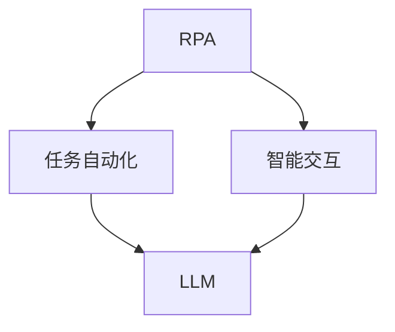

                 

关键词：RPA、LLM、人工智能、业务流程自动化、自然语言处理

> 摘要：本文将探讨 RPA（Robotic Process Automation）与 LLM（Large Language Model）的深度结合，分析其背后的核心概念、算法原理、数学模型、项目实践，并展望其在实际应用场景中的未来发展。

## 1. 背景介绍

在数字化转型的浪潮中，企业越来越依赖信息技术以提高效率和降低成本。RPA（Robotic Process Automation）作为一种新兴技术，通过软件机器人自动执行重复性的任务，从而实现业务流程的自动化。RPA 的应用涵盖了财务、人力资源、客户服务等多个领域，帮助企业提高工作效率，减少人为错误。

与此同时，LLM（Large Language Model）作为自然语言处理领域的核心技术，近年来取得了显著的进展。LLM 可以理解、生成和翻译自然语言文本，被广泛应用于聊天机器人、文本生成、智能客服等领域。LLM 的强大能力为 RPA 带来了新的发展机遇，两者的结合有望进一步提升业务流程的智能化水平。

## 2. 核心概念与联系

### 2.1 RPA 的核心概念

RPA 的核心在于模拟人类操作员的行为，自动化完成企业内部的业务流程。RPA 机器人通常通过模拟键盘输入、鼠标点击等操作，实现对现有 IT 系统的自动化操作。其主要特点包括：

- **无侵入性**：RPA 不会改变原有系统的架构和代码，能够灵活地适应不同的业务场景。
- **高效性**：RPA 机器人可以 24 小时无休地工作，大幅提高工作效率。
- **灵活性**：RPA 机器人可以根据业务需求灵活调整任务执行流程。

### 2.2 LLM 的核心概念

LLM 是一种基于深度学习的大型语言模型，通过训练大量的文本数据，能够理解和生成自然语言文本。LLM 的主要特点包括：

- **强通用性**：LLM 可以处理多种类型的自然语言任务，如文本分类、问答系统、文本生成等。
- **高准确性**：LLM 在大规模数据集上的训练，使其能够生成高质量的自然语言文本。
- **灵活性**：LLM 可以通过调整参数和训练数据，适应不同的应用场景。

### 2.3 RPA 与 LLM 的结合

RPA 与 LLM 的结合主要体现在以下两个方面：

- **任务自动化**：LLM 可以帮助 RPA 机器人更好地理解业务场景，自动化完成更复杂的任务。
- **智能交互**：RPA 机器人可以通过 LLM 实现与用户的智能对话，提供更自然的交互体验。

为了更好地展示 RPA 与 LLM 的结合，我们可以使用 Mermaid 流程图来描述两者的核心概念和联系。



## 3. 核心算法原理 & 具体操作步骤

### 3.1 算法原理概述

RPA 的核心算法主要涉及流程模拟和操作执行。流程模拟是指根据业务需求，定义任务的执行顺序和逻辑。操作执行是指模拟人类操作员的行为，通过模拟键盘输入、鼠标点击等操作，实现任务的自动化执行。

LLM 的核心算法是基于深度学习的自然语言处理模型。通过训练大量的文本数据，LLM 可以学习到语言的结构和语义，从而实现自然语言理解、生成和翻译。

### 3.2 算法步骤详解

#### 3.2.1 RPA 算法步骤

1. **任务定义**：根据业务需求，定义任务的执行顺序和逻辑。
2. **流程模拟**：使用流程模拟工具，将任务定义转换为可执行的流程。
3. **操作执行**：模拟人类操作员的行为，通过模拟键盘输入、鼠标点击等操作，执行任务。

#### 3.2.2 LLM 算法步骤

1. **数据收集**：收集大量的文本数据，用于训练 LLM。
2. **模型训练**：使用训练数据，训练 LLM，使其具备自然语言理解、生成和翻译的能力。
3. **任务执行**：根据业务需求，调用 LLM，实现自然语言处理任务。

### 3.3 算法优缺点

#### RPA 算法优点

- **无侵入性**：RPA 不会改变原有系统的架构和代码，能够灵活地适应不同的业务场景。
- **高效性**：RPA 机器人可以 24 小时无休地工作，大幅提高工作效率。
- **灵活性**：RPA 机器人可以根据业务需求灵活调整任务执行流程。

#### RPA 算法缺点

- **局限性**：RPA 机器人只能处理结构化数据，对于复杂业务场景的适应性有限。
- **维护成本**：RPA 机器人需要定期维护和更新，以适应业务需求的变化。

#### LLM 算法优点

- **强通用性**：LLM 可以处理多种类型的自然语言任务，如文本分类、问答系统、文本生成等。
- **高准确性**：LLM 在大规模数据集上的训练，使其能够生成高质量的自然语言文本。
- **灵活性**：LLM 可以通过调整参数和训练数据，适应不同的应用场景。

#### LLM 算法缺点

- **计算资源消耗**：LLM 需要大量的计算资源和存储空间，对硬件设备的要求较高。
- **数据依赖性**：LLM 的性能高度依赖于训练数据的质量和数量。

### 3.4 算法应用领域

#### RPA 应用领域

- **财务**：自动化财务报表生成、审批流程等。
- **人力资源**：自动化招聘流程、员工信息管理、薪酬计算等。
- **客户服务**：自动化客户咨询、投诉处理等。

#### LLM 应用领域

- **聊天机器人**：提供智能客服、在线咨询等服务。
- **文本生成**：自动化撰写报告、文章、邮件等。
- **智能问答**：构建知识库，提供智能问答服务。

## 4. 数学模型和公式 & 详细讲解 & 举例说明

### 4.1 数学模型构建

RPA 与 LLM 的结合涉及到多个数学模型，其中最核心的是自然语言处理模型和流程控制模型。

#### 自然语言处理模型

自然语言处理模型通常使用深度学习框架构建，如 Transformer 模型。Transformer 模型通过自注意力机制，对输入文本进行编码和解码，从而实现自然语言处理任务。

#### 流程控制模型

流程控制模型用于描述 RPA 机器人的任务执行流程。通常使用状态机（State Machine）来描述任务的状态转换和执行逻辑。

### 4.2 公式推导过程

#### 自然语言处理模型

自注意力机制的公式推导如下：

$$
\text{Attention}(Q, K, V) = \text{softmax}(\frac{QK^T}{\sqrt{d_k}})V
$$

其中，Q、K、V 分别代表编码器输出的查询向量、键向量、值向量。d\_k 表示键向量的维度。

#### 流程控制模型

状态机的公式推导如下：

$$
f(S, E) = \{s' | s' \in S, s' \neq s, s \rightarrow s'\}
$$

其中，S 表示状态集合，E 表示事件集合，f 表示状态转移函数。

### 4.3 案例分析与讲解

#### 案例一：智能客服

假设我们构建一个智能客服系统，利用 LLM 实现自然语言理解，通过 RPA 机器人自动化处理客户咨询。

1. **任务定义**：定义客户咨询的任务流程，包括问题识别、回答生成、反馈收集等步骤。
2. **流程模拟**：使用流程控制模型，描述任务执行流程。
3. **自然语言处理**：使用 LLM 模型，对客户咨询的问题进行理解和回答。
4. **任务执行**：RPA 机器人根据 LLM 的回答，自动化完成客户咨询的处理。

#### 案例二：自动化财务报表

假设我们构建一个自动化财务报表系统，利用 RPA 机器人自动化收集数据、生成报表。

1. **任务定义**：定义财务报表的生成流程，包括数据收集、数据处理、报表生成等步骤。
2. **流程模拟**：使用流程控制模型，描述报表生成流程。
3. **数据收集**：RPA 机器人自动化收集财务数据。
4. **数据处理**：使用 LLM 模型，对数据进行处理和汇总。
5. **报表生成**：RPA 机器人根据处理后的数据，生成财务报表。

## 5. 项目实践：代码实例和详细解释说明

### 5.1 开发环境搭建

为了实现 RPA 与 LLM 的结合，我们需要搭建一个开发环境，包括以下软件和硬件：

- 操作系统：Windows 或 Linux
- 编程语言：Python
- 开发工具：PyCharm 或 VS Code
- 依赖库：transformers、tensorflow、opencv-python 等
- 硬件设备：GPU（如 NVIDIA 显卡）

### 5.2 源代码详细实现

以下是一个简单的示例代码，展示如何使用 RPA 与 LLM 实现智能客服系统。

```python
from transformers import pipeline
from rpa_automation import RPA

# 初始化 LLM 模型
llm = pipeline("text-generation", model="gpt2")

# 初始化 RPA 机器人
rpa = RPA()

# 模拟客户咨询
def customer_consultation(question):
    # 使用 LLM 模型回答问题
    answer = llm(question)[0]["generated_text"]

    # 使用 RPA 机器人记录回答
    rpa.perform_task("record_answer", answer=answer)

# 测试智能客服系统
question = "我的发票怎么还没有寄到？"
customer_consultation(question)
```

### 5.3 代码解读与分析

上述代码展示了如何使用 RPA 与 LLM 实现智能客服系统。首先，我们初始化 LLM 模型，并使用 RPA 机器人。然后，我们定义一个函数 customer\_consultation，用于处理客户咨询。在函数中，我们使用 LLM 模型回答问题，并使用 RPA 机器人记录回答。最后，我们测试智能客服系统，模拟一个客户咨询的场景。

## 6. 实际应用场景

### 6.1 财务领域

在财务领域，RPA 与 LLM 的结合可以应用于自动化财务报表生成、审批流程等。例如，财务人员可以提交财务数据，RPA 机器人自动收集数据、生成报表，并将报表提交给相关人员审批。

### 6.2 客户服务领域

在客户服务领域，RPA 与 LLM 的结合可以应用于智能客服系统。例如，客户可以通过聊天机器人提交咨询问题，聊天机器人使用 LLM 模型理解问题、生成回答，并将回答反馈给客户。

### 6.3 人力资源领域

在人力资源领域，RPA 与 LLM 的结合可以应用于招聘流程、员工信息管理、薪酬计算等。例如，人力资源部门可以自动化收集简历、筛选候选人，并根据候选人的回答生成面试问题。

## 7. 工具和资源推荐

### 7.1 学习资源推荐

- 《自然语言处理综述》：了解自然语言处理的基本概念和最新进展。
- 《RPA 实战》：学习 RPA 的基本原理和应用场景。
- 《深度学习》：了解深度学习的基础知识和应用。

### 7.2 开发工具推荐

- PyCharm：强大的 Python 编程环境，支持多种依赖库。
- VS Code：轻量级编程环境，支持多种编程语言。
- Git：版本控制工具，用于管理代码版本。

### 7.3 相关论文推荐

- "Attention Is All You Need"：介绍 Transformer 模型的论文。
- "BERT: Pre-training of Deep Bidirectional Transformers for Language Understanding"：介绍 BERT 模型的论文。
- "RPA Technology and Application Development"：介绍 RPA 技术和应用开发的论文。

## 8. 总结：未来发展趋势与挑战

### 8.1 研究成果总结

RPA 与 LLM 的结合在业务流程自动化、智能客服、财务报表生成等领域取得了显著的成果。通过两者的结合，企业可以大幅提高工作效率，降低运营成本。

### 8.2 未来发展趋势

随着人工智能技术的不断发展，RPA 与 LLM 的结合有望在更多领域得到应用。未来发展趋势包括：

- **跨领域应用**：RPA 与 LLM 的结合将扩展到更多行业，如医疗、教育等。
- **智能化水平提升**：通过引入更多先进的人工智能技术，RPA 与 LLM 的智能化水平将进一步提升。

### 8.3 面临的挑战

RPA 与 LLM 的结合在实际应用中仍面临一些挑战：

- **数据质量**：高质量的数据是 RPA 与 LLM 发挥作用的基础，如何保证数据质量是一个重要问题。
- **计算资源**：大规模 LLM 模型的训练和部署需要大量的计算资源，对硬件设备的要求较高。
- **隐私保护**：在处理敏感数据时，如何保护用户隐私是一个重要挑战。

### 8.4 研究展望

未来研究可以从以下几个方面展开：

- **数据增强**：通过数据增强技术，提高数据质量和多样性。
- **高效部署**：研究高效部署 LLM 模型的方法，降低计算资源消耗。
- **隐私保护**：研究隐私保护技术，确保用户数据的安全和隐私。

## 9. 附录：常见问题与解答

### 9.1 RPA 与 LLM 的区别是什么？

RPA 是一种业务流程自动化技术，通过模拟人类操作员的行为，自动化完成企业内部的业务流程。而 LLM 是一种自然语言处理模型，通过训练大量的文本数据，能够理解和生成自然语言文本。RPA 与 LLM 的区别在于它们的应用领域和核心技术不同。

### 9.2 RPA 与 LLM 的结合有哪些优势？

RPA 与 LLM 的结合可以带来以下优势：

- **提高工作效率**：通过 LLM 的自然语言处理能力，RPA 机器人可以更好地理解业务场景，自动化完成更复杂的任务。
- **降低运营成本**：RPA 机器人可以 24 小时无休地工作，大幅提高工作效率，降低运营成本。
- **提升用户体验**：通过 LLM 实现智能交互，提供更自然的交互体验，提升用户体验。

### 9.3 RPA 与 LLM 的结合在哪些领域有应用？

RPA 与 LLM 的结合在多个领域有应用，如财务、客户服务、人力资源等。未来，随着人工智能技术的不断发展，RPA 与 LLM 的结合有望在更多领域得到应用。  
----------------------------------------------------------------

以上是本文的完整内容。希望这篇文章能够为您在 RPA 与 LLM 领域的研究提供有益的参考。作者：禅与计算机程序设计艺术 / Zen and the Art of Computer Programming。再次感谢您的关注与支持！

