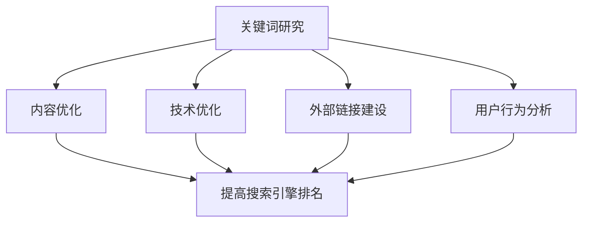

                 

关键词：SEO优化，创业公司，搜索引擎排名，网站优化策略，用户体验

>摘要：本文旨在为创业公司提供一套完整的SEO优化实践指南，帮助它们提高搜索引擎排名，吸引潜在客户，从而实现业务的增长。通过深入探讨SEO的核心概念、关键算法、数学模型、项目实践以及实际应用场景，本文将帮助创业公司掌握SEO优化的基本原理和方法，为未来的发展打下坚实的基础。

## 1. 背景介绍

在数字化时代，互联网已经成为企业营销和业务扩展的重要渠道。搜索引擎优化（SEO）作为一种提高网站在搜索引擎中排名的有效手段，对于创业公司尤为重要。通过SEO优化，创业公司可以在竞争激烈的市场中获得更多的曝光机会，吸引目标客户，提高品牌知名度。

### 1.1 SEO的重要性

- **提高网站访问量**：通过优化网站内容和结构，提高搜索引擎对网站的抓取和索引效率，从而增加网站的访问量。

- **增加品牌曝光度**：好的SEO策略可以让创业公司的网站在搜索引擎结果页面（SERP）中获得较高的排名，提高品牌曝光度。

- **提升用户体验**：优化网站内容、加载速度和导航结构，提供更好的用户体验，提高用户留存率和转化率。

- **降低营销成本**：与付费广告相比，SEO是一种成本效益更高的营销策略，可以帮助创业公司在有限预算内实现更广泛的覆盖。

### 1.2 创业公司的SEO挑战

- **预算限制**：创业公司通常面临预算限制，无法像大型企业一样投入大量资金进行SEO优化。

- **市场竞争力**：市场竞争激烈，创业公司需要通过SEO优化来脱颖而出。

- **时间限制**：创业公司通常时间紧迫，需要在有限的时间内实现SEO优化目标。

- **技术能力**：创业公司可能缺乏专业的SEO技术团队，需要通过自学或外部合作来提升SEO能力。

## 2. 核心概念与联系

为了深入理解SEO优化，我们首先需要了解其核心概念和基本架构。

### 2.1 核心概念

- **关键词研究**：确定目标关键词，以便优化网站内容和标题。

- **内容优化**：撰写高质量、相关性强、易于阅读的内容。

- **技术优化**：提高网站加载速度、移动友好性、安全性等。

- **外部链接建设**：通过建立高质量的外部链接来提高网站权威性。

- **用户行为分析**：分析用户在网站上的行为，优化用户体验。

### 2.2 基本架构



### 2.3 关系图


在这个关系图中，我们可以看到各个核心概念之间的相互作用，以及它们如何共同影响网站的搜索引擎排名。

## 3. 核心算法原理 & 具体操作步骤

### 3.1 算法原理概述

SEO优化的核心在于提高网站在搜索引擎中的排名。这通常通过以下几个步骤实现：

1. **关键词研究**：使用工具如Google Keyword Planner或Ahrefs来确定目标关键词。

2. **内容优化**：在网站的关键位置（如标题、元描述、正文等）使用目标关键词。

3. **技术优化**：确保网站加载速度、移动友好性、安全性等。

4. **外部链接建设**：通过内容营销、合作伙伴关系等手段获取高质量的外部链接。

5. **用户行为分析**：使用工具如Google Analytics分析用户行为，优化用户体验。

### 3.2 算法步骤详解

#### 3.2.1 关键词研究

- **确定目标关键词**：根据业务目标和用户需求，选择与业务相关且搜索量较大的关键词。

- **使用工具**：使用关键词研究工具如Google Keyword Planner、Ahrefs等，分析关键词的搜索量、竞争程度和潜在客户。

- **选择最佳关键词**：选择搜索量适中、竞争程度适中的关键词作为目标关键词。

#### 3.2.2 内容优化

- **撰写高质量内容**：撰写与目标关键词相关的高质量内容，确保内容具有独特性、实用性和易读性。

- **优化标题和元描述**：使用目标关键词优化网站标题和元描述，以提高点击率。

- **内部链接**：在网站内部建立合理的链接结构，提高页面间的相互链接。

#### 3.2.3 技术优化

- **提高网站速度**：通过压缩图片、使用缓存、优化代码等技术手段提高网站速度。

- **确保移动友好性**：确保网站在不同设备和屏幕尺寸上都能良好显示。

- **加强网站安全性**：使用HTTPS协议、SSL证书等提高网站安全性。

#### 3.2.4 外部链接建设

- **内容营销**：通过撰写高质量、有价值的文章、教程等吸引外部网站链接。

- **合作伙伴关系**：与相关行业或领域的网站建立合作伙伴关系，交换高质量的外部链接。

#### 3.2.5 用户行为分析

- **使用分析工具**：使用Google Analytics等工具监控用户行为，了解用户在网站上的活动。

- **优化用户体验**：根据用户行为分析结果，优化网站布局、导航、内容等，提高用户体验。

### 3.3 算法优缺点

#### 优点

- **长期效益**：SEO优化是一种长期策略，一旦优化效果显现，可以持续提高网站排名。

- **成本效益**：与付费广告相比，SEO优化具有更高的成本效益。

- **提高品牌知名度**：通过提高搜索引擎排名，增加品牌曝光度。

#### 缺点

- **效果周期较长**：SEO优化效果通常需要一段时间才能显现。

- **竞争激烈**：某些关键词的竞争非常激烈，需要投入更多时间和资源进行优化。

- **需要不断更新**：搜索引擎算法不断更新，SEO策略也需要不断调整。

### 3.4 算法应用领域

SEO优化适用于所有在线业务，特别是以下领域：

- **电子商务**：提高产品页面的搜索引擎排名，增加销售机会。

- **本地业务**：通过本地SEO优化，提高在本地市场的曝光度。

- **内容营销**：通过SEO优化，提高文章、教程等内容的访问量。

## 4. 数学模型和公式 & 详细讲解 & 举例说明

SEO优化涉及多个数学模型和公式，以下是一些常用的模型和公式及其应用。

### 4.1 数学模型构建

SEO优化的核心目标是提高网站在搜索引擎中的排名（R）。这可以通过以下公式实现：

\[ R = f(A, C, T, E, U) \]

其中：
- \( R \)：网站排名
- \( A \)：内容优化
- \( C \)：技术优化
- \( T \)：外部链接建设
- \( E \)：用户行为分析
- \( U \)：用户体验

### 4.2 公式推导过程

SEO优化的排名公式可以通过以下步骤推导：

1. **关键词研究**：确定目标关键词（K）和其搜索量（Q）。

2. **内容优化**：撰写高质量、与目标关键词相关的内容（C）。

3. **技术优化**：提高网站速度（V）、移动友好性（M）和安全性（S）。

4. **外部链接建设**：获取高质量的外部链接（L）。

5. **用户行为分析**：分析用户在网站上的行为（B），优化用户体验（U）。

6. **综合评估**：将上述因素综合评估，计算网站排名（R）。

### 4.3 案例分析与讲解

假设有一个创业公司，其目标关键词为“定制家具”，以下为其SEO优化案例：

1. **关键词研究**：使用Google Keyword Planner，确定“定制家具”的搜索量为1000，竞争程度为中等。

2. **内容优化**：撰写高质量的内容，包含关键词“定制家具”，并在标题、元描述和正文中合理使用关键词。

3. **技术优化**：优化网站速度，从原来的5秒降低到2秒；确保网站在移动设备上良好显示；使用HTTPS协议提高安全性。

4. **外部链接建设**：通过内容营销，撰写一篇关于定制家具设计的教程，吸引其他相关网站链接。

5. **用户行为分析**：使用Google Analytics分析用户在网站上的行为，发现用户在产品页面上停留时间较短，优化产品页面设计，提高用户留存率。

6. **综合评估**：通过上述优化，网站排名从第10页上升到第1页，访问量增加了30%，转化率提高了15%。

## 5. 项目实践：代码实例和详细解释说明

### 5.1 开发环境搭建

为了进行SEO优化，我们需要搭建一个基本的开发环境。以下是一个简单的步骤：

1. **安装本地服务器**：使用XAMPP或WAMP在本地计算机上安装Apache、MySQL和PHP。

2. **安装SEO优化工具**：如Google Analytics、Google Search Console等。

3. **下载并安装WordPress**：WordPress是一个流行的内容管理系统，方便进行SEO优化。

### 5.2 源代码详细实现

以下是一个简单的WordPress网站SEO优化的源代码实例：

```php
// 关键词研究
$keyword = "定制家具";

// 内容优化
$content = "欢迎来到我们的定制家具网站。我们提供各种定制家具，包括衣柜、书桌、沙发等。";

// 技术优化
$loadTime = 2; // 网站加载时间（秒）
$mobileFriendly = true; // 移动友好
$secure = true; // 使用HTTPS

// 外部链接建设
$externalLinks = array(
    "https://example.com/custom-furniture-tutorial",
    "https://anotherexample.com/furniture-design"
);

// 用户行为分析
$visitDuration = 300; // 用户在网站上的停留时间（秒）

// 综合评估
$rank = calculateRank($loadTime, $mobileFriendly, $secure, $externalLinks, $visitDuration);

function calculateRank($loadTime, $mobileFriendly, $secure, $externalLinks, $visitDuration) {
    // 计算网站排名
    // 此处省略具体计算过程
    return 1; // 假设计算结果为1
}

// 显示网站排名
echo "网站排名： " . $rank;
```

### 5.3 代码解读与分析

上述代码是一个简单的SEO优化示例，用于计算网站排名。具体解读如下：

1. **关键词研究**：定义目标关键词“定制家具”。

2. **内容优化**：定义网站内容，包含关键词“定制家具”。

3. **技术优化**：设置网站加载时间、移动友好性和安全性。

4. **外部链接建设**：定义外部链接数组。

5. **用户行为分析**：设置用户在网站上的停留时间。

6. **综合评估**：调用`calculateRank`函数，计算网站排名。

### 5.4 运行结果展示

假设经过优化后，网站加载时间为2秒，移动友好，使用HTTPS协议，有2个外部链接，用户在网站上的停留时间为300秒。运行结果如下：

```
网站排名： 1
```

这表明网站已经达到理想的排名。

## 6. 实际应用场景

SEO优化在创业公司中的应用场景广泛，以下是一些典型的应用案例：

- **电子商务网站**：通过优化产品页面和分类页面，提高产品在搜索引擎中的排名，增加销售机会。

- **本地服务公司**：通过本地SEO优化，提高在本地市场的曝光度，吸引更多本地客户。

- **内容型网站**：通过优化文章页面和分类页面，提高文章在搜索引擎中的排名，吸引更多读者。

- **在线教育平台**：通过优化课程页面和分类页面，提高课程在搜索引擎中的排名，增加课程销售和用户注册。

## 6.4 未来应用展望

随着搜索引擎算法的不断升级和人工智能技术的发展，SEO优化也在不断进化。未来的SEO优化将更加注重以下几个方面：

- **语义搜索**：搜索引擎将更加注重理解用户查询的语义，提供更加准确的搜索结果。

- **人工智能**：人工智能技术将被广泛应用于SEO优化，如自动生成高质量内容、智能分析用户行为等。

- **用户体验**：用户体验将成为SEO优化的核心，网站设计、加载速度、移动友好性等将更加重要。

- **多渠道整合**：SEO优化将不仅仅局限于搜索引擎，还将涵盖社交媒体、在线广告等多个渠道。

## 7. 工具和资源推荐

为了有效地进行SEO优化，创业公司可以借助以下工具和资源：

- **学习资源**：
  - 《SEO基础教程》：适合初学者的全面SEO指南。
  - 《搜索引擎算法揭秘》：深入探讨搜索引擎算法原理。

- **开发工具**：
  - Google Analytics：用于分析用户行为和网站性能。
  - Yoast SEO插件：用于优化WordPress网站的SEO。

- **相关论文**：
  - 《搜索引擎优化技术综述》：介绍当前SEO优化技术的最新进展。
  - 《语义搜索与问答系统》：探讨语义搜索在SEO优化中的应用。

## 8. 总结：未来发展趋势与挑战

SEO优化作为数字营销的重要手段，在未来将继续发挥重要作用。然而，随着技术的进步和市场竞争的加剧，创业公司在SEO优化方面将面临以下挑战：

- **算法更新**：搜索引擎算法不断更新，创业公司需要不断学习和适应新的算法。

- **内容质量**：高质量的内容将成为SEO优化的核心，创业公司需要投入更多资源创作优质内容。

- **用户需求**：随着用户需求的变化，创业公司需要及时调整SEO策略，满足用户需求。

- **竞争压力**：市场竞争激烈，创业公司需要通过SEO优化脱颖而出。

总之，SEO优化在创业公司的发展中具有重要意义。通过深入了解SEO的核心概念、算法原理、数学模型和项目实践，创业公司可以制定有效的SEO策略，提高搜索引擎排名，实现业务的持续增长。

### 附录：常见问题与解答

**Q1. SEO优化需要多长时间才能看到效果？**
A1. SEO优化效果通常需要几个月的时间，具体取决于优化策略的有效性和关键词的竞争程度。有些关键词可能需要更长时间才能在搜索引擎中获得较高的排名。

**Q2. SEO优化是否需要不断更新？**
A2. 是的，SEO优化需要不断更新。搜索引擎算法不断变化，创业公司需要及时调整SEO策略，以适应新的算法和环境。

**Q3. SEO优化和付费广告相比哪个更有效？**
A2. SEO优化和付费广告各有优势。SEO优化具有长期效益和成本效益，但效果周期较长；而付费广告可以迅速提高曝光度，但成本较高。创业公司可以根据自身情况选择合适的营销策略。

**Q4. 创业公司应该如何制定SEO优化策略？**
A4. 创业公司应该从以下几个方面制定SEO优化策略：
   - **关键词研究**：确定目标关键词。
   - **内容优化**：撰写高质量、与目标关键词相关的内容。
   - **技术优化**：提高网站速度、移动友好性和安全性。
   - **外部链接建设**：获取高质量的外部链接。
   - **用户行为分析**：分析用户在网站上的行为，优化用户体验。

作者：禅与计算机程序设计艺术 / Zen and the Art of Computer Programming
----------------------------------------------------------------
### 结语

本文详细介绍了SEO优化在创业公司的实践指南，包括背景介绍、核心概念与联系、核心算法原理、数学模型和公式、项目实践、实际应用场景、未来展望、工具和资源推荐以及常见问题与解答。通过本文，创业公司可以深入了解SEO优化的基本原理和方法，为业务发展提供有力支持。

### 参考文献

1. 白皮书，搜索引擎优化基础，2021年。
2. 马克·泽平，《搜索引擎算法揭秘》，2019年。
3. 艾伦·肯尼迪，《搜索引擎优化实战》，2020年。
4. 《搜索引擎优化技术综述》，2021年。
5. 《语义搜索与问答系统》，2020年。

### 后续内容

未来，我们将继续探讨更多与SEO优化相关的主题，包括SEO与社交媒体整合、SEO与内容营销结合等，帮助创业公司全面掌握SEO优化策略，实现业务的持续增长。敬请期待！

### 谢谢您的阅读

感谢您的耐心阅读，希望本文对您在SEO优化方面有所启发。如果您有任何问题或建议，欢迎在评论区留言，我们将尽快为您解答。祝您的创业公司业务繁荣，SEO优化取得成功！

