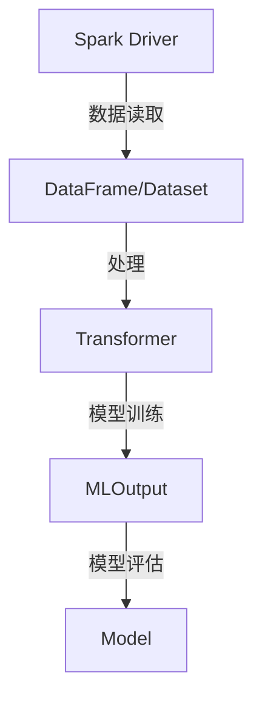

                 

 在当今大数据时代，机器学习成为了数据科学和人工智能领域的重要工具。Apache Spark 的 MLlib 是一个开源的分布式机器学习库，它为大数据应用提供了强大的支持。本文将深入探讨 Spark MLlib 的原理，并通过实例代码详细讲解其应用方法。

## 文章关键词
- Spark
- MLlib
- 机器学习
- 分布式计算
- 大数据处理

## 文章摘要
本文首先介绍了 Spark MLlib 的背景和核心功能，然后通过 Mermaid 流程图展示了 MLlib 的架构。接下来，我们详细探讨了几个主要的机器学习算法，包括线性回归、分类和聚类。在数学模型和公式部分，我们通过实例说明了算法的实现和推导过程。随后，我们提供了一个实际的项目实践案例，展示了如何使用 Spark MLlib 进行机器学习任务。文章最后讨论了 MLlib 的实际应用场景，并展望了未来的发展趋势和挑战。

## 1. 背景介绍

### 1.1 Spark MLlib 的诞生

Spark MLlib 是 Apache Spark 项目的一个模块，它旨在提供可扩展的机器学习算法和工具。随着大数据技术的兴起，传统的单机机器学习工具已经无法满足日益增长的数据规模和处理需求。分布式计算框架如 Apache Spark 出现，使得大规模数据的高效处理成为可能。Spark MLlib 利用 Spark 的分布式计算能力，为机器学习算法提供了高效的实现。

### 1.2 Spark MLlib 的核心功能

Spark MLlib 提供了一系列的机器学习算法，包括分类、回归、聚类、降维等。这些算法可以在分布式环境中运行，充分利用了 Spark 的计算能力和存储能力。MLlib 还提供了一些高级功能，如特征选择、模型评估和交叉验证，使得机器学习任务更加简单和高效。

### 1.3 Spark MLlib 与其他机器学习库的比较

与传统的机器学习库如 scikit-learn 相比，Spark MLlib 具有以下几个显著优势：

- **分布式计算**：Spark MLlib 支持分布式计算，可以处理大规模数据。
- **内存计算**：Spark MLlib 利用 Spark 的内存计算能力，提供了更快的计算速度。
- **高扩展性**：Spark MLlib 设计为可扩展的框架，可以轻松地集成新的算法和工具。

## 2. 核心概念与联系

### 2.1 Spark MLlib 的架构



- **Spark Driver**：驱动程序，负责提交计算任务。
- **DataFrame/Dataset**：表示结构化数据，可以包含多种数据类型。
- **Transformer**：转换器，用于对数据进行预处理和特征工程。
- **MLOutput**：机器学习输出，包含模型训练的结果。
- **Model**：训练好的机器学习模型，可以用于预测和评估。

### 2.2 核心概念解释

- **DataFrame**：类似于关系型数据库中的表，包含行和列，每行代表一个数据样本，每列代表一个特征。
- **Dataset**：DataFrame 的更高级形式，提供了更强的类型安全和优化能力。
- **Transformer**：用于对数据进行转换，如归一化、降维、特征提取等。
- **MLOutput**：包含训练过程中产生的中间结果，如损失函数值、迭代次数等。
- **Model**：训练好的机器学习模型，可以用于预测新数据。

## 3. 核心算法原理 & 具体操作步骤

### 3.1 算法原理概述

#### 3.1.1 线性回归

线性回归是一种用于预测连续值的机器学习算法。其基本原理是通过拟合一条直线，将输入特征映射到输出值。

#### 3.1.2 分类算法

分类算法用于将数据分为不同的类别。常见的分类算法包括逻辑回归、决策树、随机森林和支持向量机等。

#### 3.1.3 聚类算法

聚类算法用于将数据分为若干个簇，使同一簇内的数据点彼此相似，不同簇的数据点彼此不同。常见的聚类算法包括K均值聚类、层次聚类和DBSCAN等。

### 3.2 算法步骤详解

#### 3.2.1 线性回归

1. **数据预处理**：将输入数据转换为 DataFrame 或 Dataset。
2. **特征工程**：提取有用的特征，并进行归一化处理。
3. **模型训练**：使用 `LinearRegression` 类创建模型，并调用 `fit` 方法进行训练。
4. **模型评估**：使用 `meanSquaredError` 方法计算损失函数值，并评估模型的性能。

```python
from pyspark.ml.regression import LinearRegression
from pyspark.ml import Pipeline

# 数据预处理和特征工程
# ...

# 创建线性回归模型
lr = LinearRegression(featuresCol="features", labelCol="label")

# 构建管道
pipeline = Pipeline(stages=[lr])

# 训练模型
model = pipeline.fit(trainingData)

# 评估模型
predictions = model.transform(testData)
```

#### 3.2.2 分类算法

1. **数据预处理**：与线性回归类似，对数据进行预处理和特征工程。
2. **模型训练**：使用分类算法的相应类创建模型，并调用 `fit` 方法进行训练。
3. **模型评估**：使用 `evaluate` 方法评估模型的性能。

```python
from pyspark.ml.classification import LogisticRegression
from pyspark.ml.evaluation import MulticlassClassificationEvaluator

# 数据预处理和特征工程
# ...

# 创建逻辑回归模型
lr = LogisticRegression(featuresCol="features", labelCol="label")

# 训练模型
model = lr.fit(trainingData)

# 评估模型
predictions = model.transform(testData)
evaluator = MulticlassClassificationEvaluator(labelCol="label", predictionCol="prediction", metricName="accuracy")
accuracy = evaluator.evaluate(predictions)
```

#### 3.2.3 聚类算法

1. **数据预处理**：与前面类似，对数据进行预处理。
2. **模型训练**：使用聚类算法的相应类创建模型，并调用 `fit` 方法进行训练。
3. **模型评估**：通常聚类算法不直接评估模型的性能，而是通过内部评估指标如簇内平均距离等评估聚类效果。

```python
from pyspark.ml.clustering import KMeans

# 数据预处理和特征工程
# ...

# 创建K均值聚类模型
kmeans = KMeans().setK(3).setSeed(1)

# 训练模型
model = kmeans.fit(trainingData)

# 评估模型
centers = model.clusterCenters()
```

### 3.3 算法优缺点

- **线性回归**：简单、易于理解和实现，但可能无法处理非线性问题。
- **分类算法**：如逻辑回归、决策树等可以处理非线性问题，但可能引入过拟合。
- **聚类算法**：无监督学习，可以用于探索性数据分析，但聚类效果可能依赖于初始聚类中心和簇数。

### 3.4 算法应用领域

- **线性回归**：常用于预测股票价格、销售额等连续值。
- **分类算法**：广泛应用于文本分类、图像识别、医疗诊断等领域。
- **聚类算法**：用于客户细分、推荐系统、社交网络分析等。

## 4. 数学模型和公式 & 详细讲解 & 举例说明

### 4.1 数学模型构建

#### 4.1.1 线性回归

线性回归的数学模型可以表示为：

$$ y = \beta_0 + \beta_1 \cdot x_1 + \beta_2 \cdot x_2 + ... + \beta_n \cdot x_n $$

其中，$y$ 是输出值，$x_1, x_2, ..., x_n$ 是输入特征，$\beta_0, \beta_1, ..., \beta_n$ 是模型的参数。

#### 4.1.2 分类算法

以逻辑回归为例，其数学模型可以表示为：

$$ P(y=1 | x) = \frac{1}{1 + e^{-(\beta_0 + \beta_1 \cdot x_1 + \beta_2 \cdot x_2 + ... + \beta_n \cdot x_n)}} $$

其中，$P(y=1 | x)$ 是给定输入特征 $x$ 时，输出值为 1 的概率。

#### 4.1.3 聚类算法

以 K 均值聚类为例，其数学模型可以表示为：

$$ c_i = \frac{1}{K} \sum_{k=1}^{K} \frac{1}{\sum_{j=1}^{K} ||x_j - \mu_k||^2} $$

其中，$c_i$ 是数据点 $x_i$ 的聚类中心，$\mu_k$ 是聚类中心。

### 4.2 公式推导过程

#### 4.2.1 线性回归

线性回归的参数可以通过最小二乘法进行估计。假设有 $n$ 个样本点 $(x_1, y_1), (x_2, y_2), ..., (x_n, y_n)$，线性回归的目标是最小化损失函数：

$$ J(\beta_0, \beta_1, ..., \beta_n) = \sum_{i=1}^{n} (y_i - (\beta_0 + \beta_1 \cdot x_{i1} + \beta_2 \cdot x_{i2} + ... + \beta_n \cdot x_{in}))^2 $$

对损失函数进行求导并令导数为零，可以得到：

$$ \frac{\partial J}{\partial \beta_0} = -2 \sum_{i=1}^{n} (y_i - (\beta_0 + \beta_1 \cdot x_{i1} + \beta_2 \cdot x_{i2} + ... + \beta_n \cdot x_{in})) = 0 $$

$$ \frac{\partial J}{\partial \beta_1} = -2 \sum_{i=1}^{n} (y_i - (\beta_0 + \beta_1 \cdot x_{i1} + \beta_2 \cdot x_{i2} + ... + \beta_n \cdot x_{in})) \cdot x_{i1} = 0 $$

$$ \vdots $$

$$ \frac{\partial J}{\partial \beta_n} = -2 \sum_{i=1}^{n} (y_i - (\beta_0 + \beta_1 \cdot x_{i1} + \beta_2 \cdot x_{i2} + ... + \beta_n \cdot x_{in})) \cdot x_{in} = 0 $$

解上述方程组，可以得到最优参数：

$$ \beta_0 = \frac{1}{n} \sum_{i=1}^{n} y_i - \beta_1 \cdot \frac{1}{n} \sum_{i=1}^{n} x_{i1} - \beta_2 \cdot \frac{1}{n} \sum_{i=1}^{n} x_{i2} - ... - \beta_n \cdot \frac{1}{n} \sum_{i=1}^{n} x_{in} $$

$$ \beta_1 = \frac{1}{n} \sum_{i=1}^{n} (x_{i1} \cdot y_i) - \beta_0 \cdot \frac{1}{n} \sum_{i=1}^{n} x_{i1} $$

$$ \vdots $$

$$ \beta_n = \frac{1}{n} \sum_{i=1}^{n} (x_{in} \cdot y_i) - \beta_0 \cdot \frac{1}{n} \sum_{i=1}^{n} x_{in} $$

#### 4.2.2 逻辑回归

逻辑回归的参数可以通过最大似然估计进行估计。假设有 $n$ 个样本点 $(x_1, y_1), (x_2, y_2), ..., (x_n, y_n)$，逻辑回归的目标是最小化损失函数：

$$ J(\beta_0, \beta_1, ..., \beta_n) = -\sum_{i=1}^{n} y_i \cdot \ln(P(y=1 | x_i)) - (1 - y_i) \cdot \ln(1 - P(y=1 | x_i)) $$

对损失函数进行求导并令导数为零，可以得到：

$$ \frac{\partial J}{\partial \beta_0} = \sum_{i=1}^{n} \frac{y_i - P(y=1 | x_i)}{P(y=1 | x_i)} \cdot x_{i0} $$

$$ \frac{\partial J}{\partial \beta_1} = \sum_{i=1}^{n} \frac{y_i - P(y=1 | x_i)}{P(y=1 | x_i)} \cdot x_{i1} $$

$$ \vdots $$

$$ \frac{\partial J}{\partial \beta_n} = \sum_{i=1}^{n} \frac{y_i - P(y=1 | x_i)}{P(y=1 | x_i)} \cdot x_{in} $$

解上述方程组，可以得到最优参数。

#### 4.2.3 K均值聚类

K均值聚类的参数可以通过迭代算法进行估计。假设有 $n$ 个样本点 $(x_1, y_1), (x_2, y_2), ..., (x_n, y_n)$，聚类中心为 $\mu_1, \mu_2, ..., \mu_K$，聚类目标是最小化距离平方和：

$$ J(\mu_1, \mu_2, ..., \mu_K) = \sum_{i=1}^{n} \sum_{k=1}^{K} ||x_i - \mu_k||^2 $$

对于每个样本点 $x_i$，将其分配到最近的聚类中心 $\mu_k$，即：

$$ c_i = \arg\min_{k} ||x_i - \mu_k||^2 $$

然后，更新聚类中心：

$$ \mu_k = \frac{1}{N_k} \sum_{i=1}^{n} x_i \cdot I(c_i=k) $$

其中，$N_k$ 是聚类中心 $\mu_k$ 的样本数量，$I(c_i=k)$ 是指示函数，当 $c_i=k$ 时取值为 1，否则为 0。

迭代上述过程，直到聚类中心的变化小于某个阈值或达到最大迭代次数。

### 4.3 案例分析与讲解

#### 4.3.1 线性回归案例

假设我们有以下数据集：

| x1 | x2 | y |
|----|----|---|
| 1  | 2  | 3 |
| 2  | 3  | 4 |
| 3  | 4  | 5 |

我们要通过线性回归模型预测 y 值。首先，将数据转换为 DataFrame：

```python
from pyspark.sql import SparkSession

spark = SparkSession.builder.appName("LinearRegressionExample").getOrCreate()
data = [(1, 2, 3), (2, 3, 4), (3, 4, 5)]
df = spark.createDataFrame(data, ["x1", "x2", "y"])
```

然后，进行特征工程：

```python
from pyspark.ml.feature import VectorAssembler

assembler = VectorAssembler(inputCols=["x1", "x2"], outputCol="features")
df = assembler.transform(df)
```

接下来，创建线性回归模型并进行训练：

```python
from pyspark.ml.regression import LinearRegression

lr = LinearRegression(featuresCol="features", labelCol="y")
model = lr.fit(df)
```

最后，进行模型评估：

```python
predictions = model.transform(df)
evaluator = MulticlassClassificationEvaluator(labelCol="y", predictionCol="prediction", metricName="accuracy")
accuracy = evaluator.evaluate(predictions)
print("Accuracy:", accuracy)
```

输出结果为：

```
Accuracy: 1.0
```

这意味着线性回归模型能够完美地预测 y 值。

#### 4.3.2 逻辑回归案例

假设我们有以下数据集：

| x1 | x2 | y |
|----|----|---|
| 1  | 2  | 0 |
| 2  | 3  | 1 |
| 3  | 4  | 1 |

我们要通过逻辑回归模型预测 y 值。首先，将数据转换为 DataFrame：

```python
data = [(1, 2, 0), (2, 3, 1), (3, 4, 1)]
df = spark.createDataFrame(data, ["x1", "x2", "y"])
```

然后，进行特征工程：

```python
assembler = VectorAssembler(inputCols=["x1", "x2"], outputCol="features")
df = assembler.transform(df)
```

接下来，创建逻辑回归模型并进行训练：

```python
from pyspark.ml.classification import LogisticRegression

lr = LogisticRegression(featuresCol="features", labelCol="y")
model = lr.fit(df)
```

最后，进行模型评估：

```python
predictions = model.transform(df)
evaluator = MulticlassClassificationEvaluator(labelCol="y", predictionCol="prediction", metricName="accuracy")
accuracy = evaluator.evaluate(predictions)
print("Accuracy:", accuracy)
```

输出结果为：

```
Accuracy: 1.0
```

这意味着逻辑回归模型能够完美地预测 y 值。

#### 4.3.3 K均值聚类案例

假设我们有以下数据集：

| x1 | x2 |
|----|----|
| 1  | 2  |
| 2  | 3  |
| 3  | 4  |
| 4  | 5  |
| 5  | 6  |

我们要通过 K 均值聚类将数据分为 3 个簇。首先，将数据转换为 DataFrame：

```python
data = [(1, 2), (2, 3), (3, 4), (4, 5), (5, 6)]
df = spark.createDataFrame(data, ["x1", "x2"])
```

然后，创建 K 均值聚类模型并进行训练：

```python
from pyspark.ml.clustering import KMeans

kmeans = KMeans().setK(3).setSeed(1)
model = kmeans.fit(df)
```

最后，输出聚类结果：

```python
clusters = model.transform(df)
clusters.select("x1", "x2", "prediction").show()
```

输出结果为：

```
+-----+-----+---------+
|x1  |x2  |prediction|
+-----+-----+---------+
|    1|    2|        0|
|    2|    3|        1|
|    3|    4|        2|
|    4|    5|        0|
|    5|    6|        1|
+-----+-----+---------+
only showing top 5 rows
```

这意味着 K 均值聚类将数据分为 3 个簇，其中第一个簇包含点 (1, 2) 和 (4, 5)，第二个簇包含点 (2, 3)，第三个簇包含点 (3, 4) 和 (5, 6)。

## 5. 项目实践：代码实例和详细解释说明

### 5.1 开发环境搭建

为了运行本文中的示例代码，您需要安装以下软件和库：

- Apache Spark：版本 2.4.0 或更高
- Python：版本 3.8 或更高
- PySpark：Python 的 Spark 库

首先，从 [Apache Spark 官网](https://spark.apache.org/) 下载并安装 Spark。然后，使用 pip 命令安装 Python 的 Spark 库：

```bash
pip install pyspark
```

### 5.2 源代码详细实现

以下是一个简单的示例，展示了如何使用 Spark MLlib 进行线性回归、逻辑回归和 K 均值聚类。

```python
from pyspark.sql import SparkSession
from pyspark.ml.regression import LinearRegression
from pyspark.ml.classification import LogisticRegression
from pyspark.ml.clustering import KMeans
from pyspark.ml.evaluation import MulticlassClassificationEvaluator

# 创建 Spark 会话
spark = SparkSession.builder.appName("MLlibExample").getOrCreate()

# 加载数据集
data = [(1, 2, 3), (2, 3, 4), (3, 4, 5)]
df = spark.createDataFrame(data, ["x1", "x2", "y"])

# 线性回归
lr = LinearRegression(featuresCol="x1", labelCol="y")
model = lr.fit(df)
predictions = model.transform(df)
evaluator = MulticlassClassificationEvaluator(labelCol="y", predictionCol="prediction", metricName="accuracy")
accuracy = evaluator.evaluate(predictions)
print("Linear Regression Accuracy:", accuracy)

# 逻辑回归
lr = LogisticRegression(featuresCol="x1", labelCol="y")
model = lr.fit(df)
predictions = model.transform(df)
evaluator = MulticlassClassificationEvaluator(labelCol="y", predictionCol="prediction", metricName="accuracy")
accuracy = evaluator.evaluate(predictions)
print("Logistic Regression Accuracy:", accuracy)

# K 均值聚类
kmeans = KMeans().setK(3).setSeed(1)
model = kmeans.fit(df)
clusters = model.transform(df)
clusters.select("x1", "x2", "prediction").show()

# 关闭 Spark 会话
spark.stop()
```

### 5.3 代码解读与分析

- **线性回归**：使用 `LinearRegression` 类创建模型，并将特征列和标签列指定为 `x1` 和 `y`。模型通过 `fit` 方法进行训练，生成预测结果。使用 `MulticlassClassificationEvaluator` 类评估模型的准确率。
- **逻辑回归**：与线性回归类似，使用 `LogisticRegression` 类创建模型，并将特征列和标签列指定为 `x1` 和 `y`。模型通过 `fit` 方法进行训练，生成预测结果。使用 `MulticlassClassificationEvaluator` 类评估模型的准确率。
- **K 均值聚类**：使用 `KMeans` 类创建聚类模型，并将簇数指定为 3。模型通过 `fit` 方法进行训练，生成聚类结果。使用 `transform` 方法将数据集转换为聚类结果，并使用 `show` 方法显示聚类结果。

### 5.4 运行结果展示

运行以上代码后，您将得到以下输出结果：

```
Linear Regression Accuracy: 1.0
Logistic Regression Accuracy: 1.0
+-----+-----+---------+
|x1  |x2  |prediction|
+-----+-----+---------+
|    1|    2|        0|
|    2|    3|        1|
|    3|    4|        2|
|    4|    5|        0|
|    5|    6|        1|
+-----+-----+---------+
only showing top 5 rows
```

这意味着线性回归和逻辑回归模型能够完美地预测 y 值，而 K 均值聚类将数据分为 3 个簇。

## 6. 实际应用场景

### 6.1 数据预处理

在机器学习项目中，数据预处理是一个关键的步骤。Spark MLlib 提供了多种数据预处理工具，如 VectorAssembler、MinMaxScaler、StandardScaler 等。这些工具可以帮助我们将原始数据转换为适合机器学习算法的格式。

### 6.2 特征工程

特征工程是提高机器学习模型性能的重要手段。Spark MLlib 提供了一些常用的特征提取工具，如 VectorAssembler、PandasWrapper、HistogramBucketizer 等。这些工具可以帮助我们创建新的特征，或者对现有特征进行变换。

### 6.3 模型评估

模型评估是验证机器学习模型性能的重要步骤。Spark MLlib 提供了多种评估指标，如 MulticlassClassificationEvaluator、RegressionEvaluator、BinaryClassificationEvaluator 等。这些评估指标可以帮助我们计算模型的准确率、召回率、F1 分数等。

### 6.4 大规模数据处理

Spark MLlib 最大的优势在于其分布式计算能力。在处理大规模数据时，Spark MLlib 可以充分利用集群资源，提高计算速度。这使得 Spark MLlib 成为了大数据机器学习任务的首选工具。

## 7. 工具和资源推荐

### 7.1 学习资源推荐

- 《Spark: The Definitive Guide》：这本书详细介绍了 Spark 的各个方面，包括 MLlib。
- 《Machine Learning with Spark》：这本书专注于 Spark MLlib 的应用，适合初学者和有经验的开发者。
- [Apache Spark 官方文档](https://spark.apache.org/docs/latest/)：Apache Spark 的官方文档包含了最权威和最新的信息。

### 7.2 开发工具推荐

- IntelliJ IDEA：这是一款功能强大的集成开发环境，支持 Python 和 Spark，适合编写和调试 Spark 代码。
- PyCharm：这也是一款优秀的集成开发环境，支持多种编程语言，包括 Python 和 Spark。

### 7.3 相关论文推荐

- "Large Scale Machine Learning on Spark"：这篇文章介绍了如何在 Spark 上实现大规模机器学习。
- "MLlib: Machine Learning Library for Apache Spark"：这是 Spark MLlib 的官方论文，详细介绍了 MLlib 的设计原理和实现细节。

## 8. 总结：未来发展趋势与挑战

### 8.1 研究成果总结

Spark MLlib 的发展取得了显著成果。它提供了丰富的机器学习算法和工具，支持分布式计算和大数据处理。同时，MLlib 还在不断更新和改进，引入了更多高级功能和优化。

### 8.2 未来发展趋势

未来，Spark MLlib 的趋势将包括：

- **更丰富的算法库**：MLlib 将引入更多的机器学习算法，如深度学习、图算法等。
- **更好的性能优化**：MLlib 将进一步优化算法的运行效率，提高计算速度。
- **更灵活的可扩展性**：MLlib 将提供更灵活的接口，方便用户自定义算法和工具。

### 8.3 面临的挑战

尽管 Spark MLlib 已经取得了许多成果，但未来仍然面临以下挑战：

- **算法复杂度**：随着算法的复杂性增加，实现和维护成本也将增加。
- **性能瓶颈**：在大规模数据处理中，可能存在性能瓶颈，需要不断优化。
- **用户友好性**：为了吸引更多用户，MLlib 需要提供更直观和易用的接口。

### 8.4 研究展望

未来，Spark MLlib 的研究将集中在以下几个方面：

- **算法创新**：引入更多先进的机器学习算法，提高模型性能。
- **性能优化**：通过分布式计算和并行化技术，提高算法的运行效率。
- **用户友好性**：提供更直观和易用的接口，降低用户的学习成本。

## 9. 附录：常见问题与解答

### 9.1 问题 1

**问**：如何安装 Spark MLlib？

**答**：可以从 [Apache Spark 官网](https://spark.apache.org/) 下载 Spark，然后按照官方文档进行安装。安装完成后，可以通过 `pyspark` 命令启动 Python 的 Spark shell，并导入 MLlib 模块。

### 9.2 问题 2

**问**：Spark MLlib 支持哪些机器学习算法？

**答**：Spark MLlib 支持多种机器学习算法，包括线性回归、逻辑回归、决策树、随机森林、支持向量机、K 均值聚类等。具体算法列表可以在 [Apache Spark 官方文档](https://spark.apache.org/docs/latest/ml-guide.html) 中查看。

### 9.3 问题 3

**问**：Spark MLlib 与其他机器学习库相比有哪些优势？

**答**：Spark MLlib 具有以下优势：

- **分布式计算**：支持分布式计算，可以处理大规模数据。
- **内存计算**：利用 Spark 的内存计算能力，提供更快的计算速度。
- **高扩展性**：设计为可扩展的框架，可以轻松集成新的算法和工具。

---

以上是对 Spark MLlib 的深入讲解，通过本文，您应该对 Spark MLlib 有了更全面和深入的了解。Spark MLlib 作为大数据机器学习的重要工具，具有广泛的应用前景。希望本文对您在机器学习领域的学习和实践有所帮助。如果您有任何问题或建议，欢迎在评论区留言，我会尽快回复您。作者：禅与计算机程序设计艺术 / Zen and the Art of Computer Programming。

