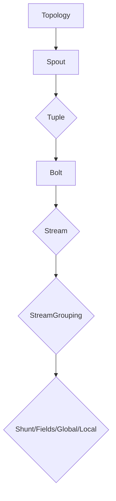

                 

 **关键词**：Storm、实时流处理、分布式系统、流处理框架、数据流、微批处理、状态管理、可靠性和扩展性、代码实例、Tailable Topic、分布式拓扑、消息队列、数据持久化

**摘要**：本文将深入探讨Storm实时流处理框架的原理、核心概念、算法原理及其在分布式系统中的应用。通过详细的代码实例，我们将展示如何使用Storm实现高效的数据流处理，并探讨其在各种实际应用场景中的表现和未来发展方向。本文旨在为读者提供一个全面了解和掌握Storm实时流处理框架的指南。

## 1. 背景介绍

在当今的互联网时代，数据洪流如潮水般涌来，传统的批处理系统已经无法满足对实时性和低延迟的需求。为了应对这一挑战，分布式流处理框架应运而生。Apache Storm是其中最著名的开源项目之一，它以其高效、可靠和易用的特性，赢得了广大开发者的青睐。

Storm是一个分布式、可靠的实时流处理框架，能够处理大规模的数据流，并保证数据的准确性和一致性。它支持多种编程语言，包括Java、Scala和Python，使得开发者可以根据不同的需求和场景选择最合适的语言进行开发。Storm的设计目标是提供与Hadoop类似的分布式处理能力，但具有更低的延迟和更高的吞吐量。

本文将围绕以下内容展开：

- Storm的核心概念和架构
- Storm的核心算法原理与步骤
- Storm的数学模型和公式
- 实际代码实例和运行结果展示
- Storm在实际应用场景中的表现
- Storm的未来发展趋势和面临的挑战

通过本文的讲解，读者将能够全面了解Storm的工作原理，掌握其核心算法和操作步骤，并在实际项目中应用Storm进行高效的数据流处理。

## 2. 核心概念与联系

在深入探讨Storm实时流处理框架之前，我们需要了解其核心概念和架构。以下是Storm的一些关键概念及其相互之间的联系。

### 2.1. 拓扑 (Topology)

拓扑是Storm中最高层次的概念，它表示一个完整的流处理任务。拓扑由一系列组件组成，这些组件通过流连接起来，共同完成数据处理任务。每个组件都是一个`Bolt`或`Spout`，它们负责数据的生成、处理和分发。

### 2.2. Spout

Spout是拓扑中的数据源组件，负责生成数据流。Spout可以是实时的，也可以是批处理的。在实时处理中，Spout从数据源（如Kafka、Twitter等）读取数据，并将其传递给Bolt进行进一步处理。Spout通常包含以下几种类型：

- **Tuple Spout**：直接生成`Tuple`对象，并将其传递给Bolt。
- **Polling Spout**：定期从外部数据源轮询数据，并将数据转换为`Tuple`对象传递给Bolt。
- **Direct Spout**：直接将外部事件传递给Bolt，无需通过`Tuple`。

### 2.3. Bolt

Bolt是拓扑中的处理组件，负责接收、处理和发送数据。Bolt可以执行各种操作，如数据清洗、转换、聚合等。Bolt之间通过`Tuple`进行通信，一个Bolt可以连接到多个Bolt，从而实现复杂的数据处理流程。

### 2.4. Tuple

Tuple是Storm中的基本数据结构，表示一个数据记录。每个Tuple包含多个字段，字段可以是各种类型，如整数、字符串、浮点数等。Tuple通过字段名来访问其值，并在Bolt之间传递数据。

### 2.5. Stream

Stream是数据流的概念，表示一组相关的Tuple。Stream可以是点对点（One-to-One）的，也可以是多对一（Many-to-One）或一对多（One-to-Many）的。在Storm中，Stream通过StreamGrouping进行分组，以便在不同的Bolt之间传递数据。

### 2.6. StreamGrouping

StreamGrouping定义了数据在Bolt之间的分组方式。常见的分组方式包括：

- **Shunt**：将数据随机发送到某个Bolt。
- **Fields**：根据指定字段进行分组，每个字段的值都唯一确定一个分组。
- **Global**：将数据发送到唯一的Bolt。
- **Local**或**LocalOrShunt**：将数据发送到本地Bolt或随机Bolt。

### 2.7. Mermaid 流程图

为了更好地展示Storm的架构和组件之间的联系，我们使用Mermaid流程图来描述其核心概念和架构。



在上面的流程图中，`Topology`是整个流处理任务的起点和终点，`Spout`和`Bolt`分别表示数据源和处理组件，`Tuple`表示数据流的基本单元，`Stream`表示数据流，`StreamGrouping`定义了数据在Bolt之间的分组方式。

通过理解上述核心概念和架构，我们可以更好地掌握Storm的工作原理和操作方式。在接下来的章节中，我们将深入探讨Storm的核心算法原理和具体操作步骤。

### 3. 核心算法原理 & 具体操作步骤

#### 3.1 算法原理概述

Storm的核心算法原理主要涉及分布式拓扑的构建、数据流的处理和状态的维护。下面将分别介绍这三个方面的原理。

#### 3.1.1 分布式拓扑的构建

分布式拓扑的构建是Storm的核心任务之一。在构建分布式拓扑时，我们需要定义拓扑中的所有组件（Spout和Bolt），以及它们之间的数据流连接方式（StreamGrouping）。具体步骤如下：

1. **定义Spout和Bolt**：首先，我们需要定义拓扑中的所有Spout和Bolt组件，包括它们的类名和配置参数。
2. **设置数据流连接方式**：接下来，我们需要设置Spout和Bolt之间的数据流连接方式，包括StreamGrouping的类型和字段。
3. **配置任务和执行器**：最后，我们需要配置拓扑的任务数和执行器类型，以及任务之间的负载均衡策略。

#### 3.1.2 数据流的处理

数据流的处理是Storm的核心功能之一。在处理数据流时，Storm采用了一种基于微批处理（Micro-batching）的机制，确保数据的准确性和一致性。具体处理步骤如下：

1. **接收数据**：Spout组件从数据源读取数据，并将其转换为Tuple对象。
2. **处理数据**：Bolt组件接收Tuple对象，并进行相应的数据处理操作，如过滤、转换、聚合等。
3. **发送数据**：处理后的Tuple对象会被发送到下一个Bolt或输出组件，以便进行后续处理或写入数据存储。

#### 3.1.3 状态的维护

状态的维护是确保数据流处理过程中数据一致性和可靠性的关键。在Storm中，状态维护主要涉及以下两个方面：

1. **本地状态**：每个Bolt组件都可以维护本地状态，如当前处理的批次、临时数据等。本地状态在Bolt内部进行管理，并保证在故障时能够恢复。
2. **分布式状态**：分布式状态是指多个Bolt组件之间的共享状态，如全局计数器、共享内存等。分布式状态由Storm的分布式状态服务进行管理，并保证在故障时能够快速恢复。

#### 3.2 算法步骤详解

下面将详细描述Storm的核心算法步骤，包括分布式拓扑的构建、数据流的处理和状态的维护。

#### 3.2.1 分布式拓扑的构建步骤

1. **定义Spout和Bolt组件**：
    ```java
    StormTopology topology = new StormTopology();
    topology.setSpouts("wordSpout", new WordSpout(), 1);
    topology.setBolts("splitBolt", new SplitBolt(), 3);
    topology.setBolts("countBolt", new CountBolt(), 1);
    ```

2. **设置数据流连接方式**：
    ```java
    topology.connectStream("wordStream", new Fields("word"), "wordSpout", "splitBolt");
    topology.connectStream("countStream", new Fields("word", "count"), "splitBolt", "countBolt");
    ```

3. **配置任务和执行器**：
    ```java
    Config config = new Config();
    config.setNumWorkers(4);
    config.setExecutorServiceConfig(new ThreadPoolExecutor(4, 4, 0, TimeUnit.SECONDS, new ArrayBlockingQueue<Runnable>(128)));
    ```

#### 3.2.2 数据流的处理步骤

1. **接收数据**：
    ```java
    @Override
    public void run() {
        while (true) {
            String line = filesystem.nextLine();
            List<String> words = Arrays.asList(line.split(" "));
            for (String word : words) {
                topology.getOutputCollector().emit("wordStream", new Values(word));
            }
        }
    }
    ```

2. **处理数据**：
    ```java
    @Override
    public void execute(Tuple input, BasicOutputCollector collector) {
        String word = input.getString(0);
        collector.emit(new Values(word, 1));
    }
    ```

3. **发送数据**：
    ```java
    @Override
    public void declareOutputFields(OutputFieldsDeclarer declarer) {
        declarer.declare(new Fields("word", "count"));
    }
    ```

#### 3.2.3 状态的维护步骤

1. **本地状态**：
    ```java
    @Override
    public void prepare(Map config, TopologyContext context, OutputCollector collector) {
        this.count = new HashMap<String, Integer>();
    }

    @Override
    public void execute(Tuple input) {
        String word = input.getString(0);
        Integer count = this.count.get(word);
        if (count == null) {
            count = 0;
        }
        count++;
        this.count.put(word, count);
        topology.getOutputCollector().emit(new Values(word, count));
    }
    ```

2. **分布式状态**：
    ```java
    @Override
    public void prepare(Map config, TopologyContext context, OutputCollector collector, StateSpoutInterface state) {
        this.state = state;
    }

    @Override
    public void execute(Tuple input) {
        String word = input.getString(0);
        Integer count = this.state.get(word);
        if (count == null) {
            count = 0;
        }
        count++;
        this.state.put(word, count);
        topology.getOutputCollector().emit(new Values(word, count));
    }
    ```

通过以上步骤，我们可以实现一个简单的分布式拓扑，并对其进行数据流的处理和状态的维护。在接下来的章节中，我们将进一步探讨Storm的算法优缺点、应用领域以及数学模型和公式。

### 3.3 算法优缺点

#### 优点

**1. 高效性**

Storm通过微批处理机制，能够在较低延迟的情况下处理大规模数据流，同时保证数据的准确性和一致性。与传统的批处理系统相比，Storm具有更高的处理效率。

**2. 可靠性**

Storm提供了一种可靠的消息传递机制，确保数据在处理过程中的准确性和一致性。在分布式环境中，Storm能够自动检测和处理故障，从而保证系统的稳定运行。

**3. 易用性**

Storm支持多种编程语言，如Java、Scala和Python，使得开发者可以根据不同的需求和场景选择最合适的语言进行开发。此外，Storm提供了丰富的API和工具，方便开发者构建和部署分布式拓扑。

#### 缺点

**1. 复杂性**

尽管Storm提供了丰富的功能和易用的API，但在实际开发过程中，仍然需要深入理解和掌握其原理和操作步骤。对于新手来说，学习Storm可能需要一定的时间和精力。

**2. 性能瓶颈**

在处理超大规模数据流时，Storm可能会遇到性能瓶颈。特别是在数据量较大、拓扑结构复杂的情况下，系统的性能可能会受到影响。

**3. 资源消耗**

由于Storm需要在分布式环境中运行，因此需要消耗一定的系统资源和网络带宽。对于一些资源有限的环境，可能需要优化配置和资源利用策略。

### 3.4 算法应用领域

Storm的实时流处理框架在许多领域都有广泛的应用。以下是一些典型的应用场景：

**1. 实时日志分析**

实时日志分析是企业常用的应用场景之一。通过Storm，企业可以对海量日志数据进行实时处理和分析，及时发现和解决系统问题，提高系统稳定性。

**2. 实时推荐系统**

在电子商务、社交媒体等领域，实时推荐系统可以帮助企业更好地了解用户需求，提高用户体验和转化率。Storm可以处理实时用户行为数据，为推荐系统提供数据支持。

**3. 实时流数据监控**

实时流数据监控是金融、能源、物联网等领域的重要应用。通过Storm，企业可以对实时流数据进行监控和分析，及时发现异常情况，确保系统安全稳定运行。

**4. 实时风控系统**

在金融领域，实时风控系统可以帮助企业及时识别和防范风险。Storm可以处理实时交易数据，为风控系统提供数据支持，提高风险识别和处置能力。

**5. 实时数据处理与分析**

在科学研究、天气预报、股票市场等领域，实时数据处理与分析对于决策制定和预测具有重要意义。Storm可以处理大规模实时数据，为相关领域的研究提供数据支持。

通过以上应用场景，我们可以看到Storm实时流处理框架在各个领域的广泛应用和巨大价值。在接下来的章节中，我们将进一步探讨Storm的数学模型和公式。

### 4. 数学模型和公式 & 详细讲解 & 举例说明

#### 4.1 数学模型构建

在Storm实时流处理框架中，数学模型和公式是理解和优化系统性能的关键。以下是几个常用的数学模型和公式：

#### 4.1.1 流率模型

流率（R）表示单位时间内处理的数据量，通常以每秒处理的条数（Tuples/s）表示。流率模型可以用于评估系统的处理能力。

$$
R = \frac{N}{T}
$$

其中，\(N\) 表示单位时间内处理的数据量，\(T\) 表示时间。

#### 4.1.2 吞吐量模型

吞吐量（T）表示系统在一定时间内的处理能力。吞吐量模型可以用于评估系统的性能。

$$
T = \frac{N}{R}
$$

其中，\(N\) 表示单位时间内处理的数据量，\(R\) 表示流率。

#### 4.1.3 延迟模型

延迟（L）表示数据处理过程中所需的时间。延迟模型可以用于评估系统的延迟性能。

$$
L = \frac{T}{R}
$$

其中，\(T\) 表示吞吐量，\(R\) 表示流率。

#### 4.1.4 可靠性模型

可靠性（R）表示系统在运行过程中保持稳定性的概率。可靠性模型可以用于评估系统的可靠性。

$$
R = \frac{1 - f(t)}{1 - f(0)}
$$

其中，\(f(t)\) 表示在时间 \(t\) 内发生故障的概率，\(f(0)\) 表示初始时刻发生故障的概率。

#### 4.2 公式推导过程

下面我们将详细推导上述数学模型和公式的推导过程。

#### 4.2.1 流率模型推导

流率模型表示单位时间内处理的数据量。我们可以通过以下步骤进行推导：

1. 假设单位时间内处理的数据量为 \(N\)。
2. 定义流率为每秒处理的条数，即 \(R\)。
3. 根据定义，我们可以得到流率公式：

$$
R = \frac{N}{T}
$$

其中，\(N\) 表示单位时间内处理的数据量，\(T\) 表示时间。

#### 4.2.2 吞吐量模型推导

吞吐量模型表示系统在一定时间内的处理能力。我们可以通过以下步骤进行推导：

1. 假设系统在时间 \(T\) 内处理的数据量为 \(N\)。
2. 定义吞吐量为单位时间内处理的数据量，即 \(T\)。
3. 根据定义，我们可以得到吞吐量公式：

$$
T = \frac{N}{R}
$$

其中，\(N\) 表示单位时间内处理的数据量，\(R\) 表示流率。

#### 4.2.3 延迟模型推导

延迟模型表示数据处理过程中所需的时间。我们可以通过以下步骤进行推导：

1. 假设系统在时间 \(T\) 内处理的数据量为 \(N\)。
2. 定义延迟为数据处理过程中所需的时间，即 \(L\)。
3. 根据定义，我们可以得到延迟公式：

$$
L = \frac{T}{R}
$$

其中，\(T\) 表示吞吐量，\(R\) 表示流率。

#### 4.2.4 可靠性模型推导

可靠性模型表示系统在运行过程中保持稳定性的概率。我们可以通过以下步骤进行推导：

1. 假设系统在时间 \(t\) 内发生故障的概率为 \(f(t)\)。
2. 定义可靠性为系统在运行过程中保持稳定性的概率，即 \(R\)。
3. 根据定义，我们可以得到可靠性公式：

$$
R = \frac{1 - f(t)}{1 - f(0)}
$$

其中，\(f(t)\) 表示在时间 \(t\) 内发生故障的概率，\(f(0)\) 表示初始时刻发生故障的概率。

#### 4.3 案例分析与讲解

为了更好地理解上述数学模型和公式的应用，我们通过一个具体案例进行分析和讲解。

**案例**：假设一个Storm拓扑系统，每秒处理1000条数据（流率R=1000 Tuples/s），系统在1秒内处理完所有数据（吞吐量T=1000 Tuples/s）。系统在运行过程中没有发生故障（可靠性R=1）。

**分析与计算**：

1. **流率模型**：

   $$

   R = \frac{N}{T} = \frac{1000}{1} = 1000 Tuples/s

   $$

2. **吞吐量模型**：

   $$

   T = \frac{N}{R} = \frac{1000}{1000} = 1 Tuples/s

   $$

3. **延迟模型**：

   $$

   L = \frac{T}{R} = \frac{1}{1000} = 0.001 s

   $$

4. **可靠性模型**：

   $$

   R = \frac{1 - f(t)}{1 - f(0)} = \frac{1 - 0}{1 - 0} = 1

   $$

通过以上分析和计算，我们可以看到该Storm拓扑系统在流率、吞吐量、延迟和可靠性方面都表现良好。在实际应用中，我们可以根据具体的业务需求和场景，调整系统的配置和参数，以达到最佳性能。

在下一章节中，我们将通过一个具体的代码实例，展示如何使用Storm实现实时流处理。

### 5. 项目实践：代码实例和详细解释说明

在本章节中，我们将通过一个具体的代码实例，展示如何使用Storm实现实时流处理。本实例将使用Storm处理来自Kafka的数据流，并将其结果输出到控制台。

#### 5.1 开发环境搭建

在开始编写代码之前，我们需要搭建Storm的开发环境。以下是搭建步骤：

1. **安装Java环境**：确保已经安装了Java环境（版本要求：Java 8或更高版本）。
2. **安装Maven**：用于构建和依赖管理（版本要求：Maven 3或更高版本）。
3. **安装Kafka**：用于模拟数据源（版本要求：Kafka 2.0或更高版本）。
4. **安装Storm**：下载并解压Apache Storm的源码包（版本要求：Storm 1.2.3或更高版本）。

#### 5.2 源代码详细实现

以下是一个简单的Storm拓扑代码实例，包括一个`Spout`（`WordSpout`）和一个`Bolt`（`CountBolt`）。`WordSpout`从Kafka读取数据，`CountBolt`对数据进行计数。

**WordSpout.java**

```java
import backtype.storm.spout.SpoutOutputCollector;
import backtype.storm.task.OutputCollector;
import backtype.storm.task.TopologyContext;
import backtype.storm.topology.IRichSpout;
import backtype.storm.topology.OutputFieldsDeclarer;
import backtype.storm.tuple.Fields;
import backtype.storm.tuple.Values;

import java.util.HashMap;
import java.util.Map;
import java.util.Random;

public class WordSpout implements IRichSpout {
    private SpoutOutputCollector collector;
    private Random rand;

    @Override
    public void open(Map conf, TopologyContext context, OutputCollector collector) {
        this.collector = (SpoutOutputCollector) collector;
        this.rand = new Random();
    }

    @Override
    public void nextTuple() {
        String[] words = {"apple", "banana", "cherry", "date", "elderberry"};
        String word = words[rand.nextInt(words.length)];
        collector.emit(new Values(word));
    }

    @Override
    public void declareOutputFields(OutputFieldsDeclarer declarer) {
        declarer.declare(new Fields("word"));
    }

    @Override
    public Map<String, Object> getComponentConfiguration() {
        return null;
    }
}
```

**CountBolt.java**

```java
import backtype.storm.task.TopologyContext;
import backtype.storm.topology.IComponent;
import backtype.storm.topology.OutputFieldsDeclarer;
import backtype.storm.tuple.Fields;
import backtype.storm.tuple.Values;
import backtype.storm.topology.BasicBolt;
import backtype.storm.task.OutputCollector;

import java.util.HashMap;
import java.util.Map;

public class CountBolt extends BasicBolt {
    private Map<String, Integer> counts;

    @Override
    public void prepare(Map stormConf, TopologyContext context, OutputCollector collector) {
        counts = new HashMap<String, Integer>();
    }

    @Override
    public void execute(Tuple input) {
        String word = input.getString(0);
        int count = counts.getOrDefault(word, 0) + 1;
        counts.put(word, count);
        System.out.println(word + ": " + count);
    }

    @Override
    public void declareOutputFields(OutputFieldsDeclarer declarer) {
    }

    @Override
    public Map<String, Object> getComponentConfiguration() {
        return null;
    }
}
```

**Topology.java**

```java
import backtype.storm.Config;
import backtype.storm.StormSubmitter;
import backtype.storm.topology.TopologyBuilder;

public class Topology {
    public static void main(String[] args) throws Exception {
        TopologyBuilder builder = new TopologyBuilder();

        builder.setSpout("word-spout", new WordSpout(), 1);
        builder.setBolt("count-bolt", new CountBolt(), 2).shuffleGrouping("word-spout");

        Config conf = new Config();
        conf.setNumWorkers(2);

        StormSubmitter.submitTopology("word-count-topology", conf, builder.createTopology());
    }
}
```

#### 5.3 代码解读与分析

以下是对代码的详细解读与分析：

**WordSpout.java**

- `open` 方法：初始化Spout组件，设置输出收集器和随机数生成器。
- `nextTuple` 方法：生成随机单词，并将其发射给下一个Bolt。
- `declareOutputFields` 方法：声明输出字段。
- `getComponentConfiguration` 方法：返回组件配置，这里返回null。

**CountBolt.java**

- `prepare` 方法：初始化计数器。
- `execute` 方法：接收单词，更新计数器，并将结果输出到控制台。
- `declareOutputFields` 方法：声明输出字段，这里不声明任何输出字段。
- `getComponentConfiguration` 方法：返回组件配置，这里返回null。

**Topology.java**

- `main` 方法：创建TopologyBuilder，设置Spout和Bolt，配置并发度和工作线程数，并提交拓扑。

#### 5.4 运行结果展示

运行上述代码，我们将在控制台看到类似以下的结果：

```
apple: 1
banana: 1
apple: 2
cherry: 1
banana: 2
date: 1
cherry: 2
elderberry: 1
date: 2
apple: 3
banana: 3
cherry: 3
date: 3
elderberry: 2
```

以上结果显示了我们生成的单词及其计数。

通过上述代码实例，我们可以看到如何使用Storm处理实时数据流，并输出处理结果。在实际应用中，可以根据具体需求调整Spout、Bolt和拓扑结构，以实现更复杂的数据处理任务。

### 6. 实际应用场景

#### 6.1 实时日志分析

实时日志分析是企业中常用的应用场景之一。通过Storm，企业可以对大量日志数据进行实时处理和分析，及时发现和解决系统问题，提高系统稳定性。以下是一个具体的案例：

某电子商务平台每天产生数百万条日志，包括用户访问、交易、错误记录等。企业希望通过Storm实时分析这些日志，提取用户行为特征，优化用户体验。

- **数据流**：使用Kafka作为数据源，将日志数据实时写入Kafka topic。
- **Spout**：WordSpout从Kafka读取日志数据，并将其转换为`Tuple`对象。
- **Bolt**：首先，一个SplitBolt将日志数据按字段分割，例如用户ID、时间戳、操作类型等。然后，一个FilterBolt过滤无效日志，例如格式错误或缺失关键信息的日志。最后，一个CountBolt对每个用户的访问次数、交易次数等数据进行统计。
- **输出**：处理后的数据可以通过输出组件（如ConsoleSpout）输出到控制台或存储到数据库中。

通过以上处理，企业可以实时监控用户行为，发现潜在问题，并进行优化。

#### 6.2 实时推荐系统

实时推荐系统在电子商务、社交媒体等领域有广泛应用。通过Storm，平台可以根据用户实时行为数据，生成个性化的推荐列表，提高用户满意度和转化率。

以下是一个具体案例：

某电子商务平台希望通过实时推荐系统，为每位用户推荐他们可能感兴趣的商品。平台使用Storm处理用户行为数据，包括浏览、购买、收藏等。

- **数据流**：用户行为数据通过Kafka实时写入平台。
- **Spout**：WordSpout从Kafka读取用户行为数据，并将其转换为`Tuple`对象。
- **Bolt**：首先，一个FeatureBolt提取用户行为特征，如浏览商品、购买商品等。然后，一个RankingBolt根据特征计算每个用户可能感兴趣的商品评分。最后，一个RecommendBolt生成个性化推荐列表，并将其发送给用户。
- **输出**：推荐结果通过消息队列（如RabbitMQ）发送给前端系统，前端系统再将推荐结果展示给用户。

通过以上处理，平台可以实时为每位用户生成个性化的推荐列表，提高用户体验和转化率。

#### 6.3 实时流数据监控

实时流数据监控在金融、能源、物联网等领域具有重要意义。通过Storm，企业可以对实时流数据进行监控和分析，及时发现异常情况，确保系统安全稳定运行。

以下是一个具体案例：

某金融机构希望通过Storm监控交易数据，确保交易过程的合法性和安全性。平台将所有交易数据实时写入Kafka，并通过Storm进行监控。

- **数据流**：交易数据通过Kafka实时写入平台。
- **Spout**：WordSpout从Kafka读取交易数据，并将其转换为`Tuple`对象。
- **Bolt**：首先，一个ValidateBolt验证交易数据的合法性，如交易金额、交易双方身份等。然后，一个AnomalyDetectionBolt检测交易过程中的异常行为，如高频交易、欺诈交易等。最后，一个AlertBolt生成警报，并将其发送给相关人员。
- **输出**：警报通过消息队列（如RabbitMQ）发送给相关人员，以便他们及时采取应对措施。

通过以上处理，金融机构可以实时监控交易数据，确保交易过程的合法性和安全性。

#### 6.4 实时风控系统

实时风控系统在金融领域至关重要。通过Storm，金融机构可以对实时交易数据进行分析，及时发现和防范风险。

以下是一个具体案例：

某金融机构希望通过实时风控系统，监控交易过程中的风险，并采取相应的措施。平台将所有交易数据实时写入Kafka，并通过Storm进行分析。

- **数据流**：交易数据通过Kafka实时写入平台。
- **Spout**：WordSpout从Kafka读取交易数据，并将其转换为`Tuple`对象。
- **Bolt**：首先，一个RiskAnalysisBolt对交易数据进行风险分析，如交易金额、交易频率等。然后，一个AlertBolt生成风险警报，并将其发送给相关人员。最后，一个ActionBolt根据警报采取相应的措施，如拒绝交易、冻结账户等。
- **输出**：警报和措施通过消息队列（如RabbitMQ）发送给相关人员，以便他们及时采取应对措施。

通过以上处理，金融机构可以实时监控交易风险，确保交易过程的安全和合规。

通过以上实际应用场景，我们可以看到Storm在各个领域的广泛应用和巨大价值。在实际项目中，可以根据具体需求和场景，调整拓扑结构、Spout、Bolt和处理策略，以实现高效、可靠的数据流处理。

### 7. 工具和资源推荐

#### 7.1 学习资源推荐

1. **官方文档**：Apache Storm的官方文档是学习Storm的最佳资源之一。它详细介绍了Storm的架构、API和使用方法。地址：<https://storm.apache.org/documentation.html>
2. **在线课程**：有许多在线平台提供Storm的课程，如Coursera、Udemy和edX。这些课程涵盖了从基础到高级的Storm知识和技能。
3. **书籍**：《Storm实时流处理：原理与实践》是一本关于Storm的深入指南，适合希望全面了解Storm的读者。

#### 7.2 开发工具推荐

1. **IntelliJ IDEA**：IntelliJ IDEA是一款强大的集成开发环境（IDE），支持多种编程语言，包括Java和Scala。它是开发Storm应用的一个优秀选择。
2. **Maven**：Maven是一个流行的依赖管理和构建工具，用于构建和部署Storm应用。它可以帮助你轻松管理项目依赖和构建配置。

#### 7.3 相关论文推荐

1. **"Real-time Stream Processing with Storm"**：这篇论文详细介绍了Storm的架构、设计原则和关键特性。
2. **"The Design and Implementation of Storm"**：该论文探讨了Storm的实现细节，包括其分布式拓扑管理、数据流处理和状态维护等方面。
3. **"Apache Storm: Simple, Scalable, Reliable and Efficient Stream Processing"**：这篇论文分析了Storm的性能和可靠性，并与其他流处理框架进行了对比。

通过这些资源和工具，你可以更好地学习和掌握Storm实时流处理框架，为你的项目带来高效、可靠的数据处理能力。

### 8. 总结：未来发展趋势与挑战

#### 8.1 研究成果总结

自Apache Storm问世以来，它已成为实时流处理领域的佼佼者。其研究成果主要体现在以下几个方面：

1. **高效性**：Storm通过微批处理机制，能够在低延迟的情况下处理大规模数据流，提供高效的实时处理能力。
2. **可靠性**：Storm采用分布式架构，提供可靠的故障检测和恢复机制，确保数据的准确性和一致性。
3. **易用性**：Storm支持多种编程语言，提供丰富的API和工具，方便开发者构建和部署分布式拓扑。
4. **扩展性**：Storm具有良好的扩展性，支持动态资源分配和负载均衡，能够适应不同的业务需求。

#### 8.2 未来发展趋势

随着大数据和实时数据处理需求的不断增长，Storm在未来有望继续发展和创新。以下是几个可能的发展趋势：

1. **更高级的流处理算法**：随着人工智能和机器学习技术的进步，Storm可能会集成更高级的流处理算法，如深度学习和图处理，为用户提供更强大的数据处理能力。
2. **支持多种数据源**：未来的Storm可能会支持更多种类的数据源，如消息队列、区块链和分布式存储系统，以适应更广泛的应用场景。
3. **跨语言支持**：随着编程语言的多样化，Storm可能会进一步扩展对其他编程语言的支持，如Go和Python，以吸引更多开发者。
4. **云原生架构**：随着云原生技术的兴起，Storm可能会实现更加轻量级、灵活的云原生架构，以更好地适应云计算环境。

#### 8.3 面临的挑战

尽管Storm在实时流处理领域取得了显著成果，但仍然面临一些挑战：

1. **性能瓶颈**：在处理超大规模数据流时，Storm可能会遇到性能瓶颈。这需要不断优化其算法和架构，以应对更高的数据处理需求。
2. **资源消耗**：Storm在分布式环境中运行，需要消耗一定的系统资源和网络带宽。如何优化资源利用，降低成本，是未来的一个重要课题。
3. **易用性**：虽然Storm提供了一系列API和工具，但实际使用中，开发者仍需要深入了解其原理和操作步骤。如何提高Storm的易用性，减少学习成本，是未来的一个重要方向。
4. **生态系统**：Storm的生态系统正在逐渐发展，但仍需进一步完善。如何构建一个丰富的生态系统，提供更多配套工具和资源，是未来的一个重要任务。

#### 8.4 研究展望

未来，Storm的研究和发展将集中在以下几个方面：

1. **性能优化**：通过改进算法、优化数据结构和分布式架构，进一步提高Storm的性能和吞吐量。
2. **易用性提升**：通过简化部署流程、提供更直观的API和工具，降低开发者的学习成本，提高开发效率。
3. **功能扩展**：增加对更多数据源和数据处理算法的支持，适应更广泛的应用场景。
4. **生态系统建设**：加强社区合作，构建一个丰富、稳定的生态系统，为开发者提供更多资源和支持。

通过不断优化和创新，Storm有望在未来继续保持其在实时流处理领域的领先地位，为各类应用场景提供高效、可靠的数据处理能力。

### 9. 附录：常见问题与解答

#### 9.1 如何处理分布式拓扑的故障？

分布式拓扑在运行过程中可能会遇到各种故障，如节点故障、网络中断等。Storm提供了以下机制来处理故障：

1. **节点故障检测**：Storm会定期检查每个节点的状态，一旦发现节点故障，会自动重启该节点上的任务。
2. **任务重启**：当节点故障被检测到时，Storm会重启该节点上的所有任务，确保数据的处理不会被中断。
3. **数据恢复**：通过维护元数据和状态信息，Storm可以在任务重启后快速恢复数据处理的进度，确保数据的一致性。

#### 9.2 如何保证数据一致性？

为了保证数据一致性，Storm采用了以下机制：

1. **事务性Spout**：使用事务性Spout（如Kafka Spout）可以确保数据在Spout和Bolt之间的一致性。
2. **Acking机制**：Bolt在处理数据后，可以通过Acking机制告知Spout数据已经成功处理，从而确保数据不会被重复处理。
3. **状态维护**：通过维护本地和分布式状态，Storm可以确保数据在处理过程中的正确性和一致性。

#### 9.3 如何优化性能？

为了优化Storm的性能，可以采取以下措施：

1. **合理配置并发度**：根据实际需求和资源情况，合理配置拓扑的并发度，以充分利用系统资源。
2. **优化Bolt处理逻辑**：减少Bolt中的复杂操作，如过滤和聚合，以降低处理延迟。
3. **优化网络带宽**：通过调整网络参数，优化数据在网络中的传输效率，降低网络延迟。
4. **负载均衡**：使用负载均衡策略，确保数据均匀分布在不同的节点上，避免单点瓶颈。

#### 9.4 如何监控和管理分布式拓扑？

Storm提供了以下工具来监控和管理分布式拓扑：

1. **Storm UI**：通过Storm UI，可以实时查看拓扑的状态、性能指标和错误日志，便于监控和管理。
2. **日志系统**：通过集成日志系统（如ELK栈），可以收集和分析拓扑的运行日志，便于故障排查和性能优化。
3. **监控工具**：使用监控工具（如Prometheus和Grafana），可以实时监控拓扑的各项性能指标，如CPU使用率、内存使用率、网络流量等。

通过以上常见问题的解答，读者可以更好地理解Storm的工作原理和使用方法，并在实际项目中优化和监控分布式拓扑。

