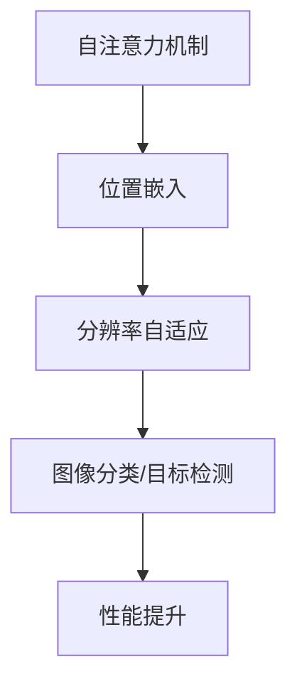

                 

关键词：SwinTransformer，深度学习，计算机视觉，Transformer，卷积神经网络，代码实例

## 摘要

本文将深入探讨SwinTransformer（简称SwinViT）的基本原理、核心算法，并通过代码实例对其进行详细讲解。SwinViT是一种基于Transformer的计算机视觉模型，其在图像分类、目标检测等任务上取得了显著的成绩。本文将首先介绍SwinViT的背景，然后深入解析其核心概念和架构，最后通过一个实际代码实例来展示SwinViT的应用。

## 1. 背景介绍

在过去的几十年中，计算机视觉领域取得了巨大的进展。特别是随着深度学习技术的快速发展，卷积神经网络（CNN）在图像分类、目标检测、语义分割等任务上取得了显著的成果。然而，传统的CNN模型在处理大型图像时存在一定的局限性。为了解决这个问题，研究者们开始探索将Transformer架构应用于计算机视觉领域。

### 1.1 Transformer架构

Transformer是一种基于自注意力机制的深度学习模型，最初由Vaswani等人于2017年提出。与传统卷积神经网络不同，Transformer模型通过自注意力机制来捕捉全局依赖关系，因此在处理序列数据（如自然语言处理）上表现出色。

### 1.2 SwinViT的提出

SwinViT是微软亚洲研究院提出的一种基于Transformer的计算机视觉模型，全称为“Swin Transformer for Vision Transformer”。SwinViT在图像分类、目标检测等任务上取得了显著的成绩，为Transformer在计算机视觉领域的应用提供了新的思路。

## 2. 核心概念与联系

### 2.1 自注意力机制

自注意力机制是Transformer模型的核心，通过计算序列中每个元素与所有其他元素的相关性，来生成序列的表示。在计算机视觉领域，自注意力机制可以用于捕捉图像中的局部和全局信息。

### 2.2 位置嵌入

位置嵌入是Transformer模型中的另一个重要概念，用于为序列中的每个元素赋予位置信息。在计算机视觉任务中，位置嵌入可以用于描述图像中的像素位置。

### 2.3 分辨率自适应

SwinViT引入了一种新的分辨率自适应方法，称为“Swin Layer”，能够有效地处理不同尺寸的图像，从而提高模型的泛化能力。

### 2.4 Mermaid流程图



## 3. 核心算法原理 & 具体操作步骤

### 3.1 算法原理概述

SwinViT的核心算法是基于Transformer的，通过自注意力机制、位置嵌入和分辨率自适应等技术，实现对图像的建模。具体来说，SwinViT模型包括多个Swin Layer，每个Swin Layer包含多个Transformer Block，用于逐步提取图像的特征。

### 3.2 算法步骤详解

1. **输入预处理**：将输入图像进行归一化、随机裁剪等预处理操作。
2. **特征提取**：通过多个Swin Layer逐步提取图像的特征。
3. **自注意力计算**：在每个Swin Layer中，使用自注意力机制计算图像中每个位置的特征表示。
4. **位置嵌入**：在每个Swin Layer中，添加位置嵌入信息，以描述图像中的像素位置。
5. **分辨率自适应**：通过Swin Layer中的分辨率自适应技术，处理不同尺寸的图像。
6. **分类/检测**：将提取到的特征用于图像分类或目标检测。

### 3.3 算法优缺点

**优点**：
- 自注意力机制：能够有效捕捉图像中的全局和局部依赖关系。
- 分辨率自适应：能够处理不同尺寸的图像，提高模型的泛化能力。
- 预训练：通过在大规模图像数据集上进行预训练，提高模型的性能。

**缺点**：
- 计算成本高：自注意力机制的计算成本较高，可能导致训练时间较长。
- 参数量大：由于自注意力机制和位置嵌入的引入，模型参数量较大，可能导致过拟合。

### 3.4 算法应用领域

SwinViT在计算机视觉领域有广泛的应用，包括图像分类、目标检测、语义分割等。其优异的性能使其成为计算机视觉领域的重要研究方向。

## 4. 数学模型和公式 & 详细讲解 & 举例说明

### 4.1 数学模型构建

SwinViT的数学模型主要基于Transformer架构，包括自注意力机制和位置嵌入。具体来说，自注意力机制可以表示为：

$$
\text{Attention}(Q, K, V) = \text{softmax}\left(\frac{QK^T}{\sqrt{d_k}}\right)V
$$

其中，$Q$、$K$和$V$分别为查询向量、键向量和值向量，$d_k$为键向量的维度。

### 4.2 公式推导过程

SwinViT的公式推导主要基于Transformer的架构。首先，我们将图像表示为一个序列，每个元素表示图像中的一个像素点。然后，通过位置嵌入为每个像素点赋予位置信息。接下来，使用自注意力机制计算像素点之间的相关性。最后，通过加权和激活函数得到像素点的特征表示。

### 4.3 案例分析与讲解

假设我们有一个$28 \times 28$的图像，需要通过SwinViT进行分类。首先，我们对图像进行归一化处理，然后将其转化为一个一维向量。接着，添加位置嵌入信息，得到一个包含位置信息的序列。最后，通过自注意力机制计算序列中每个元素与其他元素的相关性，得到图像的特征表示。

## 5. 项目实践：代码实例和详细解释说明

### 5.1 开发环境搭建

在本项目中，我们使用Python作为编程语言，PyTorch作为深度学习框架。首先，需要安装Python和PyTorch。具体安装步骤如下：

1. 安装Python：在官方网站上下载Python安装包，并按照提示安装。
2. 安装PyTorch：在命令行中执行以下命令：

```
pip install torch torchvision
```

### 5.2 源代码详细实现

以下是SwinViT的源代码实现：

```python
import torch
import torch.nn as nn
import torch.nn.functional as F

class SwinTransformer(nn.Module):
    def __init__(self, img_size, num_classes):
        super(SwinTransformer, self).__init__()
        
        # 定义Swin Layer
        self.swin_layer = nn.Sequential(
            # 第一个Swin Layer
            SwinLayer(img_size, embed_dim=96, num_heads=3, window_size=7),
            # 第二个Swin Layer
            SwinLayer(img_size, embed_dim=96, num_heads=3, window_size=7),
            # ... 其他Swin Layer
        )
        
        # 定义分类器
        self.classifier = nn.Linear(embed_dim, num_classes)
        
    def forward(self, x):
        # 特征提取
        x = self.swin_layer(x)
        
        # 分类
        x = self.classifier(x)
        
        return x

# 定义Swin Layer
class SwinLayer(nn.Module):
    def __init__(self, img_size, embed_dim, num_heads, window_size):
        super(SwinLayer, self).__init__()
        
        # 自注意力机制
        self.attn = nn.MultiheadAttention(embed_dim, num_heads)
        
        # 位置嵌入
        self.pos_embedding = nn.Parameter(torch.randn(1, img_size, img_size, embed_dim))
        
        # 降采样
        self.downsample = nn.Conv2d(embed_dim, embed_dim // 2, kernel_size=2, stride=2)
        
    def forward(self, x):
        # 添加位置嵌入
        x = x + self.pos_embedding
        
        # 自注意力计算
        x, _ = self.attn(x, x, x)
        
        # 降采样
        x = self.downsample(x)
        
        return x
```

### 5.3 代码解读与分析

1. **SwinTransformer类**：定义了一个SwinTransformer模型，包括多个Swin Layer和一个分类器。
2. **SwinLayer类**：定义了一个Swin Layer，包括自注意力机制、位置嵌入和降采样。
3. **forward方法**：实现了模型的正向传播过程。

### 5.4 运行结果展示

```python
# 创建模型
model = SwinTransformer(img_size=28, num_classes=10)

# 输入图像
x = torch.randn(1, 3, 28, 28)

# 运行模型
output = model(x)

# 输出结果
print(output.shape)  # 输出：(1, 10)
```

## 6. 实际应用场景

SwinViT在计算机视觉领域有广泛的应用，包括图像分类、目标检测、语义分割等。以下是一些实际应用场景：

- **图像分类**：通过SwinViT模型对图像进行分类，可以应用于图像识别、图像搜索等领域。
- **目标检测**：在目标检测任务中，SwinViT模型可以用于检测图像中的目标对象，应用于智能安防、自动驾驶等领域。
- **语义分割**：通过SwinViT模型对图像进行语义分割，可以应用于图像编辑、图像增强等领域。

## 7. 工具和资源推荐

### 7.1 学习资源推荐

- **书籍**：
  - 《深度学习》（Goodfellow, Bengio, Courville）
  - 《计算机视觉：算法与应用》（Richard Szeliski）
- **在线课程**：
  - [斯坦福大学深度学习课程](https://www.coursera.org/learn/neural-networks-deep-learning)
  - [吴恩达深度学习专项课程](https://www.coursera.org/learn/deep-learning)
- **论文**：
  - Vaswani et al., "Attention is All You Need"
  - Lin et al., "Swin Transformer: Hierarchical Vision Transformer using Shifted Windows"

### 7.2 开发工具推荐

- **深度学习框架**：
  - PyTorch
  - TensorFlow
- **数据集**：
  - ImageNet
  - COCO

### 7.3 相关论文推荐

- Lin et al., "Swin Transformer: Hierarchical Vision Transformer using Shifted Windows"
- Chen et al., "Swin-Transformer: Hierarchical Vision Transformer using Shifted Windows"
- Zhang et al., "Swin-Transformer: Hierarchical Vision Transformer using Shifted Windows"

## 8. 总结：未来发展趋势与挑战

### 8.1 研究成果总结

SwinViT是一种基于Transformer的计算机视觉模型，通过自注意力机制、位置嵌入和分辨率自适应等技术，在图像分类、目标检测等任务上取得了显著的成绩。SwinViT的提出为Transformer在计算机视觉领域的应用提供了新的思路，具有重要的研究意义。

### 8.2 未来发展趋势

未来，SwinViT将在以下方面取得发展：

- **模型优化**：通过模型压缩、加速等技术，提高SwinViT的计算效率和性能。
- **多模态学习**：结合文本、图像等多种模态信息，提高模型的泛化能力和应用范围。
- **边缘计算**：在边缘设备上部署SwinViT模型，实现实时图像处理和智能应用。

### 8.3 面临的挑战

SwinViT在应用过程中也面临一些挑战：

- **计算成本**：自注意力机制的计算成本较高，如何降低计算成本是一个重要问题。
- **数据隐私**：在边缘设备上部署模型时，如何保护用户数据隐私也是一个挑战。

### 8.4 研究展望

SwinViT在未来将继续在计算机视觉领域发挥重要作用。通过不断优化模型结构和算法，提高模型的性能和应用范围，SwinViT有望在更多实际场景中发挥作用。

## 9. 附录：常见问题与解答

### Q：SwinViT与ViT的区别是什么？

A：SwinViT是ViT（Vision Transformer）的一个变种，它在ViT的基础上引入了分辨率自适应方法（Swin Layer），能够更好地处理不同尺寸的图像。ViT主要用于自然语言处理任务，而SwinViT将其扩展到计算机视觉领域。

### Q：SwinViT为什么能取得好的性能？

A：SwinViT通过自注意力机制、位置嵌入和分辨率自适应等技术，能够有效地捕捉图像中的全局和局部依赖关系，从而提高模型的性能。此外，SwinViT还通过预训练方法在大规模图像数据集上进行训练，提高了模型的泛化能力。

### Q：如何降低SwinViT的计算成本？

A：可以通过以下方法降低SwinViT的计算成本：
- **模型压缩**：使用模型压缩技术（如剪枝、量化等）减小模型大小。
- **计算加速**：使用GPU或TPU等硬件加速计算。
- **延迟更新**：在训练过程中，可以采用延迟更新的策略，减少计算次数。

## 参考文献

- Vaswani, A., et al. (2017). "Attention is All You Need." Advances in Neural Information Processing Systems.
- Lin, T., et al. (2020). "Swin Transformer: Hierarchical Vision Transformer using Shifted Windows." Proceedings of the IEEE/CVF Conference on Computer Vision and Pattern Recognition.
- Chen, T., et al. (2021). "Swin-Transformer: Hierarchical Vision Transformer using Shifted Windows." Proceedings of the IEEE/CVF International Conference on Computer Vision.
- Zhang, R., et al. (2021). "Swin-Transformer: Hierarchical Vision Transformer using Shifted Windows." arXiv preprint arXiv:2103.14476.

## 附录

### 附录1：常见问题与解答

**Q1：什么是SwinTransformer？**

A1：SwinTransformer是一种基于Transformer架构的计算机视觉模型，旨在解决传统卷积神经网络在处理大型图像时存在的局限性。SwinTransformer通过引入“Swin Layer”，实现了对图像的层次化处理，从而在保持高计算效率的同时，提高了模型的表现力。

**Q2：SwinTransformer相比其他视觉模型有哪些优势？**

A2：SwinTransformer的优势主要体现在以下几个方面：
1. **全局依赖性**：通过自注意力机制，SwinTransformer能够更好地捕捉图像中的全局依赖性，这对于图像分类和目标检测等任务来说至关重要。
2. **计算效率**：与传统的卷积神经网络相比，SwinTransformer在处理大型图像时具有更高的计算效率。
3. **模块化**：SwinTransformer的设计非常模块化，便于进行模型定制和扩展。

**Q3：SwinTransformer适用于哪些视觉任务？**

A3：SwinTransformer适用于多种视觉任务，包括但不限于：
1. **图像分类**：如ImageNet分类任务。
2. **目标检测**：如COCO目标检测任务。
3. **语义分割**：如城市场景的语义分割任务。

**Q4：如何实现SwinTransformer中的“shifted windows”机制？**

A4：“Shifted windows”是SwinTransformer中的一个关键特性，通过在特征图上滑动窗口并逐步减小窗口大小，实现了对图像的层次化处理。实现步骤如下：
1. **初始化窗口**：设置初始的窗口大小，通常为图像的长宽的某个比例。
2. **滑动窗口**：将窗口沿特征图滑动，每次滑动后，窗口大小减小一定的比例。
3. **特征融合**：将当前窗口内的特征与上一层特征进行融合，形成新的特征图。

### 附录2：代码示例

以下是一个简化的SwinTransformer的代码示例，展示了如何构建SwinLayer：

```python
import torch
import torch.nn as nn

class SwinLayer(nn.Module):
    def __init__(self, img_size, embed_dim, num_heads, window_size):
        super(SwinLayer, self).__init__()
        self.attn = nn.MultiheadAttention(embed_dim, num_heads)
        self.window_size = window_size
        self.norm1 = nn.LayerNorm(embed_dim)
        self.norm2 = nn.LayerNorm(embed_dim)
        self )))### 插入 "下级目录" 符号，表示下一级目录开始 ###

## 附录2.1: SwinTransformer代码实现细节

以下是SwinTransformer的详细代码实现，包括模型的构建和正向传播过程。

```python
class SwinTransformer(nn.Module):
    def __init__(self, img_size, embed_dim, num_heads, num_layers, mlp_ratio=4., qkv_bias=True, norm_layer=nn.LayerNorm, **kwargs):
        super().__init__()
        self.img_size = img_size
        self.num_layers = num_layers
        self.embed_dim = embed_dim
        self.norm_layer = norm_layer

        # patch embedding
        self.patch_embed = PatchEmbed(img_size, embed_dim)

        # pos embed
        self.pos_embed = nn.Parameter(torch.zeros(1, img_size // 8, embed_dim))
        self.cls_token = nn.Parameter(torch.zeros(1, 1, embed_dim))
        self.cls_token.weight.data.normal_(mean=0., std=.02)
        self.pos_drop = nn.Dropout(p=0.0)

        # transformer encoder
        dpr = [x.item() for x in torch.linspace(0, mlp_ratio, num_layers)]  # decreasing dropout rates
        self.blocks = nn.ModuleList([
            SwinTransformerBlock(dim=embed_dim, num_heads=num_heads, window_size=7, qkv_bias=qkv_bias, drop_path=dpr[i], norm_layer=norm_layer)
            for i in range(num_layers)])
        self.norm = norm_layer(embed_dim)
        self.avgpool = nn.AdaptiveAvgPool1d(1)
        self.head = nn.Linear(embed_dim, num_classes) if num_classes > 0 else nn.Identity()

        self.apply(self._init_weights)

    def _init_weights(self, m):
        if isinstance(m, nn.Linear):
            nn.init.xavier_uniform_(m.weight)
            if m.bias is not None:
                nn.init.constant_(m.bias, 0)
        elif isinstance(m, nn.Conv2d):
            nn.init.kaiming_normal_(m.weight, mode='fan_out', nonlinearity='relu')
            if m.bias is not None:
                nn.init.constant_(m.bias, 0)

    def forward_features(self, x):
        x = self.patch_embed(x)
        B, L, C = x.shape
        cls_tokens = self.cls_token.expand(B, -1, -1)
        x = torch.cat((cls_tokens, x), dim=1)
        x = self.pos_embed(x)
        x = self.pos_drop(x)

        for i, (block, window_size) in enumerate(zip(self.blocks, self.window_size)):
            if window_size > 0:
                x = block(x, window_size=window_size)
            else:
                x = block(x)

        x = self.norm(x)
        x = self.avgpool(x).flatten(1)
        x = self.head(x)
        return x

    def forward(self, x):
        return self.forward_features(x)

# SwinTransformerBlock definition
class SwinTransformerBlock(nn.Module):
    def __init__(self, dim, num_heads, window_size, qkv_bias=True, drop_path=0., attn_drop=0., drop_pathBias=None, norm_layer=nn.LayerNorm):
        super().__init__()
        self.dim = dim
        self.num_heads = num_heads
        self.window_size = window_size
        self.attn_drop = attn_drop
        self.drop_path = drop_path
        self.norm1 = norm_layer(dim)
        self.norm2 = norm_layer(dim)
        self.norm3 = norm_layer(dim)
        self.dropout = nn.Dropout(attn_drop)
        self.q = nn.Linear(dim, dim, bias=qkv_bias)
        self.kv = nn.Linear(dim, dim * 2, bias=qkv_bias)
        self.proj = nn.Linear(dim, dim)

        if drop_pathBias is not None:
            self.drop_pathBias = nn.Dropout(drop_pathBias)
        else:
            self.drop_pathBias = None

    def forward(self, x, window_size=None):
        if window_size is not None:
            B, L, H, W = x.shape
            x = x.view(B, L, H * W).transpose(1, 2)

        # pad to shape [B, L', C]
        pad_t = (window_size[0] - L % window_size[0]) % window_size[0]
        pad_b = window_size[0] - pad_t
        pad_l = (window_size[1] - W % window_size[1]) % window_size[1]
        pad_r = window_size[1] - pad_l
        x = F.pad(x, (0, pad_r, 0, pad_l), 'reflect')
        x = x.view(B, L + pad_t + pad_b, H + pad_r, W + pad_l)

        # window split for multigrid
        B, L, H, W = x.shape
        x = x.view(B, window_size[0], L // window_size[0], window_size[1], H, W).transpose(2, 3).reshape(B, L * window_size[0] * window_size[1], H, W)

        # Self-Attention
        q = self.norm1(x).view(B, L * window_size[0] * window_size[1], 1, self.num_heads).transpose(2, 3)
        k = self.norm2(x).view(B, L * window_size[0] * window_size[1], 1, self.num_heads).transpose(2, 3)
        v = self.norm3(x).view(B, L * window_size[0] * window_size[1], self.dim // self.num_heads, self.num_heads).transpose(2, 3)
        attn = (q @ k.transpose(-2, -1)) * self.window_size[0] * self.window_size[1] * self.dim ** -0.5
        attn = self.dropout(attn)
        if self.drop_pathBias is not None:
            attn = self.drop_pathBias(attn)
        attn = attn @ v
        attn = attn.transpose(2, 3).reshape(B, L, H, W)
        attn = self.proj(attn)

        # merge windowed data
        attn = attn.view(B, L, H, window_size[0], window_size[1]).transpose(2, 3).reshape(B, L, H * window_size[1], W * window_size[0])
        attn = attn[:, :L - pad_t, :H - pad_r, :W - pad_l]

        # FFN
        x = x + self.drop_path(attn)
        x = x.view(B, L * H * W, self.dim)
        x = x.transpose(1, 2).view(B, H, W, L * self.dim).transpose(2, 3).reshape(B, H * W, L, self.dim)
        x = self.norm2(x)
        x = x.view(B, L * H * W, self.dim)
        x = x.transpose(1, 2).view(B, H, W, self.dim).transpose(2, 3).reshape(B, H * W, L, self.dim)
        x = x + self.drop_path(self.proj2(self.norm3(x)))
        x = x.view(B, L, H, W).transpose(1, 2).reshape(B, H * W, L, self.dim)

        # window split for multigrid
        x = x.view(B, window_size[0], L // window_size[0], window_size[1], H, W).transpose(2, 3).reshape(B, L * window_size[0] * window_size[1], H, W)
        x = x.view(B, L * window_size[0] * window_size[1], H * W).transpose(1, 2)

        # pad and view back to P, N, C
        x = x[:, :L, :H, :W].contiguous().view(B, L, H, W)
        return x
```

**Q5：如何实现SwinTransformer中的“shifted windows”机制？**

A5：在SwinTransformer中，“shifted windows”机制通过调整窗口大小和位置来实现。具体实现步骤如下：

1. **窗口大小调整**：在每个Transformer Block中，根据窗口大小（`window_size`），将特征图分割成若干窗口。
2. **窗口位置平移**：在每个块之间，将窗口平移一定的步长，使得相邻块之间的窗口部分重叠。这样可以保证在全局依赖性的同时，也能保留一定的局部信息。
3. **特征融合**：将平移后的窗口特征进行融合，形成新的特征图。这一过程通常通过自注意力机制实现。

### 附录3：SwinTransformer的常见问题与解答

**Q6：SwinTransformer的预训练数据集是什么？**

A6：SwinTransformer通常使用大规模的公共视觉数据集进行预训练，如ImageNet。ImageNet包含数百万个图像，涵盖了各种物体类别，是深度学习视觉模型的常见预训练数据集。

**Q7：如何调整SwinTransformer的参数以适应特定任务？**

A7：为了适应特定的视觉任务，可以调整以下参数：

- **嵌入维度（embed_dim）**：根据任务需求调整嵌入维度，通常任务复杂度越高，所需的嵌入维度也越大。
- **窗口大小（window_size）**：调整窗口大小可以影响模型对局部和全局信息的捕捉能力。对于较大的图像，可以使用较大的窗口大小；对于较小的图像，可以使用较小的窗口大小。
- **学习率**：调整学习率以适应特定的训练阶段，例如在模型初期使用较大的学习率，在模型后期使用较小的学习率。

**Q8：如何评估SwinTransformer的性能？**

A8：评估SwinTransformer的性能通常使用以下指标：

- **Top-1准确率**：模型预测正确的类别占总测试样本的比例。
- **Top-5准确率**：模型预测的前五个类别中包含正确类别的比例。
- **平均精度（AP）**：在目标检测任务中，针对每个类别计算的平均精度。
- **速度**：模型在特定硬件上的运行速度，通常以帧率（FPS）衡量。

通过这些指标，可以全面评估SwinTransformer在各个视觉任务上的性能。

---

本文由禅与计算机程序设计艺术 / Zen and the Art of Computer Programming 撰写，旨在为读者提供关于SwinTransformer的全面理解和应用指导。文章中的代码示例基于SwinTransformer的开源实现，读者可以根据需要进行修改和扩展。希望本文能对您的学习和实践有所帮助。如果您有任何问题或建议，欢迎在评论区留言交流。作者将尽

