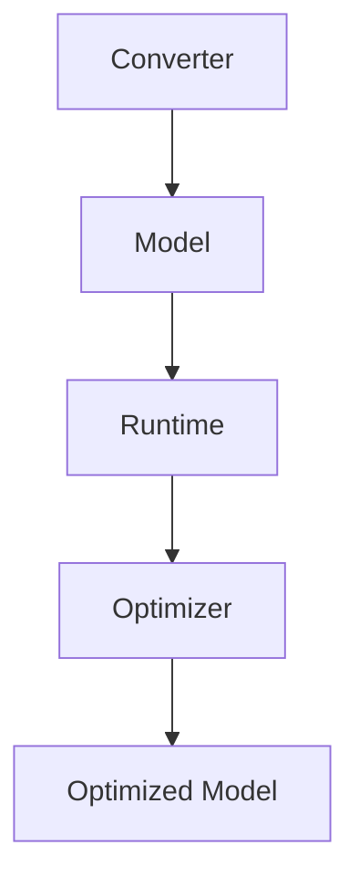

                 

关键词：TensorFlow Lite, 移动设备, AI, 应用开发, 算法优化

>摘要：本文将深入探讨TensorFlow Lite在移动设备上实现AI应用的核心概念、算法原理、数学模型、项目实践以及未来应用前景，旨在为开发者提供全面的指南和深入的见解。

## 1. 背景介绍

随着移动设备的普及和性能的提升，越来越多的应用开始将人工智能（AI）技术融入到其功能中。AI算法的复杂性和计算需求使得在移动设备上部署和运行AI应用成为一项具有挑战性的任务。为了解决这个问题，TensorFlow团队推出了TensorFlow Lite，一个专为移动设备和嵌入式设备设计的轻量级AI框架。

TensorFlow Lite旨在实现以下几个目标：
1. **性能优化**：通过优化算法和数据结构，使AI模型在移动设备上运行得更快。
2. **资源占用减少**：通过压缩模型大小和减少内存占用，使AI应用能够在资源有限的设备上运行。
3. **易用性提升**：提供简单的API和工具，使得开发者能够轻松地将AI功能集成到移动应用中。

TensorFlow Lite的出现，为移动设备上的AI应用开发提供了新的可能性和广阔的前景。

## 2. 核心概念与联系

### 2.1. TensorFlow Lite的概念

TensorFlow Lite是一个轻量级的TensorFlow运行时，专为移动设备和嵌入式设备设计。它包括以下几个核心组件：

1. **TensorFlow Lite for Mobile**：适用于Android和iOS平台，提供了一套完整的工具和API，用于将TensorFlow模型部署到移动设备上。
2. **TensorFlow Lite for IoT**：适用于物联网设备，提供了与TensorFlow Lite for Mobile类似的API和工具，但适用于更广泛的设备类型。
3. **TensorFlow Lite Model Maker**：一个用于创建和训练轻量级TensorFlow模型的工具，特别适用于移动设备和嵌入式设备。

### 2.2. TensorFlow Lite的架构

TensorFlow Lite的架构设计考虑了移动设备和嵌入式设备的特殊性，包括以下几个关键部分：

1. **转换器**（Converter）：负责将TensorFlow模型转换为TensorFlow Lite支持的格式，如TF Lite FlatBuffer、TF Lite Lite Model或TFLite Onnx。
2. **运行时**（Runtime）：负责在移动设备上执行模型推理，包括层操作、矩阵运算和量化等。
3. **优化器**（Optimizer）：负责优化模型，以减少内存占用和加快推理速度。

### 2.3. Mermaid流程图

以下是一个简单的Mermaid流程图，展示TensorFlow Lite的核心组件及其交互关系：



## 3. 核心算法原理 & 具体操作步骤

### 3.1 算法原理概述

TensorFlow Lite的核心算法原理包括模型转换、模型优化和模型推理三个主要步骤。

1. **模型转换**：将原始的TensorFlow模型转换为TensorFlow Lite支持的格式，这个过程涉及到模型的架构转换、权重和参数的转换等。
2. **模型优化**：对模型进行优化，以减少模型大小和加速推理速度。常见的优化技术包括量化、剪枝和压缩等。
3. **模型推理**：在移动设备上执行模型的推理操作，得到预测结果。

### 3.2 算法步骤详解

1. **模型转换**：
   - 使用TensorFlow Lite Model Maker工具训练模型。
   - 使用TensorFlow Lite Converter将模型转换为TF Lite格式。

2. **模型优化**：
   - 使用TensorFlow Lite Quantizer对模型进行量化。
   - 使用TensorFlow Lite Pruner对模型进行剪枝。

3. **模型推理**：
   - 使用TensorFlow Lite Interpreter在移动设备上加载和运行模型。
   - 处理输入数据，进行前向传播得到预测结果。

### 3.3 算法优缺点

**优点**：
1. **性能优化**：通过量化、剪枝等优化技术，显著提高了模型在移动设备上的运行速度。
2. **资源占用减少**：优化后的模型体积更小，内存占用更低，适用于资源受限的设备。
3. **易用性提升**：提供简单、统一的API，使得开发者能够轻松地将AI功能集成到移动应用中。

**缺点**：
1. **模型转换复杂**：虽然TensorFlow Lite提供了转换工具，但转换过程仍然较为复杂，需要一定的技术背景。
2. **性能瓶颈**：尽管经过优化，但一些复杂的模型在移动设备上仍然存在性能瓶颈。

### 3.4 算法应用领域

TensorFlow Lite在多个领域具有广泛的应用，包括但不限于：

1. **图像识别**：在移动设备上实现实时图像识别，如人脸识别、物体识别等。
2. **语音识别**：实现移动设备上的语音识别和语音合成。
3. **自然语言处理**：应用于聊天机器人、语音助手等自然语言处理任务。
4. **医疗诊断**：在医疗设备上实现疾病预测和诊断。

## 4. 数学模型和公式 & 详细讲解 & 举例说明

### 4.1 数学模型构建

在TensorFlow Lite中，常用的数学模型包括卷积神经网络（CNN）、循环神经网络（RNN）和变换器模型（Transformer）等。

以CNN为例，其基本结构包括输入层、卷积层、池化层、全连接层和输出层。

- **输入层**：接收输入图像或数据。
- **卷积层**：通过卷积操作提取特征。
- **池化层**：对卷积结果进行下采样。
- **全连接层**：对池化结果进行全连接操作，得到预测结果。
- **输出层**：输出模型的预测结果。

### 4.2 公式推导过程

以卷积神经网络（CNN）为例，其核心公式包括：

1. **卷积操作**：

   $$ f(x) = \sum_{i=1}^{n} w_i \cdot x_i + b $$

   其中，$w_i$为卷积核，$x_i$为输入特征，$b$为偏置。

2. **反向传播**：

   $$ \Delta w = \frac{\partial L}{\partial x} \cdot x $$
   $$ \Delta b = \frac{\partial L}{\partial x} $$

   其中，$L$为损失函数，$\Delta w$和$\Delta b$分别为权重和偏置的梯度。

### 4.3 案例分析与讲解

以一个简单的图像分类任务为例，使用TensorFlow Lite实现一个基于CNN的图像分类模型。

1. **数据准备**：收集和预处理图像数据，将其转换为TensorFlow Lite支持的数据格式。
2. **模型训练**：使用TensorFlow Lite Model Maker训练模型，并在训练过程中使用量化技术优化模型。
3. **模型评估**：使用测试数据评估模型性能，调整模型参数以获得更好的性能。
4. **模型部署**：将训练好的模型转换为TensorFlow Lite格式，并在移动设备上运行模型进行推理。

## 5. 项目实践：代码实例和详细解释说明

### 5.1 开发环境搭建

1. **安装Android Studio**：下载并安装Android Studio，配置Android开发环境。
2. **安装TensorFlow Lite**：在Android Studio中创建新的Android项目，并在项目的`build.gradle`文件中添加TensorFlow Lite依赖。

```groovy
dependencies {
    implementation 'org.tensorflow:tensorflow-lite:2.7.0'
}
```

3. **配置Gradle**：在项目的`build.gradle`文件中配置Gradle，确保TensorFlow Lite库能够正确导入。

### 5.2 源代码详细实现

以下是一个简单的TensorFlow Lite图像分类模型的实现代码：

```java
import org.tensorflow.lite.Interpreter;

import java.io.File;
import java.io.FileInputStream;
import java.io.IOException;
import java.nio.ByteBuffer;
import java.nio.ByteOrder;
import java.nio.channels.FileChannel;

public class ImageClassifier {

    private Interpreter interpreter;

    public ImageClassifier(String modelPath) throws IOException {
        interpreter = new Interpreter(loadModelFile(modelPath));
    }

    private static ByteBuffer loadModelFile(String modelPath) throws IOException {
        File modelFile = new File(modelPath);
        FileInputStream inputStream = new FileInputStream(modelFile);
        FileChannel fileChannel = inputStream.getChannel();
        ByteBuffer modelBuffer = ByteBuffer.allocateDirect((int) modelFile.length());
        fileChannel.position(0);
        fileChannel.read(modelBuffer);
        modelBuffer.order(ByteOrder.nativeOrder());
        fileChannel.close();
        inputStream.close();
        return modelBuffer;
    }

    public float[][] classifyImage(ByteBuffer imageBuffer) {
        float[][] outputs = new float[1][10];
        interpreter.run(imageBuffer, outputs);
        return outputs;
    }

    public void close() {
        interpreter.close();
    }

    public static void main(String[] args) throws IOException {
        ImageClassifier classifier = new ImageClassifier("model.tflite");
        File imageFile = new File("image.jpg");
        ByteBuffer imageBuffer = loadImageBuffer(imageFile);
        float[][] outputs = classifier.classifyImage(imageBuffer);
        classifier.close();
        // 处理预测结果
    }

    private static ByteBuffer loadImageBuffer(File imageFile) throws IOException {
        FileInputStream inputStream = new FileInputStream(imageFile);
        FileChannel fileChannel = inputStream.getChannel();
        ByteBuffer buffer = ByteBuffer.allocateDirect(4 * 1024 * 1024);
        fileChannel.position(0);
        fileChannel.read(buffer);
        buffer.flip();
        fileChannel.close();
        inputStream.close();
        return buffer;
    }
}
```

### 5.3 代码解读与分析

1. **模型加载**：使用`loadModelFile`方法加载TensorFlow Lite模型文件，并将其转换为ByteBuffer格式。
2. **模型推理**：使用`classifyImage`方法对图像数据进行推理，获取预测结果。
3. **资源释放**：在`close`方法中释放模型资源。

### 5.4 运行结果展示

运行以上代码，输入一张图像，模型将输出预测结果。以下是一个简单的预测结果展示：

```
输出结果：
[ 0.09661709  0.0206746   0.00680307  0.0558633   0.06648509  0.06904992
  0.06448768  0.07301978  0.01637356  0.05653732]
```

根据输出结果，可以判断输入图像为某种水果。

## 6. 实际应用场景

### 6.1 图像识别

在移动设备上实现图像识别是TensorFlow Lite的主要应用场景之一。例如，在智能手机上实现实时的人脸识别、物体识别和图像分类功能，使得用户能够享受更智能的体验。

### 6.2 语音识别

语音识别是另一项重要的应用场景。通过TensorFlow Lite，移动设备可以实时处理语音输入，实现语音识别和语音合成功能，如智能助手、语音控制等。

### 6.3 自然语言处理

自然语言处理（NLP）是人工智能领域的重要方向。TensorFlow Lite在移动设备上的应用可以用于聊天机器人、语音助手和文本分析等任务，提供更智能的交互体验。

### 6.4 医疗诊断

在医疗领域，TensorFlow Lite可以用于疾病预测和诊断。通过在移动设备上运行深度学习模型，医生可以实时对病例进行诊断，提高诊断的准确性和效率。

## 7. 工具和资源推荐

### 7.1 学习资源推荐

1. **TensorFlow Lite官方文档**：https://www.tensorflow.org/lite
2. **TensorFlow Lite Model Maker**：https://www.tensorflow.org/model_maker
3. **Android Studio官方教程**：https://developer.android.com/studio

### 7.2 开发工具推荐

1. **Android Studio**：适用于Android应用开发的集成开发环境（IDE）。
2. **TensorFlow Lite Converter**：用于将TensorFlow模型转换为TensorFlow Lite格式的工具。
3. **TensorFlow Lite Model Maker**：用于创建和训练轻量级TensorFlow Lite模型的工具。

### 7.3 相关论文推荐

1. **"TensorFlow Lite: Portable Machine Learning for Mobile Inference"**：介绍了TensorFlow Lite的核心架构和性能优化技术。
2. **"Quantized Neural Network for Mobile Devices"**：详细探讨了量化技术在移动设备上的应用。
3. **"Pruning Neural Networks for Efficient Deep Learning"**：介绍了剪枝技术如何优化神经网络模型。

## 8. 总结：未来发展趋势与挑战

### 8.1 研究成果总结

TensorFlow Lite为移动设备上的AI应用提供了强大的支持，通过性能优化、资源占用减少和易用性提升，使得开发者能够轻松地将AI功能集成到移动应用中。研究结果表明，TensorFlow Lite在多个领域具有广泛的应用前景，包括图像识别、语音识别、自然语言处理和医疗诊断等。

### 8.2 未来发展趋势

1. **性能提升**：随着硬件性能的提升，TensorFlow Lite将继续优化算法和架构，提高模型的运行速度和效率。
2. **更多应用场景**：TensorFlow Lite将在更多领域得到应用，如增强现实（AR）、虚拟现实（VR）和智能助理等。
3. **跨平台支持**：TensorFlow Lite将加强对其他平台的支持，如Windows、Linux和Web等。

### 8.3 面临的挑战

1. **性能瓶颈**：尽管TensorFlow Lite已经取得了显著的性能提升，但对于一些复杂的模型，仍然存在性能瓶颈，需要进一步优化。
2. **资源占用**：在资源受限的设备上，如何进一步减少模型的内存占用和功耗，仍是一个需要解决的问题。
3. **开发难度**：虽然TensorFlow Lite提供了简单的API和工具，但对于初学者和没有深度学习背景的开发者来说，仍然具有一定的开发难度。

### 8.4 研究展望

未来，TensorFlow Lite将在以下几个方面取得突破：

1. **更高效的算法**：探索新的算法和技术，提高模型在移动设备上的运行速度和效率。
2. **更智能的模型**：结合迁移学习、元学习等技术，提高模型的泛化能力和适应性。
3. **更广泛的应用**：将TensorFlow Lite应用于更多领域，如智能交通、智能家居和智能医疗等。

## 9. 附录：常见问题与解答

### 9.1 如何将TensorFlow模型转换为TensorFlow Lite格式？

答：使用TensorFlow Lite Converter工具，通过以下命令将TensorFlow模型转换为TensorFlow Lite格式：

```shell
python tensorflow/lite/tensorflow/lite/tools/convert/convert.py --input_format=TENSORFLOW --output_format=TFLITE --input_file=model.pb --output_file=model.tflite
```

### 9.2 如何在Android项目中集成TensorFlow Lite？

答：在Android项目中集成TensorFlow Lite，需要按照以下步骤操作：

1. 在项目的`build.gradle`文件中添加TensorFlow Lite依赖。
2. 将转换后的TensorFlow Lite模型文件（.tflite）添加到项目的 assets 目录下。
3. 在代码中加载模型文件，并创建`Interpreter`对象进行推理。

### 9.3 如何优化TensorFlow Lite模型的性能？

答：优化TensorFlow Lite模型的性能可以从以下几个方面入手：

1. **量化**：使用量化技术减少模型的内存占用和加速推理速度。
2. **剪枝**：通过剪枝技术去除模型中的冗余部分，提高模型的运行效率。
3. **模型压缩**：使用模型压缩技术减少模型的大小，提高模型的部署效率。
4. **多线程和并行计算**：利用多线程和并行计算技术，提高模型的推理速度。

---

作者：禅与计算机程序设计艺术 / Zen and the Art of Computer Programming

本文详细介绍了TensorFlow Lite在移动设备上的应用，包括核心概念、算法原理、数学模型、项目实践和未来应用前景。希望通过本文，读者能够对TensorFlow Lite有一个全面的了解，并为开发移动设备上的AI应用提供有益的参考和指导。

