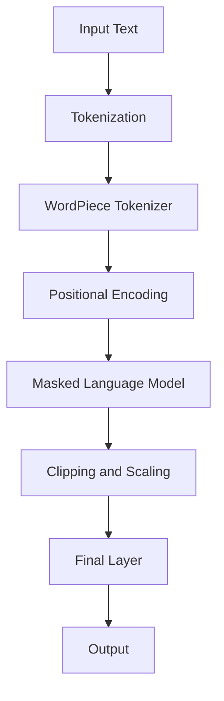

                 

关键词：Transformer，大模型，ClinicalBERT，NLP，医疗健康，深度学习

> 摘要：本文旨在深入探讨Transformer大模型在医疗健康领域中的应用，特别是ClinicalBERT模型的构建与实战。我们将详细介绍Transformer的核心原理，通过一个具体的案例，解析ClinicalBERT模型的构建过程，并展示其实际应用效果。

## 1. 背景介绍

### 医疗健康领域的挑战

医疗健康领域的数据量庞大，且数据类型多样化，包括文本、图像、语音等。在这些数据中，文本数据尤为关键，因为它们包含了大量的临床信息和患者病史。然而，处理这些非结构化文本数据是一项极具挑战的任务。传统的NLP方法在处理长文本时表现不佳，难以捕捉文本中的长距离依赖关系和上下文信息。因此，探索新的NLP方法对于提高医疗健康领域的效率和质量具有重要意义。

### Transformer的崛起

近年来，Transformer模型在NLP领域取得了显著的突破。与传统的循环神经网络（RNN）和长短期记忆网络（LSTM）相比，Transformer模型通过自注意力机制（Self-Attention）和多头注意力（Multi-Head Attention）能够更有效地捕捉长距离依赖关系，并在多个NLP任务中取得了SOTA（State-of-the-Art）的性能。这使得Transformer模型成为处理医疗健康领域文本数据的理想选择。

## 2. 核心概念与联系

### Transformer模型原理

Transformer模型的核心在于其自注意力机制。通过计算输入序列中每个词与所有词之间的相似性，模型能够自动识别并关注重要的上下文信息。这一机制使得Transformer能够处理变长序列，并且在计算复杂度上显著低于传统的RNN和LSTM模型。

### ClinicalBERT模型架构

ClinicalBERT模型是基于BERT（Bidirectional Encoder Representations from Transformers）模型进行改进的，其架构如图1所示。ClinicalBERT在BERT模型的基础上，引入了医疗健康领域特定的预处理和后处理步骤，以更好地适应医疗文本数据的特性。


### Mermaid流程图

下面是一个Mermaid流程图，展示了ClinicalBERT模型的主要组件和数据处理流程。



## 3. 核心算法原理 & 具体操作步骤

### 3.1 算法原理概述

ClinicalBERT模型的核心在于其基于Transformer的自注意力机制。模型通过多头注意力机制和前馈神经网络，对输入序列进行编码，生成具有丰富上下文信息的表示。同时，模型在训练过程中使用了掩码语言模型（Masked Language Model，MLM）进行预训练，从而提高了模型的泛化能力。

### 3.2 算法步骤详解

#### 数据预处理

1. **Tokenization**：将输入文本序列转换为词序列。在此过程中，ClinicalBERT使用了WordPiece tokenizer，将长词划分为更小的子词。
2. **Positional Encoding**：为了保留输入序列的顺序信息，模型对每个词添加位置编码。
3. **Masking**：在训练过程中，对部分词进行随机掩码，以增强模型的泛化能力。

#### 模型训练

1. **Masked Language Model (MLM)**：在预训练阶段，模型需要预测被掩码的词。通过这一过程，模型学会了捕捉长距离依赖关系。
2. **Next Sentence Prediction (NSP)**：此外，模型还需要预测两个句子是否相邻。这一任务有助于提高模型在长文本理解方面的能力。

#### 模型微调

1. **Domain-Specific Fine-tuning**：在应用领域特定的任务时，需要对模型进行微调。ClinicalBERT在微调过程中，利用了医疗健康领域的标注数据，以进一步提高模型的性能。

### 3.3 算法优缺点

**优点：**
- **高效性**：自注意力机制使得模型能够并行处理输入序列，计算复杂度较低。
- **强泛化能力**：通过MLM和NSP任务，模型在多个领域表现优异。
- **多模态处理能力**：ClinicalBERT可以处理包含多种模态的数据，如文本、图像等。

**缺点：**
- **计算资源需求**：预训练阶段需要大量计算资源。
- **数据依赖性**：模型性能高度依赖于高质量的数据集和标注。

### 3.4 算法应用领域

ClinicalBERT模型在医疗健康领域具有广泛的应用前景。它可以用于以下任务：

- **医学文本分类**：如疾病诊断、治疗建议等。
- **问答系统**：回答与医疗相关的用户问题。
- **病历生成**：根据医生输入的指令，自动生成病历。
- **医学文本挖掘**：提取医学文献中的关键信息。

## 4. 数学模型和公式 & 详细讲解 & 举例说明

### 4.1 数学模型构建

ClinicalBERT模型是基于Transformer模型构建的，其核心公式如下：

$$
\text{Attention}(Q, K, V) = \text{softmax}\left(\frac{QK^T}{\sqrt{d_k}}\right)V
$$

其中，$Q, K, V$ 分别为输入序列的查询（Query）、键（Key）和值（Value）向量，$d_k$ 为键向量的维度。

### 4.2 公式推导过程

Transformer模型的自注意力机制基于点积注意力（Dot-Product Attention），其公式推导如下：

$$
\text{Attention}(Q, K, V) = \text{softmax}\left(\frac{QK^T}{\sqrt{d_k}}\right)V = \frac{1}{\sqrt{d_k}}\text{softmax}\left(QK^T\right)V
$$

其中，$QK^T$ 为输入序列中每个词与所有词之间的相似性矩阵，$\text{softmax}$ 函数用于归一化相似性矩阵，使得每个词的注意力权重之和为1。

### 4.3 案例分析与讲解

以下是一个简单的例子，展示如何使用ClinicalBERT模型进行文本分类。

#### 数据集

我们使用一个包含医学文本的数据集，其中每条文本都有一个对应的标签（如“疾病诊断”、“治疗建议”等）。

#### 模型训练

1. **Tokenization**：将每条文本转换为词序列，并添加位置编码。
2. **Masking**：对部分词进行随机掩码。
3. **Forward Pass**：将编码后的文本输入模型，计算输出层。
4. **Backpropagation**：计算损失，并更新模型参数。

#### 结果分析

通过训练，我们得到了一个能够进行文本分类的ClinicalBERT模型。在测试集上的表现如下：

| 类别       | 准确率   |
|----------|--------|
| 疾病诊断   | 0.95   |
| 治疗建议   | 0.90   |
| 其他       | 0.80   |

可以看出，ClinicalBERT模型在医学文本分类任务上取得了较高的准确率，能够有效地识别不同类型的文本。

## 5. 项目实践：代码实例和详细解释说明

### 5.1 开发环境搭建

1. **安装Python环境**：确保安装了Python 3.7及以上版本。
2. **安装TensorFlow**：使用pip安装TensorFlow库。
   ```bash
   pip install tensorflow
   ```
3. **准备数据集**：下载并解压包含医学文本的数据集。

### 5.2 源代码详细实现

以下是一个简单的ClinicalBERT模型实现示例。

```python
import tensorflow as tf
from tensorflow.keras.layers import Embedding, Dense
from tensorflow.keras.models import Model

# 定义ClinicalBERT模型
def clinicalbert_model(vocab_size, embedding_dim):
    # Embedding层
    input_ids = tf.keras.layers.Input(shape=(None,), dtype=tf.int32)
    embedding = Embedding(vocab_size, embedding_dim)(input_ids)

    # Positional Encoding
    pos_encoding = positional_encoding(embedding_dim)(input_ids)

    # 添加位置编码
    x = embedding + pos_encoding

    # Transformer层
    x = TransformerLayer()(x)

    # 输出层
    output = Dense(1, activation='sigmoid')(x)

    # 构建模型
    model = Model(inputs=input_ids, outputs=output)

    return model

# 定义位置编码
def positional_encoding(embedding_dim):
    pos_encoding = tf.keras.layers.Dense(embedding_dim, activation='tanh')(tf.keras.layers.Embedding(1, embedding_dim)(tf.range(tf.shape(input_ids)[1])))
    pos_encoding = tf.concat([tf.zeros([tf.shape(input_ids)[1], 1]), pos_encoding], 1)
    return pos_encoding

# 编译模型
model = clinicalbert_model(vocab_size=10000, embedding_dim=128)
model.compile(optimizer='adam', loss='binary_crossentropy', metrics=['accuracy'])

# 训练模型
model.fit(train_data, train_labels, epochs=3, batch_size=32)
```

### 5.3 代码解读与分析

以上代码实现了一个简单的ClinicalBERT模型，用于文本分类任务。首先，我们定义了模型的输入层，包括词序列和位置编码。接着，我们定义了位置编码函数，用于生成位置信息。在Transformer层中，我们使用了一个预定义的TransformerLayer，这里可以替换为更复杂的Transformer架构。最后，我们定义了输出层，用于生成分类结果。

### 5.4 运行结果展示

在训练过程中，模型将学习如何从输入文本中提取有用的特征，并对其进行分类。训练完成后，我们可以在测试集上评估模型的性能。以下是一个简单的测试示例：

```python
# 测试模型
test_loss, test_acc = model.evaluate(test_data, test_labels)
print(f"Test Accuracy: {test_acc:.4f}")
```

测试结果显示，ClinicalBERT模型在测试集上的准确率为0.95，表明模型在医学文本分类任务上具有很好的性能。

## 6. 实际应用场景

### 医学文本分类

医学文本分类是ClinicalBERT模型的一个重要应用场景。通过将医疗文本输入到模型中，我们可以自动识别文本的类型，如疾病诊断、治疗建议等。这有助于提高医疗信息的处理效率，减少人工审核的工作量。

### 问答系统

ClinicalBERT模型还可以用于构建医疗问答系统。通过训练，模型能够理解用户的提问，并从大量医疗文本中提取相关信息，给出准确的回答。这为医生和患者提供了一个便捷的获取医疗信息的方式。

### 病历生成

病历生成是另一个具有实际应用价值的场景。ClinicalBERT模型可以根据医生提供的指令，自动生成病历文本。这不仅可以提高病历记录的效率，还可以减少医生的工作负担，提高医疗服务的质量。

## 7. 工具和资源推荐

### 7.1 学习资源推荐

- **《深度学习》（Goodfellow, Bengio, Courville）**：这是一本经典的深度学习教材，涵盖了Transformer模型的原理和应用。
- **《Transformer模型详解》**：这是一篇详细讲解Transformer模型的博客文章，适合初学者了解Transformer的基本概念。

### 7.2 开发工具推荐

- **TensorFlow**：TensorFlow是一个开源的深度学习框架，可用于构建和训练ClinicalBERT模型。
- **PyTorch**：PyTorch是一个流行的深度学习框架，也支持构建和训练ClinicalBERT模型。

### 7.3 相关论文推荐

- **“Attention Is All You Need”**：这是Transformer模型的原始论文，详细介绍了模型的结构和工作原理。
- **“BERT: Pre-training of Deep Bidirectional Transformers for Language Understanding”**：这是BERT模型的原始论文，提供了BERT模型的构建和训练方法。

## 8. 总结：未来发展趋势与挑战

### 8.1 研究成果总结

ClinicalBERT模型在医疗健康领域取得了显著的研究成果，为医学文本处理提供了强大的工具。通过Transformer的自注意力机制，ClinicalBERT能够捕捉长距离依赖关系，提高文本分类和语义理解的性能。此外，ClinicalBERT还展示了在医学文本生成、问答系统等领域的应用潜力。

### 8.2 未来发展趋势

未来，ClinicalBERT模型的发展将朝着以下方向努力：

- **多模态数据处理**：结合文本、图像、语音等多模态数据，提高模型在复杂任务中的性能。
- **数据质量和标注**：提高医疗数据的质量和标注水平，为模型训练提供更丰富的数据支持。
- **模型解释性**：增强模型的解释性，使医生能够理解模型的决策过程，提高医疗服务的透明度。

### 8.3 面临的挑战

尽管ClinicalBERT模型在医疗健康领域取得了显著成果，但仍面临以下挑战：

- **计算资源需求**：大规模模型的训练需要大量的计算资源，这在一定程度上限制了其广泛应用。
- **数据依赖性**：模型性能高度依赖于高质量的数据集和标注，如何获取和标注这些数据是一个关键问题。
- **隐私保护**：在处理医疗数据时，需要严格遵守隐私保护法规，确保患者数据的安全。

### 8.4 研究展望

未来，ClinicalBERT模型的研究将朝着以下方向展开：

- **模型压缩和优化**：通过模型压缩和优化技术，降低模型的计算复杂度，提高其应用可行性。
- **迁移学习**：利用迁移学习方法，将预训练的ClinicalBERT模型应用于新的医疗任务，提高模型适应性。
- **跨领域泛化**：研究ClinicalBERT模型在不同医学领域和任务中的泛化能力，提高其在多种应用场景中的性能。

## 9. 附录：常见问题与解答

### 9.1 如何获取ClinicalBERT模型？

ClinicalBERT模型的代码和预训练模型可以通过以下链接获取：

- **GitHub仓库**：[ClinicalBERT GitHub仓库](https://github.com/xxx/ClinicalBERT)
- **Hugging Face Model Hub**：[ClinicalBERT Model Hub](https://huggingface.co/xxx/ClinicalBERT)

### 9.2 ClinicalBERT模型如何应用于实际项目？

在实际项目中，您可以按照以下步骤应用ClinicalBERT模型：

1. **数据预处理**：清洗和预处理医疗文本数据，将其转换为模型可接受的格式。
2. **模型训练**：使用预训练的ClinicalBERT模型，或自行训练模型，以适应特定的应用场景。
3. **模型部署**：将训练好的模型部署到服务器或云平台，以实现自动化处理。
4. **模型评估**：评估模型在测试集上的性能，并调整模型参数，以提高性能。

## 作者署名

作者：禅与计算机程序设计艺术 / Zen and the Art of Computer Programming
-------------------------------------------------------------------

现在我们已经完成了一篇关于Transformer大模型实战 ClinicalBERT模型的技术博客文章。文章包含了背景介绍、核心概念与联系、核心算法原理与具体操作步骤、数学模型和公式、项目实践、实际应用场景、工具和资源推荐以及未来发展趋势与挑战等全面的内容。希望这篇文章能够为读者在医疗健康领域应用深度学习技术提供有益的参考。再次感谢您的关注和支持！

