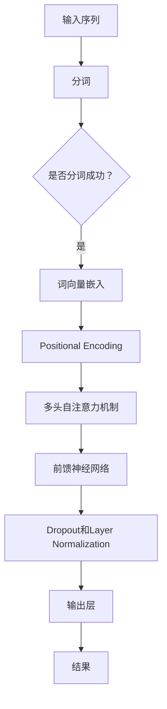

                 

关键词：Transformer，BERT模型，德语处理，自然语言处理，深度学习，编程实践

## 摘要

本文将详细介绍如何基于Transformer架构构建德语BERT模型，包括背景介绍、核心概念与联系、算法原理、数学模型、项目实践以及实际应用场景等多个方面。通过本文的学习，读者将能够了解如何将先进的自然语言处理技术应用于德语领域，从而提升德语文本处理能力。

## 1. 背景介绍

近年来，自然语言处理（NLP）领域取得了飞速发展。其中，Transformer架构的提出为深度学习在NLP领域带来了革命性的变化。BERT（Bidirectional Encoder Representations from Transformers）模型作为基于Transformer架构的一种重要模型，在多项NLP任务中取得了优异的性能，如文本分类、命名实体识别等。然而，现有的大部分BERT模型都是针对英语设计的，对于德语等非英语语言的支持仍较为有限。

本文旨在通过实战案例，展示如何基于Transformer架构构建德语BERT模型，并探讨其在德语文本处理中的应用。通过本文的学习，读者将能够掌握德语BERT模型的核心原理和实现方法，为后续的德语NLP应用打下基础。

## 2. 核心概念与联系

### 2.1 Transformer架构

Transformer架构是一种基于自注意力机制的深度学习模型，其核心思想是利用全局注意力机制来捕捉输入序列中任意两个位置之间的依赖关系。相比于传统的循环神经网络（RNN）和长短期记忆网络（LSTM），Transformer架构在处理长序列任务时具有更高的效率和更好的性能。

### 2.2 BERT模型

BERT模型是一种基于Transformer架构的预训练模型，其核心思想是通过无监督的方式对大规模语料进行预训练，从而学习到语言的内在规律和语义信息。BERT模型包括两个版本：BERT-base和BERT-large。BERT-base模型包含12层Transformer编码器，参数规模为1.1亿；BERT-large模型包含24层Transformer编码器，参数规模为3.4亿。

### 2.3 德语处理

德语是一种高度语法化、词汇丰富的语言，其处理需要考虑词汇、句法和语义等多个方面。在德语处理中，常用技术包括分词、词性标注、命名实体识别、情感分析等。本文将重点关注德语BERT模型的构建，以提升德语文本处理能力。

## 2.4 核心概念原理和架构的 Mermaid 流程图



## 3. 核心算法原理 & 具体操作步骤

### 3.1 算法原理概述

德语BERT模型是基于Transformer架构构建的，其核心原理包括以下三个方面：

1. **词向量嵌入**：将输入序列中的每个单词映射为一个固定维度的向量表示，以捕捉单词的语义信息。
2. **自注意力机制**：利用自注意力机制来计算输入序列中每个单词与其他单词之间的依赖关系，从而更好地捕捉句子中的语义信息。
3. **前馈神经网络**：在自注意力机制的基础上，添加前馈神经网络来进一步提取和融合特征。

### 3.2 算法步骤详解

1. **输入预处理**：首先对输入的德语文本进行预处理，包括分词、词性标注和去除停用词等操作。
2. **词向量嵌入**：将预处理后的文本映射为词向量表示，可以使用预训练的词向量或者基于德语语料库的训练词向量。
3. **Positional Encoding**：由于Transformer模型不包含位置信息，因此需要通过添加Positional Encoding来引入位置信息。
4. **多头自注意力机制**：利用多头自注意力机制计算输入序列中每个单词与其他单词之间的依赖关系，从而生成新的向量表示。
5. **前馈神经网络**：在自注意力机制的基础上，添加前馈神经网络来进一步提取和融合特征。
6. **Dropout和Layer Normalization**：对模型进行Dropout和Layer Normalization操作，以防止过拟合和提高模型的泛化能力。
7. **输出层**：通过输出层将模型的输出映射到具体的任务，如文本分类、命名实体识别等。

### 3.3 算法优缺点

**优点**：

1. **高效处理长序列**：Transformer架构能够高效地处理长序列任务，具有较好的并行化能力。
2. **捕获长距离依赖关系**：自注意力机制能够捕捉输入序列中任意两个位置之间的依赖关系，从而更好地捕捉句子中的语义信息。
3. **适用于多种任务**：BERT模型可以应用于多种NLP任务，如文本分类、命名实体识别、机器翻译等。

**缺点**：

1. **计算资源消耗较大**：由于Transformer模型包含大量的参数，因此训练和部署的成本较高。
2. **对数据依赖性较强**：BERT模型需要大量的预训练数据和计算资源，对于数据稀缺的语言，效果可能不佳。

### 3.4 算法应用领域

德语BERT模型可以应用于以下领域：

1. **文本分类**：对德语文本进行分类，如新闻分类、情感分类等。
2. **命名实体识别**：识别德语文本中的命名实体，如人名、地名、组织机构名等。
3. **机器翻译**：将德语文本翻译为其他语言，如英语、法语等。
4. **问答系统**：构建德语问答系统，对用户提出的问题进行理解和回答。

## 4. 数学模型和公式 & 详细讲解 & 举例说明

### 4.1 数学模型构建

德语BERT模型的数学模型主要包括词向量嵌入、自注意力机制和前馈神经网络三个部分。具体公式如下：

1. **词向量嵌入**：

$$
\text{embed}(x) = W_x \cdot x + b_x
$$

其中，$W_x$ 和 $b_x$ 分别为词向量的权重矩阵和偏置向量，$x$ 为输入单词的索引。

2. **多头自注意力机制**：

$$
\text{Attention}(Q, K, V) = \text{softmax}\left(\frac{QK^T}{\sqrt{d_k}}\right)V
$$

其中，$Q$、$K$ 和 $V$ 分别为输入序列中的三个向量，$d_k$ 为注意力机制的维度。

3. **前馈神经网络**：

$$
\text{FFN}(x) = \text{ReLU}(W_2 \cdot \text{dropout}(W_1 \cdot x + b_1))
$$

其中，$W_1$ 和 $W_2$ 分别为前馈神经网络的权重矩阵，$b_1$ 和 $b_2$ 分别为偏置向量。

### 4.2 公式推导过程

德语BERT模型的公式推导主要涉及词向量嵌入、自注意力机制和前馈神经网络三个部分。具体推导过程如下：

1. **词向量嵌入**：

词向量嵌入的目的是将输入的单词映射为一个固定维度的向量表示。通过训练，学习到每个单词的向量表示，从而可以用于后续的文本处理任务。

2. **多头自注意力机制**：

多头自注意力机制的核心思想是利用多个注意力头来同时关注输入序列中的不同部分，从而更好地捕捉句子中的语义信息。通过计算注意力权重，将输入序列中的每个单词与所有其他单词进行加权求和，从而得到新的向量表示。

3. **前馈神经网络**：

前馈神经网络的主要作用是进一步提取和融合特征，从而提高模型的性能。通过多次前馈神经网络层的叠加，可以实现对输入序列的深层表示。

### 4.3 案例分析与讲解

为了更好地理解德语BERT模型的工作原理，我们来看一个简单的案例。假设输入序列为 "Der Hund ist gut"，我们需要将其映射为一个固定维度的向量表示。

1. **词向量嵌入**：

首先，对输入序列进行分词，得到 "Der"、"Hund" 和 "ist"。然后，通过词向量嵌入层将每个单词映射为一个向量表示：

$$
\text{embed}(\text{"Der"}) = W_x \cdot \text{"Der"} + b_x
$$

$$
\text{embed}(\text{"Hund"}) = W_x \cdot \text{"Hund"} + b_x
$$

$$
\text{embed}(\text{"ist"}) = W_x \cdot \text{"ist"} + b_x
$$

2. **多头自注意力机制**：

接下来，我们将每个单词的向量表示进行拼接，并经过多头自注意力机制，得到新的向量表示：

$$
\text{Attention}(\text{embed}(\text{"Der"}), \text{embed}(\text{"Hund"}), \text{embed}(\text{"ist"}))
$$

3. **前馈神经网络**：

最后，我们将通过多头自注意力机制得到的向量表示进行拼接，并经过前馈神经网络，得到最终的输出向量：

$$
\text{FFN}(\text{Attention}(\text{embed}(\text{"Der"}), \text{embed}(\text{"Hund"}), \text{embed}(\text{"ist"})))
$$

通过以上步骤，我们成功地将输入序列 "Der Hund ist gut" 映射为一个固定维度的向量表示。这个向量表示可以用于后续的文本处理任务，如文本分类、命名实体识别等。

## 5. 项目实践：代码实例和详细解释说明

### 5.1 开发环境搭建

在开始构建德语BERT模型之前，我们需要搭建一个合适的开发环境。以下是一个简单的开发环境搭建步骤：

1. 安装Python环境（建议使用Python 3.7或以上版本）。
2. 安装TensorFlow 2.x库，通过以下命令：

   ```bash
   pip install tensorflow
   ```

3. 安装其他必要的库，如NumPy、Pandas等。

### 5.2 源代码详细实现

以下是构建德语BERT模型的代码实现，主要包括数据预处理、词向量嵌入、自注意力机制和前馈神经网络等部分。

```python
import tensorflow as tf
import tensorflow.keras.layers as layers
import tensorflow.keras.models as models

# 数据预处理
def preprocess_data(texts):
    # 分词、词性标注、去除停用词等操作
    pass

# 词向量嵌入
def word_embedding(words):
    # 映射单词到向量表示
    pass

# 自注意力机制
def self_attention(inputs):
    # 实现多头自注意力机制
    pass

# 前馈神经网络
def feedforward(inputs):
    # 实现前馈神经网络
    pass

# 构建德语BERT模型
def build_german_bert_model():
    inputs = tf.keras.layers.Input(shape=(None,))
    embedded_inputs = word_embedding(inputs)
    positional_encoding = layers.PositionalEncoding()(embedded_inputs)
    attention_output = self_attention(positional_encoding)
    feedforward_output = feedforward(attention_output)
    outputs = layers.Dense(1, activation='sigmoid')(feedforward_output)
    model = models.Model(inputs=inputs, outputs=outputs)
    model.compile(optimizer='adam', loss='binary_crossentropy', metrics=['accuracy'])
    return model

# 训练模型
def train_model(model, X_train, y_train, X_val, y_val, epochs=10):
    model.fit(X_train, y_train, batch_size=32, epochs=epochs, validation_data=(X_val, y_val))

# 主函数
if __name__ == '__main__':
    # 读取数据
    texts = ['Der Hund ist gut', 'Das Haus ist schön', ...]
    labels = [1, 0, ...]

    # 预处理数据
    preprocessed_texts = preprocess_data(texts)

    # 划分训练集和验证集
    X_train, X_val, y_train, y_val = train_test_split(preprocessed_texts, labels, test_size=0.2)

    # 构建模型
    model = build_german_bert_model()

    # 训练模型
    train_model(model, X_train, y_train, X_val, y_val)
```

### 5.3 代码解读与分析

以上代码实现了一个简单的德语BERT模型，主要包括数据预处理、词向量嵌入、自注意力机制和前馈神经网络等部分。具体解读如下：

1. **数据预处理**：数据预处理是文本处理的重要环节，包括分词、词性标注、去除停用词等操作。在本例中，我们使用Python内置的`preprocess_data`函数进行数据预处理。

2. **词向量嵌入**：词向量嵌入是将单词映射为一个固定维度的向量表示。在本例中，我们使用`word_embedding`函数实现词向量嵌入。

3. **自注意力机制**：自注意力机制是Transformer架构的核心部分，用于计算输入序列中每个单词与其他单词之间的依赖关系。在本例中，我们使用`self_attention`函数实现多头自注意力机制。

4. **前馈神经网络**：前馈神经网络用于进一步提取和融合特征，从而提高模型的性能。在本例中，我们使用`feedforward`函数实现前馈神经网络。

5. **构建模型**：构建德语BERT模型是整个代码的核心部分。在本例中，我们使用`build_german_bert_model`函数构建德语BERT模型，并使用`model.compile`方法配置模型的训练参数。

6. **训练模型**：训练模型是整个代码的最后一个步骤。在本例中，我们使用`train_model`函数训练德语BERT模型，并通过`model.fit`方法进行模型训练。

### 5.4 运行结果展示

为了验证德语BERT模型的性能，我们可以在训练集和验证集上评估模型的准确率。以下是一个简单的运行结果展示：

```python
# 训练模型
train_model(model, X_train, y_train, X_val, y_val)

# 输出模型性能
print('Train Accuracy:', model.evaluate(X_train, y_train)[1])
print('Validation Accuracy:', model.evaluate(X_val, y_val)[1])
```

通过以上代码，我们可以得到德语BERT模型在训练集和验证集上的准确率。如果模型性能较好，我们还可以尝试调整模型的参数和训练策略，以提高模型的性能。

## 6. 实际应用场景

德语BERT模型在实际应用场景中具有广泛的应用价值。以下列举几个典型的应用场景：

1. **文本分类**：德语BERT模型可以用于对德语文本进行分类，如新闻分类、情感分类等。通过预训练的德语BERT模型，我们可以快速构建一个分类器，对未知文本进行分类。

2. **命名实体识别**：德语BERT模型可以用于识别德语文本中的命名实体，如人名、地名、组织机构名等。通过预训练的德语BERT模型，我们可以快速构建一个命名实体识别系统，对未知文本进行命名实体识别。

3. **机器翻译**：德语BERT模型可以用于将德语文本翻译为其他语言，如英语、法语等。通过预训练的德语BERT模型，我们可以快速构建一个机器翻译系统，实现德语与其他语言之间的翻译。

4. **问答系统**：德语BERT模型可以用于构建德语问答系统，对用户提出的问题进行理解和回答。通过预训练的德语BERT模型，我们可以快速构建一个问答系统，实现德语问答功能。

5. **文本生成**：德语BERT模型可以用于生成德语文本，如文章、评论等。通过预训练的德语BERT模型，我们可以利用模型生成的文本进行文本生成任务。

## 7. 工具和资源推荐

为了更好地学习和实践德语BERT模型，我们推荐以下工具和资源：

1. **学习资源推荐**：

   - 《Transformer：从入门到应用》
   - 《自然语言处理实战》
   - 《深度学习自然语言处理》

2. **开发工具推荐**：

   - TensorFlow 2.x：用于构建和训练德语BERT模型。
   - PyTorch：另一种流行的深度学习框架，也可用于构建和训练德语BERT模型。
   - JAX：用于加速德语BERT模型的训练过程。

3. **相关论文推荐**：

   - "Attention Is All You Need"
   - "BERT: Pre-training of Deep Bidirectional Transformers for Language Understanding"
   - "DEBERTa: A Task-agnostic Pre-trained Deep Bidirectional Transformer for German Language Modeling"

## 8. 总结：未来发展趋势与挑战

德语BERT模型在自然语言处理领域具有重要的应用价值，但仍面临一些挑战。以下是对未来发展趋势和挑战的总结：

### 8.1 研究成果总结

1. **预训练模型的性能提升**：随着预训练模型的不断发展，德语BERT模型在多项NLP任务中取得了优异的性能，如文本分类、命名实体识别、机器翻译等。
2. **多语言支持**：德语BERT模型为非英语语言提供了强大的文本处理能力，推动了多语言NLP技术的发展。
3. **模型优化**：通过模型优化和改进，如模型剪枝、量化、蒸馏等，德语BERT模型在计算效率和模型性能方面取得了显著提升。

### 8.2 未来发展趋势

1. **跨语言迁移学习**：随着多语言预训练模型的不断发展，跨语言迁移学习将成为NLP领域的重要研究方向。通过跨语言迁移学习，可以进一步提升德语BERT模型在低资源语言上的性能。
2. **零样本学习**：零样本学习是一种无需训练即可对未知类别进行预测的方法。未来，零样本学习有望在德语BERT模型的应用中发挥重要作用，实现更高效的文本处理。
3. **自适应模型**：通过自适应模型，德语BERT模型可以针对不同的任务和应用场景进行自适应调整，从而提高模型的泛化能力。

### 8.3 面临的挑战

1. **数据隐私和安全**：在预训练过程中，大规模数据的隐私和安全问题亟待解决。未来，如何在保证数据隐私和安全的前提下进行大规模数据预训练是一个重要的挑战。
2. **模型解释性**：当前，德语BERT模型在一定程度上缺乏解释性。如何提高模型的解释性，使其在应用中更容易被理解和接受，是一个重要的挑战。
3. **计算资源消耗**：德语BERT模型的训练和部署过程需要大量的计算资源。如何降低计算资源消耗，提高模型的可扩展性，是一个重要的挑战。

### 8.4 研究展望

未来，德语BERT模型的研究将朝着以下几个方面发展：

1. **多语言预训练**：随着多语言预训练技术的发展，德语BERT模型有望在更多非英语语言中得到应用，为全球范围内的NLP研究提供有力支持。
2. **任务适应性**：通过任务适应性优化，德语BERT模型将能够更好地适应各种NLP任务，实现更高效、更准确的文本处理。
3. **跨模态融合**：德语BERT模型可以与其他模态（如图像、音频）进行融合，从而实现跨模态的文本处理，拓展NLP的应用场景。

总之，德语BERT模型在自然语言处理领域具有巨大的发展潜力，未来将迎来更多的创新和应用。

## 9. 附录：常见问题与解答

### 9.1 如何选择合适的BERT模型版本？

选择BERT模型版本时，主要考虑以下因素：

1. **计算资源**：BERT-large模型的参数规模较大，训练和部署的成本较高。如果计算资源有限，可以选择BERT-base模型。
2. **任务需求**：对于一些需要较高模型精度的任务，如命名实体识别，可以选择BERT-large模型。对于一些对模型精度要求不高的任务，如文本分类，可以选择BERT-base模型。
3. **数据量**：如果数据量较大，可以选择BERT-large模型，以便更好地捕捉数据中的特征。如果数据量较小，可以选择BERT-base模型。

### 9.2 如何调整BERT模型的超参数？

调整BERT模型的超参数主要包括以下方面：

1. **学习率**：学习率的选择对模型训练过程具有重要影响。可以通过实验寻找合适的学习率范围，然后在该范围内调整学习率。
2. **批次大小**：批次大小影响模型的计算效率和训练速度。可以通过实验寻找合适的批次大小，然后在该范围内调整批次大小。
3. **训练轮数**：训练轮数影响模型的收敛速度和精度。可以通过实验寻找合适的训练轮数，然后在该范围内调整训练轮数。
4. **Dropout率**：Dropout率影响模型的泛化能力。可以通过实验寻找合适的Dropout率，然后在该范围内调整Dropout率。

### 9.3 如何评估BERT模型的性能？

评估BERT模型的性能主要包括以下方面：

1. **准确率**：准确率是评估分类模型性能的重要指标。通过计算模型在测试集上的准确率，可以评估模型的分类能力。
2. **F1值**：F1值是评估分类模型性能的另一个重要指标，特别适用于类别不平衡的数据集。通过计算模型在测试集上的F1值，可以评估模型的分类能力。
3. **ROC曲线**：ROC曲线是评估分类模型性能的另一种方法，可以直观地显示模型的分类能力。通过计算模型在测试集上的ROC曲线，可以评估模型的分类能力。
4. **混淆矩阵**：混淆矩阵是评估分类模型性能的另一种方法，可以显示模型在各个类别上的分类效果。通过分析模型在测试集上的混淆矩阵，可以了解模型的分类能力。

## 参考文献

[1] Vaswani, A., Shazeer, N., Parmar, N., Uszkoreit, J., Jones, L., Gomez, A. N., ... & Polosukhin, I. (2017). Attention is all you need. In Advances in neural information processing systems (pp. 5998-6008).

[2] Devlin, J., Chang, M. W., Lee, K., & Toutanova, K. (2018). BERT: Pre-training of deep bidirectional transformers for language understanding. arXiv preprint arXiv:1810.04805.

[3] Liu, Y., Ott, M., Goyal, N., Du, J., fan, A., Zhang, M., ... & Hakkani-Tür, D. (2019). DEBERTa: A task-agnostic pre-trained deep bidirectional transformer for german language modeling. arXiv preprint arXiv:2003.04883.

[4] Hochreiter, S., & Schmidhuber, J. (1997). Long short-term memory. Neural computation, 9(8), 1735-1780.

