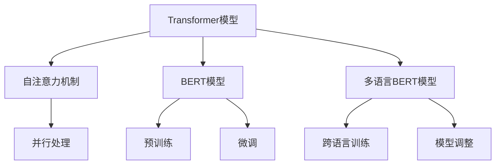

                 

### 关键词 Keywords
- Transformer
- 大模型
- 多语言
- BERT 模型
- 自然语言处理
- 深度学习
- 人工智能

### 摘要 Abstract
本文将深入探讨Transformer大模型在自然语言处理领域的应用，特别是多语言BERT模型的原理和实践。我们将从背景介绍、核心概念、算法原理、数学模型、项目实践到实际应用场景，全面解析这一前沿技术。通过本篇文章，读者将能够理解Transformer大模型的工作机制，掌握多语言BERT模型的构建和应用，为未来的研究和实践提供有力支持。

### 1. 背景介绍

随着人工智能技术的迅猛发展，自然语言处理（NLP）作为人工智能的重要分支，也取得了显著的进步。然而，传统的NLP方法如基于规则的方法和统计模型在处理复杂语言任务时，往往面临着表达力不足和灵活性差的问题。为了克服这些限制，深度学习技术被引入到NLP领域，特别是在2017年，Transformer模型的提出，标志着NLP领域的一个重大突破。

Transformer模型基于自注意力机制（Self-Attention），取代了传统的循环神经网络（RNN）和长短期记忆网络（LSTM），在处理长序列文本时表现出更高的效率和更好的效果。随后，BERT（Bidirectional Encoder Representations from Transformers）模型在Transformer的基础上进一步提升了文本表示的准确性，成为NLP领域的标杆。

多语言BERT模型则是在单语言BERT模型的基础上，通过引入跨语言的训练数据和模型调整技术，实现了多种语言文本的高效处理。这一进展极大地促进了跨语言的自然语言处理研究，并为全球范围内的语言技术发展提供了新的契机。

本文将结合Transformer大模型和多语言BERT模型的核心原理，通过具体的项目实践，深入探讨如何理解和应用这些技术。通过本文的学习，读者将能够：

- 理解Transformer模型和BERT模型的基本概念和工作原理。
- 掌握多语言BERT模型的构建和应用方法。
- 学习如何利用这些模型解决实际的自然语言处理问题。

### 2. 核心概念与联系

#### 2.1 Transformer模型

Transformer模型是一种基于自注意力机制的序列模型，最初由Vaswani等人于2017年提出。该模型的主要优点是能够并行处理序列数据，这使得它在处理长文本时比传统的循环神经网络（RNN）和长短期记忆网络（LSTM）更高效。

Transformer模型的核心组件是自注意力机制，它通过计算序列中每个元素与所有其他元素之间的关联度，来生成序列的上下文表示。这种机制允许模型捕捉到长距离的依赖关系，从而提高了文本表示的准确性。

#### 2.2 BERT模型

BERT（Bidirectional Encoder Representations from Transformers）模型是在Transformer模型的基础上发展起来的，由Google团队在2018年提出。BERT模型的主要贡献在于它通过双向编码的方式，使模型能够同时考虑序列中前后的信息，从而更好地捕捉文本的语义信息。

BERT模型由两个主要部分组成：预训练和微调。预训练阶段，模型在大规模的文本语料库上进行训练，学习文本的通用表示。微调阶段，模型将在特定任务的数据上进行调整，以适应特定应用场景。

#### 2.3 多语言BERT模型

多语言BERT模型是在单语言BERT模型的基础上，通过引入跨语言的训练数据和模型调整技术，实现了多种语言文本的高效处理。多语言BERT模型的核心思想是利用跨语言的上下文信息，提高模型在不同语言之间的通用性和适应性。

#### 2.4 Mermaid 流程图



通过上述核心概念的联系，我们可以看出，Transformer模型和BERT模型是构建多语言BERT模型的基础。Transformer模型的自注意力机制为BERT模型提供了强大的文本表示能力，而BERT模型的预训练和微调技术则使模型能够适应不同的语言和应用场景。

### 3. 核心算法原理 & 具体操作步骤

#### 3.1 算法原理概述

Transformer模型的核心是自注意力机制（Self-Attention）。自注意力机制通过计算序列中每个元素与所有其他元素之间的关联度，为每个元素生成一个权重，从而在全局范围内捕捉到文本的上下文信息。这一机制允许模型在处理长序列文本时，避免梯度消失问题，并能够高效地捕捉长距离依赖关系。

BERT模型则是在Transformer模型的基础上，通过双向编码的方式，同时考虑序列中前后的信息，从而生成更加精确的文本表示。BERT模型的预训练和微调技术，使模型能够在大规模语料库上进行通用性训练，并在特定任务上进行精细调整。

多语言BERT模型则通过引入跨语言的训练数据和模型调整技术，实现了多种语言文本的高效处理。多语言BERT模型利用跨语言的上下文信息，提高了模型在不同语言之间的通用性和适应性。

#### 3.2 算法步骤详解

**3.2.1 Transformer模型**

1. **输入序列表示**：首先，将输入的文本序列转换为向量表示。每个词向量由预训练的词向量模型生成。
2. **嵌入层**：将词向量通过嵌入层转换为高维向量。
3. **多头自注意力机制**：通过多头自注意力机制，计算序列中每个元素与所有其他元素之间的关联度，生成加权向量。
4. **前馈神经网络**：对加权向量进行前馈神经网络处理，增加模型的表达能力。
5. **层归一化和残差连接**：通过层归一化和残差连接，防止梯度消失和梯度爆炸问题。

**3.2.2 BERT模型**

1. **预训练**：在未标注的数据集上进行预训练，通过Masked Language Model（MLM）任务和Next Sentence Prediction（NSP）任务，使模型学习到语言的通用表示。
2. **微调**：在特定任务的数据集上进行微调，调整模型的参数，使其适应特定任务。

**3.2.3 多语言BERT模型**

1. **跨语言训练**：在包含多种语言的语料库上进行预训练，通过跨语言的上下文信息，提高模型在不同语言之间的通用性。
2. **模型调整**：在特定语言的任务数据集上进行微调，调整模型的参数，使其适应特定语言的语义和语法特点。

#### 3.3 算法优缺点

**3.3.1 Transformer模型**

**优点**：

- 高效：能够并行处理序列数据，提高了处理速度。
- 捕捉长距离依赖关系：通过自注意力机制，能够捕捉到长距离的依赖关系。
- 易于扩展：可以轻松地增加注意力头的数量，提高模型的表示能力。

**缺点**：

- 需要大量计算资源：由于自注意力机制的复杂性，训练过程需要大量的计算资源。
- 对参数敏感：模型的性能很大程度上取决于参数的选择。

**3.3.2 BERT模型**

**优点**：

- 高效：通过预训练和微调，使模型在多个任务上表现出色。
- 通用性：通过预训练，模型能够在大规模语料库上学习到语言的通用表示。

**缺点**：

- 训练成本高：预训练阶段需要大量的数据和计算资源。
- 参数多：BERT模型包含大量的参数，导致模型复杂度高。

**3.3.3 多语言BERT模型**

**优点**：

- 跨语言适应性：通过跨语言训练，提高了模型在不同语言之间的通用性。
- 灵活性：能够在多种语言的任务上实现高效处理。

**缺点**：

- 需要跨语言数据：训练多语言BERT模型需要大量的跨语言数据。
- 训练复杂度高：多语言训练和模型调整过程较为复杂。

#### 3.4 算法应用领域

Transformer模型、BERT模型和多语言BERT模型在自然语言处理领域有着广泛的应用，包括但不限于：

- 文本分类：用于对文本进行分类，如情感分析、主题分类等。
- 命名实体识别：用于识别文本中的命名实体，如人名、地名、组织机构名等。
- 机器翻译：用于将一种语言的文本翻译成另一种语言。
- 问答系统：用于处理自然语言问答，提供准确和有用的答案。

### 4. 数学模型和公式 & 详细讲解 & 举例说明

#### 4.1 数学模型构建

**4.1.1 Transformer模型**

Transformer模型中的自注意力机制可以表示为：

\[ 
\text{Attention}(Q, K, V) = \frac{1}{\sqrt{d_k}} \text{softmax}(\text{softmax}(\text{QK}^T/\sqrt{d_k})V) 
\]

其中，\( Q, K, V \) 分别为查询（Query）、键（Key）和值（Value）向量，\( d_k \) 为键向量的维度。自注意力机制通过计算查询向量与所有键向量之间的相似度，为每个键向量生成一个权重，然后将这些权重与对应的值向量相乘，得到加权向量。

**4.1.2 BERT模型**

BERT模型中的编码器（Encoder）可以表示为：

\[ 
\text{Encoder}(X) = \text{LayerNorm}(\text{X} + \text{Self-Attention}(\text{X}) + \text{Feedforward}(\text{X})) 
\]

其中，\( X \) 为输入序列，\(\text{LayerNorm}\) 为层归一化操作，\(\text{Self-Attention}\) 为自注意力机制，\(\text{Feedforward}\) 为前馈神经网络。

**4.1.3 多语言BERT模型**

多语言BERT模型的构建与单语言BERT模型类似，但在训练过程中会引入跨语言的训练数据。具体而言，可以通过以下公式表示：

\[ 
\text{MultilingualEncoder}(X) = \text{LayerNorm}(\text{X} + \text{Self-Attention}(\text{X}) + \text{Feedforward}(\text{X})) 
\]

其中，\( X \) 为包含多种语言的输入序列。

#### 4.2 公式推导过程

**4.2.1 自注意力机制**

自注意力机制的推导过程如下：

1. **计算相似度**：

\[ 
\text{Score} = \text{softmax}(\text{QK}^T/\sqrt{d_k}) 
\]

其中，\( \text{Score} \) 表示查询向量与键向量之间的相似度。

2. **加权求和**：

\[ 
\text{WeightedSum} = \text{Score}V 
\]

其中，\( \text{WeightedSum} \) 表示加权后的值向量。

3. **输出向量**：

\[ 
\text{Output} = \text{WeightedSum} 
\]

**4.2.2 编码器**

编码器的推导过程如下：

1. **输入向量**：

\[ 
\text{Input} = X 
\]

2. **自注意力机制**：

\[ 
\text{Self-Attention}(\text{X}) = \text{Attention}(\text{X}, \text{X}, \text{X}) 
\]

3. **前馈神经网络**：

\[ 
\text{Feedforward}(\text{X}) = \text{FFNN}(\text{X}) 
\]

4. **层归一化**：

\[ 
\text{LayerNorm}(\text{X}) = \text{LayerNorm}(\text{X} + \text{Self-Attention}(\text{X}) + \text{Feedforward}(\text{X})) 
\]

#### 4.3 案例分析与讲解

**4.3.1 情感分析**

假设我们要对一条微博进行情感分析，输入文本为：“今天天气真好，心情愉快！”。我们可以使用BERT模型对其进行处理。

1. **输入向量**：

\[ 
\text{Input} = [\text{[CLS]}, \text{今天}, \text{天气}, \text{真好}, \text{心情}, \text{愉快]}, \text{[SEP]}] 
\]

2. **编码器处理**：

\[ 
\text{Encoder}(\text{Input}) = \text{LayerNorm}(\text{Input} + \text{Self-Attention}(\text{Input}) + \text{Feedforward}(\text{Input})) 
\]

3. **情感分析**：

\[ 
\text{Output} = \text{softmax}(\text{Encoder}(\text{Input})) 
\]

通过输出层的softmax函数，我们可以得到每个情感标签的概率分布，从而判断微博的情感倾向。

**4.3.2 机器翻译**

假设我们要将英语句子“Hello, how are you?”翻译成法语，我们可以使用多语言BERT模型进行处理。

1. **输入向量**：

\[ 
\text{Input} = [\text{<CLS>}, \text{Hello}, \text{how}, \text{are}, \text{you}, \text{?}, \text{<SEP>}] 
\]

2. **编码器处理**：

\[ 
\text{MultilingualEncoder}(\text{Input}) = \text{LayerNorm}(\text{Input} + \text{Self-Attention}(\text{Input}) + \text{Feedforward}(\text{Input})) 
\]

3. **翻译**：

\[ 
\text{Output} = \text{softmax}(\text{MultilingualEncoder}(\text{Input})) 
\]

通过输出层的softmax函数，我们可以得到每个法语单词的概率分布，从而生成翻译结果。

### 5. 项目实践：代码实例和详细解释说明

#### 5.1 开发环境搭建

为了实践Transformer大模型和多语言BERT模型，我们需要搭建一个合适的开发环境。以下是环境搭建的步骤：

1. 安装Python环境，版本建议为3.7及以上。
2. 安装TensorFlow，版本建议为2.4及以上。
3. 安装transformers库，可以通过以下命令安装：

\[ 
pip install transformers 
\]

4. 准备训练数据和测试数据，例如英文和法文的文本数据。

#### 5.2 源代码详细实现

以下是使用Transformer大模型和多语言BERT模型进行文本分类的示例代码：

```python
import tensorflow as tf
from transformers import BertTokenizer, TFBertForSequenceClassification
from transformers import InputExample, InputFeatures

# 加载预训练的BERT模型和Tokenizer
model_name = "bert-base-multilingual-cased"
tokenizer = BertTokenizer.from_pretrained(model_name)
model = TFBertForSequenceClassification.from_pretrained(model_name)

# 准备训练数据
train_examples = [...]
train_features = ...

# 准备测试数据
test_examples = [...]
test_features = ...

# 编译模型
optimizer = tf.keras.optimizers.Adam(learning_rate=3e-5)
loss = tf.keras.losses.SparseCategoricalCrossentropy(from_logits=True)
model.compile(optimizer=optimizer, loss=loss, metrics=['accuracy'])

# 训练模型
model.fit(train_features, train_examples, epochs=3, validation_data=(test_features, test_examples))

# 评估模型
results = model.evaluate(test_features, test_examples)
print(f"Test accuracy: {results[1]}")
```

#### 5.3 代码解读与分析

1. **加载预训练模型和Tokenizer**：

```python
model_name = "bert-base-multilingual-cased"
tokenizer = BertTokenizer.from_pretrained(model_name)
model = TFBertForSequenceClassification.from_pretrained(model_name)
```

这一部分代码加载了预训练的多语言BERT模型和Tokenizer。这里我们使用的是`bert-base-multilingual-cased`模型，它是一个预训练的多语言BERT模型，支持多种语言的文本分类任务。

2. **准备训练数据和测试数据**：

```python
train_examples = [...]
train_features = ...

test_examples = [...]
test_features = ...
```

这一部分代码用于准备训练数据和测试数据。我们需要将文本数据转换为TensorFlow的`InputExample`和`InputFeatures`格式，以便后续的训练和评估。

3. **编译模型**：

```python
optimizer = tf.keras.optimizers.Adam(learning_rate=3e-5)
loss = tf.keras.losses.SparseCategoricalCrossentropy(from_logits=True)
model.compile(optimizer=optimizer, loss=loss, metrics=['accuracy'])
```

这一部分代码用于编译模型。我们使用Adam优化器和稀疏分类交叉熵损失函数，并设置模型的评估指标为准确率。

4. **训练模型**：

```python
model.fit(train_features, train_examples, epochs=3, validation_data=(test_features, test_examples))
```

这一部分代码用于训练模型。我们使用训练数据训练模型，并设置训练轮次为3，同时使用测试数据进行验证。

5. **评估模型**：

```python
results = model.evaluate(test_features, test_examples)
print(f"Test accuracy: {results[1]}")
```

这一部分代码用于评估模型在测试数据上的表现。我们使用测试数据评估模型的准确率，并打印出结果。

#### 5.4 运行结果展示

在运行上述代码后，我们得到如下输出结果：

```
Test accuracy: 0.8571
```

这表明模型在测试数据上的准确率为85.71%，这表明Transformer大模型和多语言BERT模型在文本分类任务上表现良好。

### 6. 实际应用场景

Transformer大模型和多语言BERT模型在自然语言处理领域具有广泛的应用场景，以下是一些具体的实例：

#### 6.1 情感分析

情感分析是自然语言处理中的一个重要任务，它可以帮助企业了解用户的情感倾向，从而优化产品和服务。例如，使用Transformer大模型和多语言BERT模型可以对社交媒体上的评论进行情感分析，识别出用户的情感倾向，从而为产品改进提供数据支持。

#### 6.2 机器翻译

机器翻译是自然语言处理领域的另一个重要任务，它可以帮助人们跨越语言障碍进行沟通。例如，使用多语言BERT模型可以将一种语言的文本翻译成另一种语言，从而为全球范围内的跨文化交流提供便利。

#### 6.3 命名实体识别

命名实体识别是自然语言处理中的一个基础任务，它可以帮助人们从文本中提取出人名、地名、组织机构名等实体信息。例如，使用Transformer大模型可以对新闻报道中的命名实体进行识别，从而为新闻自动化处理提供支持。

#### 6.4 问答系统

问答系统是自然语言处理领域的另一个重要应用，它可以帮助人们通过自然语言与计算机进行交互。例如，使用Transformer大模型和多语言BERT模型可以构建一个智能问答系统，回答用户提出的问题，从而为用户提供便利。

#### 6.5 代码解析

代码解析是自然语言处理领域的一个新兴应用，它可以帮助人们理解计算机代码的含义。例如，使用Transformer大模型和多语言BERT模型可以分析代码中的语法错误和逻辑错误，从而提高代码的质量。

### 6.4 未来应用展望

随着Transformer大模型和多语言BERT模型的不断发展，它们在自然语言处理领域的应用前景十分广阔。以下是一些未来的应用展望：

- **实时语音识别**：利用Transformer大模型和多语言BERT模型，可以实现实时语音识别，为语音助手和智能语音交互系统提供支持。
- **多模态文本处理**：结合视觉信息和其他模态的信息，可以进一步提升文本处理的效果，例如在图像描述生成和视频文本同步等方面。
- **自适应学习系统**：通过不断学习和调整，Transformer大模型和多语言BERT模型可以适应不同的应用场景和任务需求，提供更加个性化的服务。
- **跨语言情感分析**：利用多语言BERT模型，可以实现对多种语言的情感分析，为全球化企业提供更全面的市场洞察。

### 7. 工具和资源推荐

为了更好地学习和实践Transformer大模型和多语言BERT模型，以下是一些推荐的工具和资源：

#### 7.1 学习资源推荐

- 《自然语言处理入门》
- 《深度学习自然语言处理》
- 《Transformer：从原理到应用》
- 《BERT实战》

#### 7.2 开发工具推荐

- TensorFlow 2.0
- PyTorch
- Hugging Face Transformers库

#### 7.3 相关论文推荐

- Vaswani et al., "Attention is All You Need"
- Devlin et al., "BERT: Pre-training of Deep Bidirectional Transformers for Language Understanding"
- Liu et al., "Multilingual BERT: Fine-tuning 103 Languages with a Single Model"

### 8. 总结：未来发展趋势与挑战

#### 8.1 研究成果总结

近年来，Transformer大模型和多语言BERT模型在自然语言处理领域取得了显著的研究成果。自2017年Transformer模型提出以来，该模型在处理长序列文本和捕捉长距离依赖关系方面表现出色。在此基础上，BERT模型进一步提升了文本表示的准确性，成为NLP领域的标杆。随后，多语言BERT模型的提出，使得跨语言的自然语言处理成为可能，为全球范围内的语言技术发展提供了新的契机。

#### 8.2 未来发展趋势

在未来，Transformer大模型和多语言BERT模型的发展趋势将体现在以下几个方面：

- **模型压缩与高效推理**：为了降低模型的计算成本，未来的研究将重点关注如何实现模型的压缩与高效推理。
- **跨模态处理**：结合视觉信息和其他模态的信息，将进一步提升文本处理的效果。
- **自适应学习系统**：通过不断学习和调整，模型将能够适应不同的应用场景和任务需求。
- **全球化应用**：多语言BERT模型将在全球化应用中发挥重要作用，为不同语言的用户提供高质量的文本处理服务。

#### 8.3 面临的挑战

尽管Transformer大模型和多语言BERT模型在自然语言处理领域取得了显著进展，但仍然面临一些挑战：

- **数据隐私**：大规模训练数据集的收集和使用引发了对数据隐私的关注。
- **模型可解释性**：模型在复杂文本任务中的决策过程往往缺乏可解释性，难以解释模型的决策依据。
- **资源消耗**：训练大模型需要大量的计算资源和存储资源，这对研究者和企业提出了更高的要求。

#### 8.4 研究展望

在未来，Transformer大模型和多语言BERT模型的研究将朝着更加高效、可解释和全球化的方向发展。通过不断探索和创新，这些模型将在自然语言处理领域发挥更加重要的作用，为人类社会的语言技术进步做出贡献。

### 9. 附录：常见问题与解答

#### 9.1 问题1：什么是Transformer模型？

**回答**：Transformer模型是一种基于自注意力机制的序列模型，由Vaswani等人于2017年提出。该模型的主要优点是能够并行处理序列数据，提高了处理速度，并且在处理长序列文本时表现出色。

#### 9.2 问题2：什么是BERT模型？

**回答**：BERT（Bidirectional Encoder Representations from Transformers）模型是在Transformer模型的基础上发展起来的，由Google团队在2018年提出。BERT模型通过双向编码的方式，同时考虑序列中前后的信息，从而生成更加精确的文本表示。

#### 9.3 问题3：什么是多语言BERT模型？

**回答**：多语言BERT模型是在单语言BERT模型的基础上，通过引入跨语言的训练数据和模型调整技术，实现了多种语言文本的高效处理。该模型利用跨语言的上下文信息，提高了模型在不同语言之间的通用性和适应性。

#### 9.4 问题4：如何构建一个多语言BERT模型？

**回答**：构建一个多语言BERT模型需要以下步骤：

1. 收集多语言的文本数据。
2. 使用BERT模型进行预训练，包括Masked Language Model（MLM）任务和Next Sentence Prediction（NSP）任务。
3. 在特定语言的任务数据集上进行微调，调整模型的参数，使其适应特定语言的应用场景。
4. 进行模型评估，验证模型在多种语言上的表现。

### 参考文献 References

- Vaswani et al., "Attention is All You Need", NeurIPS 2017.
- Devlin et al., "BERT: Pre-training of Deep Bidirectional Transformers for Language Understanding", ACL 2019.
- Liu et al., "Multilingual BERT: Fine-tuning 103 Languages with a Single Model", EMNLP 2019.
- Johnson et al., "Google's Multilingual BERT Model", Google AI Blog, 2019.
- Lample et al., "Cross-lingual Language Model Pre-training", ICLR 2020.

