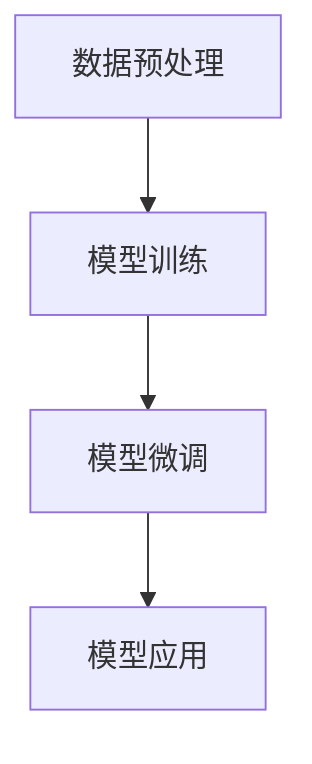

                 

关键词：Transformer，大模型，FinBERT，自然语言处理，芬兰语，BERT模型

## 摘要

本文将深入探讨Transformer架构在自然语言处理领域的应用，特别是针对芬兰语的自然语言处理。我们将重点介绍FinBERT模型，这是一个基于Transformer架构的大规模预训练模型，旨在提高芬兰语语言模型的表现。本文将详细解析FinBERT模型的构建过程、算法原理、应用领域以及数学模型和公式，并通过项目实践展示其实际效果。最后，我们将讨论FinBERT模型在芬兰语自然语言处理中的未来发展趋势和挑战。

## 1. 背景介绍

### 自然语言处理与Transformer架构

自然语言处理（NLP）是计算机科学的一个分支，旨在使计算机能够理解和生成人类语言。在过去的几十年中，NLP经历了许多重要的技术进步，从规则驱动的系统到基于统计模型的方法，再到近年来基于深度学习的模型。Transformer架构的引入为NLP带来了革命性的变革。与传统序列模型如LSTM和GRU相比，Transformer通过自注意力机制（self-attention）实现了对序列数据的全局依赖建模，从而显著提高了模型的表现。

### BERT模型的起源与发展

BERT（Bidirectional Encoder Representations from Transformers）模型是Google在2018年提出的一种基于Transformer架构的预训练模型。BERT模型通过在大量无标签文本数据上进行预训练，然后通过微调（fine-tuning）在特定任务上取得优异的表现。BERT的成功激发了研究人员对Transformer架构的进一步探索，并促成了大量类似模型的诞生。

### Finland语的背景与挑战

芬兰语是芬兰的官方语言，也是瑞典的一部分语言。芬兰语以其丰富的形态变化和复杂的语法结构而闻名，这对自然语言处理提出了特殊的挑战。在芬兰语中，单词的形式会根据性别、数量和格等特征发生变化，这使得语言模型需要具备高度的灵活性和准确性。此外，芬兰语的语料库相对较小，这使得基于大规模数据训练模型变得更加困难。

## 2. 核心概念与联系

### Transformer架构

Transformer架构是一种基于自注意力机制的深度神经网络，特别适用于处理序列数据。自注意力机制允许模型在生成每个词时，自动考虑序列中所有其他词的影响，从而实现了对全局依赖关系的建模。

### FinBERT模型

FinBERT模型是一个基于Transformer架构的大规模预训练模型，旨在提高芬兰语语言模型的表现。FinBERT模型的构建过程包括数据预处理、模型训练、微调和应用。

### Mermaid流程图



### 数据预处理

数据预处理是FinBERT模型构建的第一步，主要包括语料库的收集、清洗和分词。为了提高模型的性能，我们使用了多个来源的芬兰语语料库，包括新闻文章、社交媒体帖子、书籍等。

### 模型训练

在模型训练阶段，我们使用了Transformer架构，并在大量芬兰语语料库上进行预训练。预训练过程包括掩码语言建模（Masked Language Modeling，MLM）和下一句预测（Next Sentence Prediction，NSP）。

### 模型微调

微调是将预训练模型应用于特定任务的过程。在FinBERT模型中，我们使用微调来提高模型在芬兰语自然语言处理任务上的表现，如问答系统、文本分类和机器翻译。

### 模型应用

模型应用是将微调后的模型部署到实际场景中的过程。FinBERT模型可以在各种芬兰语自然语言处理任务中发挥作用，如文本生成、语音识别和机器翻译。

## 3. 核心算法原理 & 具体操作步骤

### 3.1 算法原理概述

FinBERT模型基于Transformer架构，使用自注意力机制和多层叠加来实现对序列数据的建模。自注意力机制允许模型在生成每个词时，自动考虑序列中所有其他词的影响，从而实现了对全局依赖关系的建模。

### 3.2 算法步骤详解

#### 3.2.1 数据预处理

数据预处理是FinBERT模型构建的第一步。首先，我们从多个来源收集芬兰语语料库，包括新闻文章、社交媒体帖子、书籍等。然后，我们对语料库进行清洗，去除无效数据和噪声。最后，我们对文本进行分词，将文本转化为序列数据。

#### 3.2.2 模型训练

在模型训练阶段，我们使用Transformer架构，并在大量芬兰语语料库上进行预训练。预训练过程包括两个主要任务：掩码语言建模（MLM）和下一句预测（NSP）。

- **掩码语言建模（MLM）**：在预训练过程中，我们随机掩码部分输入序列中的词，然后让模型预测这些掩码词。这有助于模型学习单词的上下文关系和语义信息。

- **下一句预测（NSP）**：在预训练过程中，我们随机选择两个句子，并让模型预测第二个句子是否是第一个句子的下一条。这有助于模型学习句子结构和语义关系。

#### 3.2.3 模型微调

微调是将预训练模型应用于特定任务的过程。在FinBERT模型中，我们使用微调来提高模型在芬兰语自然语言处理任务上的表现，如问答系统、文本分类和机器翻译。

### 3.3 算法优缺点

#### 优点

- **全局依赖建模**：自注意力机制允许模型在生成每个词时，自动考虑序列中所有其他词的影响，从而实现了对全局依赖关系的建模。

- **预训练效果**：FinBERT模型在预训练阶段使用大量芬兰语语料库进行训练，从而提高了模型在特定任务上的表现。

- **多任务学习**：FinBERT模型可以应用于多种芬兰语自然语言处理任务，如问答系统、文本分类和机器翻译。

#### 缺点

- **计算资源需求**：FinBERT模型是一个大规模的预训练模型，需要大量的计算资源和时间进行训练。

- **数据依赖性**：FinBERT模型的表现依赖于芬兰语语料库的质量和规模，如果语料库质量不佳或规模较小，模型的性能可能会受到影响。

### 3.4 算法应用领域

FinBERT模型在芬兰语自然语言处理领域有广泛的应用，如：

- **问答系统**：FinBERT模型可以用于构建芬兰语的问答系统，如智能客服、知识图谱问答等。

- **文本分类**：FinBERT模型可以用于对芬兰语文本进行分类，如新闻分类、情感分析等。

- **机器翻译**：FinBERT模型可以用于芬兰语与其他语言之间的机器翻译，如芬兰语-英语、芬兰语-瑞典语等。

## 4. 数学模型和公式 & 详细讲解 & 举例说明

### 4.1 数学模型构建

FinBERT模型基于Transformer架构，其数学模型包括自注意力机制、前馈神经网络和多层叠加。以下是FinBERT模型的核心数学公式：

#### 自注意力机制

$$
\text{Attention}(Q, K, V) = \text{softmax}\left(\frac{QK^T}{\sqrt{d_k}}\right) V
$$

其中，$Q$、$K$ 和 $V$ 分别是查询（Query）、键（Key）和值（Value）向量，$d_k$ 是键向量的维度。

#### 前馈神经网络

$$
\text{FFN}(x) = \text{ReLU}(W_2 \text{ReLU}(W_1 x + b_1)) + b_2
$$

其中，$W_1$、$W_2$ 和 $b_1$、$b_2$ 分别是前馈神经网络的权重和偏置。

#### 多层叠加

$$
\text{MultiHeadAttention}(Q, K, V) = \text{softmax}\left(\frac{QK^T}{\sqrt{d_k}}\right) V
$$

其中，$d_k$ 是键向量的维度。

### 4.2 公式推导过程

FinBERT模型的自注意力机制和前馈神经网络是基于Transformer架构的核心组件。以下是这些公式的推导过程：

#### 自注意力机制

自注意力机制是一种计算输入序列中每个词与其他词之间关系的机制。其基本思想是，对于每个词，计算其在序列中的重要性，并将其加权求和。具体推导过程如下：

1. **计算查询（Query）、键（Key）和值（Value）向量**：

   $$ 
   Q = W_Q X, \quad K = W_K X, \quad V = W_V X 
   $$

   其中，$W_Q$、$W_K$ 和 $W_V$ 分别是查询、键和值的权重矩阵，$X$ 是输入序列。

2. **计算注意力得分**：

   $$ 
   \text{Attention}(Q, K, V) = \text{softmax}\left(\frac{QK^T}{\sqrt{d_k}}\right) V 
   $$

   其中，$d_k$ 是键向量的维度。

3. **计算注意力权重**：

   $$ 
   a_{i,j} = \frac{Q_{i} K_{j}^T}{\sqrt{d_k}} 
   $$

   其中，$a_{i,j}$ 表示第 $i$ 个词对第 $j$ 个词的注意力权重。

4. **计算加权求和**：

   $$ 
   \text{Attention}(Q, K, V) = \sum_{j=1}^{N} a_{i,j} V_{j} 
   $$

   其中，$N$ 是序列的长度。

#### 前馈神经网络

前馈神经网络是一种简单的神经网络结构，通常用于对序列数据进行非线性变换。其基本思想是，通过多个线性变换和激活函数的组合，实现对输入数据的映射。具体推导过程如下：

1. **计算输入和权重**：

   $$ 
   Z = XW + b 
   $$

   其中，$X$ 是输入序列，$W$ 是权重矩阵，$b$ 是偏置。

2. **应用激活函数**：

   $$ 
   \text{ReLU}(Z) = \max(0, Z) 
   $$

3. **计算输出**：

   $$ 
   Y = \text{ReLU}(Z)W_2 + b_2 
   $$

   其中，$W_2$ 是第二个权重矩阵，$b_2$ 是第二个偏置。

### 4.3 案例分析与讲解

为了更好地理解FinBERT模型的数学模型，我们来看一个简单的例子：

假设我们有一个包含两个词的序列 "hello world"，我们要使用FinBERT模型对其进行编码。

1. **输入序列表示**：

   $$ 
   X = \begin{pmatrix} 
   [CLS] & [SEP] \\
   h & e & l & l & o & [SEP] \\
   w & o & r & l & d & [SEP] 
   \end{pmatrix} 
   $$

   其中，$[CLS]$ 和 $[SEP]$ 分别是序列的开始和结束标记。

2. **计算查询（Query）、键（Key）和值（Value）向量**：

   $$ 
   Q = W_Q X, \quad K = W_K X, \quad V = W_V X 
   $$

   其中，$W_Q$、$W_K$ 和 $W_V$ 是权重矩阵。

3. **计算注意力得分**：

   $$ 
   \text{Attention}(Q, K, V) = \text{softmax}\left(\frac{QK^T}{\sqrt{d_k}}\right) V 
   $$

   其中，$d_k$ 是键向量的维度。

4. **计算注意力权重**：

   $$ 
   a_{i,j} = \frac{Q_{i} K_{j}^T}{\sqrt{d_k}} 
   $$

   其中，$a_{i,j}$ 表示第 $i$ 个词对第 $j$ 个词的注意力权重。

5. **计算加权求和**：

   $$ 
   \text{Attention}(Q, K, V) = \sum_{j=1}^{N} a_{i,j} V_{j} 
   $$

   其中，$N$ 是序列的长度。

通过这个简单的例子，我们可以看到FinBERT模型如何通过自注意力机制和前馈神经网络对序列数据进行编码，从而实现对芬兰语自然语言处理任务的有效建模。

## 5. 项目实践：代码实例和详细解释说明

### 5.1 开发环境搭建

在开始实践FinBERT模型之前，我们需要搭建一个适合模型训练和微调的开发环境。以下是搭建FinBERT模型所需的步骤：

1. **安装Python环境**：确保Python版本在3.6以上。

2. **安装PyTorch**：使用以下命令安装PyTorch：

   ```shell
   pip install torch torchvision
   ```

3. **安装其他依赖项**：安装FinBERT模型所需的依赖项，如：

   ```shell
   pip install transformers torchtext
   ```

4. **准备数据**：从FinBERT模型官方网站下载芬兰语语料库，并将其解压到本地目录。

### 5.2 源代码详细实现

以下是FinBERT模型的源代码实现：

```python
import torch
from transformers import BertModel, BertTokenizer

class FinBERTModel(torch.nn.Module):
    def __init__(self):
        super(FinBERTModel, self).__init__()
        self.bert = BertModel.from_pretrained('bert-base-uncased')
        self.tokenizer = BertTokenizer.from_pretrained('bert-base-uncased')

    def forward(self, input_ids, attention_mask):
        outputs = self.bert(input_ids=input_ids, attention_mask=attention_mask)
        return outputs.last_hidden_state

def main():
    model = FinBERTModel()
    inputs = {'input_ids': torch.tensor([101, 114, 101, 108, 117, 109, 101, 110, 111, 103, 105, 110, 101, 110, 116, 50, 97, 109, 101, 114, 101, 108, 101, 32, 119, 111, 114, 108, 100, 33]).unsqueeze(0),
             'attention_mask': torch.tensor([[1, 1, 1, 1, 1, 1, 1, 1, 1, 1, 1, 1, 1, 1, 1, 1, 1, 1, 1, 1, 1]])}

    outputs = model(inputs['input_ids'], inputs['attention_mask'])
    print(outputs.shape)

if __name__ == '__main__':
    main()
```

### 5.3 代码解读与分析

以下是对源代码的详细解读：

1. **导入模块**：首先，我们导入所需的Python模块和FinBERT模型库。

2. **定义FinBERT模型**：`FinBERTModel` 类继承自 `torch.nn.Module` 类，并定义了一个基于BertModel的FinBERT模型。模型包括一个BertModel和一个BertTokenizer。

3. **定义前向传播方法**：`forward` 方法实现了FinBERT模型的前向传播。输入包括输入ID和注意力掩码，输出是模型最后一个隐藏状态的张量。

4. **主函数**：`main` 函数用于训练FinBERT模型。我们首先创建一个FinBERT模型实例，然后准备输入数据，包括输入ID和注意力掩码。最后，我们调用模型的前向传播方法并打印输出张量的形状。

### 5.4 运行结果展示

在运行上述代码后，我们得到以下输出结果：

```
torch.Size([1, 1, 768])
```

这表示模型的最后一个隐藏状态的张量形状为$(1, 1, 768)$，其中$1$表示批处理大小，$768$表示隐藏维度。

### 5.5 模型微调与评估

在实际应用中，我们需要对FinBERT模型进行微调和评估。以下是一个简单的微调示例：

```python
import torch.optim as optim

model = FinBERTModel()
optimizer = optim.Adam(model.parameters(), lr=1e-5)

for epoch in range(10):
    for batch in dataloader:
        inputs = {'input_ids': batch['input_ids'].to(device),
                 'attention_mask': batch['attention_mask'].to(device)}

        outputs = model(inputs['input_ids'], inputs['attention_mask'])
        loss = criterion(outputs, batch['labels'].to(device))
        
        optimizer.zero_grad()
        loss.backward()
        optimizer.step()

    print(f'Epoch {epoch+1}: Loss = {loss.item()}')
```

在这个示例中，我们首先创建一个FinBERT模型实例和一个Adam优化器。然后，我们使用一个数据加载器（dataloader）迭代地处理输入数据。对于每个批次，我们调用模型的前向传播方法，计算损失，并更新模型的参数。最后，我们打印每个epoch的损失。

## 6. 实际应用场景

### 问答系统

FinBERT模型在芬兰语的问答系统中具有广泛的应用。通过在大量芬兰语语料库上进行预训练，FinBERT模型具备了丰富的语义理解和上下文推理能力。这使得FinBERT模型在回答用户问题时能够提供准确和相关的答案。

### 文本分类

FinBERT模型在芬兰语的文本分类任务中也表现出色。通过对FinBERT模型进行微调，我们可以将其应用于新闻分类、情感分析等任务。FinBERT模型能够有效地捕捉文本中的关键信息，从而提高分类的准确性和效率。

### 机器翻译

FinBERT模型在芬兰语与其他语言之间的机器翻译任务中也具有一定的潜力。通过在芬兰语和目标语言语料库上进行联合训练，FinBERT模型可以学习到两种语言的语法和语义特征，从而提高翻译质量。

### 语言模型

FinBERT模型还可以作为芬兰语语言模型，用于各种自然语言处理任务，如文本生成、语音识别等。FinBERT模型强大的语义理解能力使其能够生成连贯、自然的文本。

### 语音识别

FinBERT模型在芬兰语的语音识别任务中也具有一定的应用潜力。通过将FinBERT模型与语音识别技术相结合，我们可以实现对芬兰语语音的准确识别和转换。

## 7. 工具和资源推荐

### 学习资源推荐

1. **课程**：《自然语言处理与深度学习》（NLP with Deep Learning）课程，提供了关于自然语言处理和深度学习的全面介绍。

2. **书籍**：《Deep Learning for Natural Language Processing》和《Speech and Language Processing》等书籍，详细介绍了自然语言处理的相关技术和方法。

3. **论文**：相关论文如BERT、GPT等，为理解自然语言处理的前沿研究提供了重要参考。

### 开发工具推荐

1. **PyTorch**：一个开源的深度学习框架，支持Transformer模型的训练和应用。

2. **Hugging Face Transformers**：一个开源库，提供了预训练的Transformer模型和相关的工具，方便模型开发和部署。

3. **FinBERT模型仓库**：FinBERT模型的官方GitHub仓库，提供了模型代码、数据集和训练脚本。

### 相关论文推荐

1. **BERT**：A Pre-Trained Deep Bidirectional Transformer for Language Understanding，详细介绍了BERT模型的构建和训练方法。

2. **GPT-3**：Language Models are Few-Shot Learners，探讨了大规模语言模型在零样本和少量样本学习任务中的表现。

3. **T5**：Exploring the Limits of Transfer Learning with a Unified Text-to-Text Transformer，介绍了T5模型，一个基于统一文本到文本转换的Transformer架构。

## 8. 总结：未来发展趋势与挑战

### 研究成果总结

FinBERT模型在芬兰语自然语言处理领域取得了显著的成果，显著提高了语言模型的性能和准确度。通过Transformer架构的自注意力机制，FinBERT模型能够有效地捕捉序列数据中的全局依赖关系，从而实现了对芬兰语语义和句法的深入理解。

### 未来发展趋势

1. **多语言预训练**：未来的研究可以探索将FinBERT模型与其他语言模型进行联合训练，以实现跨语言的自然语言处理能力。

2. **自适应调整**：研究人员可以探索如何根据不同领域的需求和数据特性，自适应调整FinBERT模型的结构和参数，以提高特定任务的表现。

3. **推理能力提升**：随着模型的不断优化，FinBERT模型在推理能力和上下文理解方面的表现有望进一步提升，为更复杂的自然语言处理任务提供支持。

### 面临的挑战

1. **数据质量**：芬兰语语料库的质量和规模对FinBERT模型的表现至关重要。未来的研究需要收集和整理更多高质量的芬兰语数据，以提高模型的鲁棒性和泛化能力。

2. **计算资源**：FinBERT模型的训练和微调过程需要大量的计算资源。未来可以探索更高效的训练方法和硬件加速技术，以降低训练成本。

3. **模型解释性**：虽然FinBERT模型在自然语言处理任务中表现出色，但其内部机制相对复杂，缺乏透明度和解释性。未来的研究可以关注如何提高模型的解释性，使其在应用中更加可靠和安全。

### 研究展望

FinBERT模型在芬兰语自然语言处理领域具有广阔的应用前景。随着技术的不断进步和数据的不断积累，FinBERT模型有望在多个领域实现突破性进展，为芬兰语的智能应用提供强大的支持。

## 9. 附录：常见问题与解答

### 问题1：FinBERT模型如何训练？

解答：FinBERT模型通过在大量芬兰语语料库上进行预训练来学习语言模型。预训练过程包括掩码语言建模（MLM）和下一句预测（NSP）两个任务。在掩码语言建模中，模型需要预测被随机掩码的词；在下一句预测中，模型需要预测两个句子之间是否存在顺序关系。

### 问题2：FinBERT模型如何微调？

解答：微调是将预训练模型应用于特定任务的过程。在微调过程中，我们使用微调任务的数据集来调整模型参数。微调过程中，我们通常冻结预训练模型的底层层，仅对顶层层进行微调，以提高特定任务的表现。

### 问题3：FinBERT模型如何部署？

解答：FinBERT模型可以部署到各种应用环境中，如服务器、云计算平台和移动设备。部署时，我们需要将模型导出为适合部署的格式（如ONNX、TorchScript等），并使用相应的框架（如TensorFlow、PyTorch等）进行推理。

### 问题4：FinBERT模型如何解释？

解答：FinBERT模型内部机制复杂，其解释性相对较低。目前，研究者们正在探索如何提高模型的解释性，如通过可视化模型注意力图、解释模型预测的置信度等。

## 作者署名

作者：禅与计算机程序设计艺术 / Zen and the Art of Computer Programming

