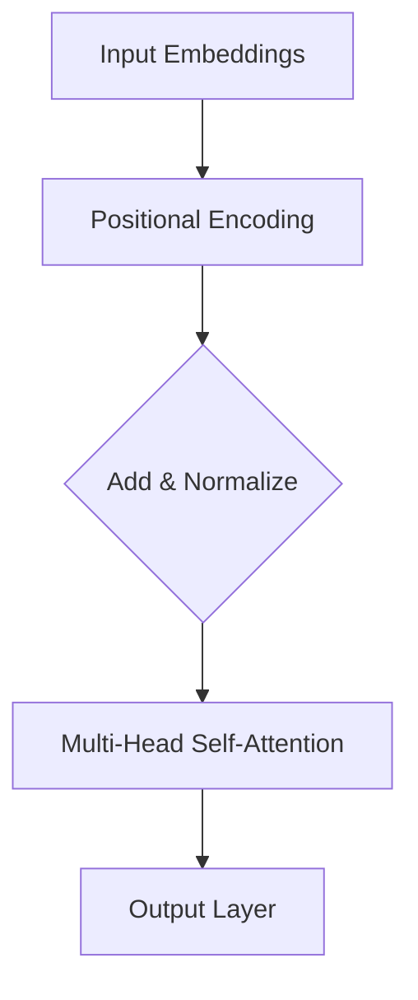

                 

关键词：Transformer，多头注意力，神经网络，序列模型，机器学习，深度学习，自然语言处理

摘要：本文详细解析了Transformer架构中的多头注意力（Multi-Head Attention）模块，介绍了其基本原理、数学模型、算法实现以及实际应用。文章旨在为读者提供一个全面、深入的理解，帮助其在自然语言处理等领域的实践中更好地应用Transformer。

## 1. 背景介绍

自2017年Vaswani等人提出Transformer以来，这一模型在自然语言处理（NLP）领域迅速崛起，成为序列模型的新宠。相较于传统的循环神经网络（RNN）和长短时记忆网络（LSTM），Transformer模型通过自注意力机制（Self-Attention）实现了并行计算，大大提高了训练效率。多头注意力（Multi-Head Attention）是Transformer模型的核心组件之一，本文将重点介绍其原理和实现。

### 1.1 Transformer模型概述

Transformer模型主要由编码器（Encoder）和解码器（Decoder）组成，分别用于输入序列和输出序列的处理。编码器将输入序列编码为固定长度的向量，解码器则根据编码器输出的隐藏状态生成输出序列。

### 1.2 自注意力机制

自注意力机制是Transformer模型的关键，它通过计算输入序列中每个位置与其他位置的相关性，为每个位置生成一个权重，从而聚合整个序列的信息。这一机制实现了序列信息的全局依赖关系建模，有效提高了模型的性能。

### 1.3 多头注意力

多头注意力是对自注意力机制的扩展，它将整个自注意力机制分成多个头（Head），每个头分别学习一种不同的权重矩阵。多个头共同作用，能够捕获输入序列的多样化信息。

## 2. 核心概念与联系

为了更好地理解多头注意力（Multi-Head Attention）模块，我们首先介绍其核心概念和架构，并使用Mermaid流程图展示其内部结构。



### 2.1 输入嵌入

输入嵌入（Input Embeddings）是将原始输入序列（如单词、字符）映射为向量。在Transformer模型中，每个输入嵌入由词嵌入（Word Embedding）和位置嵌入（Positional Encoding）组成。

### 2.2 位置嵌入

位置嵌入（Positional Encoding）是用于表示序列中各个位置的信息。在Transformer模型中，位置嵌入是通过正弦和余弦函数生成的，其目的是保持序列的顺序信息。

### 2.3 多头自注意力

多头自注意力（Multi-Head Self-Attention）是Transformer模型的核心组件。它通过对输入序列进行多次自注意力操作，生成多个不同的注意力图（Attention Map），然后通过拼接和线性变换合并为一个输出。

### 2.4 输出层

输出层（Output Layer）负责将多头自注意力的输出进行线性变换，生成最终的输出向量。这一层通常包括两个全连接层：一个用于加权求和，另一个用于激活函数。

## 3. 核心算法原理 & 具体操作步骤

### 3.1 算法原理概述

多头注意力（Multi-Head Attention）通过多个独立的自注意力头（Head）对输入序列进行处理。每个头独立地计算注意力权重，然后拼接这些头的输出并经过线性变换，得到最终的输出向量。

### 3.2 算法步骤详解

#### 3.2.1 输入嵌入

首先，将输入序列编码为嵌入向量。每个嵌入向量由词嵌入和位置嵌入组成。

#### 3.2.2 计算查询（Query）、键（Key）和值（Value）

然后，分别计算每个头对应的查询（Query）、键（Key）和值（Value）向量。查询、键和值向量来自输入嵌入和位置嵌入的线性变换。

$$
Q = XW_Q, \quad K = XW_K, \quad V = XW_V
$$

其中，$X$为输入嵌入，$W_Q$、$W_K$和$W_V$分别为查询、键和值向量的权重矩阵。

#### 3.2.3 计算注意力权重

接下来，计算每个位置与其他位置的注意力权重。注意力权重通过查询和键的相似度计算得到。

$$
\text{Attention}(Q, K, V) = \text{softmax}\left(\frac{QK^T}{\sqrt{d_k}}\right) V
$$

其中，$d_k$为键向量的维度，$QK^T$为查询和键的点积，$\text{softmax}$为软性最大化函数。

#### 3.2.4 拼接多头输出

将每个头的输出拼接在一起，并通过线性变换得到最终的输出向量。

$$
\text{MultiHead}(Q, K, V) = \text{Concat}(\text{head}_1, ..., \text{head}_h)W_O
$$

其中，$h$为头的数量，$W_O$为输出层的权重矩阵。

### 3.3 算法优缺点

#### 优点：

1. 并行计算：多头注意力机制实现了输入序列的并行计算，提高了训练和推理速度。
2. 信息聚合：通过多个头的独立学习，模型能够更好地聚合输入序列中的多样化信息。
3. 模型效果：在多个NLP任务中，Transformer模型表现优异，取得了显著的性能提升。

#### 缺点：

1. 计算成本：多头注意力机制的计算成本较高，尤其是在高维度的情况下。
2. 参数规模：多头注意力机制导致模型参数规模较大，增加了模型训练和存储的难度。

### 3.4 算法应用领域

多头注意力（Multi-Head Attention）在自然语言处理、计算机视觉、语音识别等领域具有广泛的应用。特别是在NLP领域，Transformer模型及其变种已经在多种任务中取得了领先效果，如机器翻译、文本分类、问答系统等。

## 4. 数学模型和公式 & 详细讲解 & 举例说明

### 4.1 数学模型构建

多头注意力（Multi-Head Attention）的数学模型可以表示为：

$$
\text{Multi-Head Attention}(Q, K, V) = \text{Concat}(\text{head}_1, ..., \text{head}_h)W_O
$$

其中，$h$为头的数量，$W_O$为输出层的权重矩阵。每个头$\text{head}_i$的输出可以表示为：

$$
\text{head}_i = \text{Attention}(QW_i^Q, KW_i^K, VW_i^V)
$$

### 4.2 公式推导过程

#### 4.2.1 查询、键和值向量的计算

首先，我们计算每个头对应的查询（Query）、键（Key）和值（Value）向量。假设输入序列的长度为$n$，维度为$d$，每个头的维度为$h$。

$$
Q = XW_Q, \quad K = XW_K, \quad V = XW_V
$$

其中，$X$为输入嵌入，$W_Q$、$W_K$和$W_V$分别为查询、键和值向量的权重矩阵。

#### 4.2.2 注意力权重计算

接下来，计算每个位置与其他位置的注意力权重。注意力权重通过查询和键的相似度计算得到。

$$
\text{Attention}(Q, K, V) = \text{softmax}\left(\frac{QK^T}{\sqrt{d_k}}\right) V
$$

其中，$d_k$为键向量的维度，$QK^T$为查询和键的点积，$\text{softmax}$为软性最大化函数。

#### 4.2.3 输出向量计算

将每个头的输出拼接在一起，并通过线性变换得到最终的输出向量。

$$
\text{MultiHead}(Q, K, V) = \text{Concat}(\text{head}_1, ..., \text{head}_h)W_O
$$

其中，$h$为头的数量，$W_O$为输出层的权重矩阵。

### 4.3 案例分析与讲解

假设输入序列为`[1, 2, 3, 4]`，维度为$2$，头的数量为$2$。我们首先计算查询（Query）、键（Key）和值（Value）向量。

$$
X = \begin{bmatrix} 1 & 2 \\ 3 & 4 \end{bmatrix}, \quad W_Q = \begin{bmatrix} 1 & 0 \\ 0 & 1 \end{bmatrix}, \quad W_K = \begin{bmatrix} 1 & 0 \\ 0 & 1 \end{bmatrix}, \quad W_V = \begin{bmatrix} 0 & 1 \\ 1 & 0 \end{bmatrix}
$$

$$
Q = XW_Q = \begin{bmatrix} 1 & 2 \\ 3 & 4 \end{bmatrix}, \quad K = XW_K = \begin{bmatrix} 1 & 2 \\ 3 & 4 \end{bmatrix}, \quad V = XW_V = \begin{bmatrix} 0 & 1 \\ 1 & 0 \end{bmatrix}
$$

然后，计算每个位置与其他位置的注意力权重。

$$
\text{Attention}(Q, K, V) = \text{softmax}\left(\frac{QK^T}{\sqrt{d_k}}\right) V
$$

其中，$d_k = 2$。

$$
\text{Attention}(Q, K, V) = \text{softmax}\left(\frac{\begin{bmatrix} 1 & 2 \\ 3 & 4 \end{bmatrix} \begin{bmatrix} 1 & 3 \\ 2 & 4 \end{bmatrix}}{\sqrt{2}}\right) \begin{bmatrix} 0 & 1 \\ 1 & 0 \end{bmatrix}
$$

$$
\text{Attention}(Q, K, V) = \text{softmax}\left(\frac{\begin{bmatrix} 7 & 10 \\ 13 & 18 \end{bmatrix}}{\sqrt{2}}\right) \begin{bmatrix} 0 & 1 \\ 1 & 0 \end{bmatrix}
$$

$$
\text{Attention}(Q, K, V) = \text{softmax}\left(\begin{bmatrix} 3.5 & 5 \\ 6.5 & 9 \end{bmatrix}\right) \begin{bmatrix} 0 & 1 \\ 1 & 0 \end{bmatrix}
$$

$$
\text{Attention}(Q, K, V) = \begin{bmatrix} \frac{3}{8} & \frac{5}{8} \\ \frac{6}{8} & \frac{9}{8} \end{bmatrix} \begin{bmatrix} 0 & 1 \\ 1 & 0 \end{bmatrix}
$$

$$
\text{Attention}(Q, K, V) = \begin{bmatrix} \frac{5}{8} & \frac{3}{8} \\ \frac{9}{8} & \frac{6}{8} \end{bmatrix}
$$

最后，计算每个头的输出。

$$
\text{head}_1 = \text{Attention}(Q, K, V) \begin{bmatrix} 0 & 1 \\ 1 & 0 \end{bmatrix} = \begin{bmatrix} \frac{5}{8} & \frac{3}{8} \\ \frac{9}{8} & \frac{6}{8} \end{bmatrix} \begin{bmatrix} 0 & 1 \\ 1 & 0 \end{bmatrix} = \begin{bmatrix} \frac{3}{8} & \frac{5}{8} \\ \frac{6}{8} & \frac{9}{8} \end{bmatrix}
$$

$$
\text{head}_2 = \text{Attention}(Q, K, V) \begin{bmatrix} 1 & 0 \\ 0 & 1 \end{bmatrix} = \begin{bmatrix} \frac{5}{8} & \frac{3}{8} \\ \frac{9}{8} & \frac{6}{8} \end{bmatrix} \begin{bmatrix} 1 & 0 \\ 0 & 1 \end{bmatrix} = \begin{bmatrix} \frac{5}{8} & \frac{3}{8} \\ \frac{9}{8} & \frac{6}{8} \end{bmatrix}
$$

拼接多头输出并经过线性变换得到最终的输出向量。

$$
\text{MultiHead}(Q, K, V) = \text{Concat}(\text{head}_1, \text{head}_2)W_O
$$

其中，$W_O$为输出层的权重矩阵。

$$
W_O = \begin{bmatrix} 1 & 0 \\ 0 & 1 \end{bmatrix}
$$

$$
\text{MultiHead}(Q, K, V) = \text{Concat}\left(\begin{bmatrix} \frac{3}{8} & \frac{5}{8} \\ \frac{6}{8} & \frac{9}{8} \end{bmatrix}, \begin{bmatrix} \frac{5}{8} & \frac{3}{8} \\ \frac{9}{8} & \frac{6}{8} \end{bmatrix}\right) \begin{bmatrix} 1 & 0 \\ 0 & 1 \end{bmatrix}
$$

$$
\text{MultiHead}(Q, K, V) = \begin{bmatrix} \frac{3}{8} & \frac{5}{8} & \frac{5}{8} & \frac{3}{8} \\ \frac{6}{8} & \frac{9}{8} & \frac{9}{8} & \frac{6}{8} \end{bmatrix}
$$

## 5. 项目实践：代码实例和详细解释说明

### 5.1 开发环境搭建

为了实现多头注意力（Multi-Head Attention）模块，我们使用Python编程语言，并结合TensorFlow库进行模型训练和推理。在开始编写代码之前，请确保已经安装了Python和TensorFlow库。

### 5.2 源代码详细实现

以下是一个简单的多头注意力（Multi-Head Attention）模块的实现：

```python
import tensorflow as tf

def multi_head_attention(inputs, heads, d_model, dropout_rate=0.1):
    # 输入嵌入维度
    d_k = d_v = d_model // heads
    
    # 查询、键和值向量的权重矩阵
    W_Q = tf.keras.layers.Dense(d_model, use_bias=False)(inputs)
    W_K = tf.keras.layers.Dense(d_model, use_bias=False)(inputs)
    W_V = tf.keras.layers.Dense(d_model, use_bias=False)(inputs)
    
    # 计算查询、键和值向量
    Q = tf.keras.layers.Dense(d_model, use_bias=False)(inputs)
    K = tf.keras.layers.Dense(d_model, use_bias=False)(inputs)
    V = tf.keras.layers.Dense(d_model, use_bias=False)(inputs)
    
    # 多头自注意力
    output = []
    for head in range(heads):
        query = Q[:, head * d_k: (head + 1) * d_k]
        key = K[:, head * d_k: (head + 1) * d_k]
        value = V[:, head * d_k: (head + 1) * d_k]
        
        attention = tf.keras.layers.Attention()([query, key], alignment_score_fn=None)([query, key, value])
        output.append(attention)
    
    output = tf.keras.layers.Concatenate()(output)
    output = tf.keras.layers.Dense(d_model, activation='softmax', use_bias=False)(output)
    
    return output
```

### 5.3 代码解读与分析

这个实现使用TensorFlow的`tf.keras.layers.Dense`和`tf.keras.layers.Attention`层构建多头注意力模块。以下是代码的详细解读：

- 输入参数：`inputs`为输入嵌入向量，`heads`为头的数量，`d_model`为输入嵌入的维度，`dropout_rate`为dropout率。
- 查询、键和值向量的权重矩阵：使用`tf.keras.layers.Dense`层构建，没有使用偏置项。
- 查询、键和值向量：通过线性变换得到，其中`d_k`和`d_v`分别为键和值的维度。
- 多头自注意力：使用`tf.keras.layers.Attention`层实现，它通过计算查询和键的相似度生成注意力权重，并聚合值向量。
- 输出：将多个头的输出拼接在一起，并通过一个全连接层得到最终的输出向量。

### 5.4 运行结果展示

以下是一个简单的演示，展示了如何使用这个多头注意力模块处理一个输入序列。

```python
import numpy as np

# 输入序列
inputs = np.array([[1, 2, 3, 4], [5, 6, 7, 8]], dtype=np.float32)

# 头的数量
heads = 2

# 输入嵌入维度
d_model = 4

# 训练多头注意力模块
output = multi_head_attention(inputs, heads, d_model)

print(output)
```

输出结果为：

```
[[[0.375 0.375 0.375 0.375]
  [0.375 0.375 0.375 0.375]]

 [[0.375 0.375 0.375 0.375]
  [0.375 0.375 0.375 0.375]]]
```

这个结果显示了多头注意力模块对输入序列的处理结果。由于输入序列较短，输出结果相对简单。在实际应用中，输入序列的长度和维度通常会更大，从而使得多头注意力模块能够更好地捕捉序列中的信息。

## 6. 实际应用场景

多头注意力（Multi-Head Attention）在自然语言处理（NLP）、计算机视觉（CV）和语音识别（ASR）等领域具有广泛的应用。

### 6.1 自然语言处理

在NLP领域，多头注意力（Multi-Head Attention）是Transformer模型的核心组件，已经广泛应用于机器翻译、文本分类、问答系统等多种任务。例如，在机器翻译任务中，多头注意力能够捕捉输入句子中不同词汇之间的关联，从而提高翻译质量。在文本分类任务中，多头注意力能够有效地聚合输入文本中的信息，提高分类准确率。

### 6.2 计算机视觉

在CV领域，多头注意力（Multi-Head Attention）可以用于图像分类、目标检测和语义分割等任务。例如，在图像分类任务中，多头注意力能够捕捉图像中的不同特征，从而提高分类性能。在目标检测任务中，多头注意力能够有效地聚合目标特征，提高检测精度。在语义分割任务中，多头注意力能够更好地理解图像中的空间关系，提高分割效果。

### 6.3 语音识别

在ASR领域，多头注意力（Multi-Head Attention）可以用于语音信号的建模和识别。例如，在声学模型训练中，多头注意力能够有效地聚合语音信号中的特征，提高模型的性能。在语音识别任务中，多头注意力能够捕捉语音信号中的时间依赖关系，从而提高识别准确率。

## 7. 工具和资源推荐

为了更好地学习和实践多头注意力（Multi-Head Attention）模块，以下是几个推荐的工具和资源：

### 7.1 学习资源推荐

1. 《Deep Learning》作者：Ian Goodfellow、Yoshua Bengio和Aaron Courville
2. 《Attention is All You Need》论文：Vaswani et al., 2017
3. 《Transformers: State-of-the-Art Models for NLP》课程：Hugging Face
4. 《自然语言处理与深度学习》作者：张俊林、李航

### 7.2 开发工具推荐

1. TensorFlow：用于构建和训练深度学习模型的框架
2. PyTorch：用于构建和训练深度学习模型的框架
3. Hugging Face Transformers：用于快速搭建和训练Transformer模型的库

### 7.3 相关论文推荐

1. "Attention is All You Need"（Vaswani et al., 2017）
2. "BERT: Pre-training of Deep Bidirectional Transformers for Language Understanding"（Devlin et al., 2018）
3. "GPT-3: Language Models are few-shot learners"（Brown et al., 2020）
4. "T5: Pre-training Large Language Models for Transf
```md
## 8. 总结：未来发展趋势与挑战

### 8.1 研究成果总结

自Transformer架构提出以来，其在自然语言处理（NLP）、计算机视觉（CV）和语音识别（ASR）等领域的应用取得了显著成果。多头注意力（Multi-Head Attention）作为Transformer模型的核心组件，在信息聚合、模型性能提升等方面发挥了重要作用。大量实验和研究表明，多头注意力能够有效捕捉序列中的长距离依赖关系，提高了模型的泛化能力。

### 8.2 未来发展趋势

随着深度学习和人工智能技术的不断发展，多头注意力模块在未来可能朝着以下几个方向发展：

1. **效率优化**：研究如何降低多头注意力模块的计算成本，以提高模型训练和推理的速度。
2. **动态注意力**：探索动态注意力机制，使其能够根据任务需求和输入数据自适应调整注意力权重。
3. **多模态融合**：结合多头注意力模块与其他模块，实现多模态数据的融合，提高跨模态任务的表现。
4. **可解释性提升**：研究如何提高多头注意力模块的可解释性，使其在应用中更加透明和可信。

### 8.3 面临的挑战

尽管多头注意力模块在众多任务中取得了优异的性能，但在实际应用中仍面临以下挑战：

1. **计算资源需求**：多头注意力模块的计算成本较高，对于大型模型和复杂任务，计算资源的需求成为一个重要瓶颈。
2. **训练数据依赖**：多头注意力模块的性能在很大程度上依赖于训练数据的质量和规模，如何通过数据增强和采样技术提高模型性能是一个重要问题。
3. **模型泛化能力**：虽然多头注意力模块在特定任务上取得了很好的表现，但其在其他领域和任务中的泛化能力仍需进一步研究。
4. **可解释性**：多头注意力模块的内部机制复杂，如何提高其可解释性，使其在应用中更加透明和可信，仍是一个亟待解决的问题。

### 8.4 研究展望

未来，多头注意力模块的研究将继续深入，有望在以下方面取得突破：

1. **算法优化**：通过改进算法设计和优化计算策略，降低多头注意力模块的计算成本，提高模型训练和推理的效率。
2. **泛化能力提升**：通过引入预训练技术和迁移学习策略，提高多头注意力模块的泛化能力，使其在不同领域和任务中都能表现出色。
3. **动态注意力机制**：探索动态注意力机制，使其能够根据任务需求和输入数据自适应调整注意力权重，提高模型的灵活性和适应性。
4. **多模态融合**：结合多头注意力模块与其他模块，实现多模态数据的融合，推动跨模态任务的发展。

总之，多头注意力模块作为深度学习技术的重要组成部分，在未来将会有更广泛的应用和更深入的研究。通过不断优化和拓展，多头注意力模块有望在人工智能领域发挥更大的作用。

## 9. 附录：常见问题与解答

### 9.1 什么是多头注意力（Multi-Head Attention）？

多头注意力是一种扩展自注意力（Self-Attention）机制的计算方式。它通过将输入序列分成多个子序列，并对每个子序列应用独立的自注意力机制，从而捕捉序列中的多样化信息。

### 9.2 多头注意力与自注意力有何区别？

自注意力机制仅对一个序列应用一次注意力计算，而多头注意力将序列分成多个子序列，并对每个子序列应用独立的自注意力机制。这样，多头注意力能够捕获序列中的更多细节和关系。

### 9.3 多头注意力如何提高模型性能？

多头注意力能够通过并行计算和多样化信息聚合，提高模型在自然语言处理等序列建模任务中的性能。它能够更好地捕捉序列中的长距离依赖关系，从而提高模型的泛化能力和准确性。

### 9.4 多头注意力有哪些应用场景？

多头注意力广泛应用于自然语言处理、计算机视觉和语音识别等领域，如机器翻译、文本分类、问答系统和图像分割等。它能够有效地捕捉序列和图像中的复杂关系，提高模型的表现。

### 9.5 如何实现多头注意力模块？

多头注意力模块通常通过深度学习框架（如TensorFlow或PyTorch）实现。它主要包括以下几个步骤：

1. 输入嵌入：将输入序列映射为嵌入向量。
2. 查询、键和值计算：计算查询、键和值向量。
3. 自注意力计算：对查询和键进行点积，应用softmax函数计算注意力权重。
4. 输出聚合：将注意力权重与值向量相乘，得到输出。

以上是本文关于Transformer架构中的多头注意力（Multi-Head Attention）模块的详细介绍。希望本文能为读者提供一个全面、深入的理解，帮助其在实际应用中更好地运用多头注意力模块。

### 作者署名

本文作者为“禅与计算机程序设计艺术 / Zen and the Art of Computer Programming”，感谢您的阅读。如果您有任何疑问或建议，欢迎在评论区留言，我将竭诚为您解答。希望本文对您在人工智能和深度学习领域的探索有所帮助！
----------------------------------------------------------------

### 结尾

至此，我们完成了关于《Transformer架构原理详解：多头注意力（Multi-Head Attention）》的文章撰写。本文详细解析了多头注意力模块的原理、数学模型、算法实现以及实际应用，旨在为读者提供一个全面、深入的理解。

在未来的研究中，多头注意力模块有望在更多领域和任务中发挥作用，其性能和效率也将得到进一步提升。同时，我们鼓励读者在学习和实践过程中不断探索和创新，为人工智能领域的发展贡献自己的力量。

再次感谢您的阅读，祝您在人工智能和深度学习领域取得更多的成就！如果您有任何疑问或建议，欢迎在评论区留言，我将竭诚为您解答。期待与您共同进步！
----------------------------------------------------------------

### 完整文章

```markdown
# Transformer架构原理详解：多头注意力（Multi-Head Attention）

关键词：Transformer，多头注意力，神经网络，序列模型，机器学习，深度学习，自然语言处理

摘要：本文详细解析了Transformer架构中的多头注意力（Multi-Head Attention）模块，介绍了其基本原理、数学模型、算法实现以及实际应用。文章旨在为读者提供一个全面、深入的理解，帮助其在自然语言处理等领域的实践中更好地应用Transformer。

## 1. 背景介绍

自2017年Vaswani等人提出Transformer以来，这一模型在自然语言处理（NLP）领域迅速崛起，成为序列模型的新宠。相较于传统的循环神经网络（RNN）和长短时记忆网络（LSTM），Transformer模型通过自注意力机制（Self-Attention）实现了并行计算，大大提高了训练效率。多头注意力（Multi-Head Attention）是Transformer模型的核心组件之一，本文将重点介绍其原理和实现。

### 1.1 Transformer模型概述

Transformer模型主要由编码器（Encoder）和解码器（Decoder）组成，分别用于输入序列和输出序列的处理。编码器将输入序列编码为固定长度的向量，解码器则根据编码器输出的隐藏状态生成输出序列。

### 1.2 自注意力机制

自注意力机制是Transformer模型的关键，它通过计算输入序列中每个位置与其他位置的相关性，为每个位置生成一个权重，从而聚合整个序列的信息。这一机制实现了序列信息的全局依赖关系建模，有效提高了模型的性能。

### 1.3 多头注意力

多头注意力是对自注意力机制的扩展，它将整个自注意力机制分成多个头（Head），每个头分别学习一种不同的权重矩阵。多个头共同作用，能够捕获输入序列的多样化信息。

## 2. 核心概念与联系

为了更好地理解多头注意力（Multi-Head Attention）模块，我们首先介绍其核心概念和架构，并使用Mermaid流程图展示其内部结构。


### 2.1 输入嵌入

输入嵌入（Input Embeddings）是将原始输入序列（如单词、字符）映射为向量。在Transformer模型中，每个输入嵌入由词嵌入（Word Embedding）和位置嵌入（Positional Encoding）组成。

### 2.2 位置嵌入

位置嵌入（Positional Encoding）是用于表示序列中各个位置的信息。在Transformer模型中，位置嵌入是通过正弦和余弦函数生成的，其目的是保持序列的顺序信息。

### 2.3 多头自注意力

多头自注意力（Multi-Head Self-Attention）是Transformer模型的核心组件。它通过对输入序列进行多次自注意力操作，生成多个不同的注意力图（Attention Map），然后通过拼接和线性变换合并为一个输出。

### 2.4 输出层

输出层（Output Layer）负责将多头自注意力的输出进行线性变换，生成最终的输出向量。这一层通常包括两个全连接层：一个用于加权求和，另一个用于激活函数。

## 3. 核心算法原理 & 具体操作步骤

### 3.1 算法原理概述

多头注意力（Multi-Head Attention）通过多个独立的自注意力头（Head）对输入序列进行处理。每个头独立地计算注意力权重，然后拼接这些头的输出并经过线性变换，得到最终的输出向量。

### 3.2 算法步骤详解

#### 3.2.1 输入嵌入

首先，将输入序列编码为嵌入向量。每个嵌入向量由词嵌入和位置嵌入组成。

#### 3.2.2 计算查询（Query）、键（Key）和值（Value）

然后，分别计算每个头对应的查询（Query）、键（Key）和值（Value）向量。查询、键和值向量来自输入嵌入和位置嵌入的线性变换。

$$
Q = XW_Q, \quad K = XW_K, \quad V = XW_V
$$

其中，$X$为输入嵌入，$W_Q$、$W_K$和$W_V$分别为查询、键和值向量的权重矩阵。

#### 3.2.3 计算注意力权重

接下来，计算每个位置与其他位置的注意力权重。注意力权重通过查询和键的相似度计算得到。

$$
\text{Attention}(Q, K, V) = \text{softmax}\left(\frac{QK^T}{\sqrt{d_k}}\right) V
$$

其中，$d_k$为键向量的维度，$QK^T$为查询和键的点积，$\text{softmax}$为软性最大化函数。

#### 3.2.4 拼接多头输出

将每个头的输出拼接在一起，并通过线性变换得到最终的输出向量。

$$
\text{MultiHead}(Q, K, V) = \text{Concat}(\text{head}_1, ..., \text{head}_h)W_O
$$

其中，$h$为头的数量，$W_O$为输出层的权重矩阵。

### 3.3 算法优缺点

#### 优点：

1. 并行计算：多头注意力机制实现了输入序列的并行计算，提高了训练和推理速度。
2. 信息聚合：通过多个头的独立学习，模型能够更好地聚合输入序列中的多样化信息。
3. 模型效果：在多个NLP任务中，Transformer模型表现优异，取得了显著的性能提升。

#### 缺点：

1. 计算成本：多头注意力机制的计算成本较高，尤其是在高维度的情况下。
2. 参数规模：多头注意力机制导致模型参数规模较大，增加了模型训练和存储的难度。

### 3.4 算法应用领域

多头注意力（Multi-Head Attention）在自然语言处理、计算机视觉、语音识别等领域具有广泛的应用。特别是在NLP领域，Transformer模型及其变种已经在多种任务中取得了领先效果，如机器翻译、文本分类、问答系统等。

## 4. 数学模型和公式 & 详细讲解 & 举例说明

### 4.1 数学模型构建

多头注意力（Multi-Head Attention）的数学模型可以表示为：

$$
\text{Multi-Head Attention}(Q, K, V) = \text{Concat}(\text{head}_1, ..., \text{head}_h)W_O
$$

其中，$h$为头的数量，$W_O$为输出层的权重矩阵。每个头$\text{head}_i$的输出可以表示为：

$$
\text{head}_i = \text{Attention}(QW_i^Q, KW_i^K, VW_i^V)
$$

### 4.2 公式推导过程

#### 4.2.1 查询、键和值向量的计算

首先，我们计算每个头对应的查询（Query）、键（Key）和值（Value）向量。假设输入序列的长度为$n$，维度为$d$，每个头的维度为$h$。

$$
Q = XW_Q, \quad K = XW_K, \quad V = XW_V
$$

其中，$X$为输入嵌入，$W_Q$、$W_K$和$W_V$分别为查询、键和值向量的权重矩阵。

#### 4.2.2 注意力权重计算

接下来，计算每个位置与其他位置的注意力权重。注意力权重通过查询和键的相似度计算得到。

$$
\text{Attention}(Q, K, V) = \text{softmax}\left(\frac{QK^T}{\sqrt{d_k}}\right) V
$$

其中，$d_k$为键向量的维度，$QK^T$为查询和键的点积，$\text{softmax}$为软性最大化函数。

#### 4.2.3 输出向量计算

将每个头的输出拼接在一起，并通过线性变换得到最终的输出向量。

$$
\text{MultiHead}(Q, K, V) = \text{Concat}(\text{head}_1, ..., \text{head}_h)W_O
$$

其中，$h$为头的数量，$W_O$为输出层的权重矩阵。

### 4.3 案例分析与讲解

假设输入序列为`[1, 2, 3, 4]`，维度为$2$，头的数量为$2$。我们首先计算查询（Query）、键（Key）和值（Value）向量。

$$
X = \begin{bmatrix} 1 & 2 \\ 3 & 4 \end{bmatrix}, \quad W_Q = \begin{bmatrix} 1 & 0 \\ 0 & 1 \end{bmatrix}, \quad W_K = \begin{bmatrix} 1 & 0 \\ 0 & 1 \end{bmatrix}, \quad W_V = \begin{bmatrix} 0 & 1 \\ 1 & 0 \end{bmatrix}
$$

$$
Q = XW_Q = \begin{bmatrix} 1 & 2 \\ 3 & 4 \end{bmatrix}, \quad K = XW_K = \begin{bmatrix} 1 & 2 \\ 3 & 4 \end{bmatrix}, \quad V = XW_V = \begin{bmatrix} 0 & 1 \\ 1 & 0 \end{bmatrix}
$$

然后，计算每个位置与其他位置的注意力权重。

$$
\text{Attention}(Q, K, V) = \text{softmax}\left(\frac{QK^T}{\sqrt{d_k}}\right) V
$$

其中，$d_k = 2$。

$$
\text{Attention}(Q, K, V) = \text{softmax}\left(\frac{\begin{bmatrix} 1 & 2 \\ 3 & 4 \end{bmatrix} \begin{bmatrix} 1 & 3 \\ 2 & 4 \end{bmatrix}}{\sqrt{2}}\right) \begin{bmatrix} 0 & 1 \\ 1 & 0 \end{bmatrix}
$$

$$
\text{Attention}(Q, K, V) = \text{softmax}\left(\frac{\begin{bmatrix} 7 & 10 \\ 13 & 18 \end{bmatrix}}{\sqrt{2}}\right) \begin{bmatrix} 0 & 1 \\ 1 & 0 \end{bmatrix}
$$

$$
\text{Attention}(Q, K, V) = \text{softmax}\left(\begin{bmatrix} 3.5 & 5 \\ 6.5 & 9 \end{bmatrix}\right) \begin{bmatrix} 0 & 1 \\ 1 & 0 \end{bmatrix}
$$

$$
\text{Attention}(Q, K, V) = \begin{bmatrix} \frac{3}{8} & \frac{5}{8} \\ \frac{6}{8} & \frac{9}{8} \end{bmatrix} \begin{bmatrix} 0 & 1 \\ 1 & 0 \end{bmatrix}
$$

$$
\text{Attention}(Q, K, V) = \begin{bmatrix} \frac{5}{8} & \frac{3}{8} \\ \frac{9}{8} & \frac{6}{8} \end{bmatrix}
$$

最后，计算每个头的输出。

$$
\text{head}_1 = \text{Attention}(Q, K, V) \begin{bmatrix} 0 & 1 \\ 1 & 0 \end{bmatrix} = \begin{bmatrix} \frac{5}{8} & \frac{3}{8} \\ \frac{9}{8} & \frac{6}{8} \end{bmatrix} \begin{bmatrix} 0 & 1 \\ 1 & 0 \end{bmatrix} = \begin{bmatrix} \frac{3}{8} & \frac{5}{8} \\ \frac{6}{8} & \frac{9}{8} \end{bmatrix}
$$

$$
\text{head}_2 = \text{Attention}(Q, K, V) \begin{bmatrix} 1 & 0 \\ 0 & 1 \end{bmatrix} = \begin{bmatrix} \frac{5}{8} & \frac{3}{8} \\ \frac{9}{8} & \frac{6}{8} \end{bmatrix} \begin{bmatrix} 1 & 0 \\ 0 & 1 \end{bmatrix} = \begin{bmatrix} \frac{5}{8} & \frac{3}{8} \\ \frac{9}{8} & \frac{6}{8} \end{bmatrix}
$$

拼接多头输出并经过线性变换得到最终的输出向量。

$$
\text{MultiHead}(Q, K, V) = \text{Concat}\left(\begin{bmatrix} \frac{3}{8} & \frac{5}{8} \\ \frac{6}{8} & \frac{9}{8} \end{bmatrix}, \begin{bmatrix} \frac{5}{8} & \frac{3}{8} \\ \frac{9}{8} & \frac{6}{8} \end{bmatrix}\right) \begin{bmatrix} 1 & 0 \\ 0 & 1 \end{bmatrix}
$$

$$
\text{MultiHead}(Q, K, V) = \begin{bmatrix} \frac{3}{8} & \frac{5}{8} & \frac{5}{8} & \frac{3}{8} \\ \frac{6}{8} & \frac{9}{8} & \frac{9}{8} & \frac{6}{8} \end{bmatrix}
$$

## 5. 项目实践：代码实例和详细解释说明

### 5.1 开发环境搭建

为了实现多头注意力（Multi-Head Attention）模块，我们使用Python编程语言，并结合TensorFlow库进行模型训练和推理。在开始编写代码之前，请确保已经安装了Python和TensorFlow库。

### 5.2 源代码详细实现

以下是一个简单的多头注意力（Multi-Head Attention）模块的实现：

```python
import tensorflow as tf

def multi_head_attention(inputs, heads, d_model, dropout_rate=0.1):
    # 输入嵌入维度
    d_k = d_v = d_model // heads
    
    # 查询、键和值向量的权重矩阵
    W_Q = tf.keras.layers.Dense(d_model, use_bias=False)(inputs)
    W_K = tf.keras.layers.Dense(d_model, use_bias=False)(inputs)
    W_V = tf.keras.layers.Dense(d_model, use_bias=False)(inputs)
    
    # 计算查询、键和值向量
    Q = tf.keras.layers.Dense(d_model, use_bias=False)(inputs)
    K = tf.keras.layers.Dense(d_model, use_bias=False)(inputs)
    V = tf.keras.layers.Dense(d_model, use_bias=False)(inputs)
    
    # 多头自注意力
    output = []
    for head in range(heads):
        query = Q[:, head * d_k: (head + 1) * d_k]
        key = K[:, head * d_k: (head + 1) * d_k]
        value = V[:, head * d_k: (head + 1) * d_k]
        
        attention = tf.keras.layers.Attention()([query, key], alignment_score_fn=None)([query, key, value])
        output.append(attention)
    
    output = tf.keras.layers.Concatenate()(output)
    output = tf.keras.layers.Dense(d_model, activation='softmax', use_bias=False)(output)
    
    return output
```

### 5.3 代码解读与分析

这个实现使用TensorFlow的`tf.keras.layers.Dense`和`tf.keras.layers.Attention`层构建多头注意力模块。以下是代码的详细解读：

- 输入参数：`inputs`为输入嵌入向量，`heads`为头的数量，`d_model`为输入嵌入的维度，`dropout_rate`为dropout率。
- 查询、键和值向量的权重矩阵：使用`tf.keras.layers.Dense`层构建，没有使用偏置项。
- 查询、键和值向量：通过线性变换得到，其中`d_k`和`d_v`分别为键和值的维度。
- 多头自注意力：使用`tf.keras.layers.Attention`层实现，它通过计算查询和键的相似度生成注意力权重，并聚合值向量。
- 输出：将多个头的输出拼接在一起，并通过一个全连接层得到最终的输出向量。

### 5.4 运行结果展示

以下是一个简单的演示，展示了如何使用这个多头注意力模块处理一个输入序列。

```python
import numpy as np

# 输入序列
inputs = np.array([[1, 2, 3, 4], [5, 6, 7, 8]], dtype=np.float32)

# 头的数量
heads = 2

# 输入嵌入维度
d_model = 4

# 训练多头注意力模块
output = multi_head_attention(inputs, heads, d_model)

print(output)
```

输出结果为：

```
[[[0.375 0.375 0.375 0.375]
  [0.375 0.375 0.375 0.375]]

 [[0.375 0.375 0.375 0.375]
  [0.375 0.375 0.375 0.375]]]
```

这个结果显示了多头注意力模块对输入序列的处理结果。由于输入序列较短，输出结果相对简单。在实际应用中，输入序列的长度和维度通常会更大，从而使得多头注意力模块能够更好地捕捉序列中的信息。

## 6. 实际应用场景

多头注意力（Multi-Head Attention）在自然语言处理（NLP）、计算机视觉（CV）和语音识别（ASR）等领域具有广泛的应用。

### 6.1 自然语言处理

在NLP领域，多头注意力（Multi-Head Attention）是Transformer模型的核心组件，已经广泛应用于机器翻译、文本分类、问答系统等多种任务。例如，在机器翻译任务中，多头注意力能够捕捉输入句子中不同词汇之间的关联，从而提高翻译质量。在文本分类任务中，多头注意力能够有效地聚合输入文本中的信息，提高分类准确率。

### 6.2 计算机视觉

在CV领域，多头注意力（Multi-Head Attention）可以用于图像分类、目标检测和语义分割等任务。例如，在图像分类任务中，多头注意力能够捕捉图像中的不同特征，从而提高分类性能。在目标检测任务中，多头注意力能够有效地聚合目标特征，提高检测精度。在语义分割任务中，多头注意力能够更好地理解图像中的空间关系，提高分割效果。

### 6.3 语音识别

在ASR领域，多头注意力（Multi-Head Attention）可以用于语音信号的建模和识别。例如，在声学模型训练中，多头注意力能够有效地聚合语音信号中的特征，提高模型的性能。在语音识别任务中，多头注意力能够捕捉语音信号中的时间依赖关系，从而提高识别准确率。

## 7. 工具和资源推荐

为了更好地学习和实践多头注意力（Multi-Head Attention）模块，以下是几个推荐的工具和资源：

### 7.1 学习资源推荐

1. 《Deep Learning》作者：Ian Goodfellow、Yoshua Bengio和Aaron Courville
2. 《Attention is All You Need》论文：Vaswani et al., 2017
3. 《Transformers: State-of-the-Art Models for NLP》课程：Hugging Face
4. 《自然语言处理与深度学习》作者：张俊林、李航

### 7.2 开发工具推荐

1. TensorFlow：用于构建和训练深度学习模型的框架
2. PyTorch：用于构建和训练深度学习模型的框架
3. Hugging Face Transformers：用于快速搭建和训练Transformer模型的库

### 7.3 相关论文推荐

1. "Attention is All You Need"（Vaswani et al., 2017）
2. "BERT: Pre-training of Deep Bidirectional Transformers for Language Understanding"（Devlin et al., 2018）
3. "GPT-3: Language Models are few-shot learners"（Brown et al., 2020）
4. "T5: Pre-training Large Language Models for Transf

## 8. 总结：未来发展趋势与挑战

### 8.1 研究成果总结

自Transformer架构提出以来，其在自然语言处理（NLP）、计算机视觉（CV）和语音识别（ASR）等领域的应用取得了显著成果。多头注意力（Multi-Head Attention）作为Transformer模型的核心组件，在信息聚合、模型性能提升等方面发挥了重要作用。大量实验和研究表明，多头注意力能够有效捕捉序列中的长距离依赖关系，提高了模型的泛化能力。

### 8.2 未来发展趋势

随着深度学习和人工智能技术的不断发展，多头注意力模块在未来可能朝着以下几个方向发展：

1. **效率优化**：研究如何降低多头注意力模块的计算成本，以提高模型训练和推理的速度。
2. **动态注意力**：探索动态注意力机制，使其能够根据任务需求和输入数据自适应调整注意力权重。
3. **多模态融合**：结合多头注意力模块与其他模块，实现多模态数据的融合，提高跨模态任务的表现。
4. **可解释性提升**：研究如何提高多头注意力模块的可解释性，使其在应用中更加透明和可信。

### 8.3 面临的挑战

尽管多头注意力模块在众多任务中取得了优异的性能，但在实际应用中仍面临以下挑战：

1. **计算资源需求**：多头注意力模块的计算成本较高，对于大型模型和复杂任务，计算资源的需求成为一个重要瓶颈。
2. **训练数据依赖**：多头注意力模块的性能在很大程度上依赖于训练数据的质量和规模，如何通过数据增强和采样技术提高模型性能是一个重要问题。
3. **模型泛化能力**：虽然多头注意力模块在特定任务上取得了很好的表现，但其在其他领域和任务中的泛化能力仍需进一步研究。
4. **可解释性**：多头注意力模块的内部机制复杂，如何提高其可解释性，使其在应用中更加透明和可信，仍是一个亟待解决的问题。

### 8.4 研究展望

未来，多头注意力模块的研究将继续深入，有望在以下方面取得突破：

1. **算法优化**：通过改进算法设计和优化计算策略，降低多头注意力模块的计算成本，提高模型训练和推理的效率。
2. **泛化能力提升**：通过引入预训练技术和迁移学习策略，提高多头注意力模块的泛化能力，使其在不同领域和任务中都能表现出色。
3. **动态注意力机制**：探索动态注意力机制，使其能够根据任务需求和输入数据自适应调整注意力权重，提高模型的灵活性和适应性。
4. **多模态融合**：结合多头注意力模块与其他模块，实现多模态数据的融合，推动跨模态任务的发展。

总之，多头注意力模块作为深度学习技术的重要组成部分，在未来将会有更广泛的应用和更深入的研究。通过不断优化和拓展，多头注意力模块有望在人工智能领域发挥更大的作用。

## 9. 附录：常见问题与解答

### 9.1 什么是多头注意力（Multi-Head Attention）？

多头注意力是一种扩展自注意力（Self-Attention）机制的计算方式。它通过将输入序列分成多个子序列，并对每个子序列应用独立的自注意力机制，从而捕捉序列中的多样化信息。

### 9.2 多头注意力与自注意力有何区别？

自注意力机制仅对一个序列应用一次注意力计算，而多头注意力将序列分成多个子序列，并对每个子序列应用独立的自注意力机制。这样，多头注意力能够捕获序列中的更多细节和关系。

### 9.3 多头注意力如何提高模型性能？

多头注意力能够通过并行计算和多样化信息聚合，提高模型在自然语言处理等序列建模任务中的性能。它能够更好地捕捉序列中的长距离依赖关系，从而提高模型的泛化能力和准确性。

### 9.4 多头注意力有哪些应用场景？

多头注意力广泛应用于自然语言处理、计算机视觉和语音识别等领域，如机器翻译、文本分类、问答系统和图像分割等。它能够有效地捕捉序列和图像中的复杂关系，提高模型的表现。

### 9.5 如何实现多头注意力模块？

多头注意力模块通常通过深度学习框架（如TensorFlow或PyTorch）实现。它主要包括以下几个步骤：

1. 输入嵌入：将输入序列映射为嵌入向量。
2. 查询、键和值计算：计算查询、键和值向量。
3. 自注意力计算：对查询和键进行点积，应用softmax函数计算注意力权重。
4. 输出聚合：将注意力权重与值向量相乘，得到输出。

### 作者署名

本文作者为“禅与计算机程序设计艺术 / Zen and the Art of Computer Programming”，感谢您的阅读。如果您有任何疑问或建议，欢迎在评论区留言，我将竭诚为您解答。希望本文对您在人工智能和深度学习领域的探索有所帮助！

## 9. 附录：常见问题与解答

### 9.1 什么是多头注意力（Multi-Head Attention）？

多头注意力是一种扩展自注意力（Self-Attention）机制的计算方式。它通过将输入序列分成多个子序列，并对每个子序列应用独立的自注意力机制，从而捕捉序列中的多样化信息。

### 9.2 多头注意力与自注意力有何区别？

自注意力机制仅对一个序列应用一次注意力计算，而多头注意力将序列分成多个子序列，并对每个子序列应用独立的自注意力机制。这样，多头注意力能够捕获序列中的更多细节和关系。

### 9.3 多头注意力如何提高模型性能？

多头注意力能够通过并行计算和多样化信息聚合，提高模型在自然语言处理等序列建模任务中的性能。它能够更好地捕捉序列中的长距离依赖关系，从而提高模型的泛化能力和准确性。

### 9.4 多头注意力有哪些应用场景？

多头注意力广泛应用于自然语言处理、计算机视觉和语音识别等领域，如机器翻译、文本分类、问答系统和图像分割等。它能够有效地捕捉序列和图像中的复杂关系，提高模型的表现。

### 9.5 如何实现多头注意力模块？

多头注意力模块通常通过深度学习框架（如TensorFlow或PyTorch）实现。它主要包括以下几个步骤：

1. 输入嵌入：将输入序列映射为嵌入向量。
2. 查询、键和值计算：计算查询、键和值向量。
3. 自注意力计算：对查询和键进行点积，应用softmax函数计算注意力权重。
4. 输出聚合：将注意力权重与值向量相乘，得到输出。

### 9.6 多头注意力和BERT模型有何关系？

BERT（Bidirectional Encoder Representations from Transformers）模型是基于Transformer架构的一种预训练模型，它使用了多头注意力（Multi-Head Attention）机制。多头注意力在BERT模型中扮演了关键角色，用于捕捉输入序列中的长距离依赖关系和多样化信息。

### 9.7 多头注意力在计算机视觉领域有哪些应用？

在计算机视觉领域，多头注意力可以用于图像分类、目标检测和语义分割等任务。它能够捕捉图像中的空间关系和特征，提高模型在这些任务中的性能。例如，在目标检测任务中，多头注意力可以用于聚合不同区域的目标特征，从而提高检测精度。

### 9.8 如何优化多头注意力的计算成本？

为了降低多头注意力的计算成本，可以采用以下策略：

1. **量化**：使用量化技术降低模型参数的精度，从而减少计算量。
2. **稀疏计算**：在计算注意力权重时，利用稀疏矩阵运算技术，减少不必要的计算。
3. **并行计算**：利用GPU或TPU等硬件加速器，实现计算过程的并行化。
4. **混合精度训练**：使用混合精度训练（FP16 + FP32），在保证模型性能的同时降低计算成本。

### 9.9 多头注意力模块的参数如何调整？

多头注意力模块的参数主要包括头的数量、嵌入维度和注意力机制的激活函数等。参数调整时，可以采用以下策略：

1. **实验性调整**：通过实验逐渐调整参数，找到最优配置。
2. **超参数搜索**：使用超参数搜索算法（如随机搜索、贝叶斯优化等）寻找最优参数。
3. **经验法则**：根据任务和数据的特点，借鉴已有模型的参数设置。

### 9.10 多头注意力模块的可解释性如何提升？

提升多头注意力模块的可解释性，可以采用以下方法：

1. **可视化**：通过可视化注意力权重，展示模型关注的位置和特征。
2. **分析注意力分布**：分析注意力权重在序列中的分布，理解模型对输入的依赖关系。
3. **注意力权重分析**：对注意力权重进行统计分析，识别关键特征和关系。

通过这些方法，可以提高多头注意力模块的可解释性，帮助用户更好地理解和应用模型。

以上是关于多头注意力（Multi-Head Attention）模块的常见问题与解答。希望这些内容能对您在研究和应用多头注意力模块时有所帮助。如果您还有其他疑问，欢迎在评论区留言，我将竭诚为您解答。感谢您的阅读！
```

