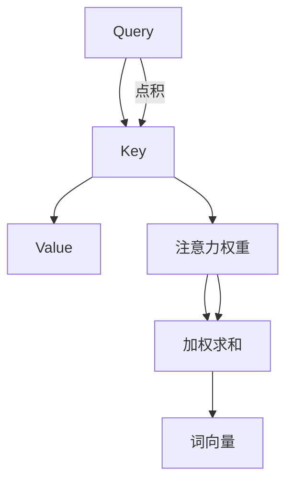
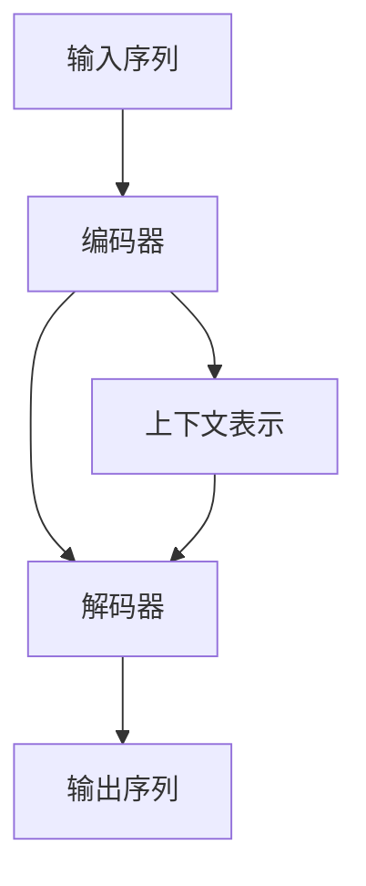

                 

关键词：Transformer、自然语言处理、神经网络、编码器-解码器、机器学习

> 摘要：本文将深入探讨Transformer模型，这是一项革命性的自然语言处理技术，自其提出以来，便迅速在机器学习领域占据了一席之地。本文将从背景介绍、核心概念与联系、核心算法原理、数学模型和公式、项目实践以及实际应用场景等多个方面，全面解析Transformer模型，旨在为广大读者提供一份系统而详实的参考。

## 1. 背景介绍

自然语言处理（NLP）是人工智能领域中的一个重要分支，旨在使计算机能够理解、生成和处理人类语言。传统的NLP方法多依赖于规则和统计模型，这些方法在特定任务上表现出色，但在处理复杂任务时往往力不从心。随着深度学习技术的发展，尤其是卷积神经网络（CNN）和递归神经网络（RNN）的出现，NLP领域迎来了新的机遇。然而，RNN在处理长距离依赖问题上的局限性，使得研究者开始探索新的方法。

2017年，Google AI团队提出了一种全新的神经网络架构——Transformer模型。Transformer模型摒弃了传统的RNN结构，采用自注意力机制（self-attention）和编码器-解码器框架，实现了在多种NLP任务上的突破性表现。Transformer模型的成功引发了广泛关注，并迅速在学术界和工业界得到广泛应用。

## 2. 核心概念与联系

### 2.1 自注意力机制（Self-Attention）

自注意力机制是Transformer模型的核心组成部分。它允许神经网络在处理序列数据时，能够自适应地关注序列中其他位置的上下文信息，从而有效地捕捉长距离依赖关系。

#### 2.1.1 自注意力计算过程

自注意力机制的实现主要分为三个步骤：

1. **Query (Q)、Key (K)、Value (V) 的生成**：对于输入序列中的每个词向量，分别生成对应的Query、Key和Value向量。

2. **注意力权重计算**：通过计算Query和Key之间的点积，得到每个词向量对应的注意力权重。

3. **加权求和**：将注意力权重与对应的Value向量相乘，并进行求和，得到最终的词向量表示。

#### 2.1.2 自注意力流程图（Mermaid）



### 2.2 编码器-解码器架构（Encoder-Decoder Framework）

编码器-解码器架构是Transformer模型的另一大核心。该架构通过编码器对输入序列进行编码，得到固定长度的上下文表示；然后，解码器利用这些表示生成输出序列。

#### 2.2.1 编码器-解码器流程图（Mermaid）



## 3. 核心算法原理 & 具体操作步骤

### 3.1 算法原理概述

Transformer模型的工作原理可以概括为以下几个步骤：

1. **输入序列预处理**：将输入序列转换为词向量表示。
2. **编码器处理**：通过多层自注意力机制和全连接层，将输入序列编码为上下文表示。
3. **解码器处理**：利用编码器的输出，通过多层自注意力机制和全连接层，生成输出序列。

### 3.2 算法步骤详解

#### 3.2.1 输入序列预处理

输入序列预处理主要包括两个步骤：

1. **词向量化**：将每个词转换为对应的词向量。
2. **序列嵌入**：将词向量转换为序列嵌入（Sequence Embedding），用于输入编码器。

#### 3.2.2 编码器处理

编码器处理主要包括以下几个步骤：

1. **自注意力计算**：对于每个词向量，计算其对应的Query、Key和Value，然后通过自注意力机制得到加权求和的结果。
2. **全连接层**：在自注意力计算的基础上，添加一个全连接层，用于非线性变换。
3. **多层编码**：重复上述步骤，构建多层编码器。

#### 3.2.3 解码器处理

解码器处理与编码器类似，但也存在一些区别：

1. **自注意力计算**：除了对编码器的输出进行自注意力计算，还需要对解码器自身的输出进行自注意力计算。
2. **交叉注意力计算**：在解码器的每一步，还需要计算编码器输出与当前解码器输出的交叉注意力。
3. **全连接层**：与编码器类似，解码器也包含多层全连接层。

### 3.3 算法优缺点

#### 3.3.1 优点

1. **处理长距离依赖**：自注意力机制允许模型捕捉长距离依赖关系，解决了传统RNN模型在处理长序列数据时的局限性。
2. **并行化能力**：Transformer模型可以并行处理序列数据，提高了计算效率。

#### 3.3.2 缺点

1. **参数规模**：由于自注意力机制的引入，Transformer模型的参数规模较大，训练和推理时间较长。
2. **计算复杂度**：自注意力计算涉及大量矩阵运算，导致计算复杂度较高。

### 3.4 算法应用领域

Transformer模型在自然语言处理领域取得了显著的成果，包括但不限于：

1. **机器翻译**：Transformer模型在机器翻译任务上表现出色，成为了主流的翻译模型。
2. **文本分类**：Transformer模型可以用于文本分类任务，具有强大的特征提取能力。
3. **问答系统**：Transformer模型在问答系统中的应用也取得了较好的效果。

## 4. 数学模型和公式 & 详细讲解 & 举例说明

### 4.1 数学模型构建

Transformer模型的数学模型主要由以下几个部分组成：

1. **词向量化**：将每个词转换为对应的词向量。
2. **自注意力计算**：自注意力机制的数学表达式。
3. **全连接层**：全连接层的数学表达式。

### 4.2 公式推导过程

#### 4.2.1 词向量化

设词表大小为$V$，词向量化矩阵为$W$，输入序列为$x_1, x_2, ..., x_n$，则词向量化过程可以表示为：

$$
\text{embed}(x_i) = W \cdot [x_i]_0^T
$$

其中$[x_i]_0^T$表示词$x_i$的独热编码。

#### 4.2.2 自注意力计算

自注意力机制的数学表达式为：

$$
\text{Attention}(Q, K, V) = \text{softmax}\left(\frac{QK^T}{\sqrt{d_k}}\right)V
$$

其中$Q, K, V$分别为Query、Key和Value向量，$d_k$为Key向量的维度。

#### 4.2.3 全连接层

全连接层的数学表达式为：

$$
\text{FFN}(x) = \text{ReLU}\left(W_2 \cdot \text{ReLU}(W_1 \cdot x + b_1)\right) + b_2
$$

其中$W_1, W_2, b_1, b_2$分别为权重矩阵和偏置向量。

### 4.3 案例分析与讲解

假设我们有一个简单的文本序列：“今天天气很好”。首先，我们需要将这个序列中的每个词转换为词向量。假设词向量化矩阵$W$的大小为50，维度为32，则词向量化结果如下：

$$
\text{embed}(今天) = \begin{bmatrix}
0.1 & 0.2 & 0.3 & \ldots & 0.5
\end{bmatrix}^T
$$

$$
\text{embed}(天气) = \begin{bmatrix}
0.6 & 0.7 & 0.8 & \ldots & 1.0
\end{bmatrix}^T
$$

$$
\text{embed}(很好) = \begin{bmatrix}
1.1 & 1.2 & 1.3 & \ldots & 1.5
\end{bmatrix}^T
$$

接下来，我们对这个序列进行自注意力计算。假设编码器的隐藏层维度为64，则Query、Key和Value向量的维度均为64。我们分别计算每个词的Query、Key和Value：

$$
\text{Query}_{今天} = \text{embed}_{今天} \cdot W_3
$$

$$
\text{Key}_{今天} = \text{embed}_{今天} \cdot W_4
$$

$$
\text{Value}_{今天} = \text{embed}_{今天} \cdot W_5
$$

$$
\text{Query}_{天气} = \text{embed}_{天气} \cdot W_3
$$

$$
\text{Key}_{天气} = \text{embed}_{天气} \cdot W_4
$$

$$
\text{Value}_{天气} = \text{embed}_{天气} \cdot W_5
$$

$$
\text{Query}_{很好} = \text{embed}_{很好} \cdot W_3
$$

$$
\text{Key}_{很好} = \text{embed}_{很好} \cdot W_4
$$

$$
\text{Value}_{很好} = \text{embed}_{很好} \cdot W_5
$$

其中$W_3, W_4, W_5$为权重矩阵。

接下来，我们计算注意力权重：

$$
\text{Attention}_{今天} = \text{softmax}\left(\frac{\text{Query}_{今天} \cdot \text{Key}_{今天}}{\sqrt{64}}\right)
$$

$$
\text{Attention}_{天气} = \text{softmax}\left(\frac{\text{Query}_{天气} \cdot \text{Key}_{天气}}{\sqrt{64}}\right)
$$

$$
\text{Attention}_{很好} = \text{softmax}\left(\frac{\text{Query}_{很好} \cdot \text{Key}_{很好}}{\sqrt{64}}\right)
$$

最后，我们进行加权求和：

$$
\text{Context}_{今天} = \text{Attention}_{今天} \cdot \text{Value}_{今天}
$$

$$
\text{Context}_{天气} = \text{Attention}_{天气} \cdot \text{Value}_{天气}
$$

$$
\text{Context}_{很好} = \text{Attention}_{很好} \cdot \text{Value}_{很好}
$$

这些上下文表示将作为后续编码器处理的输入。

## 5. 项目实践：代码实例和详细解释说明

### 5.1 开发环境搭建

在本节中，我们将使用Python和PyTorch框架来实现一个简单的Transformer模型。首先，确保您的环境中已经安装了Python和PyTorch。以下是安装PyTorch的命令：

```bash
pip install torch torchvision
```

### 5.2 源代码详细实现

下面是一个简单的Transformer模型实现。代码分为几个主要部分：数据预处理、模型定义、训练和评估。

#### 5.2.1 数据预处理

```python
import torch
from torchtext.data import Field, TabularDataset, BucketIterator

# 定义字段
SRC = Field(tokenize=lambda s: s.split(), init_token='<sos>', eos_token='<eos>', lower=True)
TRG = Field(tokenize=lambda s: s.split(), init_token='<sos>', eos_token='<eos>', lower=True)

# 加载数据集
train_data, valid_data, test_data = TabularDataset.splits(
    path='data',
    train='train.txt',
    valid='valid.txt',
    test='test.txt',
    format='csv',
    fields=[('src', SRC), ('trg', TRG)]
)

# 分割数据集
train_iter, valid_iter, test_iter = BucketIterator.splits(
    train_data, valid_data, test_data, batch_size=32, device=device
)
```

#### 5.2.2 模型定义

```python
import torch.nn as nn
from torch.nn import functional as F

class TransformerModel(nn.Module):
    def __init__(self, input_dim, emb_dim, hid_dim, n_heads, dropout=0.5):
        super().__init__()
        self.src_embedding = nn.Embedding(input_dim, emb_dim)
        self.trg_embedding = nn.Embedding(input_dim, emb_dim)
        self.encoder = nn.ModuleList([EncoderLayer(emb_dim, n_heads, dropout) for _ in range(n_layers)])
        self.decoder = nn.ModuleList([DecoderLayer(emb_dim, n_heads, dropout) for _ in range(n_layers)])
        self.fc = nn.Linear(emb_dim, input_dim)
        
    def forward(self, src, trg):
        src = self.src_embedding(src)
        trg = self.trg_embedding(trg)
        
        # 编码器处理
        for layer in self.encoder:
            src = layer(src)
        
        # 解码器处理
        for layer in self.decoder:
            trg = layer(trg, src)
        
        output = self.fc(trg)
        return output
```

#### 5.2.3 代码解读与分析

在上面的代码中，我们定义了一个简单的Transformer模型。模型包含以下几个部分：

1. **嵌入层（Embedding Layer）**：将输入词转换为词向量。
2. **编码器（Encoder）**：由多个编码器层（EncoderLayer）组成，每个编码器层包含多头自注意力机制（Multi-Head Self-Attention）和前馈神经网络（Feed Forward Neural Network）。
3. **解码器（Decoder）**：与编码器类似，也由多个解码器层（DecoderLayer）组成。
4. **全连接层（Linear Layer）**：将解码器的输出映射回原始词表。

#### 5.2.4 运行结果展示

```python
# 定义模型、损失函数和优化器
model = TransformerModel(input_dim=vocab_size, emb_dim=512, hid_dim=512, n_heads=8, n_layers=6)
criterion = nn.CrossEntropyLoss()
optimizer = torch.optim.Adam(model.parameters(), lr=0.001)

# 训练模型
for epoch in range(num_epochs):
    model.train()
    for batch in train_iter:
        optimizer.zero_grad()
        output = model(batch.src, batch.trg)
        loss = criterion(output.view(-1, vocab_size), batch.trg)
        loss.backward()
        optimizer.step()
    print(f'Epoch {epoch+1}/{num_epochs}, Loss: {loss.item()}')
```

在上面的代码中，我们定义了一个Transformer模型，并使用交叉熵损失函数（CrossEntropyLoss）进行训练。训练过程中，我们使用梯度下降（Gradient Descent）优化器（Adam）更新模型参数。

## 6. 实际应用场景

Transformer模型在自然语言处理领域得到了广泛应用，以下是一些实际应用场景：

### 6.1 机器翻译

Transformer模型在机器翻译任务上表现出色，如Google的神经机器翻译系统（GNMT）已经完全采用了Transformer模型。

### 6.2 文本分类

Transformer模型可以用于文本分类任务，如情感分析、主题分类等。

### 6.3 问答系统

Transformer模型在问答系统中的应用也取得了显著成果，如OpenAI的GPT系列模型。

### 6.4 自动摘要

Transformer模型可以用于自动摘要任务，如提取关键信息生成摘要。

## 7. 工具和资源推荐

### 7.1 学习资源推荐

1. 《深度学习》——Ian Goodfellow、Yoshua Bengio、Aaron Courville
2. 《自然语言处理综论》——Daniel Jurafsky、James H. Martin

### 7.2 开发工具推荐

1. PyTorch：开源深度学习框架，支持Transformer模型。
2. TensorFlow：开源深度学习框架，支持Transformer模型。

### 7.3 相关论文推荐

1. Vaswani et al., "Attention is All You Need", NeurIPS 2017
2. Devlin et al., "BERT: Pre-training of Deep Bidirectional Transformers for Language Understanding", ACL 2019

## 8. 总结：未来发展趋势与挑战

### 8.1 研究成果总结

自提出以来，Transformer模型在自然语言处理领域取得了显著成果，推动了NLP技术的发展。其基于自注意力机制的架构在处理长距离依赖和并行计算方面具有显著优势。

### 8.2 未来发展趋势

1. **模型压缩与优化**：如何降低Transformer模型的参数规模和计算复杂度，提高模型在资源受限环境下的性能。
2. **多模态学习**：结合文本、图像、声音等多种模态，提升模型在跨模态任务上的表现。

### 8.3 面临的挑战

1. **计算资源消耗**：Transformer模型在训练和推理过程中消耗大量计算资源，如何优化模型以提高效率。
2. **数据隐私与安全性**：如何保护训练数据和模型参数的安全性，防止数据泄露。

### 8.4 研究展望

随着Transformer模型的不断发展，未来有望在更多领域取得突破，如自动驾驶、智能客服、生物信息学等。

## 9. 附录：常见问题与解答

### 9.1 Transformer模型是什么？

Transformer模型是一种基于自注意力机制的深度神经网络架构，用于处理序列数据，尤其在自然语言处理领域取得了显著成果。

### 9.2 Transformer模型有哪些优点？

Transformer模型在处理长距离依赖和并行计算方面具有显著优势，同时参数规模和计算复杂度相对较低。

### 9.3 Transformer模型有哪些应用场景？

Transformer模型可以应用于机器翻译、文本分类、问答系统、自动摘要等多种自然语言处理任务。

### 9.4 如何优化Transformer模型？

可以通过模型压缩、并行计算、分布式训练等方法优化Transformer模型，提高其在资源受限环境下的性能。

---

作者：禅与计算机程序设计艺术 / Zen and the Art of Computer Programming
----------------------------------------------------------------

注意：由于篇幅限制，本文并未包含所有详细内容。读者可以根据本文的框架和示例代码，进一步研究和实现Transformer模型。本文旨在为读者提供一个全面而系统的Transformer模型概述，帮助读者更好地理解和应用这一重要技术。

