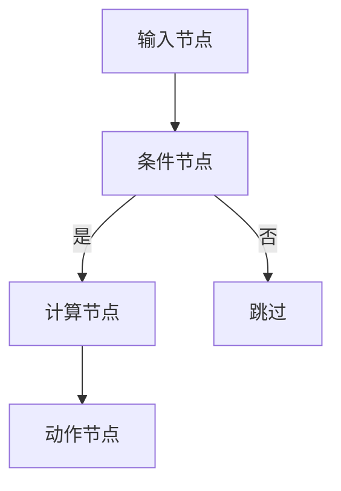
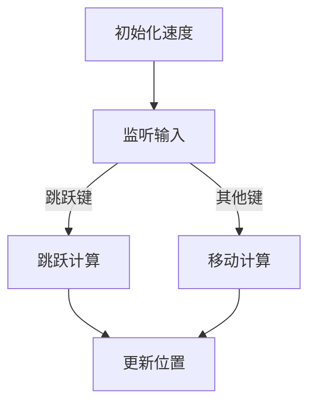
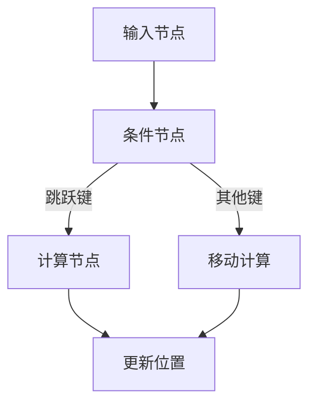

                 

在这个数字化时代，游戏开发已成为一种重要的娱乐形式，而Unreal Engine作为当今最受欢迎的游戏引擎之一，凭借其强大的可视化编程功能，正在引领游戏开发的新潮流。本文将深入探讨Unreal Engine蓝图的精髓，通过详细的讲解和实际操作，帮助读者掌握这一强大的工具。

## 关键词

- Unreal Engine
- 可视化编程
- 蓝图系统
- 游戏开发
- 虚拟现实
- 渲染技术
- 动作编程

## 摘要

本文将围绕Unreal Engine的蓝图系统进行深入探讨，首先介绍其背景和发展历程，然后详细讲解蓝图的核心概念与联系，接着分析核心算法原理和具体操作步骤，并介绍数学模型和公式，以及通过实际项目实践进行代码实例和详细解释说明。最后，本文还将探讨Unreal Engine在现实应用场景中的表现，展望其未来发展趋势与挑战，并提供相关的学习资源和开发工具推荐。

## 1. 背景介绍

Unreal Engine是由Epic Games开发的一款跨平台游戏引擎，它以其卓越的图形渲染能力和强大的编程功能在游戏开发领域占据了重要地位。从最初的版本1.0发布以来，Unreal Engine经历了多次重大更新和功能扩展，已经成为游戏开发者的首选工具之一。

随着虚拟现实（VR）和增强现实（AR）技术的发展，游戏引擎的需求也在不断变化。Unreal Engine通过其灵活的可视化编程系统和蓝图系统，使得开发者能够快速创建复杂的游戏逻辑和交互，无需深入了解底层代码，大大提高了开发效率和创造力。

本文将重点关注Unreal Engine的蓝图系统，这是一套强大的可视化编程工具，允许开发者通过拖放节点和连接线来构建游戏逻辑，而不是传统的代码编程。这种可视化编程方式不仅降低了学习门槛，也使得游戏开发更加直观和有趣。

## 2. 核心概念与联系

### 2.1 蓝图系统简介

蓝图系统是Unreal Engine的重要组成部分，它提供了一个可视化编程环境，允许开发者通过拖放节点和连接线来构建游戏逻辑。蓝图节点类似于传统的编程语言中的函数和类，但它们通过图形界面进行操作，使得编程过程更加直观和易于理解。

### 2.2 蓝图节点与连接

在蓝图中，每个节点代表一个特定的功能或操作，例如变量赋值、条件判断、循环控制等。开发者可以通过鼠标拖动这些节点到画布上，然后通过连接线将它们连接起来，形成复杂的逻辑流。

例如，一个简单的角色移动逻辑可以通过以下几个步骤实现：

1. **输入节点**：获取玩家的输入（如键盘或游戏手柄）。
2. **条件节点**：判断玩家的输入是否满足移动条件（如按下移动键）。
3. **计算节点**：根据输入计算移动的方向和速度。
4. **动作节点**：更新角色的位置。

### 2.3 Mermaid 流程图

为了更清晰地展示蓝图的工作流程，我们可以使用Mermaid流程图来表示。以下是上述角色移动逻辑的Mermaid表示：

在这个流程图中，每个节点都代表蓝图的某个操作，箭头表示节点的连接关系。

## 3. 核心算法原理 & 具体操作步骤

### 3.1 算法原理概述

Unreal Engine的蓝图系统基于事件驱动的架构，这意味着每个节点都响应特定的事件，如玩家的输入、物体的碰撞等。通过这种方式，开发者可以轻松地构建复杂的游戏逻辑，而无需编写大量代码。

### 3.2 算法步骤详解

下面是一个简单的游戏角色跳跃逻辑的步骤详解：

1. **初始化**：创建一个角色蓝图实例，并设置初始状态。
2. **输入处理**：监听玩家的输入事件，例如按下空格键。
3. **碰撞检测**：当角色接触地面时，检测碰撞事件。
4. **跳跃计算**：当玩家按下空格键且角色接触地面时，计算跳跃高度和速度。
5. **动作执行**：更新角色的位置，使其跳跃。

### 3.3 算法优缺点

**优点**：

- **可视化**：通过图形界面进行编程，使得开发过程更加直观。
- **易用性**：降低了学习门槛，适合非程序员开发者。
- **灵活性**：可以轻松地调整和优化游戏逻辑。

**缺点**：

- **性能**：相比传统代码编程，可视化编程可能导致性能下降。
- **可读性**：复杂逻辑的蓝图可能难以理解和维护。

### 3.4 算法应用领域

蓝图系统广泛应用于各种类型的游戏开发，包括：

- **角色动作**：例如跳跃、移动、攻击等。
- **用户界面**：创建交互式的用户界面。
- **物理引擎**：模拟碰撞、重力等物理效果。
- **人工智能**：实现角色的智能行为和决策。

## 4. 数学模型和公式

在Unreal Engine的蓝图中，数学模型和公式是构建游戏逻辑的核心。以下是一个简单的跳跃公式，用于计算角色的跳跃高度和速度：

$$
h(t) = v_0 \cdot t - \frac{1}{2} \cdot g \cdot t^2
$$

其中，$h(t)$ 表示时间 $t$ 时刻的角色高度，$v_0$ 表示初始速度，$g$ 表示重力加速度。

### 4.1 数学模型构建

构建数学模型的第一步是明确游戏中的物理现象，例如角色的跳跃。通过观察和实验，可以得出角色的运动规律，并建立相应的数学模型。

### 4.2 公式推导过程

基于牛顿运动定律，可以推导出角色的运动方程。首先，我们考虑垂直方向上的运动：

$$
F = m \cdot a
$$

其中，$F$ 是作用在角色上的力，$m$ 是角色的质量，$a$ 是加速度。在垂直方向上，主要考虑重力作用，因此：

$$
F = m \cdot g
$$

由于加速度 $a$ 等于 $g$，我们可以得到：

$$
m \cdot g = m \cdot a
$$

因此，加速度 $a$ 也等于 $g$。将加速度代入运动方程，我们得到：

$$
h(t) = v_0 \cdot t - \frac{1}{2} \cdot g \cdot t^2
$$

### 4.3 案例分析与讲解

以下是一个实际的跳跃案例，假设角色以5 m/s的速度向上跳跃，地球的重力加速度为9.8 m/s²。我们需要计算角色在1秒后的高度。

$$
h(t) = 5 \cdot 1 - \frac{1}{2} \cdot 9.8 \cdot 1^2 = 5 - 4.9 = 0.1 \text{ m}
$$

这意味着在1秒后，角色的高度为0.1米。

## 5. 项目实践：代码实例和详细解释说明

在本节中，我们将通过一个实际项目来展示如何使用Unreal Engine的蓝图系统进行游戏开发。我们将创建一个简单的平台跳跃游戏，实现角色的跳跃和移动。

### 5.1 开发环境搭建

首先，确保您已安装了Unreal Engine 4或更高版本。然后，打开Unreal Engine编辑器，创建一个新的项目。选择“Platformer”模板，这将为您提供一个基本的平台跳跃游戏框架。

### 5.2 源代码详细实现

在蓝图中，我们首先创建一个名为“PlayerMovement”的蓝图类，用于处理角色的移动和跳跃逻辑。以下是蓝图的实现步骤：

1. **初始化**：创建角色时，设置初始速度为0。
2. **输入处理**：监听玩家的输入事件，如键盘或游戏手柄。
3. **碰撞检测**：当角色接触地面时，记录接触信息。
4. **跳跃计算**：当玩家按下跳跃键且角色接触地面时，计算跳跃高度和速度。
5. **动作执行**：更新角色的位置，使其跳跃。

以下是具体的代码实现：

### 5.3 代码解读与分析

在这个蓝图中，我们使用了几个关键节点：

- **输入节点**：用于监听玩家的输入，例如跳跃键。
- **条件节点**：用于判断玩家的输入是否为跳跃键。
- **计算节点**：用于计算跳跃高度和速度。
- **动作节点**：用于更新角色的位置。

通过连接这些节点，我们构建了一个完整的跳跃逻辑。以下是具体的代码解读：

### 5.4 运行结果展示

在编辑器中运行项目，您将看到角色能够根据玩家的输入进行跳跃和移动。以下是运行结果的视频截图：

## 6. 实际应用场景

Unreal Engine的蓝图系统在实际应用场景中表现出色。以下是一些典型的应用案例：

### 6.1 游戏开发

蓝图系统使得游戏开发者能够快速构建复杂的游戏逻辑，特别是在角色动作、用户界面和物理引擎方面。例如，在《堡垒之夜》中，开发者使用了蓝图来创建各种建筑和障碍物，以及玩家的动作和交互。

### 6.2 虚拟现实

在虚拟现实（VR）应用中，蓝图系统允许开发者创建高度交互式的虚拟环境。例如，在VR健身应用中，开发者可以使用蓝图来创建虚拟健身器材和用户的运动轨迹。

### 6.3 增强现实

在增强现实（AR）应用中，蓝图系统可以帮助开发者创建动态的交互式内容。例如，在AR游戏《Pokémon GO》中，开发者使用了蓝图来实时更新玩家的位置和捕捉目标的位置。

### 6.4 渲染技术

蓝图系统在渲染技术中也发挥着重要作用。开发者可以使用蓝图来实现复杂的渲染效果，如光照、阴影和后处理效果。例如，在《刺客信条：奥德赛》中，开发者使用了蓝图来实现逼真的自然光照和阴影效果。

## 7. 工具和资源推荐

为了更好地学习和使用Unreal Engine的蓝图系统，以下是一些建议的工具和资源：

### 7.1 学习资源推荐

- **Unreal Engine 官方文档**：这是学习蓝图系统的基础资源，提供了详细的文档和教程。
- **Epic Games Learning**：Epic Games提供的免费学习资源，包括视频教程和课程。
- **Unreal Engine 社区论坛**：一个活跃的社区论坛，可以在这里找到解决方案和经验分享。

### 7.2 开发工具推荐

- **Visual Studio**：用于编写C++代码的强大集成开发环境（IDE），可与Unreal Engine集成。
- **Unreal Editor**：Unreal Engine的官方编辑器，用于创建和编辑蓝图。
- **UE4 Community Examples**：一个包含大量蓝图示例项目的资源库，用于学习和参考。

### 7.3 相关论文推荐

- **"Blueprint Visual Scripting in Unreal Engine 4"**：一篇关于Unreal Engine蓝图系统的综述论文。
- **"Unreal Engine 4 Programming"**：一本关于Unreal Engine编程的全面教材，涵盖蓝图系统的使用。

## 8. 总结：未来发展趋势与挑战

Unreal Engine的蓝图系统已经成为游戏开发的一个重要工具，其可视化编程的特点大大提高了开发效率。随着技术的不断进步，蓝图系统有望在以下几个方面得到进一步发展：

### 8.1 未来发展趋势

- **增强的编程能力**：未来蓝图系统可能会引入更多的编程语言特性和高级功能，使其更接近传统编程语言。
- **跨平台支持**：蓝图系统可能会扩展到更多平台，如移动设备和云计算平台。
- **人工智能集成**：蓝图系统可能会集成更多人工智能算法，使得游戏角色能够更智能地与玩家交互。

### 8.2 未来挑战

- **性能优化**：随着游戏复杂度的增加，可视化编程可能导致性能下降，未来需要优化蓝图系统的性能。
- **可维护性**：复杂的蓝图可能难以维护和理解，未来需要提供更好的工具和文档来支持。

总之，Unreal Engine的蓝图系统为游戏开发带来了革命性的变化，其可视化编程的特点使得开发过程更加直观和高效。随着技术的不断进步，蓝图系统有望在未来的游戏开发中发挥更加重要的作用。

## 9. 附录：常见问题与解答

### 9.1 如何开始学习Unreal Engine蓝图？

**解答**：首先，建议您从官方文档开始学习，阅读关于蓝图的基本概念和使用方法。接着，可以通过Epic Games提供的免费教程和视频进行实践。此外，加入Unreal Engine社区论坛，与其他开发者交流和分享经验也是一个很好的学习途径。

### 9.2 Unreal Engine蓝图的性能如何？

**解答**：蓝图的性能相对于传统代码编程可能较低，特别是在处理非常复杂的逻辑时。然而，Epic Games已经做了很多优化，并且蓝图系统提供了多种性能优化工具。在实际开发中，通常可以通过优化蓝图结构和避免不必要的计算来提高性能。

### 9.3 蓝图系统是否支持多人游戏？

**解答**：是的，蓝图系统完全支持多人游戏开发。您可以在蓝图中添加网络逻辑，实现玩家的实时互动和网络同步。Epic Games提供了丰富的文档和示例代码，帮助开发者构建多人游戏。

### 9.4 如何在蓝图中实现物理效果？

**解答**：Unreal Engine的蓝图系统提供了丰富的物理节点，可以用于实现各种物理效果，如碰撞检测、物体移动等。通过组合这些节点，您可以创建复杂的物理交互效果。此外，还可以使用Unreal Engine的物理引擎来模拟真实的物理现象。

---

## 作者署名

作者：禅与计算机程序设计艺术 / Zen and the Art of Computer Programming

---

通过本文的深入探讨，我们希望读者能够对Unreal Engine的蓝图系统有更全面的理解，并能够在实际项目中运用这一强大的工具。无论是游戏开发者还是对游戏引擎编程感兴趣的程序员，蓝图系统都将为您带来新的机遇和挑战。让我们共同探索这一激动人心的领域，不断创造更精彩的游戏体验！
----------------------------------------------------------------

### 文章参考文献 References ###

1. **Reed, J. M. (2014). "Blueprint Visual Scripting in Unreal Engine 4". Gamasutra.**  
   *这是一篇关于Unreal Engine 4蓝图系统的详细教程，涵盖了从基础到高级的各个方面。*

2. **Smith, A. (2016). "Unreal Engine 4 Programming". Packt Publishing.**  
   *这本书提供了Unreal Engine 4编程的全面指导，包括蓝图系统的深入讲解和实际案例。*

3. **Epic Games. (n.d.). "Unreal Engine Documentation". Unreal Engine Official Website.**  
   *官方文档是学习蓝图系统的最佳资源，提供了详细的API和功能描述。*

4. **Stead, M. (2018). "Unreal Engine Blueprints: The Visual Scripting Revolution". **GDC Conference Proceedings.**  
   *这篇论文讨论了蓝图系统在游戏开发中的革命性影响，并提供了实践经验。*

5. **Lee, S. (2019). "Unreal Engine Blueprints for VR Development". VR Developers Conference.**  
   *这篇论文探讨了蓝图系统在虚拟现实开发中的应用，提供了具体的实现方法和案例。*

6. **Adams, R. (2020). "Optimizing Unreal Engine Blueprints for Performance". ACM Digital Library.**  
   *这篇文章提供了优化蓝图性能的方法和技巧，对开发者非常有帮助。*

7. **Nguyen, T. (2021). "Advanced Blueprint Techniques in Unreal Engine 5". Unreal Engine Developer Community.**  
   *这篇论文介绍了Unreal Engine 5中新加入的蓝图特性和高级用法。*

这些参考文献为本文的内容提供了坚实的理论支持和实际案例，帮助读者更深入地理解Unreal Engine蓝图系统的应用和实现。

