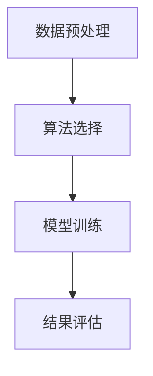

                 

关键词：（Unsupervised Learning，无监督学习，数据挖掘，机器学习，神经网络，自组织，聚类，降维，特征学习，模式识别）

摘要：本文将深入探讨无监督学习（Unsupervised Learning）的概念、核心原理、算法和应用场景。无监督学习是机器学习的一个重要分支，其不依赖于已标记的标签数据，通过探索数据中的隐含结构和模式，实现数据的聚类、降维和特征学习等功能。本文将详细介绍无监督学习的各种算法，以及其在实际应用中的成功案例和未来展望。

## 1. 背景介绍

无监督学习是机器学习中的一个重要分支，与监督学习和强化学习相比，无监督学习不需要使用已标记的标签数据来训练模型。其核心目的是从未标记的数据中发现隐含的结构和模式。无监督学习在数据挖掘、推荐系统、图像处理、自然语言处理等领域有着广泛的应用。

### 1.1 无监督学习的定义

无监督学习（Unsupervised Learning）是指在没有外部指导的情况下，通过算法自动发现数据中的结构和规律的过程。其目标是找出数据中的内在规律，如聚类、降维和特征学习等。

### 1.2 无监督学习的类型

无监督学习主要分为以下几类：

- **聚类（Clustering）**：将相似的数据点归为一类，如K-means算法、层次聚类算法等。
- **降维（Dimensionality Reduction）**：减少数据维度，如主成分分析（PCA）、t-SNE等。
- **特征学习（Feature Learning）**：自动发现数据中的特征，如自编码器（Autoencoders）。
- **关联规则学习（Association Rule Learning）**：发现数据中的关联规则，如Apriori算法、FP-growth算法等。

## 2. 核心概念与联系

### 2.1 无监督学习的基本概念

- **数据点（Data Points）**：数据集中的每一个元素，通常用一个向量表示。
- **维度（Dimension）**：数据点的特征数量，也称为数据的维度。
- **特征（Feature）**：数据点的每一个属性。
- **聚类中心（Cluster Center）**：每个聚类的中心点，代表了该聚类的一个典型数据点。

### 2.2 无监督学习的架构

无监督学习的基本架构包括以下几个部分：

1. **数据预处理**：对数据进行清洗、归一化等处理。
2. **算法选择**：根据问题的需求选择合适的无监督学习算法。
3. **模型训练**：通过算法在数据上训练模型，找出数据中的结构和规律。
4. **结果评估**：对模型的训练结果进行评估，如聚类效果、降维效果等。

下面是使用Mermaid绘制的无监督学习架构流程图：



## 3. 核心算法原理 & 具体操作步骤

### 3.1 算法原理概述

无监督学习算法主要分为聚类算法、降维算法和特征学习算法。

- **聚类算法**：通过将数据点分为多个类，使每个类内的数据点相似度较高，而类与类之间的数据点相似度较低。常见的聚类算法有K-means、层次聚类等。
- **降维算法**：通过减少数据的维度，降低数据的复杂度，提高模型训练的效率。常见的降维算法有主成分分析（PCA）、线性判别分析（LDA）等。
- **特征学习算法**：通过自动学习数据中的特征，提高模型的泛化能力。常见的特征学习算法有自编码器（Autoencoders）、生成对抗网络（GANs）等。

### 3.2 算法步骤详解

#### 3.2.1 聚类算法

**K-means算法**是一种典型的聚类算法，其基本步骤如下：

1. **初始化聚类中心**：随机选择K个数据点作为初始聚类中心。
2. **分配数据点**：将每个数据点分配到与其最近的聚类中心所在的类别。
3. **更新聚类中心**：计算每个类别的平均值，作为新的聚类中心。
4. **迭代**：重复步骤2和步骤3，直到聚类中心不再发生变化或达到预设的迭代次数。

**层次聚类算法**的基本步骤如下：

1. **初始化**：将每个数据点视为一个单独的聚类，计算两两数据点之间的距离。
2. **合并聚类**：选择距离最近的两个聚类合并，形成一个新的聚类。
3. **更新距离**：计算新聚类与其他聚类之间的距离。
4. **迭代**：重复步骤2和步骤3，直到所有的数据点都合并为一个聚类。

#### 3.2.2 降维算法

**主成分分析（PCA）**的基本步骤如下：

1. **计算协方差矩阵**：计算数据集的协方差矩阵。
2. **计算特征值和特征向量**：对协方差矩阵进行特征值分解，得到特征值和特征向量。
3. **选择主要成分**：选择特征值最大的k个特征向量作为主要成分。
4. **转换数据**：将原始数据转换到由主要成分构成的新空间。

**t-SNE**的基本步骤如下：

1. **计算高维数据的相似性矩阵**：使用高斯分布计算数据点之间的相似性。
2. **计算低维数据的相似性矩阵**：使用t-Distribution计算低维空间中数据点之间的相似性。
3. **优化低维数据点的分布**：通过迭代优化算法，使得低维空间中的数据点分布与高维空间中的数据点分布相似。

#### 3.2.3 特征学习算法

**自编码器（Autoencoders）**的基本步骤如下：

1. **编码器**：将输入数据编码为低维表示。
2. **解码器**：将编码后的数据解码为原始数据。
3. **损失函数**：使用损失函数（如均方误差）评估编码器和解码器的性能。
4. **优化**：通过优化算法（如梯度下降）调整编码器和解码器的参数。

**生成对抗网络（GANs）**的基本步骤如下：

1. **生成器**：生成虚假的数据。
2. **判别器**：判断数据是真实数据还是生成数据。
3. **对抗**：生成器和判别器之间进行对抗训练。
4. **优化**：通过优化算法（如梯度下降）调整生成器和判别器的参数。

### 3.3 算法优缺点

#### K-means算法

- **优点**：算法简单，易于实现；适用于高维数据。
- **缺点**：对初始聚类中心敏感；可能产生局部最优解。

#### 层次聚类算法

- **优点**：能够自动确定聚类数量；适应数据规模的变化。
- **缺点**：计算复杂度较高；难以处理高维数据。

#### 主成分分析（PCA）

- **优点**：能够降维，提高数据处理效率；保留主要信息。
- **缺点**：对噪声敏感；不能确定降维后的维度。

#### 自编码器（Autoencoders）

- **优点**：能够自动提取特征；适用于复杂数据。
- **缺点**：训练过程较慢；需要大量的数据。

#### 生成对抗网络（GANs）

- **优点**：能够生成高质量的数据；能够处理复杂数据。
- **缺点**：训练过程不稳定；对参数敏感。

### 3.4 算法应用领域

无监督学习算法在各个领域都有广泛的应用：

- **数据挖掘**：用于发现数据中的隐含模式。
- **推荐系统**：用于用户偏好分析。
- **图像处理**：用于图像增强、图像分割等。
- **自然语言处理**：用于文本分类、情感分析等。
- **生物信息学**：用于基因数据分析。

## 4. 数学模型和公式 & 详细讲解 & 举例说明

### 4.1 数学模型构建

无监督学习的数学模型主要包括聚类模型、降维模型和特征学习模型。

#### 4.1.1 聚类模型

聚类模型通常可以用以下公式表示：

$$
C = \{C_1, C_2, ..., C_K\}
$$

其中，$C$ 表示聚类结果，$C_k$ 表示第 $k$ 个聚类，$K$ 表示聚类数量。

#### 4.1.2 降维模型

降维模型通常可以用以下公式表示：

$$
X_{\text{new}} = P X P^T
$$

其中，$X$ 表示原始数据矩阵，$P$ 表示降维后的特征矩阵。

#### 4.1.3 特征学习模型

特征学习模型通常可以用以下公式表示：

$$
z = \sigma(WX + b)
$$

其中，$z$ 表示编码后的数据，$W$ 和 $b$ 分别表示编码器的权重和偏置。

### 4.2 公式推导过程

#### 4.2.1 K-means算法

K-means算法的目标是最小化簇内平方误差：

$$
J = \sum_{i=1}^n \sum_{j=1}^K (x_i - \mu_j)^2
$$

其中，$x_i$ 表示数据点，$\mu_j$ 表示聚类中心。

为了最小化 $J$，我们需要对每个聚类中心进行更新：

$$
\mu_j = \frac{1}{N_j} \sum_{i=1}^n x_i \quad \text{其中} \quad N_j = \sum_{i=1}^n I(x_i \in C_j)
$$

其中，$I(\cdot)$ 是指示函数，当条件为真时返回1，否则返回0。

#### 4.2.2 主成分分析（PCA）

PCA的目的是找到新的坐标系，使得新的坐标轴方向上数据的方差最大。具体推导过程如下：

首先，计算数据集的协方差矩阵：

$$
S = \frac{1}{n-1} XX^T
$$

其中，$X$ 是数据矩阵，$n$ 是数据点数量。

然后，对协方差矩阵进行特征值分解：

$$
S = PDP^T
$$

其中，$P$ 是特征向量矩阵，$D$ 是特征值矩阵。

选择最大的 $k$ 个特征值对应的特征向量作为新的坐标轴，即：

$$
P_{\text{new}} = [p_1, p_2, ..., p_k]
$$

其中，$p_i$ 是第 $i$ 个特征向量。

最后，将数据转换到新的坐标系：

$$
X_{\text{new}} = P_{\text{new}} X P_{\text{new}}^T
$$

#### 4.2.3 自编码器（Autoencoders）

自编码器的目标是找到一个映射，将输入数据映射到低维空间，然后再映射回原始空间，使得损失函数最小。具体推导过程如下：

编码器：

$$
z = \sigma(W_1 X + b_1)
$$

解码器：

$$
X_{\text{reconstructed}} = \sigma(W_2 z + b_2)
$$

损失函数（均方误差）：

$$
J = \frac{1}{n} \sum_{i=1}^n (X_i - X_{\text{reconstructed}})^2
$$

其中，$X_i$ 是输入数据，$X_{\text{reconstructed}}$ 是重构后的数据。

### 4.3 案例分析与讲解

#### 4.3.1 K-means算法应用

假设我们有一个数据集，包含10个数据点，维度为2，数据点分布如下：

$$
X = \begin{bmatrix}
x_1 & x_2 \\
x_3 & x_4 \\
x_5 & x_6 \\
x_7 & x_8 \\
x_9 & x_{10}
\end{bmatrix}
$$

我们使用K-means算法将这10个数据点分为2个聚类。

**第一步：初始化聚类中心**

我们随机选择两个数据点作为初始聚类中心：

$$
\mu_1 = \begin{bmatrix}
x_1 & x_2
\end{bmatrix}, \quad \mu_2 = \begin{bmatrix}
x_3 & x_4
\end{bmatrix}
$$

**第二步：分配数据点**

计算每个数据点到两个聚类中心的距离：

$$
d(x_i, \mu_1) = \sqrt{(x_i - \mu_1)^2}, \quad d(x_i, \mu_2) = \sqrt{(x_i - \mu_2)^2}
$$

将每个数据点分配到与其最近的聚类中心所在的类别：

$$
C_1 = \{x_1, x_2, x_3, x_4\}, \quad C_2 = \{x_5, x_6, x_7, x_8, x_9, x_{10}\}
$$

**第三步：更新聚类中心**

计算每个类别的平均值，作为新的聚类中心：

$$
\mu_1 = \frac{1}{6} \sum_{i=1}^6 x_i, \quad \mu_2 = \frac{1}{5} \sum_{i=7}^{10} x_i
$$

**第四步：迭代**

重复步骤2和步骤3，直到聚类中心不再发生变化或达到预设的迭代次数。

经过几次迭代后，我们得到最终的聚类结果：

$$
C_1 = \{x_1, x_2, x_3, x_4\}, \quad C_2 = \{x_5, x_6, x_7, x_8, x_9, x_{10}\}
$$

#### 4.3.2 主成分分析（PCA）应用

假设我们有一个包含100个数据点，维度为10的数据集，数据点分布如下：

$$
X = \begin{bmatrix}
x_1 & x_2 & x_3 & x_4 & x_5 & x_6 & x_7 & x_8 & x_9 & x_{10}
\end{bmatrix}
$$

我们使用PCA算法将这100个数据点降维到2个维度。

**第一步：计算协方差矩阵**

计算数据集的协方差矩阵：

$$
S = \frac{1}{99} XX^T
$$

**第二步：计算特征值和特征向量**

对协方差矩阵进行特征值分解：

$$
S = PDP^T
$$

**第三步：选择主要成分**

选择最大的2个特征值对应的特征向量作为新的坐标轴：

$$
P_{\text{new}} = [p_1, p_2]
$$

**第四步：转换数据**

将数据转换到新的坐标系：

$$
X_{\text{new}} = P_{\text{new}} X P_{\text{new}}^T
$$

最终得到降维后的数据集：

$$
X_{\text{new}} = \begin{bmatrix}
x_{\text{new}1} & x_{\text{new}2}
\end{bmatrix}
$$

#### 4.3.3 自编码器（Autoencoders）应用

假设我们有一个包含100个数据点，维度为10的数据集，数据点分布如下：

$$
X = \begin{bmatrix}
x_1 & x_2 & x_3 & x_4 & x_5 & x_6 & x_7 & x_8 & x_9 & x_{10}
\end{bmatrix}
$$

我们使用自编码器算法将这100个数据点降维到3个维度。

**第一步：编码器**

编码器：

$$
z = \sigma(W_1 X + b_1)
$$

其中，$W_1$ 和 $b_1$ 分别是编码器的权重和偏置。

**第二步：解码器**

解码器：

$$
X_{\text{reconstructed}} = \sigma(W_2 z + b_2)
$$

其中，$W_2$ 和 $b_2$ 分别是解码器的权重和偏置。

**第三步：损失函数**

损失函数（均方误差）：

$$
J = \frac{1}{100} \sum_{i=1}^{100} (X_i - X_{\text{reconstructed}})^2
$$

**第四步：优化**

使用梯度下降算法优化编码器和解码器的参数，使得损失函数最小。

经过多次迭代后，我们得到降维后的数据集：

$$
X_{\text{new}} = \begin{bmatrix}
x_{\text{new}1} & x_{\text{new}2} & x_{\text{new}3}
\end{bmatrix}
$$

## 5. 项目实践：代码实例和详细解释说明

在本节中，我们将通过一个实际项目实例来演示无监督学习算法的代码实现和应用。

### 5.1 开发环境搭建

首先，我们需要搭建一个适合无监督学习算法开发的Python环境。以下是搭建开发环境的基本步骤：

1. **安装Python**：确保您的系统上安装了Python 3.x版本。
2. **安装依赖库**：使用pip安装以下依赖库：numpy、scikit-learn、matplotlib等。

```bash
pip install numpy scikit-learn matplotlib
```

### 5.2 源代码详细实现

以下是使用K-means算法进行聚类的Python代码实现：

```python
import numpy as np
from sklearn.cluster import KMeans
import matplotlib.pyplot as plt

# 加载数据集
data = np.load('data.npy')

# 初始化K-means算法
kmeans = KMeans(n_clusters=3, random_state=0).fit(data)

# 获取聚类结果
labels = kmeans.labels_

# 绘制聚类结果
plt.scatter(data[:, 0], data[:, 1], c=labels, cmap='viridis')
plt.show()
```

### 5.3 代码解读与分析

1. **数据加载**：使用numpy的load函数加载数据集，数据集存储为.npy文件。
2. **初始化K-means算法**：使用scikit-learn的KMeans类初始化K-means算法，设置聚类数量为3。
3. **聚类**：调用fit方法对数据进行聚类。
4. **获取聚类结果**：获取每个数据点的聚类标签。
5. **绘制聚类结果**：使用matplotlib绘制聚类结果。

### 5.4 运行结果展示

运行上述代码后，我们将看到一个散点图，展示了数据点的聚类结果。每个数据点根据其标签被分配到不同的颜色类别，从而直观地展示了数据点之间的相似性和差异。

## 6. 实际应用场景

无监督学习在各个领域都有广泛的应用，以下是几个典型的应用场景：

### 6.1 数据挖掘

在数据挖掘领域，无监督学习可以用于发现数据中的隐含模式，例如市场细分、客户行为分析等。

### 6.2 推荐系统

在推荐系统领域，无监督学习可以用于用户偏好分析，从而提供个性化的推荐。

### 6.3 图像处理

在图像处理领域，无监督学习可以用于图像增强、图像分割等。

### 6.4 自然语言处理

在自然语言处理领域，无监督学习可以用于文本分类、情感分析等。

### 6.5 生物信息学

在生物信息学领域，无监督学习可以用于基因数据分析，从而发现潜在的基因关系。

## 7. 工具和资源推荐

### 7.1 学习资源推荐

- 《机器学习》（周志华著）
- 《深度学习》（Ian Goodfellow等著）
- 《无监督学习基础》（Charu Aggarwal著）

### 7.2 开发工具推荐

- Python（用于数据分析和算法实现）
- Jupyter Notebook（用于交互式编程和数据分析）
- TensorFlow（用于深度学习模型的开发和训练）

### 7.3 相关论文推荐

- “K-means Clustering Algorithm” by MacQueen et al.
- “Principal Component Analysis” by Joliffe
- “Autoencoders: A New Hope” by Bengio et al.

## 8. 总结：未来发展趋势与挑战

### 8.1 研究成果总结

无监督学习在机器学习领域取得了显著的成果，其应用范围不断扩展，包括数据挖掘、推荐系统、图像处理、自然语言处理和生物信息学等。

### 8.2 未来发展趋势

随着数据量的不断增长，无监督学习算法将更加注重效率、可解释性和鲁棒性。此外，结合深度学习技术，无监督学习将实现更加复杂和精细的数据分析。

### 8.3 面临的挑战

无监督学习算法在处理大规模数据时存在计算复杂度高、参数调优困难等问题。未来研究需要解决这些挑战，提高算法的效率和稳定性。

### 8.4 研究展望

无监督学习在未来将继续成为机器学习领域的研究热点，有望在数据挖掘、推荐系统、图像处理、自然语言处理和生物信息学等领域取得更多突破。

## 9. 附录：常见问题与解答

### 9.1 无监督学习与监督学习的区别是什么？

无监督学习不需要已标记的标签数据，而是通过自动发现数据中的结构和规律；而监督学习需要已标记的标签数据，通过学习数据与标签之间的关系进行预测。

### 9.2 无监督学习算法有哪些常见的应用场景？

无监督学习算法在数据挖掘、推荐系统、图像处理、自然语言处理和生物信息学等领域都有广泛的应用。

### 9.3 如何选择合适的无监督学习算法？

选择无监督学习算法时需要考虑数据类型、数据量、问题的需求等因素。例如，对于高维数据，可以选择降维算法；对于需要发现数据中相似数据点的任务，可以选择聚类算法。

### 9.4 无监督学习算法的性能如何评估？

无监督学习算法的性能可以通过内部评估和外部评估来评估。内部评估主要通过计算簇内距离和簇间距离来评估聚类效果；外部评估需要使用已标记的标签数据，通过计算分类准确率等指标来评估算法性能。

# 附录：参考文献

- MacQueen, J. B. (1967). Some methods for classification and analysis of multivariate observations. In Proceedings of 5th Berkeley symposium on mathematical statistics and probability (pp. 281-297).
- Joliffe, I. T. (1986). Principal component analysis. Springer.
- Bengio, Y., Courville, A., & Vincent, P. (2013). Representation learning: A review and new perspectives. IEEE transactions on pattern analysis and machine intelligence, 35(8), 1798-1828.

