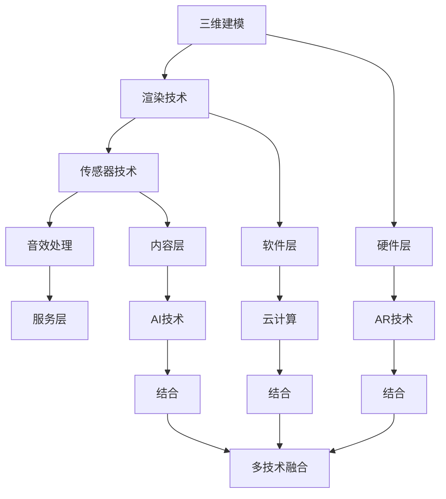

                 

关键词：虚拟现实（VR），商业化，创业，技术趋势，市场分析

> 摘要：本文旨在探讨虚拟现实（VR）技术在商业领域的应用与创业机会。通过对VR技术的背景介绍、核心概念阐述、算法原理分析以及实际案例研究，文章将帮助读者了解VR技术如何改变商业景观，并为其创业提供有力指导。

## 1. 背景介绍

虚拟现实（Virtual Reality，简称VR）是一种通过电脑模拟产生三维空间的视觉、听觉、触觉等感官体验，让用户沉浸于虚拟环境中的一种技术。随着计算机技术、传感器技术、图形处理技术的不断进步，VR技术逐渐从实验室走向市场，并开始引起各行各业的关注。

近年来，VR技术在游戏、娱乐、教育、医疗、军事、房地产等多个领域取得了显著的应用成果。例如，在游戏领域，VR游戏提供了前所未有的沉浸式体验；在教育领域，VR技术被用于模拟实验和场景教学；在医疗领域，VR技术用于手术模拟和康复训练等。

然而，VR技术的商业化仍然面临着诸多挑战。例如，硬件设备的高成本、用户体验的优化、内容的开发以及市场的培育等。尽管如此，VR技术的巨大潜力吸引了众多创业者投身其中，探索VR商业化的新路径。

## 2. 核心概念与联系

### 2.1 虚拟现实技术的核心概念

虚拟现实技术主要包括以下几个核心概念：

- **三维建模**：通过三维建模软件创建三维模型，这是虚拟现实的基础。
- **渲染技术**：渲染技术用于生成真实感图像，是虚拟现实视觉体验的关键。
- **传感器技术**：包括位置传感器、加速度传感器、陀螺仪等，用于实时捕捉用户动作，提供交互反馈。
- **音效处理**：通过音效处理技术，为用户提供沉浸式的听觉体验。

### 2.2 虚拟现实技术的架构

虚拟现实技术的架构可以分为以下几个层次：

- **硬件层**：包括VR头显、手柄、传感器等硬件设备。
- **软件层**：包括VR内容制作工具、引擎（如Unity、Unreal Engine）以及操作系统等。
- **内容层**：包括VR游戏、应用、教育、医疗等具体应用场景的内容。
- **服务层**：提供VR应用的云服务、社交平台、市场推广等。

### 2.3 虚拟现实技术的联系

虚拟现实技术与其他技术的联系主要体现在以下几个方面：

- **与增强现实（AR）的结合**：AR技术可以将虚拟信息叠加到现实世界中，与VR技术结合可以提供更为丰富的交互体验。
- **与云计算的结合**：云计算为VR技术提供了强大的计算支持，特别是对于高负载的应用，如大型虚拟场景的渲染。
- **与人工智能（AI）的结合**：AI技术可以用于改善VR体验，例如通过机器学习算法优化渲染效果，或通过自然语言处理技术实现更加智能的交互。

### 2.4 虚拟现实技术的Mermaid流程图



## 3. 核心算法原理 & 具体操作步骤

### 3.1 算法原理概述

虚拟现实技术的核心算法主要包括三维建模算法、渲染算法、传感器数据处理算法以及音效处理算法。以下将分别对这些算法进行概述：

- **三维建模算法**：通过三角面片（Triangle Mesh）和体素（Voxel）等数据结构来表示三维模型。常用的算法有构造几何体、多边形网格生成等。
- **渲染算法**：用于生成真实感图像。常见的渲染算法有光追踪、基于物理的渲染（PBR）、真实感渲染等。
- **传感器数据处理算法**：用于处理传感器数据，实现用户动作的实时捕捉和反馈。常用的算法有滤波算法、姿态估计算法等。
- **音效处理算法**：用于生成和调整虚拟环境中的音效。常见的算法有虚拟空间混音、声音源定位等。

### 3.2 算法步骤详解

#### 3.2.1 三维建模算法步骤

1. **几何建模**：使用几何建模软件创建三维模型，保存为标准的几何数据格式（如OBJ、PLY）。
2. **网格优化**：对三维模型进行网格优化，以提高渲染效率和降低计算负荷。
3. **纹理映射**：为三维模型贴图，增加模型的细节和真实感。

#### 3.2.2 渲染算法步骤

1. **场景构建**：加载三维模型和场景元素，构建渲染场景。
2. **光照计算**：计算场景中的光照效果，包括环境光、点光源、聚光灯光照等。
3. **渲染管线执行**：执行渲染管线，生成最终的真实感图像。

#### 3.2.3 传感器数据处理算法步骤

1. **传感器数据采集**：采集位置传感器、加速度传感器、陀螺仪等传感器数据。
2. **数据预处理**：对传感器数据进行预处理，如滤波、去噪等。
3. **姿态估计**：使用卡尔曼滤波等算法对传感器数据进行姿态估计。

#### 3.2.4 音效处理算法步骤

1. **声音源定位**：根据用户的位置和移动，对声音源进行定位。
2. **声音混合**：将多个声音源混合，生成最终的音效。
3. **声音播放**：在虚拟环境中播放音效，提供沉浸式听觉体验。

### 3.3 算法优缺点

#### 三维建模算法

- 优点：灵活度高，可以创建各种复杂的三维模型。
- 缺点：建模过程复杂，对建模技能要求较高。

#### 渲染算法

- 优点：可以生成高度真实感的图像，提升用户体验。
- 缺点：计算量大，对硬件性能要求较高。

#### 传感器数据处理算法

- 优点：可以实现与虚拟环境的实时交互。
- 缺点：数据处理复杂，容易出现误差。

#### 音效处理算法

- 优点：可以提供沉浸式听觉体验。
- 缺点：对声音源定位精度要求高，实现较为复杂。

### 3.4 算法应用领域

- **游戏**：VR游戏需要高度真实感的图像和沉浸式交互体验，因此三维建模、渲染和传感器数据处理算法在VR游戏中广泛应用。
- **教育**：虚拟现实技术可以用于模拟实验、场景教学等，三维建模和渲染算法在教育领域具有重要应用。
- **医疗**：VR技术可以用于手术模拟、康复训练等，传感器数据处理算法和音效处理算法在医疗领域具有广泛应用。

## 4. 数学模型和公式 & 详细讲解 & 举例说明

### 4.1 数学模型构建

在虚拟现实技术中，常用的数学模型包括三维空间模型、光照模型、传感器数据处理模型等。以下将介绍其中两个典型的数学模型：

#### 4.1.1 三维空间模型

三维空间模型通常使用三角面片（Triangle Mesh）表示。每个三角面片由三个顶点（\(V_1, V_2, V_3\)）和相应的法向量（\(N_1, N_2, N_3\)）组成。空间模型可以通过以下方程表示：

\[ M = \{ (V_1, N_1), (V_2, N_2), (V_3, N_3) \} \]

#### 4.1.2 光照模型

光照模型用于计算场景中的光照效果。常见的光照模型包括朗伯光照模型（Lambertian lighting）和基于物理的渲染（Physically Based Rendering，PBR）。

朗伯光照模型使用以下公式计算光照：

\[ I = kd \cdot L \cdot N \]

其中，\(I\) 为光照强度，\(kd\) 为反射率，\(L\) 为光照方向，\(N\) 为表面法线。

PBR模型则使用以下公式计算光照：

\[ I = f_r \cdot L \cdot N + f_d \cdot L \cdot N \]

其中，\(f_r\) 和 \(f_d\) 分别为反射率函数和散射率函数。

### 4.2 公式推导过程

#### 4.2.1 朗伯光照模型推导

朗伯光照模型基于光的反射原理，认为光线在表面上的反射是均匀的。因此，光照强度与光照方向和表面法线之间的夹角成正比。

假设光线从点光源 \(L\) 发出，照射到表面点 \(P\)，表面法线为 \(N\)。光线与法线的夹角为 \(\theta\)，则光照强度 \(I\) 可以表示为：

\[ I = \frac{L \cdot N}{N \cdot N} \]

由于 \(N \cdot N = 1\)，因此：

\[ I = L \cdot N \]

考虑到反射率 \(kd\)，最终的公式为：

\[ I = kd \cdot L \cdot N \]

#### 4.2.2 PBR光照模型推导

PBR光照模型考虑了材料的表面特性，包括反射率 \(f_r\) 和散射率 \(f_d\)。光线与法线的夹角为 \(\theta\)，则光照强度 \(I\) 可以表示为：

\[ I = f_r \cdot L \cdot N + f_d \cdot L \cdot N \]

其中，\(f_r\) 和 \(f_d\) 分别为反射率函数和散射率函数。反射率函数 \(f_r\) 用于计算光线在表面上的反射效果，散射率函数 \(f_d\) 用于计算光线在表面上的散射效果。

### 4.3 案例分析与讲解

#### 4.3.1 朗伯光照模型应用案例

假设一个简单的三维场景，包含一个点光源和一个表面为白色的物体。点光源的位置为 \(L = (1, 0, 0)\)，物体的表面法线为 \(N = (0, 1, 0)\)，反射率 \(kd = 0.5\)。根据朗伯光照模型，光照强度 \(I\) 为：

\[ I = 0.5 \cdot (1, 0, 0) \cdot (0, 1, 0) = 0.5 \]

这意味着物体表面受到的光照强度为 0.5。

#### 4.3.2 PBR光照模型应用案例

假设一个具有金属表面特性的物体，反射率函数 \(f_r\) 为高反射率，散射率函数 \(f_d\) 为低散射率。点光源的位置为 \(L = (1, 0, 0)\)，物体的表面法线为 \(N = (0, 1, 0)\)。根据PBR光照模型，光照强度 \(I\) 为：

\[ I = f_r \cdot (1, 0, 0) \cdot (0, 1, 0) + f_d \cdot (1, 0, 0) \cdot (0, 1, 0) \]

由于 \(f_r\) 高于 \(f_d\)，光照强度主要来自反射效果。这可以模拟金属表面在光照下的反射效果。

## 5. 项目实践：代码实例和详细解释说明

### 5.1 开发环境搭建

在开始项目实践之前，我们需要搭建一个适合VR开发的开发环境。以下是搭建步骤：

1. **安装Unity引擎**：Unity是一个广泛应用于VR开发的引擎，可以从Unity官网下载并安装。
2. **安装VR插件**：Unity提供了多个VR插件，如VRMaddict、Oculus Integration等。通过Unity的插件市场下载并安装。
3. **配置开发环境**：在Unity中创建一个新的VR项目，配置项目设置，包括渲染模式、分辨率、帧率等。

### 5.2 源代码详细实现

以下是一个简单的VR项目示例，实现一个基本的三维模型渲染和交互功能。

```csharp
using UnityEngine;

public class VRController : MonoBehaviour
{
    public GameObject model;

    // Start is called before the first frame update
    void Start()
    {
        // 加载三维模型
        model = Instantiate(model);
    }

    // Update is called once per frame
    void Update()
    {
        // 处理用户输入
        if (Input.GetKeyDown(KeyCode.Space))
        {
            // 切换模型显示状态
            model.SetActive(!model.activeInHierarchy);
        }

        // 更新模型位置
        model.transform.Rotate(new Vector3(1, 1, 1) * Time.deltaTime);
    }
}
```

### 5.3 代码解读与分析

1. **加载三维模型**：在`Start`方法中，使用`Instantiate`函数创建并加载三维模型。
2. **处理用户输入**：在`Update`方法中，通过`Input.GetKeyDown`函数检查用户是否按下空格键，实现模型显示状态的切换。
3. **更新模型位置**：通过`Rotate`方法，实时更新模型的位置和旋转角度，实现模型的动态效果。

### 5.4 运行结果展示

运行上述代码后，我们可以在Unity编辑器中看到三维模型被加载并显示。按下空格键可以切换模型的显示状态，模型的旋转角度随时间动态变化，实现简单的交互效果。

## 6. 实际应用场景

虚拟现实技术在商业领域具有广泛的应用场景，以下列举几个典型的应用案例：

- **游戏与娱乐**：VR游戏提供了前所未有的沉浸式体验，吸引了大量玩家。例如，VR射击游戏、角色扮演游戏等。
- **教育**：虚拟现实技术可以用于模拟实验、场景教学等，提高学生的学习兴趣和效果。例如，医学教育、工程教育等。
- **医疗**：VR技术可以用于手术模拟、康复训练等，提高医疗服务的质量和效率。例如，手术规划、康复治疗等。
- **房地产**：虚拟现实技术可以用于虚拟看房、室内设计等，提供更直观的展示和体验。例如，房地产销售、室内设计等。
- **培训**：虚拟现实技术可以用于各种技能培训，如驾驶培训、安全培训等，提供沉浸式学习体验。
- **旅游**：虚拟现实技术可以用于虚拟旅游，让用户足不出户就能体验世界各地的人文景观和自然风光。

### 6.4 未来应用展望

随着虚拟现实技术的不断发展和成熟，其在商业领域的应用前景将更加广阔。以下是几个未来的应用展望：

- **远程工作与协作**：虚拟现实技术可以提供更加真实的远程工作环境，实现高效的远程协作。
- **虚拟购物**：虚拟现实技术可以用于虚拟购物，提供沉浸式的购物体验，改变传统购物模式。
- **智能城市**：虚拟现实技术可以用于城市规划、城市管理等领域，提高城市管理的智能化水平。
- **虚拟社交**：虚拟现实技术可以用于虚拟社交平台，提供更加真实的社交体验，改变传统社交模式。
- **虚拟现实教育**：虚拟现实技术可以用于更广泛的教育场景，提供丰富的教学资源和互动体验，推动教育改革。

## 7. 工具和资源推荐

### 7.1 学习资源推荐

- **《虚拟现实技术原理与应用》**：这本书详细介绍了虚拟现实技术的原理和应用，适合初学者和进阶者阅读。
- **《Unity VR开发实战》**：这本书通过具体的案例，讲解了如何使用Unity引擎进行VR开发，适合Unity开发者阅读。
- **虚拟现实技术论坛**：如VRChina、VR/AR Developer Forum等，可以获取最新的行业动态和技术交流。

### 7.2 开发工具推荐

- **Unity引擎**：Unity是一个功能强大的VR开发引擎，支持多种VR平台。
- **Unreal Engine**：Unreal Engine提供了一个强大的VR开发环境，适合制作高端VR内容。
- **Blender**：Blender是一个开源的三维建模和渲染软件，适合初学者和专业人士。

### 7.3 相关论文推荐

- **"Virtual Reality: The Third Stage of Human-Machine Symbiosis"**：这篇论文探讨了虚拟现实技术的发展阶段和未来趋势。
- **"Enhancing Human-Computer Interaction with Virtual Reality"**：这篇论文分析了虚拟现实技术对人类计算机交互的影响。
- **"Virtual Reality for Training and Simulation"**：这篇论文介绍了虚拟现实技术在培训和学习中的应用。

## 8. 总结：未来发展趋势与挑战

### 8.1 研究成果总结

虚拟现实技术在过去几十年中取得了显著的进展，从实验室走向市场，开始在多个领域展现出巨大的应用潜力。然而，要实现虚拟现实技术的商业化，还需要解决一系列技术、市场和应用方面的挑战。

### 8.2 未来发展趋势

- **硬件成本的降低**：随着技术的进步，VR硬件设备的价格将逐渐降低，为更多用户所接受。
- **内容的丰富与多样化**：随着VR技术的普及，越来越多的企业和开发者将投入VR内容的开发，提供丰富多样的应用场景。
- **与AI的融合**：虚拟现实技术与人工智能的结合将进一步提升用户体验，实现更加智能的交互和更加真实的虚拟环境。

### 8.3 面临的挑战

- **用户体验优化**：如何提升用户体验，减少眩晕感、提高交互效率，是VR技术商业化面临的主要挑战之一。
- **内容开发**：高质量VR内容的开发需要专业的技能和资源，这对初创企业来说是一个巨大的挑战。
- **市场培育**：VR技术的市场培育需要时间和耐心，需要通过有效的推广和营销策略来吸引和留住用户。

### 8.4 研究展望

未来，虚拟现实技术将在更多领域得到应用，如远程办公、虚拟购物、智能城市等。随着技术的不断进步和市场的逐渐成熟，虚拟现实技术将迎来更加广阔的发展空间。

## 9. 附录：常见问题与解答

### Q1: VR技术的主要优势是什么？

A1: VR技术的主要优势包括提供沉浸式体验、高度互动性、丰富的虚拟内容以及能够模拟各种环境和场景。

### Q2: VR技术的商业化面临哪些挑战？

A2: VR技术的商业化主要面临硬件成本高、用户体验优化难、高质量内容开发成本高和市场培育时间长等挑战。

### Q3: 如何评估VR项目的可行性？

A3: 评估VR项目可行性需要考虑技术难度、市场需求、资金投入、团队实力等多方面因素。建议通过市场调研、技术评估和商业计划书等手段进行全面评估。

### Q4: VR技术在教育领域的应用前景如何？

A4: VR技术在教育领域具有广阔的应用前景，可以用于模拟实验、场景教学、在线课程等，提供更直观、更互动的学习体验，有助于提高教育质量和学习效果。

### Q5: 谁是VR技术的先驱？

A5: VR技术的先驱包括VPL Research的杰伦·拉尼尔（Jaron Lanier）和伊凡·苏瑟兰（ Ivan Sutherland），他们在20世纪80年代和90年代分别提出了虚拟现实的概念并进行了相关研究。

### Q6: VR技术的未来发展方向是什么？

A5: VR技术的未来发展方向包括提高用户体验、降低硬件成本、增强与AI的结合、开发更多应用场景以及实现跨平台兼容等。

### Q7: 开发VR应用需要哪些技术？

A7: 开发VR应用需要掌握三维建模、渲染技术、传感器数据处理、音效处理、编程语言（如C#、Python）等核心技术。此外，还需要了解VR开发平台（如Unity、Unreal Engine）和相关插件的使用。

### Q8: VR技术的商业化模式有哪些？

A8: VR技术的商业化模式包括VR游戏、VR影视、VR教育、VR医疗、VR房地产、VR旅游、VR培训、VR营销等。不同领域的商业化模式有所不同，需要根据具体应用场景和市场需求进行选择。

### Q9: VR技术对心理健康有影响吗？

A9: VR技术对心理健康有一定的影响。适当的VR体验可以带来愉悦和放松，但过度或不当使用可能导致焦虑、眩晕等不适感。因此，在使用VR技术时需要注意合理规划和适度使用。

### Q10: 如何保护VR用户的隐私和安全？

A10: 保护VR用户的隐私和安全需要采取一系列措施，包括数据加密、用户身份验证、安全审计、隐私政策等。同时，还需要加强对VR设备的监控和管理，防止数据泄露和恶意攻击。

---

作者：禅与计算机程序设计艺术 / Zen and the Art of Computer Programming

