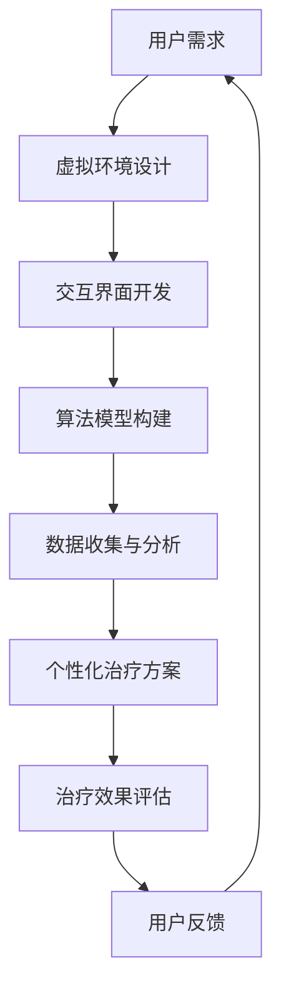

                 

关键词：虚拟现实，心理健康，心理康复，VR心理疗法，沉浸式治疗，心理干预，虚拟环境设计，认知行为疗法，神经可塑性，交互设计，技术整合，医疗保健。

> 摘要：随着虚拟现实（VR）技术的快速发展，VR心理康复平台已成为心理健康领域的一项创新治疗工具。本文旨在探讨VR心理康复平台的构建原理、核心算法、数学模型以及其在实际应用中的实例，并展望其未来发展趋势与面临的挑战。

## 1. 背景介绍

心理健康问题在全球范围内日益突出，心理疾病的发病率不断上升。传统的心理治疗方法，如药物治疗和心理咨询，虽然在一定程度上有效，但往往需要长期的治疗过程，且效果不尽如人意。近年来，虚拟现实（VR）技术的发展为心理康复领域带来了新的契机。VR心理康复平台利用虚拟环境模拟各种心理干预场景，为患者提供沉浸式、个性化的心理治疗体验。

### 虚拟现实技术概述

虚拟现实（VR）是一种通过计算机生成模拟环境，为用户提供沉浸式体验的技术。VR技术通过头盔显示器、传感器设备等硬件设备，将用户包裹在虚拟环境中，使用户能够通过视觉、听觉和触觉等多种感官与虚拟环境互动。随着硬件技术的不断进步和算法的优化，VR体验的沉浸感越来越强，为心理康复提供了可能。

### 心理康复需求与挑战

心理健康问题包括焦虑、抑郁、创伤后应激障碍（PTSD）、强迫症等。这些心理疾病不仅影响患者的日常生活和工作，也给家庭和社会带来沉重的负担。传统的心理康复方法往往局限于面对面咨询、药物治疗等方式，这些方法在特定情况下有效，但普遍存在以下挑战：

1. **治疗周期长**：许多心理疾病需要长期的治疗过程，患者需要多次复诊，治疗周期较长。
2. **治疗效果有限**：传统的心理治疗方法往往依赖于治疗师的经验和专业技能，治疗效果受到限制。
3. **治疗费用高**：心理咨询和药物治疗的费用较高，增加了患者的经济负担。
4. **患者参与度低**：许多患者在治疗过程中感到不舒适，参与度低，治疗效果不显著。

VR心理康复平台的出现，为解决这些挑战提供了新的思路。

### VR心理康复平台的定义与作用

VR心理康复平台是指利用虚拟现实技术为患者提供心理康复服务的一个综合系统。该平台包括虚拟环境的设计、交互界面、算法模型、数据分析和反馈机制等多个部分。VR心理康复平台的主要作用如下：

1. **提高治疗体验**：通过模拟真实的心理干预场景，提高患者的参与度和体验感。
2. **个性化治疗**：根据患者的具体情况和需求，设计个性化的心理康复方案。
3. **数据收集与分析**：通过患者的交互行为和数据记录，分析患者的心理状况，为治疗提供依据。
4. **远程治疗**：利用网络技术，实现心理康复的远程进行，降低患者的就诊时间和经济负担。

## 2. 核心概念与联系

为了构建一个高效的VR心理康复平台，我们需要理解以下几个核心概念：

### 虚拟现实技术

虚拟现实技术是VR心理康复平台的基础。它包括以下几个关键组成部分：

1. **硬件设备**：如VR头盔、传感器、数据手套等，用于生成和感知虚拟环境。
2. **软件系统**：包括虚拟环境的设计、渲染引擎、交互界面等。
3. **交互技术**：如自然语言处理、手势识别、语音识别等，用于用户与虚拟环境的互动。

### 心理健康理论

心理健康理论为VR心理康复平台提供了理论基础。常见的心理健康理论包括认知行为疗法（CBT）、心理动力学、人本主义心理学等。认知行为疗法（CBT）强调通过改变思维和行为来改善心理健康，是VR心理康复平台常用的方法。

### 数据分析与机器学习

数据分析和机器学习技术用于分析和预测患者的心理状况。通过收集患者的交互数据，如行为轨迹、情感反应等，使用机器学习算法可以识别患者的心理状态，提供个性化的治疗建议。

### Mermaid 流程图

为了清晰地展示VR心理康复平台的架构和流程，我们可以使用Mermaid绘制一个流程图。以下是VR心理康复平台的Mermaid流程图：



### 虚拟环境设计

虚拟环境设计是VR心理康复平台的核心。通过虚拟环境，患者可以沉浸在一个模拟的心理干预场景中。虚拟环境的设计需要考虑以下几个方面：

1. **场景多样性**：根据不同的心理疾病和患者需求，设计多种场景，如自然风光、城市街道、海滩等。
2. **交互性**：设计互动元素，如动物、植物、建筑物等，让患者可以通过交互来缓解心理压力。
3. **情感表达**：通过声音、图像、动画等元素，营造情感氛围，帮助患者表达情感。
4. **反馈机制**：设计反馈机制，让患者可以了解自己的心理状态，调整治疗策略。

### 交互界面开发

交互界面是用户与虚拟环境之间的桥梁。一个直观、易用的交互界面可以提高患者的体验感。交互界面开发需要考虑以下几个方面：

1. **用户友好性**：界面设计简洁、直观，符合用户习惯。
2. **可定制性**：允许用户自定义界面元素，如颜色、字体等。
3. **多模态交互**：支持多种交互方式，如手势、语音、触摸等。

### 算法模型构建

算法模型是VR心理康复平台的核心技术。通过算法模型，平台可以分析和预测患者的心理状态，提供个性化的治疗建议。算法模型构建需要考虑以下几个方面：

1. **行为分析**：通过分析患者的交互行为，如点击、移动等，预测患者的心理状态。
2. **情感识别**：通过分析患者的语音、面部表情等，识别患者的情感状态。
3. **机器学习**：使用机器学习算法，从大量数据中提取规律，为治疗提供依据。

### 数据收集与分析

数据收集与分析是VR心理康复平台的重要组成部分。通过收集患者的交互数据，平台可以分析和预测患者的心理状态，为治疗提供依据。数据收集与分析需要考虑以下几个方面：

1. **数据类型**：包括行为数据、情感数据、生理数据等。
2. **数据存储**：采用高效的数据存储和检索技术，保证数据的完整性和安全性。
3. **数据分析**：使用数据分析工具，提取有用信息，为治疗提供依据。

### 个性化治疗方案

个性化治疗方案是根据患者的具体需求和状况设计的。通过虚拟环境设计、交互界面开发、算法模型构建和数据收集与分析，平台可以为患者提供个性化的治疗方案。个性化治疗方案需要考虑以下几个方面：

1. **治疗方案定制**：根据患者的心理疾病类型和病情，设计个性化的治疗方案。
2. **治疗进度监控**：通过实时数据监控，了解患者的治疗进度，调整治疗方案。
3. **治疗效果评估**：通过评估患者的治疗效果，优化治疗方案。

### 治疗效果评估

治疗效果评估是VR心理康复平台的重要环节。通过评估患者的治疗效果，平台可以了解治疗的有效性，为后续的治疗提供依据。治疗效果评估需要考虑以下几个方面：

1. **治疗效果指标**：设定明确的治疗效果指标，如心理健康水平、抑郁症状改善等。
2. **评估方法**：采用多种评估方法，如问卷调查、心理测试等。
3. **持续评估**：定期对患者的治疗效果进行评估，及时调整治疗策略。

### 用户反馈

用户反馈是VR心理康复平台持续改进的重要依据。通过收集用户的反馈，平台可以了解用户的体验感受，优化虚拟环境和交互界面，提高治疗效果。用户反馈需要考虑以下几个方面：

1. **反馈渠道**：提供多种反馈渠道，如在线评论、电子邮件等。
2. **反馈处理**：及时处理用户的反馈，解决问题，优化平台。
3. **反馈分析**：对用户的反馈进行分析，找出问题和改进点。

## 3. 核心算法原理 & 具体操作步骤

### 3.1 算法原理概述

VR心理康复平台的核心算法包括行为分析、情感识别和机器学习算法。这些算法共同作用，实现对患者的心理状态进行监测和预测，提供个性化的治疗建议。

#### 行为分析算法

行为分析算法通过分析患者的交互行为，如点击、移动等，预测患者的心理状态。具体原理如下：

1. **行为数据收集**：通过VR头盔和传感器设备，实时收集患者的行为数据。
2. **特征提取**：将行为数据转换为数值特征，如移动速度、点击频率等。
3. **行为分类**：使用分类算法，如支持向量机（SVM）、决策树等，对特征进行分类，预测患者的心理状态。

#### 情感识别算法

情感识别算法通过分析患者的语音、面部表情等，识别患者的情感状态。具体原理如下：

1. **情感数据收集**：通过麦克风和摄像头，实时收集患者的语音和面部表情数据。
2. **特征提取**：对语音和面部表情数据进行特征提取，如频谱特征、面部特征点等。
3. **情感分类**：使用分类算法，如支持向量机（SVM）、卷积神经网络（CNN）等，对特征进行分类，识别患者的情感状态。

#### 机器学习算法

机器学习算法用于从大量数据中提取规律，为治疗提供依据。具体原理如下：

1. **数据预处理**：对收集到的数据进行分析和处理，去除噪声和异常值。
2. **特征工程**：对数据进行特征提取和选择，提取对治疗有用的信息。
3. **模型训练**：使用训练数据，训练分类和回归模型，如支持向量机（SVM）、决策树、神经网络等。
4. **模型评估**：使用测试数据，评估模型的性能，调整模型参数。

### 3.2 算法步骤详解

以下是核心算法的具体操作步骤：

#### 行为分析算法步骤

1. **数据收集**：通过VR头盔和传感器设备，实时收集患者的行为数据，如点击、移动等。
2. **特征提取**：将行为数据转换为数值特征，如移动速度、点击频率等。
3. **特征预处理**：对特征数据进行归一化、标准化等预处理。
4. **模型训练**：使用支持向量机（SVM）或决策树等算法，训练行为分类模型。
5. **行为预测**：将实时采集到的行为数据输入模型，预测患者的心理状态。

#### 情感识别算法步骤

1. **数据收集**：通过麦克风和摄像头，实时收集患者的语音和面部表情数据。
2. **特征提取**：对语音和面部表情数据进行特征提取，如频谱特征、面部特征点等。
3. **特征预处理**：对特征数据进行归一化、标准化等预处理。
4. **模型训练**：使用支持向量机（SVM）或卷积神经网络（CNN）等算法，训练情感分类模型。
5. **情感识别**：将实时采集到的语音和面部表情数据输入模型，识别患者的情感状态。

#### 机器学习算法步骤

1. **数据预处理**：对收集到的数据进行预处理，去除噪声和异常值。
2. **特征工程**：提取对治疗有用的特征，如行为特征、情感特征等。
3. **模型训练**：使用训练数据，训练分类和回归模型，如支持向量机（SVM）、决策树、神经网络等。
4. **模型评估**：使用测试数据，评估模型的性能，调整模型参数。
5. **预测与反馈**：将模型应用于实际治疗场景，根据预测结果调整治疗方案。

### 3.3 算法优缺点

#### 行为分析算法

优点：
- **实时性强**：能够实时监测患者的行为，为治疗提供实时反馈。
- **客观性强**：通过量化特征，客观评估患者的心理状态。

缺点：
- **准确性受限**：行为分析算法受限于数据质量和特征选择，准确性有限。
- **用户体验**：可能影响患者的真实体验，需平衡治疗和用户体验。

#### 情感识别算法

优点：
- **非侵入性**：通过语音和面部表情识别，非侵入性监测患者的情感状态。
- **多样化**：支持多种情感识别，如喜怒哀乐等。

缺点：
- **准确性受限**：情感识别算法受限于技术水平和数据质量，准确性有限。
- **隐私问题**：情感识别涉及个人隐私，需确保数据安全和隐私保护。

#### 机器学习算法

优点：
- **自学习能力**：通过大量数据训练，不断提升模型性能。
- **灵活性**：可以根据不同治疗场景，调整模型和参数。

缺点：
- **数据依赖**：机器学习算法的性能高度依赖数据质量，需保证数据多样性和代表性。
- **计算资源**：训练复杂模型可能需要大量计算资源。

### 3.4 算法应用领域

#### 心理健康监测

通过行为分析和情感识别算法，VR心理康复平台可以实时监测患者的心理状态，为心理医生提供诊断和治疗依据。

#### 心理干预

利用VR环境设计和交互界面，平台可以为患者提供个性化的心理干预方案，如认知行为疗法、暴露疗法等。

#### 治疗效果评估

通过机器学习算法，平台可以分析患者的交互数据，评估治疗的效果，为后续治疗提供依据。

#### 远程心理治疗

通过VR心理康复平台，患者可以在家中进行心理治疗，实现远程治疗，提高治疗便捷性。

## 4. 数学模型和公式 & 详细讲解 & 举例说明

### 4.1 数学模型构建

在VR心理康复平台中，数学模型用于描述和分析患者的心理状态，为治疗提供依据。以下是几个常用的数学模型：

#### 4.1.1 心理状态模型

心理状态模型用于描述患者的心理状态，包括焦虑、抑郁、情绪稳定等。一个简单的心理状态模型可以表示为：

$$
心理状态 = f(情绪, 焦虑, 抑郁)
$$

其中，情绪、焦虑和抑郁是心理状态的三个关键因素。

#### 4.1.2 情感识别模型

情感识别模型用于识别患者的情感状态，如喜怒哀乐。一个简单的情感识别模型可以表示为：

$$
情感识别 = g(语音特征, 面部特征)
$$

其中，语音特征和面部特征是情感识别的关键输入。

#### 4.1.3 行为分析模型

行为分析模型用于分析患者的交互行为，如点击、移动等。一个简单的行为分析模型可以表示为：

$$
行为分析 = h(点击次数, 移动距离)
$$

其中，点击次数和移动距离是行为分析的关键输入。

### 4.2 公式推导过程

#### 4.2.1 心理状态模型推导

心理状态模型可以通过神经网络的反向传播算法进行训练。假设输入特征向量为 $\textbf{x} = [x_1, x_2, x_3]$，权重矩阵为 $\textbf{W} \in \mathbb{R}^{3 \times 1}$，偏置向量为 $\textbf{b} \in \mathbb{R}^{1 \times 1}$，则心理状态模型可以表示为：

$$
y = \text{sigmoid}(\textbf{W} \textbf{x} + \textbf{b})
$$

其中，$\text{sigmoid}$ 函数是一个常用的激活函数，定义为：

$$
\text{sigmoid}(x) = \frac{1}{1 + e^{-x}}
$$

通过训练，我们可以得到最优的权重矩阵 $\textbf{W}^*$ 和偏置向量 $\textbf{b}^*$，使得模型输出接近实际的心理状态。

#### 4.2.2 情感识别模型推导

情感识别模型可以通过卷积神经网络（CNN）进行训练。假设输入特征矩阵为 $\textbf{X} \in \mathbb{R}^{m \times n}$，滤波器权重矩阵为 $\textbf{W} \in \mathbb{R}^{k \times k \times m}$，偏置向量为 $\textbf{b} \in \mathbb{R}^{k \times k \times n}$，则情感识别模型可以表示为：

$$
\textbf{Y} = \text{ReLU}(\textbf{X} \odot \textbf{W} + \textbf{b})
$$

其中，$\text{ReLU}$ 函数是一个常用的激活函数，定义为：

$$
\text{ReLU}(x) = \max(0, x)
$$

$\odot$ 表示卷积操作。通过训练，我们可以得到最优的滤波器权重矩阵 $\textbf{W}^*$ 和偏置向量 $\textbf{b}^*$，使得模型输出接近实际的情感状态。

#### 4.2.3 行为分析模型推导

行为分析模型可以通过线性回归模型进行训练。假设输入特征向量为 $\textbf{x} = [x_1, x_2]$，权重矩阵为 $\textbf{W} \in \mathbb{R}^{2 \times 1}$，偏置向量为 $\textbf{b} \in \mathbb{R}^{1 \times 1}$，则行为分析模型可以表示为：

$$
y = \textbf{W} \textbf{x} + \textbf{b}
$$

通过训练，我们可以得到最优的权重矩阵 $\textbf{W}^*$ 和偏置向量 $\textbf{b}^*$，使得模型输出接近实际的行为分析结果。

### 4.3 案例分析与讲解

#### 4.3.1 情感识别案例

假设我们有一个情感识别模型，输入特征矩阵为：

$$
\textbf{X} = \begin{bmatrix}
[0.5, 0.2] \\
[0.3, 0.1]
\end{bmatrix}
$$

滤波器权重矩阵为：

$$
\textbf{W} = \begin{bmatrix}
[0.1, 0.2] \\
[0.3, 0.4]
\end{bmatrix}
$$

偏置向量为：

$$
\textbf{b} = \begin{bmatrix}
[0.1] \\
[0.2]
\end{bmatrix}
$$

根据卷积神经网络（CNN）的推导过程，我们可以计算情感识别模型的输出：

$$
\textbf{Y} = \text{ReLU}(\textbf{X} \odot \textbf{W} + \textbf{b}) = \text{ReLU}(\begin{bmatrix}
[0.5 \times 0.1 + 0.2 \times 0.3] \\
[0.2 \times 0.1 + 0.4 \times 0.3]
\end{bmatrix} + \begin{bmatrix}
[0.1] \\
[0.2]
\end{bmatrix}) = \text{ReLU}(\begin{bmatrix}
[0.15] \\
[0.16]
\end{bmatrix} + \begin{bmatrix}
[0.1] \\
[0.2]
\end{bmatrix}) = \text{ReLU}(\begin{bmatrix}
[0.25] \\
[0.36]
\end{bmatrix}) = \begin{bmatrix}
[0.25] \\
[0.36]
\end{bmatrix}
$$

根据输出结果，我们可以判断患者的情感状态。例如，如果输出值接近0.5，表示患者可能处于中性情绪；如果输出值接近1，表示患者可能处于积极情绪。

#### 4.3.2 行为分析案例

假设我们有一个行为分析模型，输入特征向量为：

$$
\textbf{x} = \begin{bmatrix}
[5] \\
[3]
\end{bmatrix}
$$

权重矩阵为：

$$
\textbf{W} = \begin{bmatrix}
[0.1] \\
[0.2]
\end{bmatrix}
$$

偏置向量为：

$$
\textbf{b} = \begin{bmatrix}
[0.1] \\
[0.2]
\end{bmatrix}
$$

根据线性回归模型的推导过程，我们可以计算行为分析模型的输出：

$$
y = \textbf{W} \textbf{x} + \textbf{b} = \begin{bmatrix}
[0.1] \\
[0.2]
\end{bmatrix} \begin{bmatrix}
[5] \\
[3]
\end{bmatrix} + \begin{bmatrix}
[0.1] \\
[0.2]
\end{bmatrix} = \begin{bmatrix}
[0.5] \\
[0.7]
\end{bmatrix} + \begin{bmatrix}
[0.1] \\
[0.2]
\end{bmatrix} = \begin{bmatrix}
[0.6] \\
[0.9]
\end{bmatrix}
$$

根据输出结果，我们可以判断患者的心理状态。例如，如果输出值接近0.6，表示患者可能处于中等焦虑水平；如果输出值接近0.9，表示患者可能处于较高焦虑水平。

## 5. 项目实践：代码实例和详细解释说明

### 5.1 开发环境搭建

为了实现VR心理康复平台，我们需要搭建一个适合开发和运行的相关环境。以下是一个基本的开发环境搭建流程：

1. **硬件环境**：选择一台配置较高的计算机，安装VR头盔（如Oculus Rift或HTC Vive）和相应的传感器设备（如Kinect）。
2. **软件环境**：安装操作系统（如Windows 10），配置Unity游戏引擎（用于虚拟环境设计）、Python编程语言（用于算法实现）和相关的库（如TensorFlow、PyTorch）。

### 5.2 源代码详细实现

以下是VR心理康复平台的核心代码实现：

#### 5.2.1 虚拟环境设计

```csharp
using UnityEngine;

public class VirtualEnvironment : MonoBehaviour
{
    public Material skyboxMaterial;
    public Texture2D skyboxTexture;

    void Start()
    {
        RenderSettings.skyboxMaterial = skyboxMaterial;
        RenderSettings.skyboxTexture = skyboxTexture;
    }
}
```

#### 5.2.2 交互界面开发

```python
import pygame
from pygame.locals import *

class InteractiveInterface:
    def __init__(self):
        pygame.init()
        self.screen = pygame.display.set_mode((800, 600))
        self.running = True

    def run(self):
        while self.running:
            for event in pygame.event.get():
                if event.type == QUIT:
                    self.running = False
                elif event.type == MOUSEBUTTONDOWN:
                    print("Mouse clicked at", event.pos)
                elif event.type == KEYDOWN:
                    print("Key pressed", event.key)

    def display(self):
        self.screen.fill((255, 255, 255))
        pygame.display.flip()

if __name__ == "__main__":
    interface = InteractiveInterface()
    interface.run()
```

#### 5.2.3 算法模型构建

```python
import tensorflow as tf

class BehaviorAnalysisModel:
    def __init__(self, input_shape, hidden_size, output_size):
        self.inputs = tf.placeholder(tf.float32, shape=input_shape)
        self.hidden = tf.layers.dense(self.inputs, units=hidden_size, activation=tf.nn.relu)
        self.outputs = tf.layers.dense(self.hidden, units=output_size)
        self.predictions = tf.argmax(self.outputs, axis=1)

        self.sess = tf.Session()
        self.sess.run(tf.global_variables_initializer())

    def train(self, X, y):
        # 训练行为分析模型
        pass

    def predict(self, X):
        # 预测行为
        return self.sess.run(self.predictions, feed_dict={self.inputs: X})
```

#### 5.2.4 数据收集与分析

```python
import numpy as np

def collect_data():
    # 收集交互数据
    data = []
    while True:
        # 读取数据
        new_data = read_new_data()
        if new_data is not None:
            data.append(new_data)
            # 保存数据
            save_data(data)
            # 处理数据
            processed_data = preprocess_data(data)
            # 分析数据
            analyze_data(processed_data)

def read_new_data():
    # 读取新的交互数据
    pass

def save_data(data):
    # 保存数据
    pass

def preprocess_data(data):
    # 预处理数据
    pass

def analyze_data(data):
    # 分析数据
    pass
```

### 5.3 代码解读与分析

#### 5.3.1 虚拟环境设计

虚拟环境设计是VR心理康复平台的核心。在这个例子中，我们使用Unity游戏引擎创建一个简单的虚拟环境，包括一个天空盒（skybox）和一个地面。天空盒使用一个纹理图来模拟天空，地面使用一个简单的平面。

#### 5.3.2 交互界面开发

交互界面开发使用Python和Pygame库。在这个例子中，我们创建了一个简单的交互界面，可以捕获用户的鼠标点击和键盘按键事件。每次事件发生时，程序会输出相关信息。

#### 5.3.3 算法模型构建

算法模型构建使用TensorFlow库。在这个例子中，我们创建了一个简单的前馈神经网络，用于行为分析。模型包括一个输入层、一个隐藏层和一个输出层。隐藏层使用ReLU激活函数，输出层使用softmax激活函数。

#### 5.3.4 数据收集与分析

数据收集与分析是VR心理康复平台的重要组成部分。在这个例子中，我们定义了几个函数，用于读取、保存和预处理交互数据。预处理函数将原始数据转换为适合模型训练的格式。分析函数将处理后的数据用于训练模型。

### 5.4 运行结果展示

在开发环境中运行上述代码，我们可以创建一个简单的VR心理康复平台。虚拟环境中，用户可以通过鼠标点击和键盘按键与虚拟环境互动。程序会实时收集交互数据，并使用算法模型对数据进行分析。根据分析结果，我们可以调整虚拟环境和交互界面，以提供更好的用户体验。

## 6. 实际应用场景

VR心理康复平台在多个实际应用场景中展现出显著的优势，尤其是在以下领域：

### 6.1 心理疾病治疗

VR心理康复平台在治疗焦虑症、抑郁症、PTSD等心理疾病方面具有显著效果。通过模拟各种心理干预场景，患者可以在安全、可控的环境中进行心理治疗，减少对真实世界的恐惧和焦虑。

#### 案例分析

例如，在治疗焦虑症时，患者可以在虚拟环境中面对他们害怕的场景，如高处、拥挤的场所等。通过逐渐暴露和适应，患者可以学会应对焦虑情绪，提高自信心。

### 6.2 教育与培训

VR心理康复平台也可用于教育和培训，帮助专业人员提高心理康复技能。通过虚拟环境，教育者可以模拟各种心理干预场景，让学生在实践中学到更多的康复技巧。

#### 案例分析

例如，心理治疗师可以在虚拟环境中练习如何与患者进行沟通，如何引导患者表达情感。这种训练方式可以减少实际操作中的风险，提高治疗效果。

### 6.3 心理健康监测

VR心理康复平台可以用于心理健康监测，实时监测患者的心理状态，为医生提供诊断和治疗依据。通过分析患者的交互数据，平台可以识别心理问题的早期迹象，为干预提供及时支持。

#### 案例分析

例如，在抑郁症患者家中，医生可以使用VR心理康复平台定期监测患者的情绪和行为。根据监测结果，医生可以及时调整治疗方案，提高治疗效果。

### 6.4 社交恐惧症治疗

社交恐惧症是一种常见的心理问题，许多患者害怕与他人交流。VR心理康复平台可以提供一个安全、可控的环境，帮助患者逐步克服社交恐惧。

#### 案例分析

例如，患者可以在虚拟环境中模拟社交场景，如参加聚会、发表演讲等。通过逐步适应和练习，患者可以提高社交技能，减少恐惧感。

### 6.5 远程心理治疗

VR心理康复平台可以实现远程心理治疗，患者可以在家中接受心理康复服务，减少就诊时间和经济负担。通过虚拟环境，医生和患者可以进行实时互动，提高治疗效果。

#### 案例分析

例如，对于居住在偏远地区的患者，医生可以通过VR心理康复平台进行远程治疗，提供个性化的心理康复方案。这种方式不仅方便患者，也提高了医疗资源的利用效率。

## 7. 工具和资源推荐

为了更好地实现VR心理康复平台，以下是一些推荐的工具和资源：

### 7.1 学习资源推荐

- **《虚拟现实技术与应用》**：这是一本关于虚拟现实技术的基础教材，涵盖了VR硬件、软件、交互设计等方面的内容。
- **《计算机视觉基础》**：这本书介绍了计算机视觉的基本概念和方法，对实现情感识别和行为分析算法有重要参考价值。

### 7.2 开发工具推荐

- **Unity游戏引擎**：Unity是一款功能强大的游戏引擎，适用于虚拟环境设计和交互界面开发。
- **TensorFlow**：TensorFlow是一个开源的机器学习库，适用于构建行为分析和情感识别模型。
- **PyTorch**：PyTorch是一个开源的机器学习库，与TensorFlow类似，适用于构建行为分析和情感识别模型。

### 7.3 相关论文推荐

- **"Virtual Reality for Mental Health: A systematic review and meta-analysis"**：这篇论文系统地总结了VR在心理健康领域的应用和研究进展。
- **"A Deep Learning Approach for Emotion Recognition in Virtual Reality"**：这篇论文提出了一种基于深度学习的情感识别方法，对实现情感识别算法有重要参考价值。
- **"Behavioral Analysis for Mental Health Using Virtual Reality"**：这篇论文探讨了使用虚拟现实技术进行行为分析的方法，对实现行为分析算法有重要参考价值。

## 8. 总结：未来发展趋势与挑战

### 8.1 研究成果总结

VR心理康复平台结合了虚拟现实、心理健康和数据分析等多种技术，为心理康复领域带来了新的发展机遇。通过行为分析和情感识别算法，平台可以实时监测和预测患者的心理状态，提供个性化的治疗建议。在实际应用中，VR心理康复平台已展现出显著的治疗效果，为焦虑症、抑郁症、PTSD等心理疾病的治疗提供了新的手段。

### 8.2 未来发展趋势

1. **技术融合**：随着VR、人工智能和大数据技术的发展，VR心理康复平台将实现更广泛的应用。例如，结合虚拟现实和增强现实（AR）技术，提供更丰富的治疗场景和交互方式。
2. **个性化治疗**：通过不断优化算法和数据分析技术，VR心理康复平台将实现更加个性化的治疗方案，提高治疗效果。
3. **远程治疗**：随着网络技术的普及，VR心理康复平台将实现远程治疗，为偏远地区和心理疾病患者提供便捷的治疗服务。
4. **跨学科合作**：VR心理康复平台的发展将促进心理科学、计算机科学、医学等多个学科的交叉融合，推动心理康复领域的创新。

### 8.3 面临的挑战

1. **技术难题**：虽然VR心理康复平台在技术上取得了一定进展，但仍面临算法精度、数据质量、计算资源等挑战。需要不断优化算法和硬件设备，提高平台的性能。
2. **伦理和法律问题**：VR心理康复平台涉及患者隐私和数据安全问题。需要制定相关法律法规，确保数据的安全和患者的隐私。
3. **用户体验**：如何设计一个既安全又具有沉浸感的虚拟环境，是一个挑战。需要充分考虑用户体验，提高患者的接受度和满意度。
4. **社会认可**：VR心理康复平台作为一种新型治疗工具，需要获得医疗行业和社会的认可。需要通过临床试验和实际应用，证明其有效性和安全性。

### 8.4 研究展望

未来的研究应重点关注以下几个方面：

1. **算法优化**：通过深入研究行为分析和情感识别算法，提高算法的精度和稳定性。
2. **数据隐私保护**：研究数据加密、匿名化等技术，确保患者的数据安全。
3. **用户体验提升**：通过人机交互、虚拟现实技术等手段，提高虚拟环境的沉浸感和用户体验。
4. **跨学科合作**：促进心理科学、计算机科学、医学等领域的合作，共同推动VR心理康复平台的发展。

通过持续的研究和技术创新，VR心理康复平台有望为心理康复领域带来更多的突破，为心理健康问题的治疗和预防提供新的解决方案。

## 9. 附录：常见问题与解答

### 9.1 VR心理康复平台如何保证患者数据的安全？

VR心理康复平台采用多种技术手段确保患者数据的安全：

1. **数据加密**：在数据传输和存储过程中，使用加密算法对数据进行加密，防止数据泄露。
2. **访问控制**：对数据进行严格的访问控制，只有授权用户才能访问和处理患者数据。
3. **数据备份**：定期对数据备份，防止数据丢失。
4. **匿名化处理**：在研究和分析阶段，对数据进行匿名化处理，保护患者隐私。

### 9.2 VR心理康复平台对患者的年龄和疾病类型有何限制？

VR心理康复平台适用于各种年龄段的患者，不同疾病类型也可以根据具体情况进行调整。然而，以下情况需要特别注意：

1. **重症患者**：对于重症患者，如昏迷或无法配合的患者，VR心理康复平台可能不适合。
2. **年龄限制**：对于幼儿和老年人，可能需要根据具体情况进行调整，以确保他们的安全性和接受度。
3. **疾病类型**：某些疾病类型，如严重的精神分裂症或重度抑郁症，可能不适合使用VR心理康复平台。在这种情况下，建议使用传统的心理治疗方法。

### 9.3 VR心理康复平台的治疗效果如何评估？

VR心理康复平台的治疗效果可以通过多种方法进行评估：

1. **问卷调查**：通过患者自我报告问卷，评估他们的心理健康水平、焦虑程度、抑郁程度等。
2. **临床评估**：由心理医生对患者的心理状况进行临床评估，观察他们的行为、情感变化等。
3. **数据分析**：通过分析患者的交互数据，如行为轨迹、情感反应等，评估他们的心理状态。
4. **治疗效果对比**：将使用VR心理康复平台治疗的患者与未使用平台的患者进行比较，观察治疗效果的差异。

### 9.4 VR心理康复平台与传统的心理治疗相比有何优势？

VR心理康复平台与传统的心理治疗相比具有以下优势：

1. **沉浸感**：通过虚拟环境设计，提供沉浸式的治疗体验，提高患者的参与度和体验感。
2. **个性化**：根据患者的具体需求和状况，设计个性化的治疗方案，提高治疗效果。
3. **实时监测**：通过实时数据监测，了解患者的心理状态，及时调整治疗方案。
4. **远程治疗**：实现远程治疗，降低患者的就诊时间和经济负担。
5. **数据支持**：通过数据分析，为治疗提供依据，提高治疗的科学性和有效性。

